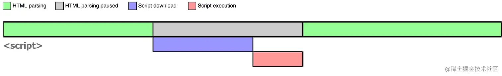
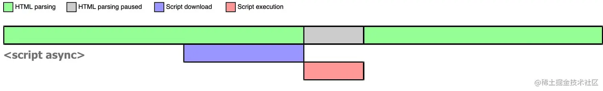
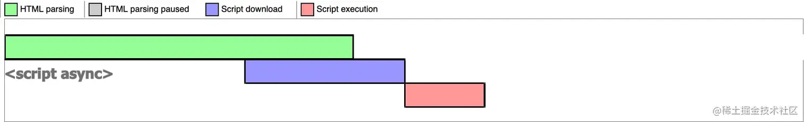
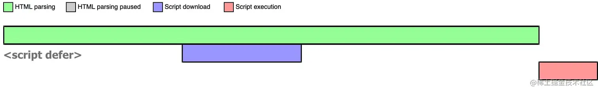
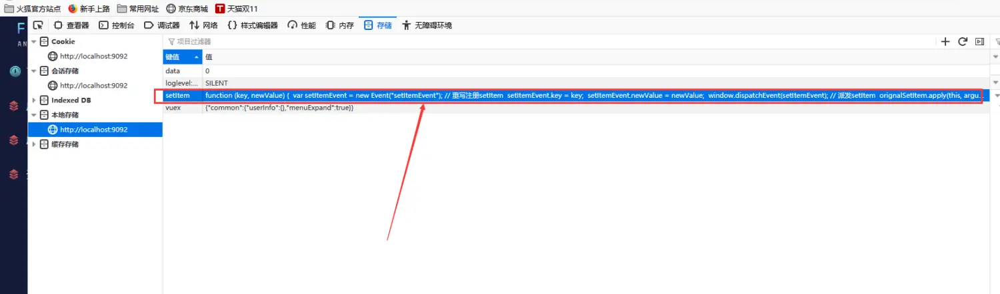
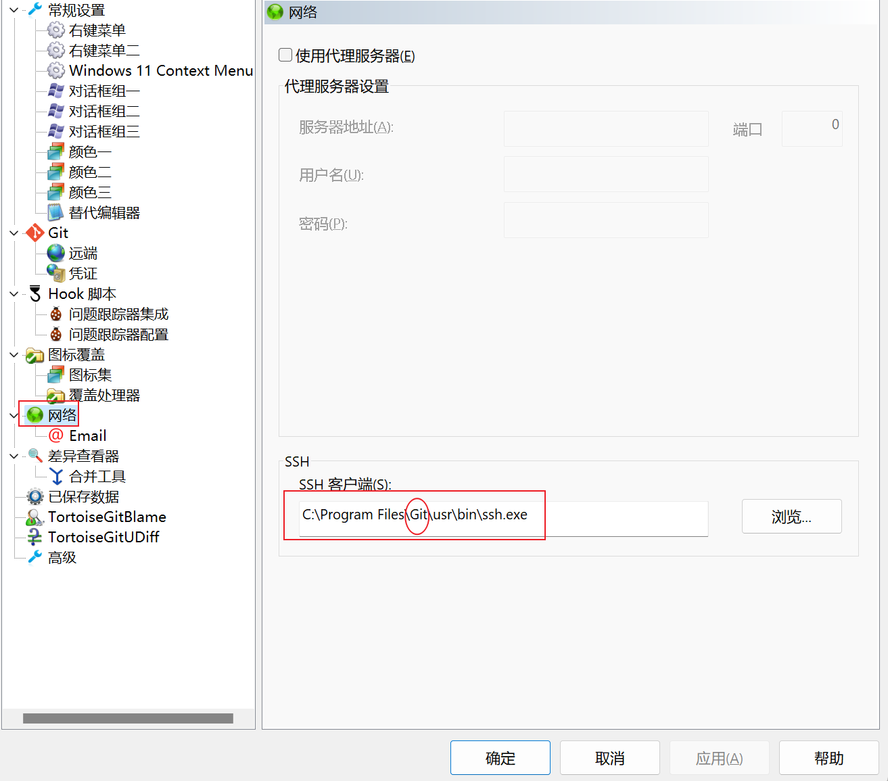

---

## 👮我是个保安

<iframe src="https://cn.widgetstore.net/view/index.html?q=0a4ec1f962b061f30b9e70011eb1b10b.e22ab3646471fcb0000b7c2f7fefe3fe" data-src="" border="0" frameborder="no" framespacing="0" allowfullscreen="true" style="width: 2022px; height: 155px;"></iframe>

---

## 🥞自带小熊饼干

* 🗑提桶

  * Node
  * Vue
  * React
  * 小程序

* 🚌跑路

  * TypeScript
  * JavaScript
  * CSS

---

## 🏃‍♂️上班只为下班

### cookie与请求携带

[➡️cookie传送门](https://juejin.cn/post/6844904034181070861)

* 关于`cookie`​：`cookie`​就是一段数据，在浏览器后台查看时就是一串字符串，里面保存了一些信息。存储是以 `Name=Value`​ 的形式。**后端可以利用 cookie 存储用户信息在用户浏览器中。**  http请求是无状态的，利用cookie可以保存用户的信息状态等。

  ​`http`​请求是无状态的，`cookie`​保存的用户的信息，可以用来解决http无状态的问题。

  ​`cookie`​除了本地`js`​可以设置之外，每次发起请求之后，后端返回也可以设置`cookie`​保存在浏览器中，可以通过请求头里的`set-cookie`​进行查看，一个`set-cookie`​代表设置一个`cookie`​，一个请求返回的响应头中，可以有多个`set-cookie`​。

  请求器发起每次发起请求时，会把`cookie`​携带过去给服务器（是否真正携带cookie要分具体场景），`cookie`​中一般包含了用户的信息，所以`cookie`​能够解决`http`​无状态的问题。

  ​`cookie`​本地查看的时候一串字符串，存储的信息是`name=value`​的信息，多个`cookie`​之间通过` ; `​来区分。

  ​`cookie`​也有属于它的属性，可以设置`cookie`​所使用的**域**名、`cookie`​**过期时间**、`cookie`​是否可以使用js来获取、`cookie`​是否可以第三方携带。  
  简单的理解：`cookie`​用来保存后端返回的用户信息，来识别用户身份，通过设置属性来限制`cookie`​的使用。  
  ​
* cookie的属性

  ```javascript
  1.Domain、Path
  ​Domain​和Path​属性定义了cookie的范围。本质上是告诉浏览器cookie属于哪个站点。
  为了明显的安全原因，cookie只能在当前资源的顶级域名或者子级域名上设置，不能再其他域名和对应的子级域名上设置。例如，example.org​站点不能设置一个domain是foo.com​的cookie，因为不会允许example.org​站点去控制foo.com​的cookie。
  如果cookie的Domain​和Path​属性没有被服务端指定，它们默认是当前请求资源的domain以及path。然而，在大多数浏览器中，foo.com​中的cookie没有设置domain和设置了domain属性是有区别的。
  在前一种情况下，cookie只会被发送foo.com​的请求。在后一种情况下，所有的子域都会包含这个cookie(例如，docs.foo.com​)，IE中这条规则是例外的，在IE中这两种情况cookie都会被发送给所有的子域。

  2.Expire、Max-Age
  ​Expires​属性定义了一个指定的日期和时间，到了这个日期或时间时，浏览器应该删掉cookie。日期和时间的指定格式是Wdy, DD Mon YYYY HH:MM:SS GMT​或者Wdy, DD Mon YY HH:MM:SS GMT​，其中YY的值大于等于0小于等于69。
  作为一种选择，Max-Age​属性可以用来设置cookie的有效期，以相对于浏览器接收到cookie之后的秒数来计算。

  3.Secure
  如果一个 cookie 被设置了Secure\=true​，那么这个cookie只能用https协议发送给服务器，用 http 协议是不发送的。换句话说，cookie 是在https​的情况下创建的，而且他的Secure\=true，那么之后你一直用https访问其他的页面（比如登录之后点击其他子页面），cookie会被发送到服务器，你无需重新登录就可以跳转到其他页面。但是如果这是你把url改成http协议访问其他页面，你就需要重新登录了，因为这个cookie不能在http协议中发送。

  4.HttpOnly
  cooke只能通过http请求携带， js脚本将无法读取到cookie信息，这样能有效的防止XSS攻击，窃取cookie内容，这样就增加了cookie的安全性，即便是这样，也不要将重要信息存入cookie

  5.SameSite
  和第三方cookie相关，有三个值：Strict、Lax、None
  ​Strict​最为严格，完全禁止第三方 Cookie，跨站点时，任何情况下都不会发送 Cookie。换言之，只有当前网页的 URL 与请求目标一致，才会带上 Cookie。
  Lax​规则稍稍放宽，大多数情况也是不发送第三方 Cookie，但是导航到目标网址的 Get 请求除外。
  None​无论是否跨站都会发送 Cookie。必须同时加上 Secure 属性，否则无效， 也就是说只支持 HTTPS。
  ```
* 同源跨域：是浏览器的安全策略

  ```javascript
  同源指的是两个 URL 地址具有相同的**协议地址、主机名、端口号。**

  其中有一个不一样就是跨域

  跨域请求产生时，请求是发出去了，也是有响应的，仅仅是浏览器同源策略，认为不安全，拦截了结果，不将数据传递我们使用罢了。
  ```
* 关于请求携带cookie

  ```javascript
  1.同源情况下
  请求会自动携带同源下cookie，在请求头中发送到服务器，其中具体的发送逻辑可以参考下cookie的属性配置

  2.跨域请求下，需要区分场景，浏览器默认  跨域请求一律不携带cookie  ，除非ajax请求中手动写了配置需要携带cookie
  简单请求就是请求同时是 简单的方法 和 简单的请求头
  浏览器会先发起一个 预检请求，需要服务器返回响应头 Access-Control-Allow-Origin: xxx(请求的网站或者*) 来告诉浏览器该请求支持跨域即可

  2.2跨域-复杂请求
  非简单请求就是复杂请求，一般是添加了自己需要的请求头
  浏览器也会发起一个  预检请求
  需要服务器返回响应头 Access-Control-Allow-Origin: xxx(请求的网站或者*) 来告诉浏览器该请求支持跨域
  同时需要返回服务器许可的请求方法和请求头（即自定义的请求头或复杂请求的请求方法要在响应头许可的范围内），才能正常返回数据
  Access-Control-Request-Method=有请求方法。
  Access-Control-Request-Headers=以逗号分隔的“非安全” header 列表

  2.3跨域-携带cookie
  浏览器默认跨域请求都不携带cookie，除非发起ajax请求时候，手动进行配置，如：
  var xhr = new XMLHttpRequest();
  xhr.withCredentials = true; // 允许携带cookie
  fetch('/api', {credentials: 'include'}) // 允许携带cookie
  这个时候浏览器也会发起一个  预检请求

  同时需要携带的cookie也要看cookie的属性配置，看看该cookie是否允许携带，如sameSite属性的设置可以不允许cookie的跨域携带

  同样需要服务器返回响应头，告诉浏览器跨域请求允许的请求地址、方法、自定义请求头
  特别的，此时的 Access-Control-Allow-Origin 响应头不可以是 * ，必须明确表示允许的跨域请求地址，
  另外服务器还应该在响应中添加 header Access-Control-Allow-Credentials: true。
  Access-Control-Allow-Origin: xxx(请求的网站) 来告诉浏览器该请求支持跨域
  Access-Control-Request-Method=有请求方法。
  Access-Control-Request-Headers=以逗号分隔的“非安全” header 列表
  Access-Control-Allow-Credentials: true//允许使用凭证
  ```
* 关于CSRF和script、img标签

  ```javascript
  1.script 、img、iframe、link、video、 audio、form标签不在乎跨域
  由于兼容性原因，这些标签是通过html静态资源加载机制实现的，这些标签不遵守CORS。攻击者还是可以利用 img 携带 cookie 并且忽略 CORS 设置，从而达到信息泄露。
  （还有种说法是不会自动携带cookie，如果设置标签属性 如 <script  crossorigin="use-credentials"> </script> 则会携带 ）
  总之，使用这样的方法，有可能会使用户的信息泄露，被利用攻击

  2.CSRF攻击：跨站请求伪造
  是一种通过挟制当前用户已登录的Web应用程序，从而实现非用户本意的操作的攻击方法。
  可以使用script标签、img标签发起get请求
  也可以使用form标签使用表单发起post请求
  使用户在危险的网站  使用用户的信息 发起请求

  3.CSRF解决方法
  验证 HTTP Referer 字段
  在请求地址中添加 token 并验证；
  在 HTTP 头中自定义属性并验证；
  Chrome 浏览器端启用 SameSite cookie
  ```

---

### 执行上下文

执行上下文类型：

* 全局执行上下文：任何不在函数内部的都是全局执行上下文，它首先会创建一个全局的window对象，并且设置this的值等于这个全局对象，一个程序中只有一个全局执行上下文。
* 函数执行上下文：当一个函数被调用时，就会为该函数创建一个新的执行上下文，函数的上下文可以有任意多个。
* ​`eval`​函数执行上下文：执行在eval函数中的代码会有属于他自己的执行上下文，不过eval函数不常使用，不做介绍。

---

执行上下文栈：

JavaScript引擎使用执行上下文栈来管理执行上下文

当JavaScript执行代码时，首先遇到全局代码，会创建一个全局执行上下文并且压入执行栈中，每当遇到一个函数调用，就会为该函数创建一个新的执行上下文并压入栈顶，引擎会执行位于执行上下文栈顶的函数，当函数执行完成之后，执行上下文从栈中弹出，继续执行下一个上下文。当所有的代码都执行完毕之后，从栈中弹出全局执行上下文。

---

创建执行上下文：**创建阶段**和**执行阶段**

1. **创建阶段**

    ```javascript
    1.this绑定
    在全局执行上下文中，this指向全局对象（window对象）
    在函数执行上下文中，this指向取决于函数如何调用。如果它被一个引用对象调用，那么 this 会被设置成那个对象，否则 this 的值被设置为全局对象或者 undefined

    2.创建词法环境组件
    词法环境是一种有标识符——变量映射的数据结构，标识符是指变量/函数名，变量是对实际对象或原始数据的引用。
    词法环境的内部有两个组件：
    环境记录器:用来储存变量个函数声明的实际位置
    外部环境的引用：可以访问父级作用域

    3.创建变量环境组件
    变量环境也是一个词法环境，其环境记录器持有变量声明语句在执行上下文中创建的绑定关系。
    ```

### IFC

IFC（内联格式化上下文）与 BFC 相似，但是用于内联元素的布局。IFC 定义了内联元素在水平方向上的布局规则，影响它们的排布和对齐方式。

IFC 的形成条件：

1. 父元素的 display 属性为 inline-block、inline-flex、inline-grid 等。
2. 父元素的 display 属性为 inline，并且设置了 width、height、vertical-align 属性。
3. 父元素的 display 属性为 table-cell、table-caption 等。
4. 父元素的 display 属性为 flex 或 inline-flex，并且设置了 flex-direction 属性为 row 或 row-reverse。

IFC 的作用：

1. **水平方向的排布（Horizontal Layout）** ：IFC 决定了内联元素在水平方向上的排布方式。内联元素会在一行内水平排列，根据它们的尺寸和排列规则进行布局。
2. **行内元素的对齐（Inline Element Alignment）** ：在 IFC 中，可以通过设置 vertical-align 属性来控制行内元素的垂直对齐方式，例如顶部对齐、底部对齐、居中对齐等。
3. **行内块元素的布局（Layout of Inline-Block Elements）** ：在 IFC 中，行内块元素（display 属性设置为 inline-block）的排布方式类似于块级元素，但是它们仍然被视为内联元素，因此会受到 IFC 的影响。

与 BFC 的区别：

* BFC 用于块级元素的布局，而 IFC 用于内联元素的布局。
* BFC 决定了块级元素在垂直方向上的布局，而 IFC 决定了内联元素在水平方向上的布局。
* BFC 可以包含浮动元素，阻止外边距合并等，而 IFC 没有这些功能。

综上所述，IFC 是用于内联元素的布局规则，它决定了内联元素在水平方向上的排布方式和对齐方式，是 CSS 布局中的重要概念之一。

### BFC

BFC，即块级格式化上下文（`Block Formatting Context`​），它影响了文档中块级盒子的布局及其子元素的排布。

**具体来说，BFC是页面上的一个隔离的独立容器，容器内部的元素布局与外部互不影响。**

BFC的特点：

* 内部的盒子会在垂直方向一个接一个地放置，其垂直距离由最大的 `margin`​ 值决定。
* BFC的区域不会与浮动元素的区域重叠。
* 计算BFC的高度时，浮动元素也参与计算。
* BFC是页面上的一个独立容器，容器内的子元素不会影响到外部元素。

BFC 的作用：

* **清除浮动（Clearing Floats）** ：当一个元素的浮动元素溢出其容器时，容器的高度可能会塌陷，导致容器无法正确地包裹浮动元素。但是如果容器形成了 BFC，它会包含浮动元素，从而解决了高度塌陷的问题。
* **阻止外边距合并（Preventing Margin Collapsing）** ：在普通文档流中，相邻的两个块级元素的上下外边距有可能会发生合并。但是如果其中一个元素形成了 BFC，外边距合并就会被阻止。
* **垂直方向的布局（Vertical Layout）** ：BFC 决定了元素在垂直方向的布局方式，使得元素不受浮动元素的影响，从而可以更精确地控制布局。
* **防止元素重叠（Preventing Element Overlap）** ：BFC 中的元素不会与外部元素重叠，这可以通过设置 overflow 属性为 `auto`​​、`scroll `​​或 `hidden `​​来实现。

BFC 的形成条件：

* 根元素或包含根元素的元素。
* 浮动元素（元素的 float 不为 none）。
* 绝对定位元素（元素的 position 为 absolute 或 fixed）。
* 行内块元素（元素的 display 为 inline-block）。
* 表格单元格（元素的 display 为 table-cell）。
* 表格标题（元素的 display 为 table-caption）。
* 具有 overflow 属性值不为 visible 的元素。

### 绝对路径、相对路径

网络请求中的请求路径，会通过资源路径拼接URL来获取到对应的请求路径

* 绝对路径：

  绝对路径其实就是指从根目录开始的完整路径，它可以唯一确定一个文件或目录的位置。在开发中，**绝对路径通常以“/”开头**

  ```javascript
  / 表示绝对路径，表示从网站的根目录开始查找资源
  
  <link rel="stylesheet" href="/static/css/style.css">
  <script src="/js/main.js"></script>
  ```
* 相对路径：

  指相对于当前文件中的路径，它可以简化路径的书写，但需要注意路径的正确性，一般相对路径通常有两种表示方式：相对于当前文件的路径和相对于网站根目录的路径。

  ​`./`​ :当前路径、`src="xx/xx/xx" `​：当前路径、`../`​：上一级路径​

  ```js
  这些路径都是以 ../ 开头的，表示返回上一级目录。以 ./ 开头的，表示当前目录
  
  <link rel="stylesheet" href="../css/style.css">
  <script src="../js/main.js"></script>
  ```

### console打印

* ​`log、info、warn、error`​：打印出来显示的样式不一样
* `console.dir()`​：一般来说和`log`​相差不大，使用`dir`​打印`dom`​元素的话，可以输入`dom`​对象，而不是`log`​打印出来的标签形式
* ​`console.table()`​：可以使用表格形式来展示需要打印的数据
* ​`console.assert(isBoolean,message)`​：当第一个参数为`false`​的时候，打印出后面的错误信息
* ​`console.count(string sign)`​：用于记录执行的次数，会在显示`sign:count`
* ​`console.time(string sign) \ console.endTime(string sign)`​：输入标识，会显示 标识 从` tiem() `​到 `endTime()`​ 执行的时间

### script标签中的async、defer

[传送门](https://juejin.cn/post/6894629999215640583?searchId=202311242044382E09CCE839536938C7C9)

​`script`​标签的三种状态

* ​`<script src='xxx'></script>`​ ：中断渲染，执行完成后再渲染
* ​`<script src='xxx' async></script>`​：异步下载，下载完成后执行，可中断渲染。可以配合`onLoad`​窗口加载事件解决阻塞
* ​`<script src='xxx' defer></script>`​：异步下载，等页面渲染完成之后执行

---

浏览器在解析该 JS 脚本的代码内容，然后让 JS 引擎执行该代码，当代码执行完毕后恢复解析。整个过程如下图所示：

​​

script 阻塞了浏览器对 HTML 的解析，如果获取 JS 脚本的网络请求迟迟得不到响应，或者 JS 脚本执行时间过长，都会导致白屏，用户看不到页面内容。

---

​`async`​：异步

请求该脚本的网络请求是异步的，不会阻塞浏览器解析 `HTML`​，一旦网络请求回来之后，如果此时 `HTML `​还没有解析完，浏览器会暂停解析，先让 JS 引擎执行代码，执行完毕后再进行解析，图示如下  
​​  

如果在 JS 脚本请求回来之前，HTML 已经解析完毕了，那就啥事没有，立即执行 JS 代码，如下图所示：

​​

所以 async 是不可控的，因为执行时间不确定，你如果在异步 JS 脚本中获取某个 DOM 元素，有可能获取到也有可能获取不到。而且如果存在多个 async 的时候，它们之间的执行顺序也不确定，完全依赖于网络传输结果，谁先到执行谁。

总结：**html渲染中，设置了async的script标签，会去异步下载，等下载完成之后，再到回头来执行script中代码，html是否终止渲染要看script下载完成之后，是否渲染完成，未完成就等执行完script再渲染**

---

​`defer`​：延迟

当浏览器遇到带有 `defer `​属性的 `script `​时，获取该脚本的网络请求也是异步的，不会阻塞浏览器解析 `HTML`​，一旦网络请求回来之后，如果此时 `HTML `​还没有解析完，浏览器不会暂停解析并执行 `JS `​代码，而是等待 `HTML `​解析完毕再执行 `JS `​代码，图示如下：

​​

如果存在多个 defer script 标签，浏览器（IE9及以下除外）会保证它们按照在 HTML 中出现的顺序执行，不会破坏 JS 脚本之间的依赖关系。

如果`script`​脚本如果放在`body`​最后并不是不用设置`defer`​了，虽然看起来他们的效果是一样的，页面渲染完成之后执行。但是由于是放在`body`​后面，可以说是最后才去解析该`script`​标签，会导致js资源不能提前下载好。异步的优势就是在不影响页面渲染的情况下，处理一下其他耗时的事情

总结：`defer`​会异步下载`script`​标签的内容，等页面完成渲染之后，再执行，如果有多个，则按照下载的顺序进行先后执行

---

如果在同一个 `<script>`​ 标签中同时使用 `async`​ 和 `defer`​，浏览器通常会忽略 `defer`​，因为 `async`​ 会使脚本异步加载并立即执行，而 `defer`​ 则要求按照顺序执行，两者在同一脚本中的应用可能会导致行为不可预测。

---

使用`Promise`​  封装下载

```js
function downloadScript(url) {
  return new Promise((resolve, reject) => {
    const script = document.createElement('script');
    script.src = url;
    script.async = true;
    script.onload = resolve;//下载成功的回调，会执行该方法
    script.onerror = reject;//下载失败的回调，会执行该方法
    document.head.appendChild(script);
  });
}
// 使用示例
const scriptUrl = '';
downloadScript(scriptUrl)
  .then(() => {
    console.log(`Script at ${scriptUrl} has been successfully downloaded and executed.`);
    // 在这里可以执行依赖于下载的脚本的其他操作
  })
  .catch((error) => {
    console.error(`Error downloading or executing script at ${scriptUrl}:`, error);
  });
```

### 侦听localStorage

侦听`localStorage`​的变化也有原生方法，不过这个方法是有限制的：**必须是同源网站下的不同页面之间才能监听，** 所以在一般的单页面应用是无法触发的

```js
stroage事件：只能同源网站下的不同页签才能触发
window.addEventListener('storage', (e) => {
  console.log("storage值发生变化后触发:", e)//事件对象，有设置的 key ，
});
```

需要侦听同页面下的变化，需要重写 `localStroage.setItem()`​ 方法。在设置值的时候，去主动**派发**事件，去触发事件侦听

* 重写方法，**派发**事件

  ```js
  let orignalSetItem = window.localStorage.setItem;   // 原生localStorage.setItem方法
  localStorage.setItem = function(key,newValue){
    let setItemEvent = new Event("setItemEvent");  // 重写注册setItem事件
    setItemEvent.key = key;  //setItem(key,value)中的key      
    setItemEvent.newValue = newValue;  //setItem(key,value)中的value
    window.dispatchEvent(setItemEvent);  // 派发setItem
    orignalSetItem.apply(this, arguments);// 设置值
  }
  ```
* 侦听事件

  ```js
  window.addEventListener("setItemEvent", (e) => {
      console.log("localStorage值发生变化后触发:", e.newValue);
  });
  ```
* 兼容性：火狐浏览器会把` localStorage.setItem = xx`​重写部分当作字符串保存了  
  ​​
* 需要`Object.defineProperty`​​

  ```js
  // 用闭包实现局部对象storage(注意Storage的方法都重写一遍，不然调用其对象原型方法会报错。)
  var localStorageMock = (function(win) {
    var storage = win.localStorage;
    return {
        setItem: function(key, value) {
          var setItemEvent = new Event("setItemEvent");
          var oldValue = storage[key];
          setItemEvent.key = key;
          // 新旧值深度判断，派发监听事件
          if (oldValue !== value) {
              setItemEvent.newValue = value;
              setItemEvent.oldValue = oldValue;
              win.dispatchEvent(setItemEvent);
              storage[key] = value;
              return true;
          }
          return false;
        },
        getItem: function(key) {
          return storage[key];
        },
        removeItem: function(key) {
          storage[key] = null;
          return true;
        },
        clear: function() {
            storage.clear();
            return true;
        },
        key: function (index) {
            return storage.key(index);
        }
    };
  }(window));
  Object.defineProperty(window, 'localStorage', { value: localStorageMock, writable: true });
  ```

### 二倍图和rem

​`rem（font size of the root element）`​：是相对长度单位。 相对于根元素（即 html 元素）font-size 计算值的倍数。

适配原理：将 `px `​替换成 `rem`​，**动态修改 html 的 font-size 来达到适配不同屏幕大小的效果**。 它可以很好的根据根元素的字体大小来进行变化，从而达到各种 屏幕基本一致的效果体验。

二倍图：一般来说，我们开发的时候（pc端），1px = 1像素点，图片或者盒子有多大，就使用多少的px。

**手机端开发时的 1px 不一定等于1个物理像素（通常是1：2 的关系），那么对于一张 50px * 50px 的图片，在 pc 端可以显示正常，而在手机端将会被放大两倍，导致模糊。（相当于在手机上使用100px的物理像素去渲染50px的图片，就是放大了图片，那这样肯定就没那么清晰了）**

所以就出现了2倍图，ui把设计的图片的高宽都设置成2倍，开发的时候把测量出来的长度除以2再进行使用

### 关于面向对象

类：具有相同特征的事物的抽象描述，是 抽象的 、概念上的定义。

对象：实际存在的该类事物的每个个体 ，是具体的，因而也称为 实例(`instance`​) 。

匿名对象：不定义对象的**句柄**，而直接调用这个对象的方法。这样的对象叫做匿名对象。

**方法签名**：简单理解就是 函数的定义

**方法重载**：同一个方法，根据参数列表不同（参数个数或参数类型）去执行不同的代码

父类：基类、超类

子类：派生类

封装性：把客观事物封装成抽象概念的类，并且类可以把自己的数据和方法只向可信的类或者对象开放，向没必要开放的类或者对象隐藏信息。简单来说就是通过控制`访问的权限`​

继承性：减少代码冗余、提高复用性。

多态：**父类的引用指向子类的对象。** 简单的理解是父类有多种子类，即父类有多种形态，多态。

虚拟方法调用：编译阶段不能确定方法的调用入口地址，在运行阶段才能确定的方法，即可能被重写的方法。子类中定义了与父类同名同参数的方法，在多态情况下，将此时父类的方法称为虚方法，父类根据赋给它的不同子类对象，动态调用属于子类的该方法。这样的方法调用在编译期是无法确定的。

---

* ​`package`​：包
* ​`publick`​：权限修饰符，公开的

  ```js
  实例对象，子类，子类的实例对象均可访问
  ```
* ​`protected`​：权限修饰符，受保护的

  ```js
  本类，子类才允许访问，实例对象无法访问
  ```
* ​`缺省`​：权限修饰符，及默认的意思

  ```js
  本类、本包中可以访问，其他包子类、其他包非子类不能访问
  ```
* ​`private`​：权限修饰符，私有的

  ```js
  只有本类才能访问，子类和实例对象均不能访问
  ```
* ​`constructor`​：构造器，构造方法，js类中，会类的实例化会自动调用该`constructor`​方法，java中的构造器及类名相同的方法
* ​`extends`​：继承，子类是父类的扩展

  ```js
  子类会继承父类的所有成员变量和方法
  子类不能直接访问父类中的私有private成员变量和方法
  ```
* ​`super`​：js中，该方法在子类的构造器首行进行调用，相当于先使用父类中的`constrector`​方法。java中可以使用该关键字访问父类中的属性和方法。这块js和java好像啊。

  ```js
  //java中可以通过下面方法来使用，js中除了这第一种，其他的有待验证
  super() //调用父类中的无参构造器
  super.xx //可以通过这样调用父类中的方法或属性
  ```
* ​`instanceof`​：java中用来做多态时候的类型转换，由上到下的转换。即父类转子类。那这样就很好理解js中这个关键字的含义了
* ​`static`​：静态的，用来声明静态变量或者说是类变量，可修饰类、方法、代码块、内部类

  ```js
  静态方法：使用 static 修饰的方法
  静态方法可以被子类继承，但是无法被子类重写
  静态方法无法调用 非静态属性或方法
  ```
* 代码块

  ```js
  就是类定义中的 {} 、没有方法名
  有静态代码块和非静态代码块
  静态代码块随着类的生命周期只会执行一次
  非静态代码块会随着类的使用就调用一次，如 new 一次就调用一次非静态代码块
  代码块可以用来对属性、类的声明的初始化操作
  代码块的执行在构造器前面，所以 new 处理化的时候，还是以构造器中的为主（构造器后执行，属性的初始化赋值覆盖）

  静态代码块和静态方法一样，不能调用非静态的属性和方法
  ```
* ​`final`​：最终的，修饰符，可以说是一个`const`​关键字，用来修饰类或属性、方法，不让子代去修改
* ​`abstract`​：抽象，修饰类或方法，表示抽象，不可以被实例化，只能由子类继承并实现抽象的所有方法
* ​`interface`​：接口，接口是**规范**，定义的是一组规则

  ```js
  java中
  接口和类定义类似，使用 interface 关键字。但是它不是类，是一种引用数据类型
  接口也可以继承其他接口
  [修饰符] interface 接口名{
      //接口的成员列表：
      // 公共的静态常量
      // 公共的抽象方法
    
      // 公共的默认方法（JDK1.8以上）
      // 公共的静态方法（JDK1.8以上）
      // 私有方法（JDK1.9以上）
  }

  在JDK8.0 之前，接口中只允许出现：
  （1）公共的静态的常量：其中 public static final 可以省略
  （2）公共的抽象的方法：其中 public abstract 可以省略
  > 理解：接口是从多个相似类中抽象出来的规范，不需要提供具体实现
  在JDK8.0 时，接口中允许声明 默认方法 和 静态方法 ：
  （3）公共的默认的方法：其中 public 可以省略，建议保留，但是default不能省略
  （4）公共的静态的方法：其中 public 可以省略，建议保留，但是static不能省略
  在JDK9.0 时，接口又增加了：
  （5）私有方法
  除此之外，接口中没有构造器，没有初始化块，因为接口中没有成员变量需要动态初始化。


  ```
* ​`implements`​：使用，**接口不能创建对象**，但是可以被类实现（`implements`​ ，类似于被继承）。

  ```js
  【修饰符】 class 实现类  implements 接口{
  	// 重写接口中抽象方法【必须】，当然如果实现类是抽象类，那么可以不重写
    	// 重写接口中默认方法【可选】
  }

  【修饰符】 class 实现类 extends 父类 implements 接口{
      // 重写接口中抽象方法【必须】，当然如果实现类是抽象类，那么可以不重写
    	// 重写接口中默认方法【可选】
  }

  如果接口的实现类是非抽象类，那么必须 重写接口中所有抽象方法。
  默认方法可以选择保留，也可以重写
  接口中的静态方法不能被继承也不能被重写

  接口可以被实现类多实现，即一个类可用实现多个接口，implements 接口1,接口2 
  相对的解决类的当继承性问题
  实现的多个接口有冲突，有相同名称相同参数列表的默认方法的时候，要显式的把方法进行重写
  ```

  ​
* ​`enum`​：枚举类

  ```js
  枚举类的常量对象列表必须在枚举类的首行，因为是常量，所以建议大写。
  列出的实例系统会自动添加 public static final 修饰。
  如果常量对象列表后面没有其他代码，那么“；”可以省略，否则不可以省略“；”。
  编译器给枚举类默认提供的是private的无参构造，如果枚举类需要的是无参构造，就不需要声明，写常量对象列表时也不用加参数
  如果枚举类需要的是有参构造，需要手动定义，有参构造的private可以省略，调用有参构造的方法就是在常量对象名后面加(实参列表)就可以。
  枚举类默认继承的是java.lang.Enum类，因此不能再继承其他的类型。
  JDK5.0 之后switch，提供支持枚举类型，case后面可以写枚举常量名，无需添加枚举类作为限定。
  ```

### css变量

自定义属性又叫做css变量或级联变量

​`less`​、`sass`​等 css预处理器 是有自己特定的语法去定义样式中的变量

定义：不使用预处理器的情况，可使用 `--变量名`​ 来定义css变量。前面必须以 `--`​ 开头。

使用：`var(--变量名)`​ 来使用变量。也可以使用 `var(custom-property-name, value)`​ ，在变量不存在的情况下，使用默认的`value`​值

```js
body选择器里面声明了两个变量：--bg-color和--color。
则在body选择器下包裹的所有标签，都可以使用该变量
body {
    --bg-color: #7F583F;
    --color: #F7EFD2;
  div{
    color:var(--color)
  }
}

```

一般会把 css变量定义在伪根元素下`:root`​。可以方便地为整个文档设置全局的CSS变量。

​`:root`​选择器只能选择文档的根元素，不能选择其他元素。**CSS变量的作用域是从定义它们的选择器开始，一直延伸到文档的末尾。**

```js
:root {
  --main-bg-color: #eee;
}
```

### 单例模式

单例模式是设计思想的其中一种

单例模式是指**一个类只创建一个实例**，类的构造器私有化，不对外暴露，在类中完成实例化，并暴露获取该实例的方法

单例模式有两种创建方法："饿汉式"，"懒汉式"。

饿汉式：“立即加载”，主动创建实例，容易存在内存泄漏，好处是速度快，提前创建了，线程安全

懒汉式：“延迟加载”，需要的时候创建，减少内存浪费，线程不安全

### new 关键字

1. 创建一个新的空对象。
2. **将新对象的原型链连接到构造函数的原型对象。**
3. 将构造函数内部的 `this`​ 指向新创建的对象。
4. 执行构造函数的代码，初始化对象的属性和方法。
5. 返回新创建的对象。

### 方法重写

1. 子类重写的方法`必须`​和父类被重写的方法具有相同的`方法名称`​、`参数列表`​
2. 子类重写的方法的返回值类型`不能大于`​父类被重写的方法的返回值类型。（例如：Student < Person）**如果返回值类型是基本数据类型和void，那么必须是相同**。
3. 子类重写的方法使用的访问权限`不能小于`​父类被重写的方法的访问权限。（public > protected > 缺省 > private）
4. 子类方法抛出的异常不能大于父类被重写方法的异常
5. 父类私有方法不能重写 ，跨包的父类缺省的方法也不能重写

### 关于下划线_前缀

**命名约定，表示属性或方法的私有，不推荐被外部代码直接访问或调用**

在JavaScript中，有时会看到属性或方法名称前面带有下划线前缀（例如`_myVariable`​或`_myFunction()`​），这通常表示这些属性或方法是被视为“私有”的，即它们不应该被外部代码直接访问或调用。这是一种命名约定，而不是JavaScript语言本身的强制规则，它有以下几个原因：

1. **封装和隐藏细节：**  使用下划线前缀可以将属性或方法标记为内部实现的一部分，从而隐藏细节和复杂性，以防止外部代码直接操作或依赖它们。这有助于确保代码的健壮性和可维护性，因为它减少了外部代码对内部实现的依赖。
2. **命名冲突避免：**  JavaScript是一种动态类型的语言，很容易出现全局作用域中的变量和函数名称冲突。使用下划线前缀可以降低这种冲突的可能性，因为开发人员会知道哪些标识符是内部使用的。
3. **文档化和提示：**  下划线前缀可以作为一种命名约定，用来向其他开发人员传达特定含义。例如，它们可以表示一个属性或方法是私有的，或者不建议外部使用。这对于代码审查和维护非常有帮助。

虽然下划线前缀是一种常见的命名约定，但它并不会实际阻止外部代码访问这些属性或方法。`JavaScript`​没有内置的访问控制机制，所以外部代码仍然可以访问以下划线开头的属性和方法。然而，它们被视为非正式的私有成员，并且开发人员被鼓励不要直接访问它们，以减少不必要的风险和依赖。

需要注意的是，一些`JavaScript`​编程风格指南或团队规则可能会明确规定在哪些情况下使用下划线前缀，因此在具体项目中的使用可能会有所不同。

### 关于字符集

* 编码：将字符转换为二进制码的过程称为编码
* 解码：将二进制码转换为字符的过程称为解码
* 字符集(`charset`​)：编码和解码所采用的**规则**称为字符集（相当于密码本）
* 乱码：编码和解码所采用的字符集不同就会出现乱码问题。

  ```html
  <meta charset="utf-8" /> //可以通过 meta 标签来设置网页的字符集，避免乱码问题
  ```
* ​`ASCII`​​：美国信息交换标准代码

  ```js
  美国信息交换标准代码是由美国国家标准学会(American National Standard Institute , ANSI )制定的，是一种标准的单字节字符编码方案，用于基于文本的数据。
  它最初是美国国家标准，供不同计算机在相互通信时用作共同遵守的西文字符编码标准，后来它被国际标准化组织（International Organization for Standardization, ISO）定为国际标准，称为 ISO 646 标准。适用于所有拉丁文字字母
  ```
* ​`ISO-8859-1`​​

  ```js
  ISO-8859-1 编码是单字节编码，向下兼容 ASCII
  ```
* ​`GB2312`​​

  ```js
  GB2312（信息交换用汉字编码字符集）是由中国国家标准总局 1980 年发布。
  基本集共收入汉字 6763 个和非汉字图形字符 682 个。GB 2312 的出现，基本满足了汉字的计算机处理需要，它所收录的汉字已经覆盖中国大陆 99.75%的使用频率。
  ```
* ​`GBK`​​

  ```js
  GBK（即“国标”、“扩展”汉语拼音的第一个字母），汉字编码字符集。
  2000 年已被 GB18030-2000 国家强制标准替代。 
  2005 年 GB18030-2005 发布，替代了 GB18030-2000。
  GBK 使用了双字节编码方案，其编码范围从 8140 至 FEFE（剔除 xx7F），共 23940 个码位，共收录了 21003 个汉字，完全兼容 GB2312-80 标准，支持国际标准 ISO/IEC10646-1 和国家标准 GB13000-1 中的全部中日韩汉字，并包含了 BIG5 编码中的所有汉字。
  ```
* ​`Big5`​​

  ```js
  Big5，又称为大五码或五大码，是使用繁体中文（正体中文）社区中最常用的电脑汉字字符集标准，共收录 13,060 个汉字。
  Big5 虽普及于台湾、香港与澳门等繁体中文通行区，但长期以来并非当地的国家/地区标准或官方标准，而只是业界标准。
  倚天中文系统、Windows 繁体中文版等主要系统的字符集都是以 Big5 为基准，但厂商又各自增加不同的造字与造字区，派生成多种不同版本。
  ```
* ​`Unicode`​:概念编码，非具体方案

  ```js
  Unicode 只是一组字符设定或者说是从数字和字符之间的逻辑映射的概念编码，但是它并没有指定代码点如何在计算机上存储。
  UCS4、UTF-8、UTF-16（UTF 后的数字代表编码的最小单位，如 UTF-8 表示最小单位 1 字节，所以它可以使用 1、2、3 字节等进行编码，UTF-16 表示最小单位 2 字节，所以它可以使用 2、4 字节进行编码）都是 Unicode 的编码方案。
  UTF-8 因可以兼容 ASCII 而被广泛使用。
  如果把各种文字编码形容为各地的方言，那么 Unicode 就是世界各国合作开发的一种语言。
  ```
* ​`UTF-8`​​：最常用

  ```js
  UTF-8（8 位元，Universal Character Set/Unicode Transformation Format）是针对 Unicode 的一种可变长度字符编码，也叫万国码、统一码。
  它可以用来表示 Unicode 标准中的任何字符，而且其编码中的第一个字节仍与 ASCII 相容，使得原来处理 ASCII 字符的软件无须或只进行少部分修改后，便可继续使用。
  ```
* ​`UTF-16`​​

  ```js
  UTF-16 是 Unicode 的其中一个使用方式。UTF-16 比起 UTF-8，好处在于大部分字符都以固定长度的字节（2 字节）储存，但 UTF-16 却无法兼容于 ASCII 编码。
  ```

### 关于githut设置ssh

之前一直按照教程走配置，拉取代码的时候总是不对，使用小乌龟一直报错，提示没有密钥，后面查找问题发现，其实就是小乌龟没有配置 `ssh`​​应用文件启动的问题 = =。

1. 输入命令，生成密钥

    ```js
    ssh-keygen -t ed25519 -C "<your github email>"
    ```
2. 去`github`​中配置好公钥
3. 添加密钥到`ssh-agent`​

    ```js
    eval "$(ssh-agent -s)"
    # 输出：Agent pid 59566
    ```
4. **把之前生成的SSH密钥添加到**​**`ssh-agent`**​**中**

    ```js
    ssh-add ~/.ssh/id_ed25519
    # 输出：Identity added: github_auth (xxxx)
    ```
5. 验证是否联通

    ```js
    ssh -T git@github.com
    # 如果输出以下内容，则表示配置成功，此时即可直接进行任何git操作。
    # Hi xxx! You've successfully authenticated, but GitHub does not provide shell access.
    ```
6. 配置`ssh`​启动  
    ​​

### 关于在forEach中坑

1. ​`forEach`​中无法使用`async`​、`await`​来实现同步请求
2. ​`forEach`​循环时，注意传入的函数中的形参是引用对象

    ```js
    forEach 并不是不能给简单数据赋值，而言要知道，在forEach 循环中，里面的回调函数中的 形参其实是一个引用地址
    const arr = [1,2,3]

    for(let i=0;i<arr.length;i++){
      arr[i] = xxx //这里是直接对数值中的值进行重新赋值
    }

    arr.forEach(item=>{
      //要注意这里，这里的item其实是一个引用地址，item是个变量，每次循环的时候，把数组中数据的引用地址赋值给item
      //如果这个地方进行赋值，是对变量 item 进行重新赋值，并没有修改到 原数组 中的数据的值，所有这样的直接修改是无效的！
      item=xxx 
    })
    ```
3. ​`forEach`​不支持链式调用

### 文本复制功能

​`navigator.clipboard.write(text)`​:参数是需要复制的文本内容，是异步调用，所以返回的是`promise`​

​`document.execCommand(text)`​:参数是需要复制的文本内容，是同步调用，文本过大容易卡

```js
handleCopyText(text) {
  /**
   * navigator.clipboard这个api需要安全的环境浏览器才有，这是浏览器的安全策略
   * https 或者 本地的 localtion 才可以，其他情况浏览器不会提供这种api
   * 这个api是会返回异步的结果，所以需要注意
   */
  if (navigator.clipboard && window.isSecureContext) {
    return navigator.clipboard
      .write(text)
      .then(() => {
        this.$message.success("文本已经复制成功！");
      })
      .catch(() => {
        this.$message.success("文本复制失败！");
      });
  } else {
    /**
     * document.execCommand("copy")这个api好像快要给废弃了
     * 该api是同步的，一旦出现大量的数据，容易报错
     * 这个api需要配合输入型dom使用，如input标签和textArea标签
     */
    const textArea = document.createElement("textarea");
    textArea.value = text;
    // 固定定位，把创建的donm定到可视范围之外
    textArea.style.position = "absolute";
    textArea.style.opacity = "0";
    textArea.style.top = "-9999px";
    textArea.style.left = "-9999px";
    // 插入到body里面
    document.body.appendChild(textArea);
    // 使dom进入选中状态
    textArea.focus();
    textArea.select();
    // 变成异步，成功复制返回成功信息
    return new Promise((res, rej) => {
      document.execCommand("copy") ? res() : rej();
      // dom插入后就是生成在文档树中，需要及时销毁
      textArea.remove();
    })
      .then(() => {
        this.$message.success("文本已经复制成功！");
      })
      .catch(() => {
        this.$message.success("文本复制失败！");
      });
  }
}
```

### vite项目中，使用@代替src目录配置

1. 在`vite.config.ts`​中增加配置

    ```ts
    import { defineConfig } from 'vite'
    import vue from '@vitejs/plugin-vue'
    // 这个文件的后缀名为：.ts
    // 这里使用到了 node 中的模块
    // node 模块是用 js 来实现的
    // 在 ts 文件中无法直接使用 js 代码
    // 如果想要在 ts 中使用 js 代码，必须给所有的 js 代码添加一个类型
    // 解决方案：直接去网上下载 node 对应的类型声明文件： (类型声明文件的后缀名为：.d.ts)
    import path from 'path'

    // https://vitejs.dev/config/
    export default defineConfig({
      plugins: [vue()],
      // 配置项
      resolve: {
        alias: {
          '@': path.resolve(__dirname, './src')
        }
      }
    })
    ```
2. 需要安装node的类型声明文件

    ```ts
    npm i @types/node -D
    ```
3. 修改`tsconfig.json`​,增加如下配置（ 输入@之后，提示路径）

    ```ts
    {
      "compilerOptions": {
        // ...
        "baseUrl": ".",
        "paths": {
          "@/*": ["src/*"]
        }
      }
    }
    ```

### proxy解决跨域

跨域：浏览器的安全策略，协议、域名、端口号有任意一个不同，则会出现跨域

代理服务器英文全称是`Proxy Server`​。跨域利用代理服务器来解决浏览器跨域问题。

1. 设置开发环境接口接地址：`.env.development`​​文件中

    ```js
    VUE_APP_URL="/xxx"  //xxx可以随意取，后面要替换
    ```
2. 设置 axios 基地址

    ```js
    const request = axios.create({
      baseURL:process.env.VUE_APP_URL,//使用环境变量是有固定写法的，用的时候百度下
    })
    ```
3. 开启代理服务器：`vue.config.js`​​文件中设置

    ```js
    devServer: {
      port: 8080,  // 端口
      open: true,  //自动打开浏览器
      proxy: {
        //意思是，请求发出之后，当发现以 api（或/api） 这个部分开头的请求，如果有，那么 api（或/api） 前面的部分会被替换成 http://10.20.30.120:8080/
        //如：设置的基地址就是 api（或/api） ,那么发起请求实际是 target + api（或/api） 如： http://10.20.30.120:8080/api/userinfo (请求原本路径是 api/userinfo)
        //重写的愿意在于是否要把 api（或/api） 进行替换，因为 target 是替换 api（或/api） 前面的部分，不需要 api（或/api） 的话，就需要重新 pathRewrite ， ^ 表示正则匹配
        '/api':{ 
        target: 'http://10.20.30.120:8080/'//这个是添加在 /api前面的地址
        changeOrigin: true // 默认是false,如果需要使用代理需要改成true
        pathRewrite:{
          // /api会被重写，前面加个 ^ 代表会被正则
          '^/api' : ''  
        }}
      }
    }
    ```
4. 多个路径代理到同一个地址

    ```js
    module.exports = {
      //...
      devServer: {
        proxy: [{
          context: ['/auth', '/api'],//这些路径都代理到同一个target
          target: 'http://localhost:3000',
        }]
      }
    };
    ```
5. 其他属性

    ```js
    target：要使用url模块解析的url字符串
    forward：要使用url模块解析的url字符串
    agent：要传递给http（s）.request的对象（请参阅Node的https代理和http代理对象）
    ssl：要传递给https.createServer（）的对象
    ws：true / false，是否代理websockets
    xfwd：true / false，添加x-forward标头
    secure：true / false，是否验证SSL Certs
    toProxy：true / false，传递绝对URL作为路径（对代理代理很有用）
    prependPath：true / false，默认值：true - 指定是否要将目标的路径添加到代理路径
    ignorePath：true / false，默认值：false - 指定是否要忽略传入请求的代理路径（注意：如果需要，您必须附加/手动）。
    localAddress：要为传出连接绑定的本地接口字符串
    changeOrigin：true / false，默认值：false - //是否开启代理：在本地会创建一个虚拟服务端，然后发送请求数据，并且同时接收请求数据，这样客户端和服务端进行数据的交互就不会有跨域问题
    ```

### post、get请求

* 通讯协议：通信协议是对计算机必须遵守的规则的描述，只有遵守这些规则，计算机之间才能进行通信

  ```js
  TCP/IP 是不同的通信协议的大集合。HTTP协议只是其中一种。
  ```
* HTTP：超文本传输协议（Hypertext Transfer Protocol，缩写 HTTP）旨在启用客户端和服务器之间的通信。
* 请求方法区别

  ```js
  GET用于从指定资源请求数据

  POST用于将数据发送到服务器来创建/更新资源

  PUT用于将数据发送到服务器来创建/更新资源 ，POST 和 PUT之间的区别在于 PUT 请求是幂等的（idempotent）。也就是说，多次调用相同的 PUT 请求将始终产生相同的结果。相反，重复调用POST请求具有多次创建相同资源的副作用。

  HEAD本质和get一样，但是响应中没有呈现数据，而是http的头信息，主要用来检查资源或超链接的有效性或是否可以可达、检查网页是否被串改或更新，获取头信息等，特别适用在有限的速度和带宽下。

  DELETE删除指定的资源

  OPTIONS获取http服务器支持的http请求方法，允许客户端查看服务器的性能，比如ajax跨域时的预检等。CONNECTHTTP/1.1协议中预留给能够将连接改为管道方式的代理服务器。就是把服务器作为跳板，去访问其他网页然后把数据返回回来，连接成功后，就可以正常的get、post了。

  TRACE回显服务器收到的请求，主要用于测试或诊断。一般禁用，防止被恶意攻击或盗取信息
  ```
* [GET和POST](https://juejin.cn/post/7046310909815291911#heading-5)

  ```js
  HTTP协议是基于TCP/IP协议的一个子协议，所以GET 和 POST 请求的本质是相同的，都是TCP/IP请求
  对于GET方式的请求，浏览器会把http header和data一并发送出去，服务器响应200（返回数据）
  而对于POST，浏览器先发送header，服务器响应100 continue，浏览器再发送data，服务器响应200 ok（返回数据）

  GET参数通过URL传递，参数之间以&相连，POST放在Request body中，所以GET请求不安全，敏感信息会暴露在url上
  GET请求只能进行url编码（application/x-www-form-urlencoded），而POST支持多种编码方式application/x-www-form-urlencoded 或 multipart/form-data。为二进制数据使用多种编码。）
  GET在浏览器回退时是无害的，而POST会再次提交请求。 
  GET请求在URL中传送的参数是有长度限制的（因为浏览器对URL的长度有限制，最大长度是 2048 个字符），而POST没有
  GET请求支持缓存，实际上，你只要发送GET请求，浏览器做的第一件事都是先从本地浏览器缓存中找，找不到的时候才会去服务器上获取。这种缓存机制目的是为了提高用户的体验。
  POST请求不支持缓存
  ```

### @路径src提示

1. 安装插件：path-alias  
    ​​
2. vscode中配置：setting.json

    ```js
    "pathAlias.aliasMap":{
      "@": "${cwd}/src",
      "~@": "${cwd}/src"
    } 
    ```

### 全局样式自动导入

* 样式导入的语法

  ```js
  使用@import来导入样式文件
  npm i less -D  安装less样式的依赖
  <style>
  @import 'src'
  </style>
  ```
* vite配置：让所有文件都自动导入指定文件，[参考文档](https://cn.vitejs.dev/config/#css-preprocessoroptions)

  ```js
  vite.config.json文件

  import { defineConfig } from "vite";
  import vue from "@vitejs/plugin-vue";
  import path from "path";
  // https://vitejs.dev/config/
  export default defineConfig({
    plugins: [vue()],
    // 配置项
    resolve: {
      alias: {
        "@": path.resolve(__dirname, "./src"),
      },
    },
    // 自动导入 less 文件
    css: {
      preprocessorOptions: {
        less: {
          additionalData: `
              @import '@/assets/styles/variables.less';
              @import '@/assets/styles/mixins.less';
            `,
        },
      },
    },
  });

  ```

### EventLoop

[传送门](https://juejin.cn/post/6844903657264136200)

```js
1.宏任务、微任务
单线程:浏览器脚本语言，用来和用户交互，需要操作dom,避免同时操作dom
异步操作:任务不是连续的，先执行第一段，中间有等待事件，等准备做好了再回头执行第二段
事件循环: 异步任务的回调交给事件循环，等合适得时候交还给js线程处理
事件循环是一个队列组成得，遵循先进先出，在js空闲得时候一轮轮被取出操作

事件循环由宏任务和在执行宏任务期间产生的所有微任务组成。
完成当下的宏任务后，会立刻执行所有在此期间入队的微任务。
执行顺序：先执行同步代码，遇到异步宏任务则将异步宏任务放入宏任务队列中，遇到异步微任务则将异步微任务放入微任务队列中，当所有同步代码执行完毕后，再将异步微任务从队列中调入主线程执行，微任务执行完毕后再将异步宏任务从队列中调入主线程执行，一直循环直至所有任务执行完毕
宏任务：
 script(整体代码)
 setTimeout
 setInterval
 http回调
 I/O
 UI交互事件(事件回调)
 postMessage
 MessageChannel
 setImmediate(Node.js 环境)
微任务：
 Promise.then
 Object.observe
 MutationObserver
 process.nextTick(Node.js 环境)
```

### ts中全局组件类型属性提示

ue3 + ts 项目中全局注册组件之后，使用全局组件会有组件类型提示，取消提示的方法有

1. 使用局部组件，不使用全局组件
2. 使用全局组件，则需要添加额外的类型声明文件

```js
//在项目的 src 根目录下创建一个文件：global.d.ts
import XtxSkeleton from '@/components/skeleton/index.vue'
// 参考：
declare module 'vue' {
  export interface GlobalComponents {
    XtxSkeleton: typeof XtxSkeleton
  }
}
export {}
```

### vue3ts项目中配置路径别名

node是js代码，ts无法直接使用js的，如果想要在 ts 环境下使用 js 代码，必须保证 js 代码中有一个类型声明文件：`xx.d.ts`

* 在`vite.config.ts`中增加配置

  ```js
  import { defineConfig } from 'vite'
  import vue from '@vitejs/plugin-vue'
  // 这个文件的后缀名为：.ts
  // 这里使用到了 node 中的模块
  //  node 模块是用 js 来实现的
  // 在 ts 文件中无法直接使用 js 代码
  // 如果想要在 ts 中使用 js 代码，必须给所有的 js 代码添加一个类型
  //  解决方案：直接去网上下载 node 对应的类型声明文件： (类型声明文件的后缀名为：.d.ts)
  import path from 'path'

  // https://vitejs.dev/config/
  export default defineConfig({
    plugins: [vue()],
    // 配置项
    resolve: {
      alias: {
        '@': path.resolve(__dirname, './src')
      }
    }
  })
  ```
* 需要安装node的类型声明文件

  ```js
  npm i @types/node -D
  ```
* 修改`tsconfig.json`,增加如下配置（ 输入@之后，提示路径）

  ```js
  {
    "compilerOptions": {
      // ...
      "baseUrl": ".",
      "paths": {
        "@/*": ["src/*"]
      }
    }
  }
  ```

### 环境变量

在实际开发中，我们开发所使用的`axios`基地址和实际的基地址是不一样的，为了在后续项目打包上线不需要改动设置，就可以设置**环境变量**，让系统根据不同的环境（开发环境或者生产环境），变量使用不同环境的值。如：开发环境的axios基地址是开发基地址，打包成生产环境后，基地址变成实际的接口。

常用于配置接口基地址。

* 项目根目录新建环境变量设置文件

  * `.env.development`文件（开发环境）：

    ```js
    # just a flag
    ENV = 'development'

    # base api
    VUE_APP_BASE_API = '/dev-api'
    VUE_APP_URL="http://localhost:3000/api"    //开发环境基地址
    ```
  * `.env.production`文件（生产环境）

    ```js
    # just a flag
    ENV = 'production'

    # base api
    VUE_APP_BASE_API = '/prod-api'
    VUE_APP_URL="http://119.91.150.211:3000/api"    //生产环境基地址
    ```
  * 环境变量定义规则：以`VUE_APP_`开头，如：`VUE_APP_URL='123'`
  * `request.js`（axios副本）环境变量的调用

    ```js
    baseURL:process.env.VUE_APP_URL  //process(开发)或production（生产）.env.VUE_APP_xx
    ```
