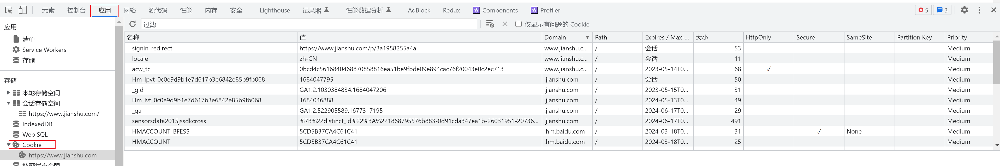
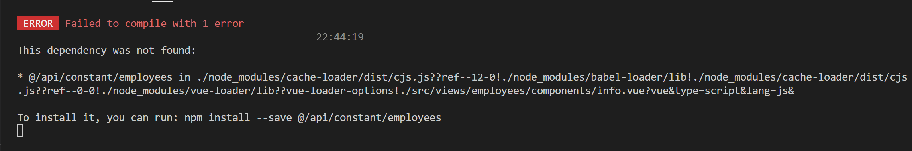
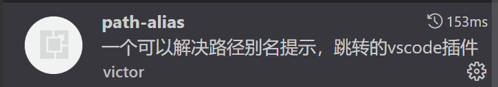
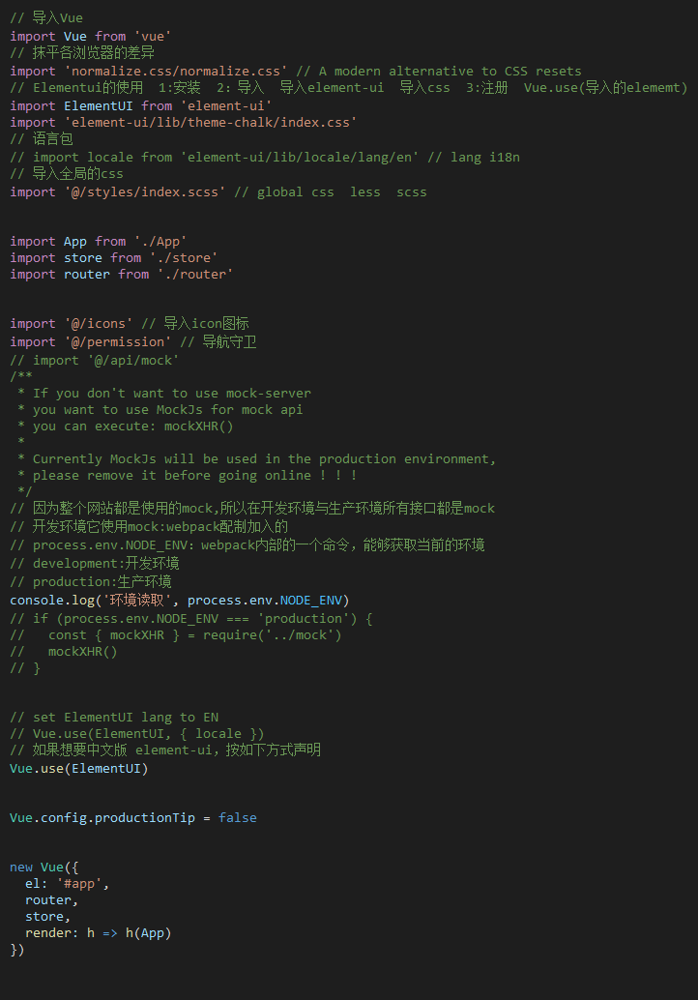

# 保安日记

---

## 👮我是个保安

<iframe src="https://cn.widgetstore.net/view/index.html?q=0a4ec1f962b061f30b9e70011eb1b10b.e22ab3646471fcb0000b7c2f7fefe3fe" data-src="" border="0" frameborder="no" framespacing="0" allowfullscreen="true" style="width: 1679px; height: 206px;"></iframe>

---

## 🥞自带小熊饼干

* 🗑提桶

  * Node
  * Vue
  * React
  * 小程序

* 🚌跑路

  * TypeScript
  * JavaScript
  * CSS

---

## 🏃‍♂️上班只为下班

### 关于面向对象

类：具有相同特征的事物的抽象描述，是 抽象的 、概念上的定义。

对象：实际存在的该类事物的每个个体 ，是具体的，因而也称为 实例(`instance`​) 。

匿名对象：不定义对象的**句柄**，而直接调用这个对象的方法。这样的对象叫做匿名对象。

**方法签名**：简单理解就是 函数的定义

**方法重载**：同一个方法，根据参数列表不同（参数个数或参数类型）去执行不同的代码

父类：基类、超类

子类：派生类

封装性：把客观事物封装成抽象概念的类，并且类可以把自己的数据和方法只向可信的类或者对象开放，向没必要开放的类或者对象隐藏信息。简单来说就是通过控制`访问的权限`​

继承性：减少代码冗余、提高复用性。

多态：**父类的引用指向子类的对象。**简单的理解是父类有多种子类，即父类有多种形态，多态。

虚拟方法调用：编译阶段不能确定方法的调用入口地址，在运行阶段才能确定的方法，即可能被重写的方法。子类中定义了与父类同名同参数的方法，在多态情况下，将此时父类的方法称为虚方法，父类根据赋给它的不同子类对象，动态调用属于子类的该方法。这样的方法调用在编译期是无法确定的。

---

* ​`package`​：包
* ​`publick`​：权限修饰符，公开的

  ```js
  实例对象，子类，子类的实例对象均可访问
  ```
* ​`protected`​：权限修饰符，受保护的

  ```js
  本类，子类才允许访问，实例对象无法访问
  ```
* ​`缺省`​：权限修饰符，及默认的意思

  ```js
  本类、本包中可以访问，其他包子类、其他包非子类不能访问
  ```
* ​`private`​：权限修饰符，私有的

  ```js
  只有本类才能访问，子类和实例对象均不能访问
  ```
* ​`constructor`​：构造器，构造方法，js类中，会类的实例化会自动调用该`constructor`​方法，java中的构造器及类名相同的方法
* ​`extends`​：继承，子类是父类的扩展

  ```js
  子类会继承父类的所有成员变量和方法
  子类不能直接访问父类中的私有private成员变量和方法
  ```
* ​`super`​：js中，该方法在子类的构造器首行进行调用，相当于先使用父类中的`constrector`​方法。java中可以使用该关键字访问父类中的属性和方法。这块js和java好像啊。

  ```js
  //java中可以通过下面方法来使用，js中除了这第一种，其他的有待验证
  super() //调用父类中的无参构造器
  super.xx //可以通过这样调用父类中的方法或属性
  ```
* ​`instanceof`​：java中用来做多态时候的类型转换，由上到下的转换。即父类转子类。那这样就很好理解js中这个关键字的含义了
* ​`static`​：静态的，用来声明静态变量或者说是类变量，可修饰类、方法、代码块、内部类

  ```js
  静态方法：使用 static 修饰的方法
  静态方法可以被子类继承，但是无法被子类重写
  静态方法无法调用 非静态属性或方法
  ```
* 代码块

  ```js
  就是类定义中的 {} 、没有方法名
  有静态代码块和非静态代码块
  静态代码块随着类的生命周期只会执行一次
  非静态代码块会随着类的使用就调用一次，如 new 一次就调用一次非静态代码块
  代码块可以用来对属性、类的声明的初始化操作
  代码块的执行在构造器前面，所以 new 处理化的时候，还是以构造器中的为主（构造器后执行，属性的初始化赋值覆盖）

  静态代码块和静态方法一样，不能调用非静态的属性和方法
  ```
* ​`final`​：最终的，修饰符，可以说是一个`const`​关键字，用来修饰类或属性、方法，不让子代去修改
* ​`abstract`​：抽象，修饰类或方法，表示抽象，不可以被实例化，只能由子类继承并实现抽象的所有方法
* ​`interface`​：接口，接口是**规范**，定义的是一组规则

  ```js
  java中
  接口和类定义类似，使用 interface 关键字。但是它不是类，是一种引用数据类型
  接口也可以继承其他接口
  [修饰符] interface 接口名{
      //接口的成员列表：
      // 公共的静态常量
      // 公共的抽象方法
    
      // 公共的默认方法（JDK1.8以上）
      // 公共的静态方法（JDK1.8以上）
      // 私有方法（JDK1.9以上）
  }

  在JDK8.0 之前，接口中只允许出现：
  （1）公共的静态的常量：其中 public static final 可以省略
  （2）公共的抽象的方法：其中 public abstract 可以省略
  > 理解：接口是从多个相似类中抽象出来的规范，不需要提供具体实现
  在JDK8.0 时，接口中允许声明 默认方法 和 静态方法 ：
  （3）公共的默认的方法：其中 public 可以省略，建议保留，但是default不能省略
  （4）公共的静态的方法：其中 public 可以省略，建议保留，但是static不能省略
  在JDK9.0 时，接口又增加了：
  （5）私有方法
  除此之外，接口中没有构造器，没有初始化块，因为接口中没有成员变量需要动态初始化。


  ```
* ​`implements`​：使用，**接口不能创建对象**，但是可以被类实现（`implements`​ ，类似于被继承）。

  ```js
  【修饰符】 class 实现类  implements 接口{
  	// 重写接口中抽象方法【必须】，当然如果实现类是抽象类，那么可以不重写
    	// 重写接口中默认方法【可选】
  }

  【修饰符】 class 实现类 extends 父类 implements 接口{
      // 重写接口中抽象方法【必须】，当然如果实现类是抽象类，那么可以不重写
    	// 重写接口中默认方法【可选】
  }

  如果接口的实现类是非抽象类，那么必须 重写接口中所有抽象方法。
  默认方法可以选择保留，也可以重写
  接口中的静态方法不能被继承也不能被重写

  接口可以被实现类多实现，即一个类可用实现多个接口，implements 接口1,接口2 
  相对的解决类的当继承性问题
  实现的多个接口有冲突，有相同名称相同参数列表的默认方法的时候，要显式的把方法进行重写
  ```

  ​
* ​`enum`​：枚举类

  ```js
  枚举类的常量对象列表必须在枚举类的首行，因为是常量，所以建议大写。
  列出的实例系统会自动添加 public static final 修饰。
  如果常量对象列表后面没有其他代码，那么“；”可以省略，否则不可以省略“；”。
  编译器给枚举类默认提供的是private的无参构造，如果枚举类需要的是无参构造，就不需要声明，写常量对象列表时也不用加参数
  如果枚举类需要的是有参构造，需要手动定义，有参构造的private可以省略，调用有参构造的方法就是在常量对象名后面加(实参列表)就可以。
  枚举类默认继承的是java.lang.Enum类，因此不能再继承其他的类型。
  JDK5.0 之后switch，提供支持枚举类型，case后面可以写枚举常量名，无需添加枚举类作为限定。
  ```

### 单例模式

单例模式是设计思想的其中一种

单例模式是指**一个类只创建一个实例**，类的构造器私有化，不对外暴露，在类中完成实例化，并暴露获取该实例的方法

单例模式有两种创建方法："饿汉式"，"懒汉式"。

饿汉式：“立即加载”，主动创建实例，容易存在内存泄漏，好处是速度快，提前创建了，线程安全

懒汉式：“延迟加载”，需要的时候创建，减少内存浪费，线程不安全

### new 关键字

1. 创建一个新的空对象。
2. 将新对象的原型链连接到构造函数的原型对象。
3. 将构造函数内部的 `this`​ 指向新创建的对象。
4. 执行构造函数的代码，初始化对象的属性和方法。
5. 返回新创建的对象。

### 方法重写

1. 子类重写的方法`必须`​​和父类被重写的方法具有相同的`方法名称`​​、`参数列表`​​。
2. 子类重写的方法的返回值类型`不能大于`​​父类被重写的方法的返回值类型。（例如：Student < Person）**如果返回值类型是基本数据类型和void，那么必须是相同**。

3. 子类重写的方法使用的访问权限`不能小于`​​父类被重写的方法的访问权限。（public > protected > 缺省 > private）
4. 子类方法抛出的异常不能大于父类被重写方法的异常
5. 父类私有方法不能重写 ，跨包的父类缺省的方法也不能重写

### 关于下划线_前缀

**命名约定，表示属性或方法的私有，不推荐被外部代码直接访问或调用**

在JavaScript中，有时会看到属性或方法名称前面带有下划线前缀（例如`_myVariable`​或`_myFunction()`​），这通常表示这些属性或方法是被视为“私有”的，即它们不应该被外部代码直接访问或调用。这是一种命名约定，而不是JavaScript语言本身的强制规则，它有以下几个原因：

1. **封装和隐藏细节：** 使用下划线前缀可以将属性或方法标记为内部实现的一部分，从而隐藏细节和复杂性，以防止外部代码直接操作或依赖它们。这有助于确保代码的健壮性和可维护性，因为它减少了外部代码对内部实现的依赖。
2. **命名冲突避免：** JavaScript是一种动态类型的语言，很容易出现全局作用域中的变量和函数名称冲突。使用下划线前缀可以降低这种冲突的可能性，因为开发人员会知道哪些标识符是内部使用的。
3. **文档化和提示：** 下划线前缀可以作为一种命名约定，用来向其他开发人员传达特定含义。例如，它们可以表示一个属性或方法是私有的，或者不建议外部使用。这对于代码审查和维护非常有帮助。

虽然下划线前缀是一种常见的命名约定，但它并不会实际阻止外部代码访问这些属性或方法。`JavaScript`​没有内置的访问控制机制，所以外部代码仍然可以访问以下划线开头的属性和方法。然而，它们被视为非正式的私有成员，并且开发人员被鼓励不要直接访问它们，以减少不必要的风险和依赖。

需要注意的是，一些`JavaScript`​编程风格指南或团队规则可能会明确规定在哪些情况下使用下划线前缀，因此在具体项目中的使用可能会有所不同。

### 关于字符集

* 编码：将字符转换为二进制码的过程称为编码
* 解码：将二进制码转换为字符的过程称为解码
* 字符集(`charset`​)：编码和解码所采用的**规则**称为字符集（相当于密码本）
* 乱码：编码和解码所采用的字符集不同就会出现乱码问题。

  ```html
  <meta charset="utf-8" /> //可以通过 meta 标签来设置网页的字符集，避免乱码问题
  ```
* ​`ASCII`​​：美国信息交换标准代码

  ```js
  美国信息交换标准代码是由美国国家标准学会(American National Standard Institute , ANSI )制定的，是一种标准的单字节字符编码方案，用于基于文本的数据。
  它最初是美国国家标准，供不同计算机在相互通信时用作共同遵守的西文字符编码标准，后来它被国际标准化组织（International Organization for Standardization, ISO）定为国际标准，称为 ISO 646 标准。适用于所有拉丁文字字母
  ```
* ​`ISO-8859-1`​​

  ```js
  ISO-8859-1 编码是单字节编码，向下兼容 ASCII
  ```
* ​`GB2312`​​

  ```js
  GB2312（信息交换用汉字编码字符集）是由中国国家标准总局 1980 年发布。
  基本集共收入汉字 6763 个和非汉字图形字符 682 个。GB 2312 的出现，基本满足了汉字的计算机处理需要，它所收录的汉字已经覆盖中国大陆 99.75%的使用频率。
  ```
* ​`GBK`​​

  ```js
  GBK（即“国标”、“扩展”汉语拼音的第一个字母），汉字编码字符集。
  2000 年已被 GB18030-2000 国家强制标准替代。 
  2005 年 GB18030-2005 发布，替代了 GB18030-2000。
  GBK 使用了双字节编码方案，其编码范围从 8140 至 FEFE（剔除 xx7F），共 23940 个码位，共收录了 21003 个汉字，完全兼容 GB2312-80 标准，支持国际标准 ISO/IEC10646-1 和国家标准 GB13000-1 中的全部中日韩汉字，并包含了 BIG5 编码中的所有汉字。
  ```
* ​`Big5`​​

  ```js
  Big5，又称为大五码或五大码，是使用繁体中文（正体中文）社区中最常用的电脑汉字字符集标准，共收录 13,060 个汉字。
  Big5 虽普及于台湾、香港与澳门等繁体中文通行区，但长期以来并非当地的国家/地区标准或官方标准，而只是业界标准。
  倚天中文系统、Windows 繁体中文版等主要系统的字符集都是以 Big5 为基准，但厂商又各自增加不同的造字与造字区，派生成多种不同版本。
  ```
* ​`Unicode`​:概念编码，非具体方案

  ```js
  Unicode 只是一组字符设定或者说是从数字和字符之间的逻辑映射的概念编码，但是它并没有指定代码点如何在计算机上存储。
  UCS4、UTF-8、UTF-16（UTF 后的数字代表编码的最小单位，如 UTF-8 表示最小单位 1 字节，所以它可以使用 1、2、3 字节等进行编码，UTF-16 表示最小单位 2 字节，所以它可以使用 2、4 字节进行编码）都是 Unicode 的编码方案。
  UTF-8 因可以兼容 ASCII 而被广泛使用。
  如果把各种文字编码形容为各地的方言，那么 Unicode 就是世界各国合作开发的一种语言。
  ```
* ​`UTF-8`​​：最常用

  ```js
  UTF-8（8 位元，Universal Character Set/Unicode Transformation Format）是针对 Unicode 的一种可变长度字符编码，也叫万国码、统一码。
  它可以用来表示 Unicode 标准中的任何字符，而且其编码中的第一个字节仍与 ASCII 相容，使得原来处理 ASCII 字符的软件无须或只进行少部分修改后，便可继续使用。
  ```
* ​`UTF-16`​​

  ```js
  UTF-16 是 Unicode 的其中一个使用方式。UTF-16 比起 UTF-8，好处在于大部分字符都以固定长度的字节（2 字节）储存，但 UTF-16 却无法兼容于 ASCII 编码。
  ```

### 关于控制台的信息

关于看到控制台的报错之后，不要老是想着是不是没有这个属性，是不是`undefined`​。

也别看着`​ protoType`​ 没有找到需要的，就觉得自己弄错了。

**最好就是把报错的信息复制去百度搜索一样，看看别人是怎么处理的，不然走错方向，很多事情就做的很多余，方向比很多东西都重要**

### 关于githut设置ssh

之前一直按照教程走配置，拉取代码的时候总是不对，使用小乌龟一直报错，提示没有密钥，后面查找问题发现，其实就是小乌龟没有配置 `ssh`​应用文件启动的问题 = =。

1. 先使用`git`​配置好`ssh`​
2. 在`github`​中设置`ssh`​公钥
3. 在`git`​中启动服务，`ssh-agent`​
4. 在小乌龟中配置git安装目录中的`ssh`​启动应用

### 关于组件的隐藏和生命周期

自定义组件引入的时候，通常会使用某个变量来控制该组件是否显示。常见的 `dialog`​ 组件，通过 show 来控制显示和隐藏。

虽然组件是隐藏的状态，实际的dom其实是已经存在的，即组件已经渲染了，生命周期函数已经执行了。

有的组件中有嵌套组件的插槽或者方法，可以通过组件之中的方法或者变量来控制嵌套组件的显示和隐藏，和上一种情况有所不一样，这种情况的隐藏和显示实际**是通过组件实例的销毁和创建来实现的。**也就是说，嵌套组件显示时，组件才渲染，生命周期钩子才执行，嵌套组件隐藏时，组件实例销毁，组件销毁钩子执行。

所以，如监听组件内的变量的变化来执行函数时，要注意一点，组件是引入使用时已经生成了，还是说要显示时候才会生成组件实例。要是后者的话，使用watch 来侦听组件内变量来执行函数这个方法是无效的。

### 关于在forEach中坑

1. ​`forEach`​中无法使用`async`​、`await`​来实现同步请求
2. ​`forEach`​循环时，无法给简单类型数据赋值

    ```js
    如：
    const arr = [1,2,3]
    arr.forEach(item=>item++)//item是普通数据类型，这个时候给item赋值是不生效的，控制台是可以看到值的打印，实际该赋值效果没用
    item是引用数据类型时，item可以进行赋值
    ```
3. ​`forEach`​不支持链式调用

### cookie

http请求是无状态的，cookie保存的用户的信息，可以用来解决http无状态的问题。

cookie除了本地js可以设置之外，每次发起请求之后，后端返回也可以设置cookie保存在浏览器中，可以通过请求头里的set-cookie进行查看，请求器发起每次发起请求时，会把cookie携带过去给服务器，cookie中一般包含了用户的信息，所以cookie能够解决http无状态的问题

 cooke本地查看的时候一串字符串，存储的信息是name=value的信息，多个cookie之间通过 ; 来区分。

cookie也有属于它的属性，可以设置cookie所实用的域名、cookie过期时间、cookie是否可以使用js来获取、cookie是否可以第三方携带

简单的理解：cookie用来保存后端返回的用户信息，来识别用户身份，通过设置属性来限制cookie的使用。

​​

**定义：**

cookie就是一段数据，在浏览器后台查看时就是一串字符串，里面保存了一些信息。存储是以 `Name=Value`​ 的形式。

**后端可以利用cookie 存储在用户浏览器中。** http请求是无状态的，利用cookie可以保存用户的信息状态等。

1. **Domain、Path**

    ​`Domain`​和`Path`​属性定义了cookie的范围。本质上是告诉浏览器cookie属于哪个站点。为了明显的安全原因，cookie只能在当前资源的顶级域名或者子级域名上设置，不能再其他域名和对应的子级域名上设置。例如，`example.org`​站点不能设置一个domain是`foo.com`​的cookie，因为不会允许`example.org`​站点去控制`foo.com`​的cookie。

    如果cookie的`Domain`​和`Path`​属性没有被服务端指定，它们默认是当前请求资源的domain以及path。然而，在大多数浏览器中，`foo.com`​中的cookie没有设置domain和设置了domain属性是有区别的。在前一种情况下，cookie只会被发送`foo.com`​的请求。在后一种情况下，所有的子域都会包含这个cookie(例如，`docs.foo.com`​)，IE中这条规则是例外的，在IE中这两种情况cookie都会被发送给所有的子域。
2. **Expire、Max-Age**

    ​`Expires`​属性定义了一个指定的日期和时间，到了这个日期或时间时，浏览器应该删掉cookie。日期和时间的指定格式是`Wdy, DD Mon YYYY HH:MM:SS GMT`​或者`Wdy, DD Mon YY HH:MM:SS GMT`​，其中YY的值大于等于0小于等于69。

    作为一种选择，`Max-Age`​属性可以用来设置cookie的有效期，以相对于浏览器接收到cookie之后的秒数来计算。
3. **Secure**  
    如果一个 cookie 被设置了`Secure=true`​，那么这个**cookie只能用https协议发送给服务器**，用 http 协议是不发送的。换句话说，cookie 是在`https`​的情况下创建的，而且他的Secure=true，那么之后你一直用https访问其他的页面（比如登录之后点击其他子页面），cookie会被发送到服务器，你无需重新登录就可以跳转到其他页面。但是如果这是你把url改成http协议访问其他页面，你就需要重新登录了，因为这个cookie不能在http协议中发送。
4. **HttpOnly**  
    cooke只能通过http请求携带， js脚本将无法读取到cookie信息，这样能有效的防止XSS攻击，窃取cookie内容，这样就增加了cookie的安全性，即便是这样，也不要将重要信息存入cookie
5. **SameSite**  
    和第三方cookie相关，有三个值：Strict、Lax、None  
    ​`Strict`​​​最为严格，完全禁止第三方 Cookie，跨站点时，任何情况下都不会发送 Cookie。换言之，只有当前网页的 URL 与请求目标一致，才会带上 Cookie。`Lax`​​​规则稍稍放宽，大多数情况也是不发送第三方 Cookie，但是导航到目标网址的 Get 请求除外。`None`​​​无论是否跨站都会发送 Cookie。**必须同时加上 Secure 属性，否则无效，**也就是说只支持 HTTPS。

### 联调三两事情

和后端的相爱相杀😒

❗一定要重视报错的信息！这个比自己调试可快多了，代码其实未必需要一行行去检查，代码出现问题一般只是在一个比较关键的地方，如果这个功能与其相关的代码都要检查一遍的话，那么时间是很不充分的！还是那句话，重视代码的报错，在使用或调试他人代码时，不需要一行行去看！

1. 跨域：最典型的还是跨域，一般还是后端来解决跨域问题。本地调试的时候，可以设置代理来跳到所需要的接口地址。解决跨域
2. 本地联调：后端服务起了，叫后端拿到他的ip，就把代理的地址选择后端的IP就好了，这样方便直接调试，不需要部署到环境中就可以直接联调了，这样字段也方便修改。
3. 证书问题：https的地址，需要有ssl证书，后端的证书有问题的话，调用接口也会有问题的。
4. 请求头：有时候后端需要判断用户信息的话，需要设置携带相应的请求头，可以在请求拦截器中设置请求头，然后找到响应的api把后端需要的参数携带过去
5. 调试器：网络搜索查看所发起的请求，查看携带的请求参数，利用debugger来进行代码调试
6. 文件的导入导出：是否有路径错误，或者导入的文件里面导入的文件有问题

### 文本复制功能

​`navigator.clipboard.write(text)`​:参数是需要复制的文本内容，是异步调用，所以返回的是`promise`​

​`document.execCommand(text)`​:参数是需要复制的文本内容，是同步调用，文本过大容易卡

```js
//复制功能
handleCopyText(text) {
  /**
   * navigator.clipboard这个api需要安全的环境浏览器才有，这是浏览器的安全策略
   * https 或者 本地的 localtion 才可以，其他情况浏览器不会提供这种api
   * 这个api是会返回异步的结果，所以需要注意
   */
  if (navigator.clipboard && window.isSecureContext) {
    return navigator.clipboard
      .write(text)
      .then(() => {
        this.$message.success("文本已经复制成功！");
      })
      .catch(() => {
        this.$message.success("文本复制失败！");
      });
  } else {
    /**
     * document.execCommand("copy")这个api好像快要给废弃了
     * 该api是同步的，一旦出现大量的数据，容易报错
     * 这个api需要配合输入型dom使用，如input标签和textArea标签
     */
    const textArea = document.createElement("textarea");
    textArea.value = text;
    // 固定定位，把创建的donm定到可视范围之外
    textArea.style.position = "absolute";
    textArea.style.opacity = "0";
    textArea.style.top = "-9999px";
    textArea.style.left = "-9999px";
    // 插入到body里面
    document.body.appendChild(textArea);
    // 使dom进入选中状态
    textArea.focus();
    textArea.select();
    // 变成异步，成功复制返回成功信息
    return new Promise((res, rej) => {
      document.execCommand("copy") ? res() : rej();
      // dom插入后就是生成在文档树中，需要及时销毁
      textArea.remove();
    })
      .then(() => {
        this.$message.success("文本已经复制成功！");
      })
      .catch(() => {
        this.$message.success("文本复制失败！");
      });
  }
}
```

### vite项目中，使用@代替src目录配置

1. 在`vite.config.ts`​中增加配置

    ```ts
    import { defineConfig } from 'vite'
    import vue from '@vitejs/plugin-vue'
    // 这个文件的后缀名为：.ts
    // 这里使用到了 node 中的模块
    // node 模块是用 js 来实现的
    // 在 ts 文件中无法直接使用 js 代码
    // 如果想要在 ts 中使用 js 代码，必须给所有的 js 代码添加一个类型
    // 解决方案：直接去网上下载 node 对应的类型声明文件： (类型声明文件的后缀名为：.d.ts)
    import path from 'path'

    // https://vitejs.dev/config/
    export default defineConfig({
      plugins: [vue()],
      // 配置项
      resolve: {
        alias: {
          '@': path.resolve(__dirname, './src')
        }
      }
    })
    ```
2. 需要安装node的类型声明文件

    ```ts
    npm i @types/node -D
    ```
3. 修改`tsconfig.json`​,增加如下配置（ 输入@之后，提示路径）

    ```ts
    {
      "compilerOptions": {
        // ...
        "baseUrl": ".",
        "paths": {
          "@/*": ["src/*"]
        }
      }
    }
    ```

### JWT-Cookie认证

[传送门](https://juejin.cn/post/6844904034181070861)

### 侦听对象部分属性

可以使用计算属性作为中间桥梁，计算属性返回一个对象，对象里面的value是所需要侦听的对象内的部分属性，通过侦听该计算属性，来达到侦听对象部分属性的效果

```js
//只想侦听id，age
const obj = {
  name:"zhangsan",
  age:20,
  id:"123"
}

get watchObj (){
  return {
    age:this.obj.age,
    id:this.obj.id
  }
}
//侦听计算属性
watch:{
  "watchObj":{
    deep: true,// 开启深度侦听
    handler (newVal, oldVal) {// 当对象里任意属性发生改变调用的回调函数，函数名不能改，改了报错
      ...
    }
  }
}
```

### 组件报错

一次正常动态导入组件，发现控制台报错，报错如下

​​

我怀疑的几个原因

* 脚手架没有正常安装-本来没有导入这个组件的时候，就可以打开，这个原因就可以要排除
* 路径导入插件的问题-理由同上
* node-modules有问题-删除重新安装也没有用

分析：

要先看懂意思，这个意思是没有正确的依赖，就是import导入的东西，按照自己的路径写的找结果找不到的情况下，就会去node-modules下找，如果还是找不到的话，就提示你去npm i 了，本来这个就是我的组件的，怎么可能会在npm上呢， 然后我就开始纠结我的语法或者方法是不是有问题，结果我**忽略**了一个点！

我本身如果没错的情况下，为什么不去考虑导入组件的本身是不是有问题呢！然后我去就看了一下那个子组件，果然！是哪个子组件引入了其他组件，而那个组件我这里是没有的，所以导致了报错！

### proxy解决跨域

代理服务器英文全称是`Proxy Server`​。跨域利用代理服务器来解决浏览器跨域问题。

1. 设置开发环境接口接地址：`.env.development`​​文件中

    ```js
    VUE_APP_URL="/xxx"  //xxx可以随意取，后面要替换
    ```
2. 设置 axios 基地址

    ```js
    const request = axios.create({
      baseURL:process.env.VUE_APP_URL,//使用环境变量是有固定写法的，用的时候百度下
    })
    ```
3. 开启代理服务器：`vue.config.js`​​文件中设置

    ```js
    devServer: {
      port: 8080,  // 端口
      open: true,  //自动打开浏览器
      proxy: {
        //意思是，请求发出之后，会找到 /xxx 这个部分，如果有，那么 /xxx 前面的部分会被替换成 http://10.20.30.120:8080
        //如：设置的基地址就是 /xxx ,那么发起请求是 /xxx/api/userinfo 会变成 http://10.20.30.120:8080/xxx/api/userinfo
        //重写的愿意在于是否要把 /xxx 换掉，以为 target 是替换 /xxx 前面的部分，不需要 /xxx的话，就需要重新 pathRewrite ， ^ 表示正则匹配
        '/xxx':{ 
        target: 'http://10.20.30.120:8080'//这个是被替换的目标地址
        changeOrigin: true // 默认是false,如果需要代理需要改成true
        pathRewrite:{
          '^/xxx' : '' // “/xxx”会被重写，前面加个 ^ 代表会被正则  
        }}
      }
    }
    ```
4. 多个路径代理到同一个地址

    ```js
    module.exports = {
      //...
      devServer: {
        proxy: [{
          context: ['/auth', '/api'],//这些路径都代理到同一个target
          target: 'http://localhost:3000',
        }]
      }
    };
    ```
5. 其他属性

    ```js
    target：要使用url模块解析的url字符串
    forward：要使用url模块解析的url字符串
    agent：要传递给http（s）.request的对象（请参阅Node的https代理和http代理对象）
    ssl：要传递给https.createServer（）的对象
    ws：true / false，是否代理websockets
    xfwd：true / false，添加x-forward标头
    secure：true / false，是否验证SSL Certs
    toProxy：true / false，传递绝对URL作为路径（对代理代理很有用）
    prependPath：true / false，默认值：true - 指定是否要将目标的路径添加到代理路径
    ignorePath：true / false，默认值：false - 指定是否要忽略传入请求的代理路径（注意：如果需要，您必须附加/手动）。
    localAddress：要为传出连接绑定的本地接口字符串
    changeOrigin：true / false，默认值：false - 将主机标头的原点更改为目标URL
    ```

### post、get请求

* 通讯协议：通信协议是对计算机必须遵守的规则的描述，只有遵守这些规则，计算机之间才能进行通信

  ```js
  TCP/IP 是不同的通信协议的大集合。HTTP协议只是其中一种。
  ```
* HTTP：超文本传输协议（Hypertext Transfer Protocol，缩写 HTTP）旨在启用客户端和服务器之间的通信。
* 请求方法区别

  ```js
  GET用于从指定资源请求数据

  POST用于将数据发送到服务器来创建/更新资源

  PUT用于将数据发送到服务器来创建/更新资源 ，POST 和 PUT之间的区别在于 PUT 请求是幂等的（idempotent）。也就是说，多次调用相同的 PUT 请求将始终产生相同的结果。相反，重复调用POST请求具有多次创建相同资源的副作用。

  HEAD本质和get一样，但是响应中没有呈现数据，而是http的头信息，主要用来检查资源或超链接的有效性或是否可以可达、检查网页是否被串改或更新，获取头信息等，特别适用在有限的速度和带宽下。

  DELETE删除指定的资源

  OPTIONS获取http服务器支持的http请求方法，允许客户端查看服务器的性能，比如ajax跨域时的预检等。CONNECTHTTP/1.1协议中预留给能够将连接改为管道方式的代理服务器。就是把服务器作为跳板，去访问其他网页然后把数据返回回来，连接成功后，就可以正常的get、post了。

  TRACE回显服务器收到的请求，主要用于测试或诊断。一般禁用，防止被恶意攻击或盗取信息
  ```
* [GET和POST](https://juejin.cn/post/7046310909815291911#heading-5)

  ```js
  HTTP协议是基于TCP/IP协议的一个子协议，所以GET 和 POST 请求的本质是相同的，都是TCP/IP请求
  对于GET方式的请求，浏览器会把http header和data一并发送出去，服务器响应200（返回数据）
  而对于POST，浏览器先发送header，服务器响应100 continue，浏览器再发送data，服务器响应200 ok（返回数据）

  GET参数通过URL传递，参数之间以&相连，POST放在Request body中，所以GET请求不安全，敏感信息会暴露在url上
  GET请求只能进行url编码（application/x-www-form-urlencoded），而POST支持多种编码方式application/x-www-form-urlencoded 或 multipart/form-data。为二进制数据使用多种编码。）
  GET在浏览器回退时是无害的，而POST会再次提交请求。 
  GET请求在URL中传送的参数是有长度限制的（因为浏览器对URL的长度有限制，最大长度是 2048 个字符），而POST没有
  GET请求支持缓存，实际上，你只要发送GET请求，浏览器做的第一件事都是先从本地浏览器缓存中找，找不到的时候才会去服务器上获取。这种缓存机制目的是为了提高用户的体验。
  POST请求不支持缓存
  ```

### @路径src提示

1. 安装插件：path-alias  
    ​​
2. vscode中配置：setting.json

    ```js
    "pathAlias.aliasMap":{
      "@": "${cwd}/src",
      "~@": "${cwd}/src"
    } 
    ```

### 点击dom区域外触发事件

```js
效果：点击显示选择项，点击选择项之外的区域时，选择项隐藏
核心方法:dom1.contains(dom2),该方法会返回一个bolean，判断dom2是否在dom1的区域内
e.target：获得当前事件对象发生的dom

思路一：使用自定义指令
自定义指令可以获取绑定元素的dom，并且有生命周期，配合v-if可以销毁时取消事件监听

思路二：事件监听
选项出现是，给选项dom绑定click事件，用来判断点击的dom是否在选项dom内
创建点击事件，dom.onclick= fn
移除点击事件，dom.onclick= null //使用.onClick就是这样取消的
注意：不要使用dom.addEventLister('click',callback) 和 dom.removeEventLister('click',callbacl)来创建和移除事件，因为这个事件有时候移除不了，会一直绑定事件，造成性能浪费
```

### 全局样式自动导入

* 样式导入的语法

  ```js
  使用@import来导入样式文件
  npm i less -D  安装less样式的依赖
  <style>
  @import 'src'
  </style>
  ```
* vite配置：让所有文件都自动导入指定文件，[参考文档](https://cn.vitejs.dev/config/#css-preprocessoroptions)

  ```js
  vite.config.json文件

  import { defineConfig } from "vite";
  import vue from "@vitejs/plugin-vue";
  import path from "path";
  // https://vitejs.dev/config/
  export default defineConfig({
    plugins: [vue()],
    // 配置项
    resolve: {
      alias: {
        "@": path.resolve(__dirname, "./src"),
      },
    },
    // 自动导入 less 文件
    css: {
      preprocessorOptions: {
        less: {
          additionalData: `
              @import '@/assets/styles/variables.less';
              @import '@/assets/styles/mixins.less';
            `,
        },
      },
    },
  });

  ```

### js常用方法

```js
typeof xxx  //返回字符串
typeof(xxx)  //返回字符串

实例 instanceof 构造函数 //返回值boolean,实例是否在构造函数所对应原型对象的原型链上
Object.prototype.tostring.call([])//"[object Array]"

JSON.parse(string)//返回值是将json数据转成js数据，不改变原来数据
JSON.stringify(obj)//返回值是把js数据转成json数据，不改变原来数据

parseInt("8.8")  //转整数
parseFloat("8.8")  //转浮点数

Boolean(0)// 0,-0,null,false,'',NaN,nudefined都是false
String(123)  //‘123’，返回值
Number(‘123’)  //123，返回值
toString()//返回值
toNumber()//返回值

arr.push()//改变原数组，后面添加
arr.pop()//改变原数组，后面删除
arr.unshift()//改变原数组，前面添加
arr.shift()//改变原数组，前面删除
arr.reverse()//改变原数组，颠倒顺序
arr.sort()//数组排序，返回arr
arr.join('-')//拼接字符，返回string
arr.concat(arr1，arr2...)//返回组合后的数组，arr,arr1,arr2组合
arr.filter(item=>{})//返回符合条件时后的item组成的数组
arr.forEach(item=>{})//遍历数组
arr.find(item=>{})//返回boolan，寻找
arr.findIndex(item=>{})//返回符合条件的下标，没有就返回-1
arr.every(item=>{})//返回boolean,全部符合条件就返回
arr.some(item=>{})//返回boolea，有一个符合条件就返回
arr.raduce((prv,item)=>{},初始值)//一般用来添加，prv是上一次循环的返回值
arr.includes(1)//返回boolean，数组是否有包含某个值,不能用item哦！
arr.map(item=>{})//返回arr，映射
arr.splice(起始位置，删除个数，替换元素)//改变原数组，返回的是被删的部分
arr.slic(起始位置，结束位置(不包含))//不改变原数组，返回被剪切的部分

Object.keys(obj)//返回数组，是obj中key的值
Object.valus(obj)//返回数组，是obj中value的值
Object.assign(obj1,obj2,obj3)//把obj2、obj3的覆盖复制给obj1

str.startsWith(srt,开始位置)//返回boolean，是否以该字符串开头，开始位置可选
str.endWith(srt,开始位置)//返回boolean，是否以该字符串结尾，开始位置可选
str.includes(str)//返回boolean，是否包含该字符串
str.padStart(需要的长度,str)//拼接string，到需要的长度
str.padEnd(需要的长度,str)//拼接string，到需要的长度
str.split('')//返回数组
str.substring(开始位置，结束位置(不包含))//返回字符串
str.toUpperCase()//返回大写字符串
str.toLowerCase()//返回小写字符串
str.replace(希望被替换的字符，用于替换的字符)//返回被替换后的字符
str.trim()//返回左右两边空格去掉后的字符
str.seach(/正则/)//返回匹配的索引，没有就返回-1
str.match(/正则/)//返回匹配的数组，有点复杂，去看具体信息


数值.toFixed(number)//返回值，取几位小数
数值.toString()//返回字符串
```

### EventLoop

[传送门](https://juejin.cn/post/6844903657264136200)

```js
1.宏任务、微任务
单线程:浏览器脚本语言，用来和用户交互，需要操作dom,避免同时操作dom
异步操作:任务不是连续的，先执行第一段，中间有等待事件，等准备做好了再回头执行第二段
事件循环: 异步任务的回调交给事件循环，等合适得时候交还给js线程处理
事件循环是一个队列组成得，遵循先进先出，在js空闲得时候一轮轮被取出操作

事件循环由宏任务和在执行宏任务期间产生的所有微任务组成。
完成当下的宏任务后，会立刻执行所有在此期间入队的微任务。
执行顺序：先执行同步代码，遇到异步宏任务则将异步宏任务放入宏任务队列中，遇到异步微任务则将异步微任务放入微任务队列中，当所有同步代码执行完毕后，再将异步微任务从队列中调入主线程执行，微任务执行完毕后再将异步宏任务从队列中调入主线程执行，一直循环直至所有任务执行完毕
宏任务：
 script(整体代码)
 setTimeout
 setInterval
 http回调
 I/O
 UI交互事件(事件回调)
 postMessage
 MessageChannel
 setImmediate(Node.js 环境)
微任务：
 Promise.then
 Object.observe
 MutationObserver
 process.nextTick(Node.js 环境)
```

### ts中全局组件类型属性提示

ue3 + ts 项目中全局注册组件之后，使用全局组件会有组件类型提示，取消提示的方法有

1. 使用局部组件，不使用全局组件
2. 使用全局组件，则需要添加额外的类型声明文件

```js
//在项目的 src 根目录下创建一个文件：global.d.ts
import XtxSkeleton from '@/components/skeleton/index.vue'
// 参考：
declare module 'vue' {
  export interface GlobalComponents {
    XtxSkeleton: typeof XtxSkeleton
  }
}
export {}
```

### vue3ts项目中配置路径别名

node是js代码，ts无法直接使用js的，如果想要在 ts 环境下使用 js 代码，必须保证 js 代码中有一个类型声明文件：`xx.d.ts`

* 在`vite.config.ts`中增加配置

  ```js
  import { defineConfig } from 'vite'
  import vue from '@vitejs/plugin-vue'
  // 这个文件的后缀名为：.ts
  // 这里使用到了 node 中的模块
  //  node 模块是用 js 来实现的
  // 在 ts 文件中无法直接使用 js 代码
  // 如果想要在 ts 中使用 js 代码，必须给所有的 js 代码添加一个类型
  //  解决方案：直接去网上下载 node 对应的类型声明文件： (类型声明文件的后缀名为：.d.ts)
  import path from 'path'

  // https://vitejs.dev/config/
  export default defineConfig({
    plugins: [vue()],
    // 配置项
    resolve: {
      alias: {
        '@': path.resolve(__dirname, './src')
      }
    }
  })
  ```
* 需要安装node的类型声明文件

  ```js
    npm i @types/node -D
  ```
* 修改`tsconfig.json`,增加如下配置（ 输入@之后，提示路径）

  ```js
  {
    "compilerOptions": {
      // ...
      "baseUrl": ".",
      "paths": {
        "@/*": ["src/*"]
      }
    }
  }
  ```

### ES6导出导入

* 导出：`export default` **只能写一次**

  ```js
  //默认导出，export default 只能写一次
  //export default dog
  export default {
    info,
    ...
  }

  //按需导出
  export const food = 'xxx'
  export ...
  ```
* 导入

  ```js
  // 默认导入，导入export default的内容
  import result from './modules/02.按需导出.js'
  console.log('result:', result)

  // 按需导入
  import { food } from './modules/02.按需导出.js'

  // 导入 + 起别名
  import { food as fd } from './modules/02.按需导出.js'
  console.log('fd:', fd)

  // 默认导入可以和 按需导入一起使用
  import result, { food } from './modules/02.按需导出.js'
  ```
* 全部导入：`* as` 是固定语法

  ```js
  // 一次性获取所有的内容
  // * as
  // tool 随便写
  import * as tool from './module/02.myModule.js'
  console.log('tool:', tool)
  // tool中包含了 导出的内容
  // 按需导出 就是默认的名字
  // 默认导出 default
  // console.log(tool.default())
  ```
* 直接导入：只希望执行某个模块中的代码，并不需要得到模块中向外共享的成员，可以选择直接导入

  ```js
  // 导入xx.js时，执行xx.js中的代码
  // 如果不需要用到内部的任何值 可以只写import
  import './module/03.myModule.js'  //就相当于直接执行了这段代码。
  console.log('module:', module)

  // 没有导出 export 的模块 获取内部的值直接报错
  // import module from './module/03.myModule.js'
  ```

### 环境变量

在实际开发中，我们开发所使用的`axios`基地址和实际的基地址是不一样的，为了在后续项目打包上线不需要改动设置，就可以设置**环境变量**，让系统根据不同的环境（开发环境或者生产环境），变量使用不同环境的值。如：开发环境的axios基地址是开发基地址，打包成生产环境后，基地址变成实际的接口。

常用于配置接口基地址。

* 项目根目录新建环境变量设置文件

  * `.env.development`文件（开发环境）：

    ```js
    # just a flag
    ENV = 'development'

    # base api
    VUE_APP_BASE_API = '/dev-api'
    VUE_APP_URL="http://localhost:3000/api"    //开发环境基地址
    ```
  * `.env.production`文件（生产环境）

    ```js
    # just a flag
    ENV = 'production'

    # base api
    VUE_APP_BASE_API = '/prod-api'
    VUE_APP_URL="http://119.91.150.211:3000/api"    //生产环境基地址
    ```
  * 环境变量定义规则：以`VUE_APP_`开头，如：`VUE_APP_URL='123'`
  * `request.js`（axios副本）环境变量的调用

    ```js
    baseURL:process.env.VUE_APP_URL  //process(开发)或production（生产）.env.VUE_APP_xx
    ```

### [项目基本文件结构](https://copyfuture.com/blogs-details/20210803023809076K)

```js
├── build                      # 构建相关
├── mock                       # 项目mock 模拟数据
├── public                     # 静态资源
│   │── favicon.ico            # favicon图标
│   └── index.html             # html模板
├── src                        # 源代码
│   ├── api                    # 所有请求
│   ├── assets                 # 主题 字体等静态资源
│   ├── components             # 全局公用组件
│   ├── icons                  # 项目所有 svg icons
│   ├── layout                 # 全局 layout
│   ├── router                 # 路由
│   ├── store                  # 全局 store管理
│   ├── styles                 # 全局样式
│   ├── utils                  # 全局公用方法
│   ├── vendor                 # 公用vendor,第三方插件（无安装包），算法/递归的深拷贝
│   ├── views                  # views 所有页面
│   ├── App.vue                # 入口页面
│   ├── main.js                # 入口文件 加载组件 初始化等
│   └── permission.js          # 权限管理//使用路由守卫，没有权限不给进去
│   └── settings.js            # 配置文件
├── tests                      # 测试
├── .env.xxx                   # 环境变量配置
├── .eslintrc.js               # eslint 配置项
├── .babelrc                   # babel-loader 配置
├── .travis.yml                # 自动化CI配置
├── vue.config.js              # vue-cli 配置
├── postcss.config.js          # postcss 配置
└── package.json               # package.json
```

`.main`文件部分说明

`normanlize文件`：样式，为了抹除各个浏览器直接样式的区别

​

### Vue中在行内使用本地图片路径问题

需要在行内导入本地的图片，如果是**原生标签**且在**脚手架5**那么默认直接写相对路径是有效果的。否则在其他情况在行内使用本地图片是无法生效的：打包后的图片路径跟项目的路径已经变的不一样了。

如：w7只能安装脚手架4，使用`vant`中的组件标签，在行内使用本地图片会无法显示图片效果。

解决办法：

```html

```

### 文件拖入页面的触发事件

```html
<div
  @dragenter.stop.prevent="enterEvent"  
  @dragover.stop.prevent="overEvent" 
  @drop.stop.prevent="handleDrop"
/>

dragenter:文件移入该标签范围时触发
dragover：文件在该标签范围上面移动时触发
drop：文件移入标签内，鼠标松开时触发
```

### input标签获取上传的文件信息

```js
<input @change='changeEvent'>
//原生的input获得上传文件的方法是change，使用click是没有用的

changeEvent(e){
  console.log(e)//文件上传后有个参数传了进来
  console.log(e.target)//事件触发的对象
  console.log(e.target.files[0])//获得的文件对象
  //文件上传比较复杂，使用log,dir也无法查看到，需要使用特殊的语法才能看到它的详细详细
  //记住文件时这样获得就好了
}
```
