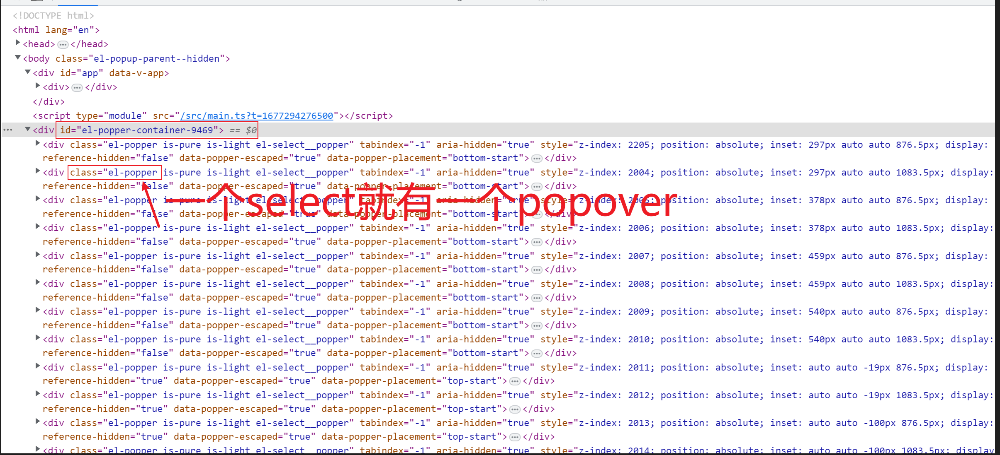
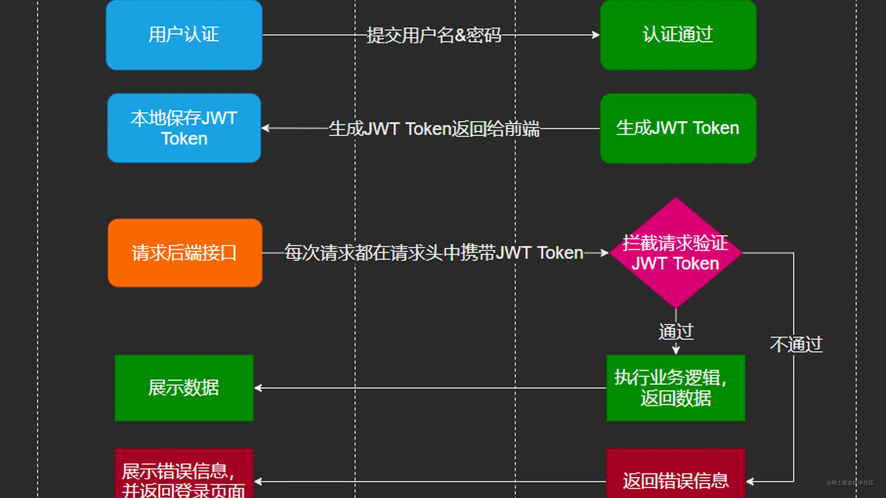

# 保安日记

---

## 👮我是个保安

<iframe src="https://notion.pet/view/index.html?q=0a4ec1f962b061f30b9e70011eb1b10b.8f75309d62f5f26a146c522136e8496f" data-src="" border="0" frameborder="no" framespacing="0" allowfullscreen="true" style="width: 1373px; height: 115px;"></iframe>

---

## 🥞自带小熊饼干

* 🗑提桶

  * Vue
  * React
  * 小程序

* 🚌跑路

  * JavaScript
  * Node
  * CSS
  * 常用插件
  * MarkDown
  * 面试宝典

---

## 🍞工资只够早餐

* 🍚软饭

  * [ ] cookie
  * [ ] eslint
  * [ ] 事件轮询

* 📣饿饿

  * react学习
  * 项目总结
  * 后端基础
  * 英语

---

## 🏃‍♂️上班只为下班

```js
attribute 属性  attrs
property  所有物  props
result  结果
request 请求
reject  错误
response  回复、响应
modules  模块
mode  模式
validator  自定义校验规则
required  必须
trigger  触发方式
query  查询
warning  警告
danger  危险
success  成功
primary  主要
params  参数
formatter  格式化
```

---

## 🌈最爱业主小窝

### 联调三两事情

和后端的相爱相杀😒

❗一定要重视报错的信息！这个比自己调试可快多了，代码其实未必需要一行行去检查，代码出现问题一般只是在一个比较关键的地方，如果这个功能与其相关的代码都要检查一遍的话，那么时间是很不充分的！还是那句话，重视代码的报错，在使用或调试他人代码时，不需要一行行去看！

1. 跨域：最典型的还是跨域，一般还是后端来解决跨域问题。本地调试的时候，可以设置代理来跳到所需要的接口地址。解决跨域
2. 本地联调：后端服务起了，叫后端拿到他的ip，就把代理的地址选择后端的IP就好了，这样方便直接调试，不需要部署到环境中就可以直接联调了，这样字段也方便修改。
3. 证书问题：https的地址，需要有ssl证书，后端的证书有问题的话，调用接口也会有问题的。
4. 请求头：有时候后端需要判断用户信息的话，需要设置携带相应的请求头，可以在请求拦截器中设置请求头，然后找到响应的api把后端需要的参数携带过去
5. 调试器：网络搜索查看所发起的请求，查看携带的请求参数，利用debugger来进行代码调试

### upload组件整理

```ts
action:上传的url
method:上传的请求方法
multiple:多文件上传
name:上传的文件字段名 "file"
file-list: 这个类型有点搞不清，好像是个对象数组，里面的字段还不清楚

before-upload:上传文件之前的钩子，参数为上传的文件， 若返回false或者返回 Promise 且被 reject，则停止上传。
on-success:文件上传成功时的钩子
on-progress:文件上传时的钩子
on-error:文件上传失败时的钩子
on-change:文件状态改变时的钩子，添加文件、上传成功和上传失败时都会被调用
on-preview:点击文件列表中已上传的文件时的钩子
on-remove:文件列表移除文件时的钩子
on-exceed:当超出限制时，执行的钩子函数
before-remove:删除文件之前的钩子，参数为上传的文件和文件列表， 若返回 false 或者返回 Promise 且被 reject，则停止删除
```

### vite项目中，使用@代替src目录配置

1. 在`vite.config.ts`​中增加配置

    ```ts
    import { defineConfig } from 'vite'
    import vue from '@vitejs/plugin-vue'
    // 这个文件的后缀名为：.ts
    // 这里使用到了 node 中的模块
    // node 模块是用 js 来实现的
    // 在 ts 文件中无法直接使用 js 代码
    // 如果想要在 ts 中使用 js 代码，必须给所有的 js 代码添加一个类型
    // 解决方案：直接去网上下载 node 对应的类型声明文件： (类型声明文件的后缀名为：.d.ts)
    import path from 'path'

    // https://vitejs.dev/config/
    export default defineConfig({
      plugins: [vue()],
      // 配置项
      resolve: {
        alias: {
          '@': path.resolve(__dirname, './src')
        }
      }
    })
    ```
2. 需要安装node的类型声明文件

    ```ts
    npm i @types/node -D
    ```
3. 修改`tsconfig.json`​,增加如下配置（ 输入@之后，提示路径）

    ```ts
    {
      "compilerOptions": {
        // ...
        "baseUrl": ".",
        "paths": {
          "@/*": ["src/*"]
        }
      }
    }
    ```

---

### table中嵌套过多select导致渲染过慢

table列表中，col中嵌套select组件，数据不多还好，如果数据很多的情况下，一行col中有select组件，多行数据的情况下，select组件也会非常的多

select组件有popover弹窗，这些是非常消耗性能的，这就是页面刷新很卡的原因

​​

要解决渲染过久的问题，根本就是组件过多的渲染性能问题，那么根本途径就是减少该组件select，如果有表单校验问题的话，这个渲染会更麻烦一点

目前有几个方向：

1. 使用分页，直接减少数据量的渲染，这样看需求，有时候需求就要全部展示全部数据
2. 减少select组件的渲染，使用input代替模拟select功能，封装一个popover来达到select的样式效果，这个有点难，还有兼容性问题
3. 表单编辑模式：核心还是使用input组件，利用插槽，渲染时是div，点击单元格的时候，进入编辑状态，渲染select组件，这样就不会造成初始渲染时页面卡顿的效果。同时表单的校验，利用字段来进行判断，在需要进行校验的地方，对表单绑定的数据进行遍历，不符合的row数据添加errorTip字段，使用动态类名渲染，先写好错误的类样式，当有错误errorTip字段时，就显示错误的样式。提示文字使用v-if来动态渲染。

---

### js数据类型的隐式转换导致判断条件有误

js是弱类型的编程语言，存在着隐式的数据类型转换：数据类型转换

如：0，-0，undefined ，null，空字符，-1，NaN等会在某些情况转化成false，如果这些值需要用作显示的话，使用该值作为判断，则容易发生误判

```js
if(data){ //data参数本身是0的话用来判断会导致误判
  return this.$message('无参数')
}
```

如果当初的使用该值来进行条件判断，来决定返回的数据的话，在有些地方会导致有误！

如该值本身就是0，是需要正常返回显示的，但是用这个值来进行条件判断，那么该值转化成false后，会导致判断的逻辑条件发现错误。

或者0作为一个值来传参，用0来做判断条件显然不合理，0和空字符串`​ '' ​`​，都是会转换成false的，那么0作为传参的话，会被判断条件误判，和`''`​一样被识别成无参数，导致显示的错误

---

### loading过渡效果和按钮显示

固定了max-height的div包裹了table后，在该div绑定loading效果会出现问题，loading效果显示的位置还是在table高度的中间，这应该是一个bug？

同时，loading效果应该把页面按钮给覆盖掉，这样才能避免一些按钮可以重复点击的问题（通过按钮事件的处理也可以避免按钮的重复点击）

```js
<div v-loading="loading">
  <div style="max-height: 100px">
    <el-table></el-table>
  </div>
  ...
  <el-button></el-button>
</div>
```

那就直接再使用一个div把固定高度的div给包裹起来，同时把按钮一起给包裹起来，使按钮无法再次点击

还是要看看相关的设计规范，页面的效果还是不能自己随心所欲的

同时，敲页面的时候还是要想想整体的效果，以及其他代码的关联关系。

---

### JWT-JosnWebToken

​

JWT——Json web token 是为了在网络应用环境间传递声明而执行的一种基于JSON的开放标准，*可实现无状态、分布式的Web应用授权*。一般应用于前后端分离的项目，后端接口部署在分布式环境下。

基于token的鉴权机制类似于http协议也是*无状态的*，它不需要在服务端去保留用户的认证信息或者会话信息。这就意味着基于token认证机制的应用不需要去考虑用户在哪一台服务器登录了，这就为应用的扩展提供了便利。  
**token =&gt; 字符串 =&gt; 存储在客户端 (本地存储 sessionstorage、localstorage) =&gt; 发送请求 手动携带token**  
 流程上是这样的：

1. 用户使用用户名密码来请求服务器
2. 服务器进行验证用户的信息 服务器通过验证发送给用户一个token
3. 客户端存储token，并在每次请求时附送上这个token值 服务端验证token值，并返回数据
4. 这个token必须要在每次请求时传递给服务端，它应该保存在请求头里， 另外，服务端要支持CORS(跨来源资源共享)策略，一般我们在服务端这么做就可以了`Access-Control-Allow-Origin:*`​​。  
    也就是说相比于传统基于cookie的session，基于token的jwt有以下优点：
5. Cookie是不允许垮域访问的，这一点对Token机制是不存在的，前提是传输的用户认证信息通过HTTP头传输.
6. 无状态(也称：服务端可扩展行):Token机制在服务端不需要存储session信息，因为Token 自身包含了所有登录用户的信息，只需要在客户端的cookie或本地介质存储状态信息.
7. 更适用CDN: 可以通过内容分发网络请求你服务端的所有资料（如：javascript，HTML,图片等），而你的服务端只要提供API即可.
8. 去耦: 不需要绑定到一个特定的身份验证方案。Token可以在任何地方生成，只要在你的API被调用的时候，你可以进行Token生成调用即可.
9. 更适用于移动应用: 当你的客户端是一个原生平台（iOS, Android，Windows 8等）时，Cookie是不被支持的（你需要通过Cookie容器进行处理），这时采用Token认证机制就会简单得多。
10. CSRF:因为不再依赖于Cookie，所以你就不需要考虑对CSRF（跨站请求伪造）的防范。
11. 性能: 一次网络往返时间（通过数据库查询session信息）总比做一次HMACSHA256计算 的Token验证和解析要费时得多.
12. 不需要为登录页面做特殊处理: 如果你使用Protractor 做功能测试的时候，不再需要为登录页面做特殊处理.
13. 基于标准化:你的API可以采用标准化的 JSON Web Token (JWT). 这个标准已经存在多个后端库（.NET, Ruby, Java,Python, PHP）和多家公司的支持（如：Firebase,Google, Microsoft）

---

### 固定table高度

```js
date:23.2.10
1.
eui中table有个固定列表高度的属性max-height，还能固定表头一直显示，不过会影响 Element.scrollIntoView() 这个方法
要使table固定高度，可以给table外面加个div，给这个div设置最大高度max-height，同时设置overflow-x:auto,使x轴出现滚动条
这样设置样式，可以让 Element.scrollIntoView() 正常使用，让选中的 don 滚动出现在可视页面中
2.
form-item中有个margin-bottom：15px属性，是由于表单校验的信息提示需要有位置，可以通过样式取消该下边距，不过会造成校验的时候没有信息提示
可以设置form中的inline属性，使表单校验变成行内提示，来解决没有提示的问题
```

---

### 侦听对象部分属性

可以使用计算属性作为中间桥梁，计算属性返回一个对象，对象里面的value是所需要侦听的对象内的部分属性，通过侦听该计算属性，来达到侦听对象部分属性的效果

```js
//只想侦听id，age
const obj = {
  name:"zhangsan",
  age:20,
  id:"123"
}

get watchObj (){
  return {
    age:this.obj.age,
    id:this.obj.id
  }
}
//侦听计算属性
watch:{
  "watchObj":{
    deep: true,// 开启深度侦听
    handler (newVal, oldVal) {// 当对象里任意属性发生改变调用的回调函数，函数名不能改，改了报错
      ...
    }
  }
}
```

---

### 组件报错

一次正常动态导入组件，发现控制台报错，报错如下

​​

我怀疑的几个原因

* 脚手架没有正常安装-本来没有导入这个组件的时候，就可以打开，这个原因就可以要排除
* 路径导入插件的问题-理由同上
* node-modules有问题-删除重新安装也没有用

分析：

要先看懂意思，这个意思是没有正确的依赖，就是import导入的东西，按照自己的路径写的找结果找不到的情况下，就会去node-modules下找，如果还是找不到的话，就提示你去npm i 了，本来这个就是我的组件的，怎么可能会在npm上呢， 然后我就开始纠结我的语法或者方法是不是有问题，结果我**忽略**了一个点！

我本身如果没错的情况下，为什么不去考虑导入组件的本身是不是有问题呢！然后我去就看了一下那个子组件，果然！是哪个子组件引入了其他组件，而那个组件我这里是没有的，所以导致了报错！

---

### proxy解决跨域

代理服务器英文全称是Proxy Server。跨域利用代理服务器来解决浏览器跨域问题。

1. 设置开发环境接口接地址：`.env.development`​​文件中

    ```js
    VUE_APP_URL="/xxx"  //xxx可以随意取，后面要替换
    ```
2. 设置 axios 基地址

    ```js
    const request = axios.create({
      baseURL:process.env.VUE_APP_URL,//使用环境变量是有固定写法的，用的时候百度下
    })
    ```
3. 开启代理服务器：`vue.config.js`​​文件中设置

    ```js
    devServer: {
      port: 8080,  // 端口
      open: true,  //自动打开浏览器
      proxy: {
        //意思是，请求发出之后，会找到 /xxx 这个部分，如果有，那么 /xxx 前面的部分会被替换成 http://10.20.30.120:8080
        //如：设置的基地址就是 /xxx ,那么发起请求是 /xxx/api/userinfo 会变成 http://10.20.30.120:8080/xxx/api/userinfo
        //重写的愿意在于是否要把 /xxx 换掉，以为 target 是替换 /xxx 前面的部分，不需要 /xxx的话，就需要重新 pathRewrite ， ^ 表示正则匹配
        '/xxx':{ 
        target: 'http://10.20.30.120:8080'//这个是被替换的目标地址
        changeOrigin: true // 默认是false,如果需要代理需要改成true
        pathRewrite:{
          '^/xxx' : '' // “/xxx”会被重写，前面加个 ^ 代表会被正则  
        }}
      }
    }
    ```
4. 多个路径代理到同一个地址

    ```js
    module.exports = {
      //...
      devServer: {
        proxy: [{
          context: ['/auth', '/api'],//这些路径都代理到同一个target
          target: 'http://localhost:3000',
        }]
      }
    };
    ```
5. 其他属性

    ```js
    target：要使用url模块解析的url字符串
    forward：要使用url模块解析的url字符串
    agent：要传递给http（s）.request的对象（请参阅Node的https代理和http代理对象）
    ssl：要传递给https.createServer（）的对象
    ws：true / false，是否代理websockets
    xfwd：true / false，添加x-forward标头
    secure：true / false，是否验证SSL Certs
    toProxy：true / false，传递绝对URL作为路径（对代理代理很有用）
    prependPath：true / false，默认值：true - 指定是否要将目标的路径添加到代理路径
    ignorePath：true / false，默认值：false - 指定是否要忽略传入请求的代理路径（注意：如果需要，您必须附加/手动）。
    localAddress：要为传出连接绑定的本地接口字符串
    changeOrigin：true / false，默认值：false - 将主机标头的原点更改为目标URL
    ```

---

### post、get请求

* 通讯协议：通信协议是对计算机必须遵守的规则的描述，只有遵守这些规则，计算机之间才能进行通信

  ```js
  TCP/IP 是不同的通信协议的大集合。HTTP协议只是其中一种。
  ```
* HTTP：超文本传输协议（Hypertext Transfer Protocol，缩写 HTTP）旨在启用客户端和服务器之间的通信。
* 请求方法区别

  ```js
  GET用于从指定资源请求数据

  POST用于将数据发送到服务器来创建/更新资源

  PUT用于将数据发送到服务器来创建/更新资源 ，POST 和 PUT之间的区别在于 PUT 请求是幂等的（idempotent）。也就是说，多次调用相同的 PUT 请求将始终产生相同的结果。相反，重复调用POST请求具有多次创建相同资源的副作用。

  HEAD本质和get一样，但是响应中没有呈现数据，而是http的头信息，主要用来检查资源或超链接的有效性或是否可以可达、检查网页是否被串改或更新，获取头信息等，特别适用在有限的速度和带宽下。

  DELETE删除指定的资源

  OPTIONS获取http服务器支持的http请求方法，允许客户端查看服务器的性能，比如ajax跨域时的预检等。CONNECTHTTP/1.1协议中预留给能够将连接改为管道方式的代理服务器。就是把服务器作为跳板，去访问其他网页然后把数据返回回来，连接成功后，就可以正常的get、post了。

  TRACE回显服务器收到的请求，主要用于测试或诊断。一般禁用，防止被恶意攻击或盗取信息
  ```
* [GET和POST](https://juejin.cn/post/7046310909815291911#heading-5)

  ```js
  HTTP协议是基于TCP/IP协议的一个子协议，所以GET 和 POST 请求的本质是相同的，都是TCP/IP请求
  对于GET方式的请求，浏览器会把http header和data一并发送出去，服务器响应200（返回数据）
  而对于POST，浏览器先发送header，服务器响应100 continue，浏览器再发送data，服务器响应200 ok（返回数据）

  GET参数通过URL传递，参数之间以&相连，POST放在Request body中，所以GET请求不安全，敏感信息会暴露在url上
  GET请求只能进行url编码（application/x-www-form-urlencoded），而POST支持多种编码方式application/x-www-form-urlencoded 或 multipart/form-data。为二进制数据使用多种编码。）
  GET在浏览器回退时是无害的，而POST会再次提交请求。 
  GET请求在URL中传送的参数是有长度限制的（因为浏览器对URL的长度有限制，最大长度是 2048 个字符），而POST没有
  GET请求支持缓存，实际上，你只要发送GET请求，浏览器做的第一件事都是先从本地浏览器缓存中找，找不到的时候才会去服务器上获取。这种缓存机制目的是为了提高用户的体验。
  POST请求不支持缓存
  ```

---

### vite路径别名设置

1. vue-cli构建的项目是可以直接使用`​ @ ​`​来代替`​ src ​`​路径，vue-vite是不支持的，需要单独设置
2. 在`vite.config.ts`​中增加配置

    ```js
    import { defineConfig } from 'vite'
    import vue from '@vitejs/plugin-vue'
    // 这个文件的后缀名为：.ts
    // 这里使用到了 node 中的模块
    //  node 模 块是用 js 来实现的
    // 在 ts 文件中无法直接使用 js 代码
    // 如果想要在 ts 中使用 js 代码，必须给所有的 js 代码添加一个类型
    //  解决方案：直接去网上下载 node 对应的类型声明文件： (类型声明文件的后缀名为：.d.ts)
    import path from 'path'

    // https://vitejs.dev/config/
    export default defineConfig({
      plugins: [vue()],
      // 配置项
      resolve: {
        alias: {
          '@': path.resolve(__dirname, './src')
        }
      }
    })
    ```

---

### @路径src提示

1. 安装插件：path-alias  
    ​​
2. vscode中配置

    ```js
    "pathAlias.aliasMap":{
      "@": "${cwd}/src",
      "~@": "${cwd}/src"
    } 
    ```

---

### 枚举数据的直接使用

```js
枚举数据这些基本都是直接导入的 js文件，js文件是不能直接在模板中使用的，需要在js进行处理之后才能在模板中使用
```

---

### 页面重定向

意义：强制用户登录或验证的时候，需要保留原来用户需要访问页面地址信息，等验证完成之后，再跳转去用户原先就要去的地址

核心：路由传参

```js
1.强制用户跳转时，保存原来要跳转路由地址
再强制跳转的页面路径地址后面，进行路径拼接带参
location.href  //获得当前路径的地址
string.split(str)  //返回字符串剪切后的数组
this.$router.push("/login?redirect=" + location.href.split("#/")[1])
2.登入后进行判断，看是否路径带参
利用this.$router.query获取参数，没有参数就跳转默认地址，有参数就跳转到参数所定位的路由
this.$router.push(this.$route.query.redirect || "/dashboard");
```

---

### 统一错误处理、token过期

```js
请求错误处理基本两种方法
1.在响应那边就给拦截掉，在axios响应拦截器中进行设置，对返回的数据进行处理，如果后端有统一在返回的数据里进行了错误处理，返回的错误相关信息
那么在错误返回的时候进行判断，当状态码不是200时候，把错误信息抛出，同时进行弹窗处理，那么在后面设置数据返回的时候，就不需要进行错误处理了
2.对请求有可能返回错误的进行判断，使用promise.then().catch() 或者 try{}catch{} 来进行判断，这样的做法就会比较麻烦，需要分不同情况来做处理，代码多了还容易混乱

token错误处理在这统一请求处理基本之上进行
在响应拦截器里面做判断，token过期会有相应的状态码返回
通过 状态码 进行判断，当返回的是token过期的状态码时，提示用户账号过期，同时跳转到login页面，进行重新登入
还可以配合 路由前置守卫 来判断是否有token，来是否允许进入页面，或者是直接进入登录页面
```

---

### 修饰符（.sync .native）

```js
vue中组件间的传值是遵循单向流动即”单向数据流“
组件之间的通讯需要使用 props 和 emit 来进行
有时候使用 组件库 的使用，或者是 组件 的时候，需要方便使用原生事件或者数据双向传值，可以使用这两个修饰符

需要组件可以使用原生事件如：click，可以使用.native修饰符，就不需要在所用的组件中使用 emit('click') 了
分页器修改页面或页容量时，因为使用的是组件库内的组件，所以分页器改名页码的时候，是不会改变绑定的父组件中的有页码，所以需要使用 .sync修饰符
```

---

### 点击dom区域外触发事件

```js
效果：点击显示选择项，点击选择项之外的区域时，选择项隐藏
核心方法:dom1.contains(dom2),该方法会返回一个bolean，判断dom2是否在dom1的区域内
e.target：获得当前事件对象发生的dom

思路一：使用自定义指令
自定义指令可以获取绑定元素的dom，并且有生命周期，配合v-if可以销毁时取消事件监听

思路二：事件监听
选项出现是，给选项dom绑定click事件，用来判断点击的dom是否在选项dom内
创建点击事件，dom.onclick= fn
移除点击事件，dom.onclick= null //使用.onClick就是这样取消的
注意：不要使用dom.addEventLister('click',callback) 和 dom.removeEventLister('click',callbacl)来创建和移除事件，因为这个事件有时候移除不了，会一直绑定事件，造成性能浪费
```

---

### ((20221101165122-e4phroj '透传Attributes'))和((20220929202634-f6rjby3 '依赖注入'))

```js
1.父组件向子组件传值时，会在子组件的标签内传入数值
<son :class='[classA,classB]' age='18'></son>

2.props就是子组件内部主动声明的部分
3.attrs就是子组件未声明，父组件还是传入了 attribute 绑定，通过设置 inheritAttrs: false ，利用$attri来获得
4.attrs会作用到根节点上，vue3中有多个根节点的情况，就要使用v-bind=‘$attrs’来绑定在哪一个节点上面
 
vue2：
属性使用$attrs获得，事件使用$listeners获得
不包含class和style
vue3：
属性和事件都整合到了attrs中，事件的话 $attrs.onClick 获得
包含了class和style attribute
```

### 全局样式自动导入

* 样式导入的语法

  ```js
  使用@import来导入样式文件
  npm i less -D  安装less样式的依赖
  <style>
  @import 'src'
  </style>
  ```
* vite配置：让所有文件都自动导入指定文件，[参考文档](https://cn.vitejs.dev/config/#css-preprocessoroptions)

  ```js
  vite.config.json文件

  import { defineConfig } from "vite";
  import vue from "@vitejs/plugin-vue";
  import path from "path";
  // https://vitejs.dev/config/
  export default defineConfig({
    plugins: [vue()],
    // 配置项
    resolve: {
      alias: {
        "@": path.resolve(__dirname, "./src"),
      },
    },
    // 自动导入 less 文件
    css: {
      preprocessorOptions: {
        less: {
          additionalData: `
              @import '@/assets/styles/variables.less';
              @import '@/assets/styles/mixins.less';
            `,
        },
      },
    },
  });

  ```

### js常用方法

```js
typeof xxx  //返回字符串
typeof(xxx)  //返回字符串

实例 instanceof 构造函数 //返回值boolean,实例是否在构造函数所对应原型对象的原型链上
Object.prototype.tostring.call([])//"[object Array]"

JSON.parse(string)//返回值是将json数据转成js数据，不改变原来数据
JSON.stringify(obj)//返回值是把js数据转成json数据，不改变原来数据

parseInt("8.8")  //转整数
parseFloat("8.8")  //转浮点数

Boolean(0)// 0,-0,null,false,'',NaN,nudefined都是false
String(123)  //‘123’，返回值
Number(‘123’)  //123，返回值
toString()//返回值
toNumber()//返回值

arr.push()//改变原数组，后面添加
arr.pop()//改变原数组，后面删除
arr.unshift()//改变原数组，前面添加
arr.shift()//改变原数组，前面删除
arr.reverse()//改变原数组，颠倒顺序
arr.sort()//数组排序，返回arr
arr.join('-')//拼接字符，返回string
arr.concat(arr1，arr2...)//返回组合后的数组，arr,arr1,arr2组合
arr.filter(item=>{})//返回符合条件时后的item组成的数组
arr.forEach(item=>{})//遍历数组
arr.find(item=>{})//返回boolan，寻找
arr.findIndex(item=>{})//返回符合条件的下标，没有就返回-1
arr.every(item=>{})//返回boolean,全部符合条件就返回
arr.some(item=>{})//返回boolea，有一个符合条件就返回
arr.raduce((prv,item)=>{},初始值)//一般用来添加，prv是上一次循环的返回值
arr.includes(1)//返回boolean，数组是否有包含某个值,不能用item哦！
arr.map(item=>{})//返回arr，映射
arr.splice(起始位置，删除个数，替换元素)//改变原数组，返回的是被删的部分
arr.slic(起始位置，结束位置(不包含))//不改变原数组，返回被剪切的部分

Object.keys(obj)//返回数组，是obj中key的值
Object.valus(obj)//返回数组，是obj中value的值
Object.assign(obj1,obj2,obj3)//把obj2、obj3的覆盖复制给obj1

str.startsWith(srt,开始位置)//返回boolean，是否以该字符串开头，开始位置可选
str.endWith(srt,开始位置)//返回boolean，是否以该字符串结尾，开始位置可选
str.includes(str)//返回boolean，是否包含该字符串
str.padStart(需要的长度,str)//拼接string，到需要的长度
str.padEnd(需要的长度,str)//拼接string，到需要的长度
str.split('')//返回数组
str.substring(开始位置，结束位置(不包含))//返回字符串
str.toUpperCase()//返回大写字符串
str.toLowerCase()//返回小写字符串
str.replace(希望被替换的字符，用于替换的字符)//返回被替换后的字符
str.trim()//返回左右两边空格去掉后的字符
str.seach(/正则/)//返回匹配的索引，没有就返回-1
str.match(/正则/)//返回匹配的数组，有点复杂，去看具体信息


数值.toFixed(number)//返回值，取几位小数
数值.toString()//返回字符串
```

### 宏任务、微任务

```js
1.宏任务、微任务
https://juejin.cn/post/6844903657264136200
单线程:浏览器脚本语言，用来和用户交互，需要操作dom,避免同时操作dom
异步操作:任务不是连续的，先执行第一段，中间有等待事件，等准备做好了再回头执行第二段
事件循环: 异步任务的回调交给事件循环，等合适得时候交还给js线程处理
事件循环是一个队列组成得，遵循先进先出，在js空闲得时候一轮轮被取出操作

事件循环由宏任务和在执行宏任务期间产生的所有微任务组成。
完成当下的宏任务后，会立刻执行所有在此期间入队的微任务。
执行顺序：先执行同步代码，遇到异步宏任务则将异步宏任务放入宏任务队列中，遇到异步微任务则将异步微任务放入微任务队列中，当所有同步代码执行完毕后，再将异步微任务从队列中调入主线程执行，微任务执行完毕后再将异步宏任务从队列中调入主线程执行，一直循环直至所有任务执行完毕
宏任务：
 script(整体代码)
 setTimeout
 setInterval
 http回调
 I/O
 UI交互事件(事件回调)
 postMessage
 MessageChannel
 setImmediate(Node.js 环境)
微任务：
 Promise.then
 Object.observe
 MutationObserver
 process.nextTick(Node.js 环境)
```

### 模板引用

```js
用来获取组件的dom
import changeWaterType from 'xxx/xxx/xxx.vue'
let change = ref<InstanceType<typeof changeWaterType> | null>(null)
```

### ts中全局组件类型属性提示

ue3 + ts 项目中全局注册组件之后，使用全局组件会有组件类型提示，取消提示的方法有

1. 使用局部组件，不使用全局组件
2. 使用全局组件，则需要添加额外的类型声明文件

```js
//在项目的 src 根目录下创建一个文件：global.d.ts
import XtxSkeleton from '@/components/skeleton/index.vue'
// 参考：
declare module 'vue' {
  export interface GlobalComponents {
    XtxSkeleton: typeof XtxSkeleton
  }
}
export {}
```

---

### vue3ts项目中配置路径别名

node是js代码，ts无法直接使用js的，如果想要在 ts 环境下使用 js 代码，必须保证 js 代码中有一个类型声明文件：`xx.d.ts`

* 在`vite.config.ts`中增加配置

  ```js
  import { defineConfig } from 'vite'
  import vue from '@vitejs/plugin-vue'
  // 这个文件的后缀名为：.ts
  // 这里使用到了 node 中的模块
  //  node 模块是用 js 来实现的
  // 在 ts 文件中无法直接使用 js 代码
  // 如果想要在 ts 中使用 js 代码，必须给所有的 js 代码添加一个类型
  //  解决方案：直接去网上下载 node 对应的类型声明文件： (类型声明文件的后缀名为：.d.ts)
  import path from 'path'

  // https://vitejs.dev/config/
  export default defineConfig({
    plugins: [vue()],
    // 配置项
    resolve: {
      alias: {
        '@': path.resolve(__dirname, './src')
      }
    }
  })
  ```
* 需要安装node的类型声明文件

  ```js
    npm i @types/node -D
  ```
* 修改`tsconfig.json`,增加如下配置（ 输入@之后，提示路径）

  ```js
  {
    "compilerOptions": {
      // ...
      "baseUrl": ".",
      "paths": {
        "@/*": ["src/*"]
      }
    }
  }
  ```

---

### 自定义代码段

* 打开用户片段：vscode-文件-首选项-用户片段-新建全局代码段

  ```html
  {
    "vue": {//设置按那个自动生成
      "prefix": "vue",
      "body": [
        "<script setup lang='ts'>$1</script>",
        "<template>",
        "  <div>$2</div>",
        "</template>",
        "<style scoped lang='less'>$3</style>"
      ]
    }
  }
  ```

---

### ES6导出导入

* 导出：`export default` **只能写一次**

  ```js
  //默认导出，export default 只能写一次
  //export default dog
  export default {
    info,
    ...
  }

  //按需导出
  export const food = 'xxx'
  export ...
  ```
* 导入

  ```js
  // 默认导入，导入export default的内容
  import result from './modules/02.按需导出.js'
  console.log('result:', result)

  // 按需导入
  import { food } from './modules/02.按需导出.js'

  // 导入 + 起别名
  import { food as fd } from './modules/02.按需导出.js'
  console.log('fd:', fd)

  // 默认导入可以和 按需导入一起使用
  import result, { food } from './modules/02.按需导出.js'
  ```
* 全部导入：`* as` 是固定语法

  ```js
  // 一次性获取所有的内容
  // * as
  // tool 随便写
  import * as tool from './module/02.myModule.js'
  console.log('tool:', tool)
  // tool中包含了 导出的内容
  // 按需导出 就是默认的名字
  // 默认导出 default
  // console.log(tool.default())
  ```
* 直接导入：只希望执行某个模块中的代码，并不需要得到模块中向外共享的成员，可以选择直接导入

  ```js
  // 导入xx.js时，执行xx.js中的代码
  // 如果不需要用到内部的任何值 可以只写import
  import './module/03.myModule.js'  //就相当于直接执行了这段代码。
  console.log('module:', module)

  // 没有导出 export 的模块 获取内部的值直接报错
  // import module from './module/03.myModule.js'
  ```

---

### 环境变量

在实际开发中，我们开发所使用的`axios`基地址和实际的基地址是不一样的，为了在后续项目打包上线不需要改动设置，就可以设置**环境变量**，让系统根据不同的环境（开发环境或者生产环境），变量使用不同环境的值。如：开发环境的axios基地址是开发基地址，打包成生产环境后，基地址变成实际的接口。

常用于配置接口基地址。

* 项目根目录新建环境变量设置文件

  * `.env.development`文件（开发环境）：

    ```js
    # just a flag
    ENV = 'development'

    # base api
    VUE_APP_BASE_API = '/dev-api'
    VUE_APP_URL="http://localhost:3000/api"    //开发环境基地址
    ```
  * `.env.production`文件（生产环境）

    ```js
    # just a flag
    ENV = 'production'

    # base api
    VUE_APP_BASE_API = '/prod-api'
    VUE_APP_URL="http://119.91.150.211:3000/api"    //生产环境基地址
    ```
  * 环境变量定义规则：以`VUE_APP_`开头，如：`VUE_APP_URL='123'`
  * `request.js`（axios副本）环境变量的调用

    ```js
    baseURL:process.env.VUE_APP_URL  //process(开发)或production（生产）.env.VUE_APP_xx
    ```

---

### 组件的点击事件

* 组件在使用的过程中，虽然会渲染在页面的dom结构中，但是，你对组件进行点击，实际上你是点击的组件，要触发的是组件的点击事件，你自己写的点击事件，即直接写在页面中的点击事件是不能触发的

  ```html
  //直接写在组件的click是不会触发你定义在页面的方法的，因为你点击的是组件，触发要是组件的方法
  <template>
    <son @click="fn"></son>
  </template>
  ```
* 在vue中可以使用((20220805230459-cwch60a 'sync修饰符'))来解决原生点击事件问题，在uni-app是不可以的哦

  ```html
  //一种语法糖
  <template>
    <son @click.sync="fn"></son>
  </template>
  ```
* 在uni-app中：在组件中设置emit事件

  ```html
  //页面中设置
  <template>
    <son @click="fn"></son>
  </template>

  //组件中设置
  <template>
    <view @click=clickEvent>
      <view></view>
    </view>
  </template>

  //在子组件触发的click事件，触发emit，把click传给页面，然后页面的click调用自己设置的方法
  clickEvent(){
    this.$emit('click')
  }
  ```

---

### [项目基本文件结构](https://copyfuture.com/blogs-details/20210803023809076K)

```js
├── build                      # 构建相关
├── mock                       # 项目mock 模拟数据
├── public                     # 静态资源
│   │── favicon.ico            # favicon图标
│   └── index.html             # html模板
├── src                        # 源代码
│   ├── api                    # 所有请求
│   ├── assets                 # 主题 字体等静态资源
│   ├── components             # 全局公用组件
│   ├── icons                  # 项目所有 svg icons
│   ├── layout                 # 全局 layout
│   ├── router                 # 路由
│   ├── store                  # 全局 store管理
│   ├── styles                 # 全局样式
│   ├── utils                  # 全局公用方法
│   ├── vendor                 # 公用vendor,第三方插件（无安装包），算法/递归的深拷贝
│   ├── views                  # views 所有页面
│   ├── App.vue                # 入口页面
│   ├── main.js                # 入口文件 加载组件 初始化等
│   └── permission.js          # 权限管理//使用路由守卫，没有权限不给进去
│   └── settings.js            # 配置文件
├── tests                      # 测试
├── .env.xxx                   # 环境变量配置
├── .eslintrc.js               # eslint 配置项
├── .babelrc                   # babel-loader 配置
├── .travis.yml                # 自动化CI配置
├── vue.config.js              # vue-cli 配置
├── postcss.config.js          # postcss 配置
└── package.json               # package.json
```

`.main`文件部分说明

`normanlize文件`：样式，为了抹除各个浏览器直接样式的区别

​

---

### Vant中list组件下拉说明

官方说明：List 组件通过 `loading` 和 `finished` 两个变量控制加载状态，当组件滚动到底部时，会触发 `load` 事件并将 `loading` 设置成 `true`。此时可以发起异步操作并更新数据，数据更新完毕后，将 `loading` 设置成 `false` 即可。若数据已全部加载完毕，则直接将 `finished` 设置成 `true` 即可。

```html
<van-list
  v-model="loading"
  :finished="finished"
  finished-text="没有更多了"
  @load="onLoad"
>
  <van-cell v-for="item in list" :key="item" :title="item" />
</van-list>

//finished:
为false时，显示还在加载中提示。
为true时，显示已加载完成提示。
为true时，代表已经结束，无论怎么滚动，都不会调用onLoad方法。

//loading:（默认finished为false，否则不调用方法了）
为true时，表示已经正在查询了，则onLoad方法不调用。
为false时，表示没有查询，那么就会调用onLoad方法一次。

//onLoad():（默认finished为false，否则不调用方法了）
如果loading为false，则表示没有查询，那么滚动到底部的时候，就会调用一次方法，同时把loading设置为true，代表本次查询已经执行。
如list已经全部显示，滚动条无法滚动了，那么，这个函数不会再执行。

finished决定整体查询状态。
loading会再执行前先进行判断，为true则不触发函数，为false则运行触发函数。
函数会在list底部向下拉的时候选择触发，如果list不足以形成滚动条，那就只触发一次。
函数如果可以执行（loading为false），则先把loading变成true，再执行下面代码。

export default {
  data() {
    return {
      list: [],
      loading: false,//没有查询，可以执行函数
      finished: false,//没有结束，可以执行函数
    };
  },
  methods: {
    async  onLoad() {
      // 可以使用异步更新数据，开始执行，就先把loading变成true，代表查询了
      ... 
      this.loading = false//代表本次查询结束了

      if（设置判断条件）{
        this.finished = true //数据已经全部查询完，所以可以停止查询了
      {
    },
  },
};
```

‍

### 利用scroll让滚动栏到最下面

达到微信聊天那种，最新的对话可以一直显示在屏幕上，需要把`list`过长而形成的滚动栏每次生成新对话后，要拉到滚动栏的最下嘛。

```js
//代码实例
this.$refs.chatList.scrollTop = this.$refs.chatList.scrollHeight
//在vue中找到形成滚动栏的标签，list更新后触发某个条件，使scrollTop（屏幕滑动距离）等于scrollHeight（滚动栏高度）。
//实际的scrollTop（屏幕滑动距离）不会大于scrollTop（屏幕滑动距离）-scrollHeight（滚动栏高度），但scrollTop的值可以写大写，没有问题。
```

### Vue中在行内使用本地图片路径问题

需要在行内导入本地的图片，如果是**原生标签**且在**脚手架5**那么默认直接写相对路径是有效果的。否则在其他情况在行内使用本地图片是无法生效的：打包后的图片路径跟项目的路径已经变的不一样了。

如：w7只能安装脚手架4，使用`vant`中的组件标签，在行内使用本地图片会无法显示图片效果。

解决办法：

```html

```

`post：`post方法有三个参数，分别是url、数据、config。`axios.post('/post',{},config)`

```js

data:{}//data是对象
//方法1
axios.post('/xxxx',data)

//方法2
axios({
    method: 'POST',
    url: '/xxxxx',
    data,//是data: data的简写
  })
```

表单参数：

```js
let formData = new FormData()
formData.append('file', this.file)  // 通过append向form对象添加数据
formData.append('name', '表单名字') // 添加form表单中其他数据
const res = await axios({
    method: 'post',
    url: '/formData',
    headers: { 'Content-Type': 'multipart/form-data' },
    data: formData
});
console.log(res.data)
```

---

### 设置跨域浏览器

创建一个可以跨域的谷歌浏览器，去掉了浏览器的同源策略

1. 创建一个文件夹   c盘创建一个xxx文件夹
2. 创建一个谷歌的快捷方式，将谷歌快捷方式复制粘贴一份
3. 创建的谷歌快捷方式右键=>属性=>目标，在目标最后面添加一段代码

    ```bash
    --disable-web-security --user-data-dir=C:\xxx  //代码前面加几个空格，xxx要和所创建的文件名一致
    ```

---

### 脚手架里标签图片地址用变量的方法

```js
webpack默认图片如果是变量的话，它内部是不会帮你打包转换的(认为你的图片地址是你写的字符串)
希望打包转换，需要使用webpack底层的语句
</img>
// import logo from '@/assets/common/logo.png'
data() {
  return {
    // logo: logo
    logo: require('@/assets/common/logo.png')
  }
}
```

### 树形数据转换

前一个分支数据的后面的标记是后面数据的id

```js
// 树形数据转换
changeData(arr, pid) {
// 1:找出第一层
// 2:给第一层每一项加入空children
// 3:给children进行递归调用拿到子集
  return arr.filter((item) => {
    if (item.pid === pid) {
      item.children = this.changeData(arr, item.id)
      return true
    }
  })
}
```

### 下拉选项之外点击隐藏

点击选项框出现下拉选择，这时候可以选择选择而不能让用户自己输入，可以使用input标签的`readonly`属性，让表单标签设置为**只读不写**。

```html
<el-input readonly> input只读不写，可用于选项选择</el-input> //readonly 原生标签就可以使用

<el-input > input只读不写，可用于选项选择</el-input>
```

出现下拉框后，如果不点击选项结构，点击了选项之外的话，需要把选项结构重新隐藏起来。可以使用自定义指令（这个可获得绑定的标签的dom）。

核心判断的方法是：`dom1.contains(dom2)`，来判断dom2是不是包含在dom1中，该方法的返回值是boolean。`e.targer`可以获得点击dom树。

```js
let fn =‘’//要先定义一个fn，后面事件监听的异常可以方便写
clickOut: {
  // dom渲染完成
  inserted(dom, obj, vnode) {
    fn = (e) => {//fn重新赋值成方法，执行的回调函数，所以不能写在几个生命周期函数外面
      if (dom.contains(e.target)) {//判断事件侦听点击的dom是不是在绑定的标签dom内
        } else {
        obj.value()//获取指令绑定的方法或只，这里取绑定一个关闭选择标签的方法
      }
    }
    document.addEventListener('click', fn)//给整个dom树设置监听事件
  },
  // 组件销毁时，执行，同时移除dodumnet事件监听
  unbind(dom, obj, vnode) {
  document.removeEventListener('click', fn)//移除的方法要和当初设置的方法一样才能移除
  }
}
```

### 上传excel文件插件的使用

* 下载插件

  ```js
  npm  i xlsx
  很多插件都是针对vue3做开发了，运行发现报错，在package.json中查看该插件版本号，然后降级安装
  npm i xlsx@0.16.5
  ```
* 使用[基本页面](https://gitee.com/PanJiaChen/vue-element-admin/blob/master/src/components/UploadExcel/index.vue)：复制该代码即可，它使用上面那个插件，并传递了两个方法。样式我们可以自己调整，主要使用方法来达到对excel的操作

  ```js
  <upload-excel :beforeUpload="beforeUpload" :onSuccess="onSuccess" />
  //导入该页面作为组件使用
  ```
* 方法属性

  ```js
  //在文件上传前执行，即选择好文件后，会触发该回调函数
  onSuccess(file){
  //file 包含了选择上传的文件信息
  //如:size 文件大小(字节),type 文件类型，name文件名，创建时间等，可以通过获得的文件信息来执行判断，来决定要不要读取该文件
  //该回调函数的返回值是boolean，如果设置了该函数，同时没有return  true ，则回调函数onSuccess不会执行
  }

  //通过onSuccess后，文件成功接受执行该方法，上传的excel不能为空表格，不然会报错
  onSuccess(data){
    //data包含了excel的表格信息，data的属性有两个
    //data.header  是数组，包含了表头信息
    //data.results 对象数组，包含了表格信息
  }
  ```

### 文件拖入页面的触发事件

```html
<div
@dragenter.stop.prevent="enterEvent"  
@dragover.stop.prevent="overEvent" 
@drop.stop.prevent="handleDrop"
/>
@dragenter:文件移入该标签范围时触发
@dragover：文件在该标签范围上面移动时触发
@drop：文件移入标签内，鼠标松开时触发
.stop阻止冒泡修饰符
.prevent阻止表单默认事件修饰符
```

### input标签获取上传的文件信息

```js
<input @change='changeEvent'>
//原生的input获得上传文件的方法是change，使用click是没有用的

changeEvent(e){
  console.log(e)//文件上传后有个参数传了进来
  console.log(e.target)//事件触发的对象
  console.log(e.target.files[0])//获得的文件对象
  //文件上传比较复杂，使用log,dir也无法查看到，需要使用特殊的语法才能看到它的详细详细
  //记住文件时这样获得就好了
}
```

### js数字精度问题

```js
0.14*100=14.0000002
避免数字的精度问题，可以四舍五入
+number.tofixed(2)//.tofixed()会变成字符串的，所以前面加个 + 号
```

### RBAC：角色权限方案

项目：

账号和查看页面权限的功能实现，在项目实际中的解决方案是通过 **角色 ​**这个中间人来进行处理的。

菜单、页面设置可以查看的角色，也就是那些角色可以查看那些页面及菜单；

用户申请不同的角色身份，那么用户账号也拥有了不同页面的查看权限；

用户切换不同的角色身份，那么页面显示菜单也会有所不一样。

表述：

RBAC(Role-Based Access control) ，也就是基于角色的权限分配解决方案

实现了用户和权限点的分离，想对某个用户设置权限，只需要对该用户设置相应的角色即可，而该角色就拥有了对应的权限，这样一来，权限的分配和设计就做到了极简，高效，当想对用户收回权限时，只需要收回角色即可

权限分配的实现是中间插入了一个角色这个**中间商**，设置不同页面需要不同的权限，给不同的角色分配各自的权限，不同员工分配不一样的角色，从而达到不同员工有不同权限而不需要一个个去设置

1. 权限设置  ==》 不同权限可以进入不同的页面
2. 角色设置  ==》 不同角色分配不同的权限
3. 员工  ==》 给员工分配角色

分析员工信息中不同的权限点，来分配不同的路由页面，来达到管理员工权限的目的。

* 分配权限的实现

  * 设置动态路由：根据不同权限设置不同的路由给员工

    ```js
    //暴露设置静态路由，如首页、404、登录页面等不需要权限也可以登录的
    export const constantRoutes=[...]
    //暴露并设置动态路由，通过meta路由元来保存权限点的标识（获得用户信息后，会获得该账号的权限点）
    export const asyncRoutes=[
      {
      path: '/departments',
      component: Layout,
      meta: {
          name: 'departments'//查看权限点的标识，用来匹配权限点的
        }
      }
    ]
    ```
  * 匹配路由权限：在获取用户信息的地方，第一时间进行路由权限的匹配（看你哪里存储用户个人信息的）

    ```js
    import router,{asyncRoutes,constantRoutes,resetRouter} from '@/router'//导入router和动态、静态路由

    //创建数组，用来把和用户权限点匹配的动态路由集合成一个新数组
    const newArr = asyncRoutes.filter((item) => {
      return res3.roles.menus.includes(item.meta.name)
    })

    //因为设置了退出保存原始路由信息，避免账号切换时，新账号没有权限而导致登录后被重定向去404
    //path：‘*’的匹配优先度较高，新路由还没匹配到，就先匹配重定向了
    //建议把404的重定向直接改成首页，并且放到动态路由中最后添加
    newArr.push({ path: '*', redirect: '/', hidden: true })

    //添加路由，把匹配好的路由添加到路由中，当时添加好的路由没法第一时间使用，需要路由导航在一次执行路由才能使用
    router.addRoutes(newArr)

    //路由添加后，菜单没有，因为菜单是通过router.options.routes添加的，所以就要重新添加一次
    router.options.routes = [...constantRoutes, ...newArr]
    ```
  * 路由导航：路由添加后，数据不会立马生效，刷新页面会404，通过路由守卫~~再走一遍路由~~

    ```js
    //代码有点多，全复制估计也不太懂，就这样写一下
    没有用户信息，调用方法获得用户信息再next(to)
    next(to)
    next(to.fullPath)
    ```
  * 路由清空：账号退出新登别的账号，避免权限不一样，导致路由有问题，退出就路由清空，新登账号再重新添加权限路由

    ```js
    //创建路由的方法
    const createRouter = () =>
      new Router({
        // mode: 'history', // require service support
        scrollBehavior: () => ({ y: 0 }),
        routes: constantRoutes
      })
    //创建路由
    const router = createRouter()

    //项目router.js中原先暴露了一个重置路由的方法
    export function resetRouter() {
      const newRouter = createRouter()
      router.matcher = newRouter.matcher // reset router
    }
    //暴露所创建的路由
    export default router
    ```

    在退出账号的地方

    ```js
    //导入清空路由的方法
    import {restRouter} from  ’@/router‘

    //退出登录登录的方法，执行该清空路由的函数
    resetRouter()
    ```

‍
