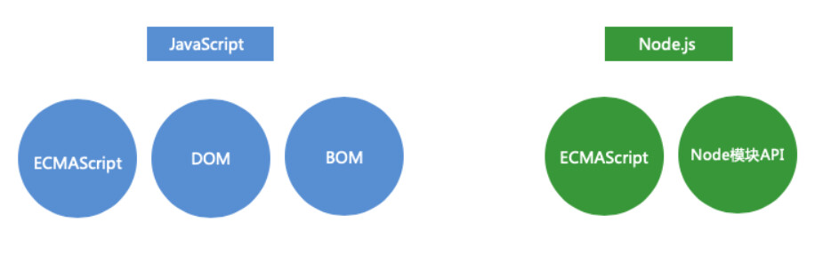
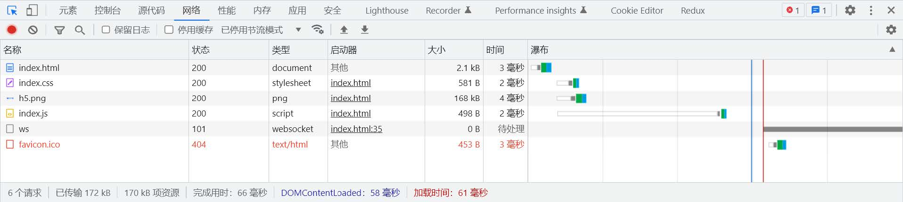
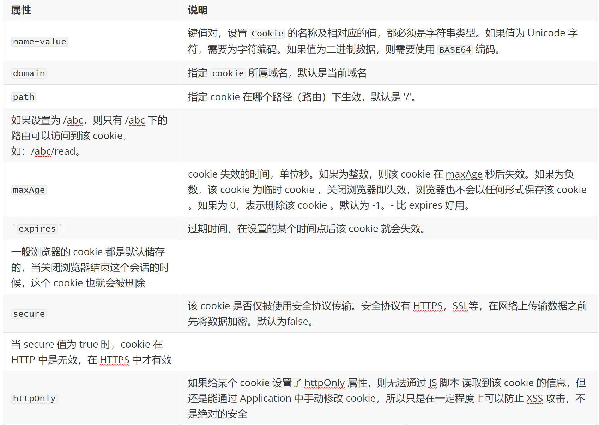
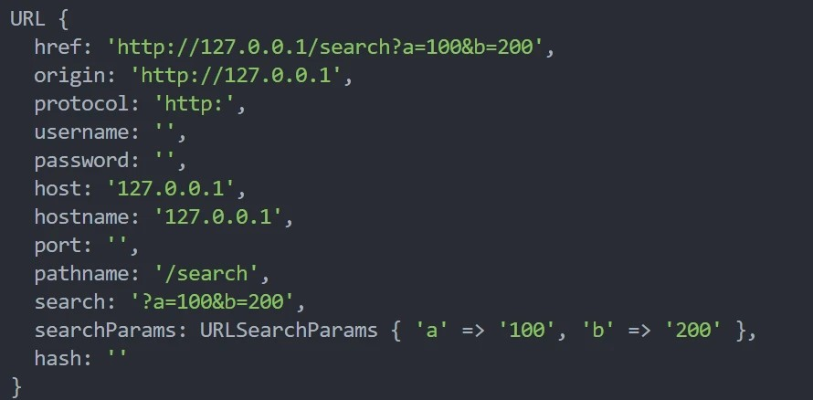
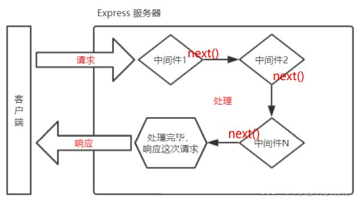
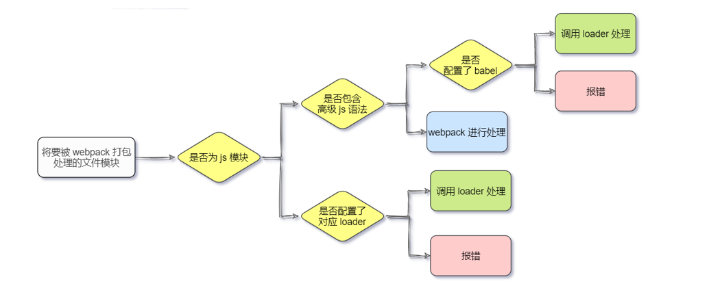

# Node

[Node.js ](http://nodejs.cn/api/)是一个基于 `Chrome V8引擎`​​ 的 `JavaScript`​​ 运行时环境，`Node.js`​​ 可以运行 `JS`​​文件。

​`Node.js`​ 使用了一个**事件驱动**、**非阻塞式 I/O**的模型，使其轻量又高效。

​`Node.js `​不是一门语言，也不是 `JavaScript `​的框架，也不是像`Nginx`​一样的`Web`​服务器 。

​`Node.js`​ 是 `JavaScript `​在服务器端的运行环境（平台）。

​`Node.js `​的组成分为：

* ​**ECMAScript**​。`ECMAScript`​ 的所有语法在 Node 环境中都可以使用。
* Node 环境提供的一些附加 API(包括文件、网络等相关的 API)。

​​

# 基本概念

## 服务端渲染

* 客户端渲染（`CSR / Client side render`​）：

  * 前端通过一大堆接口请求数据，然后通过 `JS`​ 动态处理和生成页面结构和展示。
  * 优点是**前后端分离**、减小服务器压力、局部刷新。
  * 缺点是不利于 SEO（如果你的页面然后通过 `Ajax `​异步获取内容，抓取工具并不会等待异步完成后再行抓取页面内容）、首屏渲染慢。
* **服务端渲染（SSR / Server Side Render）：**

  * 服务器返回的不是接口数据，而是一整个页面（或整个楼层）的 HTML 字符串，浏览器直接显示即可。也就是说，在服务器端直接就渲染好了，然后一次性打包返回给前端。
  * 优点是有利于 SEO、首屏渲染很快。**总结： 搜索引擎优化 + 首屏速度优化 = 服务端渲染**

## 网页加载

网页资源的加载都是循序渐进的，首先获取 `HTML `​的内容， 然后解析 `HTML `​在发送其他资源的请求，如 `CSS`​，`Javascript`​，图片等。

会解析 引入 文件的路径再去发起资源请求

​​

## 请求路径

网页中的 URL 主要分为两大类：`相对路径`​​ 与 `绝对路径`​​

开发中，相对路径是相对代码执行的文件为参照

在网页中，相对路径是以请求发起的时候，网页的`URL`​为参照，要留意页面的协议，主机地址，端口号改变导致的路径变动问题

* 绝对路径：可靠性强，而且相对容易理解，在项目中运用较多

  ```js

  http://atguigu.com/w eb](http://atguigu.com/web   直接向目标资源发送请求，容易理解。网站的外链会用到此形式     
  //atguigu.com/web                                 与页面 URL 的协议拼接形成完整 URL 再发送请求。大型网站用的比较多 
  /web                                              与页面 URL 的协议、主机名、端口拼接形成完整 URL 再发送请求。
  ```
* 相对路径：在发送请求时，需要与当前页面 URL 路径进行 `计算`​ ，得到完整 URL 后，再发送请求。

  ```js
  此时的网页URL http://www.xxx.com/course
  和当前URL进行拼接
  ./css/app.css       http://www.xxx.com/course/css/app.css
  js/app.js           http://www.xxx.com/course/js/app.js
  ../img/logo.png     http://www.xxx.com/img/logo.png
  ../../mp4/show.mp4  http://www.xxx.com/mp4/show.mp4
  ```

## nodemon

`nodemon`​可以帮我们实时监听项目中代码的变化，并且自动重启服务，而且配置简单。

* 安装：`npm install -g nodemon`​，如果无法使用nodemon，那么要去环境变量中进行配置
* 使用：`nodemon`​运行项目，取代之前的`node app.js`​。如 `nodemon  app.js`​

项目运行之后，`nodemon`​会自动监听代码的改动，并且重新启动服务，大大增加我们开发效率。

* 参见配置

  ```js
  在命令行指定应用的端口号：nodemon ./server.js localhost 8080
  查看帮助，帮助里面有很多选项都是一目了然：nodemon -h 或者 nodemon --help
  运行 debug 模式：nodemon --debug ./server.js 80
  手动重启项目： Nodemon 命令运行的终端 窗口中输入 rs 两个字符，然后再按下回车键，就能手动重启 Nodemon了。
  ```

## __dirname

​`__dirname`​​ 保存着 **当前文件夹所在目录的绝对路径**，可以使用 `__dirname`​​ 与文件名拼接成绝对路径

使用 `fs `​模块的时候，尽量使用 `__dirname`​​ 路径转换为绝对路径，这样可以避免相对路径产生的 `Bug`​​

```js
console.log(__dirname); //  /Users/smyhvae/dselegent
```

## __filename

这是一个常量。表示：当前执行文件的完整目录 + 文件名

```js
console.log(__filename); //  /Users/smyhvae/dselegent/app.js
```

## mime

​`媒体类型`​​（通常称为 `Multipurpose Internet Mail Extensions `​或 `MIME `​类型 ）是一种标准，用来表示文档、文件或字节流的性质和格式。

​`HTTP `​服务可以设置响应头` Content-Type`​ 来表明响应体的 `MIME `​类型，浏览器会根据该类型决定如何处理资源

对于未知的资源类型，可以选择 `application/octet-stream`​ 类型，浏览器在遇到该类型的响应时，会对响应体内容进行独立存储，也就是我们常见的 `下载`​ 效果

```js
mime 类型结构： [type]/[subType]
例如： text/html text/css image/jpeg image/png application/json

常见文件对应的 mime 类型
html: 'text/html',
css:  'text/css',
js:   'text/javascript',
png:  'image/png',
jpg:  'image/jpeg', 
gif:  'image/gif',
mp4:  'video/mp4',
mp3:  'audio/mpeg',
json: 'application/json'
```

## Buffer

### 概念

​`Buffer `​是一个类似于数组的 `对象`​ ，用于表示固定长度的字节序列

`Buffer `​本质是一段内存空间，专门用来处理 `二进制数据`​

特点：

* ​`Buffer `​大小固定且无法调整
* ​`Buffer `​性能较好，可以直接对计算机内存进行操作
* 每个元素的大小为 1 字节（`byte`​）

### 基本使用

* 创建

  ```js
  // 创建了一个长度为 10 字节的 Buffer，相当于申请了 10 字节的内存空间，每个字节的值为 0
  let buf_1 = Buffer.alloc(10) //=>结果为<Buffer 00 00 00 00 00 00 00 00 00 00>

  // 创建了一个长度为 10 字节的 Buffer，buffer 中可能存在旧数据，可能会影响执行结果，所以叫 unsafe ，但是效率比 alloc 高
  let buf_2 = Buffer.allocUnsafe(10)

  // 通过字符串创建 Buffer
  let buf_3 = Buffer.from('hello')

  // 通过数组创建 Buffer
  let buf_4 = Buffer.from([105, 108, 111, 118, 101, 121, 111, 117])
  ```
* ​`Buffer`​和字符串转化：使用​`toString`​ 方法将 Buffer 转为字符串

  ```js
  et buf_4 = Buffer.from([105, 108, 111, 118, 101, 121, 111, 117])
  console.log(buf_4.toString()) //=>iloveyou
  ```
* ​`Buffer`​读写

  ```js
  let buf_3 = Buffer.from('hello')
  // 读取
  console.log(buf_3[1]) //=>101
  // 修改
  buf_3[1] = 97
  //查看字符串结果
  console.log(buf_3.toString()) //=>hallo
  ```

## 关于数据库

### 数据库种类

不开源而且付费的商用数据库

* ​`Oracle`​：典型的高富帅；
* ​`SQL Server`​：微软自家产品，Windows定制专款；
* ​`DB2`​：IBM的产品，听起来挺高端；
* ​`Sybase`​：曾经跟微软是好基友，后来关系破裂，现在家境惨淡。

开源免费的数据库

* ​`MySQL`​，大家都在用，一般错不了；
* ​`PostgreSQL`​，学术气息有点重，其实挺不错，但知名度没有`MySQL`​高；
* ​`sqlite`​，嵌入式数据库，适合桌面和移动应用。

## 关系型与非关系数据库区别

关系型和非关系型数据库的主要差异是**数据存储**的方式。

* 关系式数据库  
  关系型数据天然就是表格式的，因此存储在数据表的行和列中。数据表可以彼此关联协作存储，也很容易提取数据。  
  与其相反，非关系型数据不适合存储在数据表的行和列中，而是大块组合在一起。非关系型数据通常存储在数据集中，就像文档、键值对或者图结构。你的数据及其特性是选择数据存储和提取方式的首要影响因素。  
  关系型数据库最典型的数据结构是表，由二维表及其之间的联系所组成的一个数据组织  
  优点：  
  1、易于维护：都是使用表结构，格式一致；  
  2、使用方便：SQL语言通用，可用于复杂查询；  
  3、复杂操作：支持SQL，可用于一个表以及多个表之间非常复杂的查询。  
  缺点：  
  1、读写性能比较差，尤其是海量数据的高效率读写；  
  2、固定的表结构，灵活度稍欠；  
  3、高并发读写需求，传统关系型数据库来说，硬盘I/O是一个很大的瓶颈。
* 非关系型数据库  
  非关系型数据库严格上不是一种数据库，应该是一种数据结构化存储方法的集合，可以是文档或者键值对等。  
  优点：  
  1、格式灵活：存储数据的格式可以是key,value形式、文档形式、图片形式等等，文档形式、图片形式等等，使用灵活，应用场景广泛，而关系型数据库则只支持基础类型。  
  2、速度快：nosql可以使用硬盘或者随机存储器作为载体，而关系型数据库只能使用硬盘；  
  3、高扩展性；  
  4、成本低：nosql数据库部署简单，基本都是开源软件。  
  缺点：  
  1、不提供sql支持；  
  2、无事务处理；  
  3、数据结构相对复杂，复杂查询方面稍欠。

  

‍

## [会话控制](https://juejin.cn/post/6844904034181070861)

​`HTTP `​是一种无状态的协议，它没有办法区分多次的请求是否来自于同一个客户端，无法区分用户

### cookie

​`cookie `​是 `HTTP `​服务器发送到用户浏览器并保存在本地的一小块数据

​`cookie `​是按照域名划分保存的

浏览器向服务器发送请求时，会自动将 `当前域名下`​ 可用的 cookie 设置在请求头中，然后传递给服务器

浏览器限制单个 `cookie`​ 保存的数据不能超过 `4K`​ ，且单个域名下的存储数量也有限制（168？）

​​

* 在 `express `​中使用

  ```js
  const express = require("express");
  const cookieParser = require("cookie-parser");//安装 cookie-parser  npm i cookie-parser
  const app = express();
  app.use(cookieParser());//设置 cookieParser 中间件

  // 设置cookie
  app.get("/set-cookie", (request, response) => {
    // 不带时效性    会在浏览器关闭的时候，销毁
    response.cookie("username", "wangwu");
    // 带时效性
    response.cookie("email", "23123456@qq.com", { maxAge: 5 * 60 * 1000 });
    //响应
    response.send("Cookie的设置");
  });

  // 读取cookie
  app.get("/get-cookie", (request, response) => {
    //读取 cookie
    console.log(request.cookies);
    //响应体
    response.send("Cookie的读取");
  });

  //删除cookie
  app.get("/delete-cookie", (request, response) => {
    response.clearCookie("username");//删除
    response.send("cookie 的清除");
  });

  //启动服务
  app.listen(3000, () => {
    console.log("服务已经启动....");
  });
  ```

### session

​`session `​是保存在服务器端的一块儿数据，保存当前访问用户的相关信息，可以识别用户的身份，快速获取当前用户的相关信息。

填写账号和密码校验身份，校验通过后创建`session 信息`​，然后将 `session_id`​ 的值通过响应头返回给浏览器

有了cookie，下次发送请求时会自动携带cookie，服务器通过 `cookie`​ ** ** 中的 `session_id`​ ** ** 的值来使用

```js
const express = require("express");
const session = require("express-session"); //安装包 npm i express-session connect-mongo
const MongoStore = require("connect-mongo");
const app = express();

//设置 session 的中间件
app.use(
  session({
    name: "sid", //设置cookie的name，默认值是：connect.sid
    secret: "atguigu", //参与加密的字符串（又称签名）  加盐
    saveUninitialized: false, //是否为每次请求都设置一个cookie用来存储session的id
    resave: true, //是否在每次请求时重新保存session
    store: MongoStore.create({
      mongoUrl: "mongodb://127.0.0.1:27017/project", //数据库的连接配置
    }),
    cookie: {
      httpOnly: true, // 开启后前端无法通过 JS 操作
      maxAge: 1000 * 300, // 这一条 是控制 sessionID 的过期时间的！！！
    },
  })
);

//创建 session  session的设置
app.get("/login", (req, res) => {
  //设置session
  req.session.username = "zhangsan";
  req.session.email = "zhangsan@qq.com";
  res.send("登录成功");
});

//获取 session
app.get("/home", (req, res) => {
  console.log("session的信息", req.session.username);
  // 检测 session 是否存在用户数据
  if (req.session.username) {
    res.send(`你好 ${req.session.username}`);
  } else {
    res.send("登录 注册");
  }
});
//销毁 session
app.get("/logout", (req, res) => {
  req.session.destroy(() => {
    res.send("成功退出");
  });
});
app.listen(3000, () => {
  console.log("服务已经启动, 端口 " + 3000 + " 监听中...");
});
```

### token

​`token`​ 是服务端生成并返回给 HTTP 客户端的一串加密字符串， `token`​ 中保存着`用户信息`​

​`token `​不属于 `http `​标准，完全由前后端协商而定，但 `cookie `​属于 `http `​标准

填写账号和密码校验身份，校验通过后响应 `token`​，`token `​一般是在响应体中返回给客户端的

后续发送请求时，需要`手动`​将 token 添加在请求报文中(`cookie`​是自动携带的)，一般是放在请求头中

服务端压力更小，数据存储在客户端

相对更安全，数据加密，可以避免 CSRF（跨站请求伪造）

扩展性更强，服务间可以共享，增加服务节点更简单

### JWT

​`JWT（JSON Web Token ）`​是目前最流行的跨域认证解决方案，可用于基于 `token`​ 的身份验证

​`JWT `​使 `token `​的生成与校验更规范

```js
//导入 jsonwebtokan
const jwt = require("jsonwebtoken");
// 创建 token jwt.sign(数据, 加密字符串, 配置对象)
let token = jwt.sign({username: "zhangsan",},"atguigu",{expiresIn: 60, //单位是 秒});

// 解析 jwt.verify(token,加密字符串，回调函数)
jwt.verify(token, "atguigu", (err, data) => {
  if (err) {
    console.log("校验失败~~");
    return;
  }
  console.log(data); // { username: '张三', iat: (创建时间), exp:(过期时间)}
});
```

## 模块化规范

### AMD

浏览器端规范

​`AMD`​规范：是 `RequireJS `​在推广过程中对模块化定义的规范化产出。

```js
- AMD规范采用异步方式加载模块，模块的加载不影响它后面语句的运行。
- 聊到AMD主要指的是通过require.js实现的模块化
- 项目中看到类似代码说明用的是AMD规范

- 异步加载模块；
- 依赖前置、提前执行：
require([`foo`,`bar`],function(foo,bar){});   //也就是说把所有的包都 require 成功，再继续执行代码。
-define 定义模块：define([`require`,`foo`],function(){return});
```

### CMD

浏览器端规范

​`CMD`​规范：是 `SeaJS `​在推广过程中对模块化定义的规范化产出。淘宝团队开发。

```js
- CMD是另一种js模块化方案，它与AMD很类似。
- 不同点在于：AMD 推崇依赖前置、提前执行，CMD推崇依赖就近、延迟执行。
- 项目中看到类似代码说明用的是CMD规范

同步加载模块；
依赖就近，延迟执行：
require(./a) 直接引入。或者Require.async 异步引入。 //依赖就近：执行到这一部分的时候，再去加载对应的文件。
define 定义模块， export 导出：
define(function(require, export, module){});
```

### CommonJS

服务器端规范

​`CommonJS `​就是**一套约定标准，不是技术**。用于约定我们的代码应该是怎样的一种结构。

​`CommonJS `​规范规定：每个模块内部，`module`​ 变量代表当前模块。这个变量是一个对象，它的 `exports `​属性（即 `module.exports`​）是对外的接口对象。加载某个模块，其实是加载该模块的 `module.exports`​ 对象。

在 CommonJS 中，每个文件都可以当作一个模块：

* 在服务器端：模块的加载是运行时同步加载的。
* 在浏览器端: 模块需要提前编译打包处理。首先，既然同步的，很容易引起阻塞；其次，浏览器不认识`require`​语法，因此，需要提前编译打包。
* 导出模块

  ```js
  Node.js是CommonJS规范的主要实践
  Node.js 是实现了 CommonJS 模块化规范，二者关系有点像 JavaScript 与 ECMAScript
  module.exports 、exports 以及 require 这些都是 `CommonJS` 模块化规范中的内容。

  1.暴露模块
  // 相当于是：给 exports 对象添加属性
  注意：暴露的关键词是exports，不是export。其实，这里的 exports 类似于 ES6 中的 export 的用法，都是用来导出一个指定名字的对象。
  exports.xxx = value // 相当于是：给 exports 对象添加属性
  module.exports = value; //导出整个 exports 对象
  module.exports.xxx = value; //给 exports 对象添加属性

  exports 和 module.exports 的区别
  最重要的区别：
  使用exports时，只能单个设置属性 exports.a \= a;
  使用module.exports时，既单个设置属性 module.exports.a，也可以整个赋值 module.exports \= obj。

  其他要点：
  Node中每个模块的最后，都会执行 return: module.exports。
  Node中每个模块都会把 module.exports指向的对象赋值给一个变量 exports，也就是说 exports = module.exports。
  module.exports = XXX，表示当前模块导出一个单一成员，结果就是XXX。
  如果需要导出多个成员，则必须使用 exports.add = XXX; exports.foo = XXX。或者使用 module.exports.add = XXX; module.export.foo = XXX

  暴露的模块到底是谁？
  暴露的本质是exports对象。【重要】
  比如：
  exports.a = a 可以理解成是，给 exports 对象添加属性。
  module.exports = a 可以理解成是给整个 exports 对象赋值。
  module.exports.c = c 可以理解成是给 exports 对象添加属性。
  Node.js 中每个模块都有一个 module 对象，module 对象中的有一个 exports 属性称之为接口对象。
  我们需要把模块之间公共的方法或属性挂载在这个接口对象中，方便其他的模块使用。
  ```
* 引入模块：执行导入的模块中的代码。返回导入模块中的接口对象。

  ```js
  const module1 = require('模块名');
  内置模块：require的是包名。
  下载的第三方模块：require的是包名。
  自定义模块：require的是文件路径。文件路径既可以用绝对路径，也可以用相对路径。后缀名.js可以省略。
  ```
* 模块初始化：一个模块中的 JS 代码仅在模块第一次被使用时执行一次，并且在使用的过程中进行初始化，然后会被缓存起来，便于后续继续使用。

  ```js
  1.calModule.js
  var a = 1;
  function add () {
    return ++a;
  }
  exports.add = add;

  2.main.js：（在 main.js 中引入 hello.js 模块）
  var addModule1 = require('./calModule')
  var addModule2 = require('./calModule')
  console.log(addModule1.add());//2
  console.log(addModule2.add());//3
  ```

### EMS

```js
- 也叫做ES6 Module
- ES6 在语言标准的层面上，实现了模块功能，逐步会成为浏览器和服务器通用的模块解决方案
```

# Node模块

## fs模块

### writeFile

语法：`fs.writeFile(file, data[, options], callback)`

```js
- file 文件名
- data 待写入的数据
- options 选项设置(可选)
- callback 写入回调
返回值： `undefined`

// require 是 Node.js 环境中的 '全局' 变量，用来导入模块
const fs = require('fs')

// 将 [三人行，必有我师焉。] 写入到当前文件夹下的 [座右铭.txt] 文件中
fs.writeFile('./座右铭.txt', '三人行，必有我师焉。', err =>{
    // 如果写入失败，则回调函数调用时，会传入错误对象，如写入成功，会传入 null
    if(err){
        console.log(err)
        return
    }
    console.log('写入成功')  
})
```

### writeFileSync

语法：`fs.writeFileSync(file, data[, options])`

```js
try{
    fs.writeFileSync('./座右铭.txt', '三人行，必有我师焉。')
}catch(e){
    console.log(e)
}
```

### appendFile 、 appendFileSync

* 概念：​`appendFile`​ 作用是在文件尾部追加内容，`appendFile`​ 语法与 `writeFile`​ 语法完全相同
* ​`fs.appendFile(file, data[, options], callback)`​、`fs.appendFileSync(file, data[, options])`​

  ```js
  fs.append('./座右铭.txt', '则其善者而从之，其不善者而改之。', err =>{
      if(err) throw err
      console.log('追加成功')
  })

  fs.appendFileSync('./座右铭.txt','\r\n温故而知新，可以为师矣')
  ```

### createWriteStream

语法：`fs.createWriteStream(path[, options])`​

程序打开一个文件是需要消耗资源的，流式写入可以减少打开关闭文件的次数。**流式写入方式适用于 **​****大文件写入或者频繁写入****​**的场景，**​`writeFile`​​适合于 **写入频率较低的场景**

```js
let ws = fs.createWriteStream('./观书有感.txt')

//写入数据到流
ws.write('半亩方塘一鉴开\r\n')
ws.write('天光云影共徘徊\r\n')
ws.write('问渠那得清如许\r\n')
ws.write('为有源头活水来\r\n')

//关闭写入流，表明已没有数据要被写入可写流
ws.end()
```

### readFile

**语法**: `fs.readFile(path[, options], callback)`​​ 

```js
// 导入 fs 模块
fs.readFile('./座右铭.txt', (error,data) =>{
    if(err) throw err
    console.log(data)
})

fs.readFile('./座右铭.txt', 'uft-8', (error,data) =>{
    if(err) throw err
    console.log(data)
})
```

### readFileSync

语法：`fs.readFileSync(path[, options])`​

```js
返回值 ：string | Buffer
let data = fs.readFileSync('./座右铭.txt')
let data = fs.readFileSync('./座右铭.txt', 'utf-8')
```

### createReadStream

​​语法​​：`fs.createReadStream(path[, options])`​​

```js
const fs = require('fs')
const dataStream = fs.createReadStream('/文本.text')
dataStream.on('data',chunk=>{
  console.log(chunk.toString)//读取文件的内容
})
```

### rename、renameSync

​`fs.rename(oldPath, newPath, callback)`​

​`fs.renameSync(oldPath, newPath)`​

如果还是移动到当前路径，但是修改了名字，就是重命名了

```js
fs.rename("./观书有感.txt", "./论语/观书有感.txt", (err) => {
  if (err) throw err;
  console.log("移动完成");
});

fs.renameSync("./座右铭.txt", "./论语/.我的座右铭.txt");
```

### ​unlink​​、​unlinkSync​​

​`fs.unlink(path, callback)`​

​`fs.unlinkSync(path)`​

```js
const fs = require("fs");
fs.unlink("./test.txt", (err) => {
  if (err) throw err;
  console.log("删除成功");
});

fs.unlinkSync("./test2.txt");
// 调用 rm 方法(同步 rmSync)
fs.rm("./论语.txt", (err) => {
  if (err) {
    console.log("删除失败");
    return;
  }
  console.log("删除成功");
});
```

### mkdir、mkdirSync

​`fs.mkdir(path[, options], callback)`​

​`fs.mkdirSync(path[, options])`​

```js
// 异步创建文件夹  mk  make  制作   dir  directory  文件夹
fs.mkdir("./page", (err) => {
  if (err) throw err;
  console.log("创建成功");
});
// 递归异步创建
fs.mkdir("./1/2/3", { recursive: true }, (err) => {
  if (err) throw err;
  console.log("递归创建成功");
});
// 递归同步创建文件夹
fs.mkdirSync("./x/y/z", { recursive: true });
```

### readdir、readdirSync

​`fs.readdir(path[, options], callback)`​

​`fs.readdirSync(path[, options])`​

```js
// 异步读取
fs.readdir("./论语", (err, data) => {
  if (err) throw err;
  console.log(data);
});
// 同步读取
let data = fs.readdirSync("./论语");
console.log(data);
```

### ​rmdir​​、​​redirSync​​

​`fs.rmdir(path[, options], callback)`​

​`fs.redirSync(path[, options])`​

```js
// 异步删除文件夹  rm  remove 移除
fs.rmdir("./page", (err) => {
  if (err) throw err;
  console.log("删除成功");
});
//异步递归删除文件夹  不推荐
//=>DeprecationWarning: In future versions of Node.js, fs.rmdir(path, { recursive: true }) will be removed. Use fs.rm(path, { recursive: true }) instead
fs.rmdirSync("./1", { recursive: true }, (err) => {
  if (err) {
    console.log(err);
    return;
  }
  console.log("递归删除");
});
//同步递归删除文件夹
fs.rmdirSync("./x", { recursive: true });

// 建议使用
fs.rm("./a", { recursive: true }, (err) => {
  if (err) {
    console.log(err);
    return;
  }
  console.log("删除成功");
});
```

### ​**stat、statSync**

使用`stat`​ 或 `statSync`​ 来查看资源的详细信息

​`fs.stat(path[, options], callback)`​

​`fs.statSync(path[, options])`​

```js
// 异步获取状态
// stat  方法  status 缩写 状态
fs.stat('/data.txt', (err, data) =>{
  if(err) throw err
  console.log(data)
})
// 同步获取状态
let data = fs.statSync('./data.txt')

- size 文件体积
- birthtime 创建时间
- mtime 最后修改时间
- isFile 检测是否为文件
- isDirectory 检测是否为文件夹
```

​​​​

## path模块

### dirname

​`path.dirname(filepath)`​：获取文件路径

```js
var path = require('path');
var filepath = '/tmp/demo/js/test.js';
console.log( path.dirname(filepath));//  /tmp/demo/js
```

### basename

​`path.basename(filepath)`​：获取文件名称

```js
var path = require('path');
var filepath = '/tmp/demo/js/test.js';
console.log( path.basename(filepath));//  test
```

### extname

​`path.extname(filepath)`​：获取扩展名

```js
var path = require('path');
var filepath = '/tmp/demo/js/test.js';
console.log( path.dirname(extname));// 输出：.js
```

### **resolve**

​`path.resolve([...myPaths])`​：将路径或路径片段的序列解析为绝对路径，返回的路径是从右往左处理，后面的每个 `myPath `​​被依次解析，直到构造出一个完整的绝对路径。

```js
const path = require('path');
// 假设当前工作路径是 /Users/a/Documents/git-code/nodejs-learning-guide/examples/2016.11.08-node-path
// 输出 /Users/a/Documents/git-code/nodejs-learning-guide/examples/2016.11.08-node-path
console.log( path.resolve('') )
// 输出 /Users/a/Documents/git-code/nodejs-learning-guide/examples/2016.11.08-node-path
console.log( path.resolve('.') )
// 输出 /foo/bar/baz
console.log( path.resolve('/foo/bar', './baz') );
// 输出 /foo/bar/baz
console.log( path.resolve('/foo/bar', './baz/') );
// 输出 /tmp/file
console.log( path.resolve('/foo/bar', '/tmp/file/') );
// 输出 /Users/a/Documents/git-code/nodejs-learning-guide/examples/2016.11.08-node-path/www/js/mod.js
console.log( path.resolve('www', 'js/upload', '../mod.js') );

注意：
如果 dirname 是以 ./ 、../、不加 / 开头的话，那么 resolve 会找到磁盘下的根目录
var dirname = '../User/Desktop';
var basename = 'abc.txt';
path.join(dirname, basename);  // ../User/Desktop/abc.txt
path.resolve(dirname, basename);  // /Users/Desktop/node/User/Desktop/abc.txt

如果 basename 是以 / 开头的，那么 resolve 就会直接返回 basename 
var dirname = '/User/Desktop';
var basename = '/abc.txt';
path.join(dirname, basename);  // /User/Desktop/abc.txt
path.resolve(dirname, basename);  // /abc.txt
```

### join

​`path.join([...paths]);`​：将路径进行拼接，没有特殊处理，可以理解成前后路径直接拼接

```js
const path = require('path');
const result1 = path.join(__dirname, './app.js');
console.log(result1); // 返回：/Users/smyhvae/dselegent/app.js
const result2 = path.join('/foo1', 'foo2', './foo3');
console.log(result2); // 返回：/foo1/foo2/foo3
const result3 = path.join('/foo1', 'foo2', '/foo3');
console.log(result3); // 返回：/foo1/foo2/foo3
```

### **sep**

获取操作系统的路径分隔符

```js
 // sep 获取路径分隔符
 console.log(path.sep) //=> window \  linux /
```

### **parse**

解析路径并返回文件对象

```js
 // 解析路径
 let str = 'D:\\Desktop\\Node\\code\\04-path\\01-path.js'
 console.log(path.parse(str))  //返回该路径下的文件对象
```

## http模块

### 基本概念

​`http`​也是内置模块, `Node.js`​ 官方提供的、用来创建web 服务器的模块。

​`HTTP（hypertext transport protocol）`​协议；中文叫 超文本传输协议，

是一种基于`TCP/IP`​的应用层通信协议，这个协议详细规定了 `浏览器`​​ 和 万维网 `服务器`​​ 之间互相通信的规则

### 请求报文

用来向服务器发送数据，可以被称之为 ** 请求报文**

* 请求行

  ```js
  - 请求方法（get、post、put、delete等）
  - 请求 URL（统一资源定位器）
    例如：http://www.baidu.com/index.html?a=100&b=200#logo

    - http:          协议 (https、ftp、ssh等)
    - www.baidu.com  域名
    - 80             端口号
    - /index.html    路径
    - a=100&b=200    查询字符串
    - #logo          哈希 (锚点链接)
  ```
* 请求头： `头名：头值`​

  ```js
  Host：主机名
  Connection：连接的设置 keep-alive（保持连接）；close（关闭连接）
  Cache-Control：缓存控制 max-age = 0 （没有缓存）
  Upgrade-Insecure-Requests：将网页中的http请求转化为 https 请求（很少用）老网站升级
  User-Agent：用户代理，客户端字符串标识，服务器可以通过这个标识来识别这个请求来自哪个客户端 ，一般在PC端和手机端的区分
  Accept：设置浏览器接收的数据类型
  Accept-Encoding：设置接收的压缩方式
  Accept-Language：设置接收的语言 q=0.7 为喜好系数，满分为1
  Cookie：后端设置用于保存信息
  ```
* 空行
* 请求体：格式比较随意，可以是空，可以是字符串，可以是`JSON`​

### 响应报文

向客户端返回数据，可以被称之为 **响应报文**

* 响应行:  `HTTP/1.1 200 OK`​

  ```js
  - HTTP/1.1：HTTP协议版本号
  - 200：响应状态码 404 Not Found 500 Internal Server Error
    还有一些状态码，参考：https://developer.mozilla.org/zh-CN/docs/Web/HTTP/Status
    OK：响应状态描述
  ```
* 响应头

  ```js
  Cache-Control: 缓存控制 private 私有的，只允许客户端缓存数据
  Connection: 链接设置
  Content-Type:text/html;charset=utf-8: 设置响应体的数据类型以及字符集,响应体为html，字符集utf-8
  Content-Length: 响应体的长度，单位为字节
  ```
* 空行
* 响应体

  ```js
  响应体内容的类型是非常灵活的，常见的类型有 HTML、CSS、JS、图片、JSON
  ```

### 创建web服务

* 基本流程

  ```js
  const http = require('http')
  const server = http.createServer()
  server.listen(3000, () => {
    console.log('已监听到请求')
  })

  server.on('request', (request, response) => {  // request ,response 形参。名字可以改,如非必要不建议改
    console.log('request.method:', request.method)
    console.log('request.url:', request.url)
    // 这里要处理客户端的请求
    console.log('hello html')
    // 设置响应头
    response.setHeader('info', 'good good study daydayup')
    // 设置状态码
    response.statusCode = 404
    // 响应内容给客户端
    response.end('nice to meet you')
  })

  ```
* ​`response`​:常见属性和方法

  ```js
  res.write(data);  给浏览器发送响应体，可以调用多次，从而提供连续的请求体
  res.end();   通知浏览器，所有响应头和响应主体都已被发送，即服务器将其视为已完成。
  res.end(data); 结束请求，并且响应一段内容，相当于res.write(data) + res.end()
  res.statusCode: 响应的的状态码 200 404 500
  res.statusMessage: 响应的状态信息， OK Not Found ,会根据statusCode自动设置。
  res.setHeader(name, value); 设置响应头信息， 比如content-type
  res.writeHead(statusCode, statusMessage, options); 设置响应头，同时可以设置状态码和状态信息。
  ```
* 中文乱码问题：当调用 `res.end()`​ 方法，向客户端发送中文内容时，会出现乱码问题，需要手动设置内容编码格式

  ```js
  //setHeader('Content-Type','text/plain; charset=utf-8');设置内容的格式,让浏览器知道如何解析
  // 普通文本
  res.setHeader('Content-Type', 'text/plain; charset=utf-8');
  // html
  res.setHeader('Content-Type', 'text/html; charset=utf-8');
  ```

### 获取请求报文数据

|**含义**|**语法**|
| ----------------| ------|
|请求方法|​`request.method`​|
|请求版本|​`request.httpVersion`​|
|请求路径|​`request.url`​|
|URL 路径​|​`require('url').parse(request.url).pathname`​|
|URL 查询字符串|​`require('url').parse(request.url,  true).query`​|
|请求头|​`request.headers`​|
|请求体|​`request.on('data', function(chunk){}) request.on('end', function(){})`​|

* 基本使用

  ```js
  // 1. 导入 http 模块
  const http = require('http')
  // 2. 创建服务对象
  const server = http.createServer((request, response) => {
    // 获取请求的方法
    console.log(request.method)  //=>GET
    // 获取请求的 url
    console.log(request.url)  // 只包含 url 中的 路径 与查询字符串
    // 获取 http 协议的版本号
    console.log(request.httpVersion)  //=> 1.1
    // 获取 http 的请求头
    console.log(request.headers) //=>结果是一个对象
    response.end('http') //=>设置响应体
  })

  // 3. 监听端口，启动服务
  server.listen(9000, () => {
    console.log('服务已经启动...')
  })
  ```
* 注意

  ```js
  1. request.url 只能获取路径以及查询字符串，无法获取 URL 中的域名以及协议的内容
  2. request.headers 将请求信息转化成一个对象，并将属性名都转化成了『小写』
  3. 关于路径：如果访问网站的时候，只填写了 IP 地址或者是域名信息，此时请求的路径为『 `/` 』
  4. 关于 favicon.ico：这个请求是属于浏览器自动发送的请求
  ```
* 提取请求体

  ```js
  // 1. 导入 http 模块
  const http = require('http')

  // 2. 创建服务对象
  const server = http.createServer((request, response) => {
    // 1. 声明一个变量
    let body = ''
    // 2. 绑定 data 事件
    request.on('data', chunk => {
      body += chunk
    })
    // 3. 绑定 end 事件
    request.on('end', () => {
      console.log(body)  //=>'username=111&password=111'
      // 响应
      response.end('Hello Http') //=>设置响应体 
    })
  })

  // 3. 监听端口，启动服务
  server.listen(9000, () => {
    console.log('服务已经启动...')
  })
  ```
* 提取 `url `​路径 和查询字符串

  ```js
  1.使用 url 模块
  const http = require('http')
  const url = require('url')
  const server = http.createServer((request, response) => {
    // 2. 解析 request.url
    console.log(request.url)   //=>/search?keyword=h5
    // 使用 parse 解析 request.url 的内容
    // true 将 query 属性将会设置为一个 对象
    let res = url.parse(request.url, true)
    console.log(res)  // 如下图所示，为一个对象
    // 路径
    let pathname = res.pathname
    // 查询字符串
    let keyword = res.query.keyword
    console.log(keyword)   //=>h5
    response.end('url')
  })


  2.使用 URL 类，推荐
  const http = require('http')
  const server = http.createServer((request, response) => {
    // 实例化 url 对象
    // let url = new URL('/search?a=100&b=200','http://127.0.0.1:9000')
    let url = new URL(request.url, 'http://127.0.0.1')
    console.log(url)  //=>如图所示，为一个对象
    // 输出路径
    console.log(url.pathname)  //=>/search
    // 输出 keyword 查询字符串
    console.log(url.searchParams.get('a'))  //=> 100
    response.end('url new')
  })
  ```
* url对象  
  ​​

### 设置响应报文

|**作用**|**语法**|
| ------------------| --------------------|
|设置响应状态码|​`response.statusCode`​|
|设置响应状态描述|​`response.statusMessage （ 用的非常少 ）`​​|
|设置响应头信息|​`response.setHeader('头名', '头值')`​​(可以自定义)|
|设置响应体|​`response.write('xx') response.end('xxx')`​​|

* 基本使用

  ```js
  // 1. 设置响应状态码
  response.statusCode = 203
  // 2. 响应状态的描述
  response.statusMessage = 'i love you'
  // 3. 响应头
  response.setHeader('content-type', 'text/html;charset=utf-8')
  // 自定义响应头
  response.setHeader('myHeader', 'test test')
  // 设置多个同名的响应头
  response.setHeader('test', ['a', 'b', 'c'])
  ```
* 设置响应体

  ```js
  // write 和 end 的两种使用情况：
  // 1. write 和 end 的结合使用 响应体相对分散
  response.write('xx');
  response.write('xx');
  response.write('xx');
  response.end(); //每一个请求，在处理的时候必须要执行 end 方法的

  //2. 单独使用 end 方法 响应体相对集中
  response.end('xxx');
  ```

### qs

​`qs`​是一个`npm`​仓库所管理的包。可通过`npm install qs`​命令进行安装.

```js
const qs = require('qs');

1.qs.parse()
const str = "username='admin'& password='123456'";
console.log(qs.parse(str)); 
// Object { username: "admin", password: "123456" }

2.qs.stringify()
const a = qs.stringify({ username: 'admin', password: '123456' });
console.log(a); 
// username=admin&password=123456
```

## events

实例化 `EventEmitter `​类来绑定和监听事件

```js
// 引入 events 模块
var EventEmitter = require('events');
// 创建 eventEmitter 对象
var event = new EventEmitter();

event.on('someEvent', function(arg1, arg2) { 
    console.log('listener1', arg1, arg2); 
}); 

event.on('someEvent', function(arg1, arg2) { 
    console.log('listener2', arg1, arg2); 
}); 

event.emit('someEvent', 'arg1 参数', 'arg2 参数'); 

//listener1 arg1 参数 arg2 参数
//listener2 arg1 参数 arg2 参数
```

## stream

### 概念

​`stream`​是`Node.js`​提供的一个仅在服务区端可用的模块，目的是支持“流”这种数据结构。

​流是一种抽象的数据结构。想象水流，当在水管中流动时，就可以从某个地方（例如自来水厂）源源不断地到达另一个地方（比如你家的洗手池）。我们也可以把数据看成是数据流，比如你敲键盘的时候，就可以把每个字符依次连起来，看成字符流。这个流是从键盘输入到应用程序，实际上它还对应着一个名字：**标准输入流（**​**`stdin`**​ **）** 。

如果应用程序把字符一个一个输出到显示器上，这也可以看成是一个流，这个流也有名字：**标准输出流（**​**`stdout`**​ **）** 。

**流的特点是数据是有序的，而且必须依次读取，或者依次写入，不能像Array那样随机定位。**

有些流用来读取数据，比如从文件读取数据时，可以打开一个文件流，然后从文件流中不断地读取数据。有些流用来写入数据，比如向文件写入数据时，只需要把数据不断地往文件流中写进去就可以了。

在Node.js中，流也是一个对象，我们只需要响应流的事件就可以了：`data`​事件表示流的数据已经可以读取了，`end`​事件表示这个流已经到末尾了，没有数据可以读取了，`error`​事件表示出错了。

### 读取流

`data`​事件可能会有多次，每次传递的`chunk`​是流的一部分数据。

```js
const fs = require('fs');
//创建读取流
let rs = fs.createReadStream('hello.txt', 'utf-8');
rs.on('open', function () {
  console.log('读取的文件已打开');
}).on('close', function () {
  console.log('读取流结束');
}).on('error', err => {
  console.log(err);
}).on('data', function (chunk) {
  //每一批数据流入完成
  console.log('单批数据流入:' + chunk.length);
  console.log(chunk);
});
```

### 写入流

```js
const fs = require('fs');
//创建写入流
let ws = fs.createWriteStream('hello.txt', 'utf-8');

//监听文件打开事件
ws.on('open', function () {
  console.log('文件打开');
});

//监听文件关闭事件
ws.on('close', function () {
  console.log('文件写入完成，关闭');
});

//文件流式写入
ws.write('helloworld1!', function (err) {
  if (err) {
    console.log(err);
  } else {
    console.log('内容1流入完成');
  }
});
ws.write('helloworld2!', function (err) {
  if (err) {
    console.log(err);
  } else {
    console.log('内容2流入完成');
  }
});

//文件写入完成
ws.end(function () {
  console.log('文件写入关闭');
});
```

### pipe

​`pipe`​ 就像可以把两个水管串成一个更长的水管一样，两个流也可以串起来。

一个`Readable`​流和一个`Writable`​流串起来后，所有的数据自动从`Readable`​流进入`Writable`​流，这种操作叫`pipe`​。

在`Node.js`​中 **，**​`Readable`​流有一个`pipe()`​方法，就是用来干这件事的。

用`pipe()`​把一个文件流和另一个文件流串起来，这样源文件的所有数据就自动写入到目标文件里了，所以，这实际上是一个复制文件的程序

* 基本使用

  ```js
  const fs = require('fs');

  //创建读取流
  let rs = fs.createReadStream('video.mp4');
  let ws = fs.createWriteStream('b.mp4');

  rs.on('close', function () {
    console.log('读取流结束');
  });

  rs.pipe(ws);
  ```
* 原理

  ```js
  const fs = require('fs');

  //创建读取流
  let rs = fs.createReadStream('video.mp4');
  let ws = fs.createWriteStream('b.mp4');

  rs.on('close', function () {
    ws.end();
    console.log('读取流结束');
  });

  //每一批数据流入完成
  rs.on('data', function (chunk) {
    console.log('单批数据流入:' + chunk.length);
    ws.write(chunk, () => {
      console.log('单批输入流入完成');
    });
  });
  ```

## zib

浏览器向服务器发起资源请求，比如下载一个`js`​文件，服务器先对资源进行压缩，再返回给浏览器，以此节省流量，加快访问速度。

浏览器通过HTTP请求头部里加上`Accept-Encoding`​，告诉服务器，“你可以用`gzip`​，或者`defalte`​算法压缩资源”。

### 压缩

```js
var fs = require('fs');
var zlib = require('zlib');

var gzip = zlib.createGzip();

var readstream = fs.createReadStream('./extra/fileForCompress.txt');
var writestream = fs.createWriteStream('./extra/fileForCompress.txt.gz');

readstream.pipe(gzip).pipe(writestream);
```

### 解压

```js
var fs = require('fs');
var zlib = require('zlib');

var gunzip = zlib.createGunzip();

var readstream  = fs.createReadStream('./extra/fileForCompress.txt.gz');
var writestream  = fs.createWriteStream('./extra/fileForCompress1.txt');

readstream.pipe(gunzip).pipe(writestream);
```

### 服务端gzip压缩

* 基本使用

  ```js
  // 1.首先判断 是否包含 accept-encoding 首部，且值为 gzip。
  // 2.否：返回未压缩的文件。是：返回gzip压缩后的文件。

  var http = require("http");
  var zlib = require("zlib");
  var fs = require("fs");
  var filepath = "./extra/fileForGzip.html";

  var server = http.createServer(function (req, res) {
    var acceptEncoding = req.headers["accept-encoding"];
    var gzip;
    if (acceptEncoding.indexOf("gzip") != -1) {
      // 判断是否需要gzip压缩
      gzip = zlib.createGzip();
      // 记得响应 Content-Encoding，告诉浏览器：文件被 gzip 压缩过
      res.writeHead(200, {
        "Content-Encoding": "gzip",
      });
      fs.createReadStream(filepath).pipe(gzip).pipe(res);
    } else {
      fs.createReadStream(filepath).pipe(res);
    }
  });
  server.listen("3000");
  ```
* js大文件返回

  ```js
  const fs = require("fs");
  const zlib = require("zlib"); //这两个要写在fs模块后面
  const gzip = zlib.createGzip();
  const http = require("http");

  http
    .createServer((req, res) => {
      let rs = fs.createReadStream("hello.js");
      res.writeHead(200, {
        "Content-Type": "application/x-javascript;charset=utf-8",
        "Content-Encoding": "gzip",
      });
      rs.pipe(gzip).pipe(res);
    })
    .listen(3000, () => {
      console.log("server start");
    });

  ```
* 字符串gzip压缩：`zlib.gzipSync(str)`​

  ```js
  var http = require('http');
  var zlib = require('zlib');

  var responseText = 'hello world';

  var server = http.createServer(function(req, res){
      var acceptEncoding = req.headers['accept-encoding'];
      if(acceptEncoding.indexOf('gzip')!=-1){
          res.writeHead(200, {
              'content-encoding': 'gzip'
          });
          res.end(zlib.gzipSync(responseText) );
      }else{
          res.end(responseText);
      }

  });

  server.listen('3000');
  ```

## crypto

​`crypto`​模块的目的是为了提供通用的加密和哈希算法。用纯`JavaScript`​代码实现这些功能不是不可能，但速度会非常慢。`Nodejs`​用`C/C++`​实现这些算法后，通过`cypto`​这个模块暴露为`JavaScript`​接口，这样用起来方便，运行速度也快。

### hash

​`hash.digest([encoding])`​：计算摘要。`encoding`​可以是`hex`​、`latin1`​或者`base64`​。

如果声明了`encoding`​，那么返回字符串。否则，返回`Buffer`​实例。

注意，调用`hash.digest()`​后，`hash`​对象就作废了，再次调用就会出错。

​`hash.update(data[, input_encoding])：input_encoding`​可以是`utf8`​、`ascii`​或者`latin1`​。

如果`data`​是字符串，且没有指定` input_encoding`​，则默认是`utf8`​。注意，`hash.update()`​方法可以调用多次。

```js
var crypto = require('crypto');
var fs = require('fs');

var content = fs.readFileSync('./test.txt', {encoding: 'utf8'});
var hash = crypto.createHash('sha256');
var output;

hash.update(content);
hash.digest('hex'); 

// 报错：Error: Digest already called
hash.update(content);
// 报错：Error: Digest already called
hash.digest('hex');
```

### hmac

​`HMAC`​的全称是`Hash-based Message Authentication Code`​，也即在`hash`​的**加盐**运算。

跟`hash`​模块差不多，选定`hash`​算法，指定“**盐**”即可。

```js
var crypto = require('crypto');
var fs = require('fs');

var secret = 'secret';
var hmac = crypto.createHmac('sha256', secret);
var input = fs.readFileSync('./test.txt', {encoding: 'utf8'});

hmac.update(input);

console.log( hmac.digest('hex') );
// 输出：
// 734cc62f32841568f45715aeb9f4d7891324e6d948e4c6c60c0621cdac48623a
```

### MD5

​`MD5（Message-Digest Algorithm）`​是计算机安全领域广泛使用的散列函数（又称哈希算法、摘要算法），主要用来确保消息的完整和一致性。常见的应用场景有密码保护、下载文件校验等。

* 特点

  * 运算速度快：对`jquery.js`​求md5值，57254个字符，耗时1.907ms
  * 输出长度固定：输入长度不固定，输出长度固定（128位）。
  * 运算不可逆：已知运算结果的情况下，无法通过通过逆运算得到原始字符串。
  * 高度离散：输入的微小变化，可导致运算结果差异巨大。
  * 弱碰撞性：不同输入的散列值可能相同。
* 应用场景

  * 文件完整性校验：比如从网上下载一个软件，一般网站都会将软件的md5值附在网页上，用户下载完软件后，可对下载到本地的软件进行md5运算，然后跟网站上的md5值进行对比，确保下载的软件是完整的（或正确的）
  * 密码保护：将md5后的密码保存到数据库，而不是保存明文密码，避免拖库等事件发生后，明文密码外泄。
  * 防篡改：比如数字证书的防篡改，就用到了摘要算法。（当然还要结合数字签名等手段）

```js
var crypto = require('crypto');
var md5 = crypto.createHash('md5');
var result = md5.update('a').digest('hex');
// 输出：0cc175b9c0f1b6a831c399e269772661
console.log(result);
```

# express

[express ](https://www.expressjs.com.cn/)是一个基于 `Node.js`​ 平台的极简、灵活的 WEB 应用开发框架

## 基本使用

路由：确定了应用程序如何响应客户端对特定端点的请求

或者简单的来说，判断客户端请求的方法、路径、参数等条件进行判断，返回不同的页面

### 请求响应

```js
//导入 express
const express = require("express");
//创建应用对象
const app = express();
//创建 get 路由
app.get("/home", (req, res) => {
  res.send("网站首页");
});
//首页路由
app.get("/", (req, res) => {
  res.send("我才是真正的首页");
});
//创建 post 路由
app.post("/login", (req, res) => {
  res.send("登录成功");
});
//匹配所有的请求方法
app.all("/search", (req, res) => {
  res.send("1 秒钟为您找到相关结果约 100,000,000 个");
});
//自定义 404 路由
app.all("*", (req, res) => {
  res.send("<h1>404 Not Found</h1>");
});
//监听端口 启动服务
app.listen(3000, () => {
  console.log("服务已经启动, 端口监听为 3000");
});
```

### 获取请求参数

```js
//导入 express
const express = require('express');
//创建应用对象
const app = express();
//获取请求的路由规则
app.get('/request', (req, res) => {
  // 1. 获取报文的方式与原生 HTTP 获取方式是兼容的
  console.log(req.method);
  console.log(req.url);
  console.log(req.httpVersion);
  console.log(req.headers);
  // 2. express 独有的获取报文的方式
  // 获取路径
  console.log(req.path)
  //获取查询字符串
  console.log(req.query); // 『相对重要』对象形式返回所有的查询字符串
  // 获取指定的请求头
  console.log(req.get('host'));
  res.send('请求报文的获取');
});
//启动服务
app.listen(3000, () => {
  console.log('启动成功....')
})
```

### 路由参数

路由参数指的是 `URL`​ 路径中的参数

```js
app.get('/:id.html', (req, res) => {
  res.send('商品详情, 商品 id 为' + req.params.id);
});
```

## 响应设置

```js
//获取请求的路由规则
app.get("/response", (req, res) => {
  //1. express 中设置响应的方式兼容 HTTP 模块的方式
  res.statusCode = 404;
  res.statusMessage = 'xxx';
  res.setHeader('abc','xyz');
  res.write('响应体');
  res.end('xxx');
  //2. express 的响应方法
  res.status(500); //设置响应状态码
  res.set('xxx','yyy');//设置响应头
  res.send('中文响应不乱码');//设置响应体
  //连贯操作
  res.status(404).set('xxx','yyy').send('你好朋友')
  //3. 其他响应
  res.redirect('http://atguigu.com')//重定向
  res.download('./package.json');//下载响应
  res.json();//响应 JSON
  res.sendFile(__dirname + '/home.html') //响应文件内容
});
```

## response

### 方法概述

```js
res.download()//提示要下载的文件。
res.end()//结束响应过程。
res.json()//发送JSON响应。
res.jsonp()//发送带有JSONP支持的JSON响应。
res.redirect()//重定向请求。
res.render()//渲染视图模板。
res.send()//发送各种类型的响应。
res.sendFile()//将文件作为八位字节流发送。
res.sendStatus()//设置响应状态代码，并将其字符串表示形式发送为响应正文。
```

### **redirect**

`response.redirect`​方法允许网址的重定向

```js
response.redirect("/hello/anime");
response.redirect("http://www.example.com");
response.redirect(301, "http://www.example.com"); 
```

### **sendFile**

​`response.sendFile`​方法用于发送文件

```js
response.sendFile("/path/to/anime.mp4");
```

### **render**

​**`response.render`**​方法用于渲染网页模板。

```js
//  使用render方法，将message变量传入index模板，渲染成HTML网页
app.get("/", function(request, response) {
  response.render("index", { message: "Hello World" });
});
```

‍

## 中间件

中间件（`Middleware`​​）本质是一个回调函数，作用就是使用函数封装公共操作，简化代码。

简单说，中间件（`middleware`​）就是处理`HTTP`​请求的函数。它最大的特点就是，一个中间件处理完，再传递给下一个中间件。App实例在运行过程中，会调用一系列的中间件。

每个中间件可以从App实例，接收三个参数，依次为`request`​对象（代表HTTP请求）、`response`​对象（代表HTTP回应），`next`​回调函数（代表下一个中间件）。每个中间件都可以对HTTP请求（request对象）进行加工，并且决定是否调用next方法，将request对象再传给下一个中间件。

‍

​​​

### 全局中间件

* 声明全局中间件

  ```js
  中间件可以访问到 request 和r esponse
  let recordMiddleware = function(request,response,next){
    //实现功能代码
    //.....
    next(); //执行next函数(当如果希望执行完中间件函数之后，仍然继续执行路由中的回调函数，必须调用next)
  }
  ```
* 应用全局中间件

  ```js
  //可以单独使用一个中间件
  app.use(recordMiddleware)

  //可以一次性使用多个中间件
  app.use(function (request, response, next) {
    console.log('定义第一个中间件');
   next();
  })
  app.use(function (request, response, next) {
    console.log('定义第二个中间件');
    next();
  })
  ```

### 路由中间件

只需要对某一些路由进行功能封装 **，则就需要路由中间件**

```js
//中间件函数和全局函数是一样的
app.get('/路径',`中间件函数`,(request,response)=>{
});
app.get('/路径',`中间件函数1`,`中间件函数2`,(request,response)=>{
});
```

### 静态资源中间件

静态资源：`html`​、`js`​、`css`​、图片等

```js
//引入express框架
const express = require('express');
//创建服务对象
const app = express();
//静态资源中间件的设置，将当前文件夹下的public目录作为网站的根目录
app.use(express.static('./public')); //当然这个目录中都是一些静态资源
//如果访问的内容经常变化，还是需要设置路由
//但是，在这里有一个问题，如果public目录下有index.html文件，单独也有index.html的路由
//则谁书写在前，优先执行谁
app.get('/index.html',(request,response)=>{
  respsonse.send('首页');
});
//监听端口
app.listen(3000,()=>{
  console.log('3000 端口启动....');
});
```

### body-parser

用于获取请求体参数的中间件插件

* 安装

  ```js
  npm i body-parser
  ```
* 基本使用

  ```js
  const bodyParser = require('body-parser');
  //处理 querystring 格式的请求体
  let urlParser = bodyParser.urlencoded({extended:false}));
  //处理 JSON 格式的请求体
  let jsonParser = bodyParser.json();

  //设置成路由中间件
  urlParser中间件会对request进行处理，
  app.post('/login', urlParser, (request,response)=>{
    //获取请求体数据
    //console.log(request.body);
    //用户名
    console.log(request.body.username);
   //密码
    console.log(request.body.userpass);
    response.send('获取请求体数据');
  });
  ```

## Router

* 创建路由对象

  ```js
  //1. 导入 express
  const express = require("express");
  //2. 创建路由器对象
  const router = express.Router();
  //3. 在 router 对象身上添加路由
  router.get("/", (req, res) => {
    res.send("首页");
  });

  router.get("/cart", (req, res) => {
    res.send("购物车");
  });
  //4. 暴露
  module.exports = router;
  ```
* 使用`router`​中间件

  ```js
  const express = require('express');
  const app = express();
  //5.引入子路由文件
  const homeRouter = require('./routes/homeRouter');
  //6.设置和使用中间件
  app.use(homeRouter);

  app.listen(3000,()=>{
    console.log('3000 端口启动....');
  })
  ```

# EJS

## 模板引擎

模板引擎是分离​用户界面和业务数据的一种技术

[EJS ](https://ejs.bootcss.com/)是一个高效的 `Javascript`​ 的模板引擎

## 基本使用

* 安装：`npm i ejs --save`​
* 基本使用

  ```js
  //1.引入ejs
  const ejs = require('ejs');
  //2.定义数据
  let person = ['张三','李四','王二麻子'];
  //3.ejs解析模板返回结构
  //<%= %> 是ejs解析内容的标记，作用是输出当前表达式的执行结构
  //"<%= %>"可以直接输出变量或表达式的值，变量或表达式的值将作为一个字符串在浏览器中输出。
  let html = ejs.render(‘<%= person.join(",") %>’, {person:person}); //把 templateValue：value 。把自己定义的 person 值给模板中的 person 变量使用 
  //4.输出结果
  console.log(html);
  ```
* 基本语法

  ```js
  1.执行JS代码
  <% code %>
  2.输出转义的数据到模板上
  <%= code %>
  3.输出非转义的数据到模板上
  <%- code %>
  ```

## person中使用

* 设置模板引擎

  ```js
  const express = require('express')
  const path = require('path')

  const app = express()

  // 1. 设置模板引擎
  app.set('view engine', 'ejs')  // pug  twing

  // 2. 设置模板文件的存放位置
  // 模板文件: 具有模板语法内容的文件
  app.set('views', path.resolve(__dirname, './views'))

  // 创建路由
  app.get('/home', (req, res) => {
    // 3. render 响应
    // res.render('模板的文件名','数据')
    let title = '尚硅谷 - 让天下没有难学的技术'
    res.render('home', { title })
    // 4. 创建模板文件
    // 如下面文件 views/home.ejs
  })

  // 监听端口，启动服务
  app.listen(3000, () => {
    console.log('服务器已启动~~~~')
  })
  ```
* 设置静态资源：​`views/home.ejs`​

  ```js
  <!DOCTYPE html>
  <html lang="en">
  <head>
    <meta charset="UTF-8">
    <meta http-equiv="X-UA-Compatible" content="IE=edge">
    <meta name="viewport" content="width=device-width, initial-scale=1.0">
    <title>Document</title>
  </head>
  <body>
    <h2>
      <%=title %>
    </h2>
  </body>

  </html>
  ```

# Mongoose

[Mongoose ](http://www.mongoosejs.net/)是一个对象文档模型库，方便使用代码操作 mongodb 数据库

mongoose中的对象：

* ​`Schema`​模式对象（Schema对象定义约束了数据库中的文档结构）
* ​`Model`​模型对象（Model对象作为集合中的所有文档的表示，相当于MongoDB数据库中的集合collection）
* ​`Document `​文档对象（Document表示集合中的具体文档，相当于集合中的一个具体的文档）

## MongoDB

[MongoDB ](https://www.mongodb.com/)是一个基于分布式文件存储的数据库

数据库（DataBase）是按照数据结构来组织、存储和管理数据的 `应用程序`​

* 数据库（database） 数据库是一个数据仓库，数据库服务下可以创建很多数据库，数据库中可以存放很多集合
* 集合（collection） 集合类似于 JS 中的数组，在集合中可以存放很多文档
* 文档（document）   文档是数据库中的最小单位，类似于 JS 中的对象

图形化工具：

* [Robo 3T ](https://github.com/Studio3T/robomongo/releases)免费
* [Navicat ](https://www.navicat.com.cn/)收费

## 数据类型

```js
String：字符串
Number：数字
Boolean：布尔值
Array：数组，也可以使用 [] 来标识
Date：日期
BufferBuffer： 对象
Mixed：任意类型，需要使用 mongoose.Schema.Types.Mixed 指定
ObjectId：对象 ID，需要使用 mongoose.Schema.Types.ObjectId 指定
Decimal128：高精度数字，需要使用 mongoose.Schema.Types.Decimal128 指定
```

## 字段校验

```js
title: {
  type: String, //类型
  required: true // 设置必填项
  default: '男' //默认值
  enum: ['男','女'] //设置的值必须是数组中的
  unique: true//唯一值，unique 需要 重建集合 才能有效果
},
```

## 基本使用

```js
const mongoose = require("mongoose");
//连接数据库
mongoose.connect("mongodb://127.0.0.1:27017/bilibili");
//设置连接回调
mongoose.connection.on("open", () => {
  //创建文档结构对象，设置集合中 文档的属性以及属性值得类型
  let BookSchema = new mongoose.Schema({
    title: String,
    author: String,
    price: Number,
  });
  //创建文档模型对象  对文档操作的封装对象  mongoose会使用集合名称的复数，创建集合
  let BookModel = mongoose.model("book", BookSchema);
  //7. 插入文档
  BookModel.create(
    {
      title: "西游记",
      author: "吴承恩",
      price: 19.9,
    },
    (err, data) => {
      if (err) throw err;
      console.log(data); //输出 data 对象  如果没有出错，则输出插入后的文档对象
      mongoose.disconnect();//断开连接  关闭数据链接 (项目运行过程中，不会添加该代码)
    }
  );
});
//连接出错
mongoose.connection.on("error", () => {
  console.log("连接出错~~");
});
//连接关闭
mongoose.connection.on("close", () => {
  console.log("连接关闭");
});
```

## CURD

增加（create），删除（delete），修改（update），查（read）

* 插入一条 :`DBModel.create`​

  ```js
  SongModel.create(
    {
      title: "给我一首歌的时间",
      author: "Jay",
    },
    function (err, data) {
      //错误
      console.log(err);
      //插入后的数据对象
      console.log(data);
    }
  );
  ```
* 批量插入:`DBModel.insertMany`​

  ```js
  PhoneModel.insertMany(
    [
      {
        brand: "华为",
        color: "灰色",
        price: 2399,
        tags: ["电量大", "屏幕大", "信号好"],
      },
      {
        brand: "小米",
        color: "白色",
        price: 2099,
        tags: ["电量大", "屏幕大", "信号好"],
      },
    ],
    (err, data) => {
      if (err) throw err;
      console.log("写入成功");
      mongoose.connection.close();
    }
  );
  ```
* 删除一条:`DBModel.deleteOne`​

  ```js
  SongModel.deleteOne({ _id: "5dd65f32be6401035cb5b1ed" }, function (err) {
    if (err) throw err;
    console.log("删除成功");
    mongoose.connection.close();
  });
  ```
* 批量删除:`DBModel.deleteMany`​

  ```js
  SongModel.deleteMany({ author: "Jay" }, function (err) {
    if (err) throw err;
    console.log("删除成功");
    mongoose.connection.close();
  });
  ```
* 更新一条:`DBModel.updateOne`​

  ```js
  SongModel.updateOne({ author: "JJ Lin" }, { author: "林俊杰" }, function (err) {
    if (err) throw err;
    mongoose.connection.close();
  });
  ```
* 批量更新:`DBModel.updateMany`​

  ```js
  SongModel.updateMany(
    { author: "Leehom Wang" },
    { author: "王力宏" },
    function (err) {
      if (err) throw err;
      mongoose.connection.close();
    }
  );
  ```
* 查询一条:`DBModel.findOne`​\<span data-type="code">DBModel.findById</span>

  ```js
  SongModel.findOne({ author: "王力宏" }, function (err, data) {
    if (err) throw err;
    console.log(data);
    mongoose.connection.close();
  });
  //根据 id 查询数据
  SongModel.findById("5dd662b5381fc316b44ce167", function (err, data) {
    if (err) throw err;
    console.log(data);
    mongoose.connection.close();
  });
  ```
* 批量查询`DBModel.find`​

  ```js
  //不加条件查询
  SongModel.find(function (err, data) {
    if (err) throw err;
    console.log(data);
    mongoose.connection.close();
  });
  //加条件查询
  SongModel.find({ author: "王力宏" }, function (err, data) {
    if (err) throw err;
    console.log(data);
    mongoose.connection.close();
  });
  ```

## 条件查询

### 运算符

* 在 mongodb 不能 > < >= <= !== 等运算符，需要使用替代符号

  ```js

  >      $gt
  <      $lt
  =      $gte
  <=     $lte
  !==    $ne
  逻辑或  $or
  逻辑与  $and
  ```
* 逻辑运算符

  ```js
  BookModel.find({ price: { $lt: 20 } }, ()=>{});// 价格小于 20 的图书
  BookModel.find({ $or: [{ author: '曹雪芹' }, { author: '余华' }] }, ()=>{})// 曹雪芹或者余华的书
  BookModel.find({ $and: [{ price: { $gt: 30 } }, { price: { $lt: 70 } }] }, ()=>{})// 价格大于 30 且 小于 70
  ```

### 正则

```js
//正则表达式，搜索书籍名称中带有 '三' 的图书
BookModel.find({ name: /三/ }, (err, data) => {});
BookModel.find({ name: new RegExp("三") }, (err, data) => {});
```

### 字段筛选

```js
//0:不要的字段
//1:要的字段
//select  筛选
//exec  继续执行函数
SongModel.find().select({ _id: 0, title: 1 }).exec(function (err, data) {
    if (err) throw err;
    console.log(data);
    mongoose.connection.close();
});
```

### 数据排序

```js
// sort 排序
// 1:升序
// -1:倒序
SongModel.find().sort({hot:1}).exec(function(err,data){
  if(err) throw err;
  console.log(data);
  mongoose.connection.close();
});
```

### 数据截取

```js
//skip 跳过   limit 限定
SongModel.find().skip(10).limit(10).exec(function(err,data){
  if(err) throw err;
  console.log(data);
  mongoose.connection.close();
});
```

‍

# [Webpack](https://www.webpackjs.com/)

## 基本设置

* 测试打包模板

  ```js
  git clone https://gitee.com/westblueflower/webpack-lesson.git//拉取基本模板，可以用来测试webpack
  ```
* ​`webpack.config.js`​：是`Webpack`​的配置文件，在项目根目录里。**vue中是vue.config.js**

  ```js
  const path = require('path')// 导入node.js的path模块
  const HtmlWebpackPlugin = require('html-webpack-plugin')//导入插件
  //webpack配置
  module.exports = {
    devtool: 'source-map',// 是否开启source map，生成独立的map文件，开发使用，上线删除
    mode: 'development',// 打包模式 development 开发 / production 生产
    entry: path.resolve(__dirname, 'src', 'index.js'),//设置打包入口文件，path模块用在这里
    // 开发服务器
    devServer: {//npm run serve 实时打包，打包文件在内存中，需要安装插件
      port: 9000, // 实时打包所用的端口号
      open: true, // 初次打包完成后，自动打开浏览器
      static: path.join(__dirname, './dist'),// 服务器的根目录
      hot: false,//是否开启热替换
    },
    // 打包到哪里
    output: {
      path: path.resolve(__dirname, 'dist'),// 使用绝对路径
      filename: 'bundle.js',// 打包出来的文件名
      clean: true,// 每次打包时清除上一次的dist目录
      assetModuleFilename: 'images/[hash][ext][query]',
    },
    // 模块配置，默认只能打包js，安装插件，可以打包css，less等其他格式文件
    module: {
      // 解析规则
      rules: [
        {
          test: /\.css$/i, // .css结尾的文件
          use: ['style-loader', 'css-loader'], // 通过 这2个 loader进行解析
        },
        {
          test: /\.less$/i, // .less结尾的文件
          use: [
            // 使用如下的loader进行解析
            'style-loader',
            'css-loader',
            'less-loader',
          ],
        },
        {
          test: /\.(png|svg|jpg|jpeg|gif)$/i, // 图片资源
          type: 'asset/resource', // 生成一个单独的文件，并设置url
        },
      ],
    },
    // 插件配置，wbepack默认只打包js，HtmlWebpackPlugin可以生成index.html文件并把js放进去
    plugins: [
      new HtmlWebpackPlugin({
        inject: 'body',// js插入的位置
        filename: 'index.html',// 打包之后的文件名
        template: path.resolve(__dirname, './public/index.html'),// 使用哪个文件作为模板
      }),
    ],
  }
  ```
* [package.json](https://juejin.cn/post/6870426598605062152)：可以设置打包所使用的插件和插件设置(`scripts`​中设置)，以及选择打包环境

  ```js
  {
    "name": "test-project", // 名称，通常是github仓库名称
    "author": "xxx", // 作者的信息
    "contributors": ["xxx", "xxxx"], // 贡献者信息数组
    "bugs": "https://github.com/nodejscn/node-api-cn/issues", // bug信息，通常是github的issue页面
    "homepage": "http://nodejs.cn", // 发布项目时，项目的主页
    "version": "1.0.0", // 当前版本, 遵循semver语义版本控制规范，具体含义将在后面详细解释
    "license": "MIT", // 许可证信息
    "keywords": ["xxx", "xxxx"], // 关键字数组
    "description": "A Vue.js project", // 描述信息
    "repository": "git://github.com/xxxx.git", // 仓库地址
    "main": "src/main.js", // 当引用这个包时，应用程序会在该位置搜索模块的导出
    "private": true,  // 防止包意外的发布到npm上，如果是true，npm将拒绝发布
    "scripts": {
      "dev": "webpack --config webpack.config.js",//配置开发模式打包
      "watch": "webpack watch --config webpack.config.js",//配置watch模式
      "build": "webpack  --config webpack.config.js --mode production",//配置生产模式打包
      "serve": "webpack serve --config webpack.config.js"//配置虚拟服务器

    }, // 可运行的node脚本，通常命令是npm run serve
    "dependencies": {
      "core-js": "^3.6.5",
      "vue": "^3.0.0-0",
      "vue-router": "^4.0.0-0",
      "vuex": "^4.0.0-0"
    }, // 生产环境所依赖的安装包
    "devDependencies": {
      "@vue/cli-plugin-babel": "~4.5.0",
      ...
    } // 开发环境所依赖的安装包
    "engines": {
      "node": ">= 6.0.0",
      "npm": ">= 3.0.0"
    }, // 要运行的 Node.js 或其他命令的版本，但似乎没卵用，可参考https://github.com/nodejs/node/issues/29249
    "browserslist": ["> 1%", "last 2 versions", "not ie <= 8"]  //支持的浏览器及其版本号，polyfill时会用到
  }

  ```
* 安装`webpack`​命令

  ```js
  //安装webpack---两个命令是一个意思：将安装包记录成开发阶段的依赖
  //  --save 保存到 package.json 中
  //  -dev 开发依赖，只在开发阶段使用
  //dependences: 项目依赖, 项目上线也要用的
  //devDependencies: 开发依赖, 只在开发中使用, 上线时不要用的
  npm i webpack --save-dev
  npm i webpack -D
  ```
* 打包命令

  ```js
  npm run dev//开发环境打包
  npm run build//生产环境打包
  ```

## 设置说明

### 模式设置

* 概念

  ```js
  开发环境development:不会对打包生成的文件进行代码压缩和性能优化，打包速度快
  生产环境production:默认设置，会对打包生成的文件进行代码压缩和性能优化，打包速度很慢
  ```
* 设置开发或生产模式：设置`/webpack.config.js`​，增加设置`mode`​

  ```js
  // 导入path模块
  const path = require('path')

  module.exports = {
    mode: 'development',// 打包模式 development 开发 / production 生产

    // 打包的入口文件
    entry: path.resolve(__dirname, 'src', 'index.js'),
    // 打包到哪里
    output: {
      // 使用绝对路径
      path: path.resolve(__dirname, 'dist'),
      // 打包出来的文件名
      filename: 'bundle.js',
    },
  }
  ```
* 设置打包命令：`package.json`​ 中增加打包命令

  ```js
  "scripts": {
    "dev": "webpack --config webpack.config.js",//配置开发模式打包
    "watch": "webpack watch --config webpack.config.js",//配置watch模式
    "build": "webpack  --config webpack.config.js --mode production",//配置生产模式打包
    "serve": "webpack serve --config webpack.config.js"//配置虚拟服务器

  },
  ```
* 打包命令：看你怎么设置得

  ```js
  npm run dev//开发环境打包
  npm run build//生产环境打包
  ```

### 清理设置

清理dist目录：`output.clean`​默认不开启，那么上一次打包生成的dist文件不会删除，这次打包的文件还是在上一次的dist中，导致可能原先的文件存在导致后面看代码文件造成混乱。

开启后会把文件出口文件删除后在继续打包，重新改出口名，原文件不在新出口，是不会删除的。

* ​`/webpack.config.js`​中设置**增加清理** `dist`​ 目录的配置

  ```js
  module.exports = {
    ...
    output: {
      // 使用绝对路径
      path: path.resolve(__dirname, 'dist'),
      // 打包出来的文件名
      filename: 'bundle.js',
      // 每次打包时清除dist目录
      clean: true,
    },
    ...
  }
  ```

### 热替换设置

​`HMR`​：修改了代码并保存时，`HMR`​ 会在应用程序运行过程中替换、添加或删除模块，而**无需重新加载整个页面（入口代码修改还是会刷新）** 。

开启了 `dev-server`​ 之后，会**默认开启**​`HMR(hot module replacement)`​。

* ​`HMR`​ 主要通过以下几种方式，来显著加快开发速度：

  * **保留在完全重新加载页面时丢失的应用程序状态；**
  * **只更新变更内容，以节省宝贵的开发时间；**
  * **调整样式更加快速 - 几乎相当于在浏览器调试器中更改样式。**

在`webpack.config.js`​中进行设置

```js
module.exports = {
  // 开发服务器
  devServer: {
    port: 9000, // 实时打包所用的端口号
    open: true, // 初次打包完成后，自动打开浏览器
    // 服务器的根目录
    static: path.join(__dirname, './dist'),
    hot: true,// 模块热替换 true / false 开启 / 关闭
  },
}
```

### 映射设置

就是一个信息文件，里面储存着位置信息。存储着压缩混淆后的代码，所对应的**转换前**的位置。

设置开启，会在项目打包后会生成`.map`​文件，出错的时候，除错工具将直接显示原始代码，而不是转换后的代码，能够极大的方便后期的调试。

注意:开发阶段辅助调错，**上线一定要移除，避免源码泄露**。

在`webpack.config.js`​中进行设置

```js
//开发中需要排错，需要准确的定位错误行号
module.exports = {
  // source-map 仅限在开发模式中使用
  devtool: 'source-map',//（生产环境，我们不希望别人看到我们的源码，注释该配置即可）
}
```

### watch设置

开启 `watch`​ 模式启动自动化打包：检测打包入口，以及打包入口引用的文件是否发生变动，如果发生变动，就重新打包。

​`watch`​ 是内置的，不需要下载，文件发生变动后，文件自动打包，但是网页需要自己刷新。

调整 `package.json`​ 中的 `scripts`​ 开启`watch`​ 模式，然后启动命令：`npm run watch`​

```js
"scripts": {
  "dev": "webpack --config webpack.config.js",
  "watch": "webpack watch --config webpack.config.js",
}
```

## 相关插件

### html-webpack-plugin

​`Webpack`​默认只打包`js`​，这个插件可以打包时会自动生成`index.html`​页面到`dist`​文件夹中，自动把打包生成的`js`​文件插入到页面中。

* 下载插件

  ```js
  npm i--save-dev html-webpack-plugin //下载插件
  ```
* 设置设置模块页面

  ```js
  <!DOCTYPE html>
  <html lang="en">
    <head>
      <meta charset="UTF-8" />
      <meta http-equiv="X-UA-Compatible" content="IE=edge" />
      <meta name="viewport" content="width=device-width, initial-scale=1.0" />
      <title>测试用模板</title>
    </head>
    <body>
      <div class="box"></div>
    </body>
  </html>

  ```
* **调整** `/webpack.config.js`​，**增加插件实例化的配置**

  ```js
  module.exports = {
    ...
    plugins: [
      new HtmlWebpackPlugin({//实例化
        inject: 'body',// js插入的位置
        filename: 'index.html',// 打包之后的文件名
        template: path.resolve(__dirname, './public/index.html'),//设置页面样本地址
      }),
    ],
  }
  ```

### loader

​`loader`​ 是文件加载器，能够加载资源文件，并对这些文件进行特定的处理，然后打包在指定文件中，**简单来说就是将** `webpack`​ 传入的字符串做出特定的处理修改。

​`webpack`​ 默认只能解析 `js`​ 模块，如果是其他的文件需要安装对应的 `loader`​。

​​

1. 下载所需的loader,第三方模块

    ```js
    npm i --save-dev style-loader css-loader//css
    npm i less less-loader --save-dev//less
    ```
2. 调整 `webpack.config.js`​ 的配置

    ```js
    module.exports = {
      ...
      // 模块配置
      module: {
        // 解析规则
        rules: [
          {
            test: /\.css$/i, // .css结尾的文件
            use: ['style-loader', 'css-loader'], // 通过 这2个 loader进行解析
          },
          {
            test: /\.less$/i, // .less结尾的文件
            use: [
              // 使用如下的loader进行解析
              'style-loader',
              'css-loader',
              'less-loader',
            ],
          },
        ],
      },
    }
    ```
3. 在打包的`index.js`​中导入所要使用的`css`​、`less`​文件

    ```js
    // 导入css 
    // import './assets/base.css'
    // 导入less
    import './assets/less/index.less'
    ```
4. 运行打包

    ```bash
    npm run dev
    ```

### webpack-dev-server

​`webpack-dev-server`​ 的本质是开启了一个测试用服务器，`dev-server`​，开启一个服务器，并自动监测文件变更，刷新页面。

凡是修改了`webpack.config.js `​配置文件，或修改了` package.json `​配置文件，必须重启实时打包的服务器，否则最新的配置文件无法生效。

1. 下载`webpack-dev-server`​：

    ```bash
    npm i --save-dev webpack-dev-server
    ```
2. 修改 `/webpack.config.js`​，**增加** `devServer`​ 的配置

    ```js
    module.exports = {
      ...
      // 开发服务器
      devServer: {
        port: 9000, // 实时打包所用的端口号
        open: true, // 初次打包完成后，自动打开浏览器
        // 服务器的根目录
        static: path.join(__dirname, './dist'),//即文件打包后放的位置
      },
      ....
    }
    ```
3. 设置 `package.json`​，增加一条命令

    ```js
    "scripts": {
      "dev": "webpack --config webpack.config.js",//设置打包模式
      "watch": "webpack watch --config webpack.config.js",//开启watch模式
      "serve": "webpack serve --config webpack.config.js"//开启虚拟服务器
    },
    ```
4. 执行命令，运行项目

    ```bash
    npm run serve
    ```
5. 注意点

    1. 配置了 webpack-dev-server 之后，打包生成的文件存放到了内存中

        1. 不再根据 output 节点指定的路径，存放到实际的物理磁盘上
        2. 提高了实时打包输出的性能，因为内存比物理磁盘速度快很多
        3. **看不到** `dist`​ 目录
    2. ​`http://localhost:9000/`​

        1. 访问的是 `devServer`​ 配置中 `static`​ 的根目录
        2. ​`/index.html`​ 可以省略不写

# 包管理工具

​`node.js`​安装完成之后，自带有`npm`​了，可以使用`npm`​下载使用依赖包。

## 相关概念

### npm脚本

​`npm `​允许在`package.json`​文件里面，使用`scripts`​字段定义脚本命令。

​`package.json`​ 里面的`scripts`​ 字段是一个对象。它的每一个属性，对应一段脚本。定义在`package.json`​里面的脚本，就称为 `npm`​ 脚本。

* 基本使用：`npm run`​ 脚本名称

  ```js
  1.如果是并行执行（即同时的平行执行），可以使用&符号。 
  npm run script1.js & npm run script2.js
  2.如果是继发执行（即只有前一个任务成功，才执行下一个任务），可以使用&&符号。
  npm run script1.js && npm run script2.js
  ```
* 简写

  ```js
  npm start       即 npm run start
  npm stop        即 npm run stop
  npm test        即 npm run test
  npm restart     即 npm run stop && npm run restart && npm run start
  ```

### 加载机制

1. ​`require('第三方包名')`​优先在加载该包的模块的同级目录`node_modules`​中查找第三方包。
2. 找到该第三方包中的`package.json`​文件，并且找到里面的`main`​属性对应的入口模块，该入口模块即为加载的第三方模块。
3. 如果在要加载的第三方包中没有找到`package.json`​文件或者是`package.json`​文件中没有`main`​属性，则默认加载第三方包中的`index.js`​文件。
4. 如果在加载第三方模块的文件的同级目录没有找到`node_modules`​文件夹，或者以上所有情况都没有找到，则会向上一级父级目录下查找`node_modules`​文件夹，查找规则如上一致。
5. 如果一直找到该模块的磁盘根路径都没有找到，则会报错：`can not find module xxx`​。

比如说：requiere(`fs`​);

那加载的肯定是系统的包。所以，我们尽量不要创建一些和现有的包重名的包。

### 关于package.json

```js
"dependencies": {    "md5": "^2.1.0"  }  ^ 表示 如果 直接npm install 将会 安md5@2.*.*  	最新版本

"dependencies": {    "md5": "~2.1.0"  }  ~ 表示 如果 直接npm install 将会 安装md5 2.1.*  最新版本

"dependencies": {    "md5": "*"  }  * 表示 如果 直接npm install 将会 安装 md5  最新版本
```

### 环境依赖

设置选项来区分**依赖的类型**

```js
1.生产依赖：S 等效于 --save，-S 是默认选项 **包信息保存在 package.json 中 dependencies属性
npm i -S uniq 
npm i --save uniq

2.开发依赖：-D 等效于 --save-dev** 包信息保存在 package.json 中devDependencies属性
npm i -D less 
npm i --save-dev less

3.npm i -g nodemon //全局安装，安装在c盘，后续可以使用全局命令
```

### 命名别名

配置 package.json 中的 `scripts`​ 属性：设置好后可以使用` npm run  xxx`​ 执行命令

​`npm start`​ ：比较特别，使用时可以省略 `run`​

​`npm run`​ 有自动向上级目录查找的特性，跟 `require`​ 函数也一样

```js
{
  "scripts": {
    "server": "node server.js",
    "start": "node index.js",
  },
}
```

### `.gitignore`​

设置无需提交的文件目录

```js
# dependencies
node_modules //node_modules文件夹不提交代码

# testing
/coverage
```

### 创建包

* 创建发包

  ```js
  1. 创建文件夹，并创建文件 index.js， 在文件中声明函数，使用 module.exports 暴露
  2. npm 初始化工具包，package.json 填写包的信息 (包的名字是唯一的)
  3. 注册账号 https://www.npmjs.com/signup
  4. 激活账号 （ <span style="color:red">一定要激活账号</span> ）
  5. 修改为官方的官方镜像 (命令行中运行 `nrm use npm` )
  6. 命令行下 npm login 填写相关用户信息
  7. 命令行下 npm publish 提交包 👌
  ```
* 更新

  ```js
  1. 更新包中的代码
  2. 测试代码是否可用
  3. 修改 package.json 中的版本号
  4. 发布更新
  npm publish
  ```
* 删除包

  ```js
  npm unpublish --force
  删除包需要满足一定的条件， https://docs.npmjs.com/policies/unpublish
  - 你是包的作者
  - 发布小于 24 小时
  - 大于 24 小时后，没有其他包依赖，并且每周小于 300 下载量，并且只有一个维护者
  ```

## npm

1. 初始化命令：初始化之后，会在项目目录中生成 `package.json`​​​ 的文件。

    ```js
    npm init -y
    npm init
    ```
2. 切换镜像地址：下载速度可以快一点

    ```js
    下面的命令只需要执行一次即可（不管以后重启vscode还是重启电脑，都不需要执行第二次）
    npm config set registry https://registry.npmmirror.com
    ```
3. 安装第三方包

    ```js
    npm install 模块名 //正常的下载安装
    npm i 模块名 //简写
    npm i 模块名@版本号 //可以通过@版本号,不设置默认是最新
    npm install xxx -g  //把模块安装在全局环境中
    ```
4. 卸载第三方

    ```js
    npm uninstall 模块名
    npm un 模块名
    npm un 模块名 模块名 模块名
    ```

## [cnpm](https://npmmirror.com/)

安装`cnpm`​替换 `npm`​（`npm `​由于源服务器在国外，下载包的速度较慢，`cnpm `​会使用国内镜像）：

```js
npm install -g cnpm --registry=https://registry.npmmirror.com
# 安装 vue 这个包
cnpm install vue
```

## yarn

​`npm`​​是官方的管理工具，`yarn `​是由 `Facebook`​ 在 2016 年推出的新的 `Javascript`​ 包管理工具

和`npm`​​相比有**缓存机制**，可以直接取缓存没必要重新下载，速度比`npm`​​快一些。

​`npm`​ 的锁文件为 `package-lock.json`​

​`yarn`​的锁文件为 `yarn.lock`​

基本命令

```js
1.安装yarn
npm i yarn -g    // 全局安装使用yarn

2.初始化
yarn init  //  yarn init -y

3.安装插件
npm:   npm i 插件名
yarn:  yarn add 插件名
       yarn global add 插件名//全局安装

4.安装所有依赖
npm:   npm i
yarn:  yarn

5.删除插件
npm:   npm uninstall  插件名
yarn:  yarn remove 插件名
       yarn global remove 插件名//全局卸载

6.运行项目
npm:   npm run serve
yarn:  yarn serve

7.设置淘宝镜像
npm:   npm config set registry http://registry.npm.taobao.org/
yarn:  yarn config set registry http://registry.npm.taobao.org/

8.npm换成yarn：删掉node_module,package-lock.json然后安装使用yarn
```

## nrm

​`NRM `​的全称是` npm registry manager `​，是一个 `npm `​的镜像源管理工具，用来**切换和管理 **​`npm `​包的镜像源

* 基本使用

  ```js
  npm i -g nrm //全局安装
  nrm use taobao  //修改镜像
  npm config list  //检查是否配置成功（选做）
  ```
* 查看源

  ```js
  nrm ls

  npm -------- https://registry.npmjs.org/
  yarn ------- https://registry.yarnpkg.com/
  cnpm ------- http://r.cnpmjs.org/
  taobao ----- https://registry.npm.taobao.org/
  nj --------- https://registry.nodejitsu.com/
  npmMirror -- https://skimdb.npmjs.com/registry/
  edunpm ----- http://registry.enpmjs.org/
  qunhe ------ http://npm-registry.qunhequnhe.com/


  ```
* 切换镜像

  ```js
  nrm use 镜像别名
  // 切换至 taobao 的镜像源
  nrm use taobao
  // 切换至 cnpm 的镜像源
  nrm use cnpm
  ```
* 添加镜像

  ```js
  reigstry 为源名，url 为源的路径
  nrm add registry http://npm-registry.qunhequnhe.com/
  ```
* 删除镜像

  ```js
  // 其中 reigstry 为源名
  nrm del <registry>
  ```
* 测试镜像响应时间

  ```js
  nrm test npm
  ```

## [nvm](https://github.com/coreybutler/nvm-windows/releases%20)

​`nvm `​​全称 `Node Version Manager`​ 顾名思义它是用来管理 `node `​版本的工具，方便切换不同版本的`Node.js`​

```js
nvm list available  //显示所有可以下载的 Node.js 版本
nvm list //显示已安装的版本
nvm install 18.12.1  //安装 18.12.1 版本的 Node.js
nvm install latest  //安装最新版的 Node.js
nvm uninstall 18.12.1  //删除某个版本的 Node.js
nvm use 18.12.1  //切换 18.12.1 的 Node.js
```

## pnpm

* 概念：`pnpm`​是 `Node.js`​ 的替代包管理器。它是 npm 的直接替代品，但速度更快、效率更高。

  ```js
  为什么效率更高？
  当您安装软件包时，我们会将其保存在您机器上的全局存储中，然后我们会从中创建一个硬链接，而不是进行复制。
  对于模块的每个版本，磁盘上只保留一个副本。
  例如，当使用 npm 或 yarn 时，如果您有 100 个使用 lodash 的包，则磁盘上将有 100 个 lodash 副本。
  pnpm 可让您节省数 GB 的磁盘空间！
  ```
* ​`pnpm `​拥有 `Yarn`​ 超过 `npm`​ 的所有附加功能：

  ```js
  安全: 
  与 yarn ​一样，pnpm​ 有一个包含所有已安装包校验和的特殊文件，用于在执行代码之前验证每个已安装包的完整性。

  离线模式: 
  pnpm​ 将所有下载的包 tarball ​保存在本地注册表镜像中。当包在本地可用时，它从不发出请求。
  使用该--offline参数可以完全禁止 HTTP 请求。

  速度: 
  pnpm ​不仅比 npm ​快，而且比 yarn ​快。
  无论是冷缓存还是热缓存，它都比 yarn ​快。
  yarn​ 从缓存中复制文件，而 pnpm ​只是从全局存储中链接它们。
  ```
* 基本使用

  ```js
  //全局安装
  npm install pnpm -g
  //查看源
  pnpm config get registry 
  //切换淘宝源
  pnpm config set registry https://registry.npmmirror.com/

  //可以和npm一样使用方式
  pnpm init //直接初始化
  pnpm install 包  
  pnpm i 包
  pnpm add 包// -S  默认写入dependencies
  pnpm add -D// -D devDependencies
  pnpm add -g// 全局安装
  pnpm remove(uninstall) 包//移除包
  pnpm remove 包 --global//移除全局包
  pnpm up//更新所有依赖项
  pnpm upgrade 包//更新包
  pnpm upgrade 包 --global//更新全局包
  pnpm up --latest //最新更新所有依赖项，忽略package.json中指定的范围
  ```

‍

‍

‍

‍

# Git

### Git基本概念

[Git](https://git-scm.com/)是一款免费、开源的**分布式**版本控制系统 ，用于敏捷高效地处理任何或小或大的项目。

[传送门](https://juejin.cn/post/6844904191203213326#heading-0)

### Git基本操作

* 设置用户名：安装好后第一步

  ```js
  git config  user.name  //查看用户名
  git config  user.email  //查看邮箱

  git config  user.name 用户名  //设置用户名
  git config  user.email 邮箱名  //设置邮箱

  git config  --global user.name 用户名  //设置全局用户名
  git config  --global user.email 邮箱名  //设置全局邮箱

  git config --list  //查看配置信息

  git config --unset --global user.name //删除全局配置
  git config --unset --global user.email  //删除全局配置
  ```
* 初始化仓库：要管理得文件夹里面初始化

  ```js
  git init  //初始化仓库
  git init -y//就不用一直点yes了
  ```
* 查看是否保存

  ```js
  git status //用来查看文件的状态,红色表示工作区中的文件需要提交,绿色表示暂存区中的文件需要提交
  git status -s //简化日志输出格式
  ```
* 保存仓库：先add后commit

  ```js
  git add index.html  //将index.html添加到暂存区
  git add css  //将css目录下所有的文件添加到暂存区
  git add *.js  //将当前目录下所有的js文件添加到暂存区

  //添加当前目录下所有的文件
  git add .
  git add -A
  git add --all


  git commit -m"提交说明"  //将文件从暂存区提交到仓库
  git commit -am "本次提交说明"  //add和commit的合并，便捷写法
  git commit --amend -m"提交说明"  //修改最近的一次提交说明， 如果提交说明不小心输错了，可以使用这个命令
  ```
* 查看版本号

  ```js
  git log//查看提交的日志
  git log --oneline  //只能看到现在版本之前的信息（若之前回退过，那回退版本之后的是看不到的）
  git reflog --oneline  //可以看到所有保存的版本信息
  ```
* 版本回退

  ```js
  git reset --hard 版本号  //将代码回退到某个指定的版本(版本号只要有前几位即可)

  git reset --hard head~0  //将版本回退到当前提交
  git reset --hard head~1  //将版本回退到上一次提交
  git reset --hard head~2  //将版本回退到上上次提交
  ```
* 配置忽视文件：在仓库的根目录创建一个`.gitignore`​的文件，文件名是固定的(txt改后缀)。

  ```js
  # 忽视idea.txt文件
  idea.txt

  # 忽视css下的index.js文件
  css/index.js

  # 忽视css下的所有的js文件
  css/*.js

  # 忽视css文件夹
  css

  # 忽视node_modules文件夹
  node_modules/
  ```

### Git分支操作

* 查看分支：在`git`​中，有一个特殊指针`HEAD`​,永远会指向当前分支

  ```js
  git branch //查看本地分支
  git branch -r  //查看远程分支
  git branch -a  //查看所有分支，包括远程分支
  ```
* 创建分支

  ```js
  git branch 分支名称  //创建分支，分支中的代码，在创建时与当前分支的内容完全相同
  ```
* 切换分支：分支操作，最好是先`add commit`​

  ```js
  工作区、暂存区对所有分支而言，都是公共的，在切换分支时，工作区、暂存区的内容都会被带过去，所有要先保存
  git checkout 分支名称  //切换到目标分支
  git checkout -b 分支名  //创建并切换分支
  git checkout -b dev  //创建并切换分支
  ```
* 删除分支：不能在当前分支删除当前分支，需要切换到其他分支才能删除

  ```js
  git branch -d 分支名  //删除分支,如果该分支有提交未进行合并，则会删除失败
  git branch -D 分支名  //强制删除，就算没有进行合并操作也可以删除
  git branch -d dev  //创建并切换到dev分支
  ```
* 合并分支：要先切换到要合并得分支

  ```js
  git merge 分支名  //把其他分支内容合并到当前分支
  ```
* 取消合并

  ```js
  //发现分支冲突后没做其他修改可以取消合并，如果合并的时候，有未提交的更改，或者合并后又修改了一些，取消合并可能会出现错误
  git merge --abort  //取消合并
  ```

### Git远程操作

* 远程关联：注意：关联之后，如果本身有东西，是无法直接push的，要先pull然后合并冲突，再add、commit再push

  ```js
  git remote -v  //查看当前所有远程地址别名
  git remote add origin（别名） 仓库地址  //给远程仓库设置一个别名
  git remote remove origin  //删除origin这个别名

  //事例
  git remote add origin https://gitee.com/wwshuishui/test.git  //添加远程仓库
  git push -u origin "master"  //将本地仓库和远程仓库建立联系，并推送master分支
  ```
* 远程克隆

  ```js
  git clone 项目地址  //只有一个master分支，其他分支都隐藏了
  git cloen -b 分支名 远程仓库地址  //克隆指定分支
  git branch -a  //可以看到红色的隐藏分支
  git checkout -t origin/分支名  //获取远程分支

  //事例
  git clone git@gitee.com:jepsonpp/test.git
  git clone -b dev git@gitee.com:jepsonpp/test.git
  ```
* 远程推送：把本地得推送到远程仓库

  ```js
  git push  //当前分支只有一个远程分支,本地分支名和远程分支名一样
  git push 远程主机名 本地分支名:远程分支名  //完整版
  git push origin master:master  //如果本地分支名与远程分支名相同，则可以省略冒号
  git push --force origin master  //本地版本和远程有差异，强制推送覆盖远程
  ```
* 远程拉取：把远程得代码拉到本地

  ```js
  git pull  //当前分支只有一个远程分支,本地分支名和远程分支名一样
  git pull 远程主机名 分支名
  git pull origin login  //获取远程分支的更新，并更新合并到login分支


  git fetch  //需要自己合并，full是帮你合并了
  git fetch orgin master  //将远程仓库的master分支下载到本地当前branch中
  ```
* 远程删除

  ```js
  git branch -a  //可以看的远程分支

  git push origin --delete 分支名  //删除远程分支
  git push origin --d 分支名
  ```
