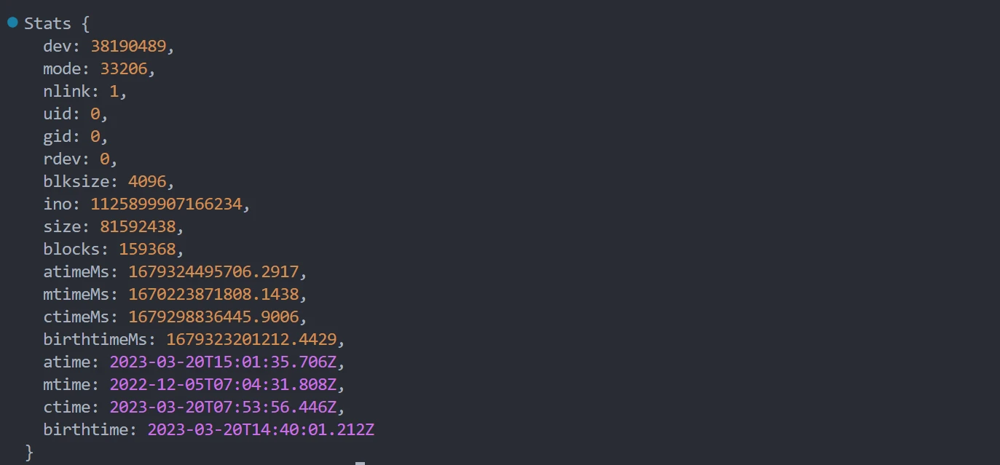

# Node

[Node.js](https://nodejs.dev/en/) 是一个基于 `Chrome V8引擎`​ 的 `JavaScript`​ 运行时环境，`Node.js`​ 可以运行 `JS`​文件

# 基本概念

## 网页加载

网页资源的加载都是循序渐进的，首先获取 `HTML ​`​的内容， 然后解析 `HTML ​`​在发送其他资源的请求，如 `CSS`​，`Javascript`​，图片等。

会解析 引入 文件的路径再去发起资源请求

​​

## 请求路径

**网页中的 URL 主要分为两大类：**​`相对路径`​ 与 `绝对路径`​

结合

* 绝对路径：可靠性强，而且相对容易理解，在项目中运用较多

  ```js

  http://atguigu.com/w eb](http://atguigu.com/web   直接向目标资源发送请求，容易理解。网站的外链会用到此形式     
  //atguigu.com/web                                 与页面 URL 的协议拼接形成完整 URL 再发送请求。大型网站用的比较多 
  /web                                              与页面 URL 的协议、主机名、端口拼接形成完整 URL 再发送请求。中小型网站 
  ```
* 相对路径：在发送请求时，需要与当前页面 URL 路径进行 `计算`​ ，得到完整 URL 后，再发送请求。

  ```js
  ./css/app.css       http://www.atguigu.com/course/css/app.css
  js/app.js           http://www.atguigu.com/course/js/app.js
  ../img/logo.png     http://www.atguigu.com/img/logo.png
  ../../mp4/show.mp4  http://www.atguigu.com/mp4/show.mp4
  ```

‍

## __dirname

​`__dirname`​ 保存着 **当前文件夹所在目录的绝对路径**，可以使用 `__dirname`​ 与文件名拼接成绝对路径

> **使用 fs 模块的时候，尽量使用 **`__dirname`​ 路径转换为绝对路径，这样可以避免相对路径产生的 Bug

```js
//=>__dirname + '/data.txt'  === 'D:\\Desktop\\Node\\code\\03-fs模块/data.txt'
let data = fs.readFileSync(__dirname + '/data.txt')
console.log(data) 
```

## Buffer

### 概念

​`Buffer ​`​是一个类似于数组的 `对象`​ ，用于表示固定长度的字节序列

`Buffer ​`​本质是一段内存空间，专门用来处理 `二进制数据`​

特点：

* ​`Buffer ​`​大小固定且无法调整
* ​`Buffer ​`​性能较好，可以直接对计算机内存进行操作
* 每个元素的大小为 1 字节（`byte`​）

### 基本使用

* 创建

  ```js
  // 创建了一个长度为 10 字节的 Buffer，相当于申请了 10 字节的内存空间，每个字节的值为 0
  let buf_1 = Buffer.alloc(10) //=>结果为<Buffer 00 00 00 00 00 00 00 00 00 00>

  // 创建了一个长度为 10 字节的 Buffer，buffer 中可能存在旧数据，可能会影响执行结果，所以叫 unsafe ，但是效率比 alloc 高
  let buf_2 = Buffer.allocUnsafe(10)

  // 通过字符串创建 Buffer
  let buf_3 = Buffer.from('hello')

  // 通过数组创建 Buffer
  let buf_4 = Buffer.from([105, 108, 111, 118, 101, 121, 111, 117])
  ```
* ​`Buffer`​和字符串转化：使用​`toString`​ 方法将 Buffer 转为字符串

  ```js
  et buf_4 = Buffer.from([105, 108, 111, 118, 101, 121, 111, 117])
  console.log(buf_4.toString()) //=>iloveyou
  ```
* ​`Buffer`​读写

  ```js
  let buf_3 = Buffer.from('hello')
  // 读取
  console.log(buf_3[1]) //=>101
  // 修改
  buf_3[1] = 97
  //查看字符串结果
  console.log(buf_3.toString()) //=>hallo
  ```

‍

# Node模块

## fs模块

### writeFile

语法：`fs.writeFile(file, data[, options], callback)`​，异步

```js
- file 文件名
- data 待写入的数据
- options 选项设置(可选)
- callback 写入回调
返回值： `undefined`

// require 是 Node.js 环境中的 '全局' 变量，用来导入模块
const fs = require('fs')

// 将 [三人行，必有我师焉。] 写入到当前文件夹下的 [座右铭.txt] 文件中
fs.writeFile('./座右铭.txt', '三人行，必有我师焉。', err =>{
    // 如果写入失败，则回调函数调用时，会传入错误对象，如写入成功，会传入 null
    if(err){
        console.log(err)
        return
    }
    console.log('写入成功')  
})
```

### writeFileSync

语法：`fs.writeFileSync(file, data[, options])`​，同步

```js
try{
    fs.writeFileSync('./座右铭.txt', '三人行，必有我师焉。')
}catch(e){
    console.log(e)
}
```

### appendFile 、 appendFileSync

* 概念：​`appendFile`​ 作用是在文件尾部追加内容，`appendFile`​ 语法与 `writeFile`​ 语法完全相同
* ​`fs.appendFile(file, data[, options], callback)`​、`fs.appendFileSync(file, data[, options])`​

  ```js
  fs.append('./座右铭.txt', '则其善者而从之，其不善者而改之。', err =>{
      if(err) throw err
      console.log('追加成功')
  })

  fs.appendFileSync('./座右铭.txt','\r\n温故而知新，可以为师矣')
  ```

### createWriteStream

语法：`fs.createWriteStream(path[, options])`​

**程序打开一个文件是需要消耗资源的**，流式写入可以减少打开关闭文件的次数。**流式写入方式适用于 ​**​****大文件写入或者频繁写入****​**的场景，**​`writeFile`​适合于 **写入频率较低的场景**

```js
let ws = fs.createWriteStream('./观书有感.txt')

//写入数据到流
ws.write('半亩方塘一鉴开\r\n')
ws.write('天光云影共徘徊\r\n')
ws.write('问渠那得清如许\r\n')
ws.write('为有源头活水来\r\n')

//关闭写入流，表明已没有数据要被写入可写流
ws.end()
```

### readFile

**语法**: `fs.readFile(path[, options], callback)`​ 异步

```js
// 导入 fs 模块
fs.readFile('./座右铭.txt', (error,data) =>{
    if(err) throw err
    console.log(data)
})

fs.readFile('./座右铭.txt', 'uft-8', (error,data) =>{
    if(err) throw err
    console.log(data)
})
```

### readFileSync

语法：`fs.readFileSync(path[, options])`​

```js
返回值 ：string | Buffer
let data = fs.readFileSync('./座右铭.txt')
let data = fs.readFileSync('./座右铭.txt', 'utf-8')
```

### createReadStream

​**`语法`**​：`fs.createReadStream(path[, options])`​

### rename、renameSync

​`fs.rename(oldPath, newPath, callback)`​

​`fs.renameSync(oldPath, newPath)`​

如果还是移动到当前路径，但是修改了名字，就是重命名了

```js
fs.rename('./观书有感.txt', './论语/观书有感.txt', err =>{
	if(err) throw err
    console.log('移动完成')
})

fs.renameSync('./座右铭.txt', './论语/.我的座右铭.txt')
```

### ​unlink​​、​unlinkSync​​

​`fs.unlink(path, callback)`​

​`fs.unlinkSync(path)`​

```js
const fs = require('fs')

fs.unlink('./test.txt', err =>{
    if(err) throw err
    console.log('删除成功')
})

fs.unlinkSync('./test2.txt')


// 调用 rm 方法  14.4   同步 rmSync
fs.rm('./论语.txt', err => {
  if (err) {
    console.log('删除失败')
    return

  }
  console.log('删除成功')
})
```

### mkdir、mkdirSync

​`fs.mkdir(path[, options], callback)`​

​`fs.mkdirSync(path[, options])`​

```js
// 异步创建文件夹  mk  make  制作   dir  directory  文件夹
fs.mkdir('./page', err =>{
    if(err) throw err
    console.log('创建成功')
})

// 递归异步创建
fs.mkdir('./1/2/3', {recursive: true}, err =>{
    if(err) throw err
    console.log('递归创建成功')
})

// 递归同步创建文件夹
fs.mkdirSync('./x/y/z', {recursive: true})
```

### readdir、readdirSync

​`fs.readdir(path[, options], callback)`​

​`fs.readdirSync(path[, options])`​

```js
// 异步读取
fs.readdir('./论语', (err, data) => {
	if(err) throw err
    console.log(data)
})
// 同步读取 
let data = fs.readdirSync('./论语')
console.log(data)
```

### ​rmdir​​、​​redirSync​​

​`fs.rmdir(path[, options], callback)`​

​`fs.redirSync(path[, options])`​

```js
// 异步删除文件夹  rm  remove 移除
fs.rmdir('./page', err => {
    if(err) throw err
    console.log('删除成功')
})
//异步递归删除文件夹  不推荐
//=>DeprecationWarning: In future versions of Node.js, fs.rmdir(path, { recursive: true }) will be removed. Use fs.rm(path, { recursive: true }) instead
fs.rmdirSync('./1', {recursive: true}, err => {
    if(err){ 
    	console.log(err)
        return
    }
    console.log('递归删除')
})
//同步递归删除文件夹
fs.rmdirSync('./x', {recursive: true})

// 建议使用
fs.rm('./a', { recursive: true }, err => {
  if (err) {
    console.log(err)
    return
  }
  console.log('删除成功')
})
```

### ​**stat、statSync**

使用`stat`​ 或 `statSync`​ 来查看资源的详细信息

​`fs.stat(path[, options], callback)`​

​`fs.statSync(path[, options])`​

```js
// 异步获取状态
// stat  方法  status 缩写 状态
fs.stat('/data.txt', (err, data) =>{
    if(err) throw err
    console.log(data)
})
// 同步获取状态
let data = fs.statSync('./data.txt')

- size 文件体积
- birthtime 创建时间
- mtime 最后修改时间
- isFile 检测是否为文件
- isDirectory 检测是否为文件夹
```

​​​​

## path模块

Node.js 提供的处理路径的模块 `path`​，提供了很多处理路径的方法和属性，也是一个内置模块

|**API**|**说明**|
| --| ----|
|**path.resolve**|**拼接规范的绝对路径**​`常用`​|
|**path.sep**|**获取操作系统的路径分隔符**|
|**path.parse**|**解析路径并返回对象**|
|**path.basename**|**获取路径的基础名称**|
|**path.dirname**|**获取路径的目录名**|
|**path.extname**|**获得路径的扩展名**|

```js
 // 导入 fs 模块
 const fs = require('fs')
 // 导入 path 模块
 const path = require('path')
 
 // 写入文件
 // fs.writeFileSync(__dirname + '/index.html', 'love')
 console.log(__dirname + '/index.html') //=>D:\Desktop\Node\code\04-path/index.html
 
 // resolve 解决问题  拼接绝对路径
 console.log(path.resolve(__dirname, './index.html')) //=>D:\Desktop\Node\code\04-path\index.html
 console.log(path.resolve(__dirname, 'index.html')) //=>D:\Desktop\Node\code\04-path\index.html
 console.log(path.resolve(__dirname, '/index.html', './test')) //=>D:\index.html\test
 
 // sep 获取路径分隔符
 console.log(path.sep) //=> window \  linux /
 
 // parse 方法  __filename  '全局变量'
 console.log(__filename) //=>文件的绝对路径 //=>D:\Desktop\Node\code\04-path\01-path.js
 // 解析路径
 let str = 'D:\\Desktop\\Node\\code\\04-path\\01-path.js'
 console.log(path.parse(str))
 
 // 获取路径基础名称
 console.log(path.basename(pathname))
 
 // 获取路径的目录名
 console.log(path.dirname(pathname))
 
 // 获取路径的拓展名
 console.log(path.extname(pathname))
```

## http模块

​`http`​也是内置模块, `Node.js`​ 官方提供的、用来创建web 服务器的模块。它提供了一系列的方法和属性,让开发者(咱们)可以用代码来创建服务器,接收**请求**及响应**内容**

### 基本概念

​`HTTP（hypertext transport protocol）`​协议；中文叫 超文本传输协议，

是一种基于TCP/IP的应用层通信协议，这个协议详细规定了 `浏览器`​ 和 万维网 `服务器`​ 之间互相通信的规则

### 请求报文

用来向服务器发送数据，可以被称之为**​ 请求报文**

* 请求行

  ```js
  - 请求方法（get、post、put、delete等）
  - 请求 URL（统一资源定位器）
    例如：http://www.baidu.com/index.html?a=100&b=200#logo

    - http:          协议 (https、ftp、ssh等)
    - www.baidu.com  域名
    - 80             端口号
    - /index.html     路径
    - a=100&b=200     查询字符串
    - #logo           哈希 (锚点链接)

  - HTTP协议版本号
  ```
* 请求头：格式：『头名：头值』

  ```js
  Host：主机名
  Connection：连接的设置 keep-alive（保持连接）；close（关闭连接）
  Cache-Control：缓存控制 max-age = 0 （没有缓存）
  Upgrade-Insecure-Requests：将网页中的http请求转化为 https 请求（很少用）老网站升级
  User-Agent：用户代理，客户端字符串标识，服务器可以通过这个标识来识别这个请求来自哪个客户端 ，一般在PC端和手机端的区分
  Accept：设置浏览器接收的数据类型
  Accept-Encoding：设置接收的压缩方式
  Accept-Language：设置接收的语言 q=0.7 为喜好系数，满分为1
  Cookie：后端设置用于保存信息
  ```
* 空行
* 请求体：格式比较随意，可以是空，可以是字符串，可以是`JSON`​

### 响应报文

向客户端返回数据，可以被称之为 **响应报文**

* 响应行:  `HTTP/1.1 200 OK`​

  ```js
  - HTTP/1.1：HTTP协议版本号
  - 200：响应状态码 404 Not Found 500 Internal Server Error
    还有一些状态码，参考：https://developer.mozilla.org/zh-CN/docs/Web/HTTP/Status
    OK：响应状态描述
  ```
* 响应头

  ```js
  Cache-Control: 缓存控制 private 私有的，只允许客户端缓存数据
  Connection: 链接设置
  Content-Type:text/html;charset=utf-8: 设置响应体的数据类型以及字符集,响应体为html，字符集utf-8
  Content-Length: 响应体的长度，单位为字节
  ```
* 空行
* 响应体

  ```js
  响应体内容的类型是非常灵活的，常见的类型有 HTML、CSS、JS、图片、JSON
  ```

### 创建web服务

* 基本流程

  ```js
  const http = require('http')
  const server = http.createServer()
  server.listen(3000, () => {
    console.log('已监听到请求')
  })

  server.on('request', (request, response) => {  // request ,response 形参。名字可以改,如非必要不建议改
    console.log('request.method:', request.method)
    console.log('request.url:', request.url)
    // 这里要处理客户端的请求
    console.log('hello html')
    // 设置响应头
    response.setHeader('info', 'good good study daydayup')
    // 设置状态码
    response.statusCode = 404
    // 响应内容给客户端
    response.end('nice to meet you')
  })

  ```
* ​`response`​:常见属性和方法

  ```js
  res.write(data);  给浏览器发送响应体，可以调用多次，从而提供连续的请求体
  res.end();   通知浏览器，所有响应头和响应主体都已被发送，即服务器将其视为已完成。
  res.end(data); 结束请求，并且响应一段内容，相当于res.write(data) + res.end()
  res.statusCode: 响应的的状态码 200 404 500
  res.statusMessage: 响应的状态信息， OK Not Found ,会根据statusCode自动设置。
  res.setHeader(name, value); 设置响应头信息， 比如content-type
  res.writeHead(statusCode, statusMessage, options); 设置响应头，同时可以设置状态码和状态信息。
  ```
* 中文乱码问题：当调用 `res.end()`​ 方法，向客户端发送中文内容时，会出现乱码问题，需要手动设置内容编码格式

  ```js
  //setHeader('Content-Type','text/plain; charset=utf-8');设置内容的格式,让浏览器知道如何解析
  // 普通文本
  res.setHeader('Content-Type', 'text/plain; charset=utf-8');
  // html
  res.setHeader('Content-Type', 'text/html; charset=utf-8');
  ```

### 获取请求报文数据

|**含义**|**语法**|
| ----------------| ------|
|请求方法|​`request.method`​|
|请求版本|​`request.httpVersion`​|
|请求路径|​`request.url`​|
|URL 路径​|​`require('url').parse(request.url).pathname`​|
|URL 查询字符串|​`require('url').parse(request.url,  true).query`​|
|请求头|​`request.headers`​|
|请求体|​`request.on('data', function(chunk){}) request.on('end', function(){})`​|

* 基本使用

  ```js
  // 1. 导入 http 模块
  const http = require('http')
  // 2. 创建服务对象
  const server = http.createServer((request, response) => {
    // 获取请求的方法
    console.log(request.method)  //=>GET
    // 获取请求的 url
    console.log(request.url)  // 只包含 url 中的 路径 与查询字符串
    // 获取 http 协议的版本号
    console.log(request.httpVersion)  //=> 1.1
    // 获取 http 的请求头
    console.log(request.headers) //=>结果是一个对象
    response.end('http') //=>设置响应体
  })

  // 3. 监听端口，启动服务
  server.listen(9000, () => {
    console.log('服务已经启动...')
  })
  ```
* 注意

  ```js
  1. request.url 只能获取路径以及查询字符串，无法获取 URL 中的域名以及协议的内容
  2. request.headers 将请求信息转化成一个对象，并将属性名都转化成了『小写』
  3. 关于路径：如果访问网站的时候，只填写了 IP 地址或者是域名信息，此时请求的路径为『 `/` 』
  4. 关于 favicon.ico：这个请求是属于浏览器自动发送的请求
  ```
* 提取请求体

  ```js
  // 1. 导入 http 模块
  const http = require('http')

  // 2. 创建服务对象
  const server = http.createServer((request, response) => {
    // 1. 声明一个变量
    let body = ''
    // 2. 绑定 data 事件
    request.on('data', chunk => {
      body += chunk
    })
    // 3. 绑定 end 事件
    request.on('end', () => {
      console.log(body)  //=>'username=111&password=111'
      // 响应
      response.end('Hello Http') //=>设置响应体 
    })
  })

  // 3. 监听端口，启动服务
  server.listen(9000, () => {
    console.log('服务已经启动...')
  })
  ```
* 提取 `url ​`​路径 和查询字符串

  ```js
  1.使用 url 模块
  const http = require('http')
  const url = require('url')
  const server = http.createServer((request, response) => {
    // 2. 解析 request.url
    console.log(request.url)   //=>/search?keyword=h5
    // 使用 parse 解析 request.url 的内容
    // true 将 query 属性将会设置为一个 对象
    let res = url.parse(request.url, true)
    console.log(res)  // 如下图所示，为一个对象
    // 路径
    let pathname = res.pathname
    // 查询字符串
    let keyword = res.query.keyword
    console.log(keyword)   //=>h5
    response.end('url')
  })


  2.使用 URL 类，推荐
  const http = require('http')
  const server = http.createServer((request, response) => {
    // 实例化 url 对象
    // let url = new URL('/search?a=100&b=200','http://127.0.0.1:9000')
    let url = new URL(request.url, 'http://127.0.0.1')
    console.log(url)  //=>如图所示，为一个对象
    // 输出路径
    console.log(url.pathname)  //=>/search
    // 输出 keyword 查询字符串
    console.log(url.searchParams.get('a'))  //=> 100
    response.end('url new')
  })
  ```
* url对象  
  ​​

### 设置响应报文

|**作用**|**语法**|
| ------------------| ---------------------|
|设置响应状态码|response.statusCode|
|设置响应状态描述|​`response.statusMessage （ 用的非常少 ）`​|
|设置响应头信息|​`response.setHeader('头名', '头值')`​(可以自定义)|
|设置响应体|​`response.write('xx') response.end('xxx')`​|

* 基本使用

  ```js
  // 1. 设置响应状态码
  response.statusCode = 203
  // 2. 响应状态的描述
  response.statusMessage = 'i love you'
  // 3. 响应头
  response.setHeader('content-type', 'text/html;charset=utf-8')
  // 自定义响应头
  response.setHeader('myHeader', 'test test')
  // 设置多个同名的响应头
  response.setHeader('test', ['a', 'b', 'c'])
  ```
* 设置响应体

  ```js
  // write 和 end 的两种使用情况：
  // 1. write 和 end 的结合使用 响应体相对分散
  response.write('xx');
  response.write('xx');
  response.write('xx');
  response.end(); //每一个请求，在处理的时候必须要执行 end 方法的

  //2. 单独使用 end 方法 响应体相对集中
  response.end('xxx');
  ```

### mime

​`媒体类型`​（通常称为 Multipurpose Internet Mail Extensions 或 MIME 类型 ）是一种标准，用来表示文档、文件或字节流的性质和格式。

HTTP 服务可以设置响应头 Content-Type 来表明响应体的 MIME 类型，浏览器会根据该类型决定如何处理资源

对于未知的资源类型，可以选择 `application/octet-stream`​ 类型，浏览器在遇到该类型的响应时，会对响应体内容进行独立存储，也就是我们常见的 `下载`​ 效果

```js
mime 类型结构： [type]/[subType]
例如： text/html text/css image/jpeg image/png application/json

常见文件对应的 mime 类型
html: 'text/html',
css: 'text/css',
js: 'text/javascript',
png: 'image/png',
jpg: 'image/jpeg', 
gif: 'image/gif',
mp4: 'video/mp4',
mp3: 'audio/mpeg',
json: 'application/json'
```

‍

# 模块化规范

### AMD

```js
- AMD规范采用异步方式加载模块，模块的加载不影响它后面语句的运行。
- 聊到AMD主要指的是通过require.js实现的模块化
- 项目中看到类似代码说明用的是AMD规范

// 执行基本操作
require(["jquery","underscore"],function($,_){
  // some code here
});
```

### CMD

```js
- CMD是另一种js模块化方案，它与AMD很类似。
- 不同点在于：AMD 推崇依赖前置、提前执行，CMD推崇依赖就近、延迟执行。
- 项目中看到类似代码说明用的是CMD规范

// 执行基本操作
define(function(require, exports, module) {
    var a = require('./a'); //在需要时申明
    a.doSomething();
    if (false) {
        var b = require('./b');
        b.doSomething();
    }
});
```

### CommonJS

```js
Node.js是CommonJS规范的主要实践
Node.js 是实现了 CommonJS 模块化规范，二者关系有点像 JavaScript 与 ECMAScript
module.exports 、exports 以及 require 这些都是 `CommonJS` 模块化规范中的内容。
```

### EMS

```js
- 也叫做ES6 Module
- ES6 在语言标准的层面上，实现了模块功能，逐步会成为浏览器和服务器通用的模块解决方案

```

### 关于export 和 module.exports

# [Webpack](https://www.webpackjs.com/)

## 基本设置

* 测试打包模板

  ```js
  git clone https://gitee.com/westblueflower/webpack-lesson.git//拉取基本模板，可以用来测试webpack
  ```
* ​`webpack.config.js`​：是`Webpack`​的配置文件，在项目根目录里。**vue中是vue.config.js**

  ```js
  const path = require('path')// 导入node.js的path模块
  const HtmlWebpackPlugin = require('html-webpack-plugin')//导入插件
  //webpack配置
  module.exports = {
    devtool: 'source-map',// 是否开启source map，生成独立的map文件，开发使用，上线删除
    mode: 'development',// 打包模式 development 开发 / production 生产
    entry: path.resolve(__dirname, 'src', 'index.js'),//设置打包入口文件，path模块用在这里
    // 开发服务器
    devServer: {//npm run serve 实时打包，打包文件在内存中，需要安装插件
      port: 9000, // 实时打包所用的端口号
      open: true, // 初次打包完成后，自动打开浏览器
      static: path.join(__dirname, './dist'),// 服务器的根目录
      hot: false,//是否开启热替换
    },
    // 打包到哪里
    output: {
      path: path.resolve(__dirname, 'dist'),// 使用绝对路径
      filename: 'bundle.js',// 打包出来的文件名
      clean: true,// 每次打包时清除上一次的dist目录
      assetModuleFilename: 'images/[hash][ext][query]',
    },
    // 模块配置，默认只能打包js，安装插件，可以打包css，less等其他格式文件
    module: {
      // 解析规则
      rules: [
        {
          test: /\.css$/i, // .css结尾的文件
          use: ['style-loader', 'css-loader'], // 通过 这2个 loader进行解析
        },
        {
          test: /\.less$/i, // .less结尾的文件
          use: [
            // 使用如下的loader进行解析
            'style-loader',
            'css-loader',
            'less-loader',
          ],
        },
        {
          test: /\.(png|svg|jpg|jpeg|gif)$/i, // 图片资源
          type: 'asset/resource', // 生成一个单独的文件，并设置url
        },
      ],
    },
    // 插件配置，wbepack默认只打包js，HtmlWebpackPlugin可以生成index.html文件并把js放进去
    plugins: [
      new HtmlWebpackPlugin({
        inject: 'body',// js插入的位置
        filename: 'index.html',// 打包之后的文件名
        template: path.resolve(__dirname, './public/index.html'),// 使用哪个文件作为模板
      }),
    ],
  }
  ```
* [package.json](https://juejin.cn/post/6870426598605062152)：可以设置打包所使用的插件和插件设置(`scripts`​中设置)，以及选择打包环境

  ```js
  {
    "name": "test-project", // 名称，通常是github仓库名称
    "author": "xxx", // 作者的信息
    "contributors": ["xxx", "xxxx"], // 贡献者信息数组
    "bugs": "https://github.com/nodejscn/node-api-cn/issues", // bug信息，通常是github的issue页面
    "homepage": "http://nodejs.cn", // 发布项目时，项目的主页
    "version": "1.0.0", // 当前版本, 遵循semver语义版本控制规范，具体含义将在后面详细解释
    "license": "MIT", // 许可证信息
    "keywords": ["xxx", "xxxx"], // 关键字数组
    "description": "A Vue.js project", // 描述信息
    "repository": "git://github.com/xxxx.git", // 仓库地址
    "main": "src/main.js", // 当引用这个包时，应用程序会在该位置搜索模块的导出
    "private": true,  // 防止包意外的发布到npm上，如果是true，npm将拒绝发布
    "scripts": {
      "dev": "webpack --config webpack.config.js",//配置开发模式打包
      "watch": "webpack watch --config webpack.config.js",//配置watch模式
      "build": "webpack  --config webpack.config.js --mode production",//配置生产模式打包
      "serve": "webpack serve --config webpack.config.js"//配置虚拟服务器

    }, // 可运行的node脚本，通常命令是npm run serve
    "dependencies": {
      "core-js": "^3.6.5",
      "vue": "^3.0.0-0",
      "vue-router": "^4.0.0-0",
      "vuex": "^4.0.0-0"
    }, // 生产环境所依赖的安装包
    "devDependencies": {
      "@vue/cli-plugin-babel": "~4.5.0",
      ...
    } // 开发环境所依赖的安装包
    "engines": {
      "node": ">= 6.0.0",
      "npm": ">= 3.0.0"
    }, // 要运行的 Node.js 或其他命令的版本，但似乎没卵用，可参考https://github.com/nodejs/node/issues/29249
    "browserslist": ["> 1%", "last 2 versions", "not ie <= 8"]  //支持的浏览器及其版本号，polyfill时会用到
  }

  ```
* 安装`webpack`​命令

  ```js
  //安装webpack---两个命令是一个意思：将安装包记录成开发阶段的依赖
  //  --save 保存到 package.json 中
  //  -dev 开发依赖，只在开发阶段使用
  //dependences: 项目依赖, 项目上线也要用的
  //devDependencies: 开发依赖, 只在开发中使用, 上线时不要用的
  npm i webpack --save-dev
  npm i webpack -D
  ```
* 打包命令

  ```js
  npm run dev//开发环境打包
  npm run build//生产环境打包
  ```

## 设置说明

### 模式设置

* 概念

  ```js
  开发环境development:不会对打包生成的文件进行代码压缩和性能优化，打包速度快
  生产环境production:默认设置，会对打包生成的文件进行代码压缩和性能优化，打包速度很慢
  ```
* 设置开发或生产模式：设置`/webpack.config.js`​，增加设置`mode`​

  ```js
  // 导入path模块
  const path = require('path')

  module.exports = {
    mode: 'development',// 打包模式 development 开发 / production 生产

    // 打包的入口文件
    entry: path.resolve(__dirname, 'src', 'index.js'),
    // 打包到哪里
    output: {
      // 使用绝对路径
      path: path.resolve(__dirname, 'dist'),
      // 打包出来的文件名
      filename: 'bundle.js',
    },
  }
  ```
* 设置打包命令：`package.json`​ 中增加打包命令

  ```js
  "scripts": {
    "dev": "webpack --config webpack.config.js",//配置开发模式打包
    "watch": "webpack watch --config webpack.config.js",//配置watch模式
    "build": "webpack  --config webpack.config.js --mode production",//配置生产模式打包
    "serve": "webpack serve --config webpack.config.js"//配置虚拟服务器

  },
  ```
* 打包命令：看你怎么设置得

  ```js
  npm run dev//开发环境打包
  npm run build//生产环境打包
  ```

### 清理设置

清理dist目录：`output.clean`​默认不开启，那么上一次打包生成的dist文件不会删除，这次打包的文件还是在上一次的dist中，导致可能原先的文件存在导致后面看代码文件造成混乱。

开启后会把文件出口文件删除后在继续打包，重新改出口名，原文件不在新出口，是不会删除的。

* ​`/webpack.config.js`​中设置**增加清理** `dist`​ 目录的配置

  ```js
  module.exports = {
    ...
    output: {
      // 使用绝对路径
      path: path.resolve(__dirname, 'dist'),
      // 打包出来的文件名
      filename: 'bundle.js',
      // 每次打包时清除dist目录
      clean: true,
    },
    ...
  }
  ```

### 热替换设置

​`HMR`​：修改了代码并保存时，`HMR`​ 会在应用程序运行过程中替换、添加或删除模块，而**无需重新加载整个页面（入口代码修改还是会刷新）**。

开启了 `dev-server`​ 之后，会**默认开启**​`HMR(hot module replacement)`​。

* ​`HMR`​ 主要通过以下几种方式，来显著加快开发速度：

  * **保留在完全重新加载页面时丢失的应用程序状态；**
  * **只更新变更内容，以节省宝贵的开发时间；**
  * **调整样式更加快速 - 几乎相当于在浏览器调试器中更改样式。**

在`webpack.config.js`​中进行设置

```js
module.exports = {
  // 开发服务器
  devServer: {
    port: 9000, // 实时打包所用的端口号
    open: true, // 初次打包完成后，自动打开浏览器
    // 服务器的根目录
    static: path.join(__dirname, './dist'),
    hot: true,// 模块热替换 true / false 开启 / 关闭
  },
}
```

### 映射设置

就是一个信息文件，里面储存着位置信息。存储着压缩混淆后的代码，所对应的**转换前**的位置。

设置开启，会在项目打包后会生成`.map`​文件，出错的时候，除错工具将直接显示原始代码，而不是转换后的代码，能够极大的方便后期的调试。

注意:开发阶段辅助调错，**上线一定要移除，避免源码泄露**。

在`webpack.config.js`​中进行设置

```js
//开发中需要排错，需要准确的定位错误行号
module.exports = {
  // source-map 仅限在开发模式中使用
  devtool: 'source-map',//（生产环境，我们不希望别人看到我们的源码，注释该配置即可）
}
```

### watch设置

开启 `watch`​ 模式启动自动化打包：检测打包入口，以及打包入口引用的文件是否发生变动，如果发生变动，就重新打包。

​`watch`​ 是内置的，不需要下载，文件发生变动后，文件自动打包，但是网页需要自己刷新。

调整 `package.json`​ 中的 `scripts`​ 开启`watch`​ 模式，然后启动命令：`npm run watch`​

```js
"scripts": {
  "dev": "webpack --config webpack.config.js",
  "watch": "webpack watch --config webpack.config.js",
}
```

## 相关插件

### html-webpack-plugin

​`Webpack`​默认只打包`js`​，这个插件可以打包时会自动生成`index.html`​页面到`dist`​文件夹中，自动把打包生成的`js`​文件插入到页面中。

* 下载插件

  ```js
  npm i--save-dev html-webpack-plugin //下载插件
  ```
* 设置设置模块页面

  ```js
  <!DOCTYPE html>
  <html lang="en">
    <head>
      <meta charset="UTF-8" />
      <meta http-equiv="X-UA-Compatible" content="IE=edge" />
      <meta name="viewport" content="width=device-width, initial-scale=1.0" />
      <title>测试用模板</title>
    </head>
    <body>
      <div class="box"></div>
    </body>
  </html>

  ```
* **调整** `/webpack.config.js`​，**增加插件实例化的配置**

  ```js
  module.exports = {
    ...
    plugins: [
      new HtmlWebpackPlugin({//实例化
        inject: 'body',// js插入的位置
        filename: 'index.html',// 打包之后的文件名
        template: path.resolve(__dirname, './public/index.html'),//设置页面样本地址
      }),
    ],
  }
  ```

### loader

​`loader`​ 是文件加载器，能够加载资源文件，并对这些文件进行特定的处理，然后打包在指定文件中，**简单来说就是将** `webpack`​ 传入的字符串做出特定的处理修改。

​`webpack`​ 默认只能解析 `js`​ 模块，如果是其他的文件需要安装对应的 `loader`​。

​​

1. 下载所需的loader,第三方模块

    ```js
    npm i --save-dev style-loader css-loader//css
    npm i less less-loader --save-dev//less
    ```
2. 调整 `webpack.config.js`​ 的配置

    ```js
    module.exports = {
      ...
      // 模块配置
      module: {
        // 解析规则
        rules: [
          {
            test: /\.css$/i, // .css结尾的文件
            use: ['style-loader', 'css-loader'], // 通过 这2个 loader进行解析
          },
          {
            test: /\.less$/i, // .less结尾的文件
            use: [
              // 使用如下的loader进行解析
              'style-loader',
              'css-loader',
              'less-loader',
            ],
          },
        ],
      },
    }
    ```
3. 在打包的`index.js`​中导入所要使用的`css`​、`less`​文件

    ```js
    // 导入css 
    // import './assets/base.css'
    // 导入less
    import './assets/less/index.less'
    ```
4. 运行打包

    ```bash
    npm run dev
    ```

### webpack-dev-server

​`webpack-dev-server`​ 的本质是开启了一个测试用服务器，`dev-server`​，开启一个服务器，并自动监测文件变更，刷新页面。

凡是修改了`webpack.config.js ​`​配置文件，或修改了`​ package.json ​`​配置文件，必须重启实时打包的服务器，否则最新的配置文件无法生效。

1. 下载`webpack-dev-server`​：

    ```bash
    npm i --save-dev webpack-dev-server
    ```
2. 修改 `/webpack.config.js`​，**增加** `devServer`​ 的配置

    ```js
    module.exports = {
      ...
      // 开发服务器
      devServer: {
        port: 9000, // 实时打包所用的端口号
        open: true, // 初次打包完成后，自动打开浏览器
        // 服务器的根目录
        static: path.join(__dirname, './dist'),//即文件打包后放的位置
      },
      ....
    }
    ```
3. 设置 `package.json`​，增加一条命令

    ```js
    "scripts": {
      "dev": "webpack --config webpack.config.js",//设置打包模式
      "watch": "webpack watch --config webpack.config.js",//开启watch模式
      "serve": "webpack serve --config webpack.config.js"//开启虚拟服务器
    },
    ```
4. 执行命令，运行项目

    ```bash
    npm run serve
    ```
5. 注意点

    1. 配置了 webpack-dev-server 之后，打包生成的文件存放到了内存中

        1. 不再根据 output 节点指定的路径，存放到实际的物理磁盘上
        2. 提高了实时打包输出的性能，因为内存比物理磁盘速度快很多
        3. **看不到** `dist`​ 目录
    2. ​`http://localhost:9000/`​

        1. 访问的是 `devServer`​ 配置中 `static`​ 的根目录
        2. ​`/index.html`​ 可以省略不写

# 包管理工具

​`node.js`​安装完成之后，自带有`npm`​了，可以使用`npm`​下载使用依赖包。

## npm

1. 初始化命令：初始化之后，会在项目目录中生成 `package.json`​​​ 的文件。

    ```js
    npm init -y
    npm init
    ```
2. 切换镜像地址：下载速度可以快一点

    ```js
    下面的命令只需要执行一次即可（不管以后重启vscode还是重启电脑，都不需要执行第二次）
    npm config set registry https://registry.npmmirror.com
    ```
3. 安装第三方包

    ```js
    npm install 模块名 //正常的下载安装
    npm i 模块名 //简写
    npm i 模块名@版本号 //可以通过@版本号,不设置默认是最新
    npm install xxx -g  //把模块安装在全局环境中
    ```
4. 卸载第三方

    ```js
    npm uninstall 模块名
    npm un 模块名
    npm un 模块名 模块名 模块名
    ```

## yarn

​`npm`​​是官方的管理工具，`yarn ​`​是由 `Facebook`​ 在 2016 年推出的新的 `Javascript`​ 包管理工具

和`npm`​​相比有**缓存机制**，可以直接取缓存没必要重新下载，速度比`npm`​​快一些。

​`npm`​ 的锁文件为 `package-lock.json`​

​`yarn ​`​的锁文件为 **`yarn.lock`​

基本命令

```js
1.安装yarn
npm i yarn -g    // 全局安装使用yarn

2.初始化
yarn init  //  yarn init -y

3.安装插件
npm:   npm i 插件名
yarn:  yarn add 插件名
       yarn global add 插件名//全局安装

4.安装所有依赖
npm:   npm i
yarn:  yarn

5.删除插件
npm:   npm uninstall  插件名
yarn:  yarn remove 插件名
       yarn global remove 插件名//全局卸载

6.运行项目
npm:   npm run serve
yarn:  yarn serve

7.设置淘宝镜像
npm:   npm config set registry http://registry.npm.taobao.org/
yarn:  yarn config set registry http://registry.npm.taobao.org/

8.npm换成yarn：删掉node_module,package-lock.json然后安装使用yarn
```

## nrm

​`NRM ​`的全称是`​ npm registry manager ​`​，是一个 `npm ​`​的镜像源管理工具  
  

* 基本使用

  ```js
  npm i -g nrm //全局安装
  nrm use taobao  //修改镜像
  npm config list  //检查是否配置成功（选做）
  ```
* 查看源

  ```js
  nrm ls

  npm -------- https://registry.npmjs.org/
  yarn ------- https://registry.yarnpkg.com/
  cnpm ------- http://r.cnpmjs.org/
  taobao ----- https://registry.npm.taobao.org/
  nj --------- https://registry.nodejitsu.com/
  npmMirror -- https://skimdb.npmjs.com/registry/
  edunpm ----- http://registry.enpmjs.org/
  qunhe ------ http://npm-registry.qunhequnhe.com/


  ```
* 切换镜像

  ```js
  nrm use 镜像别名
  // 切换至 taobao 的镜像源
  nrm use taobao
  // 切换至 cnpm 的镜像源
  nrm use cnpm
  ```
* 添加镜像

  ```js
  reigstry 为源名，url 为源的路径
  nrm add registry http://npm-registry.qunhequnhe.com/
  ```
* 删除镜像

  ```js
  // 其中 reigstry 为源名
  nrm del <registry>
  ```
* 测试镜像响应时间

  ```js
  nrm test npm
  ```

## [nvm](https://github.com/coreybutler/nvm-windows/releases )

​`nvm ​`​​全称 `Node Version Manager`​ 顾名思义它是用来管理 `node ​`​版本的工具，方便切换不同版本的`Node.js`​

```js
nvm list available  //显示所有可以下载的 Node.js 版本
nvm list //显示已安装的版本
nvm install 18.12.1  //安装 18.12.1 版本的 Node.js
nvm install latest  //安装最新版的 Node.js
nvm uninstall 18.12.1  //删除某个版本的 Node.js
nvm use 18.12.1  //切换 18.12.1 的 Node.js
```

## 其他

### 环境依赖

设置选项来区分**依赖的类型**

```js
1.生产依赖：S 等效于 --save，-S 是默认选项 **包信息保存在 package.json 中 dependencies属性
npm i -S uniq 
npm i --save uniq

2.开发依赖：-D 等效于 --save-dev** 包信息保存在 package.json 中devDependencies属性
npm i -D less 
npm i --save-dev less

3.npm i -g nodemon //全局安装，安装在c盘，后续可以使用全局命令
```

### 命名别名

配置 package.json 中的 `scripts`​ 属性：设置好后可以使用`​ npm run  xxx`​ 执行命令

​`npm start`​ ：比较特别，使用时可以省略 `run`​

​`npm run`​ 有自动向上级目录查找的特性，跟 `require`​ 函数也一样

```js
{
  "scripts": {
    "server": "node server.js",
    "start": "node index.js",
  },
}
```

### ​`.gitignore`​

设置无需提交的文件目录

```js
# dependencies
node_modules //node_modules文件夹不提交代码

# testing
/coverage
```

### 自己的包

* 创建发包

  ```js
  1. 创建文件夹，并创建文件 index.js， 在文件中声明函数，使用 module.exports 暴露
  2. npm 初始化工具包，package.json 填写包的信息 (包的名字是唯一的)
  3. 注册账号 https://www.npmjs.com/signup
  4. 激活账号 （ <span style="color:red">一定要激活账号</span> ）
  5. 修改为官方的官方镜像 (命令行中运行 `nrm use npm` )
  6. 命令行下 npm login 填写相关用户信息
  7. 命令行下 npm publish 提交包 👌
  ```
* 更新

  ```js
  1. 更新包中的代码
  2. 测试代码是否可用
  3. 修改 package.json 中的版本号
  4. 发布更新
  npm publish
  ```
* 删除包

  ```js
  npm unpublish --force
  删除包需要满足一定的条件， https://docs.npmjs.com/policies/unpublish
  - 你是包的作者
  - 发布小于 24 小时
  - 大于 24 小时后，没有其他包依赖，并且每周小于 300 下载量，并且只有一个维护者
  ```

# Git

### Git基本概念

[Git](https://git-scm.com/)是一款免费、开源的**分布式**版本控制系统 ，用于敏捷高效地处理任何或小或大的项目。

[传送门](https://juejin.cn/post/6844904191203213326#heading-0)

### Git基本操作

* 设置用户名：安装好后第一步

  ```js
  git config  user.name  //查看用户名
  git config  user.email  //查看邮箱

  git config  user.name 用户名  //设置用户名
  git config  user.email 邮箱名  //设置邮箱

  git config  --global user.name 用户名  //设置全局用户名
  git config  --global user.email 邮箱名  //设置全局邮箱

  git config --list  //查看配置信息

  git config --unset --global user.name //删除全局配置
  git config --unset --global user.email  //删除全局配置
  ```
* 初始化仓库：要管理得文件夹里面初始化

  ```js
  git init  //初始化仓库
  git init -y//就不用一直点yes了
  ```
* 查看是否保存

  ```js
  git status //用来查看文件的状态,红色表示工作区中的文件需要提交,绿色表示暂存区中的文件需要提交
  git status -s //简化日志输出格式
  ```
* 保存仓库：先add后commit

  ```js
  git add index.html  //将index.html添加到暂存区
  git add css  //将css目录下所有的文件添加到暂存区
  git add *.js  //将当前目录下所有的js文件添加到暂存区

  //添加当前目录下所有的文件
  git add .
  git add -A
  git add --all


  git commit -m"提交说明"  //将文件从暂存区提交到仓库
  git commit -am "本次提交说明"  //add和commit的合并，便捷写法
  git commit --amend -m"提交说明"  //修改最近的一次提交说明， 如果提交说明不小心输错了，可以使用这个命令
  ```
* 查看版本号

  ```js
  git log//查看提交的日志
  git log --oneline  //只能看到现在版本之前的信息（若之前回退过，那回退版本之后的是看不到的）
  git reflog --oneline  //可以看到所有保存的版本信息
  ```
* 版本回退

  ```js
  git reset --hard 版本号  //将代码回退到某个指定的版本(版本号只要有前几位即可)

  git reset --hard head~0  //将版本回退到当前提交
  git reset --hard head~1  //将版本回退到上一次提交
  git reset --hard head~2  //将版本回退到上上次提交
  ```
* 配置忽视文件：在仓库的根目录创建一个`.gitignore`​的文件，文件名是固定的(txt改后缀)。

  ```js
  # 忽视idea.txt文件
  idea.txt

  # 忽视css下的index.js文件
  css/index.js

  # 忽视css下的所有的js文件
  css/*.js

  # 忽视css文件夹
  css

  # 忽视node_modules文件夹
  node_modules/
  ```

### Git分支操作

* 查看分支：在`git`​中，有一个特殊指针`HEAD`​,永远会指向当前分支

  ```js
  git branch //查看本地分支
  git branch -r  //查看远程分支
  git branch -a  //查看所有分支，包括远程分支
  ```
* 创建分支

  ```js
  git branch 分支名称  //创建分支，分支中的代码，在创建时与当前分支的内容完全相同
  ```
* 切换分支：分支操作，最好是先`add commit`​

  ```js
  工作区、暂存区对所有分支而言，都是公共的，在切换分支时，工作区、暂存区的内容都会被带过去，所有要先保存
  git checkout 分支名称  //切换到目标分支
  git checkout -b 分支名  //创建并切换分支
  git checkout -b dev  //创建并切换分支
  ```
* 删除分支：不能在当前分支删除当前分支，需要切换到其他分支才能删除

  ```js
  git branch -d 分支名  //删除分支,如果该分支有提交未进行合并，则会删除失败
  git branch -D 分支名  //强制删除，就算没有进行合并操作也可以删除
  git branch -d dev  //创建并切换到dev分支
  ```
* 合并分支：要先切换到要合并得分支

  ```js
  git merge 分支名  //把其他分支内容合并到当前分支
  ```
* 取消合并

  ```js
  //发现分支冲突后没做其他修改可以取消合并，如果合并的时候，有未提交的更改，或者合并后又修改了一些，取消合并可能会出现错误
  git merge --abort  //取消合并
  ```

### Git远程操作

* 远程关联：注意：关联之后，如果本身有东西，是无法直接push的，要先pull然后合并冲突，再add、commit再push

  ```js
  git remote -v  //查看当前所有远程地址别名
  git remote add origin（别名） 仓库地址  //给远程仓库设置一个别名
  git remote remove origin  //删除origin这个别名

  //事例
  git remote add origin https://gitee.com/wwshuishui/test.git  //添加远程仓库
  git push -u origin "master"  //将本地仓库和远程仓库建立联系，并推送master分支
  ```
* 远程克隆

  ```js
  git clone 项目地址  //只有一个master分支，其他分支都隐藏了
  git cloen -b 分支名 远程仓库地址  //克隆指定分支
  git branch -a  //可以看到红色的隐藏分支
  git checkout -t origin/分支名  //获取远程分支

  //事例
  git clone git@gitee.com:jepsonpp/test.git
  git clone -b dev git@gitee.com:jepsonpp/test.git
  ```
* 远程推送：把本地得推送到远程仓库

  ```js
  git push  //当前分支只有一个远程分支,本地分支名和远程分支名一样
  git push 远程主机名 本地分支名:远程分支名  //完整版
  git push origin master:master  //如果本地分支名与远程分支名相同，则可以省略冒号
  git push --force origin master  //本地版本和远程有差异，强制推送覆盖远程
  ```
* 远程拉取：把远程得代码拉到本地

  ```js
  git pull  //当前分支只有一个远程分支,本地分支名和远程分支名一样
  git pull 远程主机名 分支名
  git pull origin login  //获取远程分支的更新，并更新合并到login分支


  git fetch  //需要自己合并，full是帮你合并了
  git fetch orgin master  //将远程仓库的master分支下载到本地当前branch中
  ```
* 远程删除

  ```js
  git branch -a  //可以看的远程分支

  git push origin --delete 分支名  //删除远程分支
  git push origin --d 分支名
  ```
