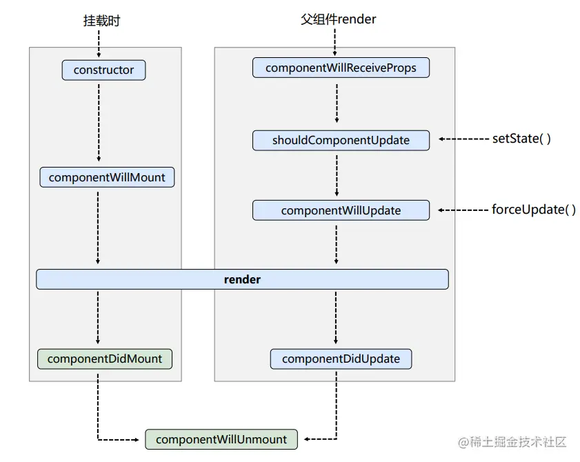
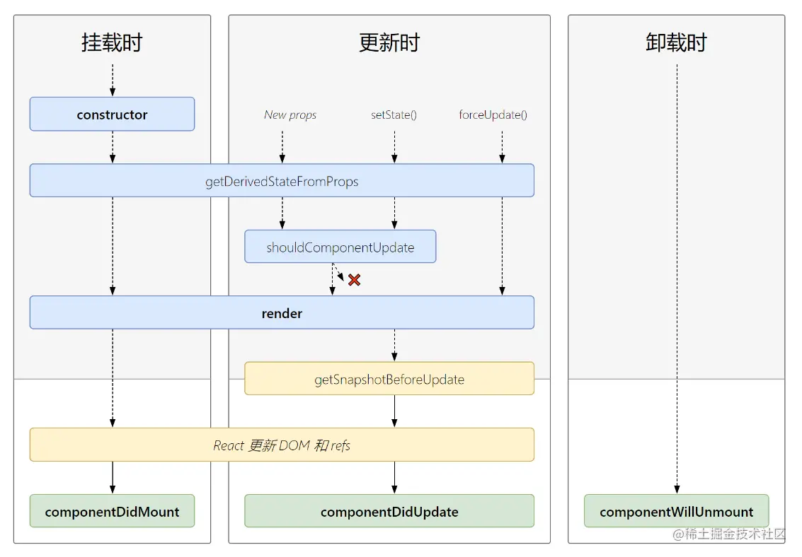
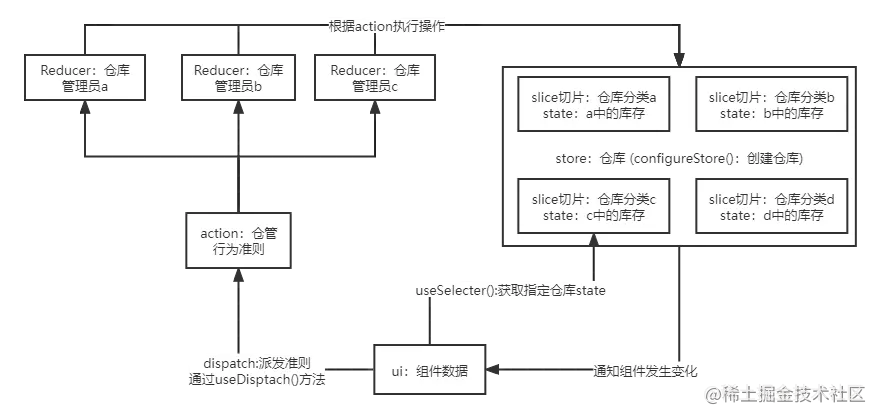

# React

# React相关概念

### 关于JSX

　　**JSX** 是 JavaScript 语法扩展，可以让你在 JavaScript 文件中书

　　[JSX and React 是相互独立的](https://reactjs.org/blog/2020/09/22/introducing-the-new-jsx-transform.html#whats-a-jsx-transform) 东西。但它们经常一起使用，但你 **可以** 单独使用它们中的任意一个，JSX 是一种语法扩展，而 React 则是一个 JavaScript 的库。写类似 HTML 的标签。

### JSX规则

1. 只能返回一个根元素  
    如果想要在一个组件中包含多个元素，**需要用一个父标签把它们包裹起来**。如`<div></div>`​ 或者说`​ <></>`​  
    JSX的底层是把内容都转化成对象，一个函数中只能返回一个对象，除非是返回的一个数组内容。
2. 标签必须闭合  
    即原来html中的可以不闭合标签在jsx中必须闭合，不然会出现报错信息
3. 使用驼峰命名 ~~所有~~ 大部分属性命名  
    jsx底层是转化成对象，所以要遵守js对 对象 命名时候的规则，如不能出现 中划线 - ， 不能使用 class 这种内置关键字等，所以使用 `class`​ 可以写成 `className`​ 这种方式
4. 使用花括号`{}`​在jsx中写 js 逻辑部分，如果需要在里面使用对象的话，那么就使用双花括号`{{}}`​，外面一次表示js区域，里面一成表示值为对象

### 纯函数和副作用

1. 纯函数：简单理解就是输入什么，就永远输出什么不会发生改变

    * **只负责自己的任务**。它不会更改在该函数调用前就已存在的对象或变量
    * **输入相同，则输出相同**。给定相同的输入，纯函数应总是返回相同的结果。
2. 副作用：会出现不符合预期的结果，会影响到不属于自己变量之外的值的改变，

    * 如：更新屏幕、启动动画、更改数据等，它们是 **“额外”** 发生的事情，与渲染过程无关。
    * 在 React 中，**副作用通常属于 ​**​****。
    * 事件处理程序是 React 在你执行某些操作（如单击按钮）时运行的函数
    * 即使事件处理程序是在你的组件 **内部** 定义的，它们也不会在渲染期间运行，**因此事件处理程序无需是纯函数**。
3. react使用纯函数编写的原因

    * 可以在不同的环境下运行，总是返回相同的结果
    * 可以为那些输入未更改的组件来 [跳过渲染](https://zh-hans.react.dev/reference/react/memo)，以提高性能。这是安全的做法，因为纯函数总是返回相同的结果，所以可以安全地缓存它们。
    * 如果在渲染深层组件树的过程中，某些数据发生了变化，React 可以重新开始渲染，而不会浪费时间完成过时的渲染。纯粹性使得它随时可以安全地停止计算。

### hook

　　在react中，所有以 `use`​ 开头的函数都被叫做 hook

　　hook是特殊函数，只在react渲染时有效，只能在组件或自定义hook的最顶层调用

### 数据快照

　　react中，初始化的state数据其实是一直保留的，更改数据不能直接更改state的值，需要在setState函数中传入需要改变的值，之后会保存一个数据快照，然后通知react进行渲染。

　　也就是说，要把需要的值作为参数传入到setState函数中，原来的state是不会改变的

　　**一个 state 变量的值永远不会在一次渲染的内部发生变化**

### 视图更新

　　**React 会等到事件处理函数中的** 所有 **代码都运行完毕再处理你的 state 更新。**

　　重新渲染只会发生在所有 `setState()`​ 调用 **之后** 的原因。

### [更新state](https://zh-hans.react.dev/learn/queueing-a-series-of-state-updates)

　　使用`setState`​函数的时候，传入值是形成一个数据快照，原来的state其实是没有改变的

　　如果传入的是一个函数，如：`setState((n)=>n+1)`​ ，该回调函数称为 `更新函数`​  。`n`​是上一个state返回的值

1. React 会将此函数加入队列，以便在事件处理函数中的所有其他代码运行后进行处理。
2. 在下一次渲染期间，React 会遍历队列并给你更新之后的最终 state。

```js
一个更新函数（例如：n => n + 1）会被添加到队列中。
任何其他的值（例如：数字 5）会导致“替换为 5”被添加到队列中，已经在队列中的内容会被忽略。
```

### react样式

　　关于`react`​中写样式的问题，目前来说没有比较统一的方案，react比较推荐的是直接在组件中写行内样式。因为一个组件就是一个整体，直接在组件内部写行内样式即可。

　　也可以单独的拿一个文件夹来存放 `css ​`​样式文件，在组件需要的地方， 使用 `import ​`​导入使用即可

### 函数组件和类组件

* 类组件：ES6的加入让`JavaScript`​直接支持使用`class`​来定义一个类，`react`​创建组件的方式就是使用的类的继承， `ES6 class ​`​是目前官方推荐的使用方式，它使用了ES6标准语法来构建

  ```js
  import React from 'react'
  import ReactDOM from 'react-dom'

  class App extends React.Component {
  render () {
    return (<h1>欢迎进入React的世界</h1>)
    }
  }
  ReactDOM.render(
  <App/>,
  document.getElementById('root')
  )
  ```
* 函数式组件

  ```js
  import React from 'react'
  import ReactDOM from 'react-dom'

  const App = (props) => <h1>欢迎进入React的世界</h1>
  ReactDOM.render(
    // React组件的调用方式
    <App/>,
    document.getElementById('root')
  )
  ```

### 事件处理

* 事件绑定

  ```js
  react中的事件绑定，使用 on + 事件名方式来绑定事件
  react的事件绑定和原生的事件绑定是不一样的
  原生事件都是小写  onclick 
  react 是驼峰写法 onClick
  react的事件不是原生事件，并不是绑定在dom上的，而是合成事件，有自己的事件处理机制，事件好像是在根节点统一处理，通过事件冒泡来的
  ```
* ​`event`​对象

  ```js
  event对象
  和普通浏览器一样，事件handler会被自动传入一个 event 对象
  这个对象和普通的浏览器 event 对象所包含的方法和属性都基本一致。
  不同的是 React中的 event 对象并不是浏览器提供的，而是它自己内部所构建的。
  它同样具有 event.stopPropagation、event.preventDefault 这种常用的方法
  ```

### ref

```js
推荐的获取ref的方法
1.定义需要的ref
const myRef = React.createRef()
2.挂载ref
<div ref={this.myRef}>hello</div>
3.获取ref
this.myRef.current

老方法
1.挂载ref
<div ref=myRef>hello</div>
2.获取ref
this.refs.myRef.current

ref使用箭头函数返回组件实例
设置变量接受
let myRef = null
再组件中获取
<div ref={ el => this.myRef = el }>hello</div>

```

### state

* 类组件中直接定义

  ```js
  class App extends Component {
    state = {
      ...
    }
  }
  ```
* 使用类的 `constructor ​`​函数

  ```js
  class App extends Component {
    constructor(){
      super()//执行父组件中的constructor
      this.state = {
        ...
      }
    }
  }
  ```
* setState：用于改变组件状态的方法

  ```js
  第一个参数可以是对象，也可以是方法return一个对象，我们把这个参数叫做 updater
  handleChange(){
    this.setState({
      ...state中需要被替换的内容
    })
  }
  handleChange(){
    this.setState((prevState,props)=>{
      return {
        ...
      }
    })
  }

  该函数有第二个参数，参数的形式是回调函数，会在state改变之后，dom更新完成之后调用
  handleChange(){
    this.setState({
      ...state中需要被替换的内容
    },()=>{})
  }

  ps:
  setState 方法是 异步调用 的，react为了避免频繁的修改状态，会统一的把state变化排列到队伍中
  1.上面这个 异步 是react的优化手段， this.setState 在同步中，是异步的
  2.在异步中，this.setState 是同步的
  setTime(()=>{
    this.setState({})
    this.setState({})
  })
  ```

### react中的v-html

```js
react中使用 dangerouslySetInnerHTML 来实现v-html的功能

<div dangerouslySetInnerHTML={ { __html:this.state.htmlContent } }></div>
```

### react中的css

　　​`react`​中的`css`​样式会使用行内写法，因为`react`​引入使用的`css`​文件是全局的样式，这会导致在组件导入的`css`​文件样式影响到别的组件，而导致的样式错乱。

```js
//react中的导入css文件，这样导入虽然生效，可实际是全局的样式
import "../css/home.css"
```

　　vue中，一个 `.vue`​文件，里面就有区分出来，`template`​、`style`​、`js`​ 部分，`vue`​中的`style`​是有通过`​ v-data-hash ​`​属性来区分组件，避免导致组件间的样式来相互影响。

　　​`react`​要达到这样的效果，要使用`​ css module ​`​的模块化语法。

* 内联样式：不太推荐

  ```js
  1.行内样式写多了，导致整个组件结构看起来怪怪的，要是样式太多，那逻辑、样式就全在一起了
  2.不支持 伪类 的选择器
  ```
* ​`css module`​：组件间的样式不会相互影响，类名发生变化，后面添加了 hash 值。使用 classname.module.css 导入到组件中，是个变量。

  ```js
  文件名.module.css //开启模块化
  /* home: index.module.css */
  :gole
  .content {
    color: orange;
    ...内容
  }

  组件中：
  import styles from "./index.module.css"; //导入后是个对象，在组件中使用 calssName = { style.content }
  const Home = () => {
    return <div className={styles.content}>我是 home 页面的 content</div>;
  };

  export default Home;
  ```
* ​`css in js`​：这个需要使用库，各种啥的`​ css in js ​`​和`​ all in js`​

　　‍

　　‍

# React基础

## 组件通信

### 状态提升

　　尽可能使用受控组件，组件不使用内部的 `状态`​， 使用 父组件传递过来的 `属性`​ 来控制组件的显示。

　　对于多个子组件之间的通讯，使用`​ 状态提升 ​`​，子组件内的数据展示都使用父组件的状态，并把改变父组件内状态的函数传递给子组件使用，从而达到子组件通讯，共享属性的效果

### 订阅发布

　　类似于vue中的eventBus。

　　核心思想是，创建个对象，里面一个数组，用于收集 组件订阅触发事件的函数， 一个`subscribe`​函数用于接受订阅函数，一个 `publish`​函数用于触发事件，把事件对于的函数执行。

　　达到一个集中手机事件，并提供触发的一个平台对象。

* 事件平台中心创建

  ```js
  //调度中心
  var bus = {
      list:[],
      //订阅
      subscribe(callback){
          this.list.push(callback)//组件订阅的触发函数进行收集
      },
      //发布，遍历所有的list， 将回调函数执行
      publish(text){//text，用于接收 publish 的描述字段
          this.list.forEach(callback=>{
              callback && callback(text)
          })
      }
  }
  ```
* 订阅者

  ```js
  订阅者把触发函数给push到list中，可以携带参数
  bus.subscribe((value)=>{
      console.log("2222",value)
  })
  ```
* 发布者

  ```js
  bus.publish('des')//传入事件的描述字段，用于触发事件
  ```

　　‍

### context

* 概念：`context`​ 上下文对象，react可以使用 `context`​对子组件提供依赖。这个方法和vue中的provide、inject蛮像的
* 基本使用，需要`​ React.createContext() ​`​

  ```js
  import React, { Component } from 'react'
  const GlobalContext  = React.createContext() //创建context对象

  //父组件提供依赖
  export default class App extends Component {
      constructor() {
          super()
          this.state = {
              filmList: [],
              info: ""
          }
      }
      render() {
          return (//  需要使用 xxx.Provider 来提供依赖，需要在组件的最外层进行包裹。 value 来提供需要传递的参数
              <GlobalContext.Provider value={{
                  info: this.state.info,
                  changeInfo: (value) => {
                      this.setState({
                          info: value
                      })
                  }
              }}>
                  <div>
                     <FilmItem ></FilmItem>
                  </div>
              </GlobalContext.Provider>
          )
      }
  }
  //使用  xx.Consumer 包裹组件，来对父组件提供的数据进行消费。
  //同时要使用回调函数 （val）=> { return 组件 } 形式，通过value形参来拿到value
  class FilmItem extends Component {
      render() {
          let { name, poster, grade, synopsis } = this.props
          return (
              <GlobalContext.Consumer>
                  {
                      (value) => {
                          console.log(value)
                          return <div className="filmitem" onClick={() => {
                              value.changeInfo(synopsis)
                          }}>
                              <div>观众评分：{grade}</div>
                          </div>
                      }
                  }
              </GlobalContext.Consumer>
          )
      }
  }
  ```

　　‍

　　‍

　　‍

## 生命周期

　　​​​​

### [概述](https://juejin.cn/post/7248890696819277885?searchId=202309072235420B1497972C1DF3676587)

* react中自带的生命周期函数好像都是类组件中的，函数时组件需要使用生命周期的功能，需要使用hooks来实现。
* 生命周期一览

  ```js
  1.挂载
  constructor
  getDerivedStateFromProps
  render
  componentDidMount

  2.更新：setState、useState、props变化、forceUpdate 会触发组件的更新
  static  getDerivedStateFromProps （新） //类变量
  shouldComponentUpdate
  render
  getSnapshotBeforeUpdate （新）
  componentDidUpdate

  3.卸载
  componentWillUnmount
  ```
* 将被废弃的钩子：从 v16.3 开始废弃了 componentWillMount、componentWillReceiveProps、componentWillUpdate 三个钩子，并为这几个钩子提供了别名。以别名的方式就是来恶心你的，让你不要使用🤣。

  ```js
  UNSAFE_componentWillMount：当组件被渲染出来之前
  UNSAFE_componentWillReceiveProps：当组件收到新的props之前
  UNSAFE_componentWillUpdate：组件更新前
  ```
* 废弃原因

  ```js
  在v16之前的版本中，react的更新过程是同步的，react 在加载或者更新组件的过程是同步的，期间不允许其他的操作，往往一个主线程长时间被占用，会导致页面性能问题。
  而 React Fiber 的机制: 把更新过程碎片化，利用浏览器 requestIdleCallback 将可中断的任务进行分片处理，维护每一个分片的数据结构，就是Fiber，每一个小片的运行时间很短，这样唯一的线程就不会被独占。
  ```
* Fiber

  ```js
  1.概念
  在计算机中，除了 进程（Process）和线程（Thread）的概念外还有一个名为 Fiber (纤维)的概念，意指比Thread更细的线，也就是比线程控制得更精密的并发处理机制。
  Fiber 是一个执行单元也是一种数据结构，支撑 Fiber 构建任务的运转。
  在渲染过程中，react 将渲染任务拆分成了一个个的小任务进行处理，每一个小任务指的就是 Fiber 节点的构建。
  拆分的小任务会在浏览器的空闲时间被执行，每个任务单元执行完成后，React 都会检查是否还有空余时间，如果有就交换主线程的控制权。
  Fiber 的总体思路就是利用循环和链表代替递归去优化性能，Fiber 架构有两个阶段，

  render 阶段负责构架 Fiber 对象和链表，找出需要更新的 DOM
  commit 阶段负责去构建 DOM

  2.Fiber 对生命周期的影响
  在React Fiber中，一次更新过程会分成多个分片完成，所以完全有可能一个更新任务还没有完成，就被另一个更高优先级的更新过程打断，这时，优先级高的更新任务会优先处理完，而低优先级更新任务所做的工作则会完全作废，然后等待机会重头再来。
  React Fiber一个更新过程被分为两个阶段(Phase)：第一个阶段Reconciliation Phase和第二阶段Commit Phase。

  第一阶段：构建 Fiber 对象，构建链表，在链表中标记要执行的 DOM 操作 ，这个阶段是可以被打断的
  render： render 是纯函数能够被多次调用
  componentWillMount
  componentWillReceiveProps： 即使当前组件不更新，只要父组件更新也会引发这个函数被调用，允许被多次调用
  shouldComponentUpdate：这函数的作用就是返回一个true或者false，不会产生任何副作用，多调几次也没关系
  componentWillUpdate

  第二阶段：根据构建好的链表DOM 的，更新DOM的过程中不会被打断
  componentDidMount
  componentDidUpdate
  componentWillUnmount

  在React Fiber中，第一阶段中的生命周期函数在一次加载和更新过程中可能会被多次调用！ 
  React Fiber Reconciliation 这个过程有可能暂停然后继续执行，所以挂载和更新之前的生命周期钩子就有可能不执行或者多次执行。
  ```

### 挂载阶段

* constructor：只会在组件初始化的时候触发一次

  ```js
  1.设置初始化状态函数内部 state：因为组件的生命周期中任何函数都可能要访问 State，在生命周期中第一个被调用的构造函数便是初始化 state 最理想的地方。
  2.绑定成员函数上下文引用
  因为在 ES6 语法下，类的每个成员函数在执行时的 this 并不是和类实例自动绑定的；而在构造函数中 this 就是当前组件实例，所以在构造函数中将 this 为当前类实例；
  建议定义函数方法时直接使用箭头函数，就无须在构造函数中进行函数的 bind 操作。
  class Sample extends React.Component {
    constructor(props, context, updater) {
    //props：继承 React.Component 的属性方法，它是不可变的 read-only
    //context：全局上下文。
    //updater：包含一些更新方法的对象
    //this.setState 最终调用的是 this.updater.enqueueSetState
    //this.forceUpdate 最终调用的是 this.updater.enqueueForceUpdate 方法，所以这些 API 更多是 React 调用使用，暴露出来以备开发者不时之需。
      super(props);
      this.state = {
        foo: 'InitailValue',
      };
    }
  }

  Sample.defaultProps = {
    bar: 'InitialValue',
  };
  ```
* static getDerivedStateFromProps：该函数会在组件化实例化后和重新渲染前调用（生成 VirtualDOM 之后，实际 DOM 挂载之前）

  ```js
  1.无论是父组件的更新、props 的变化或通过 setState 更新组件内部的 State，它都会被调用。
  2.返回值：该生命周期函数必须有返回值，返回一个对象来更新 State，若返回 null 表明新 props 不更新 state。
  3.新特性：当组件实例化时，该方法替代了 componentWillMount，而当接收新的 props 时，该方法替代了 componentWillReceiveProps 和 componentWillUpdate。
  适用场景：表单获取默认值
  4.注意：getDerivedStateFromProps 是一个静态函数，不能使用this, 也就是只能作一些无副作用的操作，如果父组件导致了组件的重新渲染，即使属性没有更新，这一方法也会被触发；
  该生命周期函数被设计成静态方法的目的是为了保持该方法的纯粹。能够起到限制开发者无法访问 this 也就是实例的作用，这样就不能在里面调用实例方法或者 setState 以破坏该生命周期函数的功能。
  通过更具父组件输入的 props 按需更新 state，这种 state 叫做衍生 state，返回的对象就是要增量更新的 state，除此之外不应该在里面执行任何操作。

  static getDerivedStateFromProps(nextProps, prevState) {
    if (nextProps.translateX !== prevState.translateX) {
      return {
        translateX: nextProps.translateX
      }
    }
    if (nextProps.data !== prevState.data){
      return {
        data: nextProps.data
      }
    }
    return null;
  }
  ```
* UNSAFE_componentWillMount：预装载函数 componentWillMount 将在 React v17 正式废弃，用 UNSAFE_componentWillMount 别名代替。

  ```js
  1.触发时机：在构造函数和装载组件（将 DOM 树渲染到浏览器中）之间触发。装载组件后将执行 render 渲染函数。因此在此生命周期函数里使用 setState 同步设置组件内部状态 state 将不会触发重新渲染。
  2.注意：避免在该方法中引入任何的副作用（Effects）或订阅（Subscription）。对于这些使用场景，建议提前到构造函数中
  ```
* render：第一次以及之后组件发生更新，都会执行render，一个仅仅用于渲染的**纯函数**，返回值完全取决于 state 和 props，而生成虚拟 DOM 树进行对比是在 render 函数执行了之后进行

  ```js
  1.class组件中唯一必须实现的方法，用于渲染 DOM, render()方法必须有返回值，返回 null 或 false 表示不渲染任何 DOM 元素。
  2.一个仅仅用于渲染的**纯函数**。此渲染函数并不做实际的渲染动作（渲染到 DOM 树），它返回一个 JSX 的描述对象（及组件实例），何时进行真正的渲染是有 React 库决定。
  3.在组件 初始化 和 props或者state发生变化时候触发
  ```
* componentDidMount：在组件挂载完成之后 (插入DOM树后) 立即调用

  ```js
  1.触发时机：组件完全挂载到网页上后触发 
  使用场景：
  发送网络请求；
  任何依赖于 DOM 的初始化操作；
  添加事件监听；如果使用了 Redux 之类的数据管理工具，也能触发 action 处理数据变化逻辑。
  此钩子函数中允许使用 setState 改变组件内 State。
  注意：该生命周期函数在进行服务器端渲染时不会触发（仅客户端有效）。
  ```

### 更新阶段

　　属性（Props）或状态（State）的改变会触发一次组件的更新，但是组件是否会重新渲染，这取决于 shouldComponentUpdate

* shouldComponentUpdate：在组件更新之前调用，可以控制组件是否进行更新， 返回true时组件更新， 返回false则不更新 shouldComponentUpdate(nextProps, nextState)

  ```js
  1.当props或state发生变化，在重新渲染执行之前，第一个是即将更新的 props 值，第二个是即将跟新后的 state 值，可以根据更新前后的 props 或 state 来比较加一些限制条件，决定是否更新，进行性能优化
  2.当该方法返回的布尔值 false 告知 React 无须重新渲染时，render、UNSAFE_componentWillUpdate 和 componentDidUpdate 等生命周期钩子函数都不会被触发。
  3.此钩子函数在初始化渲染和使用了 forceUpdate 方法的情况下不会被触发，使用 forceUpdate 会强制更新
  4.请勿在此函数中使用 setState 方法，会导致循环调用。
  ```
* getSnapshotBeforeUpdate：保存状态快照。该生命周期函数会在组件即将挂载时触发，它的触发在 render 渲染函数之后。

  ```js
  由此可见，render 函数并没有完成挂载操作，而是进行构建抽象 UI（也就是 Virtual DOM）的工作。该生命周期函数执行完毕后就会立即触发 componentDidUpdate 生命周期钩子。
  该生命周期函数能让你捕获某些从 DOM 中才能获取的（可能会变更的例如滚动位置），此生命周期返回的任何值都会作为第三个参数传递给 componentDidUpdate()。如不需要传递任何值，那么请返回 null。
  getSnapshotBeforeUpdate(prevProps, prevState) {
      console.log('#enter getSnapshotBeforeUpdate');
      return 'foo';
  }
  componentDidUpdate(prevProps, prevState, snapshot) {
      console.log('#enter componentDidUpdate snapshot = ', snapshot);
  }

  ```
* componentDidUpdate：组件每次重新渲染后会触发 componentDidUpdate ； 但是只有在组件首次渲染（即初始化）时触发的是 componentDidMount 钩子函数，初始化渲染后componentDidMount 不会再被触发。

  ```js
  1.在 componentDidUpdate 生命周期函数中调用 setState 方法时，确实需要加上条件判断，以避免死循环的发生。
  2.通过判断 prevProps、prevState 和 this.state 之间的数据变化，来判断是否执行相关的 state 变更逻辑，这使得尽管在 componentDidUpdate 中调用了 setState 进行再更新，如果条件不成立state就不会进行更新，从而避免了死循环的发生。
  相比装载阶段的生命周期函数，更新阶段的生命周期函数使用的相对来说要少一些。
  常用的是getDerivedStateFromProps、shouldComponentUpdate， 前者经常用于根据新 props 的数据去设置组件的 State，而后者则是常用于优化，避免不必要的渲染。
  componentDidUpdate(prevProps){
      if (this.props.id !== prevProps.id){
          this.fetchData(this.props.id);
      }
  }

  ```

### 卸载阶段

* componentWillUnmount：在组件卸载和销毁之前触发。可以利用这个生命周期方法进行事件的解绑。

  ```js
  用于移除事件监听器；取消网络请求；取消定时器；解绑 DOM 事件。 在该方法中调用 setState 不会触发 render，因为所有的更新队列，更新状态都被重置为 null。
  ```

### 组件间的周期顺序

　　当子组件自身状态改变时，不会对父组件产生副作用的情况下，父组件不会进行更新，即不会触发父组件的生命周期

　　当父组件中状态发生变化（包括子组件的挂载以及卸载）时，会触发自身对应的生命周期以及子组件的更新

* 父子组件初始化

  ```js
  Parent 组件： constructor()
  Parent 组件： getDerivedStateFromProps()
  Parent 组件： render()
  Child 组件： constructor()
  Child 组件： getDerivedStateFromProps()
  Child 组件： render()
  Child 组件： componentDidMount()
  Parent 组件： componentDidMount()

  当执行render子组件的时候，才会进入子组件的生命周期，子组件的周期结束后，再回到上级的周期。
  ```
* 改变子组件自身状态

  ```js
  Child 组件： getDerivedStateFromProps()
  Child 组件： shouldComponentUpdate()
  Child 组件： render()
  Child 组件： getSnapshotBeforeUpdate()
  Child 组件： componentDidUpdate()

  ```
* 修改父组件传入给子组件的 props 当父组件修改传递的 props 值时，会触发父子组件的更新

  ```js
  Parent 组件： getDerivedStateFromProps()
  Parent 组件： shouldComponentUpdate()
  Parent 组件： render()
  Child 组件： getDerivedStateFromProps()
  Child 组件： shouldComponentUpdate()
  Child 组件： render()
  Child 组件： getSnapshotBeforeUpdate()
  Parent 组件： getSnapshotBeforeUpdate()
  Child 组件： componentDidUpdate()
  Parent 组件： componentDidUpdate()
  ```
* 只修改父组件的值 当父组件的值被修改时，会触发父组件的 render() 方法重新渲染，并递归地 r-render 子组件。这个过程中，会依次触发所有子组件的生命周期方法：

  ```js
  Parent 组件： getDerivedStateFromProps()
  Parent 组件： shouldComponentUpdate()
  Parent 组件： render()
  Child 组件： getDerivedStateFromProps()
  Child 组件： shouldComponentUpdate()
  Child 组件： render()
  Child 组件： getSnapshotBeforeUpdate()
  Parent 组件： getSnapshotBeforeUpdate()
  Child 组件： componentDidUpdate()
  Parent 组件： componentDidUpdate()

  ```
* 子组件修改自身state

  ```js
  子组件 getDerivedStateFromProps
  子组件 shouldComponentUpdate
  子组件 render
  子组件 getSnapShotBeforeUpdate
  子组件 componentDidUpdate
  ```
* 卸载子组件

  ```js
  Parent 组件： getDerivedStateFromProps()
  Parent 组件： shouldComponentUpdate()
  Parent 组件： render()
  Parent 组件： getSnapshotBeforeUpdate()
  Child 组件： componentWillUnmount()
  Parent 组件： componentDidUpdate()
  ```

## 插槽

### children

　　父组件可以直接向子组件中插入内容，此时在子组件中可以在**this.props.children**获取到插入到其中传递的元素。

1. 如果插入了多个元素，那么this.props.children是一个数组，此时可通过索引访问到对应位置的元素

2. 如果插入了单个元素，那么this.props.children即该元素（**就不是一个数组了**）

* 子组件

  ```js
  子组件通过this.props.children 获取父组件传递过来的标签
  import React, { Component } from 'react'
  import PropTypes from "prop-types"

  export class NavBar extends Component {
    render() {
      const { children } = this.props
      return (
        <div>
          <div>{ children[0] }</div>
          <div>{ children[1] }</div>
          <div>{ children[2] }</div>
        </div>
      )
    }
  }

  NavBar.propTypes = {
    children: PropTypes.array//表示children是数组形式，需要父组件传递多个内容进来
    children: PropTypes.element//表示children是一个元素，父组件只能传递一个内容进来，这样的话，this.props.children 就是指该原生本身了
  }

  export default NavBar
  ```
* 父组件

  ```js
  import React, { Component } from 'react'
  import NavBar from './nav-bar'

  export class App extends Component {
    render() {
      return (
        <div>
          <NavBar>
            <button>按钮</button>
            <h2>哈哈哈</h2>
            <i>斜体文本</i>
          </NavBar>
        </div>
      )
    }
  }

  export default App

  ```

### props

　　使用children实现插槽或许是比较方便，但是使用索引获取传入进来的元素容易出错，需要明确顺序，涉及到索引变动就比较麻烦

　　**在父组件中不仅可以使用props来向子组件传递数据、回调函数外，还可以传递元素**

* 父组件

  ```js
  import React, { Component } from 'react'
  import NavBar from './nav-bar'

  export class App extends Component {
    render() {
      const btn = <button>按钮</button>
      return (
        <div>
          <NavBar
            leftSlot={btn}
            centerSlot={<h2>哈哈哈</h2>}
            rightSlot={<i>123</i>}
          />
        </div>
      )
    }
  }
  export default App
  ```
* 子组件

  ```js
  import React, { Component } from 'react'
  export class NavBarTwo extends Component {
    render() {
      const { leftSlot, centerSlot, rightSlot } = this.props

      return (
        <div className='nav-bar'>
          <div className="left">{leftSlot}</div>
          <div className="center">{centerSlot}</div>
          <div className="right">{rightSlot}</div>
        </div>
      )
    }
  }
  export default NavBarTwo
  ```

## hooks

　　react中：Hook 是 React 16.8 的新增特性。它可以让你在不编写 class 的情况下使用 state 以及其他的 React 特性。

　　Hook只能在函数式组件或者自定义hook中使用，不能在类式组件中使用

　　Hook只能在顶层调用，不能在循环、条件语句或嵌套函数中使用，否则可能会导致预料之外的 bug

### useState

* 作用：让函数组件具有修改state的 能力，因为在函数式组件中没有 this，React 会在重复渲染时保留这个 state，而 useState 可以让你在函数组件中管理状态。
* 使用

  ```js
  import React, { useState } from 'react';

  function Example() {
    // 声明一个叫 count 的 state 变量 useState(0) 传参 0 为设置的初始值
    const [count, setCount] = useState(0); //[] 数组解构  取到数组中对应位置的值 赋给相应变量
    // 声明多个 state 变量，给不同的 state 变量取不同的名称  state 变量可以很好地存储对象和数组
    const [todos, setTodos] = useState([{ text: '学习 Hook' }]);
    return (
      <div>
      	<!-- 在函数中，我们可以直接用 count -->
        <p>You clicked {count} times</p>
        <!-- 更新state  setCount 和 count 变量，所以我们不需要 this -->
        <button onClick={() => setCount(count + 1)}>
          Click me
        </button>
      </div>
    );
  }
  ```

### useEffect

* 作用：给函数式组件提供操作副作用的能力，在render之后执行。调用 `useEffect`​时，就是告诉react在完成对dom的更改后运行设置好的副作用函数
* 使用

  ```js
  import React, { useState, useEffect } from 'react';
  function Example() {
    const [count, setCount] = useState(0);
    useEffect(
      () => {
        // 在函数体内部执行的操作 等价于 componentDidMount  & componentDidUpdate
        // 使用浏览器的 API 更新页面标题     		
        document.title = `You clicked ${count} times`;  
        // 函数 return 时等价于 componentWillUnmount 如解绑事件 
        return () => {
           // do something...
        };
      },
      // 监听数据，当依赖的值发生变更时，执行副作用函数
      [ xxx，obj.xxx ]
    );
    return (
      <div>
        <p>You clicked {count} times</p>
        <button onClick={() => setCount(count + 1)}>
          Click me
        </button>
      </div>
    );
  }
  ```
* 注意点

  ```js
  1.参数有两个，一个是需要执行的回调函数，一个依赖数组
  2.依赖数组在指定的状态变化时候，重新执行回调函数
  3.依赖数组为[]，表示不会因为状态改变而执行回调，只会在初始化的时候执行，相对于生命周期中的 componentDdidMount
  4.函数组件每渲染一次，该函数就执行一次
  5.第一个参数的回调函数有返回值，可以返回一个函数，该函数会在组件被卸载前执行，用于清除之前执行的副作用操作。
  这意味着每次执行useEffect时，都会先清除之前的副作用操作，然后再执行新的副作用操作，如果组件多次渲染，则在执行下一个 useEffect 之前，上一个 useEffect 就已被清除+

  //因为组件的每次渲染，都会执行设置好的回调，所以要设置好返回函数用于清空副作用，避免一些坏的影响
  useEffect(()=>{
    // 右键监听事件
    document.addEventListener('contextmenu', handleContext);
    return ()=> {
      // 移除事件监听
      document.removeEventListener('contextmenu', handleContext)
    }
  })

  ```
* 常见用途

  ```js
  数据获取：使用useEffect可以在组件渲染后发起网络请求，获取数据并更新组件状态。
  订阅数据源：使用useEffect可以在组件渲染后订阅数据源，并在数据更新时更新组件状态。
  手动修改DOM：使用useEffect可以在组件渲染后手动修改DOM，例如添加、删除或更新元素。
  绑定监听事件：在 useEffect 中绑定事件的监听或订阅，并在 return 时解除对事件的绑定。

  组件初始化：使用useEffect可以在组件初始化时执行一些逻辑，例如设置初始状态、初始化数据等。
  组件卸载：使用useEffect可以在组件卸载时执行一些清理逻辑，例如取消订阅、清除定时器等。
  监听状态变化：使用useEffect可以监听组件状态的变化，并在变化时执行一些逻辑，例如更新DOM、触发动画等。
  ```

### useContext

* 作用：实现跨组件间的数据传输，就是类组件context中的数据消费者。
* 注意点：`useContext ​`​的参数必须是 `context ​`​对象本身。
* 使用：传入 `context ​`​​对象本身，来获取父组件提供的上下文对象信息

  ```js
  1.创建context对象
  import { createContext } from 'react';
  export const MyContext = createContext();
  2.在父组件中提供依赖信息
  export default calss App extend Compontend {
    render(){
      return (
         <MyContext.Provider value={
            ... 需要提供的属性
          }>
            <Son></Son>//子组件需要被包裹
         <MyContext.provider>
      )
    }
  }

  3.子接收父组件传来的context
  import MyContext  from "xxx"
  import { useContext } from "react"
  export default function Son(){
    const context = useContext(useContext)//context 就是父组件提供的数据对象
    return <div>...</div>
  }
  ```

### useReducer

* 作用：用于管理组件中的状态。与useState不同，useReducer可以更好的处理复杂的状态逻辑，尤其是需要多个状态相互作用时，可以简单的理解成是 小号版的vuex，不是全局性的，但是可以在多个组件中使用。
* reducer和redux区别

  ```js
  1.reducer用于单个组件的状态管理，适合复杂的state变化
  2.redux是全局的状态管理工具
  3.reducer在组件间的通信使用的还是 props
  ```
* 使用：reducer 返回值和当前的state相同，react会跳过子组件的渲染及副作用的执行

  ```js
  1.参数1：一个回调函数，该回调函数第一个形参是state，第二个形参是action，表示返回的dispath中传递的对象
  2.参数2：默认状态的对象
  3.返回值1：状态state
  4.返回值2：一个回调函数，该回调的第一个参数是个对象，会传递给aciton，利用对象中的变量不同，来改变state
  5.react会确保 dispath 函数的标识是稳定的，不会在组件重新渲染的时候改变
  6.reducer 返回值和当前的state相同（使用Object.is 来比较），react会跳过子组件的渲染及副作用的执行

  接收 (state,action)=>newState 的 reducer，并返回当前的state和配套的dispath方法。
  const [state, dispatch] = useReducer(reducer, initialArg, init);
  const initialState = {count: 0};
  function reducer(state, action) {
    switch (action.type) {
      case 'increment':
        return {count: state.count + 1};
      case 'decrement':
        return {count: state.count - 1};
      default:
        throw state //这样可以跳过渲染
    }
  }

  function Counter() {
    const [state, dispatch] = useReducer(reducer, initialState);
    return (
      <>
        Count: {state.count}
        <button onClick={() => dispatch({type: 'decrement'})}>-</button>
        <button onClick={() => dispatch({type: 'increment'})}>+</button>
      </>
    );
  }
  ```

### useContext和useReducer

　　​`useContext ​`​和 `useReducer ​`​经常结合在一起进行使用，用于单组件下的状态管理

　　​`useContext ​`​方便管理父组件传递来的`props`​，`useReducer ​`​方便管理复杂的state

* 父组件：提供props

  ```js
  // App.tsx
  import './App.css';
  import React, { useContext, useReducer } from 'react'
  import Son from './pages/Son';
  const initState = {
    count: 1
  } // 定义初始化数据
  export const Context = React.createContext<{
    state: typeof initState,
    dispatch: React.Dispatch<any>
  }>({
    state: initState,
    dispatch: () => { },
  })


  function App() {
    const reducer = (preState, action) => {
      let { type } = action;
      if (typeof action === 'function') {
        type = action()
      }

      switch (type) {
        case 'increment':
          return { count: preState.count + 1 };
        default:
          return preState;
      }
    } // 定义reducer
    const [state, dispatch] = useReducer(reducer, initState) // 把数据传递给reducer

    return (
      <Context.Provider value={{ state, dispatch }}>
        <div className="App">
          <div>这是一个组件</div>
          <Son />
        </div>
      </Context.Provider>
    );
  }

  export default App;
  ```
* 子组件：使用 `useContext`​方便接收数据

  ```js
  // Son.tsx
  import React, { useContext } from 'react';
  import { Context } from '../App'
  const Son = () => {
    const context = useContext(Context)
    console.log(context);

    return (
      <div>
        这是子组件
        {context.state.count}
        <div onClick={() => context.dispatch({ type: 'increment' })}>子组件里点击count + 1</div>
      </div>
    )
  }
  export default Son
  ```

### useMemo

* 概念：对依赖的计算结果进行缓存，可以提高组件的性能，类似vue中的computed
* 使用：它接收两个参数：一个计算函数和一个依赖项数组。

  ```js
  1.当依赖项数组中的任何一个值发生变化时，useMemo 将重新计算计算函数，并返回新的结果。否则，它将返回之前缓存的结果。
  2.useMemo 拥有暂存能力，缓存上一次的结果并比对，若值未发生变化则不赋值。
  注意:传入 useMemo 的函数会在渲染期间执行。所以不要在这个函数内部执行与渲染无关的操作。否则在每次渲染时 useMemo 都会进行计算。
  import { useMemo } from "react"
  const memoizedValue = useMemo(() => computeExpensiveValue(a, b), [a, b]);
  ```

### useCallback

* 概念：缓存函数，函数式组件，在state、props改变时都会渲染，为了避免`function`​的重复定义，可以使用该hook
* 使用：把内联回调函数及依赖项数组作为参数传入 `useCallback`​，它将返回该回调函数的**缓存版本**，该回调函数只有在某个依赖项改变时才会更新。

  ```js
  1.事实上，useCallback 内部实现就是使用了 useMemo，useCallback(fn, deps) 相当于 useMemo(() => fn, deps)，它们都可以用来缓存一个函数，并在依赖项发生变化时重新创建该函数。

  const memoizedCallback = useCallback(
    () => {
      doSomething(a, b);
    },
    [a, b],
  );
  ```

### useRef

* 概念：useRef 用于创建一个可变的 ref 对象。同时我们可以通过 ref 访问 DOM。只有current一个属性
* 特点：

  ```js
  1.useRef 在每次渲染时都会返回同一个 ref 对象，因此它可以用来存储组件中的持久化数据，而不会触发组件的重新渲染。
  2.useRef 会在每次渲染时返回同一个 ref 对象。
  3.返回一个可变的 ref 对象，该对象只有个 current 属性，初始值为传入的参数( initialValue )
  4.当更新 current 值时不会引发组件重新渲染
  5.useRef 类似于类组件的 this

  ```
* 使用

  ```js
  function TextInputWithFocusButton() {
    const inputEl = useRef(null);
    const onButtonClick = () => {
      // `current` 指向已挂载到 DOM 上的文本输入元素
      // 通过 ref 获取 dom 元素
      inputEl.current.focus();
    };
    return (
      <>
        <input ref={inputEl} type="text" />
        <button onClick={onButtonClick}>Focus the input</button>
      </>
    );
  }


  import React,{ useState, useRef, useEffect } from 'react'
  const inputRef = useRef<HTMLInputElement>(null)

  useEffect(()=>{
    if(!active) {
      inputRef.current?.focus()
    }
  }, [active])
  ```

### useImperativeHandle

* 概念：用于暴露自定义的方法或属性给父组件，从而使父组件可以直接调用子组件中的方法或属性。
* 使用：`useImperativeHandle`​ 接受两个参数：`ref ​`​和一个回调函数。其中，`ref`​ 是一个由 `React.forwardRef ​`​创建的 ref 对象，用于在父组件中引用子组件。

  ```js
  useImperativeHandle(ref, createHandle, [deps])

  1.子组件暴露
  import React, { forwardRef, useImperativeHandle, useRef } from 'react';
  const MyInput = forwardRef((props, ref) => {
    const inputRef = useRef();
    useImperativeHandle(ref, () => ({
      focus: () => {
        inputRef.current.focus();
      }
    }));

    return <input type="text" ref={inputRef} />;
  });

  2.父组件引用子组件的ref调用该方法
  import React, { useRef } from 'react';
  import MyInput from './MyInput';
  function MyForm() {
    const inputRef = useRef();
    const handleSubmit = (e) => {
      e.preventDefault();
      inputRef.current.focus();
    };

    return (
      <form onSubmit={handleSubmit}>
        <MyInput ref={inputRef} />
        <button type="submit">Submit</button>
      </form>
    );
  }
  ```

# 路由

　　​`react`​中使用路由的`react-router-dom`​插件，目前最新版本v6，和之前v5版本差距较大，主要差别是在`hooks`​上，很多`api`​在类组件中无法被使用

## 内置组件

```js
<BrowserRouter>  //路由模式
<HashRouter>  //路由hash模式
<Route>  //路由实例
<Redirect> V6已经废弃，重定向
<Link>  // a标签跳转
<NavLink>
<Switch> V6已经废弃
```

### Link

```js
有replace参数，默认是false，即代表是使用replace还是push进行跳转
<Link to="/home">home<Link>
编译后
<a href="/home">home</a>
```

### Route

```js
import Home from "./pages/home";
import About from "./pages/about";
// V5
<Route path="/home" component={Home} />
<Route path="/about" component={About} />

// V6中，route组件需要被包裹在 Routes 组件中
<Routes>  
    <Route path="/home" element={<Home />} />
    <Route path="/about" element={<About />} />
</Routes>

```

### HashRouter

　　路由控制的最外一层需要包裹 `HashRouter ​`​或者 `BrowserRouter`​组件    

```js
import React from "react";
import ReactDOM from "react-dom";
import { BrowserRouter } from "react-router-dom";
import App from "./App";

ReactDOM.render(
  <BrowserRouter>
    <App />
  </BrowserRouter>,
  document.getElementById("root")
);
```

### NavLink

　　支持高亮颜色，高亮`class`​默认为`active`​

* V5通过`activeClassName`​自定义选中态的类名
* V6通过给`className`​传入**函数**，依赖`isActive`​参数确定

```js
// V5
<NavLink className='link' activeClassName='nav-active' to="/home">
    home
</NavLink>
// V6
<NavLink className={({isActive}) => `link ${isActive ? 'nav-active' : ''}`} to="/home">
    home
</NavLink>
```

### Switch（Routes）

　　单一路由匹配

　　router V5有这个标签，V6已被重命名为`<Routes>`​ **单一匹配路由**，通常情况下`path`​和`component`​是`一一对应`​的关系，`Switch`​可以提高路由匹配效率

### Navigate

　　可以用来实现路由的重定向，只要该组件出现，就会执行重定向的跳转，并跳转对应的to路径中

```js
v5
import React from "react";
import { Navigate } from "react-router-dom";
// 这里的isLogin就是用来标识是否登录，实际项目一般是取redux里面的相关值
const isLogin = false;
const AuthComp = (props) => {
  const { comp:Comp } = props;
  // 如果登录就放行
  if (isLogin) return Comp;
  // 如果没有登录就重定向到Login登录页
  return <Navigate to="/login" replace/>;
};
export default AuthComp;

v6
import { useNavigate } from 'react-router-dom';
export default function withRouter(WrapperComponent){
  return props=>{
    const navigate=useNavigate()
    return <WrapperComponent {...props} router={{navigate}}/>
  }
}
class TestDemo extends Component{
  constructor(props) {
  super(props);
    this.props.router....
  }
 render() {
    return (
      <div>test</div>
    )
  }
}
export default withRouter(TestDemo)
```

　　‍

### withRouter

　　​`withRouter`​可以加工一般组件，让一般组件具备路由组件所特有的`API`​，返回的是一个新组件

　　V6已废弃，V5中一般组件(非路由组件)想要用路由的API，比如`this.props.history.push()`​，需要用`withRouter`​包一层

## router基础

### 多级路径刷新页面样式丢失问题

* ​`public/index.html`​ 中引入样式不写 `./`​ 写 `/`​
* ​`public/index.html`​ 中引入样式不写 `./`​ 写 `%PUBLIC_URL%`​
* 使用`HashRouter`​

### 精准匹配与模糊匹配

* V5默认是**模糊匹配**，通过`在Route`​配置加`exact`​开启**精准匹配**
* V6默认开启**精准匹配**，加`/*`​开启**模糊匹配**

### 重定向

　　一般写在所有路由的最下方，当所有路由无法匹配的时候，跳转到兜底的路由

* V5通过`<Redirect to="/home" />`​
* V6已废除`Redirect`​标签，通过`<Route path="*" element={<Navigate to="/home" />} />`​

```js
import { Route, Routes, Navigate, Redirect } from "react-router-dom";
// V5
<Routes className="route">
    <Route path="/home" component={Home} />
    <Route path="/about" component={About} />
    <Redirect to="/home" />
</Routes>

// V6
<Routes className="route">
    <Route path="/home" element={<Home />} />
    <Route path="/about" element={<About />} />
    <Route path="*" element={<Navigate to="/home" />} />
</Routes>
```

### 嵌套路由

* V5注册子路由需要写父路由的`path`​值

* V6的版本都不需要写`/`​，只需要地址就行，也`不需要你写前面的路径`​，只需要你写下个路径是啥就行

　　路由的匹配是按照注册路由的顺序执行的

```js
// V5

{/* 导航区 */}
{[
    { to: "/home", children: "home" },
    { to: "/about", children: "about" },
].map((nav) => (
    <AppNavLink key={nav.to} {...nav} />
))}

{/* 展示区 */}
<Switch className="route">
    <Route path="/home" component={Home} />
    <Route path="/about" component={About} />
    <Redirect to="/home" />
</Switch>

// pages/home/index.js
 <div style={{ display: 'flex' }}>
    <AppNavLink to='/home/message' children="message" />
    <AppNavLink to='/home/news' children="news" />
</div>

<Switch>
    <Route path="/home/message" component={HomeMessage} />
    <Route path="/home/news" component={HomeNews} />
</Switch>

// V6
// app.js
{/* 导航区 */}
{[
    { to: "/home", children: "home" },
    { to: "/about", children: "about" },
].map((nav) => (
    <AppNavLink key={nav.to} {...nav} />
))}

{/* 展示区 */}
<Routes className="route">
    <Route path="/home/*" element={<Home />} />
    <Route path="/about/*" element={<About />} />
    <Route path="*" element={<Navigate to="/home" />} />
</Routes>

// pages/home/index.js
 <div style={{ display: 'flex' }}>
    <AppNavLink to='message' children="message" />
    <AppNavLink to='news' children="news" />
</div>

<Routes>
    <Route path="message" element={<HomeMessage />} />
    <Route path="news" element={<HomeNews />} />
</Routes>

```

### 路由传参

1. params：动态路由传参

    ```js
    // V5
    {/* 向组件传递params参数 */}
    <Link to={`detail/${msg.id}/${msg.title}`}>{msg.title}</Link>

    {/* 声明接收params参数 */}
    <Route path="detail/:id/:title" component={HomeMessageDetail} />

    {/* 接收params参数 */}
    const {id, title} = this.props.match.params

    //v6
    import {  useParams } from "react-router-dom";
    const params=useParams()
    ```
2. search：查询参数

    ​`urlencoded编码`​：类似`key=value&key=value`​的编码方式，可用npm包`url-parse`​处理，

    ```js
    {/* 向组件传递search参数 */}
    <Link to={`detail?id=${msg.id}&title=${msg.title}`}>{msg.title}</Link>
    {/* 声明接收search参数(无需声明，正常注册即可) */}
    <Route path="detail" component={HomeMessageDetail} />

    // 接收search参数
    import qs from 'url-parse'
    const {search} = this.props.location
    const {id, title} = qs.parse(search)

    其他方法：使用useSearchParams 或 useLocation (这个方法需要额外处理下state)
    useSearchParams返回的是个数组，且数组里是一个当前值和set方法。
    并且我们取值时常借助Object.fromEntries这个方法
    Object.fromEntries() ：可以把[[key1,value1],[key2,value2]] 转成对象形式{key1:value1,key2:value2}

    import React, { useEffect } from "react";
    import { useSearchParams } from "react-router-dom";
    const Login = () => {
      const [searchParams]=useSearchParams()//返回一个数组，数组内是一个当前值和set方法
      const params=Object.fromEntries(searchParams)
      useEffect(()=>{
        console.log('params>>', params);
      },[])
      return <div>Login</div>;
    };

    export default Login;
    ```
3. state传参：类似与vue中的 `push ​`​方法携带参数  
    刷新并不会更新，数据存在`histroy`​中，清除浏览器缓存后再刷新会丢失

    ```js
    // V5
    {/* 向组件传递state参数 */}
    <Link to={{pathname: 'detail', state: {...msg}}}>{msg.title}</Link>
    {/* 声明接收state参数(无需声明，正常注册即可) */}
    <Route path="detail" component={HomeMessageDetail} />
    // 接收state参数
    const {id, title} = this.props.location.state

    //v6
    import React, { useEffect } from "react";
    import { useLocation } from "react-router-dom";

    const Login = () => {
      const state=useLocation()
      useEffect(()=>{
        console.log('state>>', state);
        //该state是个对象，里面包含了route信息
        //如pathname，search，state，key，hash等
      },[])
      return <div>Login</div>;
    };

    export default Login;

    ```

### 编程式路由导航

```js
v5 
通过`this.props.history`上的`push`、`replace`、`go`、`back`、`forward`方法

v6
useNavigate 的 navigate
naviaget(to)默认就是history.push
naviaget(to, { replace: true })就是history.replace
naviaget(to: number)就是history.go
```

### 路由模式

　　​`BrowserRouter`​ & `HashRouter`​

* **原理**不一样

  * ​`BrowserRouter`​使用的是H5的`history`​ API，不兼容IE9以下版本
  * ​`HashRouter`​使用的是URL的哈希值
* **url表现形式**不一样

  * ​`BrowserRouter`​的路径中没有`#`​
  * ​`HashRouter`​的路径中包含`#`​
* **刷新后对路由**​**`state`**​**参数的影响**

  * `BrowserRouter`没有任何影响​，因为`state`​存在`history`​对象中
  * ​`HashRouter`​刷新后会`导致路由state参数的丢失`​

### v5与v6

* ​`<Switch>`​重命名为`<Routes>`​
* ​`Route`​ 的 `render`​ 和 `component`​ 改为 `element`​
* 嵌套路由变得更简单
* ​`to`​、`navigate`​、`path`​ 不以 `/`​ 开头，都是相对路径
* 用 `Navigate`​ 代替 `Redirect`​
* 用`useNavigate`​代替`useHistory`​
* 大小减少：从`20kb`​到`8kb`​

### 路由懒加载

　　使用`react`​中的`lazy`​引入组件，使用`suspense`​组件包裹懒加载的组件

```js
import React, { Component, lazy, Suspense } from "react";

// 路由懒加载
const Home = lazy(() => import("./pages/home"));
const About = lazy(() => import("./pages/about"));

<Suspense fallback={<div>Loading...</div>}>
  <Routes className="route">
    <Route path="home/*" element={<Home />} />
    <Route path="about/*" element={<About />} />
    <Route path="*" element={<Navigate to="home" />} />
  </Routes>
</Suspense>

Suspense 中的 fallback 属性：处理lazy处理的懒加载组件还没加载处理时要显示的内容，一般在fallback传入loading动画来缓解白屏问题
<React.Suspense fallback={
        <Spin
          size='large'
          style={{
            display: 'flex',
            alignItems: 'center',
            justifyContent: 'center'
          }}
        />
      }>
        <BrowserRouter>
            <App />
        </BrowserRouter>
</React.Suspense>
```

### 路由匹配规则

* ​`/xxx ​`​确定的路径名，如 ： /home 表示home页面组件能匹配上路径只能是 /home ；
* ​`/xxx/:xxx`​ 动态路径名，:xxx会动态变化的 。如：/home/:id 表示home页面能匹配上 /home/11、/home/22、/home/abc、/home/xxx 等路径；
* ​`/xxx/:xxx/xxx`​动态路径名后跟确定路径，如： /home/:id/abc 表示home页面能匹配上 /home/11/abc、/home/22/abc 、/home/aa/abc 等路径；
* ​`/xxx/* ​`​确定路径名，后面可以跟多个子路径，如：/home/* 表示home页面能匹配上 /home、/home/12、/home/ab、/home/cd/123 等路径；
* ​`/xxx/:xxx/* ​`​动态路径名后不限制子路径，如：/home/:id/* 表示home页面匹配 /home/11/abc/bcd、 /home/22/qwe 等路径；

### 路由配置化

　　可以本身在写组件的时候，使用route来直接写组件，但是这样的话，就没那么直观的看到各个组件间的路由间关系。

　　可以使用`useRoutes`​  这个钩子来生成嵌套的组件包裹形态，方便在单独的文件中管理组件间的路由映射关系。

* routes：routes其本身是一个数组，数组里维护各个匹配关系的对象

  ```js
  path属性就是组件对应的路径；
  element属性就是要对应的组件；
  index属性就是默认要展示的页面组件;
  children属性是路由嵌套时需要用也是一个数组，children数组里的属性和外层一样，子路由的配置就是在children属性里维护的。

  import React from 'react';
  import AuthComp from "@/components/authComp/AuthComp";
  import Layout from '@/pages/layout/Layout';
  import lazyLoad from "@/components/lazyLoad";

  const Home = lazyLoad(React.lazy(() => import("@/pages/home/home")));
  const TestContent = lazyLoad(React.lazy(() => import("@/pages/testContent/TestContent")));
  const Login = lazyLoad(React.lazy(() => import("@/pages/login/login")));
  const NotFound = lazyLoad(React.lazy(() => import("@/components/404/notFound")));

  const routes=[
    {
      path:'/',
      element:<AuthComp comp={<Layout/>}/>,
      children: [{
          index: true,
          element: Home,
        },
        {
           path:"/testContent",
           element: TestContent,
          }
        ]},
      {
        	path:'/login',
          element:Login,
      },
      {
         path:'*',
         element:NotFound,
       },
  ]
  export default routes
  ```
* ​`useRoutes`​：使用`useRoutes`​替换原来的`Routes`​部分

  ```js
  import React, { useEffect } from "react";
  import { Routes, Route,useRoutes } from "react-router-dom";
  import routes from '@/router'
  import style from "./index.module.less";

  function App() {
    return (
       <div className={style.App}>
        <div className="content">
         {useRoutes(routes)}
        </div>
       </div>
    );
  }
  export default App;
  ```

# 状态管理

## [redux](https://github.com/reduxjs/redux)

* 概念：​`Redux ​`​是一个使用叫做`action`​的事件来管理和更新应用状态的模式和工具库 它以集中式`Store`​（centralized store）的方式对整个应用中使用的状态进行集中管理，其规则确保状态只能以可预测的方式更新。
* 设计原则：

  1. 整个应用的 state 被保存在同一个 store 上, 并且 store 和 view 分离, 这就是集中式 store 的具体体现
  2. 单向数据流：用 state 来描述应用程序在特定时间点的状况、基于 state 来渲染出 View、当发生某些事情时（例如用户单击按钮），state 会根据发生的事情进行更新，生成新的 state、基于新的 state 重新渲染 View
  3. 基于不可变数据, redux 的所有状态更新都是使用不可变的方式

### 专业名词

* ​`action`​：是一个具有 `type`​ 字段的普通 JavaScript 对象。你可以将 `action`​ 视为描述应用程序中发生了什么的事件

  ```js
  const addTodoAction = {
    type: 'INCREMENT',
    payload: 2
  }
  ```
* ​`action creator`​： 是一个创建并返回一个 action 对象的函数。它的作用是让你不必每次都手动编写 action 对象

  ```js
  const incrementByAmount = amount => {
    return {
      type: 'INCREMENT',
      payload: amount
    }
  }
  ```
* ​`reducer`​ ：是一个函数，接收当前的 `state`​ 和一个 `action`​ 对象，必要时决定如何更新状态，并返回新状态。

  ```js
  函数签名是：(state, action) => newState
  可以将 reducer 视为一个事件监听器，它根据接收到的 action（事件）类型处理事件对state进行修改
  ```
* ​`Store`​：当前 Redux 应用的状态存在于一个名为 store 的对象中。

  ```js
  store是通过传入一个 reducer 来创建的
  并且有一个名为 getState 的方法，它返回当前状态值
  ```
* ​`dispatch`​：事件分发方法，传入一个 `action`​ 对象。store 将执行所有 reducer 函数并计算出更新后的 state，调用 getState() 可以获取新 state。

### 核心方法

* ​`const store = createStore(reducer, [preloadedState], [enhancer])`​​： rootStore（存放 state 的根对象）

  ```js
  import { createStore } from "redux"
  const store = createStore(reducer, [preloadedState], [enhancer]);
  const { dispatch, getState, subscribe } = store;
  const store = Redux.createStore(reducer);


  1.reducer 为一个 function, 包含 state 和 action 两个参数，其中 action 为一个包含 type 的对象, 并返回新的 state
  function reducer(state, action) {
    switch (action.type) {
      case "INCREMENT":
        return state + 1;
      case "DECREMENT":
        return state - 1;
      default:
        return state;
    }
  }
  2.preloadedState 为初始状态值
  3.enhancer：中间件
  const store = createStore(reducer, undefined, applyMiddleware(thunk, logger));

  ```
* ​`store.dispatch(action) ​`​​:通过传入 `action ​`​​来更新 `state`​​， `action ​`​​为对象情况下，更新是同步的（异步更新需要使用中间件来实现）

  ```js
  // action 为一个含type的对象
  store.dispatch(action)

  // action 为一个含type的对象， currentReducer 为之前的reducer对象集合
  dispatch(action) {
     currentState = currentReducer(currentState, action)
  }
  ```
* ​`store.getState()`​​：获取当前`state`​​
* ​`store.subscribe(()=>{})`​：订阅，state发生变化时，执行该回调函数，每个`dispatch`​都会触发`subscribe`​，**返回值是一个函数，用于注销订阅**
* ​`const rootReducer = combineReducers({anyReducer})`​：将多个 `reducer ​`​融合成一个 `reducer`​， 因为 `createStore ​`​只接受一个 `reducer`​， 即只支持一个 `rootState`​, `dispatch ​`​与 `getState ​`​都是针对 `rootState ​`​的

  ```js
  import { combineReducers, createStore } from "redux";
  import todosReducer from "./features/todos/todosSlice";
  import filtersReducer from "./features/filters/filtersSlice";

  const rootReducer = combineReducers({
    //rootState下的多个子状态树，通过key，起到隔离作用
    todos: todosReducer,
    filters: filtersReducer,
  });
  const store = createStore(rootReducer);

  注意：
  action.type 没有隔离, 如果 2 个 reducer 都有同名的 action.type, 则会同时触发,
  依据是const nextStateForKey = reducer(previousStateForKey, action);
  当 dispatch 时，会触发所有的 reducer， 但是每个 reducer 只会处理自己的 state
  ```

### 中间件

* 概念：增强`redux`​​的功能，如，正常使用是同步的去修改`state`​​，使用中间件，可以在`dispath`​​中传入`function`​​或者`promise`​​，来实现异步更新`state`​​

  ```js
  createStore 的第三个参数，使用 applyMiddleware ，传入使用的中间件
  const store = createStore(reducer, undefined, applyMiddleware(thunk, logger));
  ```
* [redux-thunk](https://github.com/reduxjs/redux-thunk)：使 `dispatch`​​ 接收一个函数，该函数接收`dispatch`​​，`getState`​​，来达到异步更新数据的效果

  ```js
  //代码实现
  export default function thunk(extraArgument?: any) {
    // 这里的dispatch为其他中间件加强后的dispatch
    return ({ dispatch, getState }) => {
      // 这里的next表示的是上一次中间件加强后的dispatch，当只有一个中间件时，为原始的store.dispatch
      // action为实际调用dispatch时传入的action参数
      return (next) => (action) => {
        if (typeof action === "function") {
          return action(dispatch, getState, extraArgument);
        }
        return next(action);
      };
    };
  }
  //使用
  dispatch((dispatch, getState, extraArgument?: any) => {
    // do something
    setTime(()=>{
      dispatch(action)//{type:xx,value:xxx}
    },1000)
  });
  ```
* [redux-promise](https://github.com/redux-utilities/redux-promise)：使 `dispatch`​接收一个`promise`​，可以使用`promise.then()`​的这种写法

  ```js
  createAction('FETCH_THING', async id => {
    const result = await somePromise;
    return result.someValue;
  });
  createAction('FETCH_THING', async id => {
    const result = await somePromise;
    return result.someValue;
  });
  ```

## [react-redux](https://github.com/reduxjs/react-redux)

　　传送门：[🤘](https://cn.redux.js.org/introduction/getting-started)

### redux和react-redux

* [redux ](https://github.com/reduxjs/redux)为 redux core
* [redux-toolkit](https://github.com/reduxjs/redux-toolkit) 为 redux 的工具包
* [redux-thunk](https://github.com/reduxjs/redux-thunk)为 redux 的中间件, 使 `dispatch ​`​可以接受函数，赋予其执行异步操作的能力
* [react-redux](https://github.com/reduxjs/react-redux) 为 react 的 redux 绑定库, 使 `react ​`​组件可以使用 `redux`​， 且当 `redux store`​ 发生变化时，可以自动更新 `react`​ 组件
* 核心方法和`redux`​是一样的

### 容器组件、UI组件

　　容器组件：负责处理逻辑

　　UI组件：负责显示和交互，内部不处理逻辑，状态完全由外部掌控

### Provider

　　​`<Provider>`​ 组件使 Redux `store`​ 可用于任何需要访问 Redux store 的嵌套组件。

　　​**这个组件的目的是让所有组件都能够访问到Redux中的数据。 ​**​

　　由于 React Redux 应用中的任何 React 组件都可以连接到 store，因此大多数应用会在顶层渲染一个 `<Provider>`​，将整个应用的组件树包裹其中。

```js
import React from 'react'
import ReactDOM from 'react-dom'
import { Provider } from 'react-redux'
import { App } from './App'
import store from './store'

<Provider store = {store}>
    <App />
<Provider>
```

### connect

　　高阶组件：接收组件，返回组件，给组件添加功能

```js
接收两个函数，返回一个函数
default export connect(mapStateToProps, mapDispatchToProps)(MyComponent)

const mapStateToProps = (state) => {
  return {
    // prop : state.xxx  | 意思是将state中的某个数据映射到props中
    foo: state.bar
  }
}
子组件可以通过 this.props.foo 获取数据


const mapDispatchToProps = (dispatch) => { // 默认传递参数就是dispatch，把各种dispatch也变成了props让你可以直接使用
  return {
    onClick: () => {
      dispatch({
        type: 'increatment'
      });
    }
  }
};
子组件通过 this.props.onClick() 来调用传递来的 dispatch
```

## [react-toolkit](https://cn.redux.js.org/introduction/getting-started/)

　　​​​​

### reducer

* 作用：理解成仓库管理员，数据的增、删、改都需要经过它。

  ```js
  注意点
  1. 仅使用 state 和 action 进行数据的修改
  2.禁止直接修改 state 。需要通过复制现有的state 并对复制的值进行更改的方式来实现 数据的修改操作（不可变更新）
  3.禁止使用异步逻辑，依赖随机值或导致其他的 副作用 代码

  const countReducer = (state = 0, action) => {
      const { type, payload } = action
      switch (type) {
          case 'incrementCount':
              return state + payload
          case 'decrementCount':
              return state - payload
          default:
              return state
      }
  }
  ```

### action

* 作用：参考的行为准则，是一个有 `type`​字段的对象

  ```js
  const addCount= {
      type: 'add'，
      value:100  //可以添加其他参数
  }

  ```

### configureStore

* 作用：创建`store`​仓库
* 参数是一个`redux`​函数

  ```js
  import { configureStore } from "redux-toolkit"

  const countReducer = (state = 0, action) => {
      const { type, payload } = action
      switch (type) {
          case 'incrementCount':
              return state + payload
          case 'decrementCount':
              return state - payload
          default:
              return state
      }
  }

  // 使用Redux Toolkit的configureStore方法创建store
  const store = ReduxToolkit.configureStore({
      reducer: {
          counter: countReducer
      },
  })
  ```

### createAction

* 作用：方便创建 `action`​ 对象

  ```js
  import { createAction } from  "redux-toolkit"
  const incrementCount = ReduxToolkit.createAction('incrementCount')
  console.log(incrementCount)
  //打印
  {
    type:"incrementCount",
    payload:undefined
  }
  ```

### createSlice

* 作用：切片，类似于vux中的module。**切片是应用中单个功能的 Redux reducer 逻辑和 action 的集合**，通常一起定义在一个文件中。该名称来自于将根 Redux 状态对象拆分为多个状态“切片”。
* 参数

  ```js
  参数
  1. name ：string，该切片的名字
  2. initialState ：切片的初始值
  3. reducers ：reducer函数的集合，是个对象形式，key为reducer函数的函数名，value是reducer函数
  4. extraReducers ： 可选参数，用于定义额外的reducer，通常搭配createAsyncThunk使用。

  const userInfoSlice = ReduxToolkit.createSlice({
      name: 'userInfo',
      initialState: {name: '张三', age: 18},
      reducers: {
          changeUserNameAction(state, action) {
              state.name = action.payload
          },
          changeUserAgeAction(state, action) {
              state.age = action.payload
          }
      }
     extraReducers: (builder) => {
          builder
              .addCase(changeUserNameAction, (state, action) => {
                  state.name = action.payload
              })
              .addCase(changeUserAgeAction, (state, action) => {
                  state.age = action.payload
              })
              .addDefaultCase((state, action) => {
                  return state
              })
      }
  })

  const { changeUserNameAction, changeUserAgeAction } = userInfoSlice.actions
  console.log(userInfoSlice)
  ```

### createAsyncThunk

* 概念：`redux`​使用redux-thunk 来提供异步修改`state`​的能力，`redux-toolkit`​封装了异步请求的方法
* 参数：两个参数，一个 字符串，用于生产`action types ​`​的前缀，一个 `payload creator`​ 回调函数，应该返回一个 Promise。这通常使用 async/await 语法编写，因为 async 函数会自动返回一个 Promise。

  ```js
  两个参数
  1.createAsyncThunk的第一个参数是动作的名称，Redux动作名称的标准惯例是'[slice name]/[action name]' ，例如('auth/login')。
  2.第二个参数是执行该动作的异步函数，完成后返回结果。 ({dispatch，getState，extra, requestId, signal, rejectWithValue, fulfillWithValue}) => Promise

  // 模拟异步请求
  const simulateApiRequest = (value, delay) => {
      return new Promise((resolve) => {
          setTimeout(() => {
              resolve(value)
          }, delay)
      })
  }

  // 创建异步thunk action
  const asyncChangeUserNameAction = ReduxToolkit.createAsyncThunk('asyncChangeUserName', async (value) => {
      const response = await simulateApiRequest(value, 1000)
      return response
  })

  const userInfoSlice = ReduxToolkit.createSlice({
      name: 'userInfo',
      initialState: { name: '张三', age: 18 },
      reducers: {
          changeUserNameAction(state, action) {
              state.name = action.payload
          },
          changeUserAgeAction(state, action) {
              state.age = action.payload
          },
          changeUserAgeAddTwo: {
              reducer(state, action) {
                  state.age = action.payload
              },
              prepare(payload) {
                  payload = payload + 2
                  return { payload }
              }
          }
      },
      extraReducers: (builder) => {
          builder
              .addCase(asyncChangeUserNameAction.pending, (state, action) => {
                  console.log('pending')
              })
              .addCase(asyncChangeUserNameAction.fulfilled, (state, action) => {
                  console.log('fulfilled')
                  state.name = action.payload
              })
              .addCase(asyncChangeUserNameAction.rejected, (state, action) => {
                  console.log('rejected')
              })
            //createAsyncThunk 将生成三个 action creators 和 action types，以及一个在调用时自动 dispatch 这些 actions 的 thunk 函数。
            //在这种情况下，action creators 和它们 types 是
            asyncChangeUserNameAction.pending：userInfo/asyncChangeUserName/pending
            asyncChangeUserNameAction.fulfilled：userInfo/asyncChangeUserName/fulfilled
            asyncChangeUserNameAction.rejected：userInfo/asyncChangeUserName/rejected
      }
  })

  dispatch(asyncChangeUserNameAction(whg))
  ```

### Provider

* 作用：组件，包裹App根组件，用来传递 `store`​
* 调用 useSelector 和 useDispatch 可以获取传递来的 `store`​

  ```js
  // index.js
  import React from "react"
  import ReactDOM from "react-dom"
  import App from "./App"
  import { BrowserRouter } from "react-router-dom"

  import store from "./redux/index"
  import { Provider } from "react-redux"

  ReactDOM.render(
    <Provider store={store}>
      <BrowserRouter>
        <React.StrictMode>//严格模式
          <App />
        </React.StrictMode>
      </BrowserRouter>
    </Provider>,
    document.getElementById("root")
  )
  ```

### useSelector

* 作用：获取仓库的数据数值，获取是上层组件传递的`store`​，如果有分片，则需要点出来

  ```js
  1.react组件使用 useSeletor 钩子获取 store 获取数据
  2.形参是 state 对象，有返回值，返回需要的 state 数据
  3.只要 redux store 更新，选择器会重新运行，返回值发生变化的话，使用的组件会重新渲染
  ```
* 使用

  ```js
  import { useSelector, useDispatch } from "react-redux"
  import { setActiveDate } from "../../redux/modules/date"

  const activeDate = useSelector((state) => state.date.activeDate)
  const dispatch = useDispatch()  //就是以前的 store.dispatch() ,现在是直接返回一个 dispatch 
  const setDate = (date) => dispatch(setActiveDate(date))
  ```

### useDispatch

* 作用：  将 **仓管行为准则action** 发给 **Reducer仓库管理员** 的动作，如果组件想要对仓库执行某些操作就可以使用这个方法。

  ```js
  1.React 组件使用 useDispatch 钩子 dispatch action 来更新 store
  2.在组件中调用 dispatch(someActionCreator()) 来 dispatch action
  ```
* 使用

  ```js
  import { useSelector, useDispatch } from "react-redux"
  import { setActiveDate } from "../../redux/modules/date"

  const activeDate = useSelector((state) => state.date.activeDate)
  const dispatch = useDispatch()  //就是以前的 store.dispatch() ,现在是直接返回一个 dispatch 
  const setDate = (date) => dispatch(setActiveDate(date))
  ```

### 示例

```js
import ReduxToolkit from "./redux-toolkit.umd.js"

const showCount = document.getElementsByClassName('show-count')
const addCount = document.getElementsByClassName('add-count')
const minusCount = document.getElementsByClassName('minus-count')
const showUserInfo = document.getElementsByClassName('show-user-info')
const changeUserName = document.getElementsByClassName('change-user-name')
const changeUserAge = document.getElementsByClassName('change-user-age')
const asyncChangeUserName = document.getElementsByClassName('async-change-user-name')

const incrementCount = ReduxToolkit.createAction('INCREMENT_COUNT')
const decrementCount = ReduxToolkit.createAction('DECREMENT_COUNT')

const countReducer = ReduxToolkit.createReducer(0, (builder) => {
    builder
        .addCase(incrementCount, (state, action) => {
            return state + action.payload
        })
        .addCase(decrementCount, (state, action) => {
            return state - action.payload
        })
        .addMatcher((action) => action.payload === 100, (state, action) => {
            return state + action.payload
        })
        .addDefaultCase((state, action) => {
            return state
        })
})

// 模拟异步请求
const simulateApiRequest = (value, delay) => {
    return new Promise((resolve) => {
        setTimeout(() => {
            resolve(value)
        }, delay)
    })
}

// 创建异步thunk action
const asyncChangeUserNameAction = ReduxToolkit.createAsyncThunk('asyncChangeUserName', async (value) => {
    const response = await simulateApiRequest(value, 1000)
    return response
})

const userInfoSlice = ReduxToolkit.createSlice({
    name: 'userInfo',
    initialState: { name: '张三', age: 18 },
    reducers: {
        changeUserNameAction(state, action) {
            state.name = action.payload
        },
        changeUserAgeAction(state, action) {
            state.age = action.payload
        },
        changeUserAgeAddTwo: {
            reducer(state, action) {
                state.age = action.payload
            },
            prepare(payload) {
                payload = payload + 2
                return { payload }
            }
        }
    },
    extraReducers: (builder) => {
        builder
            .addCase(asyncChangeUserNameAction.pending, (state, action) => {
                console.log('pending')
            })
            .addCase(asyncChangeUserNameAction.fulfilled, (state, action) => {
                console.log('fulfilled')
                state.name = action.payload
            })
            .addCase(asyncChangeUserNameAction.rejected, (state, action) => {
                console.log('rejected')
            })
    }
})

const { changeUserNameAction, changeUserAgeAction, changeUserAgeAddTwo } = userInfoSlice.actions

const loggerMiddleware = (store) => (next) => (action) => {
    console.log('dispatching', action)
    const result = next(action)
    console.log('next state', store.getState())
    return result
}

// 使用Redux Toolkit的configureStore方法创建store
const store = ReduxToolkit.configureStore({
    reducer: {
        count: countReducer,
        userInfo: userInfoSlice.reducer
    },
    middleware: [loggerMiddleware, ...ReduxToolkit.getDefaultMiddleware()]
})

const { dispatch, getState, subscribe } = store

const assignCount = () => {
    showCount[0].innerHTML = getState().count
}
const assignUserInfo = () => {
    const userInfo = getState().userInfo
    showUserInfo[0].innerHTML = `姓名：${userInfo.name}，年龄：${userInfo.age}`
}

assignCount()
assignUserInfo()

subscribe(assignCount)
subscribe(assignUserInfo)

const boundActionsCreators = ReduxToolkit.bindActionCreators({
    incrementCount,
    decrementCount,
    changeUserNameAction,
    changeUserAgeAction,
    changeUserAgeAddTwo,
    asyncChangeUserNameAction
}, dispatch)

addCount[0].addEventListener('click', () => {
    boundActionsCreators.incrementCount(3)
})

minusCount[0].addEventListener('click', () => {
    boundActionsCreators.decrementCount(2)
})

changeUserName[0].addEventListener('click', () => {
    boundActionsCreators.changeUserNameAction('李四')
})

changeUserAge[0].addEventListener('click', () => {
    boundActionsCreators.changeUserAgeAddTwo(20)
})

asyncChangeUserName[0].addEventListener('click', () => {
    boundActionsCreators.asyncChangeUserNameAction('王五')
})
```

## [redux-persist](https://github.com/rt2zz/redux-persist)

　　​`redux ​`​的持久化插件

* 安装

  ```js
  yarn add redux-persist --save
  ```
* 配置

  ```js
  // configureStore.js 
  import  {  createStore  }  from  'redux' 
  import  {  persistStore ,  persistReducer  }  from  'redux-persist' 
  import  storage  from  'redux-persist/lib/storage'  // 默认为localStorage for web 
  import commonReducers from './reducer';
  const reducers = combineReducers({
    ...commonReducers,
  });

  const persistConfig  =  { 
    key : 'root' , 
    storage , 
  } 

  const persistedReducer  =  persistReducer ( persistConfig , rootReducer ) 

  export  default  ( )  =>  { 
    let  store  =  createStore ( persistedReducer ) 
    let  persistor  =  persistStore ( store ) 
    return  { store , persistor } 
  }
  ```
* 使用

  ```js
  该PersistGate组件是延迟渲染，直到持久化完成，
  loading = { null }中，可以替换为我们自己的loading组件：loading={<Loading />}
  const  App  =  ( )  =>  { 
    return  ( 
      < Provider  store = { store } > 
        < PersistGate  loading = { null }  persistor = { persistor } > 
          < RootComponent  / > 
        < / PersistGate > 
      < / Provider > 
    ) ; 
  } ;
  ```
* 配置参数

  ```js
  1. persistReducer(config, reducer)：
  参数：
  config：
  所需配置： key, storage（storage默认为localStorage）
  值得注意的其他配置： whitelist, blacklist, version, stateReconciler, debug
  reducer:任何reducer都可以使用，通常是返回顶级的reducer--combineReducers
   
  返回值：
  一个经过处理的reducer
   
  2. persistStore(store, [config, callback])
  参数：
  store:redux store,将做持久化存储
  config: 如果要避免在调用后立即开始持久化persistStore，请设置选项 manualPersist。
  示例：{ manualPersist: true }然后可以在任何时候使用persistor.persist().
  如果在进行persistStore呼叫时您的存储尚未准备好，您通常希望这样做。
  callback:回调函数
  返回值：
  返回持久化对象

  3 .persistor
  持久化对象由 persistStore 使用以下方法返回：
  .purge()
  从磁盘清除状态并返回一个承诺
  .flush()
  立即将所有挂起状态写入磁盘并返回一个承诺
  .pause()
  暂停持久性
  .persist()
  恢复坚持

  ```
* 白名单设置

  ```js
  // BLACKLIST 
  const  persistConfig  =  { 
    key : 'root' , 
    storage : storage , 
    blacklist : [ 'tag' ]  // 不会被持久化
  } ; 

  // WHITELIST 
  const  persistConfig  =  { 
    key : 'root' , 
    storage : storage , 
    whitelist : [ 'auth' ]  // 会被持久化
  } ;
  ```

## immutable

　　​`immutable`​ ：不可变数据

　　​`react`​在改变状态的时候，是不能直接去修改`state`​的值，需要通过复制`state`​的值，然后修改拷贝的数据并返回来达到修改`state`​的效果。

　　状态的数据结构简单的情况下还好，使用方法或者解构赋值，复制数据比较方便。如果数据结构比较复杂的话，那数据的复制就很麻烦了，所以 使用 `immutable`​ 这个库，会返回一个不可变数据对象，这个对象可以直接修改数据而不影响原数据

　　​`Immutable Data`​不可更改数据，一旦创建，对`Immutable`​对象的任何操作都将返回一个新的Immutable Data，其实现原理是`Persistent Data Structure`​**（持久化数据结构）** 即使用旧数据创建新数据时，要保证旧数据可以使用且不变。同时为了避免deepclone,深度拷贝对于性能的损耗，`Immutable ​`​使用了[Structural Sharing（结构共享）](https://link.juejin.cn?target=https%3A%2F%2Flink.jianshu.com%2F%3Ft%3Dhttps%253A%252F%252Fzhuanlan.zhihu.com%252Fp%252F27133830%253Fgroup_id%253D851585269567213568 "https://link.jianshu.com/?t=https%3A%2F%2Fzhuanlan.zhihu.com%2Fp%2F27133830%3Fgroup_id%3D851585269567213568")，当对象树中一个节点发生变化时，只会改变该子节点以及受其影响的父节点，其他节点共享。

　　[传送门](https://juejin.cn/post/6940640420527341599?searchId=2023091422130758558F4B8842235BD464#heading-9)

* 下载

  ```js
  npm i immutable
  ```
* 方法：使用 `Map`​返回的 `immutable`​对象的方法和Map对象的方法类似

  ```js
  import {Map,List，fromJS} from 'immutable'

  1.  
  const immutableData = Map({name:"张三"}) // 把普通js对象转化成 immutable 对象 不过这个方法只能转化第一层的数据，如果里面嵌套对象的话，则需要再次转化
  const immutableData = Map({
    name:'张三',
    obj:Map({age:20})
  })

  2.
  const arr=List([1,2,3])//使用list方法，可以把 数组 转成 immutable 对象，并且该对象的一些方法的名称和普通数组对象的方法是一样的，减少心智负担
  arr.push(4)//添加数据
  const data=arr.toJs()//转成普通js数组

  3.  
  const immutableData = fromJS(obj) //懒得自己一层层去使用map去嵌套数据的话，可以使用这个，不过这个是深拷贝，比较吃性能一些


  4.  
  immutableData.get(key) 读取数据
  const name = immutableData.get('name')

  5. 
  immutableData.set(key,newValue)
  const newData=oldData.set('name','changename')
  // set方法可以链式使用
  const newData=oldData.set('name','changename').set('age',100)

  6.
  immutableData.toJS()//使用 immutable 对象，转化成普通 js 对象
  ```
* 对象设置参数：`setIn([key1,key1-1],newValue)`​ 可以使用层级方法设置数据，第一个参数为数组，按层级依次传入属性名，第二个参数为要设置的属性值

  ```js
  import React, { Component } from 'react'
  import {fromJS} from 'immutable'
  export default class member extends Component {
      state={
          userInfo:fromJS({
              name:'test',
              age:100,
              children:{
                  name:'one'
              }
          })
      }
    render() {
      return (
        <div>
            <p>{this.state.userInfo.get('children').get('name')}</p>
            <button onClick={()=>{
               this.setState({
                   userInfo:this.state.userInfo.setIn(['children','name'],'changeone')
               })
            }}>setIn修改</button>
        </div>
      )
    }
  }
  ```
* 数组设置参数：`updataIn([key1,key1-1],()=>{newArr})`​：数组更新方法，第一个参数为数组，同setIn一样，为层级属性名，第二个为回调函数，updataIn方法会将immutable数组更新为回调函数中返回的数组

  ```js
  import React, { Component } from 'react'
  import {fromJS} from 'immutable'
  export default class member extends Component {
      state={
          userInfo:fromJS({
              arr:[1,2,3,4]
          })
      }
    render() {
      return (
        <div>
            <button onClick={()=>{
               this.setState({
                   userInfo:this.state.userInfo.update(['arr'],()=>[5,6,7,8])
               },()=>{
                   console.log(this.state.userInfo)
               })
            }}>updateIn修改</button>
        </div>
      )
    }
  }

  ```
* 使用方法

  ```js
  1.初始化的时候，就使用 immutable 处理数据，数据修改的时候，就直接修改 immutableData 数据，后续直接返回newImmutableData
  2.在数据修改时先将state中将数据获取转为immutable不可变数据。修改数据时要使用immutable的API。然后再将数据转为普通对象后设置回state，state中的数据始终是普通对象。
  ```
