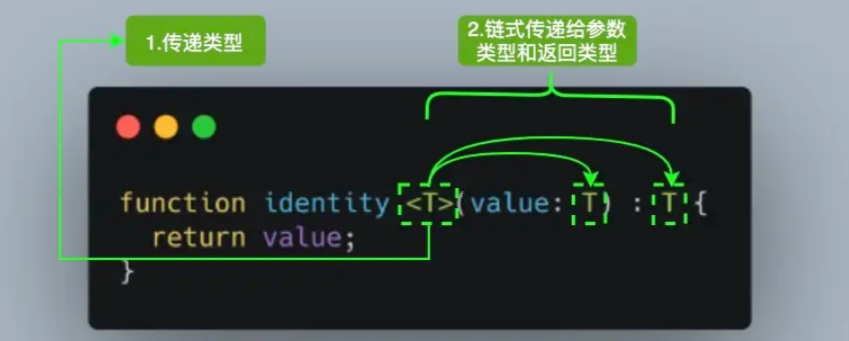

# TypeScript

# 基本使用

* 基本命令：安装编译TS的工具包，node只能识别js代码，安装编译包可以把ts代码转成js代码

  ```bash
  npm i -g typescript
  tsc –v (查看 typescript 的版本)
  tsc xxx.ts //把ts文件转成node可执行的js文件
  ```
* ​`tsconfig.js`​：`ts`​的配置文件

  ```js
  {
      /*
      tsconfig.json是ts编译器的配置，ts编译器可以根据他的信息来对代码进行编译
      'include'用来指定哪些ts文件需要被编译，
      路径： *任意文件， **任意目录
      'exclude' 不需要背编译的文件目录，
      默认值：['node_modules'， 'bower_components', 'jspm_packages']
      */
      "include": ["./src/**/*"],
      // "exclude": ["./src/hello/**/*"],

      /*
      定义被继承的配置文件
      */
      // "extends": "",

      /*
      compilerOptions： 编译器选项
      */
      "compilerOptions": {
          //用来指定ts被编译为的ES的版本
          "target": "es2015",

          //指定使用的模块化的规范'none', 'commonjs', 'amd', 'system', 'umd', 'es6', 'es2015', 'es2020', 'es2022', 'esnext', 'node12', 'nodenext'
          "module": "es2015",

          //用来指定项目中要使用的库,代码提示，代码检查， 在浏览中执行的化不需要指定
          // 'es5', 'es6', 'es2015', 'es7', 'es2016', 'es2017', 'es2018', 'es2019', 'es2020', 'es2021', 'esnext', 'dom', 'dom.iterable', 
          // 'webworker', 'webworker.importscripts', 'webworker.iterable', 'scripthost', 'es2015.core', 'es2015.collection', 'es2015.generator', 
          // 'es2015.iterable', 'es2015.promise', 'es2015.proxy', 'es2015.reflect', 'es2015.symbol', 'es2015.symbol.wellknown', 
          // 'es2016.array.include', 'es2017.object', 'es2017.sharedmemory', 'es2017.string', 'es2017.intl', 'es2017.typedarrays',
          //  'es2018.asyncgenerator', 'es2018.asynciterable', 'es2018.intl', 'es2018.promise', 'es2018.regexp', 'es2019.array', 
          //  'es2019.object', 'es2019.string', 'es2019.symbol', 'es2020.bigint', 'es2020.promise', 'es2020.sharedmemory', 'es2020.string', 
          //  'es2020.symbol.wellknown', 'es2020.intl', 'es2021.promise', 'es2021.string', 'es2021.weakref', 'es2021.intl', 'esnext.array',
          //   'esnext.symbol', 'esnext.asynciterable', 'esnext.intl', 'esnext.bigint', 'esnext.string', 'esnext.promise', 'esnext.weakref'.
          //默认值为：es6, dom 即为浏览器的运行环境
          // "lib": ["dom","es5"]

          //指定编译后文件所在的目录
          "outDir": "./dist",

          //将代码合并为1个文件
          //设置outFile后所有的全局作用域中的代码会合并到同一个文件中
          //用于module: amd, system
          // "outFile": "./dist/app.js"

          //所有严格检查的总开关
          "strict": true,

          //是否对js文件进行编译，默认为false
          "allowJs": true,

          //是否检查js代码是否符合语法规范，默认为false
          "checkJs": true,

          //是否移除注释，默认为false
          "removeComments": true,

          //不生成编译后的文件，只执行编译的过程，默认为false
          "noEmit": false,

          //当有错误时，不生成编译后的文件，默认为false
          "noEmitOnError": true,

          //用来设置编译后的文件是否使用严格模式，默认为false
          "alwaysStrict": true,

          //不允许隐式any类型，默认为false
          "noImplicitAny": true,

          //不允许不明确类型this,默认为false
          "noImplicitThis": true,

          //严格的检查空值，默认为false
          "strictNullChecks": true
      }

  }

  ```

‍

# 数据类型

### Boolean类型

```js
let isDone: boolean = false;
```

### Number类型

```js
let count: number = 10;
```

### String类型

```js
let name: string = "semliker";
```

### Enum类型

* 基本概念

  ```js
  1.枚举（enum）的功能类似于字面量类型+联合类型组合的功能，来描述一个值。规定了某些特定的值。
  2.该值只能是一组命名常量中的一个。

  定义:
  enum 枚举名 { 可取值1, 可取值2,.. }

  使用:
  枚举名.可取值
  ```
* 数字枚举：这类枚举获取到的值，默认是从0开始，也可以设置初始值

  ```js
  enum Direction {
    NORTH,
    SOUTH,
    EAST,
    WEST,
  }

  let dir: Direction = Direction.NORTH;
  默认情况下，NORTH 的初始值为 0，其余的成员会从 1 开始自动增长。换句话说，Direction.SOUTH 的值为 1，Direction.EAST 的值为 2，Direction.WEST 的值为 3。
  let dirName = Direction[0]; // NORTH
  let dirVal = Direction["NORTH"]; // 0


  enum Direction {
    NORTH = 3,
    SOUTH,
    EAST,
    WEST,
  }
  ```
* 字符串枚举：对于纯字符串枚举，我们不能省略任何初始化程序。字符串系统是不会有数字那种默认累计加一的

  ```js
  enum Direction {
    NORTH = "NORTH",
    SOUTH = "SOUTH",
    EAST = "EAST",
    WEST = "WEST",
  }
  ```
* 常量枚举：使用 `const`​ 关键字修饰的枚举，常量枚举会使用内联语法，不会为枚举类型编译生成任何 JavaScript。

  ```js
  const enum Direction {
    NORTH,
    SOUTH,
    EAST,
    WEST,
  }

  let dir: Direction = Direction.NORTH; //编译后： var dir = 0 /* NORTH */;
  ```
* 异构枚举：异构枚举的成员值是数字和字符串的混合

  ```js
  enum Enum {
    A,
    B,
    C = "C",
    D = "D",
    E = 8,
    F,
  }

  //编译后
  var Enum;
  (function (Enum) {
      Enum[Enum["A"] = 0] = "A";
      Enum[Enum["B"] = 1] = "B";
      Enum["C"] = "C";
      Enum["D"] = "D";
      Enum[Enum["E"] = 8] = "E";
      Enum[Enum["F"] = 9] = "F";
  })(Enum || (Enum = {}));

  console.log(Enum.A) //输出：0
  console.log(Enum[0]) // 输出：A
  ```

### Any类型

* 任何类型都可以被归为 any 类型。这让 any 类型成为了类型系统的顶级类型（也被称作全局超级类型）。

  ```js
  当类型设置为 any 时，就取消了类型的限制,不推荐使用any这会让TypeScript变为“AnyScript”(失去TS类型保护的优势)
  隐式 any，有下面两种情况会触发:
  1.声明变量不提供类型也不提供默认值
  2.定义函数时，参数不给类型

  let value: any;
  value.foo.bar; // OK
  value.trim(); // OK
  value(); // OK
  new value(); // OK
  value[0][1]; // OK
  ```

### Unknown类型

* 所有类型也都可以赋值给 `unknown`​。这使得 `unknown`​ 成为 TypeScript 类型系统的另一种顶级类型（另一种是 `any`​）
* ​`nuknown`​可以接受任何值的赋值，因为它本身的意思是不知道该变量的具体类型

  ```js
  let value: unknown;

  value = true; // OK
  value = 42; // OK
  value = "Hello World"; // OK
  ```
* ​`nuknown`​只能赋值给`any`​类型和`nuknown`​类型本身

  ```js
  let value: unknown;

  value.foo.bar; // Error
  value.trim(); // Error
  value(); // Error
  new value(); // Error
  value[0][1]; // Error
  ```

### Nudefined、Null类型

```js
let u: undefined = undefined;
let n: null = null;
```

### Never类型

* ​`never`​ 类型表示的是那些永不存在的值的类型。`never`​ 类型是那些总是会抛出异常或根本就不会有返回值的函数表达式或箭头函数表达式的返回值类型。

  ```js
  // 返回never的函数必须存在无法达到的终点
  function error(message: string): never {
    throw new Error(message);
  }

  function infiniteLoop(): never {
    while (true) {}
  }

  ```
* ​`never`​ 经常用来做类型检查，**使用 never 避免出现新增了联合类型没有对应的实现，目的就是写出类型绝对安全的代码。**

  ```js
  type Foo = string | number;

  function controlFlowAnalysisWithNever(foo: Foo) {
    if (typeof foo === "string") {
      // 这里 foo 被收窄为 string 类型
    } else if (typeof foo === "number") {
      // 这里 foo 被收窄为 number 类型
    } else {
      // foo 在这里是 never
      const check: never = foo;
    }
  }
  ```

### Array类型

```js
// 写法1:
let 变量: [] = [值1，...]:
let numbers: number[] = [1, 3, 5] 
//  numbers必须是数组，每个元素都必须是数字
// 写法2:
let 变量: Array<类型> = [值1，...]
let strings: Array<string> = ['a', 'b', 'c'] 
//  strings必须是数组，每个元素都必须是字符串
```

### Tuple类型

* 概念：**元组**是一种特殊的**数组** 。

  ```js
  1.它约定了的元素个数
  2.它约定了特定索引对应的数据类型
  ```
* 定义

  ```js
  let arr: number[] = [116.27,39.527]//不严谨，因为该类型的数组中可以出现任意多个数字
  let arr: [number, number] = [116.27,39.527]//元组确切地知道包含多少个元素，以及特定索引对应的类型
  ```

### Function类型

* 函数涉及的类型实际上指的是：`函数参数类型`​​和`返回值类型`​​
* 单个函数定义

  ```js
  // 声明式实际写法:
  function add(num1: number, num2: number): number {
    return num1 + num2
  }
  let fn2:(num1:number)=>number=function(){}


  // 箭头函数
  const add2 = (a: number =100, b: number = 100): number =>{
     return a + b
   }
  ```
* 返回值void：即没有返回值，强制`return`​​得话，也不会报错

  ```js
  // 如果什么都不写，此时，add 函数的返回值类型为: void
  const add = (num1: number):void => {}

  // 如果return之后什么都不写，此时，add 函数的返回值类型为: void
  const add = (num1: number):void => { return }

  // 如果return的undefined,是你自己明确返回的undefined，不是计算之后得到的undefined
  const add = (num1: number):undefined => {
    return undefined  // 返回的 undefined是JS中的一个值
  }
  ```
* 可选参数

  ```js
  function slice (a?: number, b?: number):void {
      // ? 跟在参数名字的后面，表示可选的参数,可选参数只能在必须参数的后面
      // 如果可选参数在必选参数的前面，会报错
      console.log(111);  
  }

  注意可选和默认值的区别:
  设置了默认值之后，就是可选的了，不写就会使用默认值，
  可选和默认值它们不能一起使用。优先使用默认值
  ```

### Void类型

* 用来声明函数没有返回值

  ```js
  // 声明函数返回值为void
  function warnUser(): void {
    console.log("This is my warning message");
  }
  ```

### Object类型

* 基本使用

  ```js
  const 对象名: {
    属性名1:类型1,
    属性名2?:类型2,
    方法名1(形参1: 类型1,形参2: 类型2):返回值类型,
    方法名2:(形参1: 类型1,形参2: 类型2) => 返回值类型
  } = { 属性名1: 值1，属性名2: 值2  }

  // 空对象
  let person: {} = {}

  // 有属性的对象
  let person: { name: string } = {
    name: '同学'
  }

  // 在一行代码中指定对象的多个属性类型时，使用;(分号)来分隔
  let person: {name: 'jack'; greet1(name: string):void; greet2: (name: string) => void} = {
    name: 'jack',
    greet1() {},
    greet2:()=>{}
  }

  // 对象中如果有多个类型，可以换行写，通过换行来分隔多个属性类型，可以去掉 ; 
  let person: {
    name: string
    greet1(name: string):void
    greet2: (name: string) => void
  } = {
    name: 'jack',
    greet1() {},
    greet2:()=>{}
  }
  ```
* 可选参数

  ```js
  let obj: {
    name: String
    age: Number
    gender?: Boolean
  } = {
    name: 'xjj',
    age: 18
  }
  ```

# 相关概念

### 断言

* 类型断言

  ```js
  有时候你会比TS更加明确一个值的类型，此时，可以使用类型断言来指定更具体的类型。
  即，你可能知道里面值得类型，但是不知道里面具体的值就使用类型断言，先给个空的再as一下，告诉系统其实是这个as之后的东西
  类型断言好比其他语言里的类型转换，但是不进行特殊的数据检查和解构。它没有运行时的影响，只是在编译阶段起作用。
  type TObj = {
    name：string,
    age:number
  }
  let obj : TObj = {} as TObj//写法1
  let obj : TObj = <TObj>{}//写法2
  ```
* 非空断言

  ```js
  在上下文中当类型检查器无法断定类型时，可以使用缀表达式操作符 ! 进行断言操作对象是非 null 和非 undefined 的类型。
  即x!的值不会为 null 或 undefined(有时候要 .出去 的那个值有可能是null或者undefined的时候，你使用.操作，系统会提示报错)
  也就是说，使用 x!. 告诉系统，这里肯定可以进行点操作的
  let user: string | null | undefined;
  console.log(user!.toUpperCase()); // 编译正确
  console.log(user.toUpperCase()); // 错误。是null的时候是无法点操作的
  ```
* 确定赋值断言

  ```js
  我们定义了变量, 没有赋值就使用，则会报错
  通过 let x!: number; 确定赋值断言，TypeScript 编译器就会知道该属性会被明确地赋值。
  let value:number
  console.log(value); // Variable 'value' is used before being assigned.
  let value!:number
  console.log(value); // undefined 编译正确
  ```

### 操作符

* 概念：类型保护是可执行运行时检查的一种表达式，用于确保该类型在一定的范围内。换句话说，类型保护可以保证一个字符串是一个字符串，尽管它的值也可以是一个数值。

  ```js
  类型保护与特性检测并不是完全不同，其主要思想是尝试检测属性、方法或原型，以确定如何处理值
  ```
* ​`in`​操作符：用来遍历枚举类型

  ```js
  type Keys = "a" | "b" | "c"

  type Obj =  {
    [p in Keys]: any
  } // -> { a: any, b: any, c: any }
  ```
* ​`typeof`​ 操作符： 可以用来获取一个变量声明或对象的类型。

  ```js
  interface Person {
    name: string;
    age: number;
  }

  const sem: Person = { name: 'semlinker', age: 33 };
  type Sem= typeof sem; // -> Person

  function toArray(x: number): Array<number> {
    return [x];
  }

  type Func = typeof toArray; // -> (x: number) => number[]
  ```
* ​`keyof`​操作符：可以用于获取某种类型的所有键，其返回类型是联合类型

  ```js
  interface Person {
    name: string;
    age: number;
  }

  type K1 = keyof Person; // "name" | "age"
  type K2 = keyof Person[]; // "length" | "toString" | "pop" | "push" | "concat" | "join" 
  type K3 = keyof { [x: string]: Person };  // string | number

  ```
* ​`instanceof`​操作符：实例是否在构造函数的原型对象的原型链上

  ```js
  interface Padder {
    getPaddingString(): string;
  }

  class SpaceRepeatingPadder implements Padder {
    constructor(private numSpaces: number) {}
    getPaddingString() {
      return Array(this.numSpaces + 1).join(" ");
    }
  }

  class StringPadder implements Padder {
    constructor(private value: string) {}
    getPaddingString() {
      return this.value;
    }
  }

  let padder: Padder = new SpaceRepeatingPadder(6);

  if (padder instanceof SpaceRepeatingPadder) {
    // padder的类型收窄为 'SpaceRepeatingPadder'
  }


  ```
* ​`infer`​：在条件类型语句中，可以用 `infer`​ 声明一个类型变量并且对它进行使用。简单说就是用它取到函数返回值的类型方便之后使用。

  ```js
  type ReturnType<T> = T extends (
    ...args: any[]
  ) => infer R ? R : any;
  ```
* ​`Partial<T>`​：作用就是将某个类型里的属性全部变为可选项 `?`​

  ```js
  1.定义
  /**
   * node_modules/typescript/lib/lib.es5.d.ts
   * Make all properties in T optional
   */
  type Partial<T> = {
    [P in keyof T]?: T[P];
  };

  2.示例
  interface Todo {
    title: string;
    description: string;
  }

  function updateTodo(todo: Todo, fieldsToUpdate: Partial<Todo>) {
    return { ...todo, ...fieldsToUpdate };
  }

  const todo1 = {
    title: "Learn TS",
    description: "Learn TypeScript",
  };

  const todo2 = updateTodo(todo1, {
    description: "Learn TypeScript Enum",
  });

  在上面的 updateTodo 方法中，我们利用 Partial<T> 工具类型，定义 fieldsToUpdate 的类型为 Partial<Todo>，即：
  {
     title?: string | undefined;
     description?: string | undefined;
  }
  ```

### 联合类型

```js
| 竖线，在 TS 中叫做联合类型，即:由两个或多个其他类型组成的类型，表示可以是这些类型中的任意一种。
let 变量: 类型1 | 类型2 | 类型3 .... = 初始值
let arr1 :number | string = 1 // 可以写两个类型
```

### 类型别名

* 概念：`type`​ 类型别名的关键字，可以定义任何数据类型，和接口有些类似

  ```js
  type 别名 = 类型//别名一般首字母大写，也使用T开头

  type SType = string // 定义
  type CustomArray = (number | string)[]

  const str1:s = 'abc'
  let arr1: CustomArray = [1, 'a', 3, 'b']
  ```
* 交叉类型： 类型别名使用 `&`​ 来把多个类型合并成一个类型，`接口interface`​使用 `**extends**`​ 继承

  ```js
  type PartialPointX = { x: number; };
  type PartialPointY = { y: number; }
  type Point = PartialPointX & PartialPointY;

  let point: Point = {
    x: 1,
    y: 1
  }


  ```
* 交叉类型：**同名基础类型属性**的合并，基础类型合并，会导致合并成never，因为没有交集

  ```js
  //某些类型存在相同的成员，类型又不一直的情况下，会报错，如 TypeA 中 c:number ,TypeB 中 c：string 。c不能存在c是number又是string的情况，则 c 应该是 never 类型。
  interface X {
    c: string;
    d: string;
  }

  interface Y {
    c: number;
    e: string
  }

  type XY = X & Y;
  type YX = Y & X;

  let p: XY; //此时的c是 never 类型
  let q: YX; //此时的c是 never 类型
  ```

  ‍
* 交叉类型：**同名非基础类型属性**的合并，可以成功合并

  ```js
  interface D { d: boolean; }
  interface E { e: string; }
  interface F { f: number; }

  interface A { x: D; }
  interface B { x: E; }
  interface C { x: F; }

  type ABC = A & B & C;

  let abc: ABC = {
    x: {
      d: true,
      e: 'semlinker',
      f: 666
    }
  };

  console.log('abc:', abc);
  ```

### 接口

* 概念：当一个对象类型被多次使用时，可以使用类型别名(`type`​)或接口(`interface`​)，以达到复用的目的
* 基本使用：用来修饰对象类型的，可以重复声明，会继承上一次定义的类型

  ```js
  // 使用 interface 关键字
  interface IObj {
    name: String
    age: Number
    gender: Boolean
    sayHi: () => void
  }
  let obj1: IObj = {
    name: '张三',
    age: 18,
    gender: false,
    sayHi: () => console.log('Hi')
  }
  ```
* 只读可选属性：只读关键字`readonly`​

  ```js
  interface Person {
    readonly name: string;
    age?: number;//可选
  }
  ```
* 接口继承：如果两个接口之间有相同的属性或方法，可以将**公共的属性或方法抽离出来，通过继承来实现复用**

  ```js
  interface Point2D { x: number; y: number }
  interface Point3D { x: number; y: number; z: number }

  interface Point2D { x: number; y: number }
  // 继承 Point2D
  interface Point3D extends Point2D {
    z: number
  }
  ```
* 和类型别名的区别

  ```js
  接口:
  只能为对象指定类型。它可以继承。
  可以重复声明，并继承之前声明的接口类型

  类型别名:
  不仅可以为对象指定类型,实际上可以为任意类型指定别名
  不能重复声明同一个类型别名
  ```

### 索引签名

* 控制`key`​值的类型

  ```js
  interface Person {
    [propName: string]: any; //控制 索引key 的类型
  } 
  ```

### 泛型

* 概念：泛型，类型的占位，**不预先指定具体的类型，而是在使用的时候在指定类型限制**的一种特性。  
  ​​
* 泛型约束：用来约束泛型，即限制泛型的数据类型

  ```js
  //定义一个函数：函数的参数必须有一个属性： length
  interface ILength {
    length: number
  }
  //限制了T肯定有length属性
  function fn<T extends ILength> (a: T): T {
    console.log(a.length)
    return a
  }

  let arr: Array<number> = [1, 2, 3]
  fn(arr)
  ```
* 泛型函数：泛型函数，使用泛型的函数

  ```js
  //先定义，用泛型占领占位
  function fn<type>(a:type):tpye{return a}

  //使用的时候，在明确泛型的具体类型
  fn<number>(1)
  fn<string>('a')
  fn('b')
  ```
* 泛型接口：使用泛型的接口

  ```js
  interface IObj<T> {
    name: string
    age: number
    gender: number
    height: T
    weight: T
  }

  let o1: IObj<number> = {
    name: 'xjj',
    age: 18,
    gender: 0,
    height: 100,
    weight: 100
  }

  let o2: IObj<string> = {
    name: 'xjj',
    age: 19,
    gender: 0,
    height: '一米八',
    weight: '一百八'
  }
  ```

### 函数重载

* 函数重载或方法重载是使用相同名称和不同参数数量或类型创建多个方法的一种能力。即对函数的多次类型定义，而不是对函数的实现签名

  ```js
  function add(a: number, b: number): number; //多次对函数的参数类型，和返回值进行定义
  function add(a: string, b: string): string; //多次对函数的参数类型，和返回值进行定义
  function add(a: string, b: number): string;
  function add(a: number, b: string): string;

  //函数的实现签名，需要同时满足上面的所有类型条件才可以
  function add(a: Combinable, b: Combinable) {
    // type Combinable = string | number;
    if (typeof a === 'string' || typeof b === 'string') {
      return a.toString() + b.toString();
    }
    return a + b;
  }
  ```

# 类

* 继承
* 封装
* 多态

### 基本定义

* 类使用 `class`​ 关键字来定义

  ```js
  class Greeter {
    // 静态属性 。 使用 类 来访问
    static cname: string = "Greeter";
    // 成员属性
    greeting: string;
    // 构造函数 - 执行初始化操作
    constructor(message: string) {
      super()//调用父类的方法
      this.greeting = message;
    }

    // 静态方法
    static getClassName() {
      return "Class name is Greeter";
    }

    // 成员方法
    greet() {
      return "Hello, " + this.greeting;
    }

    //自读属性
    readonly age = 20
  }

  let greeter = new Greeter("world");
  ```
* 编译后

  ```js
  "use strict";
  var Greeter = /** @class */ (function () {
      // 构造函数 - 执行初始化操作
      function Greeter(message) {
        this.greeting = message;
      }
      // 静态方法
      Greeter.getClassName = function () {
        return "Class name is Greeter";
      };
      // 成员方法
      Greeter.prototype.greet = function () {
        return "Hello, " + this.greeting;
      };
      // 静态属性
      Greeter.cname = "Greeter";
      return Greeter;
  }());
  var greeter = new Greeter("world");
  ```

### 继承

* ​`extends`​：实现类的继承

  ```js
  class Student extends Person {
    study() {
      console.log(`${this.name} needs study`)
    }
  }

  const s1 = new Student('lin')
  s1.study()
  ```

### 接口实现

* ​`implements`​接口是一种描述对象的形状的方式，它定义了对象应该具有的属性和方法。在 TypeScript 中，可以使用接口来实现类的约束。

  ```js
  interface Shape {
    calculateArea(): number;
  }

  class Circle implements Shape {
    radius: number;

    constructor(radius: number) {
      this.radius = radius;
    }

    calculateArea() {
      return Math.PI * this.radius * this.radius;
    }
  }

  ```

### 访问修饰符

* ​`public `​、`private`​、`protected `​

  ```js
  1.public ：公开，子类和构建出来的实例对象都能访问，默认是public
  2.private ：私有，子类和实例都无法访问，只能自己使用
  3.protected ：受保护的，只有自己和子类才能访问，实例对象不能访问
   
  class Person {
    public name = "张三"
    protected age = 20
    private passWord = "123456789"
  }


  ```
* 私有字段：使用`#`​ 来修饰的字段，和常规字段和使用`private`​修饰的字段不同，

  ```js
  1.私有字段以 # 字符开头，有时我们称之为私有名称
  2.每个私有字段名称都唯一地限定于其包含的类；
  3.不能在私有字段上使用 TypeScript 可访问性修饰符（如 public 或 private）；
  4.私有字段不能在包含的类之外访问，甚至不能被检测到。

  class Person {
    #name: string;

    constructor(name: string) {
      this.#name = name;
    }

    greet() {
      console.log(`Hello, my name is ${this.#name}!`);
    }
  }

  let semlinker = new Person("Semlinker");

  semlinker.#name;
  //     ~~~~~
  // Property '#name' is not accessible outside class 'Person'
  // because it has a private identifier.

  ```

### 访问器

* ​`set`​、`get`​字段修饰，进行数据的拦截，实现数据的封装和有效性校验，防止出现异常数据。

  ```js
  let passcode = "Hello TypeScript";

  class Employee {
    private _fullName: string;

    get fullName(): string {
      return this._fullName;
    }

    set fullName(newName: string) {
      if (passcode && passcode == "Hello TypeScript") {
        this._fullName = newName;
      } else {
        console.log("Error: Unauthorized update of employee!");
      }
    }
  }

  let employee = new Employee();
  employee.fullName = "Semlinker";
  if (employee.fullName) {
    console.log(employee.fullName);
  }
  ```

### 抽象类

* 抽象类`abstract`​：使用 `abstract`​ 关键字声明的类，我们称之为抽象类。抽象类不能被实例化，因为它里面包含一个或多个抽象方法。所谓的抽象方法，是指不包含具体实现的方法。

  ```js
  抽象类可以看作是一个基础模板，不生成具体实例，用来给别的子类继承
  abstract class Person {
    constructor(public name: string){}
    abstract say(words: string) :void;
  }

  // Cannot create an instance of an abstract class.(2511)
  const lolo = new Person(); // Error


  // 抽象类不能被实例化，可以用来做基类，只能实例化实现了所有抽象方法的子类
  abstract class Person {
    constructor(public name: string){}
    // 抽象方法
    abstract say(words: string) :void;
  }

  class Developer extends Person {
    constructor(name: string) {
      super(name);
    }
    say(words: string): void {
      console.log(`${this.name} says ${words}`);
    }
  }

  const lolo = new Developer("lolo");
  lolo.say("I love ts!"); // lolo says I love ts!

  ```

# 类型声明文件

## 模块化

### 命名空间

关键字 `namespace`​ ,会在全局生成一个对象，定义在`namespace`​内部的都要通过这个对象的属性访问。

通过`export`​关键字对外暴露需要在外部访问的对象。 

命名空间表示一个全局变量是一个对象，可以定义很多属性类型。同时命名空间里可能会用到一些接口类型(`interface`​、`type`​)，这时候一般有两种写法：

* 写在`namespace`​外层，会作为全局类型被引入，从而可能污染全局类型空间。
* 写在`namespace`​里层，在想使用该类型的时候，可以通过`namespace.interface`​进行使用。（推荐）
* 同时，命名空间支持嵌套使用，即：`namespace`​嵌套`namepsace`​。或者简化的写法，可以写成`namepsace.namespace`​进行声明。

```js
// ./types/test.d.ts
declare namespace Jye {
  interface Info {
    name: string;
    age: number;
  }

  function getAge(): number;
}


// ./src/test.ts
let settings: Jye.Info = {
  name: "jye",
  age: 8,
};

Jye.getAge();

```

### 三斜线指令

* 概念：`ts `​早期模块化的标签, 用来导入依赖, `ES6`​广泛使用后, 在编写TS文件中不推荐使用, 除了以下的场景使用`///`​, 其他场景使用 `import`​ 代替

  1. 库依赖全局库, 因为全局库不能使用import导入
  2. 全局库依赖于某个 UMD 模块，因为全局库中不能出现import/export, 出现则为npm/UMD

  ```js
  说白了，三斜线的path & types，和es6的import语义相似，
  同时三斜线指令必须放在文件的最顶端。
  例如，当我们的声明文件过于庞大，一般都会采用三斜线指令，将我们的声明文件拆分成若干个，然后由一个入口文件引入。

  ///<reference types=“UMDModuleName/globalName” /> 表示对一个库的依赖
  ///<reference path="./lib/index.d.ts" /> 表示对一个文件的依赖。
  ```

## 类型声明

### 全局类型声明

* 在TS中，以`.d.ts`​​结尾的文件默认是全局模块，里面声明的类型，或者变量会被默认当成全局性质的，其他后缀结尾的文件默认是局部模块。对于局部模块要在文件里面显式写import或者export，否则会报错
* 声明变量使用关键字`declare`​​来表示声明其后面的**全局**变量的类型，`declare namespace`​​声明全局命名空间，`interface`​​可以不使用`declare`​​关键字来命名全局类型声明
* 声明文件放在项目里的**任意路径/文件名**都可以被`ts`​​编译器识别，但实际开发中发现，为了规避一些奇怪的问题， **推荐放在根目录下。**

```js
//ts会识别 xxx.d.ts 文件为类型声明，使用 declare 修饰的就是全局类型声明，可以直接在文件中使用
// src/jQuery.d.ts
declare namespace jQuery {
    const version: number;
    class Event {
        blur(eventType: EventType): void
    }
    enum EventType {
        CustomClick
    }
    interface AjaxSettings {
        method?: 'GET' | 'POST'
        data?: any;
    }
    function ajax(url: string, settings?: AjaxSettings): void;
}
```
