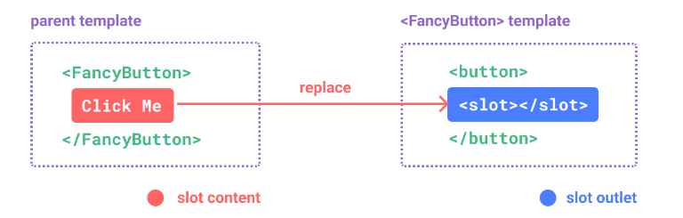
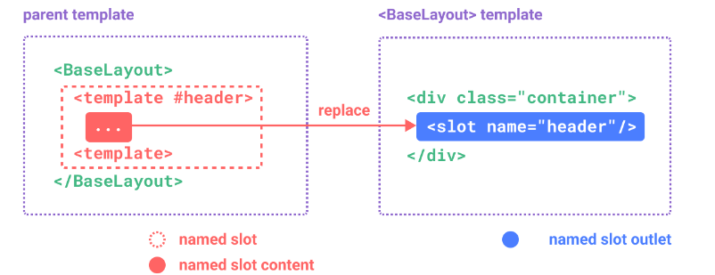
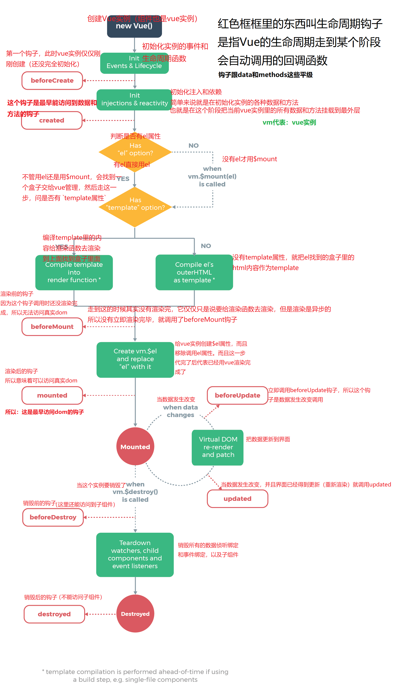

# Vue

# vue3

## 基本概念

### [响应式原理](https://cn.vuejs.org/guide/extras/reactivity-in-depth.html#how-reactivity-works-in-vue)

* vue2：数据劫持，订阅者模式

  ```js
  1.使用 setter 、getter 来对数据进行劫持
  2.使用track() 去检查是否有运行的副作用，有的话，查找到追踪该属性的订阅者的set，然后执行
  ```

### DOM 更新

　　当你修改了响应式状态时，DOM 会被自动更新。但是需要注意的是，**DOM 更新不是同步的**。Vue 会在“next tick”更新周期中缓冲所有状态的修改，以确保不管你进行了多少次状态修改，每个组件都只会被更新一次。

### VNode

* 概念：VNode是一个类，通过属性来描述dom结构的对象
* 节点概念

  ```js
  元素节点:div
  属性节点:class属性
  文本节点:标签内的文字
  注释节点:html中的注释
  ```
* 基本结构

  ```js
  export default class VNode {
    tag: string | void;
    data: VNodeData | void;
    children: ?Array<VNode>;
    text: string | void;
    elm: Node | void;
    ns: string | void;
    context: Component | void; // rendered in this component's scope
    functionalContext: Component | void; // only for functional component root nodes
    key: string | number | void;
    componentOptions: VNodeComponentOptions | void;
    componentInstance: Component | void; // component instance
    parent: VNode | void; // component placeholder node
    raw: boolean; // contains raw HTML? (server only)
    isStatic: boolean; // hoisted static node
    isRootInsert: boolean; // necessary for enter transition check
    isComment: boolean; // empty comment placeholder?
    isCloned: boolean; // is a cloned node?
    isOnce: boolean; // is a v-once node?

    constructor (
      tag?: string,
      data?: VNodeData,
      children?: ?Array<VNode>,
      text?: string,
      elm?: Node,
      context?: Component,
      componentOptions?: VNodeComponentOptions
    ) {
      /*当前节点的标签名*/
      this.tag = tag
      /*当前节点对应的对象，包含了具体的一些数据信息，是一个VNodeData类型，可以参考VNodeData类型中的数据信息*/
      this.data = data
      /*当前节点的子节点，是一个数组*/
      this.children = children
      /*当前节点的文本*/
      this.text = text
      /*当前虚拟节点对应的真实dom节点*/
      this.elm = elm
      /*当前节点的名字空间*/
      this.ns = undefined
      /*编译作用域*/
      this.context = context
      /*函数化组件作用域*/
      this.functionalContext = undefined
      /*节点的key属性，被当作节点的标志，用以优化*/
      this.key = data && data.key
      /*组件的option选项*/
      this.componentOptions = componentOptions
      /*当前节点对应的组件的实例*/
      this.componentInstance = undefined
      /*当前节点的父节点*/
      this.parent = undefined
      /*简而言之就是是否为原生HTML或只是普通文本，innerHTML的时候为true，textContent的时候为false*/
      this.raw = false
      /*静态节点标志*/
      this.isStatic = false
      /*是否作为跟节点插入*/
      this.isRootInsert = true
      /*是否为注释节点*/
      this.isComment = false
      /*是否为克隆节点*/
      this.isCloned = false
      /*是否有v-once指令*/
      this.isOnce = false
    }

    // DEPRECATED: alias for componentInstance for backwards compat.
    /* istanbul ignore next https://github.com/answershuto/learnVue*/
    get child (): Component | void {
      return this.componentInstance
    }
  }
  ```
* 重要的属性

  ```js
  TextVNode 文本节点。
  ElementVNode 普通元素节点。
  ComponentVNode 组件节点。
  EmptyVNode 没有内容的注释节点。
  CloneVNode 克隆节点，可以是以上任意类型的节点，唯一的区别在于isCloned属性为true
  ```

### scoped

* 属性选择器：`div[属性名] { 样式 }`​
* 设置scoped

  ```css
  <style scoped>
  .example {
    color: red;
  }
  </style>
  <template>
    <div class="example">hi</div>
  </template>

  转化为
  <style>
  .example[data-v-f3f3eg9] {
    color: red;
  }
  </style>
  <template>
    <div class="example" data-v-f3f3eg9>hi</div>
  </template>
  ```
* Scoped和属性选择器的关系

  * 如果某个组件加了`scoped`​​，那么它会帮这个组件内所有的标签都加一个行内属性：`data-v-自己的hash`​​，并且把这个组件里加了`scoped`​​ 的`style`​​里的样式，变成 `属性选择器[data-v-自己的hash]`​​，通过这个操作，就意味着让这些样式只能给自己用了，因为只有自己才有`[data-v-自己的hash]`​​的行内属性
  * 也就是说，在设置了`scoped`​​中写的样式，这个样式只会作用到该标签上面，如果这个标签里面也有标签，那里面的标签是无法接受到该样式的`scoped`​​
* 深度作用选择器：组件加了 `scoped`​​，它的样式只能给自己用，子组件的内部标签，**甚至该标签里面的内部标签**，也用不了（相当于你写谁谁才可以用，它的子标签是无法继承它的样式属性）。如果希望某个样式能作用的更深（也就是作用到子组件内部），就要用 **深度作用选择器**，有些不专业的叫法也叫 `样式穿透`​​

  ```css
  //vue3的写法


  默认情况下，作用域样式不会影响到 <slot/> 渲染出来的内容，因为它们被认为是父组件所持有并传递进来的。
  使用 :slotted 伪类以明确地将插槽内容作为选择器的目标：
  <style scoped>
  :slotted(div) {
    color: red;
  }
  </style>

  vue2的写法


  <style scoped>
  //加了scoped，会让当前组件里写过的标签用上样式
  //当前组件里没写的标签肯定用不上，所以意味着组件里的子组件内部的标签用不上
  ::v-deep p {
    color: red;//现在p标签作用的更深：能影响到子组件里的标签
  }
  </style>


  ```
* 深度作用选择器原理：就是把这个选择器的 `data-v-hash`​​ 的属性选择器提升到前面，变成后代选择器，既然是后代选择器，所有当前组件里的后代就能匹配的上了

  ```css
  p[data-v-hash]{} //交集选择器
  变成了
  [data-v-hash] p{} //后代选择器
  ```
* vue2写法

  ```js
  >>>       less不支持 
  /deep/    less 支持，但是vscode报错
  ::v-deep  推荐，不会报错，less 和 scss 都支持
  ```
* vue3写法

  ```css
  深度选择器
  :deep()
  <style scoped>
  .a :deep(.b) {
  }
  </style>

  插槽选择器
  <style scoped>
  :slotted(div) {
    color: red;
  }
  </style>

  全局选择器
  <style scoped>
  :global(.red) {
    color: red;
  }
  </style>
  ```

### css-modules

* 概念：一个 `<style module>`​ 标签会被编译为 [CSS Modules](https://github.com/css-modules/css-modules) 并且将生成的 CSS class 作为 `$style`​ 对象暴露给组件
* $style

  ```css
  <template>
    <p :class="$style.red">This should be red</p>
  </template>

  <style module>
  .red {
    color: red;
  }
  </style>
  ```
* module=“name”

  ```css
  <template>
    <p :class="classes.red">red</p>
  </template>

  <style module="classes">
  .red {
    color: red;
  }
  </style>
  ```
* ​`useCssModule`​

  ```css
  import { useCssModule } from 'vue'
  // 在 setup() 作用域中...
  // 默认情况下, 返回 <style module> 的 class
  useCssModule()
  // 具名情况下, 返回 <style module="classes"> 的 class
  useCssModule('classes')
  ```

### hook

* 概念：可以说是代替了vue2中的mixins。和react中的hook（钩子）一样。
* 官方解释：“组合式函数”(Composables) 是一个利用 Vue 的组合式 API 来封装和复用**有状态逻辑**的函数
* 混入的缺点

  ```js
  1.不清晰的数据来源：使用多个mixin时候，数据的来源就会不清晰。混入是导入注册就可以直接当属性或方法使用，一旦mixins多了，就不容易搞清楚那个属性是那个文件里面的
  2.命名空间会产生冲突：因为混入的时候不可以改名，一旦混入进来的文件多了，里面中的属性或方法名重复，那么就会发生命名冲突
  3.隐式的跨 mixin 交流：多个 mixin 需要依赖共享的属性名来进行相互作用，这使得它们隐性地耦合在一起
  ```
* 基本使用

  ```js
  1.创建相应的js文件
  2.里面写方法，也就是.vue文件中，js部分的内容，可以正常地导入vue中的生命周期等内容
  3.再暴露出去使用
  4.每个调用函数的组件实例都会创建独有的状态属性（即vue2中的mixin的使用，组件的使用不会影响到别的组件使用相同的mixin）
  5.组合式函数约定用驼峰命名法命名，并以“use”作为开头。=
  ```

## 响应式

### ref

　　​`ref()`​ 接收参数，并将其包裹在一个带有 `.value`​ 属性的 ref 对象中返回。

　　**可以是简单或复杂数据类型**，返回一个响应式的、可更改的 ref 对象，此对象只有一个指向其内部值的属性 `.value`​。

　　ref 可以持有任何类型的值，包括深层嵌套的对象、数组或者 JavaScript 内置的数据结构，比如 `Map`​

　　也通过 `shallowRef()`​这个api来传建浅层的响应式对象，只会对 .value 的访问是响应式的，再某种情况下可以减少性能的浪费

* 基本使用

  ```js
  import { ref }  from 'vue'
  let count =  ref(0)
  let obj =  ref({count: 0})
  const year: Ref<string | number> = ref('2020')//传入一个泛型参数，来覆盖默认的推导行为
  function fn(){
    count++
  }

  <template>
    <div>{{ obj.count }}</div>//在模板中会自动解包，不在需要.value
  </template>
  ```
* 解包：简单来说就是使用ref变量的时候，需不需要 .value 解包拿到最新的值

  ```js
  在模板中ref会自动解包（最顶级），作为响应式数据的对象属性会自动解包，作为Array、Map 的值的时候，需要手动解包
  1.作为响应式对象的属性的时候会自动解包
  const count = ref(0)
  const state = reactive({
    count
  })

  console.log(state.count) // 0  赋值没有用 .value 吧

  state.count = 1
  console.log(count.value) // 1

  2.作为响应式数组或原生集合类型(如 Map) 中的元素被访问时，它不会被解包
  const books = reactive([ref('Vue 3 Guide')])
  console.log(books[0].value)// 这里需要 .value

  const map = reactive(new Map([['count', ref(0)]]))
  console.log(map.get('count').value)// 这里需要 .value
  ```
* 在模板中使用，最顶级属性才会自动解包

  ```js
  const count = ref(0)//顶级
  const object = { id: ref(0) }//非顶级，在普通对象中作为一个value

  模板中使用
  {{ count + 1 }}会触发响应式
  {{ object.id + 1 }}不会触发响应式，渲染结果是： [object Object]1

  如果 ref 是文本插值的最终计算值 (即 {{ }} 标签)，那么它将被解包，因此以下内容将渲染为 1：
  {{ object.id }} //该特性仅仅是文本插值的一个便利特性，等价于 {{ object.id.value }}

  可以解构出来获得响应式
  const { id } = object
  {{ id + 1 }}
  ```

### reactive

　　((20230809212828-za2tyo3 'ref'))可以声明简单、复杂数据类型，reactive只能声明复杂数据类型

　　ref将内部值包装在特殊对象中，`reactive()`​ 将使对象本身具有响应性

　　​`reactive()`​ 将深层地转换对象，当访问嵌套对象时，它们也会被 `reactive()`​ 包装。当 ref 的值是一个对象时，`ref()`​ 也会在内部调用它。

　　​`shallowReactive() ​`​可以选择退出深层响应性，就是只包装最外面这层。

* 概念：reactive是使用Proxy的，返回的是代理对象，里面的对象也是，所以和原对象是不一致的，不是全等关系，**只有代理对象是响应式的，更改原始对象不会触发更新。**

  ```js
  const raw = {}
  const proxy = reactive(raw)
  console.log(proxy === raw) // false// 代理对象和原始对象不是全等的


  为保证访问代理的一致性，对同一个原始对象调用 reactive() 会总是返回同样的代理对象，而对一个已存在的代理对象调用 reactive() 会返回其本身：意思就是说，不是代理我给你一个代理，这个代理对象是不会变得，对代理对象进行代理，会把本身这个代理对象返回
  console.log(reactive(raw) === proxy) // true// 在同一个对象上调用 reactive() 会返回相同的代理
  console.log(reactive(proxy) === proxy) // true// 在一个代理上调用 reactive() 会返回它自己


  const proxy = reactive({})
  const raw = {}
  proxy.nested = raw
  console.log(proxy.nested === raw) // false
  ```
* 局限性

  ```js
  1.它只能用于对象类型 (对象、数组和如 Map、Set 这样的集合类型)。它不能持有如 string、number 或 boolean 这样的原始类型。
  2.不能轻易地“替换”响应式对象，因为这样的话与第一个引用的响应性连接将丢失
  3.对解构操作不友好：当我们将响应式对象的原始类型属性解构为本地变量时，或者将该属性传递给函数时，我们将丢失响应性连接
  5.所以建议使用 ref() 作为声明响应式状态的主要 API
  ```
* 基本使用

  ```js
  定义
  import { reactive } from 'vue'
  const state = reactive({ count: 0 })

  js中使用
  state.count++ //可以不用.value

  模板中使用
  <button @click="state.count++">
    {{ state.count }}
  </button>
  ```

### computed

　　计算属性：`computed()`​ 方法期望接收一个 getter 函数，返回值为一个**计算属性 ref。默认是在组件更新完成之前调用**

　　计算属性值会基于**其响应式依赖**被**缓存**：无论多少次**访问计算属性**，都会**立即返回先前的计算结果**，**而不用重复执行 getter 函数**。

* 基本使用

  ```js
  <script setup>
  import { reactive, computed } from 'vue'

  const author = reactive([
      'Vue 2 - Advanced Guide',
      'Vue 3 - Basic Guide',
      'Vue 4 - The Mystery'
  ])

  // 一个计算属性 ref
  const publishedBooksMessage = computed(() => {
    return author.length > 0 ? 'Yes' : 'No'
  })
  </script>

  <template>
    <span>{{ publishedBooksMessage }}</span>
  </template>
  ```
* 计算属性的set

  ```js
  <script setup>
  import { ref, computed } from 'vue'
  const firstName = ref('John')
  const lastName = ref('Doe')
  const fullName = computed({
    // getter
    get() {
      return firstName.value + ' ' + lastName.value
    },
    // setter
    set(newValue) {
      [firstName.value, lastName.value] = newValue.split(' ') // 注意：我们这里使用的是解构赋值语法
    }
  })
  </script>
  ```
* 注意

  ```js
  1. Getter 不应有副作用
  计算属性的 getter 应只做计算而没有任何其他的副作用

  2.避免直接修改计算属性值
  从计算属性返回的值是派生状态。
  可以把它看作是一个“临时快照”，每当源状态发生变化时，就会创建一个新的快照。
  更改快照是没有意义的，因此计算属性的返回值应该被视为只读的，并且永远不应该被更改——应该更新它所依赖的源状态以触发新的计算。
  ```

### watch

* 概念：侦听器，在响应式侦听发生的时候，触发回调函数，可以去执行一些函数的副作用，有返回值，返回一个函数
* 基本使用

  ```js
  <script setup>
  import { ref, watch } from 'vue'
  const conut = ref(0)
  watch(conut , ()=>{},{deep：true，immediate:true})// 可以直接侦听一个 ref
  </script>
  ```
* watch的参数：有三个，第三个参数默认都是false

  ```js
  1.第一个参数：可以是不同形式的“数据源”： 
  ref (包括计算属性)、一个响应式对象、一个getter函数、或多个数据源组成的数组
  不能直接侦听响应式对象的属性，需要侦听的话，使用一个getter函数
  2.第二个参数：执行的回调函数
  3.是个对象{deep：true，immediate:true}，是否深度侦听，是否先立即执行一次回调，还有一个`post`参数，是否在组件更新后调用
  const x = ref(0)
  const y = ref(0)

  // 单个 ref
  watch(x, (newX) => {
    console.log(`x is ${newX}`)
  })

  // getter 函数
  watch(
    () => x.value + y.value,
    (sum) => {
      console.log(`sum of x + y is: ${sum}`)
    }
  )

  // 多个来源组成的数组
  watch([x, () => y.value], ([newX, newY]) => {
    console.log(`x is ${newX} and y is ${newY}`)
  })

  //不能直接侦听响应式对象的属性
  const obj = reactive({ count: 0 })
  // 错误，因为 watch() 得到的参数是一个 number
  watch(obj.count, (count) => {
    console.log(`count is: ${count}`)
  })

  // 提供一个 getter 函数
  watch(() => obj.count, (count) => {
      console.log(`count is: ${count}`)
    }
  )
  ```
* 返回值：返回一个函数，执行该函数可以停止侦听

  ```js
  1.同步语句创建的侦听器，会自动绑定到宿主组件实例上，并且会在宿主组件卸载时自动停止。
  2.如果用异步回调创建一个侦听器，那么它不会绑定到当前组件上，你必须手动停止它，以防内存泄漏。
  <script setup>
  import { watchEffect } from 'vue'
  watchEffect(() => {})// 它会自动停止

  setTimeout(() => {
    watchEffect(() => {})// ...这个则不会！
  }, 100)
  </script>

  const unwatch = watchEffect(() => {})//返回一个函数，执行该函数，就会卸载该侦听器

  // ...当该侦听器不再需要时
  unwatch()
  ```
* 深层侦听器：直接给 `watch()`​ 传入一个响应式对象，会隐式地创建一个深层侦听器——该回调函数在所有嵌套的变更时都会被触发

  ```js
  const obj = reactive({ count: 0 })
  // 在嵌套的属性变更时触发
  // 注意：`newValue` 此处和 `oldValue` 是相等的，因为它们是同一个对象！
  watch(obj, (newValue, oldValue) => {})
  obj.count++

  watch(() => state.someObject,() => {}) // 仅当 state.someObject 被替换时触发
  ```
* 注意点：默认情况下，**侦听器回调都会在 Vue 组件更新之前被调用**。这意味着**回调中访问的 DOM 将是被 Vue 更新之前的状态**。

  ```js
  watch(source, callback, {
    flush: 'post'
  })

  watchEffect(callback, {
    flush: 'post'
  })
  //watchEffect的别名函数
  import { watchPostEffect } from 'vue'
  watchPostEffect(() => {
    /* 在 Vue 更新后执行 */
  })
  ```

### watchEffect

* 概念：`watchEffect()`​ 允许我们自动跟踪回调的响应式依赖。并先执行一次

  ```js
  watch 、 watchEffect 的区别
  1.watch 
  只追踪明确侦听的数据源。它不会追踪任何在回调中访问到的东西。
  仅在数据源确实改变时才会触发回调。
  watch 会避免在发生副作用时追踪依赖，因此，我们能更加精确地控制回调函数的触发时机。

  2.watchEffect
  则会在副作用发生期间追踪依赖。它会在同步执行过程中，自动追踪所有能访问到的响应式属性。
  这更方便，而且代码往往更简洁，但有时其响应性依赖关系会不那么明确
  ```
* 使用

  ```js
  import { ref,watch,watchEffect } from "vue"
  const todoId = ref(1)
  const data = ref(null)

  //可以起到和下面类似的效果
  watchEffect(async () => {
    const response = await fetch(
      `xxxxx/${todoId.value}`//会自动跟踪todoId的变化，只是语义上看起来没watch明确
    )
    data.value = await response.json()
  })

  watch(todoId, async () => {
    const response = await fetch(
      `https://jsonplaceholder.typicode.com/todos/${todoId.value}`
    )
    data.value = await response.json()
  }, { immediate: true })

  ```

### nextTick

　　当你更改响应式状态后，DOM 会自动更新。注意 DOM 的更新并不是同步的。相反，Vue 将缓冲它们直到更新周期的 “下个时机” 以确保无论你进行了多少次状态更改，每个组件都只需要更新一次

```js
import { nextTick } from 'vue'
function increment() {
  state.count++
  nextTick(() => { }) // 访问更新后的 DOM
}
```

### defineExpose

```js
//把方法和属性暴露出去，外界获得了这个组件dom，就可以使用这个组件里面的方法或属性
//不能像vue2中那样使用ref直接操作子组件的属性和方法了，因为你设置了setup，不设置的话，你是可以和以前一样使用的
<script setup>
let data = ref({data:data})
let fn = ()=>{}
defineExpose({
  data,
  fn
})
</script>
```

### 类型标注

* 概念：对变量设置类型，来进行约束，vue3毕竟基于ts嘛
* props

  ```js
  1.
  const props = defineProps({
    foo: { type: String, required: true },
    bar: Number
  })
  2.
  const props = defineProps<{
    foo: string
    bar?: number
  }>()
  3.
  interface Props {
    foo: string
    bar?: number
  }
  const props = defineProps<Props>()


  Props 解构默认值：当使用基于类型的声明时，我们失去了为 props 声明默认值的能力，这可以通过 withDefaults 编译器宏解决。
  export interface Props {
    msg?: string
    labels?: string[]
  }

  const props = withDefaults(defineProps<Props>(), {
    msg: 'hello',
    labels: () => ['one', 'two']
  })

  ```
* emits

  ```js
  <script setup lang="ts">
  // 运行时
  const emit = defineEmits(['change', 'update'])

  // 基于类型
  const emit = defineEmits<{
    (e: 'change', id: number): void
    (e: 'update', value: string): void
  }>()

  // 3.3+: alternative, more succinct syntax
  const emit = defineEmits<{
    change: [id: number]
    update: [value: string]
  }>()
  </script>
  ```
* ref：会隐式地从它的参数中推导类型

  ```js
  const year = ref(2020)//自动推导
  const year: Ref<string | number> = ref('2020')
  const n = ref<number>()// 推导得到的类型：Ref<number | undefined>
  ```
* reactive：会隐式地从它的参数中推导类型

  ```js
  import { reactive } from 'vue'
  const book = reactive({ title: 'Vue 3 指引' })// 推导得到的类型：{ title: string }

  interface Book {
    title: string
    year?: number
  }
  const book: Book = reactive({ title: 'Vue 3 指引' })
  ```
* computed：会自动从其计算函数的返回值上推导出类型

  ```js
  import { ref, computed } from 'vue'
  const count = ref(0)
  const double = computed(() => count.value * 2)// 推导得到的类型：ComputedRef<number>

  const result = double.value.split('')// => TS Error: Property 'split' does not exist on type 'number'
  ```
* provide、inject：这两通常是用在不同组件之间（祖孙），类型标注需要使用`InjectionKey`​接口，它是一个继承自 `Symbol`​ 的泛型类型

  ```js
  import { provide, inject } from 'vue'
  import type { InjectionKey } from 'vue'
  标注是给所提供的值进行标注的
  const key = Symbol() as InjectionKey<string>
  provide(key, 'foo') // 若提供的是非字符串值会导致错误
  const foo = inject(key) // foo 的类型：string | undefined


  const foo = inject<string>('foo') // 类型：string | undefined
  const foo = inject<string>('foo', 'bar') // 类型：string //提供了一个默认值

  ```
* 模板引用的类型标注：给组件设置类型：需要通过一个显式指定的泛型参数和一个初始值 `null`​ 来创建。`InstanceType<typeof>`​

  ```js
  //原生的组件
  <template>
    <input ref="el" />
  </template>
  <script setup lang="ts">
  import { ref, onMounted } from 'vue'
  const el = ref<HTMLInputElement | null>(null)
  onMounted(() => {
    el.value?.focus()
  })
  </script>


  //获取子组件
  <script setup lang="ts">
  import MyModal from './MyModal.vue'
  const modal = ref<InstanceType<typeof MyModal> | null>(null)

  const openModal = () => {
    modal.value?.open()
  }
  </script>
  ```

### readonly

* 接受一个对象 (不论是响应式还是普通的) 或是一个 [ref](https://cn.vuejs.org/api/reactivity-core.html#ref)，返回一个原值的只读代理。

  ```js
  const original = reactive({ count: 0 })
  const copy = readonly(original)
  watchEffect(() => {
    // 用来做响应性追踪
    console.log(copy.count)
  })
  original.count++ // 更改源属性会触发其依赖的侦听器
  copy.count++ // warning! // 更改该只读副本将会失败，并会得到一个警告
  ```

## [API](https://cn.vuejs.org/api/application.html#app-use)

### setup

```js
export default {
  //两个参数，props，context，第二个是上下文对象，里面有 emit、attrs、slot、expose等
  //返回返回值会暴露给模板和其他的选项式 API 钩子
  //exporse 暴露出的东西才能给模板引用中使用
  setup(props, context) {
    // 透传 Attributes（非响应式的对象，等价于 $attrs）
    console.log(context.attrs)
    // 插槽（非响应式的对象，等价于 $slots）
    console.log(context.slots)
    // 触发事件（函数，等价于 $emit）
    console.log(context.emit)
    // 暴露公共属性（函数）
    console.log(context.expose)
   
  }
}
```

### 响应式工具

* toref（）：可以将值、refs 或 getters 规范化为 refs (3.3+)。也可以基于响应式对象上的一个属性，创建一个对应的 ref。这样创建的 ref 与其源属性保持同步：改变源属性的值将更新 ref 的值，反之亦然。

  ```js
  toRef(existingRef)// 按原样返回现有的 ref
  toRef(() => props.foo)// 创建一个只读的 ref，当访问 .value 时会调用此 getter 函数
  toRef(1) // 从非函数的值中创建普通的 ref，等同于 ref(1)


  const state = reactive({
    foo: 1,
    bar: 2
  })

  const fooRef = toRef(state, 'foo')// 双向 ref，会与源属性同步
  // 更改该 ref 会更新源属性
  fooRef.value++
  console.log(state.foo) // 2
  // 更改源属性也会更新该 ref
  state.foo++
  console.log(fooRef.value) // 3

  ```
* torefs（）：将一个响应式对象转换为一个普通对象，这个普通对象的每个属性都是指向源对象相应属性的 ref。每个单独的 ref 都是使用 [`toRef()`](https://cn.vuejs.org/api/reactivity-utilities.html#toref)​ 创建的。

  ```js
  const state = reactive({
    foo: 1,
    bar: 2
  })

  const stateAsRefs = toRefs(state)
  /*
  stateAsRefs 的类型：{
    foo: Ref<number>,
    bar: Ref<number>
  }
  */

  // 这个 ref 和源属性已经“链接上了”
  state.foo++
  console.log(stateAsRefs.foo.value) // 2

  stateAsRefs.foo.value++
  console.log(state.foo) // 3

  ```

### 响应式进阶

* shallowRef()：`ref()`​的浅层作用形式。浅层 ref 的内部值将会原样存储和暴露，并且不会被深层递归地转为响应式。只有对 `.value`​ 的访问是响应式的。

  ```js
  const state = shallowRef({ count: 1 })
  state.value.count = 2// 不会触发更改
  state.value = { count: 2 }// 会触发更改
  ```
* triggerRef()：强制触发依赖于一个`浅层 ref ​`​的副作用，这通常在对浅引用的内部值进行深度变更后使用。

  ```js
  const shallow = shallowRef({
    greet: 'Hello, world'
  })
  // 触发该副作用第一次应该会打印 "Hello, world"
  watchEffect(() => {
    console.log(shallow.value.greet)
  })
  // 这次变更不应触发副作用，因为这个 ref 是浅层的
  shallow.value.greet = 'Hello, universe'
  // 打印 "Hello, universe"
  triggerRef(shallow)
  ```
* customRef()：创建一个自定义的 ref，显式声明对其依赖追踪和更新触发的控制方式。

  ```js
  import { customRef } from 'vue'

  export function useDebouncedRef(value, delay = 200) {
    let timeout
    return customRef((track, trigger) => {
      return {
        get() {
          track()
          return value
        },
        set(newValue) {
          clearTimeout(timeout)
          timeout = setTimeout(() => {
            value = newValue
            trigger()
          }, delay)
        }
      }
    })
  }
  ```
* shallowReactive()：[`reactive()`](https://cn.vuejs.org/api/reactivity-core.html#reactive)​ 的浅层作用形式。**一个浅层响应式对象里只有根级别的属性是响应式的。**

  ```js
  const state = shallowReactive({
    foo: 1,
    nested: {
      bar: 2
    }
  })
  // 更改状态自身的属性是响应式的
  state.foo++
  // ...但下层嵌套对象不会被转为响应式
  isReactive(state.nested) // false
  // 不是响应式的
  state.nested.bar++
  ```
* effectScope（）：返回一个对象，创建一个 effect 作用域，可以捕获其中所创建的响应式副作用 (即计算属性和侦听器)，这样捕获到的副作用可以一起处理

  ```js
  const scope = effectScope()
  scope.run(() => {
    const doubled = computed(() => counter.value * 2)
    watch(doubled, () => console.log(doubled.value))
    watchEffect(() => console.log('Count: ', doubled.value))
  })
  // 处理掉当前作用域内的所有 effect
  scope.stop()
  ```

### h函数

　　​`h()`​ 是 **hyperscript** 的简称——意思是“能生成 HTML (超文本标记语言) 的 JavaScript”。

　　这个名字来源于许多虚拟 DOM 实现默认形成的约定。

　　一个更准确的名称应该是 `createVnode()`​，但当你需要多次使用渲染函数时，一个简短的名字会更省力。

　　参数：第一个参数既可以是一个字符串 (用于原生元素) 也可以是一个 Vue 组件定义。第二个参数是要传递的 prop，第三个参数是子节点

* 函数签名

  ```js
  function h(
    type: string | Component,
    props?: object | null,
    children?: Children | Slot | Slots
  ): VNode

  // 省略 props
  function h(type: string | Component, children?: Children | Slot): VNode

  type Children = string | number | boolean | VNode | null | Children[]

  type Slot = () => Children

  type Slots = { [name: string]: Slot }
  ```
* 创建元素

  ```js
  import { h } from 'vue'
  // 除了 type 外，其他参数都是可选的
  h('div')
  h('div', { id: 'foo' })
  // attribute 和 property 都可以用于 prop
  // Vue 会自动选择正确的方式来分配它
  h('div', { class: 'bar', innerHTML: 'hello' })
  // class 与 style 可以像在模板中一样
  // 用数组或对象的形式书写
  h('div', { class: [foo, { bar }], style: { color: 'red' } })
  // 事件监听器应以 onXxx 的形式书写
  h('div', { onClick: () => {} })
  // children 可以是一个字符串
  h('div', { id: 'foo' }, 'hello')
  // 没有 prop 时可以省略不写
  h('div', 'hello')
  h('div', [h('span', 'hello')])
  // children 数组可以同时包含 vnode 和字符串
  h('div', ['hello', h('span', 'hello')])

  //使用组件
  import Foo from './Foo.vue'
  // 传递 prop
  h(Foo, {
    // 等价于 some-prop="hello"
    someProp: 'hello',
    // 等价于 @update="() => {}"
    onUpdate: () => {}
  })

  // 传递单个默认插槽
  h(Foo, () => 'default slot')

  // 传递具名插槽
  // 注意，需要使用 `null` 来避免
  // 插槽对象被当作是 prop
  h(MyComponent, null, {
    default: () => 'default slot',
    foo: () => h('div', 'foo'),
    bar: () => [h('span', 'one'), h('span', 'two')]
  })
  ```
* ‍

### 生命周期

　　生命周期这个钩子函数，是随着组件的实例话过程被调用执行

```js
//这些带on的都需要按需导入，参数都是一个可以执行的回调函数
import { ...on生命周期钩子函数 } from "vue"
setup()  //开始创建组件之前，在beforeCreate和created之前执行。创建的是data和method
组件挂载
onBeforeMount()  //组件挂载到节点上之前执行的函数。
onMounted()  //组件挂载完成后执行的函数。
组件数据更新
onBeforeUpdate()  //组件更新之前执行的函数。
onUpdated()  //组件更新完成之后执行的函数。
//组件销毁
onBeforeUnmount()  //组件卸载之前执行的函数。 //销毁的和vue2中差距较大
onUnmounted()  //组件卸载完成后执行的函数
//组件显示和隐藏
onActivated()  //被包含在中的组件，会多出两个生命周期钩子函数。被激活时执行。
onDeactivated()  //比如从 A 组件，切换到 B 组件，A 组件消失时执行。
onErrorCaptured()  //当捕获一个来自子孙组件的异常时激活钩子函数

//使用
onMounted(()=>{})
```

　　​​

## 组件

### 组件注册

* 全局组件注册

  ```ts
  import { createApp } from 'vue'
  const app = createApp({})
  //.component('name'，组件)//该api有两个参数，第一个是组件的名称，第二个是组件的实例文件
  import MyComponent from './App.vue'
  app.component('MyComponent', MyComponent).component('ComponentB', ComponentB)//也可以链式调用
  ```
* 局部组件注册

  ```ts
  vue3中，在setup中导入的组件，可以直接在模板中使用，不需要再去显式的去声明
  <script setup>
  import ComponentA from './ComponentA.vue'
  </script>

  <template>
    <ComponentA />
  </template>
  ```

* defineAsyncComponent：远程获取

  ```js
  import { defineAsyncComponent } from 'vue'
  // ... 像使用其他一般组件一样使用 `AsyncComp`
  const AsyncComp = defineAsyncComponent(() => {
    return new Promise((resolve, reject) => {
      // ...从服务器获取组件
      resolve(/* 获取到的组件 */)
    })
  })

  ```
* defineAsyncComponent：es动态引入

  ```js
  import { defineAsyncComponent } from 'vue'
  //使用还是如上
  const AsyncComp = defineAsyncComponent(() =>
    import('./components/MyComponent.vue')
  )
  ```
* 错误处理：使用其他参数，来实现不同的效果

  ```js
  const AsyncComp = defineAsyncComponent({
    // 加载函数
    loader: () => import('./Foo.vue'),

    // 加载异步组件时使用的组件
    loadingComponent: LoadingComponent,
    // 展示加载组件前的延迟时间，默认为 200ms
    delay: 200,

    // 加载失败后展示的组件
    errorComponent: ErrorComponent,
    // 如果提供了一个 timeout 时间限制，并超时了
    // 也会显示这里配置的报错组件，默认值是：Infinity
    timeout: 3000
  })
  ```

### 动态组件

* 概念：有些场景会需要在两个组件间来回切换
* 使用

  ```html
  :is可输入的值  组件的名称，导入的组件对象
  可以使用<KeepAlive></KeepAlive>再组件切换之后，保留在内存中，减少切换的损耗
  <component :is="tabs[currentTab]"></component>
  ```

### defineProps

* 概念：只能在`<script setup>`​ 中使用的**编译器宏**

  ```js
  1.无需引入，可以直接使用
  2.可以使用字符串、数组、对象等形式作为参数
  3.会返回一个响应式对象，使用的时候可以使用点语法 props.name。 在模板中也可以直接使用，如：name（name在defineProps中声明过了）
  4.如果返回的对象props进行解构，那解构后的数据将不具有相应式

  let props = defineProps(['propA','propB'])
  let props = defineProps({
    propA: Number,// 基础类型检查，设置为null 和 undefined 则会跳过任何类型检查
    propB: [String, Number],// 多种可能的类型
    propC: {
      type: String,
      required: true// 必传，且为 String 类型
    },
    propD: {
      type: Number, 
      default: 100  //默认值
    }
  })
  ```
* 父组件传值

  ```html
  //单个传值
  <son :propA="xxx"></son>

  //传递对象
  const post = {name:'zhangsan',age:20}
  <son v-bind="post" />
  <son :="post" />
  <son:name="post.name" :age="post.age" /> //这三个是等效的  
  ```
* 子组件接收

  ```js
  let props = defineProps(['propA','propB'])
  let {  propA  } = defineProps(['propA','propB'])//这种解构写法会失去响应式

  <template>
    <div>{{ props.propA }}</div>
  </template>

  //或者可以直接使用
  <template>
    <div>{{ propA }}</div>
  </template>
  ```
* prop校验：可以声明对props的校验，当传入值不符合时，会在控制台抛出警告。validator:(value)=>{return :boolean}

  ```js
  defineProps({
    // 对象类型的默认值
    propE: {
      type: Object,
      // 对象或数组的默认值
      // 必须从一个工厂函数返回。
      // 该函数接收组件所接收到的原始 prop 作为参数。
      default(rawProps) {
        return { message: 'hello' }
      }
    },
    // 自定义类型校验函数
    propF: {
      validator(value) {
        return ['success', 'warning', 'danger'].includes(value)
      }
    },
    // 函数类型的默认值
    propG: {
      type: Function,
      // 不像对象或数组的默认，这不是一个工厂函数。这会是一个用来作为默认值的函数
      default() {
        return 'Default function'
      }
    }
  })

  ```
* 使用`ts语法`​在模板中使用默认值：需要进行[配置](https://vuejs.org/guide/extras/reactivity-transform.html#explicit-opt-in)

  ```js
  ts语法
  const { msg, moeny = 1111111 } = defineProps<{
    msg: String
    moeny?: Number
  }>()


  //配置
  // vite.config.js
  import { defineConfig } from 'vite'
  import vue from '@vitejs/plugin-vue'

  // https://vitejs.dev/config/
  export default defineConfig({
    plugins: [
      vue({
        reactivityTransform: true
      })
    ]
  })
  ```

### defineEmits

* 定义：只能在`<script setup>`​ 中使用的**编译器宏**。组件要触发的事件可以显式地通过 `defineEmits()`​来声明

  ```js
  <script setup>
  defineEmits()不能在子函数中使用。必须直接放置在<script setup>的顶级作用域下。
  const emit = defineEmits(['inFocus', 'submit'])
  function buttonClick() {
    emit('submit',value)//可以在该时间传入默认参数
  }
  </script>

  //另外一种方式
  <template>
    <div class="blog-post">
      <h4>{{ title }}</h4>
      <button @click="$emit('change')">Enlarge text</button>
      <button @click="$emit('enlarge-text',value)">Enlarge text</button>
    </div>
  </template>
  ```
* 使用：在父组件中触发该函数

  ```html
  <son @submit='fn'></son>

  fn(value){
    console.log(value)//value就是子组件传入的值
  }
  ```
* ts写法

  ```js
  <script setup lang="ts">
  const emit = defineEmits<{
    (e: 'change', id: number): void
    (e: 'update', value: string): void
  }>()
  </script>
  ```
* 事件校验：事件名称可以被赋值为一个函数，接受的参数就是抛出事件时传入 `emit`​ 的内容，即传入事件的参数，返回一个布尔值来表明事件是否合法

  ```js
  <script setup>
  const emit = defineEmits({
    // 没有校验
    click: null,
    // 校验 submit 事件
    submit: ({ email, password }) => {
      if (email && password) {
        return true
      } else {
        console.warn('Invalid submit event payload!')
        return false
      }
    }
  })

  function submitForm(email, password) {
    emit('submit', { email, password })
  }
  </script>

  ```

### useAttrs

* 注意：使用useAttrs方法返回的attrs对象不是响应式的，不用通过watch去侦听它的变化。

* 概念：“透传 attribute”指的是传递给一个组件，却没有被该组件声明为`​ props`​ 或 `emits ​`​的`attribute`​或者 `v-on`​ 事件监听器。

  ```html
  1.简单来说，就是没有被props、emit显示声明的，由父组件对在子组件身上传递过来的属性和触发方法
  2.通过返回的对象，可以拿到父组件传递来的属性，可以在子组件内，绑定dom，通过某种方法触发父组件的事件。
  3.vue2是拿不到class和style的，同时事件监听器需用另外一个参数来接收：$lisenter

  <son class='red' name="name" @click="fn"></son>//在子组件上传递了class、name属性，和click事件
  click通过v-on绑定到了<son/>的根元素上，点击会触发父组件的fn，如果<son/>的click也绑定了事件，那么会一起被触发。
  ```
* 深层组件继承（自动继承到跟节点上）

  ```js
  组件的根节点使用另一个组件，该组件接收的透传attribute会直接继续传给在根节点组件
  如:在<son/>组件中直接使用另一个组件
  <template>
    <GrandSon/> //<Son>组件接收的透传attributes给传给<GrandSon>,除非在<Son>中props和emits消耗了传来的attributes
  </template>

  如果<son/>的根节点下有多个多根节点模板，由于 Vue 不知道要将 attribute 透传到哪，会报一个警告
  <template>
    <Title/>  
    <Footer v-bind="$attrs"/>//需要显示的一个警告，把$attrs绑定报节点上，警告就会消失
  </template>
  ```
* 关闭透传：透传是自动开启的（关闭属性继承）。利用`**inheritAttrs:false**`​，使用`**$attrs**`​来获得传入的attrs和事

  ```js
  1.关闭透传后，可以使用 $attrs 在模板的表达式中直接使用。
  <script>
  // 使用普通的 <script> 来声明选项
  export default {
    inheritAttrs: false//关闭透传
  }
  </script>

  从 vue 3.3 开始你也可以直接在 <script setup> 中使用 defineOptions
  <script setup>
  defineOptions({
    inheritAttrs: false//关闭透传递
  })
  </script>

  使用透传.
  <span>{{ $attrs }}</span>
  props:  $attrs['foo-bar']  //会保留传入时候的大小写的
  如@click这样的一个 v-on 事件监听器将在此对象下被暴露为一个函数 $attrs.onClick
  ```
* JS中使用

  ```js
  1.这里的 attrs 对象总是反映为最新的透传 attribute，但它并不是响应式的 (考虑到性能因素)。
  2.不能通过侦听器去监听它的变化。
  3.如果你需要响应性，可以使用 prop。或者你可以使用 onUpdated() 使得在每次更新时结合最新的 attrs 执行副作用
  <script setup>
  import { useAttrs } from 'vue'
  const $attrs = useAttrs()
  </script>
  ```

### $parent

* 概念：组件是由层级嵌套的关系的，使用ref的模板引用的时候，只能在父组件中使用，去拿到子组件的实例，子组件中无法通过ref去拿到父组件（子组件中都看不到父组件的结构怎么去拿）
* 获取

  ```html
  //在子组件中
  <template>
    <div>
      <button @click="fn($parent)"></button>
    </div
  </template>

  <script setup>
    fn($parent){
      console.log($parent.value)//拿到的是引用该子组件的最近的父组件，同样的，要拿到父组件的值和方法，要在父组件中声明暴露
    }
  </script> 
  ```

### provide、inject

* 概念

  ```js
  provide：依赖，提供，父组件提供一个依赖给子组件使用
  provide() 
  1.接受两个参数：第一个参数是要注入的 key，可以是一个字符串或者一个 symbol，第二个参数是要注入的值。

  inject：注入，把父组件提供的依赖注入到组件之中使用
  inject() 
  1.第一个参数是注入的 key。
  2.第二个参数是可选的，即在没有匹配到 key 时使用的默认值。
  3.第二个参数也可以是一个工厂函数，用来返回某些创建起来比较复杂的值。在这种情况下，你必须将 true 作为第三个参数传入，表明这个函数将作为工厂函数使用，而非值本身。
  4.Vue 会遍历父组件链，通过匹配 key 来确定所提供的值。如果父组件链上多个组件对同一个 key 提供了值，那么离得更近的组件将会“覆盖”链上更远的组件所提供的值。如果没有能通过 key 匹配到值，inject() 将返回 undefined，除非提供了一个默认值。
  ```
* 基本使用：建议注入的值由供给方来修改，即谁提供值，谁来提供修改的方法，可以把值和修改的方法一起提供，接收方获得方法来修改值

  ```js
  provide
  <script setup>
  import { ref, provide } from 'vue'

  provide('foo', 'bar')// 提供静态值

  const count1 = ref(0)
  provide('count', count1)// 提供响应式的值

  const count2 = ref(0)
  provide('read-only-count', readonly(count2))//使用readonly来包裹数据，设置数据为只读属性，避免后代使用时被修改
  </script>

  inject
  <script setup>
  import { inject } from 'vue'
  import { fooSymbol } from './injectionSymbols'
  const foo = inject('foo')// 注入不含默认值的静态值
  const count = inject('count')// 注入响应式的值
  const bar = inject('foo', 'default value')// 注入一个值，若为空则使用提供的默认值
  const fn = inject('function', () => {})// 注入一个值，若为空则使用提供的函数类型的默认值
  const baz = inject('factory', () => new ExpensiveObject(), true)// 注入一个值，若为空则使用提供的工厂函数
  </script>
  ```

### v-slot

　　​​

* 概念：把父组件传入子组件中的内容放到子组件中进行渲染

  ```js
  在子组件中
  <button class="fancy-btn">
    <slot></slot> 设置了一个默认插槽的出口，父组件在子组件中放置的内容默认放在这个出口，默认的名字其实就是default
    <diev>分割线分割线<div>
    <slot name="footer"></slot> 设置了一个具名插槽叫做footer，只有v-solt="footer" 的内容才会放到这个位置
  </button>

  父亲组件中
  <BaseLayout>
    默认插槽和具名插槽同时使用，默认插槽的内容要使用 template 包裹
    <template #default>
      <span>给子组件的内容</span>//给子组件的默认插槽放这个内容
    </template>

    <template v-slot:footer> 给子组件的footer具名插槽放这个内容 v-slot:footer 缩写是 #footer
      <!-- footer插槽的内容放这里 -->
    </template>
  </BaseLayout>
  ```
* 作用域插槽：父组件使用子组件的插槽时，是不能访问子组件的状态，需要子组件把需要的数据主动的放到插槽中让父组件使用

  ​​

  ```html
  <div>
    <slot :text="greetingMessage" :count="1"></slot> //子组件在默认插槽中传入两个数据，text，
  </div>

  //父组件中
  <MyComponent v-slot="slotProps">
    {{ slotProps.text }} {{ slotProps.count }} //父组件中，使用 v-slot="slotProps" 或者 #default=“obj” ，设置一个变量名称，来接收子组件传递过来的数据，这些数据会变成一个对象
  </MyComponent>
  ```
* 注意：**同时使用了具名插槽与默认插槽，则需要为默认插槽使用显式的 ​**​`**<template>**`​**​ 标签**

  ```html
  <template>
    <MyComponent>
      <!-- 使用显式的默认插槽 -->
      <template #default="{ message }">
        <p>{{ message }}</p>
      </template>

      <template #footer>
        <p>Here's some contact info</p>
      </template>
    </MyComponent>
  </template>
  ```

### 模板引用

* 概念：可以使用 `ref`​  用于注册元素或子组件的引用。**注意：如果实在v-for里面获取的组件，对应的ref是个数组**

  ```js
  1.如果用于普通 DOM 元素，引用将是元素本身；如果用于子组件，引用将是子组件的实例
  2.因为 ref 本身是作为渲染函数的结果来创建的，必须等待组件挂载后才能对它进行访问
  3.vue3中拿到子组件vc的时候，默认是获取不到子组件的数据和方法，组件的数据和方法默认是关闭的，需要在组件中主动暴露才可以通过组件实例来获取到组件内部暴露出来的方法和数据  
  ```
* 获取模板

  ```js
  <template>
    <son ref="p"></son>
  </template>

  <script setup>
  import { ref } from 'vue'
  const p = ref()
  console.log(p.value.name)//p是的代理对象，需要 .value  这样是获取组件p中的name属性，这个属性要暴露出来才能获取得到
  </script>


  //---------------
  <son>
  <script setup>
  lei name = ref('子组件名字')
  difineExpose({name})//在子组件中需要暴露出来才能通过模板引用拿到该值
  </script>
  </son>
  ```
* 获得数据

  ```js
  <script setup>
  import { ref, onMounted } from 'vue'
  // 声明一个 ref 来存放该元素的引用,必须和模板里的 ref 同名
  const input = ref(null)
  const son= ref(null)
  const listRef = ref([])//同时使用v-for的情况下，里面包含的是整个dom的数组

  //对dom操作要在实例化完成之后才行，不然会无法完成
  onMounted(() => {
    input.value.focus()
  })
  </script>
  <template>
    <input ref="input" />
     <son ref="son"></son>
    <div v-for="item in 999" :key="index" ref="listRef"></div>
  </template>
  ```
* 模板引用标注类型：模板引用需要通过一个**显式指定的泛型参数**和一个初始值 `null`​ 来创建

  ```html
  <script setup lang="ts">
  import { ref, onMounted } from 'vue'
  const el = ref<HTMLInputElement | null>(null)
  onMounted(() => {
    el.value?.focus()//可选链
  })
  </script>

  <template>
    <input ref="el" />
  </template>

  //方法二
  <!-- App.vue -->
  <script setup lang="ts">
  import MyModal from './MyModal.vue'

  const modal = ref<InstanceType<typeof MyModal> | null>(null)

  const openModal = () => {
    modal.value?.open()
  }
  </script>

  ```

### KeepAlive

* 概念：可以用来缓存组件，保持组件不用时不被销毁
* 基本使用

  ```js
  <!-- 非活跃的组件将会被缓存！ -->
  <KeepAlive>
    <component :is="activeComponent" />
  </KeepAlive>
  ```
* 其他属性

  ```js
  include:包含那些可以缓存
  exclude:排除那些可以缓存
  include\exclude，会根据组件的name选项来进行匹配，需要缓存的话，就需要显式的声明一个name选项
  在 3.2.34 或以上的版本中，使用 <script setup> 的单文件组件会自动根据文件名生成对应的 name 选项，无需再手动声明。
  mix:最大缓存组件数量
  新增生命周期

  <script setup>
  import { onActivated, onDeactivated } from 'vue'
  //onActivated 在组件挂载时也会调用，并且 onDeactivated 在组件卸载时也会调用
  onActivated(() => {})
  onDeactivated(() => {})
  </script>

  <!-- 以英文逗号分隔的字符串 -->
  <KeepAlive include="a,b">
    <component :is="view" />
  </KeepAlive>

  <!-- 正则表达式 (需使用 `v-bind`) -->
  <KeepAlive :include="/a|b/">
    <component :is="view" />
  </KeepAlive>

  <!-- 数组 (需使用 `v-bind`) -->
  <KeepAlive :include="['a', 'b']">
    <component :is="view" />
  </KeepAlive>

  <KeepAlive :max="10">
    <component :is="activeComponent" />
  </KeepAlive>
  ```

### Teleport

* 概念：它可以将一个组件内部的一部分模板“传送”到该组件的 DOM 结构外层的位置去。
* 基本使用：把你这个单文件的某一部分dom`传送`​到别去dom之中

  ```js
  <Teleport> 接收一个 to prop 来指定传送的目标。
  to 的值可以是一个 CSS 选择器字符串，也可以是一个 DOM 元素对象。
  这段代码的作用就是告诉 Vue“把以下模板片段传送到 body 标签下”

  <button @click="open = true">Open Modal</button>
  <Teleport to="body">
    <div v-if="open" class="modal">
      <p>Hello from the modal!</p>
      <button @click="open = false">Close</button>
    </div>
  </Teleport>
  ```

### Suspense

* 概念：可以等待组件的异步操作，都成功之后再统一显示
* 基本使用

  ```js
  //Dashboard异步组件未成功获取，就先显示下面的 #fallback 插槽的内容。
  //异步成功之后， #fallback 状态结束，显示正常组件
  <Suspense>
    <!-- 具有深层异步依赖的组件 -->
    <Dashboard />

    <!-- 在 #fallback 插槽中显示 “正在加载中” -->
    <template #fallback>
      Loading...
    </template>
  </Suspense>
  ```
* 异步组件

  ```js
  1.在setup顶层中使用await
  <script setup>
  const res = await fetch(...)
  const posts = await res.json()
  </script>
  <template>
    {{ posts }}
  </template>

  2.使用defineAsyncComponent获取的组件
  import { defineAsyncComponent } from 'vue'
  const AsyncComp = defineAsyncComponent(() => {
    return new Promise((resolve, reject) => {
      // ...从服务器获取组件
      resolve(/* 获取到的组件 */)
    })
  })
  // ... 像使用其他一般组件一样使用 `AsyncComp`
  ```

　　‍

## 指令

### v-model

* 概念：在表单输入元素或组件上创建双向绑定。**表单元素：input、select、textarea、components，会根据绑定的原生标签使用不同的$emit('input')事件**
* 修饰符

  ```js
  .number  输入的字符转为数字类型（整数形式）。如果该值无法被 parseFloat() 处理，那么将返回原始值
  .lazy  侦听change事件而不是input事件
  .trim  移除输入内容两端空格
  .capitalize  输入的字符第一个大写
  ```
* 自定义修饰符：给v-model添加的自定义修饰符，可以通过 `modelModifiers`​ 拿到

  ```js
  <MyComponent v-model.capitalize="myText" /> 自定义加了一个capitalize修饰符

  const props = defineProps({
    modelValue: String,
    modelModifiers: {default:()=>({})}//通过 defineProps 中的 modelModifiers 来获取 自定义修饰符的参数，默认是空对象
  })

  function emitValue(e) {
    let value = e.target.value 
    if (props.modelModifiers.capitalize) { //通过props.modelMofifier.xxx 来获取自己设置的修饰符
      value = value.charAt(0).toUpperCase() + value.slice(1)
    }
    emit('update:modelValue', value)
  }

  <MyComponent v-model:title.capitalize="myText">//这种就是又带参数，又带修饰符的  defineProp（['title']）

  ```
* 语法糖：和vue2中的基本一样，vue2使用的`:value`​，`:input`​，vue3使用的是`:modelValue`​，`updata:modelValue`​

  ```html
  v-model会根据绑定的不同标签使用对应的dom属性和事件组合
  1.文本类型的 <input> 和 <textarea> 元素会绑定 value property 并侦听 input 事件
  2.<input type="checkbox"> 和 <input type="radio"> 会绑定 checked property 并侦听 change 事件；
  3.<select> 会绑定 value property 并侦听 change 事件

  //vue2在表单元素中使用的时候
  <input :value="text"  @input="event => text = event.target.value">
  <input v-model="text">

  //vue2在自定义组件中的使用
  <input :value="text"  @input="newValue=> text = newValue">
  <input v-model="text">

  vue3在原生表单原生中的使用
  将内部原生 input 元素的 value attribute 绑定到 modelValue prop
  输入新的值时在 input 元素上触发 update:modelValue 事件
  <template>
    <input :value="modelValue" @input="$emit('update:modelValue', $event.target.value)" />
  </template>

  vue3在自定义组件中的使用
  <CustomInput v-model='searchText' />
  <CustomInput :modelValue="searchText"  @update:modelValue="newValue => searchText = newValue"/>

  <script setup>
  defineProps(['modelValue'])
  defineEmits(['update:modelValue'])
  </script>

  vue3可以绑定其他值
  默认情况下，v-model 在组件上都是使用 modelValue 作为 prop，并以 update:modelValue 作为对应的事件。
  可以通过给 v-model:xxx="" 指定一个参数来更改这些名字
  modelValue => xxx    updata:madelValue => updata:xxx
  <CustomInput v-model:name='faterName' />
  <CustomInput :name="faterName"  @update:name="newValue=> name= newValue"/>

  <script setup>
  defineProps(['name'])
  defineEmits(['update:name'])
  </script>
  ```
* 特殊attribute（属性）

  ```js
  1.true-value \ false-value 只能搭配v-model使用，是vue特有的attribute
  2.true-value和false-value是不会影响到表单本身的value特性，所以使用的时候确定表单时单选框 type='checkbox'
  <input
    type="checkbox"
    v-model="toggle"
    true-value="yes"
    false-value="no" />
  ```

### v-text

```html
<span v-text="msg"></span>
<!-- 等同于 -->
<span>{{msg}}</span>
```

### v-html

```html
在单文件组件中，scoped样式是不会作用到v-html里面的内容
动态渲染任意的 HTML 是非常危险的，因为它很容易导致 XSS 攻击。
<div v-html="html"></div>
```

```js

```

### v-show

　　​`v-show`​ 会在 DOM 渲染中保留该元素；`v-show`​ 仅切换了该元素上名为 `display`​ 的 CSS 属性，即`​ display : none`​

　　​`v-show`​ 不支持在 `<template>`​ 元素上使用，也不能和 `v-else`​ 搭配使用

```html
<h1 v-show="ok">Hello!</h1>
```

### v-if

　　**vue3里面，v-if和v-for，v-if比v-for的优先级要更高，一起使用的话，会导致v-if没法使用到v-for作用域的变量别名。**

　　​`v-if`​ 指令用于条件性地渲染一块内容。这块内容只会在指令的表达式返回真值时才被渲染。

　　​`v-if`​ 有更高的切换开销，而 `v-show`​ 有更高的初始渲染开销。

```html
const type = ref('B')
<div v-if="type === 'A'">A</div>
<div v-else-if="type === 'B'">B</div>
<div v-else-if="type === 'C'">C</div>
<div v-else>Not A/B/C</div>

<template></template> 包装器容器，实际是不会渲染的
```

　　‍

### v-for

　　​`v-for`​ 指令的值需要使用 `item in items`​ 形式的特殊语法，其中 `items`​ 是源数据的数组，而 `item`​ 是迭代项的**别名**

　　key：Vue 默认按照“就地更新”的策略来更新通过 `v-for`​ 渲染的元素列表。当数据项的顺序改变时，Vue 不会随之移动 DOM 元素的顺序，而是就地更新每个元素，确保它们在原本指定的索引位置上渲染。

```js
const items = ref([{ message: 'Foo' }, { message: 'Bar' }])

item是迭代项的别名，index是数组的下标
<li v-for="(item, index) in items" :key="item.messgae">
  {{ parentMessage }} - {{ index }} - {{ item.message }}
</li>


可以使用 of 作为分隔符来替代 in，这更接近 JavaScript 的迭代器语法
<div v-for="item of items" :key="item.messgae"></div>

可以使用 v-for 来遍历一个对象的所有属性。遍历的顺序会基于对该对象调用 Object.keys() 的返回值来决定。
const myObject = reactive({
  title: 'How to do lists in Vue',
  author: 'Jane Doe',
  publishedAt: '2016-04-10'
})
<li v-for="(value, key, index) in myObject" :key="item.title">
  {{ index }}. {{ key }}: {{ value }}
</li>

使用范围值：n是从1开始的
<span v-for="(n,index) in 10" :key="index">{{ n }}</span>

```

### v-on

　　v-on：监听事件，`v-on`​ 指令 (简写为 `@`​) 来监听 DOM 事件，并在事件触发时执行对应的 JavaScript。

　　用法：`v-on:click="handler"`​ 或 `@click="handler"`​。（**内联事件处理器、方法事件处理器**）

　　​`foo`​、`foo.bar`​ 和 `foo['bar']`​ 会被视为方法事件处理器，而 `foo()`​ 和 `count++`​ 会被视为内联事件处理器。

* 基本使用

  ```js
  内联事件处理器
  const count = ref(0)
  <button @click="count++">Add 1</button>
  &lt;p&gt;Count is: {{ count }}&lt;/p&gt;

  方法事件处理器
  <button @click="greet">Greet</button>

  const name = ref('Vue.js')
  function greet(event) {
    // event 是 DOM 原生事件
    if (event) {
      alert(event.target.tagName)
    }
  }
  ```
* 使用原生的事件对象 event

  ```js
  <!-- 使用特殊的 $event 变量 -->
  <button @click="warn('Form cannot be submitted yet.', $event)">
    Submit
  </button>

  <!-- 使用内联箭头函数 -->
  <button @click="(event) => warn('Form cannot be submitted yet.', event)">
    Submit
  </button>
  ```
* 事件修饰符：`event.preventDefault()`​ 取消标签的默认事件或 `event.stopPropagation()`​阻止事件冒泡

  ```js
  修饰符可以链式调用，就是说可以一次写多个，功能是按照顺序来的
  .stop  防止事件冒泡
  .prevent  禁用标签的默认事件
  .self  事件只能由其本身触发（防止冒泡导致的触发）
  .capture  开启事件捕捉
  .once  只触发一次
  .passive   修饰符一般用于触摸事件的监听器，可以用来改善移动端设备的滚屏性能，相当于给onscroll事件整了一个.lazy修饰符

  按键修饰符
  @keyup.enter 按键修饰符，回车
  .tab .delete .esc .space .up .down .left .right .ctrl .alt .shift .meta
  <!-- Alt + Enter -->
  <input @keyup.alt.enter="clear" />
  <!-- Ctrl + 点击 -->
  <div @click.ctrl="doSomething">Do something</div>
  ```

### v-bind

```js
1.动态绑定attribute（特性），也可以是组件的prop（属性---所传入组件所需要的组件属性）
2.vue会优先对传入的值对prop进行匹配，然后才是attr，需要强制匹配prop或者attr可以使用修饰符
3.缩写 v-bind:src=''   ===   :src=''
修饰符：
.camel ——将短横线命名的 attribute 转变为驼峰式命名。
.prop ——强制绑定为 DOM property。3.2+
.attr ——强制绑定为 DOM attribute。3.2+

<!-- 绑定 attribute -->

<!-- 动态 attribute 名 -->
<button v-bind:[key]="value"></button>
<!-- 缩写 -->

<!-- 缩写形式的动态 attribute 名 -->
<button :[key]="value"></button>
<!-- 内联字符串拼接 -->
+

<!-- prop 绑定。“prop” 必须在子组件中已声明。 -->
<MyComponent :prop="someThing" />
<!-- 传递子父组件共有的 prop -->
<MyComponent v-bind="$props" />
<!-- XLink -->
<svg><a :xlink:special="foo"></a></svg>


<!-- class 绑定 -->
<div :class="{ red: isRed }"></div>
<div :class="[classA, classB]"></div>
<div :class="[classA, { classB: isB, classC: isC }]"></div>

<!-- style 绑定 -->
<div :style="{ fontSize: size + 'px' }"></div>
<div :style="[styleObjectA, styleObjectB]"></div>
<!-- 绑定对象形式的 attribute -->
<div v-bind="{ id: someProp, 'other-attr': otherProp }"></div>

<!-- 一般 style写法 即style内联写法 -->
<div style="color:red"></div>
```

### v-slot

* 概念：`<slot>`​ 元素是一个**插槽出口** (slot outlet)，标示了父元素提供的**插槽内容** (slot content) 将在哪里被渲染  
  ​​
* 渲染作用域：插槽内容**无法访问**子组件的数据，即父组件模板中的表达式只能访问父组件的作用域；子组件模板中的表达式只能访问子组件的作用域
* 默认内容

  ```js
  //父组件在使用该组件时候，没有传入数据，那么slot内部显示的是默认内容
  <button type="submit">
    <slot>
      Submit <!-- 默认内容 -->
    </slot>
  </button>
  ```
* 具名插槽：这类带 `name`​ 的插槽被称为具名插槽 (named slots)。没有提供 `name`​ 的 `<slot>`​ 出口会隐式地命名为“default”

  ​​

  ```js
  //设置具名插槽
  <div class="container">
    <header>
      <slot name="header"></slot>
    </header>
    <main>
      <slot></slot>
    </main>
    <footer>
      <slot name="footer"></slot>
    </footer>
  </div>
  //使用
  <BaseLayout>
    <template v-slot:header>
      <!-- header 插槽的内容放这里 -->
    </template>
   <template #footer>
      <!-- footer插槽的内容放这里 -->
    </template>
  </BaseLayout>
  ```
* 作用域插槽

  ```js
  <div class="container">
    <header>
      <slot name="header" :title='title'></slot>
    </header>
  </div>

  <son>
    <template #header="obj">
      {{obj.title}}
    </template>
  </son>

  <son>
    <template #header="{title}">
      {{title}}
    </template>
  </son>
  ```

### v-pre

```js
跳过该元素及其所有子元素的编译。
元素内具有 v-pre，所有 Vue 模板语法都会被保留并按原样渲染。最常见的用例就是显示原始双大括号标签及内容
<span v-pre>{{ this will not be compiled }}</span>
```

### v-once

```js
仅渲染元素和组件一次，并跳过之后的更新。
在随后的重新渲染，元素/组件及其所有子项将被当作静态内容并跳过渲染。这可以用来优化更新时的性能
<!-- 单个元素 -->
<span v-once>This will never change: {{msg}}</span>
<!-- 带有子元素的元素 -->
<div v-once>
  <h1>comment</h1>
  <p>{{msg}}</p>
</div>
<!-- 组件 -->
<MyComponent v-once :comment="msg" />
<!-- `v-for` 指令 -->
<ul>
  <li v-for="i in list" v-once>{{i}}</li>
</ul>
```

### v-memo

```js
缓存一个模板的子树。在元素和组件上都可以使用。为了实现缓存，该指令需要传入一个固定长度的依赖值数组进行比较。
如果数组里的每个值都与最后一次的渲染相同，那么整个子树的更新将被跳过。
v-memo=any[]
<div v-memo="[valueA, valueB]">
  ...
</div>
当组件重新渲染，如果 valueA 和 valueB 都保持不变，这个 <div> 及其子项的所有更新都将被跳过。
实际上，甚至虚拟 DOM 的 vnode 创建也将被跳过，因为缓存的子树副本可以被重新使用。
v-memo 传入空依赖数组 (v-memo="[]") 将与 v-once 效果相同。

```

### v-cloak

```js
用于隐藏尚未完成编译的 DOM 模板。
当使用直接在 DOM 中书写的模板时，可能会出现一种叫做“未编译模板闪现”的情况：用户可能先看到的是还没编译完成的双大括号标签，直到挂载的组件将它们替换为实际渲染的内容
v-cloak 会保留在所绑定的元素上，直到相关组件实例被挂载后才移除。
配合像 [v-cloak] { display: none } 这样的 CSS 规则，它可以在组件编译完毕前隐藏原始模板。


<div v-cloak>
  {{ message }}
</div>
[v-cloak] {
  display: none;
}
```

### 事件修饰符

　　事件对象在 `vue`​ 中相对来说用的少。在vue中可以使用修饰符来阻止事件默认行为、阻止冒泡等

* 基本语法

  ```html
  <标签 @事件名.修饰符="方法名"></标签>
  //修饰符可以添加多个
  <标签 @事件名.修饰符1.修饰符2="方法名"></标签>
  ```
* 常见修饰符

  ```js
  .lazy //改变输入框的值时value不会改变，当光标离开输入框时，v-model绑定的值value才会改变
  .trim  //把v-model绑定的值的首尾空格给过滤掉
  .number  //将值转成数字，先输入字符后数值，本次输入无效，先数值后字母，会截取前面数值部分
  .stop  //阻止冒泡
  .capture  //开始事件捕捉
  .self  //只有点击事件绑定的本身才会触发事件
  .once  //事件只执行一次
  .prevent  //阻止默认事件（例如a标签的跳转）
  .native  //加在自定义组件的事件上，可以是自定义组件使用原生click事件等，不用到自定义组件中再去设置
  .left .right .middle  //鼠标的左中右按键触发的事件
  .passive  //给onscroll事件整了一个.lazy修饰符，优化移动端的性能
  .sync  //语法糖，子组件传值方便
  .keyCode(.enter .tab .esc)  //修饰keyup等事件，确定那个键
  ```
* ​`.sync修饰符`​：要想修饰符生效，子组件内部做子传父时，发起数据请求时应该这样写：`this.$emit('updata:数值'，所需数据）`​

  ```html
  //传统父子双向传递时，在子组件标签中的写法
  <子组件 :show="editShow" @update:show="editShow = $event"/>

  //使用.sync修饰符,就相当是上面的写法了，替你写了 @update:show="editShow = $event"
  <子组件 :show.sync="editShow" />


  :show.sync="editShow"   ===   @update:show="editShow = $event"
  ```

### 自定义指令

* 创建vue3自定义指令：在 `<script setup>`​ 中，任何以`v`​开头的驼峰式命名的变量都可以被用作一个自定义指令。

  ```js
  <script setup>
  // 对象式写法，全局可以写成函数形式，这个我不知道行不行写成函数
  // 全局的函数式写法，是mounted和updated生命周期一起的。
  const vFocus = {
    mounted: (el) => el.focus()
  }
  </script>

  <template>
    <input v-focus />
  </template>

  ```

* 自定义指令的钩子

  ```js
  const myDirective = {
    // 在绑定元素的 attribute 前或事件监听器应用前调用
    created(el, binding, vnode, prevVnode) {},
    // 在元素被插入到 DOM 前调用
    beforeMount(el, binding, vnode, prevVnode) {},
    // 在绑定元素的父组件及他自己的所有子节点都挂载完成后调用
    mounted(el, binding, vnode, prevVnode) {},
    // 绑定元素的父组件更新前调用
    beforeUpdate(el, binding, vnode, prevVnode) {},
    // 在绑定元素的父组件及他自己的所有子节点都更新后调用
    updated(el, binding, vnode, prevVnode) {},
    // 绑定元素的父组件卸载前调用
    beforeUnmount(el, binding, vnode, prevVnode) {},
    // 绑定元素的父组件卸载后调用
    unmounted(el, binding, vnode, prevVnode) {}
  }
  ```
* 参数：除了**`el`**​外，其他属性都是只读的

  ```js
  el：指令绑定到的元素。这可以用于直接操作 DOM。

  binding：一个对象，包含以下属性。
  value：传递给指令的值。例如在 v-my-directive="1 + 1" 中，值是 2。
  oldValue：之前的值，仅在 beforeUpdate 和 updated 中可用。无论值是否更改，它都可用。
  arg：传递给指令的参数 (如果有的话)。例如在 v-my-directive:foo 中，参数是 "foo"。
  modifiers：一个包含修饰符的对象 (如果有的话)。如 v-my-directive.foo.bar 中，修饰符对象是 { foo: true, bar: true }。
  instance：使用该指令的组件实例。
  dir：指令的定义对象。

  vnode：代表绑定元素的底层 VNode。
  prevNode：之前的渲染中代表指令所绑定元素的 VNode。仅在 beforeUpdate 和 updated 钩子中可用。


  <div v-example:foo.bar="baz">
  binding 参数会是一个这样的对象：
  {
    arg: 'foo',
    modifiers: { bar: true },
    value: /* `baz` 的值 */,
    oldValue: /* 上一次更新时 `baz` 的值 */
  }
  ```
* 注意：不建议在组件上直接使用自定义指令，和((20230205165505-bmllvnx "透传Attributes"))一样会作用在组件的根节点的  
  ​`vue3`​的`template`​下可以有多个根节点，`vue2`​只能有一个，不过还是建议`vue3`​就写一个根节点

  ```js
  1.自定义指令作用到根节点的时候，会抛出警告。
  2.和 attribute 不同，指令不能通过 v-bind="$attrs" 来传递给一个不同的元素
  ```

### 自定义指令

* 概念：在`​ <script setup>`​ 中，任何以 **v 开头的驼峰式命名的变量**都可以被用作一个自定义指令。
* 基本使用

  ```js
  1. <script upset> 中
  <script setup>
  // 在模板中启用 v-focus
  const vFocus = {
    mounted: (el) => el.focus()
  }
  </script>

  2.<script upset> 需要在directives  中注册
  export default {
    setup() {},
    directives: {
      // 在模板中启用 v-focus
      focus: {}
    }
  }

  3.vue3全局自定义指令
  const app = createApp({})
  app.directive('focus', {})// 使 v-focus 在所有组件中都可用
  ```
* 自定义指令的钩子及参数

  ```js
  const myDirective = {
    created(el, binding, vnode, prevVnode) {},// 在绑定元素的 attribute 前 或事件监听器应用前调用
    beforeMount(el, binding, vnode, prevVnode) {},// 在元素被插入到 DOM 前调用
    mounted(el, binding, vnode, prevVnode) {},// 在绑定元素的父组件及他自己的所有子节点都挂载完成后调用
    beforeUpdate(el, binding, vnode, prevVnode) {},// 绑定元素的父组件更新前调用
    updated(el, binding, vnode, prevVnode) {}, // 在绑定元素的父组件 及他自己的所有子节点都更新后调用
    beforeUnmount(el, binding, vnode, prevVnode) {},// 绑定元素的父组件卸载前调用
    unmounted(el, binding, vnode, prevVnode) {} // 绑定元素的父组件卸载后调用
  }

  参数
  el：指令绑定到的元素。这可以用于直接操作 DOM。

  binding：{ 一个对象，包含以下属性。
    value：传递给指令的值。例如在 v-my-directive="1 + 1" 中，值是 2。
    oldValue：之前的值，仅在 beforeUpdate 和 updated 中可用。无论值是否更改，它都可用。
    arg：传递给指令的参数 (如果有的话)。例如在 v-my-directive:foo 中，参数是 "foo"。
    modifiers：一个包含修饰符的对象 (如果有的话)。例如在 v-my-directive.foo.bar 中，修饰符对象是 { foo: true }。
    instance：使用该指令的组件实例。
    dir：指令的定义对象。
  }

  vnode：代表绑定元素的底层 VNode。

  prevNode：代表之前的渲染中指令所绑定元素的 VNode。仅在 beforeUpdate 和 updated 钩子中可用。
  ```
* 简化形式：一般用不到那么多的生命周期，可以默认写成一个回调函数的形式，默认该回调函数在mounted和updataed周期中执行

  ```js
  app.directive('color', (el, binding) => {
    // 这会在 `mounted` 和 `updated` 时都调用
    el.style.color = binding.value
  })

  const vFoucs = (el,binding,vnode,preVnode){}
  ```

# vue2

## 基本属性

### props

* 简略写法

  ```js
  export default {
    props: ['foo']
  }

  //对象写法
  export default {
    props: {
      title: String,//设置传递过来的数据的数据类型
      likes: Number
    }
  }
  ```
* 完整写法

  ```js
  props: {
    数据名1: {
      type: Boolean,// 设置数据类型，这里设置为了布尔型
      default: true,// 设置默认值，默认为false
      required: true,// 设置是否必须传递
    },
  }
  ```

### mixins

　　概念：混入相当于在组件中混合加入没有`html`​和`css`​的**组件**，有的只是`js`​。使用方式一般有两种：全局混入、局部混入。

　　注意：**组合起来的组件，混入的生命周期钩子会比组件的钩子先执行，有同名函数、数据，混入会被组件的覆盖。**

　　混入和``​的区别：

* Vuex：公共状态管理，如果在一个组件中更改了Vuex中的某个数据，那么其它所有引用了Vuex中该数据的组件也会跟着变化。
* Mixin：数据和方法都是独立的，组件之间使用后是互相不影响的。

1. 创建文件：`src/mixins/index`。内容和一般的`.vue`文件中的js部分一样。

    ```js
    // src/mixin/index.js
    export default {
      data() {
        return {};
      },
      computed: {},
      created() {},
      mounted() {},
      methods: {},
    };
    ```
2. 局部混入设置：在需用使用混入的组件中导入。像正常使用该组件的方法和属性一样，使用混入的方法和属性

    ```js
    import mixins from '@/mixins/index.js'
    export default {
      mixins: [mixins],
      created(){
       ...
      },
    }
    ```
3. 全局混入设置：在`main.js`中引入。使用和局部混入一样。在组件中就想使用自己的属性和方法一样使用混入。

    ```js
    import mixins from '@/mixins/index.jx'
    ...
    Vue.mixins(mixins)
    ...
    ```

### filters

* 概念：过滤器`filters`本质就是一个函数，用来进行字符转换。
* 特点

  * 过滤器放在 `{{ }}` 和 `v-bind` 中，其他地方不能放
  * `filters` 在 `Vue2` 中有，在 `Vue3` 中被移除掉了
  * 过滤器中的 `this` 是指向 `window` 的，不是指向 `vue` 实例，在严格模式下，`this`是`undefined`
  * 所以 `filters` **无法直接**访问当前 `vue` 实例内的数据，要用的话，把`this`写在`return`里面
* 局部过滤器

  * 定义：和data平级

    ```js
    filters: {
      sing(val) {// 这里的formatTime就是过滤器名字,这里的val就是原数据
        return "我会sing唱歌"
      }
    }
    ```
  * 使用

    ```html
    <h2>{{ msg | sing }}</h2>  //   |是管道符，前面msg的值会变成过滤器传入的val参数
    <标签>{{ 原数据 | 过滤器1 | 过滤器2 }}</标签>  //可以同时使用多个过滤器,前面的返回值会变成后面的原val数据
    ```
* 全局过滤器：`main.js` 中注册，可以在项目全局组件中使用该过滤器，使用和data一样

  ```js
  Vue.filter('过滤器名', (val) => {
      // val就是原数据
      // return就是返回的处理后的结果
      return 处理
  })
  ```

### computed

* 概念：本质也是函数，一般在需要进行数据计算时候使用，**最重要是有缓存，依赖项改变时才会再调用**，不然它的值是从缓存里面拿出来用的
* 定义：和`data`​平级

  ```js
  computed: {
    计算属性名 () {
      ...
      return 结果
    }
  }
  ```
* 使用：和普通data数据一样使用，不用过滤器那样需要原数据

  ```html
  //用在插值语法里面
  <span>{{ 计算属性名 }}</span>
  ```
* 完整写法：计算属性写成obj，计算属性被赋值的时候，会调用一个set方法

  ```js
  computed: {
    //计算属性有两个回调函数，默认是使用get回调函数的
    计算属性名: {
        // 对计算属性取值，一定要有return，计算属性的返回值就是这里来的
        // get回调函数会在 初次读取计算属性名时(即第一次使用) 和 依赖项发生改变时 触发
        get() {
          console.log("我取值了");
          return this.msg + "，xxx";
        },
        // 对计算属性赋值，即对计算属性进行赋值修改时，会触发set回调函数
        // val就是你传进来的值
        set(val) {
          console.log("对计算属性赋值", val);
        },
    }
  }

  this.计算属性名 = "xxx" //调用set函数，xxx=val
  ```

### watch

* 概念：侦听 `vue` 里某个数据变化，一旦发生变化，就会调用写好的回调函数
* 定义：和data同级

  ```js
  watch: {
    "被侦听的数据"(nweValue,oldValue) {
      ...
    }
  }
  ```
* 深度侦听：侦听其实是侦听栈里面的数据，深度侦听它的堆的变化

  ```js
  watch:{
    // 可以侦听属性改变，但是只能侦听到某一个
    "对象.属性" (newVal, oldVal) {
      ...
    },
    
    // 如果想侦听到对象里任意属性的改变就用深度侦听
    "对象": {
      deep: true,// 开启深度侦听
      immediate: true,//是否页面一打开时就调用一次，默认是false
      handler (newVal, oldVal) {// 当对象里任意属性发生改变调用的回调函数，函数名不能改，改了报错
        ...
      }
    }
  }
  ```
* 注意：vue中，数组的push、pop、shift、unshift、sort、reverse、splice方法被重新包装，通过这几种方法修改数组，数组的数据是响应式的，不需要再开启深度侦听了

### $set

　　**这是 Vue2 的缺陷，Vue3 没有这个缺陷**

　　缺陷：不能给对象动态添加属性，如果你动态添加它就不是响应式（不是响应式的意思：数据变了，界面不会更新）

```js
this.$set(要修改的对象, 属性名, 属性值)  
// 例 this.$set(this.obj, 'height', 175) 
// 给obj动态添加height属性，属性值是175，这样添加的属性就是响应式的
this.$set(要修改的数组, 下标, 值) 
```

### $ref

　　​`ref`​就是 vue 里面专门用来找到 dom 元素和子组件的方法，以后在 vue 里推荐如果要找 dom 元素，不要再用 `document.querySelector`​ 而是推荐用 `ref`​ 和 `$refs`​ 配合的形式找到 dom 元素

1. 给需要找到子组件或元素加 `ref="名字"`​

    ```html
    //子组件被引入注册后，ref=‘xx’给组件取名字
    <子组件标签 ref="名字"></标签>  
    <标签 ref="名字"></标签>
    //例
    <son ref="son" />
    ```
2. 调用函数就可以找到该子组件或者标签 `this.$refs.名字`​

    ```js
    //调用函数找到该子组件或元素
    this.$refs.名字
    //例
    methods: {
    //找到该组件，并设置它的样式
      fn(){
        this.$refs.son.style.width = 200px
      }
    }
    ```
3. 可以用来父传子

    ```js
    this.$refs.son.数据 = 传递的数据
    <button @click="$refs.son.name ='rose' ">父传子</button>
    ```

### $nextTick

　　​`$nextTick`​和`nextTick`​都是`Vue`​提供的全局API。 本质上是使用 `promise`​ 封装的，和 `axios`​ 一样可以，使用 `async-wait`​

　　​`$nextTick`​：在下次 DOM 更新循环结束之后执行延迟回调。用在修改数据之后立即使用这个方法，获取更新后的 DOM。

　　​`nextTick`​：当数据发生变化，更新后执行回调。

　　​`**Vue**`​**​ 的 ​**​`**dom**`​**​ 渲染都是异步渲染**，所以改变数据后，没有立即渲染 `dom`​，如果此时要操作 `dom`​可能会操作不到最新的 `dom`​，也就是操作完`dom`​后，数据后面才渲染上来。

## 进阶用法

### v-model

* 概念：双向绑定，可以用来控制表单元素上的值，可以达到页面数值和`vue`​实例中的数据实时同步的效果。

  ```html
  //v-model常用在表单元素上，使表单元素内的value和我们data中的值同步
  表单元素：就是放在 form 标签中的元素，比如：<input /> 、<textarea /> 、<select/> 等
   <input type="text" v-model="msg" >
  ```
* 本质：`v-model`​的本质就是一个((20230205171722-zn68566 '语法糖'))。

  ```js
  <子组件标签  :value='appValue'   @input='appValue=$event.target.value'  />
  <子组件标签  v-model='appValue'  />
  上面两种其实是一样的，v-model帮你省略了后面的部分。$event就是事件对象

  子组件中设置：和父子传值没太大区别。可以通过model的设置，可以设置v-model的value和input方法。
  props:['value'],
  model:{
    prop:'value',
    event:'input'
  }
  this.$emit('input',实参)
  ```
* v-model的绑定值：`v-model`​ 会绑定 `vue`​ 里面的数据来进行表单标签的值进行同步，会先判断绑定的是不是数组

  ```js
  v-model 与 checkbox 绑定的数据是数组的，那么拿到的是 checkbox 的 value 值
  v-model 与 checkbox 绑定的数据是非数组的，那么拿到的是 checkbox 的选择状态（true  或 false）
  ```
* ​`v-model`​ 的修饰符：`v-model`​用来收集表单数据的，它的修饰符是用来修饰所收集到的表单数据

  ```html
  <表单元素 v-model.修饰符="数据"></表单元素>
  <input type="text" v-model.number="num1">
  <input type="text" v-model.trim.lazy="msg">//修饰符可以连用
  v-model常见修饰符:
  .number  //把输入的内容转换为数值类型
  .trim  //去除首尾空格
  .lazy  //默认情况下是一边输入一边就会改变数据的值,加了lazy后，会输入完(按回车或者失去焦点)才会改变数据的值
  ```

### 生命周期

* 概念：vue的生命周期就是指 Vue 实例从创建到销毁的一系列过程
* 生命周期钩子:是指在 vue 实例的生命周期某些阶段里会自动调用的回调函数

  ```js
  创建阶段
  beforeCreate(){}  //是最早的钩子，但是数据还没初始化，无法访问数据
  created(){}  //是最早可以访问到数据和方法的钩子

  渲染阶段
  beforeMount(){}  //渲染前，无法访问真实 dom 和子组件
  mounted(){}  //渲染后，最早可以访问真实 dom 和子组件的钩子

  更新阶段
  beforeUpdate(){}  //数据发生改变，但是界面还没更新调用的钩子
  updated(){}  //数据发生改变，界面也更新调用的钩子

  销毁阶段
  beforeDestroy(){}  //销毁前，这里还可以访问子组件
  destroyed(){}  //销毁后，这里无法访问子组件，但是还可以访问自己的数据，
  ```
* 常用生命周期钩子

  ```js
  created(){}
  因为是最早能访问到数据的钩子，所以可以在这个钩子里做一些数据初始化的准备
  例如，我打开一个页面要不要请求服务器数据？要，而且要越早请求越好，照理说最早是 beforeCreate，但是它里面无法访问 data，那拿到数据也不好操作，所以最早能拿到数据的钩子就是 created，所以以后我们发请求一般都写在 created 里

  mounted(){}
  最早能访问到 dom 或子组件的钩子
  因为有些东西需要访问 dom 才能实现，例如 echarts
  echarts 在实例化时必须传入一个 dom 元素，所以它只能写到 mounted 里才能访问到

  beforeDestroy(){} 
  或者
  destroyed(){}
  这个钩子调用代表组件要销毁了，销毁就应该做一些回收的工作
  例如回收定时器
  ```

---

　　​​

### 自定义指令基本使用

* 自定义指令生命周期

  ```js
  //指令的生命周期：绑定-插入-更新-更新结束-销毁
  bind:绑定时，类似于beforeMount,指令绑定于相应dom时执行，这时还没有完成渲染。
  inserted:指令所在dom添加到父节点时执行（类似于mounted,渲染时）。
  update:更新时，指令所在组件有更新时执行，并不保证指令所在dom更新完成。
  componentUpdated:更新完成时，指令所在组件包含子组件都更新时执行，类似于updated。
  unbind:销毁前，类似于destroyed,指令所在dom解决绑定时执行（v-if=false,或者指令所在组件销毁时执行，指令所在dom销毁时也会执行）

  //生命周期回调函数的参数
  bind(dom,obj,vnode){
    在bind即指令绑定到dom时触发该回调函数
    dom:指令所在dom
    obj:指令包含的属性，修饰符，指令名，值，其中value很重要，就是拿到绑定指令时传递的数据
    vnode:节点信息，指令所在组件的实例对象，其中context:指令所在组件的实例对象（指令所在组件的this）
  }

  //回调函数的简写：如果当inserted里的代码和update里的代码一样时，可以简写
  指令名 (el, binding)=>{}
  ```
* 设置自定义指令:`v-指令名:属性.修饰符=“值”`​

  ```js
  在组件中，设置局部指令
  export default {
    directives: {
       //如果当inserted里的代码和update里的代码一样时，可以简写，不管是插入到dom时还是数据改变它都会这个方法
       color (dom, boj) {
         console.log('调用了')
         dom.style.color = boj.value//获取绑定的属性的值
       }
    }
  }

  在main.js设置全局指令
  Vue.directive('指令名', {
    inserted(dom, obj) {
      dom.style.color=obj.value
    }
  })

  全局自定义简写
  Vue.directive('指令名', {(dom, obj)=>{
    ...
    }
  })
  ```
* 使用指令

  ```js
  <template>
    <div>
      <button @click="color = 'red'">修改成红色</button>
      //如果color属性本身有定义，那么obj.value==color的值
      <p v-color="color">你好</p> //当color数值发生改变是，会调用指令update()方法
    </div>
  </template>
  ```

### 自定义指令全局注册

* 在`main.js`​注册

  * 创建自定义指令文件 `/src/direcztives/index.js`​

    ```js
    //创建指令集
    export defaultconst const directives = {
      指令名1: {
        ...
      },
      指令名2: {
        ...
      },
    }
    ```
  * ​`main.js`​中注册：使用`obj`​方法重复声明全局自定义指令

    ```js
    import directives from '@/components/directives/index'

    Object.keys(directives).forEach(item=>{
       Vue.directive(item,directives[item])
    })
    ```
* 使用`Vue.use`​注册

  * 创建自定义指令文件 `/src/direcztives/index.js`​

    ```js
    //声明指令和其方法
    const directives = {
      指令名1: {
        ...
      },
      指令名2: {
        ...
      },
    }

    //暴露安装方法，然后在main.js中导入并Vue.use(directives)
    export default {
      install(Vue) {
        Object.keys(dirObj).forEach((key) => {
          Vue.directive(key, dirObj[key])
        })
      }
    }
    ```
  * ​`main.js`​中安装

    ```js
    import directives from '@/directives'
    Vue.use(directives)//执行Vue.use时就会调用内部的install方法
    ```

### 组件注册

* 局部组件：哪里导入哪里使用

  ```js
  import 组件名 from './组件路径'  
  export default {
    components: {
      组件：组件名 
    }
  }
  ```

* 全局组件注册1：使用`main.js`​进行全局注册

  * 常规写法：在`main.js`​中直接导入注册

    ```js
    import 组件 from '组件路径'
    Vue.component('组件名', 组件)//自己设置组件名
    ```
  * 升级写法：在组件中添加`name`​属性，来设置组件名。方便搜索组件名，也方便使用`keep-align`​

    1. 在组件中添加name属性，来设置组件名

        ```js
        export default {
          name: '组件名',
          ...
        }
        ```
    2. 在`main.js`​中导入组件并全局注册。利用`.`​方法获取组件名

        ```js
        import 组件 from '组件路径'
        Vue.component(组件.name, 组件)//通过.name来设置组件名
        ```

* 全局组件注册2：利用`Vue.use`​，把组件都封装到单独的`js`​文件中，然后统一全局注册。目前使用最多的方法

  1. 创建单独`js`​文件：`src/components/index.js`​。

      ```js
      //导入需要注册的组件
      import UploadExcel from '@/components/lib/uploadExcel'
      ...其他组件
      //把组件都暴露出去
      export default {
        install(Vue,option) {
          Vue.component(UploadExcel.name, UploadExcel)//.name   导入的组件要有name属性，不然报错
          ...
        }
      }
      ```
  2. 在`main.js`​中导入再安装

      ```js
      import componentJs from '@/components/index.js' //把之前写的文件导入进来
      Vue.use(componentJs)//统一安装全局组件
      ```

* 全局组件注册3：利用`require.context()`​来获取文件路径，来自动安装全局组件

  **注意：使用这个方法，组件一定要有**​`**name**`​**属性**。

  1. 在放全局组件的文件里面创建`index.js`​文件：`src/components/index.js`​，剩下操作和上面的在`main`​中的是一样的。

      ```js
      //const 返回值 require.context('要读取的文件夹','是否读取子文件夹',匹配文件) 
      //require.context()该方法可以获得目标文件夹下符合条件的所有文件的路径
      //返回值是一个function,传入读取文件的路径能类似import导入组件的操作（重点）
      export default {
        install(Vue,option) {
          // 1:读取某文件夹下的文件，拿到所有文件
          const req = require.context('./', true, /\.vue$/)  //搜索当前文件夹下包含子文件夹的是.vue结尾的文件
          // 2:拿到所有读取文件的路径 req.key()
          req.keys().forEach((item) => {   
          // 3:实现文件导入
          // com想当于就是导入的组件
            const com = req(item).default
            Vue.component(com.name, com)
          })
          //console.log(req.keys())
        }
      }

      主要逻辑：
      1.获取文件夹中的所有.vue文件
      2.获取所有.vue文件的路径，再进行遍历
      3.利用req(路径)来获得组件并.default暴露出去获得组件。 (context返回值是方法，输入路径可以得到文件)
      4.利用com.name获得组件名，com获得组件，自动循环操作设置全局组件
      5.再在main.js中获得导入安装vue.ues
      ```

### 动态组件

　　在某个区域不写死，可以动态的切换不同的组件来显示，如登录时切换`二维码登录`​ 和 `账号登录`​

* v-if指令

  ```html
  <template v-if="判断条件"></template>
  <template v-else></template>
  ```
* component标签

  ```html
  <component :is="组件名" />
  <component :is="comName" />
  通过动态修改conName的值，来达到显示动态组件的效果，本质和v-if、v-else是一样的，隐藏就销毁
  ```
* 组件缓存：动态组件在组件切换的时候会进行销毁，如果切换频繁，为了性能，对组件进行缓存操作

  ```html
  //缓存组件
  <keep-alive>
    <组件 />
  </keep-alive>

  <keep-alive></keep-alive> 中props的值
  include:字符串或数组,正则表达式，名字匹配的才会被缓存
  exclude:字符串或正则表达式，名字匹配的不会被缓存
  max:数字,最多可缓存几个组件

  //指定组件缓存
  <keep-alive include="组件名1,组件名2">
    <component :is="组件名" />//显示该组件
  </keep-alive>

  //除了这几个组件之外，都会缓存
  <keep-alive exclude="组件名1,组件名2">
    <component :is="组件名" />//显示该组件
  </keep-alive>
  ```
* 组件缓存钩子

  ```js
  destroyed(){},//组件被销毁时调用
  activated(){},//组件被显示时调用，被keep-alive包裹时候才有
  deactivated(){},//组件要隐藏时调用，被keep-alive包裹时候才有
  ```

### 父子组件传值

* 父传子

  * 子组件子组件里声明要拿的数据

    ```js
    //语法
    props: ['数据名1', '数据名2',.....]
    ----------------------------
    //例子
    <script>
    export default {
      props: ['sonMsg', 'sonAge', 'sonObj'],
    }
    </script>
    ```
  * 父里面把子组件要的数据传递过来

    ```html
    //把父里的msg给子要的sonMsg
    //把父里的age给子要的age
    <son :sonMsg="fatherMsg" :sonAge="fatherAge" :sonObj="fatherObj" />
    ```
* 子传父：因为单向数据流规则的存在，所以子里不能直接改父流入的数据（栈上）

  * 子组件通知

    ```html
    //子组件中
    <div class="son1">
      <button @click="send">通知父来改</button>
      <p>我是son1 --- {{ sonMsg }} -- {{ age }}</p>
    </div>

    <script>
    export default {
      props: ["sonMsg"],
      methods: {
        send () {
          this.$emit('changeMsg','抠你鸡蛙')
        }
      }
    }
    </script>
    ```
  * 父组件接收

    ```html
    //父组件中
    <son1 @changeMsg="fn" :sonMsg="msg" />

    <script>
    import son1 from './components/son1'
    export default {
      methods: {
        fn (data) {
          this.msg = data
        }
      },
      // 注册组件
      components: {
        son1
      },
      data() {
        return {
          msg: '马杀鸡',
        }
      },
    }
    </script>
    ```

### eventBus

　　eventBus：专业术语事件总线

* 常规用法

  1. 创建文件夹：`src/eventBus/index.js`

      ```js
      //index.js中固定写法
      import Vue from 'vue'
      // 导出一个Vue实例对象
      export default new Vue()//这样设置好就可以了，相当于把数据放这个实例了
      ```
  2. 接收数值组件

      ```js
      import bus from ’@/eventBus‘
      //越早接收越好，所以放在created中等待接受数值传递
      export default{
        created(){
          bus.$on('自定义事件', data => {//自定义事件相当于关注的公众号
            console.log(data)
          })
        }
      }
      ```
  3. 发送数据

      ```js
      import bus from ’@/eventBus‘
      //向平台传递数值
      fn(){
        bus.$emit('自定义事件名', 数据)
      }
      ```
* 原型对象挂载：在vue的原型对象上挂载一个$bus用来传递数据

  1. 原型挂载：`main.js`​中设置

      ```js
      import Vue from 'vue'
      import App from './App.vue'
      Vue.config.productionTip = false

      // 把bus对象挂载到Vue的原型对象上
      // 命名规范：建议放到Vue原型上的东西名字前面都加$
      // 好方便区分这个数据是实例自己的还是原型对象上的
      Vue.prototype.$bus = new Vue()

      new Vue({
        render: h => h(App),
      }).$mount('#app')
      ```
  2. 接收数据

      ```js
      export default{
        created(){
          this.$bus.$on('自定义事件', data => {//自定义事件相当于关注的公众号
            console.log(data)
          })
        }
      ```
  3. 发送数据

      ```js
      fn(){
        this.$bus.$emit('自定义事件名', 数据)
      }
      ```

### 默认插槽

　　概念：在组件中设置插槽，在使用这个组件的时候，把组件写成双标签，在双标签内添加的内容，默认显示在组件的 `<slot></slot> ​`​的位置上，`<slot></slot>`​就是组件的插槽

　　**默认插槽**：插槽有默认值，没被使用就显示默认值，被使用，页面在子组件中写什么就在这个位置显示什么

* 设置插槽：在组件中设置

  ```html
  //组件中设置插槽，该组件在被使用的时候，在该标签中写的html结构会显示在插槽位置
  <div class="son">
    <!-- 默认插槽，没传就是hr -->
    <slot><hr></slot>
  </div>
  ```
* 使用插槽：使用该组件，把组件写成双标签样式，然后在该标签内部添加 `html`​ 结构及数据，这添加的部分在结构上是显示在该组件的插槽位置

  ```html
  <son>//组件写成双标签样式
    <h3>无题</h3>//显示在组件的插槽位置
  </son>
  ```
* 默认插槽的插槽名：默认插槽其实也有名字，只不过名字叫 `default`​

### 具名插槽

　　**具名插槽**：个组件内部可能需要多个地方不写死，那么就要多个插槽，要多个插槽就需要通过名字区分他们（默认插槽的 `name`​ 属性的值是 `default）`​

* 设置具名插槽：在 `slot`​ 中设置 `name='插槽名称'`​

  ```html
  <div class="son">
   <slot name="body"></slot>//该组件的这个位置的插槽叫body。
  </div>
  ```
* 使用具名插槽：`template`​ 标签中写 `v-slot:插槽名`​ 里面包裹要插入的内容，简写形式是 `#插槽名`​

  ```html
  <template>
    <div>
      <!-- 具名插槽的传递 -->
      <son>
        <template v-slot:body>
          <h3>无题</h3>
          ...
        </template>
      </son>

      <!-- 简写形式 -->
      <son>
        <template #body>
          <h3>无题</h3>
          ...
        </template>
      </son>
  </div>
  </template>
  ```

### 作用域插槽

　　**作用域插槽**：把**组件内部**的数据传递给外部的插槽结构，即谁用我的插槽，我就把我的数据传递给谁使用

* 设置作用域插槽：在组件内部，写 `slot`​ 的位置，把要传递的数据进行动态绑定，谁用这这个插槽，数据就给谁

  ```html
  <div class="son">
    <slot :数据名1="数据1" :数据名2="数据2" name="插槽名字"></slot>
    <slot :msg="msg" name="title"></slot>//名字为title的插槽，把该组件的msg数据给这个插槽
  </div>
  ```
* 使用作用域插槽的数据：给插槽内的数据取对象名，利用点语法使用数据

  ```html
  <template #title="rr">//插槽传递过来的数据是对象形式，利用点语法使用
    <h3>无题 -- {{ rr.msg }} -- {{ rr.count }}</h3>
  </template>
  ```

* 推荐插槽写法

  ```html
  <template v-slot:名字="obj">
      <!-- 名字就是插槽名字，obj就是组件内暴露的数据，是一个对象 -->
  </template>

  <template #名字="obj">
      <!-- 名字就是插槽名字，obj就是组件内暴露的数据，是一个对象 -->
  </template>
  ```
* vue2.6版本以前插槽写法

  ```html
  <template slot="插槽名字" slot-scope="obj">
  </template>
  ```

# [router-v4.x](https://router.vuejs.org/zh/api/)

### 一些事项

1. 导航是异步的，返回值一般是`false`​​​或`undefined`​​​，有返回值说明路由跳转失败

    ```js
    可通过await等待路由跳转后再执行
    await router.push('/my-profile')
    this.isMenuOpen = false
    ```
2. 路由默认不区分大小写和最后的`​ /`​​

    ```js
    const router = createRouter({
      history: createWebHistory(),
      routes: [
        // 将匹配 /users/posva 而非：
        // - /users/posva/ 当 strict: true
        // - /Users/posva 当 sensitive: true
        { path: '/users/:id', sensitive: true },
        // 将匹配 /users, /Users, 以及 /users/42 而非 /users/ 或 /users/42/
        { path: '/users/:id?' },
      ],
      strict: true, // applies to all routes
    })
    ```
3. 路由默认`​ / ​`​​是根路径
4. 路由参数：`params`​、`query`​。`query 查询参数`​，拼接在`url`​上面的，`params ​`​在内存中，刷新就无了
5. routes配置时候的一些属性

    ```js
    const routes = Array<RouteItem>

    interface RouteItem {
      name:string;//路由名称
      path:string;//路由路径
      query:object;//查询参数、放在url上
      params:object;//参数
      replace:boolean;//是否刷新记录？这个忘记了
      hash:string; //"#123" 哈希
      redirect:string; | {name:string};//重定向
      alias:string | string[];//别名
      props:string | boolean | object //路由传值
      meta:object; //路由元信息
    }
    ```

### 配置路由

* 安装路由

  ```js
  npm i vue-router
  yarn add vue-router@4
  ```
* 创建路由：`src/router/index.js`​

  ```js
  // 创建路由文件,导入创建路由对象的函数
  import { createRouter, createWebHashHistory } from 'vue-router'
  // vue3 中创建路由时，一定要指定路由使用的模式
  const router = createRouter({// 创建路由对象
    // 设置路由对象的模式：
    history: createWebHashHistory(), // hash 模块：createWebHashHistory // history 模式：createWebHistory
    // 配置路由规则
    routes: [
      { path: '/home', component: () => import('../views/Home.vue') },
      { path: '/login', component: () => import('../views/Login.vue') }
    ]
  })
  // 暴露路由对象
  export default router
  ```
* 导入vue实例：`main.js`​

  ```js
  import { createApp } from 'vue'
  import App from './App.vue'
  // 导入路由文件
  import router from './router'

  createApp(App).use(router).mount('#app')
  ```

### useRouter

* ​`useRouter()`​返回响应式`router`​对象，可通过侦听部分属性`watch(()=>route.params.id,()=>{})`​
* ​`router`​ 类型：部分，文档api用接口，变量，函数啥写的有点抽象，ts 那种类型声明。写一些常用的出来

  ```js
  currentRoute : Ref<RouteLocationNormalizedLoaded>

  addRoute(parentName, route): () => void //添加路由
  removeRoute(name): void  //删除路由

  push(to): Promise<undefined | void | NavigationFailure>  //路由跳转
  replace(to): Promise<undefined | void | NavigationFailure>  //路由跳转并刷新记录
  forward(): void  //路由前进
  back(): void  //路由返回
  go(delta): void  //前进或后退 delta:number


  beforeEach(guard): () => void  //路由守卫
  afterEach(guard): () => void  //路由守卫
  beforeResolve(guard): () => void  //路由守卫
  ```
* ​`RouteLocationNormalizedLoaded`​

  ```js
  RouteLocationNormalizedLoaded:{
     fullPath: string
     hash: string
     matched: RouteRecordNormalized[]
     meta: RouteMeta
     name: undefined | null | RouteRecordName
     params: RouteParams
     path: string
     query: LocationQuery
  }
  ```

### useRoute

* ​`useRoute()`​​返回的路由组件实例对象，里面有当前路由所携带的信息
* ​`route ​`​的类型：最好还是看文档，小小脑子完全记不住😭

  ```js
  query: LocationQuery//代表当前地址的 search 属性的对象
  params: RouteParams//从 path 中提取出来并解码后的参数对象。
  name: undefined | null | RouteRecordName//匹配的路由名称。
  meta: object// 路由元信息
  path: string//经过百分号编码的 URL 中的 pathname 段。
  fullPath: string //包括 search 和 hash 在内的完整地址。该字符串是经过百分号编码的。
  hash: string//当前地址的 hash。如果存在则以 # 开头。
  matched: RouteLocationMatched[]//数组，路由记录
  redirectedFrom: undefined | RouteLocation//包含在重定向到当前地址之前，我们最初想访问的地址。
  ```

### 动态路由

* 概念：多个路径都能匹配到一个组件，改路径上的某些字段其实是params的存在

  ```js
  const User = {
    template: '<div>User</div>',
  }
  // 这些都会传递给 `createRouter`
  const routes = [
    //动态字段以冒号开始， id被称为路径参数
    //路径参数 用冒号 : 表示。
    //当一个路由被匹配时，它的 params 的值将在每个组件中以 this.$route.params 的形式暴露出来。
    { path: '/users/:id', component: User },
  ]
  ```
* 参数的自定义：可利用正则，或限制参数格式 `* ​`​（0或更多） `+`​（至少一个） `?`​可选参数

  ```js
  const routes = [ //routes 数组的顺序并不重要
    // /:orderId -> 仅匹配数字
    { path: '/:orderId(\\d+)' },  
    // /:productName -> 匹配其他任何内容
    { path: '/:productName' },
    // /:chapters ->  匹配 /one, /one/two, /one/two/three, 等
    { path: '/:chapters+' },
    // /:chapters -> 匹配 /, /one, /one/two, /one/two/three, 等
    { path: '/:chapters*' },

    正则匹配
    // 可以使用正则，仅匹配数字
    // 匹配 /1, /1/2, 等
    { path: '/:chapters(\\d+)+' },
    // 匹配 /, /1, /1/2, 等
    { path: '/:chapters(\\d+)*' },
    
    可选参数
    // 匹配 /users 和 /users/posva
    { path: '/users/:userId?' },
    // 匹配 /users 和 /users/42
    { path: '/users/:userId(\\d+)?' },
  ]
  ```
* 使用方法设置参数：chapter:[]，表示对chapter这个路由路径添加路径参数

  ```js
  // 给定 { path: '/:chapters*', name: 'chapters' },
  router.resolve({ name: 'chapters', params: { chapters: [] } }).href
  // 产生 /
  router.resolve({ name: 'chapters', params: { chapters: ['a', 'b'] } }).href
  // 产生 /a/b

  // 给定 { path: '/:chapters+', name: 'chapters' },
  router.resolve({ name: 'chapters', params: { chapters: [] } }).href
  // 抛出错误，因为 `chapters` 为空
  ```

### 路由嵌套

* 概念：`<router-view>`​代表路由出口，组件内可以再设置 `<router-view>`​ 来进行嵌套处理

  ```js
  顶层的路由出口，vue是控制 #id div的
  <div id="app">
    <router-view></router-view>
  </div>

  const User = {
    template: '<div>User {{ $route.params.id }}</div>',
  }
  // 这些都会传递给 `createRouter`
  const routes = [{ path: '/user/:id', component: User }]
  ```
* 路由嵌套：再组件内再放置一个 `<router-view>`​ 路由出口，并在`router`​中设置改组件路径下的 `children`​ 属性

  ```js
  const User = {
    template: `
      <div class="user">
        <h2>User {{ $route.params.id }}</h2>
        <router-view></router-view>
      </div>
    `,
  }

  const routes = [
    {
      path: '/user/:id',
      component: User,
      children: [
        // UserHome 将被渲染到 User 的 <router-view> 内部
        { path: '', component: UserHome },//配置一个空路径，不管什么用都能匹配到
        // 当 /user/:id/profile 匹配成功
        // UserProfile 将被渲染到 User 的 <router-view> 内部
        {path: 'profile', component: UserProfile,},
        // 当 /user/:id/posts 匹配成功
        // UserPosts 将被渲染到 User 的 <router-view> 内部
        { path: 'posts',component: UserPosts,},
      ],
    },
  ]
  ```

### 路由跳转

* 声明式路由跳转：类似于 a 标签，再页面上声明好了路由需要跳转的路径，参数可以是字符串，也可以是对象。和router.push()参数一致

  ```js
  <router-link :to="/user"> //跳转到 /user
  <router-link :to="{ name: 'user', params: { username: 'erina' }}">User</router-link>
  ```
* 编程式跳转：js中使用 `router ​`​实例的方法，来进行路由跳转。
* ​`router.push()`​：参数可以是对象，也可以是字符串

  ```js
  router.push('/users/eduardo') // 字符串路径
  router.push({ path: '/users/eduardo' }) // 带有路径的对象
  router.push({ name: 'user', params: { username: 'eduardo' } }) // 命名的路由，并加上参数，让路由建立 url
  router.push({ path: '/register', query: { plan: 'private' } }) // 带查询参数，结果是 /register?plan=private
  router.push({ path: '/about', hash: '#team' })// 带 hash，结果是 /about#team

  path、name 都可以找到路径路径
  有 path 的情况下，query 会被忽略，query 本质是拼接在路由的路径上，path 已经是代表路径了
  router.push({ path: `/user/${username}` }) // -> /user/eduardo
  // 如果可能的话，使用 `name` 和 `params` 从自动 URL 编码中获益
  router.push({ name: 'user', params: { username } }) // -> /user/eduardo
  // `params` 不能与 `path` 一起使用
  router.push({ path: '/user', params: { username } }) // -> /user

  replace:boolean。是否替换掉路径
  router.push({ path: '/home', replace: true })
  // 相当于
  router.replace({ path: '/home' })
  ```
* ​`router.go()`​：参数是数字，类似于`window.history.go(n)`​。

  ```js
  router.go(1)// 向前移动一条记录，与 router.forward() 相同
  router.go(-1)// 返回一条记录，与 router.back() 相同
  router.go(3)// 前进 3 条记录
  router.go(-100)// 如果没有那么多记录，静默失败
  router.go(100)// 如果没有那么多记录，静默失败
  ```

### 命名视图

* 概念：给`​ <router-view name="componentName"><router-view> ​`​ 添加`name`​属性，匹配`routes`​中的`components`​的组件名称

  ```js
  <router-view class="view left-sidebar" name="LeftSidebar"></router-view>
  <router-view class="view main-content"></router-view> //默认name是default
  <router-view class="view right-sidebar" name="RightSidebar"></router-view>

  const router = createRouter({
    history: createWebHashHistory(),
    routes: [
      {
        path: '/',
        components: {
          default: Home,
          LeftSidebar, // LeftSidebar: LeftSidebar 的缩写
          RightSidebar, // 它们与 `<router-view>` 上的 `name` 属性匹配
        },
      },
    ],
  })
  ```

　　‍

### 路由重定向

　　注意：

1. ****​**并没有应用在跳转路由上，而仅仅应用在其目标上**。在上面的例子中，在 `/home`​ 路由中添加 `beforeEnter`​ 守卫不会有任何效果。
2. 在写 `redirect`​ 的时候，可以省略 `component`​ 配置，因为它从来没有被直接访问过，所以没有组件要渲染。唯一的例外是[嵌套路由](https://router.vuejs.org/zh/guide/essentials/nested-routes.html)：如果一个路由记录有 `children`​ 和 `redirect`​ 属性，它也应该有 `component`​ 属性。

* 概念：将路由重定向到其他路径，访问 `/home`​ 时，URL 会被 `/`​ 替换，然后匹配成 `/`​

  ```js
  const routes = [{ path: '/home', redirect: '/' }]
  const routes = [{ path: '/home', redirect: { name: 'homepage' } }]
  const routes = [
    {
      // /search/screens -> /search?q=screens
      path: '/search/:searchText',
      redirect: to => {
        //  方法接收目标路由作为参数,return 重定向的字符串路径/路径对象
        return { path: '/search', query: { q: to.params.searchText } }
      },
    },
  ]
  ```
* 相对重定向

  ```js
  const routes = [
    {
      // 将总是把/users/123/posts重定向到/users/123/profile。
      path: '/users/:id/posts',
      redirect: to => {
        // 该函数接收目标路由作为参数
        // 相对位置不以`/`开头
        // 或 { path: 'profile'}
        return 'profile'
      },
    },
  ]
  ```

### 路径别名

* 概念：**访问 ​**​**`/home`**​**​ 时，URL 仍然是 ​**​**`/home`**​**，但会被匹配为用户正在访问 ​**​**`/`**​**。**

  ```js
  const routes = [{ path: '/', component: Homepage, alias: '/home' }]

  const routes = [
    {
      path: '/users',
      component: UsersLayout,
      children: [
        // 为这 3 个 URL 呈现 UserList  /users  /users/list  /people
        { path: '', component: UserList, alias: ['/people', 'list'] },
      ],
    },
  ]
  ```

### 路由模式

* Hash 模式：`history: createWebHashHistory()`​

  它在内部传递的实际 URL 之前使用了一个哈希字符（`#`​）。由于这部分 URL 从未被发送到服务器，所以它不需要在服务器层面上进行任何特殊处理。不过，**它在 SEO 中有不好的影响**。

  ```js
  import { createRouter, createWebHashHistory } from 'vue-router'
  const router = createRouter({
    history: createWebHashHistory(),
    routes: [],
  })
  ```
* HTML5 模式： `createWebHistory()`​

  当使用这种历史模式时，路径就会看起来正常，如： `https://example.com/user/id`​

  应用是一个单页的客户端应用，如果没有适当的服务器配置，用户在浏览器中直接访问 `https://example.com/user/id`​，就会得到一个 404 错误

  要解决这个问题，你需要做的就是在你的服务器上添加一个简单的回退路由。如果 URL 不匹配任何静态资源，它应提供与你的应用程序中的 `index.html`​ 相同的页面

  ```js
  import { createRouter, createWebHistory } from 'vue-router'
  const router = createRouter({
    history: createWebHistory(),
    routes: [],
  })
  ```

### 路由守卫

* 路由解析过程

  ```js
  1.导航被触发。
  2.在失活的组件里调用 beforeRouteLeave 守卫。
  3.调用全局的 beforeEach 守卫。
  4.在重用的组件里调用 beforeRouteUpdate 守卫(2.2+)。
  5.在路由配置里调用 beforeEnter。
  6.解析异步路由组件。
  7.在被激活的组件里调用 beforeRouteEnter。
  8.调用全局的 beforeResolve 守卫(2.5+)。
  9.导航被确认。
  10.调用全局的 afterEach 钩子。
  11.触发 DOM 更新。
  12.调用 beforeRouteEnter 守卫中传给 next 的回调函数，创建好的组件实例会作为回调函数的参数传入。
  ```

* 全局前置守卫：`router.beforeEach()`​

  ```js
  const router = createRouter({ ... })
  router.beforeEach((to, from,next) => {}) //返回值是false则停止路由跳转，
  to: 即将要进入的目标
  from: 当前导航正要离开的路由
  next:兼容vue2的写法
  ```
* 全局解析守卫：`router.beforeResolve()`​ 导航被确认之前、**所有组件内守卫和异步路由组件被解析之后**调用

  ```js
  router.beforeResolve 是获取数据或执行任何其他操作（如果用户无法进入页面时你希望避免执行的操作）的理想位置。
  还没进入路由，但是路由组件这些东西都已经准备好了情况下调用这个钩子
  router.beforeResolve(async to => {
    if (to.meta.requiresCamera) {
      try {
        await askForCameraPermission()
      } catch (error) {
        if (error instanceof NotAllowedError) {
          // ... 处理错误，然后取消导航
          return false
        } else {
          // 意料之外的错误，取消导航并把错误传给全局处理器
          throw error
        }
      }
    }
  })
  ```
* 全局后置守卫：`router.afterEach()`​

  ```js

  router.afterEach((to, from) => {
    sendToAnalytics(to.fullPath)
  })
  ```
* 路由独享的守卫：直接在路由配置上定义 `beforeEnter()`​ 守卫，**只在进入路由时触发**，不会在 `params`​、`query`​ 或 `hash`​ 改变时触发。

  ```js
  1. /users/2 进入到 /users/3 或者从 /users/2#info 进入到 /users/2#projects 不会触发
  2. 只有在 从一个不同的 路由导航时，才会被触发
  const routes = [
    {
      path: '/users/:id',
      component: UserDetails,
      beforeEnter: (to, from) => {
        // reject the navigation
        return false
      },
    },
  ]
  ```
* 组件内守卫：

  * ​`beforeRouteEnter(to, from,next)`​ ，只有改钩子可以通过 `next ​`​拿到组件实例，另外两个不行，因为没有必要了
  * ​`beforeRouteUpdate(to, from))`​
  * ​`beforeRouteLeave(to, from))`​ ：通常用来预防用户在还未保存修改前突然离开。该导航可以通过返回 `false`​ 来取消。

  ```js
  vue2中可以直接写，使用vue3的setup函数时候，需要导入钩子，同时前面加on
  import { onBeforeRouteLeave, onBeforeRouteUpdate } from 'vue-router'

  const UserDetails = {
    template: `...`,
    beforeRouteEnter(to, from,next) {
      // 在渲染该组件的对应路由被验证前调用
      // 不能获取组件实例 `this` ！
      // 因为当守卫执行时，组件实例还没被创建！
      // 可以通过传一个回调给 next 来访问组件实例。在导航被确认的时候执行回调，并且把组件实例作为回调方法的参数
      next(vm => {通过 `vm` 访问组件实例})
    },
    beforeRouteUpdate(to, from) {
      // 在当前路由改变，但是该组件被复用时调用
      // 举例来说，对于一个带有动态参数的路径 `/users/:id`，在 `/users/1` 和 `/users/2` 之间跳转的时候，
      // 由于会渲染同样的 `UserDetails` 组件，因此组件实例会被复用。而这个钩子就会在这个情况下被调用。
      // 因为在这种情况发生的时候，组件已经挂载好了，导航守卫可以访问组件实例 `this`
    },
    beforeRouteLeave(to, from) {
      // 在导航离开渲染该组件的对应路由时调用
      // 与 `beforeRouteUpdate` 一样，它可以访问组件实例 `this`
    },
  }
  ```

### 路由滚动

* ​`scrollBehavior()`​控制页面切换时，页面的滚动位置

  ```js
  to、form是路由对象
  savedPosition，只有当这是一个 popstate 导航时才可用（由浏览器的后退/前进按钮触发）
  scrollBehavior:返回一个位置对象
  { top: 0 }//始终在顶部
  false、{}//不会发生滚动
  {el: to.hash,}//类似于锚点行为
  {el: to.hash,behavior: 'smooth',}//behavior 浏览器的滚动行为
  可以使用定时器或者promise来实现延时效果
  const router = createRouter({
    scrollBehavior(to, from, savedPosition) {
      // 始终在元素 #main 上方滚动 10px
      return {
        // el: document.getElementById('main'),
        el: '#main',
        top: -10,
      }

    
    },
  })
  ```

### 懒加载

```js
const UserDetails = () => import('./views/UserDetails.vue')
const router = createRouter({
  routes: [{ path: '/users/:id', component: UserDetails }],
})

component (和 components) 配置接收一个返回 Promise 组件的函数
Vue Router 只会在第一次进入页面时才会获取这个函数，然后使用缓存数据。这意味着你也可以使用更复杂的函数，只要它们返回一个 Promise
```

### 动态路由

* 动态添加路由到`routes`​中，实现动态路由

  ```js
  这两个api都只是对路由进行注册，如果需要对新增的路由进行匹配，要重新  router.push() 或 router.replace() 来手动导航，才能显示新路由
  router.addRoute()  //返回一个函数，执行该函数，添加的路由会被删除
  router.removeRoute()

  router.addRoute({ path: '/about', component: About })
  router.replace(router.currentRoute.value.fullPath)

  router.addRoute('admin', { path: 'settings', component: AdminSettings })//添加嵌套路由
  等效于
  router.addRoute({
    name: 'admin',
    path: '/admin',
    component: Admin,
    children: [{ path: 'settings', component: AdminSettings }],
  })
  ```
* 路由守卫中添加动态路由

  ```js
  router.beforeEach(to => {
    if (!hasNecessaryRoute(to)) {
      router.addRoute(generateRoute(to))
      // 触发重定向
      return to.fullPath
    }
  })
  ```
* 删除路由

  ```js
  1.通过添加一个名称冲突的路由。如果添加与现有途径名称相同的途径，会先删除路由，再添加路由：
  router.addRoute({ path: '/about', name: 'about', component: About })
  // 这将会删除之前已经添加的路由，因为他们具有相同的名字且名字必须是唯一的
  router.addRoute({ path: '/other', name: 'about', component: Other })

  2. router.addRoute() 返回的回调：
  const removeRoute = router.addRoute(routeRecord)
  removeRoute() // 删除路由如果存在的话

  3.通过使用 router.removeRoute() 按名称删除路由：
  router.addRoute({ path: '/about', name: 'about', component: About })
  // 删除路由
  router.removeRoute('about')
  ```

# pinia

### 安装下载

* 下载

  ```js
  npm i pinia
  ```
* 挂载：创建实例并挂载

  ```js
  import { createApp } from 'vue'
  import App from './App.vue'
  // 导入 createPinia函数： 创建 pinia 对象
  import { createPinia } from 'pinia'
  // 创建一个 pinia 对象
  const pinia = createPinia()
  createApp(App).use(pinia).mount('#app')
  ```
* 创建文件：`src/store/couter.js`​

  ```js
  // 导入 defineStore 函数：创建 pinia 的实例
  import { defineStore } from 'pinia'
  // 创建一个 store 函数
  // defineStore('store 实例的名称', { // store 实例的属性})
  const useCouterStore = defineStore('couter', {
    state: () => {
      return {
        // 定义一个状态：
        count: 110,
        name: '张三'
      }
    },
    getters: {},
    actions: {}
  })
  // 暴露 
  export default useCouterStore
  ```

### 模块化

　　核心思路就是在`store/index.js`​中导入其他的`store`​文件，然后暴露返回他们的实例化函数

* 暴露实例化函数

  ```js
  import useCountStore from "src/store/info.js"
  import useInfoStore from "src/store/info.js"
  export default function(){
    return {
      info:useInfoStore()
      count:useCountStore()
    }
  }
  ```
* 使用

  ```js
  import useStore from './store/index'
  let { info } = useStore()  // let info = useInfoStroe()
  ```

### store

* 定义：`src/stroe/counter.js`​

  ```js
  1.defineStore("storeName",{})//创建store实例的时候，必须传入storeName,storeName是唯一的

  import { defineStore } from 'pinia'
  export default const useCounterStore = defineStore('main', {
    state:()=>({}),
    actions:{},
    getters:{}
  })
  ```
* 使用：页面中创建`store`​实例

  ```js
  import { useCounterStore } from '@/stores/counter'
  const counter = useCounterStore()//获得了这个store实例，利用点方法，使用里面的方法和属性

  //store是一个用reactive包裹的对象，不需要进行.value
  counter.name//属性
  counter.double//计算属性
  counter.fn()//方法
  ```
* 解构：像`setup`​ 中的`props`​ 一样， **我们不能对其进行解构 （直接解构不是响应式）**

  ```js
  //storeToRefs(store实例)
  //可以解构属性和计算属性，不会解构actions和其他非响应式数据。直接解构会失去响应式
  import { useCounterStore } from '@/stores/counter'
  import { storeToRefs } from 'pinia'//它将为任何响应式属性创建 refs
  const counter = useCounterStore()
  const {name,double} = storeToRefs(counter)//解构
  ```

### state

* 定义

  ```js
  import { defineStore } from 'pinia'
  const useStore = defineStore('storeId', {
    // 推荐使用 完整类型推断的箭头函数
    state: () => {
      return {
        // 所有这些属性都将自动推断其类型
        counter: 0,
        name: 'Eduardo',
        isAdmin: true,
      }
    },

    //或者
    state: () => ({
      // 所有这些属性都将自动推断其类型
      counter: 0,
      name: 'Eduardo',
      isAdmin: true,
    })
  })
  ```
* 使用

  ```js
  import useCounterStore from "@/store/counter.js"
  const counter = useCounterStore()
  counter.xxx
  //部分修改
  counter.xxx++//可以直接修改

  //多部分修改
  counter.$path({
    xxx:counter.xxx+1
    name:'zhansan'
  })
  ```

### getter

* 概念：pinia中的计算属性
* 定义：和state一样

  ```js
  import { defineStore } from 'pinia'
  const useStore = defineStore('storeId', {
    getter: {
      doubleCount:(state)=>{
        return state.counter * 2
      },
      //不传参，在ts中，使用this获得store内的值，需要明确返回值的类型
      doubleCount():number{
        return this.counter * 2//可以通过this访问
      }
    }
  })
  ```
* 使用：创建store实例，然后点出去

  ```js
  import useCounterStore from "@/store/counter.js"
  const counter = useCounterStore()
  <template>
    <div>{{counter.doubleCount}}</div>
  </template>
  ```

### actions

* 概念：可以异步和同步，用来操作pinia内的state数据
* 定义：和`methods`​一样，可以自定义传参

  ```js
  import { defineStore } from 'pinia'
  const useStore = defineStore('storeId', {
    state:()=>({
      number:10
    })
    actions:{
      async getUserInfo(login, password) {
       this.number...
      },
    }
  })
  ```
* 使用：创建store实例，然后点出去，也可以解构使用

  ```js
  import useCounterStore from "@/store/counter.js"
  const counter = useCounterStore()
  fn(){
    counter.getUserInfo()
  }
  //解构写法
  let {getUserInfo} = counter
  ```
* API

  ```js
  订阅actons及其结果，执行顺序在action之前执行
  store.$onActions(({
       name, // action 的名字
       store, // store 实例
       args, // 调用这个 action 的参数
       after, // 在这个 action 执行完毕之后，执行这个函数
       onError, // 在这个 action 抛出异常的时候，执行这个函数
    })=>{
      after((result)=>{}),
      onError((error)=>{})
  })
  ```

### API

```js
1.重置状态到初始值
const store = useStore()
store.$reset()

2.修改状态(即修改state)
const store = useStore()
2.1直接修改，不推荐，state里面的方法最好使用actions里面的函数修改
store.age++

2.2$patch()
store.$petch({name:'李四',age:20})
store.$petch((state)=>{
  state.list.push()
  ...
})

3.替换
store.$state = { counter: 666, name: 'Paimon' }//替换该实例的state
pinia.state.value = {}//替换应用程序的整个状态

4.订阅状态
就是store的侦听器，在状态(state,getters)有改变后触发，一般用于数据保存
//组件销毁后，该组件上的sotroe.$subscribe(()=>{})也会销毁
store.$subscribe(callback, { detached: true })//第二个参数，代表组件销毁，这个订阅还在

5.解构响应式
如果直接从pinia中解构数据，会丢失响应式，storeToRefs可以保证解构出来的数据也是响应式的
只能解构属性，不能解构方法
import useCountStore from './store/count'
import { storeToRefs } from 'pinia'
const count = useCountStore()
const {name,age} = storeToRefs(count)//这样解构的数据，才能保持响应式
```

# vuex

### 下载安装

* 下载安装：创建项目后，，通过`node`安装

  ```bash
  # 目前这是给vue3使用
  npm i vuex

  # 这是给vue2使用
  npm i vuex@3.x
  ```
* 导入vuex：在项目中的`main.js`文件中配置`Vuex`

  ```js
  //导入Vuex
  import Vuex from 'vuex'
  // 安装vuex
  Vue.use(Vuex)
  // 实例化一个store对象（vuex对象）
  const store = new Vuex.Store()

  // 挂载到vue实例上
  new Vue({
      store
  }).$mount('#app')
  ```
* 优化：抽取到独立的js文件，把vuex的代码放到`src/store/index.js`里，然后再在`main.js`中进行导入使用

  ```js
  //创建  src/store/index.js  文件。进行如下配置，再导入到main.js中
  import Vue from 'vue'
  import Vuex from 'vuex'

  Vue.use(Vuex)

  export default new Vuex.Store({
    state: {},
    getters: {},
    mutations: {},
    actions: {},
    modules: {}
  })
  ```
* 快速配置：创建好vue项目后，在终端输入以下命令

  ```js
  vue add vuex
  ```

### state

* 概念：state就是vuex里保存数据的地方，要想某个数据在所有组件都可以访问，就放到`state`里。**用点语法**
* 初始化数据

  ```js
  // 初始化vuex对象
  const store = new Vuex.Store({
    state: {
      // 管理数据
      count: 0
    }
  })

  ```
* 访问数据

  ```js
  //没有modules
  $store.state.数据名
  $store.state.count

  //有modules并开启了命名空间
  $store.state.模块名.数据名
  $store.state.userInfo.name
  ```
* 注意：数据的修改要用mutations中的方法，直接修改，如果开了严格模式会报错，其次调试工具无法正确的实时追踪到改变，不利于调试

  ```js
  严格来说不能这样该，开启严格模式会报错
  $store.state.count = newValue
  ```

### getters

* 概念：`getters`是`vuex`中的computed，依赖一个或者多个值(state)产生一个新的值，有缓存。**用点语法**
* 设置方法

  ```js
  getters: {
    getNum (state) {//可以访问state
      return newValue
    }
  }

  //拓展使用
  getters:{
    方法名(state,getters,rootState,rootGetters){
      state:当前模块的state
      getters:当前模块的getters
      rootState:根模块的state,它可以获取所有模块的state
           rootState===this.$store.state
      rootGetters:根模块的getters,它可以获取所有模块的getters
           rootGetters===this.$store.getters
    return  //这边就可以使用别的模块的数据
    },
  }

  ```
* 使用方法

  ```js
  //没有modules
  $store.getters.方法名
  //有modules并开启了命名空间
  $store.getters.模块名.方法名
  ```

### mutations

* 概念：state数据的修改**只能**通过mutations，并且mutations必须是同步更新，目的是形成**数据快照。**有一个命名规定：**名字全大写。**
* 设置方法：和state平级

  ```js
  state: {
    ...
  },
  mutations: {
    // 参数1:固定参数叫state,获取的就是当前store对象里的state
    // 参数2:调用方法时,方法传进来的参数，只能传入一个，所以多个参数使用对象或数组传入，否则多余参数变nudefined
    方法名(state,newValue) {
      state.count=newValue
      ...
    }
  }
  ```
* 方法调用

  ```js
  //没有modules
  $store.commit('方法名',newValue)//只能传入一个，多个数值使用对象或数组
  //有modules并开启了命名空间
  $store.commit('模块名/方法名',newValue)
  ```

### actions

* 概念：使用异步时候调用actions里面的方法，通过调用`mutations`里面的方法来实现间接修改数据，不能直接修改方法
* 设置方法

  ```js
  actions: {
    // 参数1:context或者简写ctx，它是当前的整个store对象,里面就有state、commit、dispatch等
    // 参数2:和mutations中的是一样的
    方法名 (ctx, 额外的参数) {
      ctx.commit('方法名',xxx)
      ...
    }
  }

  //ctx里面有什么
  actions:{
      方法名(ctx,value){
        ctx:{
          state:当前模块的state,
          getters:当前模块的getters,
          rootState:根模块的state,
          rootGetters:根模块的getters,
          commit:调用mutations方法,
                调用当前模块mutations方法：  commit('方法名'，实参)
                调用其它模块的mutations方法：commit('模块名/方法名',实参,{root:true})
          dispatch:调用actions方法
                调用当前模块actions方法：  dispatch('方法名'，实参)
                调用其它模块的actions方法：dispatch('模块名/方法名',实参,{root:true})  
        }
      }
  }

  ```
* 调用方法

  ```js
  //没有modules
  $store.dispatch('方法名', 额外参数)
  //有modules并开启了命名空间
  $store.dispatch('模块名/方法名',newValue)
  ```

### [modules](https://juejin.cn/post/7126591741829840932)​

* 概念：由于使用单一状态树，应用的所有状态会集中到一个比较大的对象。当应用变得非常复杂时，store 对象就有可能变得相当臃肿。也就是说如果把所有的状态都放在state中，当项目变得越来越大的时候，Vuex会变得越来越难以维护。所以Vuex有他的模块化
* 封装模块：在`store`文件夹中新建一个`modules`文件夹，新建`xxx文件夹/index.js`​，用来保存模块化数据

  ```js
  export default {
    namespaced: true,//命名空间,不开启命名空间，里面的数据、方法还是可以通过全局调用的,不开启命名空间，命名重复调用会报错
    state: {}，
    mutations:{},
    actions:{},
    getter:{}
  }
  ```
* 导入模块：导入到`store/index.js`

  ```js
  import user from './modules/user'//导入模块化的store,存储专门的数据
  import xxx from './modules/xxx'//导入模块化的store,存储专门的数据
  //使用模块
  export default new Vuex.Store({
    modules: {
      user,
      xxx,
      todos
    }
  })
  ```
* 调用模块方法或数据

  ```js
  namespaced: true, // 默认是false,不开启则是全局调用
  state访问：this.$store.state.模块名.属性名
  getters访问：this.$store.getters['模块名/方法名']//计算属性不能再用点语法
  mutations访问：this.$store.commit('模块名/方法名',实参)
  actions访问:this.$store.dispatch('模块名/方法名',实参)
  ```

### map辅助函数

* 概念：方便调用modules里面的数据和方法
* 正常使用vuex模块化方法或数值

  ```js
  state:  
  this.$store.state.模块名.属性名

  getters:
  this.$store.getters['模块名/方法名']

  mutations:
  this.$store.commit('模块名/方法名',实参)

  actions:
  this.$store.dispatch('模块名/方法名',实参)

  ```
* 使用辅助函数

  * 导入辅助函数：在需要使用的页面导入

    ```js
    import {mapState,mapMutations,mapActions,mapGetters} from 'vuex'
    ```
  * 使用辅助函数：计算属性和数据使用在`computed`中，方法使用在`methods`​中

    ```js
    computed:{
      ...mapState('模块名',['属性名']),
      ...mapGetters('模块名',['方法名'])
    },
    methods:{
      ...mapMutations('模块名',['方法名']),
      ...mapActions('模块名',['方法名'])
    }

    //修改属性或方法名
    (模块名，[方法名] => (模块名，{新方法名：原方法名})
    改map的方法或者属性名
    ['属性名/方法名'] => {新的名字:'属性名/方法名'}
    ```
  * 使用模块化方法或数据

    ```js
    state:  
    this.属性名

    getters:
    this.方法名

    mutations:
    this.方法名(实参)

    actions:
    this.方法(实参)
    ```
  * 使用案例

    ```js
    import { mapState, mapMutations, mapActions, mapGetters } from 'vuex'
    export default {
      computed: {
        // ...{
        //   userName () {
        //     return this.$store.state.user.userName
        //   },
        //   age () {
        //     return this.$store.state.user.age
        //   }
        // }
        ...mapState('user', ['userName', 'age']),
        ...mapGetters('user', ['getUserName'])
      },
      methods: {
        ...mapMutations('user', ['SETUSERNAME']),
        // ...mapActions('user', ['setUserNameAsync']),
        ...mapActions('user', { setName: 'setUserNameAsync' }),//改名字
        setUserNameAsync () {},
        btnClick () {
          // this.$store.commit('user/SETUSERNAME', '李四同学')
          this.SETUSERNAME('李四同学')

          // console.log(mapState('user', ['userName', 'age']))
        },
        btnClick2 () {
          // this.$store.dispatch('user/setUserNameAsync', '李四同学')
          this.setName('李四同学')
        }
      }
    }
    </script>
    ```

# vite

### 创建项目

```bash
//会自动下载vite的，不需要npm i xxx
npm create vite
# or
yarn create vite

//快速创建项目
npm create vite vite-demo --template vue//创建普通vue项目
npm create vite vite-demo-ts --template vue-ts//创建基于ts模板的项目
```

### 配置代理

```js
// 配置代理
server: {
  proxy: {
    "/api": {
      target: "http://jsonplaceholder.typicode.com",
      changeOrigin: true,
      rewrite: (path) => path.replace(/^\/api/, ""),
    },
  },
},
```

### 环境变量

* 注意

  ```js
  在根目录新建:
  .env.development  //开发环境设置文件
  .env.production  //生产环境设置文件
  .env.test  //测试环境设置文件

  环境变量名必须以 VITE_APP 开头
  ```
* 开发环境

  ```js
  # 开发环境：.env.development
  NODE_ENV=development
  VITE_APP_ENV=development

  # 服务器地址
  VITE_APP_HOST=开发环境服务器地址

  # 基础路径
  VITE_APP_BASE=""

  # appID相关
  VITE_APP_APPID_WEIXIN=微信appID
  VITE_APP_APPID_ALIPAY=支付宝appID
  ```
* 生产环境

  ```js
  # 生产环境：.env.production 
  NODE_ENV=production
  VITE_APP_ENV=production

  # 服务器地址
  VITE_APP_HOST=生产环境服务器地址

  # 基础路径
  VITE_APP_BASE=""

  # appID相关
  VITE_APP_APPID_WEIXIN=微信appID
  VITE_APP_APPID_ALIPAY=支付宝appID
  ```

　　‍

　　‍
