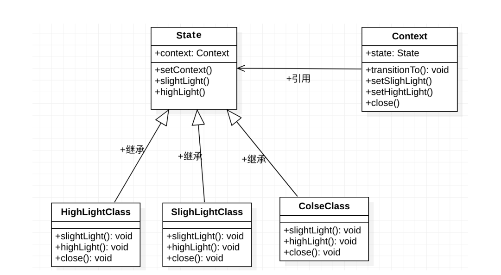

# 一些知识

## 相关概念

### 函数式编程

函数式编程的基本原则：**声明式、纯函数、数据不可变性**

函数式编程是一种编程**范式**，它提供了一种如何编写程序的方法论，主要思想是把运算过程尽可能写成一系列嵌套的函数并进行调用。常见的编程范式有命令式编程、函数式编程、面向对象编程、指令式编程等。

* 命令式编程是告诉计算机具体工作步骤。
* 函数式编程是将程序的描述与求值分离，兲注如何用表达式描述程序逻辑。

纯函数有以下特性：

* 函数返回值仅取决于输入参数。
* 不会改变作用域外的状态。

### 柯里化

柯里化是将多个参数的函数（多元函数）转换为一元函数。每当函数被调用时，它仅仅接收一个参数并且返回带有一个参数的函数，直到所有的参数传递完毕。

‍

### 单线程

JavaScript 是单线程语言，单线程意味着 JavaScript 代码在执行时，只能有一个主线程来处理所  
有的任务。

单线程是有必要的，因为 JavaScript 最初最主要的执行环境是浏览器。JavaScript 面对的是各种各样的操作（如操作 DOM、操作 CSS 等）。如果是多线程执行，则很难在频繁操作的情况下保证一致性。即便保证了一致性，对性能也有较大的影响。

后来为了实现多线程，引入了 Web Worker，但是对该技术的使用却有诸多限制：

* 新线程都受主线程的完全控制，不能独立执行，属于主线程的子线程
* 子线程没有操作 I/O 的权限

尽管 JavaScript 是单线程的，但也是“非阻塞”的。就是由和Even Loop（事件循环）实现的（这里主要讨论浏览器版的实现）。

### Even Loop

当执行脚本时，JavaScript 引擎会解析代码，并将其中同步执行的代码依次加入执行栈中，从头开始执行。如果当前执行的是一个方法，那么 JavaScript 会向执行栈添加这个方法的执行环境，然后进入这个执行环境继续执行其中的代码。在这个执行环境中的代码执行完毕并返回结果后，JavaScript 会退出并销毁这个执行环境，回到上一个方法的执行环境。这个过程反复进行，直到执行栈中的代码全部执行完毕。

对于异步请求，JavaScript 引擎会把这个事件推入事件的另一个队列。实际上， JavaScript 引擎是根据异步事件的类型把对应的异步事件推到对应的宏任务队列或者微任务队列中的。当主线程空闲时，主线程会先查看微任务队列中是否有事件，如果有就取出一条执行，如果没有，就从宏任务队列中取出一条执行。

宏任务：I/O、setTimeout、setInterval 和 requestAnimationFrame。

微任务：Promise.then、catch、finally 和 await（后）。

## 优化策略

### 图片和DOM优化

* 减少图片：对于非图片展示为主的系统，可以自行分析是不是可以去掉无意义的装饰类的图片，是否可以 在不过分使用图片的情冴下让界面更加简洁，交互性更好。
* 结果可以通过 CSS 结果完成
* 使用合适的图片栺式：

  * 图片可分为两大类，位图和矢量图。位图又可以分为有损压缩和无损压缩两种
  * PNG：便携式网络图形，无损压缩的位图栺式，支持索引、灰度、RGB 三种颜色斱案及 Alpha 通道等特性。压缩比高，生成文件的体积较小。
  * JPG/JPEG：有损压缩位图栺式，用较少的磁盘空间即可得到较好的图像品质，但存在一定的失真。
  * WebP：Google 公司推出的一种有损压缩位图格式。这种栺式的主要优势是效率高，在质量相同的情况下，WebP 栺式的图像体积比 JPEG 图像小 40%。WebP 团队还开发了 WebKit 内核补丁，用于在 Google Chrome 浏览器中提供对 WebP 格式的原生支持。除 Chrome 外，支持该格式的浏览器还有 Edge、Firefox 和 Opera。

### js优化

* js文件加载：

  * 在浏览器渲染过程中，当浏览器遇到标签时，浏览器会停止处理页面，让出当前主线程，转去执行 JavaScript 代码，等 JavaScript 代码执行完成后再继续解析和渲染页面。同样的情况也发生在使用 src 属性加载 JavaScript 代码的过程中。浏览器必须先花时间下载外链文件中的代码，然后解析并执行它。在这个过程中，页面渲染和用户交互完全被阻塞了。**所以推荐将所有标签都尽可能放在body标签的底部，以尽量减少下载对页面渲染的影响。**
  * **每个浏览器都有最大连接数，所以尽量减少 JavaScript 文件的加载数量是一个比较常用的办法。** 但是这个斱法的作用是有限的，原因有两个。第一，在大型项目中把 JavaScript 文件合并成一个 bundle 不是很现实；第二，合并后的 bundle 文件如果过大，则仍不能解决浏览器长时间无响应的问题。
  * 使用`async`​、`defer`​属性来实现异步下载js资源，传送门
  * 使用`IntersectionObserver`​ API：提供了一种异步观察目标元素与祖先元素或视窗（viewport）的交集中的变化的方法。（即涂料懒加载）
* js文件缓存

  * 打包的js添加hash，请求js文件走浏览器的缓存策略
  * ​`Service Worker`​：Service Worker是PWA的核心，Service Worker 是由事件驱动的具有生命周期幵且独立于浏览器的主线程。它可以拦截处理页面 的所有网络请求（fetch)，还可以访问缓存和 IndexDB，支持推送，幵且可以让开収者自己控制、管 理缓存的内容及版本，为离线弱网环境下的 Web 运行提供了可能。

    ```ts
    Service Worker 的基本特征如下：
    1.无法操作 DOM。
    2.只能使用 HTTPS 和 localhost。
    3.拦截全站请求。
    4.与主线程独立，不会被阻塞（不用在应用加载时注册 Service Worker）。
    5.完全异步，无法使用 XHR 和 localStorage。
    6.一旦安装，就永远存在，除非卸载或者使用开収者模式手动删除。
    7.独立上下文。
    8.响应推送。
    9.后台同步。
    ```
* 减少回流（重排）、重绘
* 节流防抖

### webpack优化

* 减少文件的匹配范围。在 rules 中配置 exclude，减少 loader 的搜索范围。
* 缓存 babel-loader 的结果。该配置默认将转译的结果缓存到文件系统中。配置 cacheDirectory 选项，至少可以将 babel-loader 的速度提升至原来的两倍。
* 优化模块配置。首先优化模块查找路径，resolve.modules 可用来配置模块库（即 nodemodules） 所在的位置，在文件中引入 import React from 'react' ，默认会仍当前目彔向上寻找，直到根目录的 nodemodules 目录，这是默认的配置。为了加速文件的查找，可以在这里配置 src 的目录。
* 配置 parser。在某些场景下会希望某些文件不被 Babel 转换。比如说 systemjs，这是一个动态模块加载器，可用来加载 ES 模块，我们是不希望这种类型的库被翻译的，因此需要在 Webpack 的配置文件中迚行配置。
* 增加 external 配置。在特定场景下，可以把公共的第三斱库仍生产包的 bundle 中摘出去， 因为这些公共库既可以使用 CDN 网络引入，也可以使用公共文件引入的方式引入。
* 借用 dllPlugin 提高打包速度。通常来说，我们的代码可以简单分为业务代码和第三方库代码。如果不分别处理，则每次构建时都需要把所有的代码重新构建一次，而这会耗费大量的时间。 在大部分情况下，很多第三方库的代码并不会进行大版本更新（除非是版本升级），这时就可以用 dllPlugin、DllPlugin 和 DllReferencePlugin 来提高打包速度，把有较高复用性的第三方库打包到动态链接库中，这样每次构建时只重新打包业务代码即可。
* 使用 ParallelUglifyPlugin 压缩代码。Webpack 默认提供了 UglifyJS 插件来压缩 JavaScript 代码，但它使用的是单线程压缩代码，如果有多个 JavaScript 文件需要被压缩，那么势必会消耗大量 的时间。此时可以使用 ParallelUglifyPlugin 插件，这个插件会开启多个子线程，把对多个文件压缩的工作派分给子线程去做。每个子线程仍是通过 UglifyJS 去压缩代码的，只是变成了并行处理。
* 提取公共代码。业务增加后，代码体积会越来越大，这其中会包含大量重复的代码，此时可以把公共的代码提取成单独的 chunk。chunk 是 Webpack 根据功能拆分出来的。在 Webpack 中， 下面几种情况会被提取成单独的 chunk：

  ```ts
  1.Webpack 中的 entry 配置。
  2.通过 import 觃范动态导入的模块。
  3.通过 splitChunks 拆分出来的代码。
  ```
* 抽取 CSS。将 CSS 提取为独立的插件，对每个包含 CSS 的 JavaScript 文件都创建一个 CSS 文件，支持按需加载 CSS 和 sourceMap。
* 推荐使用 ES module。当使用 ES modules 时，Webpack 可以自动启用 Tree Shaking。Tree Shaking 是指 bundle 转换器会遍历整个依赖树，检查有哪些依赖项，并删除未使用的。
* 图片优化。一般的工程在打包后，图片体积会占到总工程的 60% 左右。图片虽然不会像 JavaScript 那样阻塞页面的渲染，但是也会占用大量的带宽。在 Webpack 配置中，可以借助 url-loader、svg-url-loader 和 image-webpack-loader 进行优化。

### 网络优化

HTTP/2 可以让我们构建出更快、更简单、更健壮的 Web 应用，通过支持请求和响应的多路复用技术来减少延迟，通过压缩 HTTP 首部字段减少协议开销。

HTTP/2 没有改变 HTTP 的语义，也就是说，HTTP 方法、状态码、首部字段等核心概念一如既往。不同的是，HTTP/2 修改了格式化数据的方式，采用二进制分帧层进行数据交换。

HTTP/2 大致分为两部分：

* 二进制分帧层：HTTP/2 多路复用功能的核心。
* HTTP 层：传统的 HTTP 及数据相关的部分。

---

* 二进制分帧  
  在应用层（HTTP/2）和传输层（TCP or UDP）之间增加了一个二进制分帧层，它是提高 HTTP/2 性能的关键  
  基于二进制分帧层的 HTTP/2 可以让帧的使用变得更加便捷。在 HTTP 1.1 基于文本的协议中， 对帧的开始和结束识别起来都相当麻烦。HTTP/2 将传输的信息分割为更小的信息和帧，既便于使用透明的方式进行处理，也更加安全。  
  HTTP/2 上的所有通信都在一个 TCP 连接的基础上完成。
* 首部压缩  
  HTTP 1.1 不支持首部压缩，在 HTTP/2 协议中，采用了专门用作首部压缩的 HPACK 算法。  
  HTTP 每次通信（请求和响应）时都会携带用于描述资源属性的首部信息。而 HTTP 2.0 在客户端和服务器之间使用首部表来跟踪和存储之前収送的键值对。对于相同的数据，不再重新通过每次请求和响应发送。每个新的首部键值对要么被追加到当前表的末尾，要么替换表中之前的值。首部表在 HTTP 2.0 的链接存续期内始终存在，由客户端和服务器共同渐进地更新。 首部表在 HTTP/2 中使用了首部压缩技术，不仅使报头更紧凑，还可以更快速地传输，有利于移动网络环境，减少了每次通信的数据量，使网络拥塞状态得以改善。
* 多路复用  
  在 HTTP 1.1 中，客户端在同一时间，针对同一域名下的请求有一定数量的限制。超过限制数量的请求会被阻塞。而 HTTP 2.0 中的多路复用优化了这一性能。 基于二进制分帧层，HTTP 2.0 可以在共享 TCP 链接的基础上同时发送请求和响应。HTTP 消息被分解为独立的帧，从而可以在不破坏消息本身语义的基础上，交错发出去，在另一端根据流标识符和首部将它们重新组装起来。

  ```ts
  多路复用的优点：
  1.可以并行交错地发送请求和响应，这些请求和响应之间互不影响。
  2.只使用一个链接即可并行发送多个请求和响应。
  3.消除不必要的延迟，从而减少页面加载时间。
  4.不必再为绕过 HTTP 1.x 限制而多做很多工作
  ```
* 请求优先级  
  每个流都包含一个优先级，以便告诉对端哪个流更重要。当资源有限时，服务器会根据优先级选择发送哪些流。同理，客户端还可以告诉服务器当前的流依赖哪些流。该功能可以让客户端建立一个优先级树，所有依赖其他流的流都要等到被依赖的流完成后才会执行。
* 服务器推送  
  在 HTTP/2 中，服务器又被称为缓存推送，它的主要思想是：当客户端请求 A 资源时，服务器知道它很可能也需要 B 资源，因此服务器在収送 A 资源之前，主动把 B 资源也推送给客户端。

## 设计模式

### 装饰器模式

装饰者模式能够在不改变对象自身的前提下，在**运行期间**给对象增加额外的功能。提到增强对象，我们的第一印象是使用继承这个类，但是继承有如下两个问题：

* 继承是静态的，无法在运行时更改已有对象的行为。
* 在某些编译型语言中（如 Java）是不允许同时继承多个类的。

装饰者和被装饰者相互对立，不是相互耦合。装饰者模式是继承的替代品，可以动态扩展一个实现类。

### 代理模式

代理模式是一种结构性模式，作用是提供一个中间对象，为其他对象提供控制这个对象的能力。

代理模式在现实生活中有很多的示例，比如，信用卡是银行账号的代理，银行账号是现金的代理，它们都有相同的功能（接口），即付款。使用信用卡付款可以让用户和商户都比较满意，因为他们都不用随身携带大量的现金，无须担心出现现金丢失的情况，可以减少很多的麻烦。

代理模式的缺点是代码有可能变得臃肿，因为每增加一种代理，就要增加一部分代码。另外， 由于是通过中间代理访问目标对象的，因此有部分的延迟。

### 观察者模式

观察者模式又叫作发布—订阅（Pub/Sub）模式或消息机制。它可以帮助对象知晓现状，以便对象及时响应订阅的事件，可以看成是一种一对多的关系。当订阅对象的状态发生改变时，所有依赖它的对象都应得到通知。

观察者模式是松耦合设计的关键。观察者模式定义了主题和订阅者之间的松耦合关系，幵且可以让两者进行交互，而不用太关注对方的细节，即“keep it simple”。观察者模式的缺点是，如果过多地使用发布—订阅模式，会增加维护的难度。

### 适配模式

适配器模式是一种结构型模式，该模式的作用是解决两个接口不兼容的问题。将一种接口转换成客户期望的另一种接口，即可实现相互通信的目的。

比如，国外的电源插头的体积比国内的电源插头的体积要大一些，如果国外买了一台 `MacBook Pro`​，则电源插头是无法直接插到国内家里的插座上的。为了 一个电源插头而改造家中已经装修好的插座显然不太合适，此时就需要一个适配器。

适配器模式的工作方式如下：

* 适配器要实现一个与目标对象兼容的接口。
* 目标对象可以使用该方法安全地调用适配器接口。
* 在调用适配器的方法后，会将另一个对象的兼容格式传给目标对象。

适配器的优点：

* 它将接口或者数据转换代码分离了出来，使代码看起来非常清晰。
* 它遵循“开闭原则”，能在不修改现有客户端代码的情况下在程序中添加新类型的适配器。

适配器模式使整体复杂度增加，这是因为每增加一种需要适配的类型，就需要增加相应的接口和实现类。

### 策略模式

策略模式是一种行为模式，它允许定义一系列算法，并把各个算法分别放入独立的类中，在运行时可以相互替换。它的主要作用是当多个算法较为相似时，可以减少对 `if-else`​ 的使用。

策略模式的程序至少由两部分组成。第一部分是一组策略类，里面封装了具体的算法，并负责算法的完整实现。第二部分是上下文（即 Context），上下文可接收客户端的请求，随后被分发到某个策略类。

策略模式借助了组合等思想，可以有效地避免许多不必要的复制、粘贴。另外，它还支持“开闭原则”，可以把算法封装在具体的策略实现中，易实现、易扩展。

状态模式和策略模式有一定的微妙关系，状态可以被视为策略的扩展，两者都基于组合机制，它们都通过将部分工作委派给其他类来改变其在不同场景下的行为。在策略模式下，对象之间完全独立；而状态模式没有限制具体状态之间的依赖，且允许它们自行改变在不同场景下的状态。

### 状态模式

**它指当一个对象的内部状态发生改变时，会产生不同的行为。 程序在任意时刻都处于任意一种状态中。**

状态模式封装了转换规则，并枚举了所有可能的状态。

状态模式对“开闭原则”的支持并不太好，准确地说是代码的侵入性较高。

在状态模式中有两个角色，分别是 `Context `​和 `State`​。

​`Context `​中既保存了 `Client `​端的操作接口， 也保存了状态的实现，代表着当前状态。

抽象类 `State `​声明了子状态应实现的各个方法。

​​

## 模块化规范

### ConmmonJS

​`CommonJS`​是由JavaScript社区于2009年提出的包含模块、文件、 IO、控制台在内的一系列标准。在`Node.js`​的实现中采用了`CommonJS`​标准的一部分，并在其基础上进行了一些调整。我们所说的`CommonJS`​模块和`Node.js`​中的实现并不完全一样，现在一般谈到`CommonJS`​其实是`Node.js`​中的版本，而非它的原始定义。

​`CommonJS`​中规定每个文件是一个模块。将一个`JavaScript`​文件直 接通过`script`​标签插入页面中与封装成`CommonJS`​模块最大的不同在于，前者的顶层作用域是全局作用域，在进行变量及函数声明时会污染全局环境；而后者会形成一个属于模块自身的作用域，所有的变量 及函数只有自己能访问，对外是不可见的。

​`CommonJS`​是同步导入，第一次导入时候会同步执行一次代码，并记录模块已经被加载过了。

它的本身是一个全局函数（node.js环境中），同时被导出的内容是一个浅拷贝

```ts
 // 引入 
const doSomething = require('./doSomething.js'); 
// 导出
module.exports = function doSomething(n) { 
// 或者
exports .xxx = xxx
```

​`exports `​和 `module.exports`​ 的光系如下： 

* ​`module.exports`​ 的初始值为一个空对象。
* ​`exports `​是指向 `module.exports `​的引用。
* ​`require `​方法返回的是 `module.exports`​。

‍

### ES6 Module

​`ES6 Module`​也是将每个文件作为一个模块，每个模块拥有自身的 作用域，不同的是导入、导出语句。`import`​和`export`​也作为保留关键 字在ES6版本中加入了进来（`CommonJS`​中的`module`​并不属于关键字）。

ES6 Module会自动采用严格模式。

​`ES6 Module`​对模块的处理是静态的：**模块依赖关系的建立发生在代码编译阶段**。

对于导出值，是一种动态映射的关系。

```ts
//直接使用标签
<script type="module"> 
    import {func1} from 'my-lib'; 
    func1(); 
</script>

// 引入
import {foo, bar} from './myLib'; 
// 导出
export default function() { 
    // your Function 
}; 
export const function1() {...}; 
export const function2() {...}
```

### CMD

CMD（Common Module Definition，通用模块定义）

和 AMD 的不同之处在于：AMD 推崇依赖前置，提前执行。CMD 是就近依赖， 延迟执行。

### AMD

​`AMD`​是英文`Asynchronous Module Definition`​（异步模块定义）的 缩写，它是由`JavaScript`​社区提出的专注于支持浏览器端模块化的标准。从名字就可以看出它与`CommonJS`​和`ES6 Module`​最大的区别在于它 加载模块的方式是异步的 。

AMD 推崇依赖前置，提前执行

```ts
//导出定义
define('getSum', ['calculator'], function(math) {
  return function(a, b) {
  console.log('sum: ' + calculator.add(a, b));
  }
});

//导入  require的第1个参数指定了加载的模块，第2个参数是当加载完成后执行的回调函数。
require(['getSum'], function(getSum) {
  getSum(2, 3);
});
```

在`AMD`​中使用`define`​函数来定义模块，它可以接受3个参数。

* 第1个参数是当前模块的id，相当于模块名
* 第2个参数是当前模块的依赖， 比如上面我们定义的getSum模块需要引入calculator模块作为依赖
* 第3个参数用来描述模块的导出值，可以是函数或对象。如果是函数则导出的是函数的返回值；如果是对象则直接导出对象本身。

通过`AMD`​这种形式定义模块的好处在于其模块加载是非阻塞性的， 当执行到`require`​函数时并不会停下来去执行被加载的模块，而是继续 执行require后面的代码，这使得模块加载操作并不会阻塞浏览器。 尽管AMD的设计理念很好，但与同步加载的模块标准相比其语法要 更加冗长。另外其异步加载的方式并不如同步显得清晰，并且容易造 成回调地狱

### UMD

​`UMD`​的全称是`Universal Module Definition`​，也就是通用模块标准，它的目标是使一个模块能运行在各种环境下，不论 是`CommonJS`​、`AMD`​，还是非模块化的环境（当时ES6 Module还未被提出）

```ts
// calculator.js
(function (global, main) {
  // 根据当前环境采取不同的导出方式
  if (typeof define === 'function' && define.amd) {
    // AMD
    define(...);
  } else if (typeof exports === 'object') {
    // CommonJS
    module.exports = ...;
  } else {
    // 非模块化环境
    global.add = ...;
  }
}(this, function () {
  // 定义模块主体
  return {...}
}));
```

UMD其实就是根据当前全局对象中的值判断目前处于哪种模块环境。当前环境是AMD，就以AMD的形式导出；当前环境是 CommonJS，就以CommonJS的形式导出。

需要注意的问题是，UMD模块一般都最先判断AMD环境，也就是全局下是否有define函数，而通过AMD定义的模块是无法使用CommonJS或 ES6 Module的形式正确引入的。在Webpack中，由于它同时支持AMD及 CommonJS，也许工程中的所有模块都是CommonJS，而UMD标准却发现当 前有AMD环境，并使用了AMD方式导出，这会使得模块导入时出错。当 需要这样做时，我们可以更改UMD模块中判断的顺序，使其以CommonJS 的形式导出即可

# [Webpack](https://www.webpackjs.com/)

## 基本设置

### webpack.config.js

​`webpack.config.js`​是`Webpack`​的配置文件，在项目根目录里。**vue中是vue.config.js**

```js
const path = require('path')// 导入node.js的path模块
const HtmlWebpackPlugin = require('html-webpack-plugin')//导入插件
//webpack配置
module.exports = {
  devtool: 'source-map',// 是否开启source map，生成独立的map文件，开发使用，上线删除
  mode: 'development',// 打包模式 development 开发 / production 生产
  entry: path.resolve(__dirname, 'src', 'index.js'),//设置打包入口文件，path模块用在这里
  // 开发服务器
  devServer: {//npm run serve 实时打包，打包文件在内存中，需要安装插件
    port: 9000, // 实时打包所用的端口号
    open: true, // 初次打包完成后，自动打开浏览器
    static: path.join(__dirname, './dist'),// 服务器的根目录
    hot: false,//是否开启热替换
  },
  // 打包到哪里
  output: {
    path: path.resolve(__dirname, 'dist'),// 使用绝对路径
    filename: 'bundle.js',// 打包出来的文件名
    clean: true,// 每次打包时清除上一次的dist目录
    assetModuleFilename: 'images/[hash][ext][query]',
  },
  // 模块配置，默认只能打包js，安装插件，可以打包css，less等其他格式文件
  module: {
    // 解析规则
    rules: [
      {
        test: /\.css$/i, // .css结尾的文件
        use: ['style-loader', 'css-loader'], // 通过 这2个 loader进行解析
      },
      {
        test: /\.less$/i, // .less结尾的文件
        use: [
          // 使用如下的loader进行解析
          'style-loader',
          'css-loader',
          'less-loader',
        ],
      },
      {
        test: /\.(png|svg|jpg|jpeg|gif)$/i, // 图片资源
        type: 'asset/resource', // 生成一个单独的文件，并设置url
      },
    ],
  },
  // 插件配置，wbepack默认只打包js，HtmlWebpackPlugin可以生成index.html文件并把js放进去
  plugins: [
    new HtmlWebpackPlugin({
      inject: 'body',// js插入的位置
      filename: 'index.html',// 打包之后的文件名
      template: path.resolve(__dirname, './public/index.html'),// 使用哪个文件作为模板
    }),
  ],
}
```

### package.json

[package.json](https://juejin.cn/post/6870426598605062152)：可以设置打包所使用的插件和插件设置(`scripts`​中设置)，以及选择打包环境

```js
{
  "name": "test-project", // 名称，通常是github仓库名称
  "author": "xxx", // 作者的信息
  "contributors": ["xxx", "xxxx"], // 贡献者信息数组
  "bugs": "https://github.com/nodejscn/node-api-cn/issues", // bug信息，通常是github的issue页面
  "homepage": "http://nodejs.cn", // 发布项目时，项目的主页
  "version": "1.0.0", // 当前版本, 遵循semver语义版本控制规范，具体含义将在后面详细解释
  "license": "MIT", // 许可证信息
  "keywords": ["xxx", "xxxx"], // 关键字数组
  "description": "A Vue.js project", // 描述信息
  "repository": "git://github.com/xxxx.git", // 仓库地址
  "main": "src/main.js", // 当引用这个包时，应用程序会在该位置搜索模块的导出
  "private": true,  // 防止包意外的发布到npm上，如果是true，npm将拒绝发布
  "scripts": {
    "dev": "webpack --config webpack.config.js",//配置开发模式打包
    "watch": "webpack watch --config webpack.config.js",//配置watch模式
    "build": "webpack  --config webpack.config.js --mode production",//配置生产模式打包
    "serve": "webpack serve --config webpack.config.js"//配置虚拟服务器

  }, // 可运行的node脚本，通常命令是npm run serve
  "dependencies": {
    "core-js": "^3.6.5",
    "vue": "^3.0.0-0",
    "vue-router": "^4.0.0-0",
    "vuex": "^4.0.0-0"
  }, // 生产环境所依赖的安装包
  "devDependencies": {
    "@vue/cli-plugin-babel": "~4.5.0",
    ...
  } // 开发环境所依赖的安装包
  "engines": {
    "node": ">= 6.0.0",
    "npm": ">= 3.0.0"
  }, // 要运行的 Node.js 或其他命令的版本，但似乎没卵用，可参考https://github.com/nodejs/node/issues/29249
  "browserslist": ["> 1%", "last 2 versions", "not ie <= 8"]  //支持的浏览器及其版本号，polyfill时会用到
}

```

## 设置说明

### 模式设置

* 概念

  ```js
  开发环境development:不会对打包生成的文件进行代码压缩和性能优化，打包速度快
  生产环境production:默认设置，会对打包生成的文件进行代码压缩和性能优化，打包速度很慢
  ```
* 设置开发或生产模式：设置`/webpack.config.js`​，增加设置`mode`​

  ```js
  // 导入path模块
  const path = require('path')

  module.exports = {
    mode: 'development',// 打包模式 development 开发 / production 生产

    // 打包的入口文件
    entry: path.resolve(__dirname, 'src', 'index.js'),
    // 打包到哪里
    output: {
      // 使用绝对路径
      path: path.resolve(__dirname, 'dist'),
      // 打包出来的文件名
      filename: 'bundle.js',
    },
  }
  ```
* 设置打包命令：`package.json`​ 中增加打包命令

  ```js
  "scripts": {
    "dev": "webpack --config webpack.config.js",//配置开发模式打包
    "watch": "webpack watch --config webpack.config.js",//配置watch模式
    "build": "webpack  --config webpack.config.js --mode production",//配置生产模式打包
    "serve": "webpack serve --config webpack.config.js"//配置虚拟服务器

  },
  ```
* 打包命令：看你怎么设置得

  ```js
  npm run dev//开发环境打包
  npm run build//生产环境打包
  ```

### 清理设置

清理dist目录：`output.clean`​默认不开启，那么上一次打包生成的dist文件不会删除，这次打包的文件还是在上一次的dist中，导致可能原先的文件存在导致后面看代码文件造成混乱。

开启后会把文件出口文件删除后在继续打包，重新改出口名，原文件不在新出口，是不会删除的。

* ​`/webpack.config.js`​中设置**增加清理** `dist`​ 目录的配置

  ```js
  module.exports = {
    ...
    output: {
      // 使用绝对路径
      path: path.resolve(__dirname, 'dist'),
      // 打包出来的文件名
      filename: 'bundle.js',
      // 每次打包时清除dist目录
      clean: true,
    },
    ...
  }
  ```

### 热替换设置

​`HMR`​：修改了代码并保存时，`HMR`​ 会在应用程序运行过程中替换、添加或删除模块，而**无需重新加载整个页面（入口代码修改还是会刷新）** 。

开启了 `dev-server`​ 之后，会**默认开启**​`HMR(hot module replacement)`​。

* ​`HMR`​ 主要通过以下几种方式，来显著加快开发速度：

  * **保留在完全重新加载页面时丢失的应用程序状态；**
  * **只更新变更内容，以节省宝贵的开发时间；**
  * **调整样式更加快速 - 几乎相当于在浏览器调试器中更改样式。**

在`webpack.config.js`​中进行设置

```js
module.exports = {
  // 开发服务器
  devServer: {
    port: 9000, // 实时打包所用的端口号
    open: true, // 初次打包完成后，自动打开浏览器
    // 服务器的根目录
    static: path.join(__dirname, './dist'),
    hot: true,// 模块热替换 true / false 开启 / 关闭
  },
}
```

### 映射设置

就是一个信息文件，里面储存着位置信息。存储着压缩混淆后的代码，所对应的**转换前**的位置。

设置开启，会在项目打包后会生成`.map`​文件，出错的时候，除错工具将直接显示原始代码，而不是转换后的代码，能够极大的方便后期的调试。

注意:开发阶段辅助调错，**上线一定要移除，避免源码泄露**。

在`webpack.config.js`​中进行设置

```js
//开发中需要排错，需要准确的定位错误行号
module.exports = {
  // source-map 仅限在开发模式中使用
  devtool: 'source-map',//（生产环境，我们不希望别人看到我们的源码，注释该配置即可）
}
```

### watch设置

开启 `watch`​ 模式启动自动化打包：检测打包入口，以及打包入口引用的文件是否发生变动，如果发生变动，就重新打包。

​`watch`​ 是内置的，不需要下载，文件发生变动后，文件自动打包，但是网页需要自己刷新。

调整 `package.json`​ 中的 `scripts`​ 开启`watch`​ 模式，然后启动命令：`npm run watch`​

```js
"scripts": {
  "dev": "webpack --config webpack.config.js",
  "watch": "webpack watch --config webpack.config.js",
}
```

## 相关插件

### html-webpack-plugin

​`Webpack`​默认只打包`js`​，这个插件可以打包时会自动生成`index.html`​页面到`dist`​文件夹中，自动把打包生成的`js`​文件插入到页面中。

* 下载插件

  ```js
  npm i--save-dev html-webpack-plugin //下载插件
  ```
* 设置设置模块页面

  ```js
  <!DOCTYPE html>
  <html lang="en">
    <head>
      <meta charset="UTF-8" />
      <meta http-equiv="X-UA-Compatible" content="IE=edge" />
      <meta name="viewport" content="width=device-width, initial-scale=1.0" />
      <title>测试用模板</title>
    </head>
    <body>
      <div class="box"></div>
    </body>
  </html>

  ```
* **调整** `/webpack.config.js`​，**增加插件实例化的配置**

  ```js
  module.exports = {
    ...
    plugins: [
      new HtmlWebpackPlugin({//实例化
        inject: 'body',// js插入的位置
        filename: 'index.html',// 打包之后的文件名
        template: path.resolve(__dirname, './public/index.html'),//设置页面样本地址
      }),
    ],
  }
  ```

### loader

​`loader`​ 是文件加载器，能够加载资源文件，并对这些文件进行特定的处理，然后打包在指定文件中，**简单来说就是将** `webpack`​ 传入的字符串做出特定的处理修改。

​`webpack`​ 默认只能解析 `js`​ 模块，如果是其他的文件需要安装对应的 `loader`​。

​​

1. 下载所需的loader,第三方模块

    ```js
    npm i --save-dev style-loader css-loader//css
    npm i less less-loader --save-dev//less
    ```
2. 调整 `webpack.config.js`​ 的配置

    ```js
    module.exports = {
      ...
      // 模块配置
      module: {
        // 解析规则
        rules: [
          {
            test: /\.css$/i, // .css结尾的文件
            use: ['style-loader', 'css-loader'], // 通过 这2个 loader进行解析
          },
          {
            test: /\.less$/i, // .less结尾的文件
            use: [
              // 使用如下的loader进行解析
              'style-loader',
              'css-loader',
              'less-loader',
            ],
          },
        ],
      },
    }
    ```
3. 在打包的`index.js`​中导入所要使用的`css`​、`less`​文件

    ```js
    // 导入css 
    // import './assets/base.css'
    // 导入less
    import './assets/less/index.less'
    ```
4. 运行打包

    ```bash
    npm run dev
    ```

### webpack-dev-server

​`webpack-dev-server`​ 的本质是开启了一个测试用服务器，`dev-server`​，开启一个服务器，并自动监测文件变更，刷新页面。

凡是修改了`webpack.config.js `​配置文件，或修改了` package.json `​配置文件，必须重启实时打包的服务器，否则最新的配置文件无法生效。

1. 下载`webpack-dev-server`​：

    ```bash
    npm i --save-dev webpack-dev-server
    ```
2. 修改 `/webpack.config.js`​，**增加** `devServer`​ 的配置

    ```js
    module.exports = {
      ...
      // 开发服务器
      devServer: {
        port: 9000, // 实时打包所用的端口号
        open: true, // 初次打包完成后，自动打开浏览器
        // 服务器的根目录
        static: path.join(__dirname, './dist'),//即文件打包后放的位置
      },
      ....
    }
    ```
3. 设置 `package.json`​，增加一条命令

    ```js
    "scripts": {
      "dev": "webpack --config webpack.config.js",//设置打包模式
      "watch": "webpack watch --config webpack.config.js",//开启watch模式
      "serve": "webpack serve --config webpack.config.js"//开启虚拟服务器
    },
    ```
4. 执行命令，运行项目

    ```bash
    npm run serve
    ```
5. 注意点

    1. 配置了 webpack-dev-server 之后，打包生成的文件存放到了内存中

        1. 不再根据 output 节点指定的路径，存放到实际的物理磁盘上
        2. 提高了实时打包输出的性能，因为内存比物理磁盘速度快很多
        3. **看不到** `dist`​ 目录
    2. ​`http://localhost:9000/`​

        1. 访问的是 `devServer`​ 配置中 `static`​ 的根目录
        2. ​`/index.html`​ 可以省略不写

‍

# 包管理工具

​`node.js`​安装完成之后，自带有`npm`​了，可以使用`npm`​下载使用依赖包。

## 相关概念

### npm脚本

​`npm `​允许在`package.json`​文件里面，使用`scripts`​字段定义脚本命令。

​`package.json`​ 里面的`scripts`​ 字段是一个对象。它的每一个属性，对应一段脚本。定义在`package.json`​里面的脚本，就称为 `npm`​ 脚本。

* 基本使用：`npm run`​ 脚本名称

  ```js
  1.如果是并行执行（即同时的平行执行），可以使用&符号。 
  npm run script1.js & npm run script2.js
  2.如果是继发执行（即只有前一个任务成功，才执行下一个任务），可以使用&&符号。
  npm run script1.js && npm run script2.js
  ```
* 简写

  ```js
  npm start       即 npm run start
  npm stop        即 npm run stop
  npm test        即 npm run test
  npm restart     即 npm run stop && npm run restart && npm run start
  ```

### 加载机制

1. ​`require('第三方包名')`​优先在加载该包的模块的同级目录`node_modules`​中查找第三方包。
2. 找到该第三方包中的`package.json`​文件，并且找到里面的`main`​属性对应的入口模块，该入口模块即为加载的第三方模块。
3. 如果在要加载的第三方包中没有找到`package.json`​文件或者是`package.json`​文件中没有`main`​属性，则默认加载第三方包中的`index.js`​文件。
4. 如果在加载第三方模块的文件的同级目录没有找到`node_modules`​文件夹，或者以上所有情况都没有找到，则会向上一级父级目录下查找`node_modules`​文件夹，查找规则如上一致。
5. 如果一直找到该模块的磁盘根路径都没有找到，则会报错：`can not find module xxx`​。

比如说：requiere(`fs`​);

那加载的肯定是系统的包。所以，我们尽量不要创建一些和现有的包重名的包。

### 包安装版本

```js
"dependencies": {    "md5": "^2.1.0"  }  ^ 表示 如果 直接npm install 将会 安md5@2.*.*  	最新版本

"dependencies": {    "md5": "~2.1.0"  }  ~ 表示 如果 直接npm install 将会 安装md5 2.1.*  最新版本

"dependencies": {    "md5": "*"  }  * 表示 如果 直接npm install 将会 安装 md5  最新版本
```

### 环境依赖

设置选项来区分**依赖的类型**

```js
1.生产依赖：S 等效于 --save，-S 是默认选项 包信息保存在 package.json 中 dependencies属性
npm i -S uniq 
npm i --save uniq

2.开发依赖：-D 等效于 --save-dev 包信息保存在 package.json 中devDependencies属性
npm i -D less 
npm i --save-dev less

3.npm i -g nodemon //全局安装，安装在c盘，后续可以使用全局命令
```

### 命名别名

配置 package.json 中的 `scripts`​ 属性：设置好后可以使用` npm run  xxx`​ 执行命令

​`npm start`​ ：比较特别，使用时可以省略 `run`​

​`npm run`​ 有自动向上级目录查找的特性，跟 `require`​ 函数也一样

```js
{
  "scripts": {
    "server": "node server.js",
    "start": "node index.js",
  },
}
```

### `.gitignore`​

设置无需提交的文件目录

```js
# dependencies
node_modules //node_modules文件夹不提交代码

# testing
/coverage
```

### npm发包

* 创建发包

  ```js
  1. 创建文件夹，并创建文件 index.js， 在文件中声明函数，使用 module.exports 暴露
  2. npm 初始化工具包，package.json 填写包的信息 (包的名字是唯一的)
  3. 注册账号 https://www.npmjs.com/signup
  4. 激活账号 （ <span style="color:red">一定要激活账号</span> ）
  5. 修改为官方的官方镜像 (命令行中运行 `nrm use npm` )
  6. 命令行下 npm login 填写相关用户信息
  7. 命令行下 npm publish 提交包 
  ```
* 更新

  ```js
  1. 更新包中的代码
  2. 测试代码是否可用
  3. 修改 package.json 中的版本号
  4. 发布更新
  5. npm publish
  ```
* 删除包

  ```js
  npm unpublish --force
  删除包需要满足一定的条件， https://docs.npmjs.com/policies/unpublish
  - 你是包的作者
  - 发布小于 24 小时
  - 大于 24 小时后，没有其他包依赖，并且每周小于 300 下载量，并且只有一个维护者
  ```

## npm

1. 初始化命令：初始化之后，会在项目目录中生成 `package.json`​ 的文件。

    ```js
    npm init -y
    npm init
    ```
2. 切换镜像地址：下载速度可以快一点

    ```js
    下面的命令只需要执行一次即可（不管以后重启vscode还是重启电脑，都不需要执行第二次）
    npm config set registry https://registry.npmmirror.com
    ```
3. 安装第三方包

    ```js
    npm install 模块名 //正常的下载安装
    npm i 模块名 //简写
    npm i 模块名@版本号 //可以通过@版本号,不设置默认是最新
    npm install xxx -g  //把模块安装在全局环境中
    ```
4. 卸载第三方

    ```js
    npm uninstall 模块名
    npm un 模块名
    npm un 模块名 模块名 模块名
    ```

## [cnpm](https://npmmirror.com/)

安装`cnpm`​替换 `npm`​（`npm `​由于源服务器在国外，下载包的速度较慢，`cnpm `​会使用国内镜像）：

```js
npm install -g cnpm --registry=https://registry.npmmirror.com
# 安装 vue 这个包
cnpm install vue
```

## yarn

​`npm`​是官方的管理工具，`yarn`​是由 `Facebook`​ 在 2016 年推出的新的 `Javascript`​ 包管理工具

和`npm`​相比有**缓存机制**，可以直接取缓存没必要重新下载，速度比`npm`​快一些。

​`npm`​ 的锁文件为 `package-lock.json`​

​`yarn`​的锁文件为 `yarn.lock`​

基本命令

```js
1.安装yarn
npm i yarn -g    // 全局安装使用yarn

2.初始化
yarn init  //  yarn init -y

3.安装插件
npm:   npm i 插件名
yarn:  yarn add 插件名
       yarn global add 插件名//全局安装

4.安装所有依赖
npm:   npm i
yarn:  yarn

5.删除插件
npm:   npm uninstall  插件名
yarn:  yarn remove 插件名
       yarn global remove 插件名//全局卸载

6.运行项目
npm:   npm run serve
yarn:  yarn serve

7.设置淘宝镜像
npm:   npm config set registry http://registry.npm.taobao.org/
yarn:  yarn config set registry http://registry.npm.taobao.org/

8.npm换成yarn：删掉node_module,package-lock.json然后安装使用yarn
```

## pnpm

* 概念：`pnpm`​是 `Node.js`​ 的替代包管理器。它是 `npm `​的直接替代品，但速度更快、效率更高。

  ```js
  为什么效率更高？
  当您安装软件包时，我们会将其保存在您机器上的全局存储中，然后我们会从中创建一个硬链接，而不是进行复制。
  对于模块的每个版本，磁盘上只保留一个副本。
  例如，当使用 npm 或 yarn 时，如果您有 100 个使用 lodash 的包，则磁盘上将有 100 个 lodash 副本。
  pnpm 可让您节省数 GB 的磁盘空间！
  ```
* ​`pnpm `​拥有 `Yarn`​ 超过 `npm`​ 的所有附加功能：

  ```js
  安全: 
  与 yarn 一样，pnpm 有一个包含所有已安装包校验和的特殊文件，用于在执行代码之前验证每个已安装包的完整性。

  离线模式: 
  pnpm 将所有下载的包 tarball 保存在本地注册表镜像中。当包在本地可用时，它从不发出请求。
  使用该--offline参数可以完全禁止 HTTP 请求。

  速度: 
  pnpm 不仅比 npm 快，而且比 yarn 快。
  无论是冷缓存还是热缓存，它都比 yarn 快。
  yarn 从缓存中复制文件，而 pnpm 只是从全局存储中链接它们。
  ```
* 基本使用

  ```js
  //全局安装
  npm install pnpm -g
  //查看源
  pnpm config get registry 
  //切换淘宝源
  pnpm config set registry https://registry.npmmirror.com/

  //可以和npm一样使用方式
  pnpm init //直接初始化
  pnpm install 包  
  pnpm i 包
  pnpm add 包// -S  默认写入dependencies
  pnpm add -D// -D devDependencies
  pnpm add -g// 全局安装
  pnpm remove(uninstall) 包//移除包
  pnpm remove 包 --global//移除全局包
  pnpm up//更新所有依赖项
  pnpm upgrade 包//更新包
  pnpm upgrade 包 --global//更新全局包
  pnpm up --latest //最新更新所有依赖项，忽略package.json中指定的范围
  ```

## nrm

全称是`npm registry manager`​，是一个 `npm`​的镜像源管理工具，用来**切换和管理** `npm`​包的镜像源

* 基本使用

  ```js
  npm i -g nrm //全局安装
  nrm use taobao  //修改镜像
  npm config list  //检查是否配置成功（选做）
  ```
* 查看源

  ```js
  nrm ls

  npm -------- https://registry.npmjs.org/
  yarn ------- https://registry.yarnpkg.com/
  cnpm ------- http://r.cnpmjs.org/
  taobao ----- https://registry.npm.taobao.org/
  nj --------- https://registry.nodejitsu.com/
  npmMirror -- https://skimdb.npmjs.com/registry/
  edunpm ----- http://registry.enpmjs.org/
  qunhe ------ http://npm-registry.qunhequnhe.com/


  ```
* 切换镜像

  ```js
  nrm use 镜像别名
  // 切换至 taobao 的镜像源
  nrm use taobao
  // 切换至 cnpm 的镜像源
  nrm use cnpm
  ```
* 添加镜像

  ```js
  reigstry 为源名，url 为源的路径
  nrm add registry http://npm-registry.qunhequnhe.com/
  ```
* 删除镜像

  ```js
  // 其中 reigstry 为源名
  nrm del <registry>
  ```
* 测试镜像响应时间

  ```js
  nrm test npm
  ```

‍

## [nvm](https://github.com/coreybutler/nvm-windows/releases%20)

​`nvm `​全称 `Node Version Manager`​ 顾名思义它是用来管理 `node `​版本的工具，方便切换不同版本的`Node.js`​

```js
nvm list available  //显示所有可以下载的 Node.js 版本
nvm list //显示已安装的版本
nvm install 18.12.1  //安装 18.12.1 版本的 Node.js
nvm install latest  //安装最新版的 Node.js
nvm uninstall 18.12.1  //删除某个版本的 Node.js
nvm use 18.12.1  //切换 18.12.1 的 Node.js
```

# Git

[Git](https://git-scm.com/)是一款免费、开源的**分布式**版本控制系统 ，用于敏捷高效地处理任何或小或大的项目。

### [基本操作](https://juejin.cn/post/6844904191203213326#heading-0)

* 设置用户名：安装好后第一步

  ```js
  git config  user.name  //查看用户名
  git config  user.email  //查看邮箱

  git config  user.name 用户名  //设置用户名
  git config  user.email 邮箱名  //设置邮箱

  git config  --global user.name xxxx  //设置全局用户名
  git config  --global user.email xxxx  //设置全局邮箱

  git config --list  //查看配置信息

  git config --unset --global user.name //删除全局配置
  git config --unset --global user.email  //删除全局配置
  ```
* 初始化仓库：要管理得文件夹里面初始化

  ```js
  git init  //初始化仓库
  git init -y//就不用一直点yes了
  ```
* 查看是否保存

  ```js
  git status //用来查看文件的状态,红色表示工作区中的文件需要提交,绿色表示暂存区中的文件需要提交
  git status -s //简化日志输出格式
  ```
* 保存仓库：先add后commit

  ```js
  git add index.html  //将index.html添加到暂存区
  git add css  //将css目录下所有的文件添加到暂存区
  git add *.js  //将当前目录下所有的js文件添加到暂存区

  //添加当前目录下所有的文件
  git add .
  git add -A
  git add --all


  git commit -m"提交说明"  //将文件从暂存区提交到仓库
  git commit -am "本次提交说明"  //add和commit的合并，便捷写法
  git commit --amend -m"提交说明"  //修改最近的一次提交说明， 如果提交说明不小心输错了，可以使用这个命令
  ```
* 查看版本号

  ```js
  git log//查看提交的日志
  git log --oneline  //只能看到现在版本之前的信息（若之前回退过，那回退版本之后的是看不到的）
  git reflog --oneline  //可以看到所有保存的版本信息
  ```
* 版本回退

  ```js
  git reset --hard 版本号  //将代码回退到某个指定的版本(版本号只要有前几位即可)

  git reset --hard head~0  //将版本回退到当前提交
  git reset --hard head~1  //将版本回退到上一次提交
  git reset --hard head~2  //将版本回退到上上次提交
  ```
* 配置忽视文件：在仓库的根目录创建一个`.gitignore`​的文件，文件名是固定的(txt改后缀)。

  ```js
  # 忽视idea.txt文件
  idea.txt

  # 忽视css下的index.js文件
  css/index.js

  # 忽视css下的所有的js文件
  css/*.js

  # 忽视css文件夹
  css

  # 忽视node_modules文件夹
  node_modules/
  ```

### 分支操作

* 查看分支：在`git`​中，有一个特殊指针`HEAD`​,永远会指向当前分支

  ```js
  git branch //查看本地分支
  git branch -r  //查看远程分支
  git branch -a  //查看所有分支，包括远程分支
  ```
* 创建分支

  ```js
  git branch 分支名称  //创建分支，分支中的代码，在创建时与当前分支的内容完全相同
  ```
* 切换分支：分支操作，最好是先`add commit`​

  ```js
  工作区、暂存区对所有分支而言，都是公共的，在切换分支时，工作区、暂存区的内容都会被带过去，所有要先保存
  git checkout 分支名称  //切换到目标分支
  git checkout -b 分支名  //创建并切换分支
  git checkout -b dev  //创建并切换分支
  ```
* 删除分支：不能在当前分支删除当前分支，需要切换到其他分支才能删除

  ```js
  git branch -d 分支名  //删除分支,如果该分支有提交未进行合并，则会删除失败
  git branch -D 分支名  //强制删除，就算没有进行合并操作也可以删除
  git branch -d dev  //创建并切换到dev分支
  ```
* 合并分支：要先切换到要合并得分支

  ```js
  git merge 分支名  //把其他分支内容合并到当前分支
  ```
* 取消合并

  ```js
  //发现分支冲突后没做其他修改可以取消合并，如果合并的时候，有未提交的更改，或者合并后又修改了一些，取消合并可能会出现错误
  git merge --abort  //取消合并
  ```

### 远程操作

* 远程关联：注意：关联之后，如果本身有东西，是无法直接push的，要先pull然后合并冲突，再add、commit再push

  ```js
  git remote -v  //查看当前所有远程地址别名
  git remote add origin（别名） 仓库地址  //给远程仓库设置一个别名
  git remote remove origin  //删除origin这个别名

  //事例
  git remote add origin https://gitee.com/wwshuishui/test.git  //添加远程仓库
  git push -u origin "master"  //将本地仓库和远程仓库建立联系，并推送master分支
  ```
* 远程克隆

  ```js
  git clone 项目地址  //只有一个master分支，其他分支都隐藏了
  git cloen -b 分支名 远程仓库地址  //克隆指定分支
  git branch -a  //可以看到红色的隐藏分支
  git checkout -t origin/分支名  //获取远程分支

  //事例
  git clone git@gitee.com:jepsonpp/test.git
  git clone -b dev git@gitee.com:jepsonpp/test.git
  ```
* 远程推送：把本地得推送到远程仓库

  ```js
  git push  //当前分支只有一个远程分支,本地分支名和远程分支名一样
  git push 远程主机名 本地分支名:远程分支名  //完整版
  git push origin master:master  //如果本地分支名与远程分支名相同，则可以省略冒号
  git push --force origin master  //本地版本和远程有差异，强制推送覆盖远程
  ```
* 远程拉取：把远程得代码拉到本地

  ```js
  git pull  //当前分支只有一个远程分支,本地分支名和远程分支名一样
  git pull 远程主机名 分支名
  git pull origin login  //获取远程分支的更新，并更新合并到login分支


  git fetch  //需要自己合并，full是帮你合并了
  git fetch orgin master  //将远程仓库的master分支下载到本地当前branch中
  ```
* 远程删除

  ```js
  git branch -a  //可以看的远程分支

  git push origin --delete 分支名  //删除远程分支
  git push origin --d 分支名
  ```
