# 📖常用插件

## 🌽vue框架插件

### Volar：vue3代码高亮

volar：vue3语法插件，之前vue2使用的vetur卸载。

​​

---

### Typescript Vue Plugin：vue3-ts语法提示

Typescript Vue Plugin：vue3配合 TypeScript 开发使用使用的vscode插件

​​

---

### **Vetur:Vue2代码高亮**

vetur：Vue2开发插件，提供代码高亮和语法支持

​

---

### Vuter：vue2语法格式化

vuter：vue2的代码格式化插件

​

---

### **Vue VSCode Snippets：vue2\vue3模板生成**

​​

---

## 🥕VS功能插件

### I18n-ally：国际化提示

I18n-ally：国际化提示

​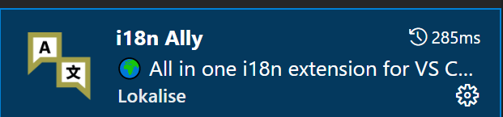​

### Element ui snippets：饿了么组件库提示

Element ui snippets：饿了么组件库提示

​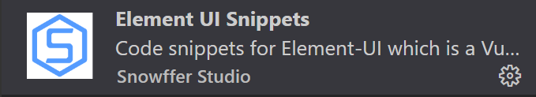​

### **Image preview：鼠标悬停查看图片**

Image preview：鼠标悬停查看图片

​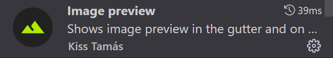

---

### open in browser：在浏览器中打开html文件

open in browser：在浏览器中打开html文件

​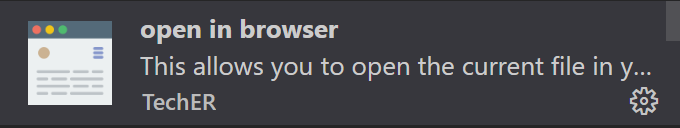

---

### **Path Intellisense：自动提示文件路径**

Path Intellisense：自动提示文件路径

​​

---

### Iconify IntelliSense：图标美化

Iconify IntelliSense：图标美化

​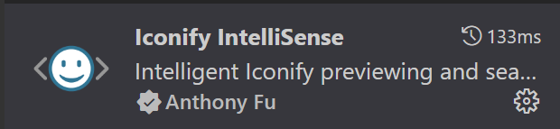​

### **Material Icon Theme**：图标美化

Material Icon Theme：图标美化插件

​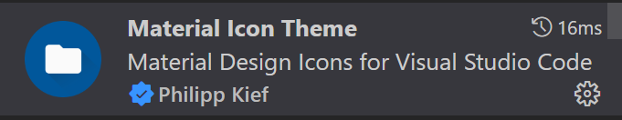​

---

### vscode-icons：图标美化

vscode-icons：图标美化，和Material Icon Theme二选一就行

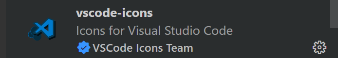​

### Error Lens：语法检查工具

Error Lens：语法检查工具，可以用于TS语言的语法检查

​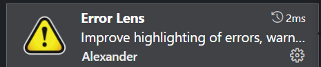​

---

### Prettier ESLint：代码格式化

Prettier ESLint：格式化代码的插件，符合eslint规范，有问题的地方可以自动修改，安装v3.1.0版本，最新版（5.04）有点问题

3.1.0适合vue2  

最新版本适合vue3，用最新的使用影响vue2的使用

​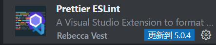​

---

### Prettier - Code formatter：代码格式化

Prettier - Code formatter：代码格式化插件

​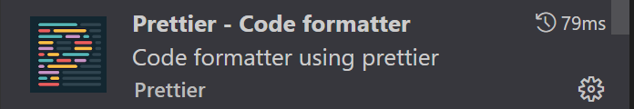​

---

### Prettier-Standard：代码格式化

Prettier-Standard - JavaScript formatter：代码格式化插件，使用的是`standard`规范

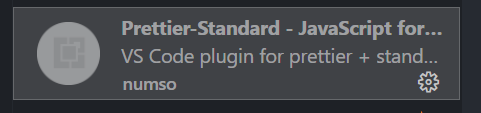​

---

### CSS Peek：查找css样式

CSS Peek：查看模板使用的css样式，方便查看

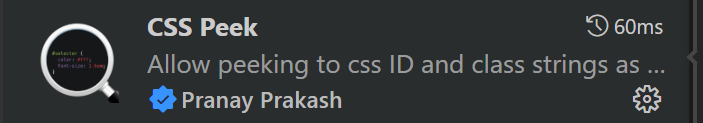

---

### Easy LESS：css预处理

Easy LESS：css预处理插件。less转css

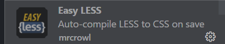​

---

### Easy Sass：css预处理

Easy Sass：css预处理插件转sass转css

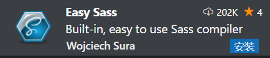​

---

### path-alias：代码中文件路径补全

path-alias：一个提供路径别名补全

* 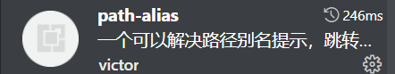​
* setting.json中配置

  ```js
  "pathAlias.aliasMap": {
          "@": "${cwd}/src",
          "~@": "${cwd}/src"
        },
  }
  ```

---

### **Auto Rename Tag：同步修改标签**

Auto Rename Tag：同步修改标签

​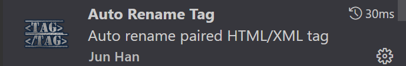​

---

### Auto Close Tag：自动补充标签

Auto Close Tag：自动补充标签

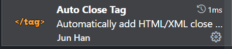

---

### Chinese：中文语言包

Chinese：中文语言包

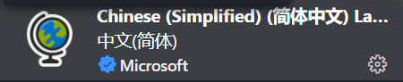​

---

## 🥗项目插件

### @vueuse/core：dom操作

[@vueuse/core](https://vueuse.org/core/usewindowscroll/)：vue3 中有一个第三方包，它封装了一些常用的 dom 操作

```js
npm i @vueuse/core
```

### Eacharts：可视化插件

[ECharts](https://echarts.apache.org/zh/index.html)，一个使用 `JavaScript` 实现的开源可视化库，可以流畅的运行在 PC 和移动设备上，兼容当前绝大部分浏览器（IE8/9/10/11，Chrome，Firefox，Safari等），底层依赖矢量图形库 [ZRender](https://github.com/ecomfe/zrender)，提供直观，交互丰富，可高度个性化定制的数据可视化图表。

* 下载安装：[下载echarts](https://echarts.apache.org/zh/download.html)
* 基本使用

  * 导入echarts
  * 准备一个具备大小（宽高）的 DOM

    ```html
    <div id="main" style="width: 600px; height:400px;"></div>
    ```
  * 初始化echart实例

    ```js
    const myChart = echarts.init(document.getElementById('main'));//需要绑定dom
    ```
  * 指定图表的配置项和数据 (根据文档提供示例找到option)

    ```js
    //data内的数据格式为
    data=[
      {
        value=xxx,
        name=xxx
      }
    ]
    const option = {
      title: {
        text: 'ECharts 入门示例',
      },
      tooltip: {},
      legend: {
        data: ['销量'],
      },
      xAxis: {
        data: ['衬衫', '羊毛衫', '雪纺衫', '裤子', '高跟鞋', '袜子'],
      },
      yAxis: {},
      series: [
        {
          name: '销量',
          type: 'bar',
          data: [5, 20, 36, 10, 10, 20],
        },
      ],
    }A

    ```
  * 使用刚指定的配置项和数据显示图表

    ```js
    myChart.setOption(option)
    ```
* vue中使用

  * `main.js`中导入

    ```js
    // 可视化插件
    import echarts from 'echarts'
    Vue.prototype.$echarts = echarts//绑定在vue的原型对象上

    ```
  * 在页面中设置：剩余步骤和上面的基本使用一致

    ```js
    const myChart = this.$echarts.init(document.getElementById('main'))
      const option = {
        ...
      }
    myChart.setOption(option)
    ```

### lodash：第三方函数库

[lodash](https://www.lodashjs.com/)：第三方函数库，封装好了很多函数，参见的防抖、节流

```js
npm i -g npm
npm i --save lodash
```

### flexible：移动端适配

flexible：移动端适配，会自动根据宽度适配font-size大小。在vant中可以找到设置，进阶用法--rem布局。

1. ```bash
    npm i -S amfe-flexible
    ```
2. `main.js`中导入

    ```js
    import 'amfe-flexible'
    ```
3. 注意

    ```js
    lib-flexible会自动在html的head中添加一个meta name="viewport"的标签
    同时会自动设置html的font-size为屏幕宽度除以10，也就是1rem等于html根节点的font-size
    ```

---

### postcss-pxtorem：px=>rem

[postcss-pxtorem](https://vant-contrib.gitee.io/vant/v2/#/zh-CN/advanced-usage)：写px 运行起来变rem。在vant中可以找到设置，进阶用法--rem布局。

1. ```bash
    npm install postcss postcss-pxtorem --save-dev
    ```
2. 项目根目录下创建：`postcss.config.js`，并赋值该设置

    ```js
    module.exports = {
      plugins: {
        'postcss-pxtorem': {
          rootValue: 37.5,//设置基准值
          propList: ['*'],
        },
      },
    };
    ```

---

### socket.io：聊天室，网络长链请求

[socket.io](https://socket.io/)：聊天室，网络长链请求

1. 下载

    ```js
    //使用npm给项目安装socket.io框架
    npm i socket.io-client
    ```
2. 使用

    ```js
    导包
    import io from "socket.io-client";

    如多个地方需要使用到socket实例，可以把socket定义在data中
    data () {
        return {
            socket:null
        }
    }

    创建socket.io对象，并建立链接
    const socket = io('连接的服务器')//看后台文档，查看创建链接是否需要携带数据

    向服务器端发送信息
    socket.emit('消息类型', 消息内容)

    监听服务器信息
    socket.on('消息类型', msg => {
        
        // msg就是服务器返回的消息
    })
    ```

---

### form-serialize：form表单数据获取

[form-serialize](https://github.com/defunctzombie/form-serialize)：简化表单获取数据的步骤，一次性把`form`标签中的表单元素中包裹数据一次性获得

1. 导入`form-serialize`插件
2. 调用`serialize`传入`form`表单和选项，即可获取：导入之后全局会增加`serialize`方法
3. 注意: 表单输入元素需要有值，才可以正常获取
4. 获得数据

    ```js
    // 1.不设置hash
    const res = serialize(document.querySelector('form'))
    console.log('res:', res) // username=autumnfish&password=12345

    // 2.设置hash
    const res2 = serialize(document.querySelector('form'), { hash: true })
    console.log('res2:', res2) // {username: 'jack', password: '23456'}
    ```

---

### mock.js：拦截请求，返回随机数据

[mock.js](http://mockjs.com/)：拦截ajax请求，生成随机数据

1. 下载安装：npm i mockjs
2. 使用：src/api/mock.js

    ```js
    import Mockjs from 'mockjs'
    // 拦截请求产生随机数据
    Mockjs.mock('请求的url',{产生随机数据:需要找官网复制方法使用})
    ```
3. 在`main.js`中导入

    ```js
    import "@/api/mock"
    ```

---

### webpack：打包工具

* [webpack](https://www.webpackjs.com/)：前端打包工具

  * ```js
    //安装webpack---两个命令是一个意思：将安装包记录成开发阶段的依赖
    //  --save 保存到 package.json 中
    //  -dev 开发依赖，只在开发阶段使用
    //dependences: 项目依赖, 项目上线也要用的
    //devDependencies: 开发依赖, 只在开发中使用, 上线时不要用的
    npm i webpack --save-dev
    npm i webpack -D 
    ```

---

### html-webpack-plugin：webpack配合插件

[html-webpack-plugin](https://github.com/jantimon/html-webpack-plugin)：配合webpack使用，生成`index.html`

* ```js
  npm i--save-dev html-webpack-plugin //下载插件
  ```

---

### normalize.css：通用css样式

normalize.css：这个css是为了抹平各个浏览器之间不同的样式差异

reset.css：简单粗暴，把浏览器的默认样式统一清除

* ```bash
  npm i normalize.css
  ```
* ```js
  //mian.js中导入
  import 'normalize.css/normalize.css' // A modern alternative to CSS resets
  ```

---

### vuex-persistedstate：vuex数据持久化

[vuex-persiste  dstate](https://www.npmjs.com/package/vuex-persistedstate)：vuex数据持久化

1. ```bash
    npm i vuex-persistedstate
    ```
2. 在`src/store/index.js`中导入

    ```js
    import persistedstate from 'vuex-persistedstate'
    ```
3. 在`src/store/index.js`中配置

    ```js
    const store = new Vuex.Store({
      ...
      plugins: [//plugins 插件
        persistedstate({
          paths: ['user.token']
        })
      ]
    })

    //默认是全局持久化，为了后面不出问题（用户信息肯定越新越好）
    paths:['模块名']//该模块都持久化
    paths:['模块名.xxx']//该模块下的某一个数据持久化
    ```

---

### js-cookie：数据持久化

[js-cookie](https://www.npmjs.com/package/js-cookie)：使用`cookie`​做数据持久化操作，安装后操纵类似`localStorage`​一样

一般不会使用这个来持久化vuex的数据了，一般使用vuex-persistedstate：vuex数据持久化

1. ```bash
    npm i js-cookie -S
    ```
2. `main.js`文件中导入

    ```bash
    import Cookies from 'js-cookie'
    ```
3. 基本使用

    ```js
    cookieJs.set(key,value)
    cookieJs.get(key)
    cookieJs.remove(key)
    ```
4. 牛逼使用

    ```js
    // 1. 设置cookie 
    Cookies.set("name", { foo: "bar" });   // json格式
    // Create an expiring cookie, valid to the path of the current page:
    Cookies.set("name", "andy凌云", { expires: 7, path: "" }); // 7天过期

    // 2. 读取cookie
    Cookies.get("name"); //读取名字为name的cookie, 
    Cookies.get(); // 读取所有的cookie,结果是个对象。
    Cookies.getJSON(); // 读取所有cookie, 结果是个解析后的对象， 推荐使用

    // 3. 删除cookie
    Cookies.remove('name') // 最基本的方式是根据所存的键值删除对应cookie
    // 删除全部cookie 
    /* 在网上搜了半天， 没搜到删除全部cookie的API方法。 笨的办法通过Cookies.get()去获取
    全部cookie组成的对象,然后遍历对象，根据各个键的值去依次删除 */
    let allCookies = Cookies.get();
    Object.keys(allCookies).forEach((item)=>{
      Cookies.remove(item);
    })
    // 删除完成后， 再取Cookies.get()得到是一个空对象


    //4. 特殊使用(在cookie中读取对象或数组)
    // 跟一般使用不同的是，从Cookie中取出的时候，要从字符串转换成json格式：
    const user = {
      name: "lia",
      age: 18
    };
    const nameList = [
      'andy凌云',
      '天道酬勤',
      '地道酬善'
    ]
    Cookies.set('user', user)
    Cookies.set('nameList', nameList)
    // 4.1  使用基础的JSON.parse方法去将get后的字符串解析为对象或数组
    JSON.parse(Cookies.get("user"));
    JSON.parse(Cookies.get("nameList"));
    // 4.2 使用js-cookie自带的getJSON方法， 直接就解析成了能直接进行操作的数组或对象
    Cookies.getJSON('user');
    Cookies.getJSON('nameList');
    // 如果是想直接操作所有的cookie对象，建议不要使用Cookies.get(),因为它得到的值是字符串，还需要使用JSON.parse()去解析， 最好使用Cookies.getJSON()。
    ```

---

### xlsx：上传excel文件

xlsx：用来上传excel文件的插件，可以配合页面代码使用。

* ```bash
  npm  i xlsx@0.16.5
  ```

* https://gitee.com/PanJiaChen/vue-element-admin/blob/master/src/components/UploadExcel/index.vue
* 这个页面设置好了导入，可以把这个页面当作公共组件来使用。

---

### moment：pc端的时间处理插件

[moment：pc](http://momentjs.cn/)端处理时间格式常用的插件，和`dayjs`相比，体积大一些，功能全一点。简单来说，都是用来处理时间的，moment是包含dayjs的，dayjs有moment的核心功能。

```js
npm install moment
```

### Export2Excel：excel导出

Export2Excel：用来导出excel的插件，是第三方插件，没法使用npm下载依赖

1. 下载[Export2Excel](http://xiazai.jb51.net/201708/yuanma/Export2Exce_jb51.rar)：项目中创建`src/vendor`文件夹，把`js`文件扔进去

    ```js
    里面的部分代码:
    import { saveAs } from 'file-saver' //该js文件所需要的依赖
    // 生成excel与解析excel数据
    import XLSX from 'xlsx'
    ...
    //所暴露的方法，就是使用它这个方法，里面为我们导出excel时需要转化数据传递的参数及格式
    export function export_json_to_excel({
      multiHeader = [],
      header,
      data,
      filename,
      merges = [],
      autoWidth = true,
      bookType = 'xlsx'
    }
    ```
2. 下载依赖

    ```bash
    npm install file-saver --save
    npm install xlsx --save
    ```
3. 在需要的页面中导入方法

    ```js
    import { export_json_to_excel } from '@/vendor/Export2Excel'
    ```
4. 方法的的使用：核心是将数据进行处理，变成方法所需要的格式，才能正确导出

    ```js
    //触发该函数，传入数据
    export_json_to_excel({
      multiHeader = [],//多表头内容，里面也是数组
      header,//表头内容，是数组，里面放各个单元格的数据
      data,//表格内容，是数组，里面也是数组，数组里面的属性是单元格的内容
      filename,//导出文件的默认文件名
      merges = [],//需要合并的单元格，里面是字符串
      autoWidth = true,//是否自动调整格式
      bookType = 'xlsx'//导出的文件类型
    }
    ```
5. 基本演示：主要就是把需要的数据**转化格式**，变成参数传递给方法然后导出

    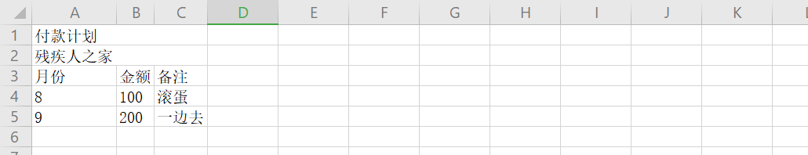​

    ```js
    import { export_json_to_excel } from '@/vendor/Export2Excel'//使用该js的这个方法
    export default {
      methods: {
        btnClick() {//触发函数
          // this.$message('点击了')
          export_json_to_excel({
            multiHeader: [//多联表头，多格合并一起，其他格子要空字符的
              ['付款计划', '', ''],
              ['残疾人之家', '', '']
            ],
            header: ['月份', '金额', '备注'],//表头，从左到右，一个单元格一个字符串
            data: [
              ['8', '100', '滚蛋'],//具体的数据，一个数组代表一行，一行的一个单元格就是一个数组里的字符串
              ['9', '200', '一边去']
            ],
            filename: '支付计划',//默认导出文件的文件名
            merges: ['A1:C1', 'A2:C2']//合并单元格，也是数组，代表A1-C1合并成一个格子。注意：使用‘’包起来的，不是数组或对象！
          })
        }
      }
    }
    ```

### qrcode：转化二维码插件

qrcode：字符串转化为二维码。用来显示信息

1. 下载插件

    ```js
    yarn add qrcode
    ```
2. 导入插件

    ```js
    import Qrcode from 'qrcode'
    ```
3. 创建显示二维码的容器

    ```js
    <canvas ref='canvas' />
    ```
4. 生成二维码，并显示在容器内

    ```js
    Qrcode.toCanvas('容器dom','需要变成二维码的内容',{容器的样式})
    ```
5. 基本样式模板

    ```js
    //html结构
    <div>
      <el-button @click="getCode">生成二维码</el-button>
      <canvas ref="canvas" />//方便找到这个dom
    </div>

    //js
    <script>
    import Qrcode from 'qrcode'// 导入
    export default {
      methods: {
        getCode() {
          Qrcode.toCanvas(this.$refs.canvas, 'https://www.baidu.com/', {
            width: 500//只写width就好了，它有自己的默认大小，写太小它也不会变小的
          })
        }
      }
    }
    </script>
    ```

---

### vue-print-nb：局部打印插件

vue-print-nb：可以设置局部打印。有些插件是没有官网的，直接看下源码，可以简单看出它是怎么用的。

1. 下载插件

    ```js
    yarn add vue-print-nb
    ```
2. 导入注册：`main.js`中进行全局注册

    ```js
    //导入
    import vuePrintNb from ‘vue-print-nb’
    //安装注册
    Vue.use(vuePrintNb)
    ```
3. 使用：需要打印的标签加`id`,`button`按钮绑定需要打印的标签`print={id='xxx'}`

    ```js
    <需要打印的标签  id=‘xxx’>
    ...
    </需要打印的标签>

    <el-button print="{id='xxx'}"> //可以打印带有id=xxx的标签，实现局部打印
    //如果没有带id，直接写print，那么就是全局打印。
    ```

---

### screenfull：全屏插件

[screenfull](https://www.npmjs.com/package/screenfull)：全屏插件，浏览器的F11也有网页全屏功能，不过有些浏览器没有适配，这个插件的适配更好

1. 下载插件：vue2需要减版本使用

    ```js
    npm i screenfull@5.0.0
    ```
2. 导入使用：

    ```js
    import screenfull from 'screenfull'
    ```
3. 调用方法：

    ```js
    // isEnabled返回值是boolean，判断当前浏览器是否支持全屏
    // toggle():全屏与非全屏的切换
    if (screenfull.isEnabled) {
        screenfull.toggle()
      } else {
        this.$message.error('该浏览器不支持全屏')
    }
    ```

### vue-i18n：vue下国际化插件

vue-i18n：支持vue框架的国际化插件，还有一个是`i18n`，这个是`vue-i18n`，不要搞混淆了。

1. 下载插件：最新的版本是不支持vue3的

    ```js
    npm i vue-i18n@8.0.0
    ```
2. 导入注册：创建专门的文件夹`src/lang/index.js`，这个文件夹专门放语言包。

    ```js
    import VueI18n from 'vue-i18n'//导入vue-i18n
    import Vue from 'vue'//导入vue，因为要安装在vue里面

    import zh from './zh'//导入语言包
    import en from './en'//导入语言包，类使用一对一的映射关系，

    Vue.use(VueI18n)//安装vue-i18n
    ```
3. 创建实例化对象：也是在上面的文件中实例化对象，`src/lang/index.js`。就是把语言包导入的作用。

    ```js
    ...//就是上面的导入安装

    const i18n = new VueI18n({
    //当前的语言包标识，切换语言要刷新路由，刷新路由又会导致locale恢复到默认，所以使用本地来存储切换的语言模式
      locale: localStorage.getItem('lang') || 'en',

    //这里就是一一对应的关系，...zn只是把之前导入的语言包里面东西在这解构了
      messages: {
        zh: {
          ...zh
        },
        en: {
          ...en
        },

    //当locale的模式是xxx时，使用key，页面可以显示value。
    //也可以使用yyy:{}，那么使用的时候就是yyy.key了
        xxx:{
        key:'value'
        }
      }
    })

    export default i18n //要暴露出去到main.js中使用
    ```
4. 在`main.js`中挂载：这样才可以全局使用了

    ```js
    import i18n from '@/lang'
    new Vue({
      router,
      store,
      i18n
    })
    ```
5. 使用的基本语法

    ```js
    //切换语言的方法
    this.$i18n.locale='语言模式'//之前配置的’zn‘或者'en'
    //使用语言包配置的
    $t.('key')
    ```
6. **注意事项**

    1. `i18n`在html中使用是响应式的，所以一切换就可以直接显示
    2. 在`.js`文件里使用`i18n`不是响应式的，如`router`文件里面的路由导航名称，要刷新网页`this.router.go(0)`才能正常显示
    3. 但是刷新网页会初始化设置的locale配置，所以每次设置需要做持久化处理
    4. 在`.js`文件和`html`结构中的使用有些不一样

    ```js
    //js中要做导入，因为i18n是挂载到vue的，所以在js文件中是要导入的
    import i18n from ’@/lang/index.js‘
    i18n.t('route.departments')  //这里的'router.departments'是key,可以对应'zh'模式中的’组织架构‘

    //html结构中，因为已经挂载到vue中了，直接使用$t('key')
    {{$t('xxx')}}

    //vue文件中切换语言
    this.$i18n.locale='模式'
    ```

### @escook/request-miniprogram：小程序网络请求

[@escook/request-miniprogram](https://www.npmjs.com/package/@escook/request-miniprogram)：在uni-app中使用的微信小程序网络请求插件

* npm初始化

  ```js
  npm init -y
  ```
* 下载安装

  ```js
  npm i @escook/request-miniprogram
  ```
* 基本使用

  ```js
  // 按需导入 $http 对象
  import { $http } from '@escook/request-miniprogram'

  // 将按需导入的 $http 挂载到 wx 顶级对象之上，方便全局调用
  wx.$http = $http

  // 在 uni-app 项目中，可以把 $http 挂载到 uni 顶级对象之上，方便全局调用
  uni.$http = $http

  // 发起 GET 请求，data 是可选的参数对象
  $http.get(url, data?)

  // 发起 POST 请求，data 是可选的参数对象
  $http.post(url, data?)

  // 发起 PUT 请求，data 是可选的参数对象
  $http.put(url, data?)

  // 发起 DELETE 请求，data 是可选的参数对象
  $http.delete(url, data?)

  //配置基地址
  $http.baseUrl = 'https://www.example.com'

  // 请求拦截器
  $http.beforeRequest = function (options) {
    // do somethimg...
  }

  //响应拦截器
  $http.afterRequest = function () {
    // do something...
  }
  ```

### vuex-persistedstate：vuex数据持久化插件

[vuex-persistedstate](https://www.npmjs.com/package/vuex-persistedstate)：vuex数据持久化插件

* 下载

  ```js
  npm i vuex-persistedstate
  ```
* 导入：`src/store/index.js`中导入

  ```js
  import persistedstate from 'vuex-persistedstate'
  ```
* 配置使用

  ```js
  Vue.use(Vuex)
  const store = new Vuex.Store({
    ...
  //配置
    plugins: [
      persistedstate({
      只写模块名代表整 个模块持久化
      针对 某字段持久化  模块名.字段名
        paths: ['user.token']
      })
    ]
  })
  export default store
  ```
