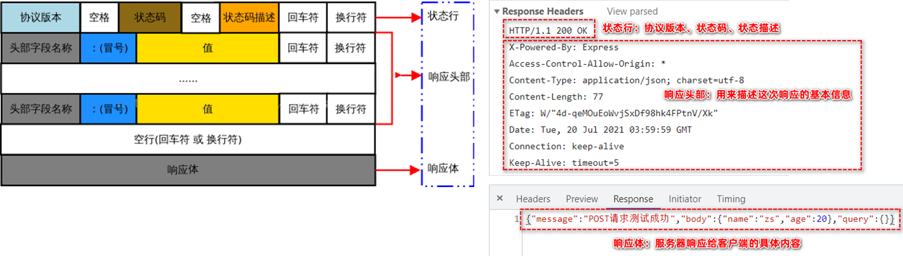

# JavaScript

# JS基础

### 基本概念

* ECMAScript：JavaScript的核心，描述了语言的基本语法和数据类型，ECMAScript是一套标准，定义了js语言的标准
* DOM：文档对象模型，有一套操作页面元素的API，DOM可以把HTML看做是文档树，通过DOM提供的API可以对树上的节点进行操作
* BOM：浏览器对象模型，一套操作浏览器功能的API，通过BOM可以操作浏览器窗口，比如：弹出框、控制浏览器跳转、获取分辨率等

　　​​

### 自执行函数

```js
;(function () {
    let num = 20 // 匿名函数内部声明的变量只能在匿名函数内部使用
    console.log(num)
})()
;(function () {
    console.log("789")
}())
```

### 作用域

1. 全局作用域(全局变量): 函数外部声明的变量
2. 局部作用域(局部变量): **函数内部**声明的变量
3. 块级作用域(块级变量): 分支或循环大括号里声明的变量

　　注意：如果一个变量在声明的时候没有使用关键字。 例如： `num = 10`,此时这个变量**无论写在哪里都是全局变量**。 

```js
// 全局作用域
let num = 0

// 局部作用域
function fn1() {
    let num = 1
    console.log(num);
}
fn1() 

//块级作用域
for (let i = 0; i < 1; i++) {
    let num = 2
    console.log(num); //2
}

//块级作用域
if (true) {
    let num = 3
    console.log(num); //3
}
console.log(num); //0
```

### 作用域链

　　作用域链：由全局作用域与局部作用域形成的 "链条"

　　全局作用域：script标签、外部js文件

　　局部作用域：函数

```js
function fn(){
     function fn1(){
         function fn2(){
         }
     }
 }
```

​

　　链式查找规则：当一个作用域内使用一个变量时，如果当前作用域没有，则会向上一级作用域找。

```js
let a = 10
function fn(){
 let a = 200
 function fn1(){
     let a = 300 
     function fn2(){
         a = 20;
     }
     fn2();
 }
 fn1()
}
fn();
```

​

### 关于this

* this指向

  ```js
  构造函数里的this:代表本次实例化出来的那个对象。
  方法里的this:代表调用方法的对象，也就是谁调用就代表谁。
  箭头函数的this:找上一级函数里的this
  普通函数的this:（函数名()）：指向window
  ```
* 修改this指向：通过修改this的指向，达到方法的**借用**

  * fn.call：将方法里的this修改为 obj 对象（this指向obj），并立即调用前面的函数。需要**独立传递参数**

    ```js
    方法.call(obj,参数1,参数2...)
    call会调用前面的方法，并将方法里的this修改为 obj 对象；参数1,参数2... 会传递给前面被调用的方法
    obj1.方法.call(obj2,参数1,参数2...):该方法的this指向obj2，如果obj2没有，即使obj1有，也会报undefined。
    let oa = {
      age: 20,
      say: function (a, b, c) {
        console.log(this.age);
        // console.log('hello');
        console.log(a, b, c);
      },
    };
    let ob = {
      age: 22,
    };
    let oc = {
      age: 25,
    };
    // oa.say()
    oa.say.call(ob, 10, 20, 30); //22,10,20,30
    oa.say.call(oc, "hello", "world", "abc"); //25,hello,world,abc
    ```
  * apply：将方法里的this修改为 obj 对象，并立即调用前面的函数。需要**传递数组**

    ```js
    方法.apply(obj,[参数1,参数2...])
    apply会调用前面的方法，并将方法里的this修改为 obj 对象
    apply方法在内部会将 [参数1,参数2]，解开 再传递给前面的方法。

    let oa = {
     age:20,
     say:function(a,b,c){
         console.log(this.age);
         console.log(a,b,c);
     }
    }

    let ob = {
     age:22
    }

    oa.say.apply(ob,[10,20,20])

    //应用
    let arr = [40, 19, 28, 30, 29, 19, 20, 49];

    // 展开传递
    // let max = Math.max(arr[0],arr[1],arr[2],arr[3],arr[4])
    // console.log(max);

    // 使用aplly就可以避免数组被展开传递
    // let max = Math.max.apply(Math,arr);
    // console.log(max);

    console.log(Math.max(...arr));
    ```
  * bind：不会立即调用前面的函数，会返回一个函数，返回的这个函数是this被obj替换后的一个函数，通过返回的函数可以调用前面的函数。

    ```js
    方法.bind( obj )
    // bind并不会立即调用前面的方法，只会将方法里的this替换为obj
    // bind会返回一个函数，返回的这个函数是this被obj替换后的一个函数，通过返回的函数可以调用前面的函数

    let oa = {
     age:20,
     say:function(a,b,c){
         console.log(ob.age);
     }
    }

    let ob = {
     age:22
    }

    // oa.say.call(ob)     // 22
    // oa.say.apply(ob)    //22
    // call与aplly在修改前面的方法里的this同时方法也会被一同调用。

    let fn = oa.say.bind(ob)// bind此时仅是使用ob替换oa.say里的this,并没有让say调用起来

    oa.say.bind(ob)//为函数
    fn();//22 这条语句才是调用
    ```

### 异常处理

* 创建异常：创建一个错误信息出来

  ```js
  // Error()    
  // new Error(错误描述)
  // Error(错误描述)
  let er = Error('年龄不合法');
  console.log(er);//该对象本身
  //错误对象.message,从错误对象上获取错误信息
  console.log(er.message);//"年龄不合法"
  ```
* 抛出错误：仅仅创建一个错误对象，并不会触发这种严格错误（JS立即停止）。必须抛出错误，JS识别到了，才会停止代码执行。

  ```js
  //语法：throw 错误对象
  throw Error('年龄不合法')
  console.log('hello');//不执行，前面有错误了，执行中断
  ```
* 捕捉异常：当一个错误被抛出后，必须使用特殊的语法进行处理，不处理程序就会中断

  ```js
  // 异常捕获以及处理
  // try{
  //   代码块
  // }catch(形参){
  //     // 异常处理的代码块，只有try里的异常错误对象被throw才会被执行
  // }finally{
  //     // 无论是否有异常发生，都会执行到这里
  // }
  //     try代码块要将可能抛出异常的代码括起来
  //     catch代码块，当try代码块中的异常被抛出了，catch代码块捕获这个错误对象，并传递给形参。

  try {
    let age = 210;
    if (age > 200) {
      throw Error("年龄不合法.....");
    }
  } catch (err) {
    console.log(err);//错误本身
    console.log(err.message);//"年龄不合法..." 错误对象包含的信息
  } finally {
    console.log("finllay....");//可以正常执行
  }
  console.log("hello");//可以正常执行
  ```

### 深拷贝的实现

* 递归方法

  ```js
  let target = {};
  function deepCopy(t, o) {
    for (let key in o) {
      // key得到的是 ：前面的键名  如果想得到：后面的，键值 o[key]
      // key : o[key]
      if (Array.isArray(o[key])) {
        // 要先判断数组  Array.isArray()判断数据
        // 遇到数组，在t中创建一个空数组
        t[key] = [];
        deepCopy(t[key], o[key]);
      } else if (o[key] instanceof Object) {
        // 判断对象
        // 遇到对象，在t中创建一个空对象
        t[key] = {};
        deepCopy(t[key], o[key]);
      } else {
        // 简单数据类型
        t[key] = o[key];
      }
    }
  }
  deepCopy(target, obj);
  ```
* JSON

  ```js
  1.JSON.stringify(对象或数组):将对象或数组转换成JSON格式的字符串
  2.JSON.parse(JSON字符串):将JSON字符串，还原回对象或数组并赋值给新的对象或数值
  ```

### 闭包

* 概念：闭包是`JS`中一种特殊的代码，体现在代码上为：内部函数使用外层函数的局部变量。

  ```js
  函数是有作用域的，闭包在代码上就是函数嵌套函数，内部函数调用着这个局部作用域里面的局部变量。
  利用闭包相当于在内存开闭了一个区块，这个区块整体上是长效的，是一块‘独立’的内存，里面有自己设置的变量。
  就和一栋大楼，开辟了一个个不会产生相互影响的内存房间。
  函数是由其构成的本身语法和 构建时的环境 组成。这个环境包含了创建该函数时候创建的局部变量。
  ```
* 闭包作用：让函数所操作的数据私有化，常见用在节流防抖上面。

  ```js
  // 闭包的简单应用
  function outer(){
   let i = 0;
   function inner(){
     i++;
     console.log(i);
   }
   return inner;
  }

  let fn = outer(); // let i = 0 仅在调用外层函数时执行1次。

  fn();//1
  fn();//2
  fn();//3
  fn();//4
  fn();//5
  ```

### 节流防抖

* 节流：在一个时间间隔内触发多次，事件处理函数仅执行1次。节流主要用在高频事件中：鼠标移动、滚动条滚动 、页面resize

  ```js
  function throttle(handler,millsceconds){
    // 定义一个初始时间
    let t = 0
    return function(){
    // 事件触时的事件
    let n = Date.now()
    if(n - t > millsceconds){
      handler()
      //将本次事件处理函数执行的时间赋值给t
      t = n;
      }
    }
  }
  ```
* 防抖：在连续重叠的时间间隔内触发事件，以最后一次为准(从最后一次开始计时)。防抖主要用于搜索栏。

  ```js
  function debounced(handler, millseconds) {
    // 定义变量于存储定时器
    let timer;
    return function () {
      // 清除定时器的操作必须放在创建之前
      clearTimeout(timer);
      // 创建本次的定时器并保存到timer
      timer = setTimeout(handler, millseconds);
    };
  }
  ```

### 垃圾回收机制

* 垃圾回收机制：JS内部有一段代码，负责将程序执行的过程中，将没有办法访问到的数据销毁。
* 内存泄漏：如果有数据无法访问，但JS没有办法回收，这种情况就是内存"泄露"
* 引用计数：对数据的引用进行计数，计数为0，视为垃圾数据，垃圾回收机制会将其回收。

  ```js
  <script>
      // 当出现一个复杂数据类型（对象或数组）时，JS对这个数据记录它的引用次数。

     /*  // 引用次数： 1
      let obj = {
          id:10,
          name:'zhansan'
      }
      // 引用次数： 2
      let obj2 = obj;
      // 引用次数： 1
      obj2 = 'hello';
      // 引用次数： 0
      // 当一个数据引用次数变为0时，这个数据会被视之为"垃圾", 等待垃圾回收机制销毁
      obj = true; */
  </script>

  <script>
      // 引用记数有一个致命问题。
      // 数据{id:10, name:'zhangsan'}引用次数 1
      let obj = {
          id:20,
          name:'zhangsan'
      }
      // 数据{id:30, name:'lisi'}引用次数 1
      let obj2 = {
          id:30,
          name:'lisi'
      }
      // 数据{id:30, name:'lisi'}引用次数 2
      obj.to2 = obj2;
      // 数据{id:10, name:'zhangsan'}引用次数 2
      obj2.to1 = obj;
    
      obj = 10
      // 数据{id:10, name:'zhangsan'}引用次数 1
      obj2 = 20;
      // 数据{id:30, name:'lisi'}引用次数 1
      // 但是栈区已没有变量来引用这个数据
  </script>
  ```
* 标记清除：扫描使用过的内存空间, 看栈区是否有变量指向。如果没有则标记为垃圾，后续垃圾回收机制会将其回收。

  ```js
  <script>
   // 情况1： 局部变量
   //  当函数执行结束后，垃圾回收机制会将函数内的使用过局部变量，标记不垃圾，后续垃圾回收机制会将其回收。
   function fn(){
       let i = 10;
   }
   fn();
   // 情况2： 对象的相互引用
   //  垃圾回收机制 会扫描使用过的内存空间, 看栈区是否有变量指向，如果没有标记为垃圾，后续垃圾回收机制会将其回收。
  </script>
  ```

### 构造函数

　　构造函数就是函数，使用`new`​关键字调用，来创建对象的函数。如果一个函数使用 `new`​ 关键字调用，那么这个函数就是构造函数。

　　构造函数，是面向对象三大特性的`封装性`的体现。可以将数据与操作数据的方法定义到一个主体上，方法内通过this来访问数据，实例化出来的每个对象上各自保留有自己的数据与操作数据的方法。

* 实例化

  *  由构造函数得到实例对象的过程就是实例化
  * 使用`new` 关键字调用函数的行为被称为实例化
  * 实例化构造函数时没有参数时可以省略`（）`
* 实例

  * 实例化的结果得到的是一个对象，这个对象通常称之为实例。
  * 通过构造函数创建的对象称为实例对象。
* 注意

  * **构造函数首字母一般大写**, 为了提醒调用者不要忘记`new`​关键字
  * 构造函数的返回值即为新创建的对象
  * 如果在构造函数内部手动`return`

    * `return`值类型：无效，还是返回new创建的对象
    * `return`引用类型：有效，会覆盖new创建的对象

### 变量提升

　　预解析：就代码执行之前的一个阶段，这个阶段完成的工作有很多，其中一个就是函数提升。

　　函数提升：函数提升就是在预解析阶段，JS会搜索所有的函数的定义，并将定义提升最前面，体现在代码上就是书写代码时，函数调用可以放在定义之前。

　　变量提升：变量提升仅出现在`var`​定义的变量上。在预解析阶段，JS会搜索所有使用`var`​声明的变量，并**将声明**提升到**当前作用域最前面**。`var`​只是声明，并没有赋值

　　块级作用域：只在当前函数下声明的变量有效，在代码块和`{ }`​括号之内有效

　　函数作用域：其作用域为该语句所在的函数，且存在变量提升(提升到函数的顶层)

```js
var的函数作用域，会提升到当前作用域的最顶部
function person(status) {
    if (status) {
        var value = "蛙人" 
    } else {
        console.log(value) // undefined
    }
    console.log(value) // undefined
}
person(false)

let的块级作用域
function person(status) {
    if (status) {
        let value = "蛙人" 
    } else {
        console.log(value) // 报错
    }
    console.log(value) // 报错
}
person(false)
```

### 动态参数

* 概念：`argument`​：是用于接收函数实参的另一种方式，这种方式的特点可以不定义形参
* 注意：

  1. argument**只能在函数内部使用;**
  2. argument是一个伪数组;
  3. 有数组三要素(元素、下标、长度)，但是不能使用数组的方法，内部修改参数的值arguments存储的值也会修改。
* 应用：一般用户参数数量不限的函数，如`arr.push()`​ 等函数实参数量不限，底层原理就是使用`arguments`​来接收所有的实参

  ```js
  function fn(a, b, c) {
    console.log(arguments) //1,2,3
    // 内部修改参数的值, arguments存储的值也会修改
    c = 10
    console.log(arguments) //1,2,10
  }
  fn()
  fn(1, 2, 3)

  ```

### 定时器

* setTimeout：一次性定时器当指定的毫秒数到达时，才执行指定的函数

  ```js
  setTimeout(()=>{},time)
  //设置一次性定时器，返回定时器标识
  let timer = setTimeout(function(){
    console.log('hello');
  },3000);
  //清除一次性定时器
  clearTimeout(timer);

  ```
* setInterval：重复定时器，每间隔指定的毫秒数，就执行一次指定的 函数

  ```js
  setInterval(()=>{},tiem)
  //设置重复定时器，返回定时器标识
  let timer = setInterval(function(){
    console.log('hello');
  },2000);
  //清除重复定时器
  clearInterval(timer);

  ```

### 展开运算符

　　展开运算符符号：`...`​，可以用于将数组展开，展开成由逗号分隔的多个值。

　　也可以获取函数剩余的所有实参，一般情况下,​可以替代动态参数`argument`​。

```js
1.获取函数参数
function fn(a, ...b) {
  console.log(b)
  console.log(arguments)
}
fn()
fn(1, 2, 3)

2.展开数组
let arr = [10, 20, 30, 40]      // ...arr      10, 20, 30, 40 
console.log(...arr);            // 10 20 30 40
// 求最大值与最小值
let arr = [9,10,28,17,32,15]
let max = Math.max(...arr)
console.log(max);

let min = Math.min(...arr)
console.log(min);
```

### 可选链操作符

* [概念](https://developer.mozilla.org/zh-CN/docs/Web/JavaScript/Reference/Operators/Optional_chaining)：允许读取位于连接对象链深处的属性的值，而不必明确验证链中的每个引用是否有效。
* 使用：利用点语法，会先判断问号前面是否存在，存在就可以点，不存在就nudefine

  ```js

  obj?.prop       // obj.dog?.name
  obj?.[expr]     // obj.dog?.['name']
  arr?.[index]    // arr = null   arr?.[0]
  func?.(args)    // fn?.()
  ```
* 非空断言：**可选链操作符不能放在 赋值操作符= 的左边**

  ```js
  ts中使用可选链操作的时候可能放在 = 的左边

  const imgRef = ref<HTMLImageElement | null>(null)
  onMounted(() => {
    imgRef.value!.src = '2.jpg'//我肯定是有的 !. 非空断言
  })
  ```

　　‍

### 检测数据类型

* typeof：一元运算符，它返回一个字符串，说明运算数的类型

  ```js
  typeof xxx 或 typeof(xxx)

  const type =  typeof '你好'; // string
  typeof 666; // number
  typeof true; // boolean
  typeof undefined; // undefined
  typeof Symbol(); // symbol
  typeof 1n; // bigint
  typeof () => {}; // function

  typeof []; // object
  typeof {}; // object
  typeof new String('xxx'); // object

  typeof null; // object

  typeof只能准确判断原始数据类型和函数（函数其实是对象，并不属于另一种数据类型，但也能够使用 typeof 进行区分），无法精确判断出引用数据类型（统统返回 object）。
  有一点需要注意，调用typeof null返回的是object，这是因为特殊值null被认为是一个对空对象的引用（也叫空对象指针）
  ```
* instanceof：作用于判断构造函数与实例对象的关系，依据是构造函数对应的原型对象是否在以实例为起点的原型链上。

  ```js
  //对象 instanceof 函数 ,返回值是boolean
  function Human(){}
  function Person(){}
  let oa = new Person();
  console.log(oa instanceof Person);   // true
  console.log(oa instanceof Human);    // false
  console.log(oa instanceof Object);   // true
  ```
* 区别：  

  ```js
  //typeof 虽然可以判断原始数据类型（null 除外），但是无法判断引用数据类型（function 除外）
  //instanceof 可以准确判断引用数据类型，但是不能正确判断原始数据类型
  //typeof 会返回一个运算数的基本类型，instanceof 返回的是布尔值

  Object.prototype.toString({})       // "[object Object]"
  Object.prototype.toString.call({})  // 同上结果，加上call也ok
  Object.prototype.toString.call(1)    // "[object Number]"
  Object.prototype.toString.call('1')  // "[object String]"
  Object.prototype.toString.call(true)  // "[object Boolean]"
  Object.prototype.toString.call(function(){})  // "[object Function]"
  Object.prototype.toString.call(null)   //"[object Null]"
  Object.prototype.toString.call(undefined) //"[object Undefined]"
  Object.prototype.toString.call(/123/g)    //"[object RegExp]"
  Object.prototype.toString.call(new Date()) //"[object Date]"
  Object.prototype.toString.call([])       //"[object Array]"
  Object.prototype.toString.call(document)  //"[object HTMLDocument]"
  Object.prototype.toString.call(window)   //"[object Window]"
  ```

### 数据类型转换

* 概念：JavaScript是弱数据类型，JavaScript也不知道变量到底属于那种数据类型，只有赋值了才清楚
* 转number类型

  ```js
  // 1. 字符串转数字类型: parseInt(), parseFloat()
  // 2. 非字符串转数字类型: Number()
  // parseInt() 转整数, 从前往后去运行, 保留整数部分, 遇到不能转换的, 就舍弃,如果一开始就是非数值部分, 转为NaN
  console.log(parseInt("8.8")) // 8
  console.log(typeof parseInt("8.8")) // number
  console.log(parseInt("8.8a")) // 8
  console.log(parseInt("88a")) // 88
  console.log(parseInt("a88")) // NaN
  //parseFloat() 转小数, 可以保留小数部分
  console.log(parseFloat("8.8")) // 8.8
  console.log(parseFloat("8.8a")) // 8.8
  console.log(parseFloat("a8.8")) // NaN
  //Number()  非字符串类型转为数字使用比较方便
  // 转字符串时注意, 有非数值部分就报NaN
  console.log(Number("8.8")) //8.8
  console.log(Number("8.8a")) //NaN
  console.log(Number(true)) //1
  console.log(Number(false)) //0
  console.log(Number(undefined)) //NaN
  console.log(Number(null)) //0
  ```
* NaN：number类型特殊值，与任何数值进行运算都是NaN

  ```js
  console.log(Number("8.8a")) // NaN
  let num
  console.log(num + 1) //NaN。NaN不能参与运算的, 与任何数值进行运算都是NaN

  // isNaN(数据) 返回true, 意味着数据为NaN,  返回false, 说明数据正常
  // 注意,会有隐式转换, 数据会先用Number()转为数值类型再去判定
  console.log(isNaN("123")) // Number('123') => 123  结果为fasle
  console.log(isNaN("abc")) // Number('abc') => NaN  结果为true
  console.log(isNaN("字符串")) // Number('字符串') => NaN  结果为true
  console.log(isNaN(NaN)) // true
  console.log(isNaN("123abc" - "123")) //得到的结果为NaN, 返回true
  ```
* 转string类型

  ```js
  // 1. String() 常用
  // 2. 变量.toString()   undefined和null 不能使用, 会报错
  // 使用场景: 转换进
  console.log(String(123)) // '123'
  console.log(typeof String(123)) // string
  console.log(String(true)) // 'true'
  console.log(String(false)) // 'false'
  console.log(String(undefined)) // 'undefined'
  console.log(String(null)) // 'null
  // 变量.toString(), undefined和null不能使用此方法会报错
  let num = 16
  console.log(num.toString()) //'123
  // 使用场景: 进制转换
  // 十六进制, 每一位0-9,a-f之间
  console.log(num.toString(16)) //'2'
  // 二进制, 每一位0-1
  console.log(num.toString(2)) //'10'
  ```
* 转boolean类型：`0`, `-0`, `''`, `undefined`, `null`, `NaN`, `false`7种数据会转为false，其他都是`true`

  ```js
  console.log(Boolean(0))
  console.log(Boolean(-0))
  console.log(Boolean("")) // 空字符串,不能加空格
  console.log(Boolean(undefined))
  console.log(Boolean(null))
  console.log(Boolean(NaN))
  console.log(Boolean(false)
  console.log(Boolean(-1)) // true
  console.log(Boolean("寂寞的天")) // true
  ```
* 隐式转换：代码执行时，系统对处理的数据自动进行数据类型转换

  ```js
  //显示转换: 程序员主动做的, 阅读性高
  //转数值类型: Number()  parseInt() parseFloat()
  //转字符串类型: String()  变量.toString()
  //转布尔类型: Boolean()

  //隐式转换 ： 
  //当数据不能直接计算, 或者运算符两边的 ‘数据类型不一致’ 的时候，编译器会转成一致后运算

  //转数值类型  有算术运算符的时候, 会发生数值类型转换
  console.log("5" * "3") // Number('5') * Number("3") ==> 5*3      15
  //console.log("5a" * "3") // Number('5a') * Number("3") ==> NaN*3    Na

  //转字符串类型  +为连接符功能时
  console.log("这是一个寂寞的天" + 1) // '这是一个寂寞的天1'
  console.log("" + 1) // '1'

  //转布尔类型  逻辑非
  console.log(!5) // !Boolean(5)  false
  console.log(!0) // !Boolean(0)  true
  ```

### 数据解构

* 概念：解构数据的时候，数据结构上要是一致的，才能赋值到自己设置的变量
* **注意**：如果解构赋值给的数据是`undefined`，那么会优先使用自己的默认（原本）的值
* 数组解构

  ```js
  let [x,y] = [10]
  console.log(x);// 10
  console.log(y);// nudefiend   数组不够分


  //数组解构层级
  let [a, [b1, b2]] = [10,['hello','world']]
  console.log(a);  //10
  console.log(b1, b2);   //'hello','world'

  let [, b1] = [10, ['hello', 'world']]//
  // console.log(b1);//['hello', 'world']


  let arr = [10, 20, 30, 40];

  1. 按需解构
  let [a,b] = arr;  // 解构前两个
  console.log(a, b);

  let [a,,b] = arr;    // 解构第1个与第3个
  console.log(a,c);

  2. 解构中也可以使用剩余参数
  let [a, ...b] = arr;
  console.log(a);  //10
  console.log(b);  //[20,30,40]

  let arr2 = [10, ['hello', 'world']]
  let [a,[b1,b2]] =  [10, ['hello', 'world']]
  console.log(a);  //10
  console.log(b1,b2);  //'hello', 'world'
  ```
* 对象解构：将对象中与变量同名的成员读取出来，并赋值给同名变量。如果没有找到同名的则返回`undefined`

  ```js
  //基本语法:let {变量1, 变量2, 变量3} = 对象
  //解构重命名:let {原名:新名, 原名:新名, 原名:新名} = 对象

  //基本解构
  let obj = {
   id:10,
   age:20,
   gender:'男'
  }
  let {age, id, gender,uname} = obj;
  console.log(id, age, gender,uname);


  //解构重命名
  let obj = {
   id:10,
   age:20,
   gender:'男'
  }
  let {id:i,age:a,gender:g} = obj;
  console.log(i, a, g);

  //多级对象解构
  let arr2 = [
      {
          uname:'zhangsan',
          age:20,
          car:{
              price:'50w',
              color:'red'
          },
          phone:{
              price:'1w',
              color:'blue'
          }
      }
  ]

  let [{uname,age,car,car:{price,color}}] = arr2;
  console.log(uname,age,car,price,color);

  ```

### 创建对象方法

* 构造函数法创建对象

  ```js
  /* 
  new关键字创造对象的过程: 
          (1)创建空对象  {}
          (2)this指向这个对象  this = {}
          (3)对象赋值  this.name = name
          (4)返回这个对象  return this
  this: 代表当前对象的一个引用, 会随着调用者变化而改变  
  */

  // 继续优化代码, 去掉函数内部的实例对象声明和返回值, 在调用函数时使用new替代
  function Person(name, sex) {
    // 1. 当我们把函数内部的声明变量这一步取消时, 函数内部的obj已经不存在了, 会报错 : obj is not defined
    // let obj = new Object()
    // 2. 所以需要使用this来代表当前对象的引用 :  this = obj
    this.name = name
    this.sex = sex
    this.sayHi = function () {
      alert(`大家好! 我是${name}`)
      alert("大家好! 我是" + this.name)
    }
    // 3. 调用构造函数使用new创建对象时, 构造函数内部可以省略返回这一步骤
    return obj
  }

  // 将内部的new Object()的过程放到调用函数这里, 简化内部代码
  let obj1 = new Person("张三", "man")
  console.log(obj1)
  obj1.sayHi()

  let obj2 = new Person("李四", "woman")
  console.log(obj2)
  obj2.sayHi()
  构造函数new在使用时需要注意的地方
                  1 构造函数首字母一般大写, 为了提醒调用者不要忘记new关键字
                  2 如果在构造函数内部 手动return
                      return 值类型  ： 无效,还是返回new创建的对象
                      return 引用类型  ： 有效，会覆盖new创建的对象
  ```
* 内置对象法创建对象

  ```js
  // 内置对象法声明对象 new Object()
  // 与字面量声明效果相同, 使用对象属性新增方式添加属性和方法
  let obj = new Object()
  obj.name = "张三"
  obj.sex = "man"
  obj.sayHi = function () {
      alert("大家好!")
  }
  console.log(obj) 

  // 将内置对象法创建对象的过程封装成为一个函数, 每次创建一个人就调用一次, 也可以批量创建对象
  function person(name, sex) {
      let obj = new Object()
      obj.name = name
      obj.sex = sex
      obj.sayHi = function () {
          alert(`大家好!我是${name}`)
      }
      return obj
  }

  let obj1 = person("张三", "man")
  console.log(obj1)
  let obj2 = person("李四", "woman")
  console.log(obj2)
  ```
* 工厂函数法创建对象

  ```js
  //工厂函数 :  用于创建对象的函数
  //工厂函数: 就是把字面量创建对象的过程封装成函数, 可以像工厂的流水线一样批量创建对象
  function createPerson(name, age, sex) {
      //1.创建对象
      let p = {}
      //2.给对象赋值
      p.name = name
      p.age = age
      p.sex = sex
      //3. 返回对象
      return p
  }
  let p1 = createPerson("张三", 20, "男")
  let p2 = createPerson("李四", 22, "女")
  console.log(p1, p2)
  ```

* 对象查询

  ```js
  //对象名.属性名
  //对象名['属性名']
  //对象名[变量名]
  //优先使用点语法, 在需要解析变量的时候使用[]语法
  ```

# JS进阶

## Math对象

```js
// 1. 生成随机数, [0-1)包括0不包括1
console.log(Math.random())
console.log(Math.random() * 10) //0-10  不包含10
console.log(parseInt(Math.random() * 11)) // 0-9
//2. 向上取整  Math.ceil()
console.log(Math.ceil(9.003))//10
//3. 向下取整 Math.floor()
console.log(Math.floor(9.99))//9
//4. 找最大最小数
console.log(Math.max(2, 3, 15, 8, 4))//15
console.log(Math.min(2, 3, 15, 8, 4))//2
//5. 幂运算  10的3次幂运算  Math.pow(值, 次方数)
console.log(Math.pow(2, 3))//8
//6. 绝对值
console.log(Math.abs(-10.01))//10.01
```

## Date对象

```js
// Date对象 : 日期对象
//1. 获取当前日期和时间
let d = new Date()
console.log(d) // 当前日期对象
console.log(typeof d)
console.log(d.toString()) //当前日期字符串
console.log(typeof d.toString())

//  转为本地时间格式字符串
console.log( d.toLocaleString() )//2022/1/18 下午3:02:53
console.log( d.toLocaleDateString() )//2022/1/18
console.log( d.toLocaleTimeString() )//下午3:03:29

//2. 获取年份
console.log( d.getFullYear() )//2022

//3. 获取月份(0-11)
console.log(d.getMonth() + 1)//0开始

//4. 获取当前几号(1-31)
console.log(d.getDate())

//5. 获取星期几(0-6, 星期天为0)
console.log(d.getDay())

//6. 获取时间
console.log( d.getHours() )//15
console.log( d.getMinutes() )//5
console.log( d.getSeconds() )//44

//7. 获取 1970 年 1 月 1 日至今的毫秒数。
console.log(d.getTime())//时间戳作用 ： 解决浏览器时区兼容性
```

## Set对象

* 概念：set是无序集合，和数组相比，是无序的，并且元素不能重复
* 相关方法：set无法去重引用类型的数据

  ```js
  set.add(value)//添加元素到集合内，会维护插入时的顺序
  set.delete(value)//删除元素的指定元素
  set.clear()//清空集合内元素
  set.forEach(callbackFn,[,context])//遍历集合内所有元素，并作为CallbackFn的参数进行调用
  set.has(value)//检查集合内是否含有某元素
  ```
* 使用：数组去重

  ```js
  const arr = [1,1,2,2,3,3,4,4,5,5];
  const setData = Array.from(new Set(arr));//Array.from(),转化为数组
  console.log(setData);//[1,2,3,4,5]
  ```

## Promise

* 相关概念：`promise(承诺)`​可以解决多个异步操作彼此依赖，所产生的代码嵌套问题

  ```js
  异步函数：不会阻塞主线程代码执行
  回调函数：把一个函数当参数传递，在特定的时机调用，这个叫做回调函数

  promise三种状态:状态一旦改变就不会回退的
  1.pending
  2.fulfilled成功
  3.refected失败
  ```
* 基本使用

  ```js
  //创建Promise对象
  const p = new Promise((resolve,reject)=>{
    //在某种条件之后，会执行到resolve或者reject，里面所包含的内容会被.then出去或者.catch捕捉到
    resolve()
    reject()
  })

  //使用
  p.then(res=>{}).catch(err=>{})
  res\err就是之前resolve()和reject()内的值（返回过来的结果）
  ```
* 其他注意点

  ```js
  .then的参数其实有两个 .then第二个参数可以处理上一级的错误状态
  .then(res=>{},err=>{})
  .catch()其实也是通过.then封装得到的

  .then().then().catch()//前面的.then没有第二个参数（处理错误）的话，出现错误会直接执行.catch()
  .then(res=>{},err=>{}).then().catch()//.then()中已有处理错误的情况话，会先用.then中的

  .then的返回值会默认给你包装成一个 新的promise对象，即使你没有自己return，没有return默认是return undefined。
  ```
* 方法

  ```js
  多个异步合并成一个，all接收数组，里面都是promise对象，都成功才是成功，有一个失败就是失败
  promise.arr([p1,p2]).then(res=>{},err=>{})// .then 的第二个参数就是 .catch() 的效果

  //rach比赛，失败和成功就是第一个promise对象的状态是成功还是失败。第一个成功就成功，不管后面其他promise对象的结果
  promise.rach([p1,p2]).then(res=>{},err=>{})
  ```

## async

* 概念：**本质是语法糖，是用promise包装过的，被async声明过的函数都是异步函数，适用await用于等待异步方法的执行完毕**

  ```js
  async fn(){
    await promise  //await 会等这边返回结果之后才会执行下一步，相当于可以把异步操作变成了同步操作
    ...
    return xxx //返回的数据会被包装成一个promise对象
    //没有返回值会返回undefined 也是promise对象
  }

  ```
* 基本使用

  ```js
  async fn(){
    ...
    const res = await request()
    const res2 = await request()
    ... 
  }
  ```
* 关于错误：返回值不一定都是问题的，一旦有错误访问则需要进行处理

  ```js
  try{}.catch(error){}//只能获取同步代码，异步的错误无法获取，所以使用await是很好用的
  async fn(){
    ...
    try{
      const res = await request()
      const res2 = await request()
    }.catch(error){
      //错误抛出后执行的代码，不会影响后面代码的执行
    }
    ... 
  }

  //另一种思路：axios请求返回的结果其实都是通过promse包装的
  async fn(){
    ...
    //利用promise本身的.then或.catch方法来处理错误之后再把值return
    const res = await request().catch(err=>{ return err })//直接处理出错
    const res2 = await request().then(res=>{},err=>{return err})
    ... 
  }
  ```

## 正则

### 正则表达式

```js
//正则的作用是对字符串进行匹配操作，在代码上的体现是一个正则对象
//正则表达式表示的是一种规则，不具体的一种规则
// 语法1：通过new
//  new RegExp(正则表达式)
let reg1 = new RegExp(/ /)

// 语法2：字面量 //
let reg2 = /\d/;        // 此正则表示的规则1个数字
console.log(reg2);
```

### 正则方法

* 正则校验：检验字符串是否匹配正则

  ```js
  正则对象.test(字符串)//返回值是boolean
  let reg = /123/
  console.log(reg.test('123'))
  ```
* 正则替换：字符串替换

  ```js
  // 字符串.replace(正则,替换内容)
  // 在字符串中，将正则匹配到的部分使用 替换内容 进行替换
        
  // 默认仅替换匹配到的第1个
  console.log('abc3des5d'.replace(/\d/,'*'))   //abc*des5d
  console.log('abc3des5d'.replace(/\d/g,'*'))  //abc*des*d
  ```
* 正则查找：查找字符串中符合正则规则的字符，并返回数组

  ```js
  正则.exec(str)
  作用：查看正则表达式匹配str的结果（是第几个字符满足匹配规则的，是哪个字符满足匹配规则等）
  特点：默认情况下，每一次调用exec只会返回第一个匹配的字符串信息，如果想要返回所有匹配信息
  a.需要设置正则表达式为全局匹配
  b.需要执行多次exec方法
  属性介绍
  index:匹配字符的下标
  下标：0：匹配字符
  1-n：后面的下标只对()分组有效，没有分组则数组只有一个元素

  //示例1：找出第一个匹配字符中包含  数字+单词+单词 字符的内容
  //默认：只能找到第一个匹配的字符
  var str = "1aasjdg2bbjahsgd3cc";
  var reg = /\d\w\w/;
  var resArr = reg.exec ( str );
  console.log ( resArr );//["1aa", index: 0, input: "1aasjdg2bbjahsgd3cc", groups: undefined]

  //示例2：找出所有匹配字符中包含   数字+单词+单词 字符的内容
  var str = "1absjdg2cdjahsgd3ef";
  var reg = /\d\w\w/g;//需要设置全局匹配
  var resArr = reg.exec ( str );
  console.log ( resArr );//["1ab", index: 0, input: "1absjdg2cdjahsgd3ef", groups: undefined]

  //每一次匹配之后，reg会记录当前已经匹配的字符，下一次再执行exec的时候就会往后面匹配
  resArr = reg.exec(str);
  console.log ( resArr );//["2cd", index: 0, input: "1absjdg2cdjahsgd3ef", groups: undefined]
  resArr = reg.exec(str);
  console.log ( resArr );//["3ef", index: 0, input: "1absjdg2cdjahsgd3ef", groups: undefined]

  //以上代码可以简写成
  while(resArr){//只要resArr存在，就继续执行exec
    console.log ( resArr );
    resArr = reg.exec(str);
  };

  //示例3：如果正则有分组，则数组从1下标开始获取分组对应的字符
  var reg1 = /\d(\w)(\w)/;
  console.log ( reg1.exec ( str ) );
  //["1ab", "a", "b", index: 0, input: "1absjdg2cdjahsgd3ef", groups: undefined]
  ```

### 元字符

* 概念

  ```js
  元字符:  与字面意思并不同，是被正则赋予了特殊功能的字符
  原义文本字符:  含义与字面意思相同的字符
  ```
* 预定义类

  ```js
  被正则赋予了特殊含义的单个字符 或 字符组合
  \d  :表示数字
  \D  :表示非数字
  \w  :表示单词字符，大小写字母、数字、下划线
  \W  :非单词字符
  \s  :空白字符，空格、制表符、换行、回车
  \S  :非空白字符
  .  :匹配除 \n \r 之外的字符
  ```
* 字符范围类：表示一个范围中的任何一个字符

  ```js
  []
  [abcXYZ678]  //字符 abcXYZ678 中的任何一个
  [a-z]  //匹配任何一个小写字符
  [a-zA-Z0-9]  //大小写字符以及数字
  ```
* 汉字类：需要通过编码进行匹配`[\u4e00-\u9fa5]`​

  ```js
  每个汉字在计算中都有一个编码，汉字编码的范围在 \u4e00-\u9fa5 之间。
  \u表示的是16进制
  ```
* 反向范围匹配：`^`​符号必须在 `[ ]`​ 内(`[^]`​)，而且是第1位才是反向范围匹配

  ```js
  [ ]  :表示一个字符范围
  [^]  :反向匹配一个范围之外的字符
  [^a-h]//不包含a-h的任何一个字符
  ```
* 边界：元字符 `^`​ 与`$`​

  ```js
  默认的正则在进行匹配时，只要是字符串中的部分与正则规则匹配就表示成功。
  严格匹配就是要对字符串整体进行匹配，即是整体就要能匹配开头与结尾。
  ^  :表示字符开头
  $  :表示字符结尾
  ```
* 量词：用于表示正则的数量

  ```js
  ?  :出现0次或1次（最多1次）
  +  :出现1次或多次（至少1次）
  *   :不限制
  {3}  :3次
  {3,}  :至少3次
  {3,5}  :3次到5次之间
  ```
* 分组：`()`​：用于表示所操作的范围

  ```js
  // 需求：需要得到 'okokok' 字符串
  console.log(/ok{3}/.test('okokok'));      // false
  // ok{3}  {3}是修饰前面的k出现3次
  console.log(/ok{3}/.test('okkk'));        // true

  // 使用()表示 {3}所修饰的范围
  console.log(/(ok){3}/.test('okokok'));    // true
  console.log(/(ok){3}/.test('okkk'));      // false

  ```
* 或运算与分组：用于完成或运算，经常需要借助`()`​对或的内容进行分组

  ```js
  // | 用于进行或运算
  console.log(/b|look/.test('book'));   // true
  console.log(/b|look/.test('look'));   // true

  // 或运算与分组
  // 不使用分组   默认是 n 与 l进行或运算
  console.log(/^zhangsan|lisi$/.test('zhangsanisi'));   // true
  console.log(/^zhangsan|lisi$/.test('zhangsalisi'));   // true

  // 使用分组     括号内的 zhangsan 与 lisi 进行或
  console.log(/^(zhangsan|lisi)$/.test('zhangsanisi'));    // false
  console.log(/^(zhangsan|lisi)$/.test('zhangsalisi'));    // false
  console.log(/^(zhangsan|lisi)$/.test('zhangsan'));        // true
  console.log(/^(zhangsan|lisi)$/.test('lisi'));            // true
  ```
* 修饰符

  ```js
  i:正则默认是区分大小写的，使用 i 修改符可以不区分大小写
  console.log(/abc/.test('abc'));   // true
  console.log(/abc/.test('Abc'));   // false
  console.log(/abc/.test('aBC'));   // false
  console.log(/abc/i.test('aBC'));   // true

  g:全局操作：主要用于替换操作，替换字符串里全部匹配到的部分,默认仅替换匹配到的第1个
  console.log('abc3des5d'.replace(/\d/,'*'))   //abc*des5d
  console.log('abc3des5d'.replace(/\d/g,'*'))  //abc*des*d

  /正则表达式/i
  /正则表达式/g
  new RegExp(正则表达式,修饰符)
  ```
* 转义符：`\`​：去除某些字符被正则赋予的特殊的功能

  ```js
  //去除某些字符被正则赋予的特殊的功能
  //  . 被正则赋予获取除 \r \n外所有的字符。
  console.log(/./.test('.'));     //true
  console.log(/./.test('a'));     //true
  //  \. 是将  . 的功能转义掉，去匹配最原始的 .
  console.log(/\./.test('.'));     //true
  console.log(/\./.test('a'));     //false
  ```
* 贪婪模式

  ```js
  贪婪模式与非贪婪模式一般用于量词
  贪婪模式：正则表达式在匹配成功的前提下，尽可能多的匹配（默认模式）
  非贪婪模式:正则表达式匹配成功的前提下，尽可能少的匹配（在量词后面加上 ?）
  //1.贪婪模式：正则表达式在匹配成功的前提下，尽可能多的匹配
  var reg = /\d{3,6}/;//匹配3-6位数字
  console.log ( "1234567890".replace ( reg, "X" ) );//X7890   (正则表达式会匹配6位数字)

  //2.非贪婪模式:正则表达式匹配成功的前提下，尽可能少的匹配
  //语法：在量词后面加上 ?
  var reg1 = /\d{3,6}?/;//匹配3-6位数字
  console.log ( "1234567890".replace ( reg1, "X" ) );//X4567890   (正则表达式会匹配3位数字)
  ```

## 原型对象

　　在`JS`​中只要有一个函数存在，JS就会创建一个与之对应的对象。这个对象就是原型对象。默认只有一个`constructor`​属性

　　原型对象可以说是解决了内存浪费的问题，构造函数所创建的对象的共享方法放在原型对象里面，这样可以节约内存空间

### 构造函数、原型对象、实例对象

```js
构造函数.prototype    指向  原型对象
实例对象.__proto__    指向  原型对象
原型对象.constructor  指向  构造函数
实例对象.__proto__.constructor 指向 构造函数
构造函数、实例对象没有直接链接关系，要通过原型对象来中转
```

### 原型对象作用

　　原型对象上的成员会被所有的实例对象所共享。就是当一个**实例对象访问某个成员时，如果不存在会自动到原型对象上找**。

　　使用原则：所有实例共享(一份)保存到原型对象上，如果每个实例都要独有的(多份)定义在构造函数内

```js
function Person(){}
// 在原型对象上添加成员
Person.prototype.age = 22
Person.prototype.say = function(){
 console.log('hello');
}

// 得到实例对象
let obj = new Person();

console.log(obj);
console.log(obj.__proto__);

// 实例对象访问某个成员不存在是会到原型对象上找
console.log(obj.age);
obj.say();

// 验证：同一个构造函数实例化的对象，共享同一个成员。
let obj2 = new Person();
console.log(obj.say === obj2.say)
```

### 原型对象的this

　　原型对象方法里的`this`​，哪个实例对象调用这个方法，this就代表谁。

```js
function Person(){
  // 构造函数内的this，代表的是实例化出来的对象   this.xx = xxx
  this.age = 20;
  this.say = function(){
    // 方法内的this，代表谁调用就代表谁
    console.log(this);
  }
}
Person.prototype.fn = function(){
  // 原型对象方法里的this，谁调用就代表谁
  console.log(this);
}
```

### 原型继承

* 原型替换：原型对象也是对象，可以把原型对象上的东西替换掉

  ```js
  替换之前实例化的对象，访问之前的原型对象上的方法。
  替换之后实例化的对象，访问之后的原型对象上的方法。
  function Fn(){}
  // 向默认的原型对象上添加成员
  Fn.prototype.run = function(){
   console.log('我跑的很快...');
  }
  let oA = new Fn();
  // oA.run();
  // 创建一个对象，把fn默认的原型对象替换掉
  let obj = {}
  // ---------------------------
  Fn.prototype = obj
  let oB = new Fn();
  oA.run();//我跑很快
  oB.run();//undefined   替换了，没有该方法了
  ```
* 原型继承：也称之为替换原型继承

  ```js
  主要思想是使用父的实例对象来替换子的原型对象。实现了一个对象可以使用另一个对象的属性和方法。
  用该构造函数创建的实体来替换成所需要函数的原型对象。
  就是说，利用函数实例化的对象，给需要的函数统一赋予所需要的方法和属性
  // Human为父
  function Human(){
   this.eyes = 2;
   this.legs = 2;
   this.say = function(){

   }
  }

  // Woman与Man为子
  function Woman(){}
  function Man(){}

  // ------使用父的实例替换子的原型对象------
  // 1. 得到父的实例
  let ha = new Human()
  let hb = new Human()

  // 2. 使用父的实例替换子的元素
  Woman.prototype = ha
  let wa = new Woman();
  console.log(wa.eyes);//2

  // 2. 使用父的实例替换子的元素
  Man.prototype = hb;
  let ma = new Man()
  console.log(ma.legs);//2

  ma.smoke();//报错， smoke没有定义该方法
  ```

### 原型链

* 概念：原型对象形成的一个链条。**原型链是通过__proto__形成的链接**。
* 原型链查找规则：就近原则

  ```js
  原型的作用是当实例对象上访问某个成员不存在时，则会到原型对象上找。
  而原型链是当原型对象上访问某个成员不存在时，会到原型对象的原型对象上找，直到null

  function Person(){
  }

  let p = new Person();
  // 一级原型
  console.log(p.__proto__);
  // 一级原型对象的构造函数是Person
  console.log(p.__proto__.constructor === Person);

  // 二级原型
  console.log(p.__proto__.__proto__);
  // 二级原型，对象的构造函数是Object
  console.log(p.__proto__.__proto__.constructor === Object);

  // Object构造函数对应的原型对象，是其他实例对象的二级原型对象
  console.log(Object.prototype === p.__proto__.__proto__);

  // 二级原型的原型
  console.log(p.__proto__.__proto__.__proto__);

  //二级原型再向上找则是null

  ```

## 函数

### 函数概念

　　函数是一个数据类型，可以理解为存储代码的容器。 把这些代码给存到变量中，要使用的时候取出来执行即可。函数是解决重复功能的`代码复用问题`​

```js
//函数声明：
function fn(){
    函数体
}
//函数执行：
fn()
```

### 函数参数

　　形参：`一定是变量`​，函数命名时把形参传入函数体中

　　实参：`实际参数`​，具体的明确的数据

　　函数参数可以是多个, 逗号隔开，形参与实参个数可以不一致,不会报错。**参数本质是实参传值给形参**

```js
形参：
function fn(i){
  console.log(i)
}
实参：
fn（5）//传递进来的5就是实参，代替了形参i，结果是在控制台打印出来5
```

### 参数默认值

　　函数传递实参的时候，我们不给函数设置实参的情况，需要让形参有默认值来代替传入函数中执行

```js
//es6设置函数参数默认值     形参 = 默认值
//es5设置函数参数默认值     逻辑短路    array = array || []

function getSum(array = []) {
  let sum = 0
  for (let i = 0; i < array.length; i++) {
     sum += array[i]
  }
  return sum
}
// es5版本函数参数默认值
// 让函数的参数有一个默认值, 如果调用者传递了参数就用调用者的参数, 如果没传就为[]
function getSum(array) {
    array = array || [] 
    let sum = 0
    for (let i = 0; i < array.length; i++) {
        sum += array[i]
    }
    return sum
}
console.log(getSum([0, 4, 3, 5, 8, 2]))
console.log(getSum()
console.log(undefined || 1) //1
console.log(undefined || []) // []
console.log([1, 2, 3] || []) // [1,2,3]
console.log(array || []) // 不管array是什么, 总会得到一个数组 
```

### 匿名函数

　　匿名函数：没有名字的函数，可以开辟局部作用域，避免全局变量污染

　　使用方法: 函数表达式与具名函数使用一致，自执行函数  分号隔开, 否则错误

```js
// 使用方法一: 函数表达式(与具名函数使用一致)
let fn = function (num1, num2) {
  console.log(num1 + num2);
}
fn(1, 2)

// 使用方法二: 立即执行函数, 分号隔开, 否则错误
(function () {
   console.log(11)
})();

(function () {
    console.log(22)
}());
```

### 箭头函数

* 概念：

  ```js
  (形参列表)=>{函数体代码}
  箭头函数就是定义函数的另一种语法，属于函数表达式
  只有1个参数可以省略小括号
  在省略花括号的情况下，仅有的一条代码的值会被return出来
  省略花括号的情况下，不能明确的写一个return

  let fn = a => a * a;  // 内部会return a * a
  let ret = fn(10)
  console.log(ret);//100
  ```
* 注意点：

  ```js
  1.箭头函数里没有arguments，可以使用展开运算符(...)代替。
  2.箭头函数是没有this，如果箭头函数内使用了this，会触链式查找，找上一级作用域(函数)中的this
  ```

### 回调函数

　　被函数或方法或调用的函数就被称为回调函数。回调函数也是函数，只是被别的函数当作参数使用了

# 常用方法

## 数组方法

### 基本方法

* 数组查询：`arr.[]`查询

  ```js
  let names = ['小花', '小红', '小绿', '小粉', '小黑']

  // 1. 取一个元素 : 数组名[下标]  下标不存在时为undefined
  console.log(names[2]) //打印下标为2的元素'小绿';
  console.log(names[9]); //undefined
  ```
* 数组遍历

  ```js
  let names = ['小花', '小红', '小绿', '小粉', '小黑']
  for (let i = 0; i < names.length; i++) {
    console.log(names[i]);
  }
  arr.forEach(item=>{
    console.log(tiem)
  })
  ```
* 修改元素：数组名[下标] = 值 ，尽量不要跨下标赋值， 否则的数组元素未赋值为undefined

  ```js
  let names = []
  // 数组赋值方法一: 直接对整个数组赋值
  names = ["小花", "小红", "小绿", "小粉", "小黑"]
  console.log(names)//['小花', '小红', '小绿', '小粉', '小黑']
  // 数组赋值方法二: 下标赋值
  names[5] = "小狗"
  console.log(names)//['小花', '小红', '小绿', '小粉', '小黑', '小狗']
  // 注意 : 尽量不要跨下标赋值
  names[8] = "小猫"
  console.log(names)//['小花', '小红', '小绿', '小粉', '小黑', '小狗', 空属性 × 2, '小猫']
  ```
* 新增元素

  ```js
  let arr = [1,2,3]
  // 开头添加，改变原来数值
  arr.unshift(3, 2)
  console.log(arr);//[3,2,1,2,3]
  // 结尾添加，改变原来数值
  arr.push(4, 5)
  console.log(arr);//[1,2,3,4,5]
  ```
* 删除元素

  ```js
  let arr = [10, 20, 30, 40, 50]

  // 前面删除，改变原来数值
  arr.shift()
  console.log(arr);//[20, 30, 40, 50]

  // 后面删除，改变原来数值
  arr.pop()
  console.log(arr);//[10, 20, 30, 40]
  ```
* 删除指定元素

  ```js
  let arr = [10, 20, 30, 40, 50]   
  arr.splice(2, 1) // 从30开始, 删除一个, 包含30
  console.log(arr) // [10, 20, 40, 50]
  arr.splice(2) // 从30开始, 删除后面所有
  console.log(arr) // [10, 20]
  ```

### arr.toString()

　　将数组变成内容变成字符串，不改变原数组。

```js
arr1 = [1, 2, 3,]

console.log(arr1.toString());  //‘1,2,3’
console.log(arr1);  //[1, 2, 3,]

arr.join('指定连接符号') 可以选定连接符号
console.log(arr1.join("--")) //'1--2--3'
```

### arr.join()

　　将数组内容进行拼接，返回一个字符串，不改变原数组

```js
arr.join('指定连接符号') 可以选定连接符号
arr = [1, 2, 3,]
console.log(arr.join("--"));//1--2--3
console.log(arr1);// [1, 2, 3,]
```

### arr.concat()

　　合并两个或多个数组。不会更改现有数组，而是返回一个新数组。

```js
let arr =  [1, 2, 3]
let arr2 = [4, 5, 6]
let arr3 = [7, 8, 9]
console.log(arr1.concat(arr2, arr3)) // [1, 2, 3, 4, 5, 6, 7, 8, 9]
console.log(arr1)// [1, 2, 3]
```

### arr.reverse()

　　将数组中元素的位置颠倒，并返回该数组。该方法会改变原数组。

```js
let arr1 = [1, 2, 3]
console.log(arr1.reverse()) // [3,2,1]
console.log(arr1) // [3,2,1]
```

### arr.sort()

　　对数组进行排序，并返回数组，会改变原数组。

　　默认排序顺序是在将元素转换为字符串，然后比较它们的 UTF-16 代码单元值序列时构建的。

```js
let arr1 = [1, 5, 2, 4, 3]

// 不传参时按照默认顺序排列
console.log(arr1.sort())//[1, 2, 3, 4, 5]
console.log(arr1)//[1, 2, 3, 4, 5]

//可以传入函数控制数组排序顺序
function fn(a, b) {
        //return a-b //正序(默认顺序)
    return b - a //倒序(数字倒排)
}
console.log(arr1.sort(fn))
```

### arr.splice()

　　通过**删除**或**替换**现有元素或者原地**添加**新的元素来修改数组，并以**数组形式返回被修改的内容**。此方法会改变原数组。

```js
1.数组删除
//arr.splice(起始位置, 删除个数) 
//其实位置从0开始，从起始位置开始删除，返回值是被删除的元素组成的数组
let arr = [1,2,3,4,5,6]
console.log(arr.splice(1, 2)) // [2, 3]
console.log(arr) //[1, 4, 5, 6]

2.数组添加
//arr.splice(起始位置, 删除个数,新增元素...) 
//删除个数写0，就是在起始位置前面面新增元素
let arr = [1,2,3,4,5,6]
console.log(arr.splice(1, 0,'插入元素1','插入元素2')) // []
console.log(arr) //[1, '插入元素1', '插入元素2', 2, 3, 4, 5, 6]

3.数组替换
//arr.splice(起始位置, 删除个数,新增元素...) 
//删除位置这里写数字，就是几个元素被后面的新增元素给替换了
let arr = [1,2,3,4,5,6]
console.log(arr.splice(1, 2,'插入元素1','插入元素2')) // [2, 3]
console.log(arr) //[1, '插入元素1', '插入元素2', 4, 5, 6]
```

### arr.slice()

　　返回一个新的数组，这一数组是一个由 `begin`​ 和 `end`​ 决定的原数组的 **浅拷贝** （包括 `begin`​，不包括`end`​）。原始数组不会被改变。

```js
//slice(起始, 结束(不包括))   如果不写结束参数, 就直接截取到结束
let arr= [1,2,3,4,5,6]
console.log(arr.slice(1, 3)) //[2, 3]
console.log(arr.slice(1)) //[2, 3, 4, 5, 6]
console.log(arr) //[1, 2, 3, 4, 5, 6] 
```

### arr.filter()

　　遍历数组，将符合条件的数组元素返回，组成新数组，没有符合条件的元素则返回空数组。不改变原数组

```js
//  arr.filter(function(item){return item})
let arr1 = [10, 20, 30, 0, -20, -5, 60]
const arr2 = arr1.filter( (item) =>{
  return item > 0
  })

console.log(arr1)//[10, 20, 30, 0, -20, -5, 60]
console.log(arr2)//[10, 20, 30, 60]
```

### arr.forEach()

　　用于对前面的数组进行遍历操作，次对数据进行遍历时，都会调用一次回调函数，**return不会中断对数组的遍历过程**

```js
// 数组.forEach( (item,index,arr)=>{} )
//item是每次遍历到的元素的值
//index是每次遍历到的元素的下标
//arr就是遍历的数据(实际意义不大)
let arr = [10, 9, 28, 19, 14, 20];
arr.forEach(function (item, index, arr) {
  console.log(item);
  console.log(index);
  console.log(arr);
});

```

### arr.reduce()

　　对数组中的每个元素按序执行一个**reducer**函数，每一次运行**reducer**会将**先前元素的计算结果作为参数传入**，最后将其结果汇总为单个返回值。

　　第一次执行回调函数时，不存在“上一次的计算结果”。如果需要回调函数从数组索引为 0 的元素开始执行，则需要传递初始值。否则，数组索引为 0 的元素将被作为初始值，迭代器将从第二个元素开始执行（索引为 1 而不是 0）。

```js
// 数组.reduce((prev, item, index, arr)=>{}, 初始值 )
// prev参数是上次调用function(){}时的返回值
// 由于第1次调用是没有上一次的返回值，所以reduce会将 初始值 传递第1次调用 function(){}时的pre参数
// 如果省略初始值reduce会从第2个元素开始遍历数组，同时将第1个元素的值作为初始值传递给pre，不推荐省略

let arr = [100, 15, 9, 18, 12];

let ret = arr.reduce( function(pre, item){
    return pre + item;  
}, 0)
console.log(ret);//154

// 省略初始值  不推荐,虽然系统会自己给初始值
let ret2 = arr.reduce(function (pre, item) {
  return pre + item;
});
console.log(ret2);//154
```

### arr.find()

　　用于查找满足条件的第1个元素并返回，如果没有满足条件的元素则返回`undefined`。

```js
// 数组.find(function(item,index,arr){
//     return 条件;
// })

let arr = [10, 15, 9, 18, 8, 12];
let ret = arr.find(function (item) {
  return item < 10;
});
console.log(ret);//9 返回第一个满足这个条件的值
```

### arr.findIndex()

　　返回数组中满足提供的测试函数的第一个元素的索引 。若没有找到对应元素则返回-1。

```js
// 数组.findIndex(function(item,index,arr){
//     return 条件;
// })
const arr1 = [5, 12, 8, 130, 44];
const isLargeNumber = (item) => item> 13;//返回元素大于13
console.log(arr1.findIndex(isLargeNumber));//3
```

### arr.every()

　　判断数组中是否所有的元素都满足指定的条件，所有的元素必须都满足才返回true。

```js
// 数组.every(function(item,index,arr){
//     return 条件
// })

// 需求：判断是否所有元素都是偶数
let arr1 = [10, 20, 30, 40, 10];
let res = arr1.every(item=>item% 2==0);
console.log(res);//true
```

### arr.some()

　　判断数组中是否所有的满足指定的条件的元素，只要有元素满足就返回true

```js
// 数组.some(function(item,index,arr){
//     return 条件
// })

// 需求：判断是否有奇数元素
let arr2 = [10, 9, 20, 30, 40, 10];
let ret = arr2.some((item) => item % 2 == 1);
console.log(ret);//true

```

### arr.includes()

　　用来判断一个数组是否包含一个指定的值，根据情况，如果包含则返回 `true`，否则返回 `false`。

　　注意：**includes只可以判断简单数据类型**。它不像`arr.some`那样，有`item`可以使用点语法。

```js
const array1 = [1, 2, 3];
console.log(array1.includes(2));//true

const pets = ['cat', 'dog', 'bat'];
console.log(pets.includes('cat'));//true
console.log(pets.includes('at'));//false

const arr = [{a:1},{b:2}]
console.log(arr.includes({a:1}))//false
```

### arr.map()

　　创建一个新数组，这个新数组由原数组中的每个元素都调用一次提供的函数后的返回值组成。

```js
const arr = [1, 4, 9, 16];
const map = arr.map((item,index) => item * 2);//每个元素*2后当作新数组的元素返回
console.log(map);//[2,8,18,32]
```

## 对象方法

### Object.keys()

　　作用：用于获取指定对象所有的成员名，返回数组

```js
let obj = {
  id: 20,
  age: 22,
  name: "zhangsan",
};
let ks = Object.keys(obj);
console.log(ks);//[id,age,name]
```

### Object.values()

　　作用：用于获取指定对象所有的成员值，返回数组

```js
let obj = {
  id: 20,
  age: 22,
  name: "zhangsan",
};
let vs = Object.values(obj);
console.log(vs);//[20，22，'zhangsan']
```

### Object.assign()

　　作用：将原对象成员复制到目标对象上，有相同属性会被覆盖，如果成员是的值是简单数据类型，实现的是深拷贝

　　**如果成员是的值是复杂数据类型，实现的是浅拷贝**：对象里面有对象，里面那个对象还是引用地址

```js
let tar = {
  age:222222
}

let obj = {
  age:20,
  gender:'男',
  name:'zhangsan'
}
Object.assign(tar, obj, {score:100,phone:'12312312312'});
console.log(tar);
//{age:20,gender:'男',name:'zhangsan',score:100,phone:'12312312312'}
```

### 对象遍历

```js
1.遍历数组:
for(let i = 0; i<arr.length; i++){ arr[i] }

2.遍历对象:把对象中所有的属性及其值取出
注意obj[key]中的key是变量, 不能使用引号包裹, 也不能使用点语
for(let key in obj){  obj[key]  }

let obj = {
  name: "班长",
  age: 18,
  sex: "男",
  hobby: "学习",
  sayHi: function () {
    console.log(123)
},
//对象遍历
for (let key in obj) {
  // key代表的是属性名
  console.log(key）
  // obj[key]  属性值  key不能加引号
  console.log(obj[key])
  //console.log(`${key}: ${obj[key]} `)
}
```

## 字符串方法

### str.startsWith()

　　用来判断当前字符串是否以另外一个给定的子字符串开头，并区分大小写，返回值是`true` 或 `false`

```js
str.startsWith(searchString[, position])
searchString：要搜索的子字符串。
position可选：在 str 中搜索 searchString 的开始位置，默认值为 0。

const str1 = 'Saturday night plans';
console.log(str1.startsWith('Sat'));//true
console.log(str1.startsWith('Sat', 3));//false
console.log(str1.startsWith('Sat',0));//true
```

### str.endsWith()

　　用来判断当前字符串是否以另外一个给定的子字符串“结尾”的，并区分大小写，返回值是`true` 或 `false`

```js
str.endsWith(searchString[, length])
searchString：要搜索的子字符串。
length 可选：作为 str 的长度。默认值为 str.length。
已长度为最后截至部分，来判断是否符合。


const str1 = 'Cats are the best!';
console.log(str1.endsWith('best!'));//true
console.log(str1.endsWith('best', 17));//true

const str2 = 'Is this a question?';
console.log(str2.endsWith('question'));//false
```

### str.includes（）

　　方法用于判断一个字符串是否包含在另一个字符串中，返回值是`true` 或 `false`

```js
str.includes(searchString[, position])
searchString：要在此字符串中搜索的字符串。
position 可选：从当前字符串的哪个索引位置开始搜寻子字符串，默认值为 0。

let url = 'http://www.xxx.com/admin/index.html';
console.log(url.includes('.com'));//true
console.log(url.includes('.com',15))//false 从c开始，没有 . 所有false
```

### str.padStart()

　　方法用另一个字符串填充当前字符串 (如果需要的话，会重复多次)，以便产生的字符串达到给定的长度。从当前字符串的左侧开始填充。

```js
str.padStart(targetLength [, padString])
targetLength：当前字符串需要填充到的目标长度。如果这个数值小于当前字符串的长度，则返回当前字符串本身。
padString可选：填充字符串。如字符串太长，填充后的字符串长度超过了目标长度，则保留最左侧的部分，其他部分会被截断。默认值为 ""

let str = "0";
console.log(str.padStart(5, "0"));//00000
console.log("123".padStart(5, "0"));//00123
```

### str.padEnd()

　　方法会用一个字符串填充当前字符串（如果需要的话则重复填充），返回填充后达到指定长度的字符串。从末尾（右侧）开始填充。

```js
str.padEnd(targetLength [, padString])
targetLength：当前字符串需要填充到的目标长度。如果这个数值小于当前字符串的长度，则返回当前字符串本身。
padString 填充字符串。如字符串太长，填充后的字符串长度超过了目标长度，则保留最左侧的部分，其他部分会被截断。默认值为 ""

let str = "0";
console.log(str.padEnd(5, "0"));//00000
console.log("123".padEnd(5, "0"));//12300
```

### str.length()

　　返回字符串的长度

```js
var x = "Mozilla";
var empty = "";
console.log(x.length);//7
console.log("empty.length);//0
```

### str.split()

　　使用指定的分隔符字符串将一个String对象分割成子字符串数组，以一个指定的分割字串来决定每个拆分的位置。不改变原字符串。

```js
//字符串.split(分割符)
//可以使用正则

let str = 'one-tow-three';
let arr = str.split('-');
console.log(arr);//['one', 'tow', 'three']
console.log(str.split(''));//['o', 'n', 'e', '-', 't', 'o', 'w', '-', 't', 'h', 'r', 'e', 'e']
console.log(str);//one-tow-three
```

### str.substring()

　　在字符串中，读取从开始位置至结束位置之间的字符，含头不含尾，不改变原字符串

```js
str.substring(indexStart[, indexEnd])
indexStart：需要截取的第一个字符的索引，该索引位置的字符作为返回的字符串的首字母。
indexEnd可选：一个 0 到字符串长度之间的整数，以该数字为索引的字符不包含在截取的字符串内。


var anyString = "Mozilla";

// 输出 "Moz"
console.log(anyString.substring(0,3));
console.log(anyString.substring(3,0));
console.log(anyString.substring(3,-3));
console.log(anyString.substring(3,NaN));
console.log(anyString.substring(-2,3));
console.log(anyString.substring(NaN,3));

// 输出 "lla"
console.log(anyString.substring(4,7));
console.log(anyString.substring(7,4));

// 输出 ""
console.log(anyString.substring(4,4));

// 输出 "Mozill"
console.log(anyString.substring(0,6));

// 输出 "Mozilla"
console.log(anyString.substring(0,7));
console.log(anyString.substring(0,10));

// 字符中也有下标的概念
console.log(url[0]);// h
console.log(url[1]);// t
console.log(url[2]);// t

console.log(url.substring(7, 21));// www.baidu.com/
console.log(url)// http://www.baidu.com/admin/index.html
```

### str.toUpperCase()

　　调用该方法的字符串转为大写形式并返回（如果调用该方法的值不是字符串类型会被强制转换）。

```js
str.toUpperCase()//点语法，调用str原型对象的方法。不改变原字符串

const str= 'The quick brown fox jumps over the lazy dog.';
console.log(str.toUpperCase());//"THE QUICK BROWN FOX JUMPS OVER THE LAZY DOG."
```

### str.toLowerCase()

　　调用该方法的字符串转为小写形式并返回（如果调用该方法的值不是字符串类型会被强制转换）。

```js
str.toLowerCase()//点语法，调用str原型对象的方法。不改变原字符串

​console.log( "ALPHABET".toLowerCase() );// "alphabet"
```

### str.indexOf()

　　功能：获取某一个字符第一次出现的下标（判断一个字符串在一个另一个字符串中）

```js
str.indexOf(searchValue [, fromIndex])
searchValue ：要被查找的字符串值，没写，代表'undefined'（是字符串'undefined'）
fromIndex 可选：数字表示开始查找的位置，默认值为 0。
fromIndex 的值小于 0，或者大于 str.length ，那么查找分别从 0 和str.length 开始。
fromIndex 的值小于 0，等同于为空情况； fromIndex 的值大于或等于 str.length ，那么结果会直接返回 -1 。）
注意：不支持正则

var str = 'abcdefgabcd';
console.log ( str.indexOf ( "b" ) );//1  如果存在则返回下标
console.log ( str.indexOf ( "z" ) );//-1  如果不存在则返回固定值-1
```

### str.lastIndexOf()

　　返回调用String对象的指定值最后一次出现的索引，在一个字符串中的指定位置 `fromIndex`处**从后向前搜索**。如果没找到这个特定值则返回-1 。

```js
str.lastIndexOf(searchValue[, fromIndex])
searchValue：一个字符串，表示被查找的值。如果searchValue是空字符串，则返回fromIndex。
fromIndex可选：待匹配字符串 searchValue 的开头一位字符从 str 的第 fromIndex 位开始向左回向查找。
fromIndex默认值是 +Infinity。如果 fromIndex >= str.length ，则会搜索整个字符串。如果 fromIndex < 0 ，则等同于 fromIndex == 0。

'canal'.lastIndexOf('a'); 
// returns 3（没有指明fromIndex则从末尾l处开始反向检索到的第一个a出现在l的后面，即index为3的位置）

'canal'.lastIndexOf('a', 2);  
// returns 1（指明 fromIndex 为 2 则从 n 处反向向回检索到其后面就是 a，即 index 为 1 的位置）

'canal'.lastIndexOf('a', 0); 
// returns -1(指明 fromIndex 为 0 则从 c 处向左回向检索 a 发现没有，故返回-1)

'canal'.lastIndexOf('x'); // returns -1
'canal'.lastIndexOf('c', -5);// returns 0（指明 fromIndex 为-5 则视同 0，从 c 处向左回向查找发现自己就是，故返回 0）
'canal'.lastIndexOf('c', 0); // returns 0（指明 fromIndex 为 0 则从 c 处向左回向查找 c 发现自己就是，故返回自己的索引 0）
'canal'.lastIndexOf(''); // returns 5
'canal'.lastIndexOf('', 2); // returns 2
```

### str.replace()

　　把字符串中的字符替换成想要的字符，不改变原字符串本身。

```js
str.replace('subStr ','newSubStr')
subStr ：希望被替换的字符
newSubStr：用于替换的字符
注意：
str.replace只会替换一次成功后就直接返回，不会整个字符串进行替换，需要整个替换可以使用正则的严格模式。/  /g

const p = '1223334444'
const p2 = p.replace('3','5')
console.log(p);//'1223334444'
console.log(p2)；//'1225334444' 替换一个就返回，不改变原字符串

const i = /4/;  // 正则表达式
const p3 = p.replace(i,'5')
console.log(p3);//1223335444  正则非严格模式，也是只替换一个

const j = /4/g;
const p4 = p.replace(j,'5')
console.log(p4);//11223335555
```

### str.trim()

　　去掉字符串的左右空格，不会改变原字符串

```js
str.trim（）
系统自带的trim方法只能去掉左右空格,无法去掉中间
要去掉所有的空格，使用str.replace（）方法，利用正则的严格模式去掉

var str = '   safga  sdv  dsfgs    ';
console.log ( str.trim () )//safga  sdv  dsfgs

//去掉所有空格思路：使用正则全局匹配空格`\s`,替换成空字符
console.log ( str.replace ( /\s/g, "" ) );//safgasdvdsfgs
```

### str.search()

　　返回第一次和**正则匹配**的索引，如果没有则返回-1

```js
str.search(regexp)
regexp：一个正则表达式对象。如果传入一个非正则表达式对象 regexp，则会使用 new RegExp(regexp) 隐式地将其转换为正则表达式对象。


var str = 'abcdefg100xyz';
console.log ( str.search ( /\d/g ) );//7   此方法会忽略全局匹配g
```

### str.match()

　　提取字符串中与**正则表达式**相匹配的文本，返回值是数组,找不到则返回null

```js
str.match(regexp)
regexp：一个正则表达式对象。如果传入一个非正则表达式对象，则会隐式地使用 new RegExp(obj) 将其转换为一个 RegExp 。
如果你没有给出任何参数并直接使用 match() 方法 ，你将会得到一 个包含空字符串的 Array ：[""] 。
返回值：
如果使用 g 标志，则将返回与完整正则表达式匹配的所有结果，但不会返回捕获组。
如果未使用 g 标志，则仅返回第一个完整匹配及其相关的捕获组（Array）。

var str = 'abcdefg100xyzabc';
//返回值是数组,找不到则返回null
console.log ( str.match ( /a/ ) );//["a", index: 0, input: "abcdefg100xyzabc", groups: undefined]
console.log ( str.match ( /a/g ) );// ["a", "a"]    此方法支持全局匹配g
```

## 数值方法

### 数值.toFixed()

　　功能：对数值保留指定小数倍，并四舍五入

```js
//要保证number类型
let price = 10
console.log(price.toFixed(2));//10.00
let num = 10.456;
console.log(num.toFixed(2));//10.46
```

### 数值.toString()

　　功能：可以进行进制转换，结果使用字符串表示；如果省略进制，则表示转换为10进制

```js
let n = 10;
console.log(n.toString(2));//1010
console.log(n.toString(8));//12
console.log(n.toString(16));//a
console.log(n.toString());//'10'
```

# WebAPI

## Dom

### 获取页面元素

```js
let dom = document.querySelector('选择器')              //根据选择器获取满足条件第一个元素,返回值是dom对象或null
let domList = document.querySelectorAll('选择器')       //根据选择器获取满足条件所有元素，返回值是伪数组
let btn = document.getElementById('btn')              //根据id名获取dom对象
let liList = document.getElementsByTagName('li')      //根据标签名获取，返回值是伪数组
let boxList = document.getElementsByClassName('box')  //根据类名获取，返回值是伪数组
let genderList = document.getElementsByName('gender') //根据name属性获取表单元素，返回值是伪数组
```

### 元素内容操作

```js
let oH = document.getElementById('h')
oH.innerText = ‘你好’  //对双边标签文本内容进行读写操作
oH.innerHTML =  'hello <big>world</big>'  //对双边标签内容(文本+标签)进行读写操作
```

### 元素标准属性操作

```js
dom.id  //获取id
dom.className  //获取类名
dom.href  //获取链接（常用于a标签）
dom.src  //获取路径(常用于img标签)
```

### 元素非标属性操作

* 设置非标属性：非标属性设置使用`data-xx='xxx'`​

  ```js
  
  ```
* 获取非标属性：**`dom.data.xx`**​

  ```js
  获取非标属性：dom.data.xx
  设置非标属性：dom.dataset.xxx = "xxx"
  document.querySelector('img').data.sex//获取dom的sex属性（标签内为data-sex="boy"）
  document.querySelector('img').dataset.sex = '新属性'
  ```
* 使用`attribute`​：主要用来操作非标属性

  ```js
  dom.getAttribute('属性名')//用于获取标签对象的属性
  dom.setAttribute('属性名', '属性值')//用于设置标签对象的属性
  dom.removeAttribute('属性名')//用于移除标签对象属性
  ```

### 元素样式属性操作

```js
//box.style.xxx 只能获取dom行内样式属性，使用style标签给dom添加的样式是无法获取的，需要使用getComputedStyle(dom).xxx
let box = document.querySelector('.box')
box.style.backgroundColor = 'skyblue'  //添加行内样式，只能获取到行内样式
getComputedStyle(box).width;//可以获取到css给dom添加的样式

box.className = 'color'    //替换类名，原类名会被覆盖
box.classList.add('one')  //新增类名
box.classList.remove('one')  //移除类名
box.classList.toggle('one')  //切换类名，有就增，没就加
const bol =  box.classList.contains('one')  //判断是否有该类名，返回值是boolean
```

### 表单元素属性

```js
let form = document.querySelector('input')
form.value = 'xxx'  //修改表单元素value值，即表达文本
form.disabled = false  //设置表达禁用状态
form.checked  = false  //设置选中状态，用于radio，chenkbox
form.selected = false  //设置选中状态，用于option
```

## Node节点

### 节点概念

* 节点：对一个`html的DOM树`​更细致的**描述**
* 节点的三个信息

  * 节点类型：dom.nodeType
  * 节点名称：dom.nodeName
  * 节点的值：dom.nodeValue

### 节点获取

* 获取兄弟节点

  ```js
  let box= document.getElementById('box');
  box.previousSibling          //获取上一个兄弟节点
  box.previousElementSibling   //获取上一个元素兄弟节点
  box.nextSibling              //获取下一个兄弟节点
  box.nextElementSibling       //获取下一个元素兄弟节点
  ```
* 获取子节点

  ```js
  let oDiv = document.getElementById('box');  
  oDiv.childNodes;// 获取所有的子节点
  oDiv.children;// 获取所有的子元素节点
  oDiv.firstElementChild //获取第1个子元素节点 
  oDiv.lastElementChild//获取最后1个子元素节点
  ```
* 获取父节点

  ```js
  let oDiv = document.getElementById('box');
  oDiv.parentNode  //用于获取父元素节点
  ```

### 节点操作

* 创建节点：**新创建的节点仅位于内存中，必须添加到DOM树上才会有页面效果**

  ```js
  let oH1 = document.createElement('h1')  //用于创建一个标签
  ```
* 追加节点：子节点追加到父节点后面

  ```js
  父节点.appendChild(子节点)
  ```
* 克隆节点：用于对节点进行克隆操作,克隆出来的节点仅位于内存中，参数`boolean值`​，`ture`​为深克隆

  ```js
  被克隆节点.cloneNode(true)//"深"克隆，包含子元素一同被克隆
  被克隆节点.cloneNode//默认是false，不包含子元素
  ```
* 插入节点：将子节点插入到父节点内的目标节点位置上，**目标节点后移**，如果目标节点不存在则是插入到最前面

  ```js
  父元素.insertBefore(子节点,目标节点)
  ```
* 删除节点：将父节点内的子节点删除，注意只能是父子关系

  ```js
  父节点.removeChild(子节点)
  ```

## 页面尺寸和滚动

### offset

* offsetWidth、offsetHeight

  ```js
  //offsetWidth     获取元素在页面的宽尺寸(width padding border)
  //offsetHeight    获取元素在页面的高尺寸(height padding border)
  //它是一个组合属性，返回值是数值没有单位。
  let oBox = document.querySelector(".box")
  console.log(oBox.style.width);
  console.log(oBox.offsetWidth);
  console.log(oBox.offsetHeight);
  ```
* offsetParent：用于获取相对定位的父元素。

  ```js
  //offsetParent 用于获取相对位置的父元素。
  //如果元素的定义方式是fixed, 元素.offsetParent就是null
  //如果元素的定义方式是非fixed, 
  //元素.offsetParent就是距离它最近具有定位方式的父元素
  //如果没有这样的父元素，元素.offsetParent 就是body
  let oCore = document.querySelector('.core');
  console.log(oCore.offsetParent);
  ```
* offsetLeft、offsetTop

  ```js
  //offsetLeft与offsetTop是用于获取当前元素，距离它的offsetParent的尺寸
  //offsetLeft获取当前元素左边距离它的offsetParent左侧的距离，也是组合尺寸，不可以修改。也是没有单位
  //offsetLeft offsetTop获取的不仅是let与top的值，它是一个组合尺寸,也可以能包含margin
  let oCore = document.querySelector('.core');
  console.log(oCore.offsetLeft);
  console.log(oCore.offsetTop);
  ```

### scroll

```js
let oBox = document.querySelector('.box');
console.log(oBox.scrollWidth);//scrollWidth,可以简单的理解为内容的宽度
console.log(oBox.scrollHeight);// scrollHeight,可以简单的理解为内容的高度
console.log(oBox.scrollTop);//scrollTop，读取/设置内容向上滚动的距离，没有单位
console.log(oBox.scrollLeft);//scrollLeft，读取/设置内容向左滚动的距离，没有单位
dom.onscroll = ()=>{}//滚动事件
```

### client

```js
let oBox = document.querySelector('.box');
console.log(oBox.clientWidth);//clientWidth获取可视区域的宽
console.log(oBox.clientHeight);//clientHeight获取可视区域的高
```

## 事件

### 事件概念

　　​`js`​处理用户交互的一种机制

　　事件三要素：事件源、事件类型、事件处理函数

### 事件注册

```js
//事件源.on事件名 = 事件处理函数，只能注册一个，有重复会覆盖
dom.onClick = function(){}
```

### 事件监听

　　事件监听是为元素绑定事件的另一种方式，这种方式可以为一个对象的同一个事件绑定多个事件处理函数。

* 添加事件监听：,事件名不需要加`on`​，可以绑定多个事件

  ```js
  //标签对象.addEventListener('事件名',事件处理函数，boolean)
  dom.addEventListener("click",function(){},boolean)//boolean开启事件补助

  let oBtn = document.querySelector('#btn');
  //可以添加多个函数，会依次执行
  oBtn.addEventListener('click', function(){
    console.log('hello');
  })
  oBtn.addEventListener('click', function(){
    console.log('word');
  })
  ```
* 开启事件捕捉：`标签对象.addEventListener('事件名',事件处理函数，true)`​

  ```js
  //默认值是false
  oBtn.addEventListener('click', function(){
    console.log('hello');
  }，true)
  ```
* 移除事件监听

  ```js
  对象.removeEventListener(事件名,事件处理函数名)
  ```

### 常用事件

```js
鼠标事件
onclick：当用户点击某个对象时调用的事件句柄
oncontextmenu：在用户点击鼠标右键打开上下文菜单时触发
ondblclick：当用户双击某个对象时调用的事件句柄
onmousedown：鼠标按钮被按下
onmouseenter：当鼠标指针移动到元素上时触发（内部已经阻止事件冒泡，不会触发父元素事件）
onmouseleave：当鼠标指针移出元素时触发（内部已经阻止事件冒泡，不会触发父元素事件）
onmousemove：鼠标被移动
onmouseover：鼠标移到某元素之上（会通过事件冒泡触发父元素事件）
onmouseout：鼠标从某元素移开（会通过事件冒泡触发父元素事件）
onmouseup：鼠标按键被松开


键盘事件
onkeydown：某个键盘按键被按下
onkeypress：某个键盘按键被按下并松开
onkeyup：某个键盘按键被松开

表单事件
onblur：元素失去焦点时触发
onchange：该事件在表单元素的内容改变时触发
onfocus：元素获取焦点时触发
onfocusin：元素即将获取焦点时触发
onfocusout：元素即将失去焦点时触发
oninput：元素获取用户输入时触发
onreset：表单重置时触发
onsearch：用户向搜索域输入文本时触发 ( <input="search">)
onselect：用户选取文本时触发)
onsubmit：表单提交时触发
```

### 事件对象

* 概念：事件对象也是对象，里面存储了**事件触发时候的相关信息**

  ```js
  //获取事件对象
  document.onclick = function(e){
    console.log(e);//这个变量e就是事件对象  
  }

  document.addEventListener('click', function(e){
    console.log(e)//这个变量e就是事件对象  
  })
  ```
* 获取实际事件触发对象

  ```js
  document.onclick = function(e){
    console.log(e.target);//事件实际触发的对象
    console.log(e.currentTarget)//指的是处理该事件的DOM元素,即事件绑定的dom
  }
  ```
* 视频播放事件对象常用属性：设置给video与audio标签，当播放进度发变化时触发该事件

  ```js
  //  currentTime属性：可以用于读取或设置播放进度
  //  ontimeupdate事件：视频播放事件
  //  onlodateddata事件：当vidoe或audio数据加载完毕后触发，准备播放时触发


  // 在ontimeupdate事件中读取播放进度
  document.querySelector("video").ontimeupdate = _.throttle(function () {
    localStorage.setItem("cTime", this.currentTime);
  }, 1000);

  // 在onloadeddata事件中从本地读取上次保存的播放进度，并设置给currentTime
  document.querySelector("video").onloadeddata = function () {
    this.currentTime = localStorage.getItem("cTime");
  };
  ```
* 鼠标事件对象常用属性

  ```js
  .onmousedown    鼠标按下
  .onmouseup      鼠标释放
  .onmousemove    鼠标移动

  // 事件对象.pageX         文档：用于获取鼠标点击的位置距离文档左上角水平距离
  // 事件对象.pageY         文档：用于获取鼠标点击的位置距离文档左上角垂直距离

  // 事件对象.clientX       窗口：用于获取鼠标点击的位置距离窗口左上角水平距离
  // 事件对象.clientY       窗口：用于获取鼠标点击的位置距离窗口左上角垂直距离

  // 事件对象.screenX       屏幕：用于获取鼠标点击的位置距离屏幕左上角水平距离
  // 事件对象.screenY       屏幕：用于获取鼠标点击的位置距离屏幕左上角垂直距离

  //  获取event对象
  document.onmousemove= function (e) {
    console.log(e.pageX, e.pageY);
    console.log(e.clientX, e.clientY);
    console.log(e.screenX, e.screenY);
  };
  ```
* 键盘事件对象常用的属性

  ```js
  //keydown          键盘按下事件
  //keyup            键盘按键释放事件
  //事件对象.key      获得按下的键
  //事件对象.keyCode  获得按下键的编码
  //一般键盘事件是设置给文本框，或设置给document
  //通过键盘事件对象，可以识别按键需要使用keyCode(键码)

  let oTxt = document.querySelector("#txt");
  oTxt.onkeydown = function (e) {
    let event = window.event || e;
    console.log(event.key);
    console.log(event.keyCode);
  };
  oTxt.onkeyup = function () {
    // console.log('up....');
  };
  ```

### 事件流

　　事件触发整套流程，win->dom->win，你触发什么事件，就执行这条链上的同名触发事件函数，vue中也有这个情况

　　​​

* **事件捕获阶段**：事件从父元素开始向目标元素传播，从 `Window`​ 对象开始传播。

  ```js
  事件捕捉默认不开启，从windows开始向事件实际触发dom传播，把开启捕捉的函数在传播过程中都执行一次
  dom.addEventListener("click", function () {
    ...  
  ),true);//加true该函数在事件捕捉时候执行

  dom.addEventListener("click", function () {
    ...  
  ));//不加或false该函数在事件冒泡时候执行
  ```
* **事件目标阶段**：该事件到达目标元素或开始该事件的元素，到了事件实际触发对象后，执行事件冒泡。

  ```js
  事件传播到实际触发事件的dom元素上
  document.onclick = function(e){
    console.log(e.target);//事件实际触发的对象
    console.log(e.currentTarget)//指的是处理该事件的DOM元素,即事件绑定的dom
  }
  ```
* **事件冒泡阶段**：这时与捕获阶段相反，事件向父元素传播，触发同名事件函数，直到 `Window`​ 对象。

  ```js
  事件冒泡如果没有中断的话，会一直执行，有多少执行多少，最后到windows对象
  有些事件不会触发冒泡：focus，blur，change，submit，reset，select等。
  可以利用事件冒泡的特性来事件委托，可以减少内存消耗，动态绑定事件，减少内存消耗优化页面性能
  ```
* **阻止事件传播**：让事件不再向里或向外传递给其他的元素，即可以阻止冒泡也可以阻止捕获。

  ```js
  dom.addEventListener('click', function(e){
    e.stopPropagation();//执行这个函数，这个事件传播就断了，不会事件不会再执行后面的步骤
  })
  ```
* **禁用默认事件：**禁用原dom的事件触发，执行自己的

  ```js
  如点击a标签，a会跳转，禁用a标签原生事件
  oA.onclick = function(e){
    // 需要使用 事件对象 e.preventDefault()
    e.preventDefault();
  }
  ```
* 示例代码

  ```js
  <!DOCTYPE html>
  <html lang="en">
    <head>
      <meta charset="UTF-8" />
      <meta http-equiv="X-UA-Compatible" content="IE=edge" />
      <meta name="viewport" content="width=device-width, initial-scale=1.0" />
      <title>Document</title>
      <style>
        .outer {
          width: 300px;
          height: 300px;
          background: #09f;
        }

        .middle {
          width: 200px;
          height: 200px;
          background: #90f;
        }

        .inner {
          width: 100px;
          height: 100px;
          background: #f90;
          /* margin-left: 310px; */
        }
      </style>
    </head>

    <body>
      <div class="outer">
        外
        <div class="middle">
          中
          <div class="inner">里</div>
        </div>
      </div>
      <script>
        let oInner = document.querySelector(".inner");
        let oMiddle = document.querySelector(".middle");
        let oOuter = document.querySelector(".outer");

        oOuter.addEventListener(
          "click",
          function () {
            console.log("外1 开启");
          },
          true
        );
        oOuter.addEventListener("click", function () {
          console.log("外2");
        });
        oMiddle.addEventListener("click", function () {
          console.log("中1 关闭");
        });
        oMiddle.addEventListener("click", function () {
          console.log("中2");
        });

        oInner.addEventListener(
          "click",
          function () {
            console.log("里1 开启");
          },
          true
        );
        oInner.addEventListener("click", function () {
          console.log("里2 ");
        });
      </script>
    </body>
  </html>
  ```

## BOM

### BOM概念

　　Brower Object Model浏览器对象模型，浏览器厂商将浏览器设计成由多个对象组成，BOM定义了一套操作浏览器窗口的API

* BOM主要由五大对象组成：

  * window对象：JS中最大的对象
  * location对象：记录了当前地址的详细信息
  * history对象：维护着浏览过的历史记录信息
  * navigator对象：记录着当前浏览器的信息，例如用的什么浏览器，操作系统版本等
  * screen对象：获取用户电脑的屏幕分辨率。这个一般不用，因为对开发者没啥作用

### BOM与DOM 关系

　　​​

### window对象

* 概念：window是js最大的代码，代表的是一个浏览器窗口。window对象上的属性可以直接省略window
* window对象方法

  ```js
  window.open(url,name,options)//打开一个新的窗口,并显示url所指向的页面
  //url：新窗口所要显示的页面的url
  //name：新窗口的name值(window.name的值)
  //options用于对新窗口的外观尺寸进行设置
  window.close()//关闭当前窗口
  ```
* window对象事件

  ```js
  window.onload=function(){}//界面上所有的内容加载完毕之后才触发这个事件，这里存放一些页面加载完毕才能顺利进行的代码
  window.onbeforeunload=function(){}//界面在关闭之前会触发这个事件，一般用于关闭之前保存一些数据
  window.onunload=function(){}//界面在关闭的那一瞬间会触发这个事件
  ```

### location对象

* 概念：记录了当前页面的URL信息
* location对象属性

  ```js
  // let url = 'http://www.qd76.com:5000/api_04/0381/locatioA1.html?name=zhangsan&age=20#hash'
  protocol        http:
  host            www.qd76.com:5000
  hostname        www.qd76.com
  port            5000
  pathname        api_04/0381/locatioA1.html
  search          name=zhangsan&age=20
  hash            哈希(锚点)
  console.log(location.protocol);
  console.log(location.host);
  console.log(location.hostname);
  console.log(location.port);
  console.log(location.pathname);
  console.log(location.search);
  console.log(location.hash);
  ```
* location对象方法：跳转新页面或刷新当前页面的功能

  ```js
  location.assign(url):实现跳转
  location.reload():刷新当前页面

  function clk(){
    location.assign('http://www.baidu.com')
  }
  function clk1(){
    location.reload();
  }
  ```

### history对象

　　history对象主要用于记录你当前窗口的历史记录，并为我们提供了前进与后退的功能。

　　​`history.forward()`​：实现前进

　　​`history.back()`​：实现后退

```html
<!DOCTYPE html>
<html lang="en">
<head>
    <meta charset="UTF-8">
    <meta http-equiv="X-UA-Compatible" content="IE=edge">
    <meta name="viewport" content="width=device-width, initial-scale=1.0">
    <title>Document</title>
    <script>
        // history是window对象的一个子对象
        // 记录着一个会话的浏览记录历史，利用history可以在JS代码中实现前进与后退
        // forward()    下一页
        // back()       上一页
        /* 
        history作用是用于实现前进，后退
            forward()
            back()
        */
    </script>
</head>
<body>
    <a href="./history_1.html">跳转</a>
    <button onclick="history.forward()">下一页</button>
</body>
</html>
```

　　​`history_1.html`​

```html
<!DOCTYPE html>
<html lang="en">
<head>
    <meta charset="UTF-8">
    <meta http-equiv="X-UA-Compatible" content="IE=edge">
    <meta name="viewport" content="width=device-width, initial-scale=1.0">
    <title>Document</title>
    <script>
        function b(){
            history.back();
        }
        function f(){
            history.forward();
        }

    </script>
</head>
<body>
    <h1>history_1</h1>
    <a href="./history_2.html">跳转</a>
    <hr>
    <button onclick="b()">上一页</button>
    <button onclick="f()">下一页</button>
</body>
</html>
```

　　​`history_2.html`​

```html
<!DOCTYPE html>
<html lang="en">
<head>
    <meta charset="UTF-8">
    <meta http-equiv="X-UA-Compatible" content="IE=edge">
    <meta name="viewport" content="width=device-width, initial-scale=1.0">
    <title>Document</title>
</head>
<body>
    <h1>history_2</h1>
</body>
</html>
```

### navigator对象

* 概念：记录了浏览器的相关信息
* navigator对象方法

  ```js
  console.log(window.navigator);
  console.log(navigator.userAgent)//返回当前浏览器的用户代理
  //一般的用来判断打开这个页面的浏览器是什么浏览器. 
  if(navigator.userAgent.indexOf('Chrome') != -1){
    alert('当前是谷歌浏览器');
  }else if(navigator.userAgent.indexOf('Firefox') != -1){
    alert('当前是火狐浏览器');
  }else if(navigator.userAgent.indexOf('Safari') != -1){
    alert('当前是Safari浏览器');
  }else {
    alert('是ie等其他浏览器');
  }
  ```

### screen对象

* 概念：记录了浏览器屏幕相关信息
* screen对象方法

  ```js
  //1.显示屏幕的宽高. 
  console.log(screen.width);
  console.log(screen.height);
  //2.除任务栏之外的屏幕宽高
  console.log(screen.availWidth);
  console.log(screen.availHeight);
  ```

### 本地存储

* 概念：本地指定的是浏览者一端。本地存储就是将一些数据存储在浏览者的电脑上
* localStorage方法：永久存储

  ```js
  localStorage.setItem('属性名','属性值')//进行数据的存储操作
  localStorage.getItem('属性名')//进行数据的读取操作
  localStorage.removeItem('属性名')//进行数据的删除操作
  localStorage.clear()//清空数据
  ```
* sessionStorage方法：只要浏览器关闭就没有了

  ```js
  sessionStorage.setItem('属性名','属性值')//进行数据的存储操作
  sessionStorage.getItem('属性名')//进行数据的读取操作
  sessionStorage.removeItem('属性名')//进行数据的删除操作
  sessionStorage.clear()//清空数据
  ```

## 重绘（重排）与回流

　　​​

　　​​

* ​`浏览器渲染解析页面完整流程`​
* 1.先解析HTML，生成DOM树（重要步骤）
* 2.后解析CSS，生成样式规则
* 3.根据DOM树与样式规则，得到一颗渲染树Render Tree（重要步骤）

  * DOM树：只有结构没有样式
  * 渲染树：DOM树 + CSS样式 （可以理解为附加了样式的DOM树）
* 4.渲染引擎开始工作，解析渲染树。

  * 这个步骤发生`回流(又称重排)`​  : 计算节点的尺寸、结构、布局
* 5.开始绘制

  * 这个步骤发生`重绘`​ : 根据重排结果进行绘制页面
* 6.渲染完成，呈现页面
* 重要概念：`重排一定会引起重绘，但是重绘不一定引起重排`​

  * 引起重排操作：主要是修改了尺寸、布局（总结起来就是对布局产生印象）

    * 如：修改盒子的尺寸， 修改盒子位置、修改字体大小、边框等等影响盒子模型布局的都会导致重绘
    * ​`重排`​：会导致页面大面积重绘，甚至是整个页面重新绘制。（影响性能）
  * 引起重绘操作：不影响布局，只是影响盒子自身属性

    * 如：修改颜色，修改透明度等，对布局没有任何影响的

　　​​

# 网络请求

## [axios](https://www.axios-http.cn/docs/intro)

* 概念：`axios`​​是目前最为流行的请求库，是基于`Promise`​​封装网络请求库。可以用于浏览器和`node.js`​
* 基本使用：**多看看官方文档，写的很详细的**

  ```js
  axios本来就是基于promise封装好的http网络请求库
  一般是安装好axios插件后
  在src/utils/创建request.js文件
  在里面导入axios，并且创建axios实例对象
  并且配置好网络基地址，请求拦截器、响应拦截器等相关配置
  然后设置暴露导出,在需要使用网络请求的时候，导入request文件使用

  axios('url', {
    // 配置代码
    method: 'GET',//请求方法
    timeout: 3000,//超时时间
    withCredentials: true,//设置跨域请求是否携带凭借，即cookie
    headers: {//设置请求头
      'Content-Type': 'application/json'
    },
    // 其他请求配置...
  })
  .then((data) => {
    // todo: 真正业务逻辑代码
    console.log(data);
  }, (err) => {
    // 错误处理代码  
    if (err.response.status === 401) {
    // handle authorization error
    }
    if (err.response.status === 403) {
    // handle server forbidden error
    }
    // 其他错误处理.....
    console.log(err);
  });
  ```
* 创建实例并且设置基地址

  ```js
  import axios from 'axios'
  const request  = axios.create({
    baseURL='',//配置基地址
    timeout:3000//设置超时时间
  })
  export default request
  ```
* 拦截器

  ```js
  // 设置请求拦截器
  request.interceptors.request.use(
    confirm=>{
      return confirm 
    },
    err=>{   
      return Promise.reject(err)
    }
  )
  // 设置响应拦截器
  request.interceptors.response.use(
    confirm=>{
      return confirm 
    },
    err=>{
      return Promise.reject(err)
    }
  )
  ```
* 配置携带token：请求拦截器中配置

  ```js
  request.interceptors.request.use(
    config => {
      // 自动携带token
      config.headers.Authorization = token;//config是请求报文？
      return config;
  })
  ```
* 取消请求：`XMLHttpRequest.abort()`​​用来取消已发送的请求，浏览器不再解析返回来的数据

  ```js
  //版本v0.22.0之后
  const controller = new AbortController();
  axios.get('url', data).then(function(response) {
     //...
  });
  // 取消请求
  controller.abort()
  ```
* 带参请求

  ```js
  request({
    url:'xxx/id=123&name=xixi' //和params是一样的
  })

  request({
    params:{//和请求一起发出的url参数，即会拼接在url上面，必须是一个简单对象  
      id:123
    }
  })

  //data传参数，是作为 请求体 被发送的数据
  //仅仅适用于put，post，delete和patch
  request({
    data:{
      firstName:'Fred'
    }
  })
  ```

## WebSocket

### 基本概念

　　​`WebSocket`​是一套通讯协议，是属于`WebAPI`​的内容，是H5新增的。`WebSocket`​通讯协议的特点：1.长连接；2.服务端可以主动给客户端发消息

　　它基于`http：超文本传输协议`​，因为先用http请求建立连接，后面就是`websocke`​t的**长链接技术**进行交互

　　协议头：`ws://`​ 、`wss://`​

### 原生代码

```js
//创建WebSocket对象
let ws = new WebSocket('连接地址')

//监听服务器发的消息 
ws.onmessage = function (e) {
  // 当服务器有消息，就会自动调用这个函数
  // e.data有服务器返回的数据
}

//先服务器发送消息
ws.send('发送的内容')

//关闭连接
ws.close()

//连接成功时的调用方法
ws.onopen = function () {
  // 连接成功时调用
}

//连接关闭时的调用方法
ws.onclose = function () {
  // 连接关闭时调用
}
```

### socket.io插件

* ​`socket.io`​是一套基于`websocket协议`​的框架。有客户端和服务器端版本。一般使用`socket.io`​快速搭建`WebSocket`​的接口，也可以在浏览器中快速调用接口
* 下载socket.io

  ```js
  //使用npm给项目安装socket.io框架
  npm i socket.io-client
  ```
* 基本使用

  ```js
  导包
  import io from "socket.io-client";
  如多个地方需要使用到socket实例，可以把socket定义在data中
  data () {
    return {
      socket:null
    }
  }

  创建socket.io对象，并建立链接
  const socket = io('连接的服务器')//看后台文档，查看创建链接是否需要携带数据
  向服务器端发送信息
  socket.emit('消息类型', 消息内容)
  监听服务器信息
  socket.on('消息类型', msg => {
    // msg就是服务器返回的消息
  })
  ```

## AJAX

* 概念：不刷新页面的情况和服务器通信

  ```js
  AJAX 是异步的 JavaScript 和 XML（Asynchronous JavaScript And XML）。
  简单点说，就是使用[XMLHttpRequest]对象与服务器通信。 
  它可以使用 JSON，XML，HTML 和 text 文本等格式发送和接收数据。
  AJAX 的 异步 特性，使它可以在不重新刷新页面的情况下与服务器通信，交换数据，或更新页面。
  ```
* 常见请求方法

  ```js
  POST//向服务器新增数据(传递)
  GET//从服务器获取数据
  DELETE//删除服务器上的数据
  PUT//更新服务器上的数据(侧重于完整更新:例如更新用户的完整信息)
  PATCH//更新服务器上的数据(侧重于部分更新:例如只更新用户的手机号)
  OPTIONS//跨域时候会触发
  HEADER
  ```
* 核心代码

  ```js
  // 1.实例化异步对象
  const xhr = new XMLHttpRequest()
  // 2.设置请求的 地址 和方法
  xhr.open('请求方法','请求地址')

  //可以用来设置请求体类型
  xhr.setRequestHeader('content-type', 'application/x-www-form-urlencoded')

  // 3.注册回调函数 服务器响应内容回来之后触发
  xhr.addEventListener('load',function(){
    console.log(xhr.response)
  })
  // 4.发送请求
  xhr.send()
  //xhr.send(data) 向服务器提交的数据，如图片等放里面
  ```

## Content-Type

* 概念：**使用axios提交数据时，axios会根据我们提交的数据类型，自动改变content-type**

  ```js
  1.在响应中 Content-Type 告诉客户端实际返回的内容的内容类型(浏览器根据这个判断如何解析);
  2.在请求中 Content-Type 客户端告诉服务器实际发送的数据类型;
  3.使用 axios 提交不同格式的数据时，content-type是axios帮咱们设置的
  ```
* Content-Type类型

  ```js
  multipart/form-data  :提交FormData对象,new FormData,表单中包含上传文件的场景
  application/json  :上传json格式数据(文本类),{key:value}
  application/x-www-form-urlencoded  :通过data提交key=value&key2=valu2,适用于普通数据的提交,不含文件上传
  ```

## 报文

* 请求报文：在使用`HTTP`​​和服务器进行通讯的时候,发送的叫做请求报文，请求报文中的绝大多数内容是自动生成。

  ```js
  1. 请求行（request line）：有请求的**方法**和**地址**
  2. 请求头部（ header ）
  3. 空行
  4. 请求体
  ```

  ​​
* 响应报文：在使用`HTTP`​​和服务器进行通讯的时候,服务器响应叫做**请求报文，**响应报文中的主体内容在响应(主)体

  ```js
  1. 状态行：有响应状态码
  2. 响应头部
  3. 空行
  4. 响应体 
  ```

  ​​

## 状态码

* HTTP状态码：`http`​​ 响应状态码（Status Code）由三位数字组成，用来标识响应成功与否的状态

  ```js
  100//需要后续请求
  200//请求成功。                                     
  201//资源在服务器端已成功创建。                     
  304//资源在客户端被缓存，响应体中不包含任何资源内容！   
  400// 客户端的请求方式、或请求参数有误导致的请求失败！   
  401//客户端的用户身份认证未通过，导致的此次请求失败！   
  404 // 客户端请求的资源地址错误，导致服务器无法找到资源！ 
  500//服务器内部错误，导致的本次请求失败！
  ```
* 业务状态码：业务状态码是服务端给出的关于业务描述的码，用于客户端明确得知本次请求的资源的状态情况。

  ```js
  1.位置不同
  在状态行中所包含的状态码，叫做响应状态码
  在响应体的数据中所包含的状态码，叫做业务状态码
  2.表示的结果不同
  响应状态码只能表示这次请求的成功与否（成功或失败）
  业务状态码用来表示这次业务处理的成功与否
  3.通用性不同
  响应状态码是由http协议规定的，具有通用性。每个不同的状态码都有其标准的含义，不能乱用。
  业务状态码是**后端程序员**自定义的，不具有通用性。
  ```

　　‍

## 原生表单数据提交

* 概念：直接用`form`​​表单标签提交数据，和用`ajax`​​最大的区别是`form`​​会导致页面重新加载
* 基本表单元素

  ```html
  <form >
    <input type="text" name="username" placeholder="请输入用户名">
    <input type="password" name="password" placeholder="请输入密码">
    <input type="checkbox" name="remember" >
    <button type="submit">登录</button>
  </form>
  ```
* form标签原生使用

  ```html
  form标签设置:action接口地址、method请求方法
  表单输入元素设置:name属性提交到服务器数据的key
  <body>
    <form action="https://autumnfish.cn/api/form/submit" method="post">
      <input type="text" name="username" placeholder="请输入用户名" />
      <input type="password" name="password" placeholder="请输入密码" />
      <input type="checkbox" name="remember" />
      <button type="submit">登录</button>
    </form>
   </body>
  ```
* 配合axios使用：和原生相比就是不会刷新页面（异步不刷新页面）

  ```html
  <body>
    <form>
      <input type="text" name="username" placeholder="请输入用户名">
      <input type="password" name="password" placeholder="请输入密码">
      <button type="submit">登录</button>
    </form>
    <script src="./lib/axios.min.js"></script>
    <script src="./lib/form-serialize.js"></script>
    <script>
      // document.querySelector('button').onclick = function (e) {  //button的点击事件
      document.querySelector('form').onsubmit = function (e) {  //form标签的单独的onsubmit事件
        e.preventDefault()//清除标签默认事件
        axios({
          url:"https://autumnfish.cn/api/form/submit",
          method:"post",
          data:{
            username:document.querySelector('[name=username]').value,//中获取标签
            password:document.querySelector('[name=password]').value
          }
        }).then(res=>{
          console.log('res:',res)
        })
      }
    </script>
  </body>
  ```
* 配合form-serialize插件使用：快速获取form标签内部表单标签的值

  ```js

  // 1.不设置hash
  const res = serialize(document.querySelector('form'))
  console.log('res:', res) // username=autumnfish&password=12345

  // 2.设置hash
  const res2 = serialize(document.querySelector('form'), { hash: true })
  console.log('res2:', res2) // {username: 'jack', password: '23456'}
  ```

## FormData数据提交

* 概念：一个内置对象`FormData`​​，可以用来获取表单数据甚至上传文件
* 基本使用：获取表单标签的值

  ```js
  // FormData用法1：直接传入form表单标签，其中表单元素有name属性的属性
  const data = new FormData(document.querySelector('form'))
  console.log(data);//直接查看看不到数据的
  console.log(data.get('username'))//使用.get方法，查看对应key值的value
  console.log(data.get('friend'))
  console.log(data.get('password'))


  // FormData用法2 .append()添加键值对
  data.append('friend', '张三')
  console.log(data.get('friend'));
  ```
* 上传图片

  ```js
  <input type="file" accept="exe/*" />
  type='file' 设置input是上传文件
  accept='exe/*' 引导作用，用户可以认为选择其他
  accpet 接收的类型  image/* 所有的图片 


  // change事件:input标签确定选择上传文件之后触发的事件
  document.querySelector("input").onchange = function (e) {
    console.log(e.target.files[0])//查看上传的文件
    //this.files[0]  用this也可以
    // files 伪数组
    // files[0] 选择的文件

    // FormData添加
    // 1. new出来
    const data = new FormData()
    // 2. append 追加
    data.append("icon", e.target.files[0])//把文件和名字放到对象中，通过axios携带来发送请求
    // 3. get 查看
    console.log("icon:", data.get('icon'))
  }
  ```
