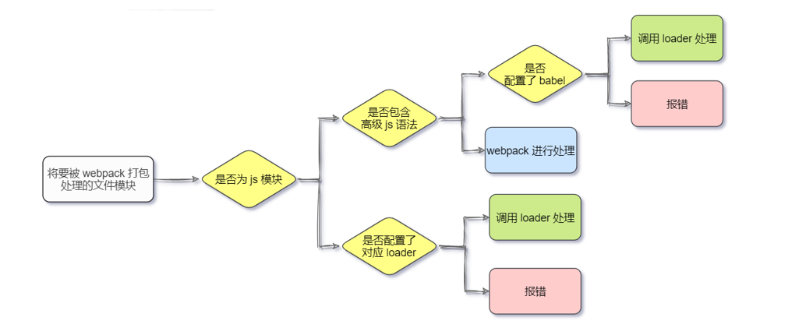

# Node

[Node.js](https://nodejs.dev/en/) 是一个基于 `Chrome V8引擎` 的 `JavaScript` 运行时环境，`Node.js` 可以运行 `JS`文件

# Git

### Git基本概念

[Git](https://git-scm.com/)是一款免费、开源的**分布式**版本控制系统 ，用于敏捷高效地处理任何或小或大的项目。传送门：[参考资料](https://juejin.cn/post/6844904191203213326#heading-0)

### Git基本操作

* 设置用户名：安装好后第一步

  ```js
  git config  user.name  //查看用户名
  git config  user.email  //查看邮箱

  git config  user.name 用户名  //设置用户名
  git config  user.email 邮箱名  //设置邮箱

  git config  --global user.name 用户名  //设置全局用户名
  git config  --global user.email 邮箱名  //设置全局邮箱

  git config --list  //查看配置信息

  git config --unset --global user.name //删除全局配置
  git config --unset --global user.email  //删除全局配置
  ```
* 初始化仓库：要管理得文件夹里面初始化

  ```js
  git init  //初始化仓库
  git init -y//就不用一直点yes了
  ```
* 查看是否保存

  ```js
  git status //用来查看文件的状态,红色表示工作区中的文件需要提交,绿色表示暂存区中的文件需要提交
  git status -s //简化日志输出格式
  ```
* 保存仓库：先add后commit

  ```js
  git add index.html  //将index.html添加到暂存区
  git add css  //将css目录下所有的文件添加到暂存区
  git add *.js  //将当前目录下所有的js文件添加到暂存区

  //添加当前目录下所有的文件
  git add .
  git add -A
  git add --all


  git commit -m"提交说明"  //将文件从暂存区提交到仓库
  git commit -am "本次提交说明"  //add和commit的合并，便捷写法
  git commit --amend -m"提交说明"  //修改最近的一次提交说明， 如果提交说明不小心输错了，可以使用这个命令
  ```
* 查看版本号

  ```js
  git log//查看提交的日志
  git log --oneline  //只能看到现在版本之前的信息（若之前回退过，那回退版本之后的是看不到的）
  git reflog --oneline  //可以看到所有保存的版本信息
  ```
* 版本回退

  ```js
  git reset --hard 版本号  //将代码回退到某个指定的版本(版本号只要有前几位即可)

  git reset --hard head~0  //将版本回退到当前提交
  git reset --hard head~1  //将版本回退到上一次提交
  git reset --hard head~2  //将版本回退到上上次提交
  ```
* 配置忽视文件：在仓库的根目录创建一个`.gitignore`​的文件，文件名是固定的(txt改后缀)。

  ```js
  # 忽视idea.txt文件
  idea.txt

  # 忽视css下的index.js文件
  css/index.js

  # 忽视css下的所有的js文件
  css/*.js

  # 忽视css文件夹
  css

  # 忽视node_modules文件夹
  node_modules/
  ```

### Git分支操作

* 查看分支：在`git`​中，有一个特殊指针`HEAD`​,永远会指向当前分支

  ```js
  git branch //查看本地分支
  git branch -r  //查看远程分支
  git branch -a  //查看所有分支，包括远程分支
  ```
* 创建分支

  ```js
  git branch 分支名称  //创建分支，分支中的代码，在创建时与当前分支的内容完全相同
  ```
* 切换分支：分支操作，最好是先`add commit`​

  ```js
  工作区、暂存区对所有分支而言，都是公共的，在切换分支时，工作区、暂存区的内容都会被带过去，所有要先保存
  git checkout 分支名称  //切换到目标分支
  git checkout -b 分支名  //创建并切换分支
  git checkout -b dev  //创建并切换分支
  ```
* 删除分支：不能在当前分支删除当前分支，需要切换到其他分支才能删除

  ```js
  git branch -d 分支名  //删除分支,如果该分支有提交未进行合并，则会删除失败
  git branch -D 分支名  //强制删除，就算没有进行合并操作也可以删除
  git branch -d dev  //创建并切换到dev分支
  ```
* 合并分支：要先切换到要合并得分支

  ```js
  git merge 分支名  //把其他分支内容合并到当前分支
  ```
* 取消合并

  ```js
  //发现分支冲突后没做其他修改可以取消合并，如果合并的时候，有未提交的更改，或者合并后又修改了一些，取消合并可能会出现错误
  git merge --abort  //取消合并
  ```

### Git远程操作

* 远程关联：注意：关联之后，如果本身有东西，是无法直接push的，要先pull然后合并冲突，再add、commit再push

  ```js
  git remote -v  //查看当前所有远程地址别名
  git remote add origin（别名） 仓库地址  //给远程仓库设置一个别名
  git remote remove origin  //删除origin这个别名

  //事例
  git remote add origin https://gitee.com/wwshuishui/test.git  //添加远程仓库
  git push -u origin "master"  //将本地仓库和远程仓库建立联系，并推送master分支
  ```
* 远程克隆

  ```js
  git clone 项目地址  //只有一个master分支，其他分支都隐藏了
  git cloen -b 分支名 远程仓库地址  //克隆指定分支
  git branch -a  //可以看到红色的隐藏分支
  git checkout -t origin/分支名  //获取远程分支

  //事例
  git clone git@gitee.com:jepsonpp/test.git
  git clone -b dev git@gitee.com:jepsonpp/test.git
  ```
* 远程推送：把本地得推送到远程仓库

  ```js
  git push  //当前分支只有一个远程分支,本地分支名和远程分支名一样
  git push 远程主机名 本地分支名:远程分支名  //完整版
  git push origin master:master  //如果本地分支名与远程分支名相同，则可以省略冒号
  git push --force origin master  //本地版本和远程有差异，强制推送覆盖远程
  ```
* 远程拉取：把远程得代码拉到本地

  ```js
  git pull  //当前分支只有一个远程分支,本地分支名和远程分支名一样
  git pull 远程主机名 分支名
  git pull origin login  //获取远程分支的更新，并更新合并到login分支


  git fetch  //需要自己合并，full是帮你合并了
  git fetch orgin master  //将远程仓库的master分支下载到本地当前branch中
  ```
* 远程删除

  ```js
  git branch -a  //可以看的远程分支

  git push origin --delete 分支名  //删除远程分支
  git push origin --d 分支名
  ```

# Node基础

## Node模块

### global模块

类似于 `window` 对象，`global模块`是`node` 中的全局模块，除了`global模块`（全局模块）中的内容可以直接使用，其他模块都是需要加载

```js
//window 浏览器中的全局对象
//global nodejs中的全局对象,node里面使用 global里面的变量,不需要引入

//当前执行的文件所在的 文件夹 的绝对路径
console.log(__dirname)// C:\Users\hulinghao\Desktop\xxx\Node.js - day01\04-源代码
//当前执行的 文件 的绝对路径
console.log(__filename)// C:\Users\hulinghao\Desktop\xxx\Node.js - day01\04-源代码\global模块测试.js
```

### fs模块

* 概念：fs 模块不是全局的，不能直接使用。因此需要导入才能使用。

* 读取文件：`fs.readFileSync('文件路径', '编码格式')`

  ```js
  // 1. 导入fs内置模块。类似于 script src="xxx.js"
  const fs = require('fs')  // console.log('fs:', fs)

  // 2. 调用提供的方法
  // 不设置编码格式,返回的是Buffer对象(js中表示进制数据的格式)
  const res = fs.readFileSync('./info/a.txt')
  console.log('res:', res)

  // 设置了编码格式之后,会返回对应编码的内容
  const res = fs.readFileSync('./info/a.txt', 'utf-8')
  console.log('res:', res)
  ```
* 关于 Buffer 对象

  ```js
  Buffer对象是Nodejs用于处理二进制数据的。
  其实任意的数据在计算机底层都是二进制数据，因为计算机只认识二进制。
  所以读取任意的文件，返回的结果都是二进制数据，即Buffer对象。
  Buffer对象可以调用toString()方法转换成字符串。
  ```
* 写文件：`fs.writeFileSync('路径', 内容)`。覆盖写入，返回值是`undefined`，文件不存在会创建文件，文件夹不存在会报错。

  ```js
  // 1. 导入fs内置模块
  const fs = require('fs')

  const data = `
  咏鸭-某黑鸭
  嘎嘎嘎
  曲项向天歌
  黄毛浮黑水
  黄掌拨红油
  `
  try {
    const res = fs.writeFileSync('./msg/b.txt', data)
    console.log('res:', res)
  } catch (error) {
    console.log('写入失败')
  }
  ```

### path模块

Node.js 提供的处理路径的模块 `path`，提供了很多处理路径的方法和属性，也是一个内置模块

```js
// 1. 导入path
const path = require('path')

// 2. __dirname(文件夹) __filename(文件)
const res3 = path.join(__dirname, './score/总成绩.txt')
console.log('res3:', res3)
```

### http模块

`http`也是内置模块, `Node.js` 官方提供的、用来创建web 服务器的模块。它提供了一系列的方法和属性,让开发者(咱们)可以用代码来创建服务器,接收**请求**及响应**内容**

* 创建最基本web服务器

  ```js
  // 1. 导入 http 模块
  const http = require('http')

  // 2. 创建 web 服务器实例
  const server = http.createServer()

  // 3. 启动服务器
  // 3000 端口号
  server.listen(4399, () => {
    console.log('my server start work')
  })

  // 4. 为服务器实例绑定 request 事件，监听客户端的请求,当客户端发送请求到服务器的时候，会触发这个事件
  server.on('request', (request, response) => {  // request ,response 形参。名字可以改,如非必要不建议改
    // console.log('request:', request)
    console.log('request.method:', request.method)
    console.log('request.url:', request.url)
    // console.log('response:', response)
    // 这里要处理客户端的请求
    console.log('hello html')
    // response.end('（￣︶￣）↗　')
    // 设置响应头
    response.setHeader('info', 'good good study daydayup')
    // 设置状态码
    response.statusCode = 404
    // 响应内容给客户端
    response.end('nice to meet you')
  })
  ```
* `request(请求)对象`常见属性

  ```js
  headers:所有的请求头信息
  method:请求的方式
  url:请求的地址
  ```
* `response(响应)对象`常见属性和方法

  ```js
  res.write(data);  给浏览器发送响应体，可以调用多次，从而提供连续的请求体
  res.end();   通知浏览器，所有响应头和响应主体都已被发送，即服务器将其视为已完成。
  res.end(data); 结束请求，并且响应一段内容，相当于res.write(data) + res.end()
  res.statusCode: 响应的的状态码 200 404 500
  res.statusMessage: 响应的状态信息， OK Not Found ,会根据statusCode自动设置。
  res.setHeader(name, value); 设置响应头信息， 比如content-type
  res.writeHead(statusCode, statusMessage, options); 设置响应头，同时可以设置状态码和状态信息。
  ```
* 中文乱码问题：当调用 `res.end()` 方法，向客户端发送中文内容时，会出现乱码问题，需要手动设置内容编码格式

  ```js
  //setHeader('Content-Type','text/plain; charset=utf-8');设置内容的格式,让浏览器知道如何解析
  // 普通文本
  res.setHeader('Content-Type', 'text/plain; charset=utf-8');
  // html
  res.setHeader('Content-Type', 'text/html; charset=utf-8');
  ```
* 根据`url`响应不同的`html内容`：服务器返回的内容由服务器说了算

  ```js
  // 1. 导入 http 模块
  const http = require('http')

  // 2. 创建 web 服务器实例
  const server = http.createServer()

  // 3. 启动服务器
  // 3000 端口号
  server.listen(3000, () => {
    console.log('my server start work')
  })

  // 4. 为服务器实例绑定 request 事件，监听客户端的请求
  server.on('request', (request, response) => {
    // 设置响应头 响应的内容 html标签编码格式为 utf-8
    response.setHeader('Content-Type', 'text/html; charset=utf-8')
    if (request.url === '/' || request.url === '/index.html') {
      response.end(' <h1> 我是首页</h1>')
    } else if (request.url === '/about.html') {
      response.end('<h1> 我是about页面</h1>')
    } else {
      response.statusCode = 404
      response.end('<h1> 404 not found</h1>')
    }
  })
  ```

<br />

### 全局模块

* 全局模块指令：全局安装的模块，在系统盘（C 盘）,通过命令 `npm root -g` 可以查看全局安装路径

  ```js
  //安装
  npm i 模块名 -g
  npm i -g 模块名
  //卸载
  npm un 模块名 -g
  # 或者
  npm uninstall 模块名 -g
  ```

* `nrm` ：是作用是切换镜像源

  ```js
  npm i -g nrm  //全局安装nrm
  nrm --help   # 查看帮助
  nrm ls    # 查看全部可用的镜像源
  nrm test # 测试各个源的速度
  nrm use taobao  # 切换到淘宝镜像
  nrm use npm  # 切换到npm主站
  ```
* ​`serve`​：功能和自己编写的 web 服务器类似，通过 `serve`​ 托管并测试访问

## 模块化规范

### AMD

```js
- AMD规范采用异步方式加载模块，模块的加载不影响它后面语句的运行。
- 聊到AMD主要指的是通过require.js实现的模块化
- 项目中看到类似代码说明用的是AMD规范

// 执行基本操作
require(["jquery","underscore"],function($,_){
  // some code here
});
```

### CMD

```js
- CMD是另一种js模块化方案，它与AMD很类似。
- 不同点在于：AMD 推崇依赖前置、提前执行，CMD推崇依赖就近、延迟执行。
- 项目中看到类似代码说明用的是CMD规范

// 执行基本操作
define(function(require, exports, module) {
    var a = require('./a'); //在需要时申明
    a.doSomething();
    if (false) {
        var b = require('./b');
        b.doSomething();
    }
});
```

### CommonJS

```js
Node.js是CommonJS规范的主要实践
```

### EMS

```js
- 也叫做ES6 Module
- ES6 在语言标准的层面上，实现了模块功能，逐步会成为浏览器和服务器通用的模块解决方案
```

## 第三方包管理

node.js安装完成之后，自带有npm了，可以使用npm下载使用依赖包。

### npm

1. 初始化命令：初始化之后，会在项目目录中生成 `package.json` 的文件。

    ```js
    npm init -y
    # 或
    npm init
    # 然后一路回车
    ```
2. 切换镜像地址：下载速度可以快一点

    ```js
    下面的命令只需要执行一次即可（不管以后重启vscode还是重启电脑，都不需要执行第二次）
    npm config set registry https://registry.npmmirror.com
    ```
3. 安装第三方包

    ```js
    # 正常的下载安装
    npm install 模块名
    ​
    # 简写install为i
    npm i 模块名
    ​
    # 一次性安装多个模块
    npm i 模块名 模块名 模块名
    # 可以通过@版本号,不设置默认是最新
    npm i 模块名@版本号
    ```
4. 卸载第三方包

    ```js
    npm uninstall 模块名
    npm un 模块名
    npm un 模块名 模块名 模块名
    ```

### yarn

​`npm`​是官方的管理工具，`yarn`​是第三方的包管理工具 , 和`npm`​相比有**缓存机制**，可以直接取缓存没必要重新下载，速度比`npm`​快一些。

* 基本命令

  ```js
  1.安装yarn
  npm i yarn -g    // 全局安装使用yarn

  2.初始化
  yarn init  //  yarn init -y

  3.安装插件
  npm:   npm i 插件名
  yarn:  yarn add 插件名
         yarn global add 插件名//全局安装

  4.安装所有依赖
  npm:   npm i
  yarn:  yarn

  5.删除插件
  npm:   npm uninstall  插件名
  yarn:  yarn remove 插件名
         yarn global remove 插件名//全局卸载

  6.运行项目
  npm:   npm run serve
  yarn:  yarn serve

  7.设置淘宝镜像
  npm:   npm config set registry http://registry.npm.taobao.org/
  yarn:  yarn config set registry http://registry.npm.taobao.org/

  8.npm换成yarn：删掉node_module,package-lock.json然后安装使用yarn
  ```

# [Webpack](https://www.webpackjs.com/)

## 基本设置

* 测试打包模板

  ```js
  git clone https://gitee.com/westblueflower/webpack-lesson.git//拉取基本模板，可以用来测试webpack
  ```
* `webpack.config.js`：是`Webpack`的配置文件，在项目根目录里。**vue中是vue.config.js**

  ```js
  const path = require('path')// 导入node.js的path模块
  const HtmlWebpackPlugin = require('html-webpack-plugin')//导入插件
  //webpack配置
  module.exports = {
    devtool: 'source-map',// 是否开启source map，生成独立的map文件，开发使用，上线删除
    mode: 'development',// 打包模式 development 开发 / production 生产
    entry: path.resolve(__dirname, 'src', 'index.js'),//设置打包入口文件，path模块用在这里
    // 开发服务器
    devServer: {//npm run serve 实时打包，打包文件在内存中，需要安装插件
      port: 9000, // 实时打包所用的端口号
      open: true, // 初次打包完成后，自动打开浏览器
      static: path.join(__dirname, './dist'),// 服务器的根目录
      hot: false,//是否开启热替换
    },
    // 打包到哪里
    output: {
      path: path.resolve(__dirname, 'dist'),// 使用绝对路径
      filename: 'bundle.js',// 打包出来的文件名
      clean: true,// 每次打包时清除上一次的dist目录
      assetModuleFilename: 'images/[hash][ext][query]',
    },
    // 模块配置，默认只能打包js，安装插件，可以打包css，less等其他格式文件
    module: {
      // 解析规则
      rules: [
        {
          test: /\.css$/i, // .css结尾的文件
          use: ['style-loader', 'css-loader'], // 通过 这2个 loader进行解析
        },
        {
          test: /\.less$/i, // .less结尾的文件
          use: [
            // 使用如下的loader进行解析
            'style-loader',
            'css-loader',
            'less-loader',
          ],
        },
        {
          test: /\.(png|svg|jpg|jpeg|gif)$/i, // 图片资源
          type: 'asset/resource', // 生成一个单独的文件，并设置url
        },
      ],
    },
    // 插件配置，wbepack默认只打包js，HtmlWebpackPlugin可以生成index.html文件并把js放进去
    plugins: [
      new HtmlWebpackPlugin({
        inject: 'body',// js插入的位置
        filename: 'index.html',// 打包之后的文件名
        template: path.resolve(__dirname, './public/index.html'),// 使用哪个文件作为模板
      }),
    ],
  }
  ```
* [package.json](https://juejin.cn/post/6870426598605062152)：可以设置打包所使用的插件和插件设置(`scripts`中设置)，以及选择打包环境

  ```js
  {
    "name": "test-project", // 名称，通常是github仓库名称
    "author": "xxx", // 作者的信息
    "contributors": ["xxx", "xxxx"], // 贡献者信息数组
    "bugs": "https://github.com/nodejscn/node-api-cn/issues", // bug信息，通常是github的issue页面
    "homepage": "http://nodejs.cn", // 发布项目时，项目的主页
    "version": "1.0.0", // 当前版本, 遵循semver语义版本控制规范，具体含义将在后面详细解释
    "license": "MIT", // 许可证信息
    "keywords": ["xxx", "xxxx"], // 关键字数组
    "description": "A Vue.js project", // 描述信息
    "repository": "git://github.com/xxxx.git", // 仓库地址
    "main": "src/main.js", // 当引用这个包时，应用程序会在该位置搜索模块的导出
    "private": true,  // 防止包意外的发布到npm上，如果是true，npm将拒绝发布
    "scripts": {
      "dev": "webpack --config webpack.config.js",//配置开发模式打包
      "watch": "webpack watch --config webpack.config.js",//配置watch模式
      "build": "webpack  --config webpack.config.js --mode production",//配置生产模式打包
      "serve": "webpack serve --config webpack.config.js"//配置虚拟服务器

    }, // 可运行的node脚本，通常命令是npm run serve
    "dependencies": {
      "core-js": "^3.6.5",
      "vue": "^3.0.0-0",
      "vue-router": "^4.0.0-0",
      "vuex": "^4.0.0-0"
    }, // 生产环境所依赖的安装包
    "devDependencies": {
      "@vue/cli-plugin-babel": "~4.5.0",
      ...
    } // 开发环境所依赖的安装包
    "engines": {
      "node": ">= 6.0.0",
      "npm": ">= 3.0.0"
    }, // 要运行的 Node.js 或其他命令的版本，但似乎没卵用，可参考https://github.com/nodejs/node/issues/29249
    "browserslist": ["> 1%", "last 2 versions", "not ie <= 8"]  //支持的浏览器及其版本号，polyfill时会用到
  }

  ```
* 安装`webpack`命令

  ```js
  //安装webpack---两个命令是一个意思：将安装包记录成开发阶段的依赖
  //  --save 保存到 package.json 中
  //  -dev 开发依赖，只在开发阶段使用
  //dependences: 项目依赖, 项目上线也要用的
  //devDependencies: 开发依赖, 只在开发中使用, 上线时不要用的
  npm i webpack --save-dev
  npm i webpack -D
  ```
* 打包命令

  ```js
  npm run dev//开发环境打包
  npm run build//生产环境打包
  ```

## 设置说明

### 模式设置

* 概念

  ```js
  开发环境development:不会对打包生成的文件进行代码压缩和性能优化，打包速度快
  生产环境production:默认设置，会对打包生成的文件进行代码压缩和性能优化，打包速度很慢
  ```
* 设置开发或生产模式：设置`/webpack.config.js`，增加设置`mode`

  ```js
  // 导入path模块
  const path = require('path')

  module.exports = {
    mode: 'development',// 打包模式 development 开发 / production 生产

    // 打包的入口文件
    entry: path.resolve(__dirname, 'src', 'index.js'),
    // 打包到哪里
    output: {
      // 使用绝对路径
      path: path.resolve(__dirname, 'dist'),
      // 打包出来的文件名
      filename: 'bundle.js',
    },
  }
  ```
* 设置打包命令：`package.json` 中增加打包命令

  ```js
  "scripts": {
    "dev": "webpack --config webpack.config.js",//配置开发模式打包
    "watch": "webpack watch --config webpack.config.js",//配置watch模式
    "build": "webpack  --config webpack.config.js --mode production",//配置生产模式打包
    "serve": "webpack serve --config webpack.config.js"//配置虚拟服务器

  },
  ```
* 打包命令：看你怎么设置得

  ```js
  npm run dev//开发环境打包
  npm run build//生产环境打包
  ```

### 清理设置

清理dist目录：`output.clean`默认不开启，那么上一次打包生成的dist文件不会删除，这次打包的文件还是在上一次的dist中，导致可能原先的文件存在导致后面看代码文件造成混乱。

开启后会把文件出口文件删除后在继续打包，重新改出口名，原文件不在新出口，是不会删除的。

* `/webpack.config.js`中设置**增加清理** `dist` 目录的配置

  ```js
  module.exports = {
    ...
    output: {
      // 使用绝对路径
      path: path.resolve(__dirname, 'dist'),
      // 打包出来的文件名
      filename: 'bundle.js',
      // 每次打包时清除dist目录
      clean: true,
    },
    ...
  }
  ```

### 热替换设置

`HMR`：修改了代码并保存时，`HMR` 会在应用程序运行过程中替换、添加或删除模块，而**无需重新加载整个页面（入口代码修改还是会刷新）**。

开启了 `dev-server` 之后，会**默认开启**​`HMR(hot module replacement)`。

* `HMR` 主要通过以下几种方式，来显著加快开发速度：

  * **保留在完全重新加载页面时丢失的应用程序状态；**
  * **只更新变更内容，以节省宝贵的开发时间；**
  * **调整样式更加快速 - 几乎相当于在浏览器调试器中更改样式。**

在`webpack.config.js`中进行设置

```js
module.exports = {
  // 开发服务器
  devServer: {
    port: 9000, // 实时打包所用的端口号
    open: true, // 初次打包完成后，自动打开浏览器
    // 服务器的根目录
    static: path.join(__dirname, './dist'),
    hot: true,// 模块热替换 true / false 开启 / 关闭
  },
}
```

### 映射设置

就是一个信息文件，里面储存着位置信息。存储着压缩混淆后的代码，所对应的**转换前**的位置。

设置开启，会在项目打包后会生成`.map`文件，出错的时候，除错工具将直接显示原始代码，而不是转换后的代码，能够极大的方便后期的调试。

注意:开发阶段辅助调错，**上线一定要移除，避免源码泄露**。

在`webpack.config.js`中进行设置

```js
//开发中需要排错，需要准确的定位错误行号
module.exports = {
  // source-map 仅限在开发模式中使用
  devtool: 'source-map',//（生产环境，我们不希望别人看到我们的源码，注释该配置即可）
}
```

### watch设置

开启 `watch` 模式启动自动化打包：检测打包入口，以及打包入口引用的文件是否发生变动，如果发生变动，就重新打包。

`watch` 是内置的，不需要下载，文件发生变动后，文件自动打包，但是网页需要自己刷新。

调整 `package.json` 中的 `scripts` 开启`watch` 模式，然后启动命令：`npm run watch`

```js
"scripts": {
  "dev": "webpack --config webpack.config.js",
  "watch": "webpack watch --config webpack.config.js",
}
```

## 相关插件

### html-webpack-plugin

`Webpack`默认只打包`js`，这个插件可以打包时会自动生成`index.html`页面到`dist`文件夹中，自动把打包生成的`js`文件插入到页面中。

* 下载插件

  ```js
  npm i--save-dev html-webpack-plugin //下载插件
  ```
* 设置设置模块页面

  ```js
  <!DOCTYPE html>
  <html lang="en">
    <head>
      <meta charset="UTF-8" />
      <meta http-equiv="X-UA-Compatible" content="IE=edge" />
      <meta name="viewport" content="width=device-width, initial-scale=1.0" />
      <title>测试用模板</title>
    </head>
    <body>
      <div class="box"></div>
    </body>
  </html>

  ```
* **调整** `/webpack.config.js`，**增加插件实例化的配置**

  ```js
  module.exports = {
    ...
    plugins: [
      new HtmlWebpackPlugin({//实例化
        inject: 'body',// js插入的位置
        filename: 'index.html',// 打包之后的文件名
        template: path.resolve(__dirname, './public/index.html'),//设置页面样本地址
      }),
    ],
  }
  ```

### loader

`loader` 是文件加载器，能够加载资源文件，并对这些文件进行特定的处理，然后打包在指定文件中，**简单来说就是将** `webpack` 传入的字符串做出特定的处理修改。

`webpack` 默认只能解析 `js` 模块，如果是其他的文件需要安装对应的 `loader`。

​

1. 下载所需的loader,第三方模块

    ```js
    npm i --save-dev style-loader css-loader//css
    npm i less less-loader --save-dev//less
    ```
2. 调整 `webpack.config.js` 的配置

    ```js
    module.exports = {
      ...
      // 模块配置
      module: {
        // 解析规则
        rules: [
          {
            test: /\.css$/i, // .css结尾的文件
            use: ['style-loader', 'css-loader'], // 通过 这2个 loader进行解析
          },
          {
            test: /\.less$/i, // .less结尾的文件
            use: [
              // 使用如下的loader进行解析
              'style-loader',
              'css-loader',
              'less-loader',
            ],
          },
        ],
      },
    }
    ```
3. 在打包的`index.js`中导入所要使用的`css`、`less`文件

    ```js
    // 导入css 
    // import './assets/base.css'
    // 导入less
    import './assets/less/index.less'
    ```
4. 运行打包

    ```bash
    npm run dev
    ```

### webpack-dev-server

`webpack-dev-server` 的本质是开启了一个测试用服务器，`dev-server`，开启一个服务器，并自动监测文件变更，刷新页面。

凡是修改了`webpack.config.js ​`配置文件，或修改了`​ package.json ​`配置文件，必须重启实时打包的服务器，否则最新的配置文件无法生效。

1. 下载`webpack-dev-server`：

    ```bash
    npm i --save-dev webpack-dev-server
    ```
2. 修改 `/webpack.config.js`，**增加** `devServer` 的配置

    ```js
    module.exports = {
      ...
      // 开发服务器
      devServer: {
        port: 9000, // 实时打包所用的端口号
        open: true, // 初次打包完成后，自动打开浏览器
        // 服务器的根目录
        static: path.join(__dirname, './dist'),//即文件打包后放的位置
      },
      ....
    }
    ```
3. 设置 `package.json`，增加一条命令

    ```js
    "scripts": {
      "dev": "webpack --config webpack.config.js",//设置打包模式
      "watch": "webpack watch --config webpack.config.js",//开启watch模式
      "serve": "webpack serve --config webpack.config.js"//开启虚拟服务器
    },
    ```
4. 执行命令，运行项目

    ```bash
    npm run serve
    ```
5. 注意点

    1. 配置了 webpack-dev-server 之后，打包生成的文件存放到了内存中

        1. 不再根据 output 节点指定的路径，存放到实际的物理磁盘上
        2. 提高了实时打包输出的性能，因为内存比物理磁盘速度快很多
        3. **看不到** `dist` 目录
    2. `http://localhost:9000/`

        1. 访问的是 `devServer` 配置中 `static` 的根目录
        2. `/index.html` 可以省略不写

‍
