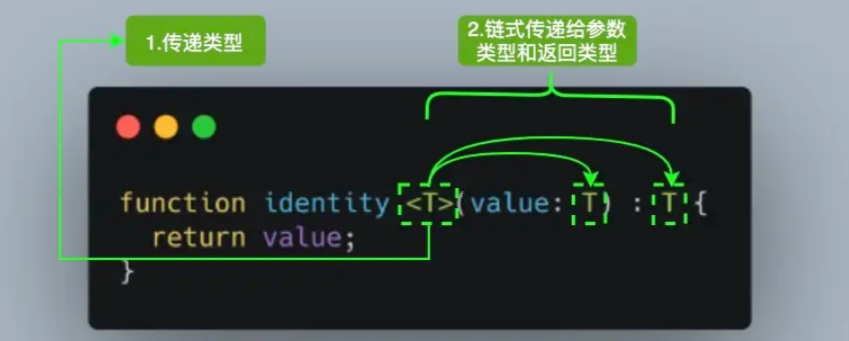

# TypeScript

# TypeScript

## 基本概念

```js
TS会在编译的时候进行静态检查
any类型就是类型系统的一个逃逸舱，是一个全局的超级类型
nukonwn也是一种全局的超级类型，
```

### 安装下载

* 安装编译TS的工具包：node只能识别js代码，安装编译包可以把ts代码转成js代码

  ```bash
  npm i -g typescript
  tsc –v (查看 typescript 的版本)
  tsc xxx.ts //把ts文件转成node可执行的js文件
  ```

### 类型注解

* 类型注解：类型注解可以为变量添加类型约束

  ```js
  let age:number = 18
  ```
* 类型概述

  ```js
  已有简单类型:number/string/boolean/null/undefined
  已有复杂类型:数组\对象\函数等

  新增类型:
  联合类型\自定义类型(类型别名)\接口\元组\字面量类型\void\枚举...
  ```
* 简单数据类型注解

  ```js
  // 数值类型
  let age: number = 18
  // 字符串类型
  let myName: string = '小花'
  // 布尔类型
  let isLoading: boolean = false
  // undefined
  let un: undefined = undefined
  // null
  let timer:null = null
  // symbol
  let uniKey:symbol = Symbol()
  ```

### 类型推论

```js
在 TS 中，某些没有明确指出类型的地方，TS 的类型推论机制会帮助提供类型
即，定义变量或函数的时候，不用特意去定义类型，系统会自动根据你的值来给数据类型
1.声明变量并赋初始值时
2.决定函数返回值时
```

### 类型断言

```js
有时候你会比TS更加明确一个值的类型，此时，可以使用类型断言来指定更具体的类型。
即，你可能知道里面值得类型，但是不知道里面具体的值就使用类型断言，先给个空的再as一下，告诉系统其实是这个as之后的东西
类型断言好比其他语言里的类型转换，但是不进行特殊的数据检查和解构。它没有运行时的影响，只是在编译阶段起作用。
type TObj = {
  name：string,
  age:number
}
let obj : TObj = {} as TObj
let obj : TObj = <TObj>{}
```

### 非空断言

```js
在上下文中当类型检查器无法断定类型时，可以使用缀表达式操作符 ! 进行断言操作对象是非 null 和非 undefined 的类型。
即x!的值不会为 null 或 undefined(有时候要.出去的那个值有可能是null或者undefined的时候，你使用.操作，系统会提示报错)
也就是说，使用 x!. 告诉系统，这里肯定可以进行点操作的
let user: string | null | undefined;
console.log(user!.toUpperCase()); // 编译正确
console.log(user.toUpperCase()); // 错误。是null的时候是无法点操作的
```

### 确定赋值断言

```js
我们定义了变量, 没有赋值就使用，则会报错
通过 let x!: number; 确定赋值断言，TypeScript 编译器就会知道该属性会被明确地赋值。
let value:number
console.log(value); // Variable 'value' is used before being assigned.
let value!:number
console.log(value); // undefined 编译正确
```

## 数据类型

### 数组类型

```js
// 写法1:
let 变量: [] = [值1，...]:
let numbers: number[] = [1, 3, 5] 
//  numbers必须是数组，每个元素都必须是数字
// 写法2:
let 变量: Array<类型> = [值1，...]
let strings: Array<string> = ['a', 'b', 'c'] 
//  strings必须是数组，每个元素都必须是字符串
```

### 函数类型

* 函数涉及的类型实际上指的是：`函数参数类型`和`返回值类型`
* 单个函数定义

  ```js
  // 普通函数
  function 函数名(形参1:类型=默认值,形参2:类型=默认值,...): 返回值类型 {}

  // 声明式实际写法:
  function add(num1: number, num2: number): number {
    return num1 + num2
  }

  let fn2:(num1:number)=>number=function(){}


  // 箭头函数
  const 函数名（形参1:类型=默认值,形参2:类型=默认值, ...):返回值类型 => { }
  const add2 = (a: number =100, b: number = 100): number =>{
     return a + b
   }
   // 注意： 箭头函数的返回值类型要写在参数小括号的后面
  add（1,'1') // 报错
  ```
* 类型别名

  ```js
  type Fn = (n1:number,n2:number) => number 
  const add3 : Fn = (a,b)=>{return a+b }
  ```
* 返回值void：即没有返回值，强制`return`得话，也不会报错

  ```js
  // 如果什么都不写，此时，add 函数的返回值类型为: void
  const add = (num1: number):void => {}

  // 如果return之后什么都不写，此时，add 函数的返回值类型为: void
  const add = (num1: number):void => { return }

  // 如果return的undefined,是你自己明确返回的undefined，不是计算之后得到的undefined
  const add = (num1: number):undefined => {
    return undefined  // 返回的 undefined是JS中的一个值
  }
  ```
* 可选参数

  ```js
  function slice (a?: number, b?: number):void {
      // ? 跟在参数名字的后面，表示可选的参数,可选参数只能在必须参数的后面
      // 如果可选参数在必选参数的前面，会报错
      console.log(111);  
  }

  注意可选和默认值的区别:
  设置了默认值之后，就是可选的了，不写就会使用默认值，
  可选和默认值它们不能一起使用。优先使用默认值
  ```

### 对象类型

* 基本使用

  ```js
  const 对象名: {
    属性名1:类型1,
    属性名2?:类型2,
    方法名1(形参1: 类型1,形参2: 类型2):返回值类型,
    方法名2:(形参1: 类型1,形参2: 类型2) => 返回值类型
  } = { 属性名1: 值1，属性名2: 值2  }

  // 空对象
  let person: {} = {}

  // 有属性的对象
  let person: { name: string } = {
    name: '同学'
  }

  // 在一行代码中指定对象的多个属性类型时，使用;(分号)来分隔
  let person: {name: 'jack'; greet1(name: string):void; greet2: (name: string) => void} = {
    name: 'jack',
    greet1() {},
    greet2:()=>{}
  }

  // 对象中如果有多个类型，可以换行写，通过换行来分隔多个属性类型，可以去掉 ; 
  let person: {
    name: string
    greet1(name: string):void
    greet2: (name: string) => void
  } = {
    name: 'jack',
    greet1() {},
    greet2:()=>{}
  }
  ```
* 类型别名

  ```js
  // 创建类型别名
  type Person = {
    name: string
    sayHi(): void
  }

  // 使用类型别名作为对象的类型：
  let person: Person = {
    name: 'jack',
    sayHi() {}
  }
  ```
* 可选参数

  ```js
  let obj: {
    name: String
    age: Number
    gender?: Boolean
  } = {
    name: 'xjj',
    age: 18
  }
  ```

### 联合类型

```js
| 竖线，在 TS 中叫做联合类型，即:由两个或多个其他类型组成的类型，表示可以是这些类型中的任意一种。
let 变量: 类型1 | 类型2 | 类型3 .... = 初始值
let arr1 :number | string = 1 // 可以写两个类型
```

### 类型别名

```js
type 别名 = 类型//别名一般首字母大写，也使用T开头

type s = string // 定义
type CustomArray = (number | string)[]

const str1:s = 'abc'
let arr1: CustomArray = [1, 'a', 3, 'b']
```

### 接口

* 概念：当一个对象类型被多次使用时，可以使用类型别名(type)或接口(interface)，以达到复用的目的
* 基本使用：接口名称(比如，此处的`Iobj`)，可以是任意合法的变量名称，推荐以`I`开头

  ```js
  // 使用 interface 关键字
  interface IObj {
    name: String
    age: Number
    gender: Boolean
    sayHi: () => void
  }
  let obj1: IObj = {
    name: '张三',
    age: 18,
    gender: false,
    sayHi: () => console.log('Hi')
  }
  ```
* 和对象类型的区别

  ```js
  接口:只能为对象指定类型。它可以继承。
  类型别名:不仅可以为对象指定类型,实际上可以为任意类型指定别名
  先有的 interface,后有的type,推荐使用 type
  ```
* 接口继承：如果两个接口之间有相同的属性或方法，可以将**公共的属性或方法抽离出来，通过继承来实现复用**

  ```js
  interface Point2D { x: number; y: number }
  interface Point3D { x: number; y: number; z: number }

  interface Point2D { x: number; y: number }
  // 继承 Point2D
  interface Point3D extends Point2D {
    z: number
  }
  ```

### 元组

* 概念：**元组**是一种特殊的**数组** 。

  ```js
  1.它约定了的元素个数
  2.它约定了特定索引对应的数据类型
  ```
* 定义

  ```js
  let arr: number[] = [116.27,39.527]//不严谨，因为该类型的数组中可以出现任意多个数字
  let arr: [number, number] = [116.27,39.527]//元组确切地知道包含多少个元素，以及特定索引对应的类型
  ```

### 字面量

```js
字面量，可以说是限定了变量的取值范围
type Gender = 'girl' | 'boy'
// 声明一个类型，他的值 是 'girl' 或者是 'boy'
let g1: Gender = 'girl' // 正确
let g2: Gender = 'boy' // 正确
let g3: Gender = 'man' // 错误

let str1 = 'Hello TS'
const str2 = 'Hello TS'
str1 是一个变量(let)，它的值可以是任意字符串，所以类型为:string
str2 是一个常量(const)，它的值不能变化只能是'Hello TS'，所以它的类型为:'Hello TS'，这就是字面量
```

### 枚举

```js
1.枚举（enum）的功能类似于字面量类型+联合类型组合的功能，来描述一个值。规定了某些特定的值。
2.该值只能是一组命名常量中的一个。

定义:
enum 枚举名 { 可取值1, 可取值2,.. }

使用:
枚举名.可取值
```

### any类型

```js
当类型设置为 any 时，就取消了类型的限制,不推荐使用any这会让TypeScript变为“AnyScript”(失去TS类型保护的优势)
隐式 any，有下面两种情况会触发:
1.声明变量不提供类型也不提供默认值
2.定义函数时，参数不给类型

let obj: any = { x: 0 }
obj.bar = 100
obj()
// obj 可以是任意类型
const n: number = obj
```

### 泛型

* 概念：泛型，类型的占位，**不预先指定具体的类型，而是在使用的时候在指定类型限制**的一种特性。  
  ​​
* 泛型约束：用来约束泛型，即限制泛型的数据类型

  ```js
  //定义一个函数：函数的参数必须有一个属性： length
  interface ILength {
    length: number
  }
  //限制了T肯定有length属性
  function fn<T extends ILength> (a: T): T {
    console.log(a.length)
    return a
  }

  let arr: Array<number> = [1, 2, 3]
  fn(arr)
  ```
* 泛型函数：泛型函数，使用泛型的函数

  ```js
  //先定义，用泛型占领占位
  function fn<type>(a:type):tpye{return a}

  //使用的时候，在明确泛型的具体类型
  fn<number>(1)
  fn<string>('a')
  fn('b')
  ```
* 泛型接口：使用泛型的接口

  ```js
  interface IObj<T> {
    name: string
    age: number
    gender: number
    height: T
    weight: T
  }

  let o1: IObj<number> = {
    name: 'xjj',
    age: 18,
    gender: 0,
    height: 100,
    weight: 100
  }

  let o2: IObj<string> = {
    name: 'xjj',
    age: 19,
    gender: 0,
    height: '一米八',
    weight: '一百八'
  }
  ```

### 装饰器

* 概念

  ```js
  它是一个表达式
  该表达式被执行后，返回一个函数
  函数的入参分别为 target、name 和 descriptor
  执行该函数后，可能返回 descriptor 对象，用于配置 target 对象

  ```

## vue3

### defineProps

```js
//正常使用
defineProps<{
  msg: String
  moeny?: Number
}>()

//设置默认值
const { msg, moeny = 1111111 } = defineProps<{
  msg: String
  moeny?: Number
}>()

//有默认值需要的设置
// vite.config.js
import { defineConfig } from 'vite'
import vue from '@vitejs/plugin-vue'

// https://vitejs.dev/config/
export default defineConfig({
  plugins: [
    vue({
      reactivityTransform: true
    })
  ]
})
```

### defineEmits

```js
const emit = defineEmits<{
  (e: 'changeMoney', val: number): void
  (e: 'changeCar', val: string): void
}>()
```

### ref

```js
type TObj = {
  name: string
  age: number
  gender: '男' | '女'
}
// 配合 ts 使用（复杂数据类型） - 对象
const obj = ref<TObj>({} as TObj)
// 配合 ts 使用（复杂数据类型）- 数组
const list = ref<TObj[]>([])
```

### reactive

```js
const obj2 = reactive<{
  height: number
  weigth: number
}>({
  height: 180,
  weigth: 180
})

//reactive 可以根据赋值的内容隐式推断出类型
const obj3 = reactive({
  height: 180,
  weigth: 180
})
```

### computed

```js
const leftCount = computed<number>(() => {
  return list.value.filter((item) => item.done).length
})
console.log(leftCount.value)
```
