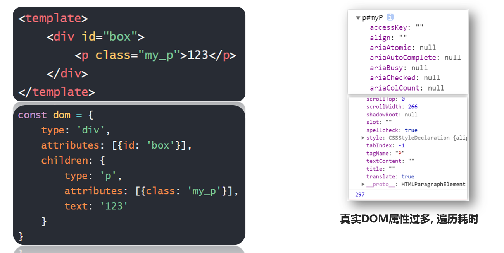
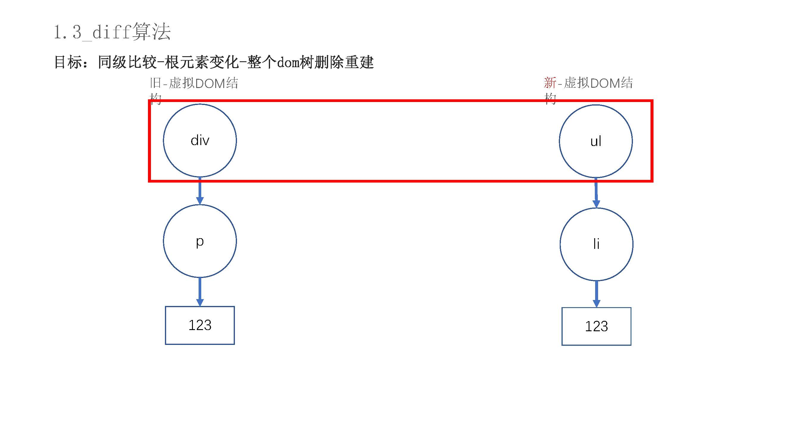
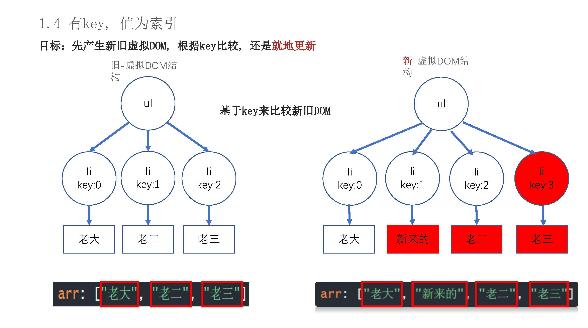
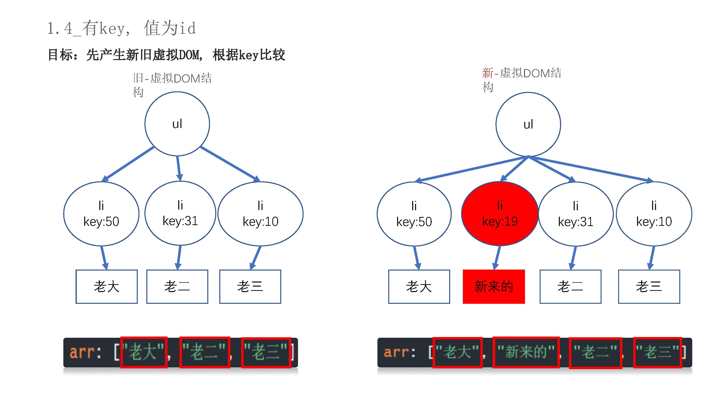
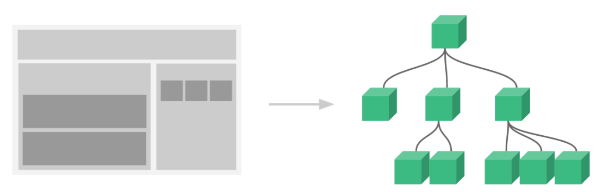
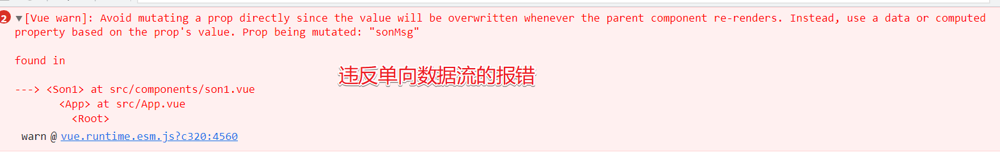
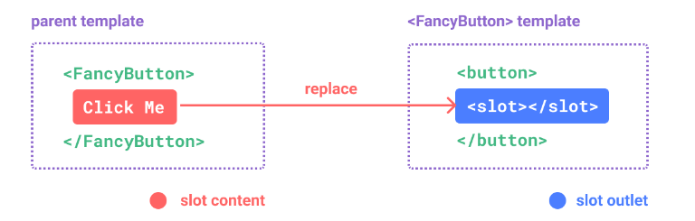
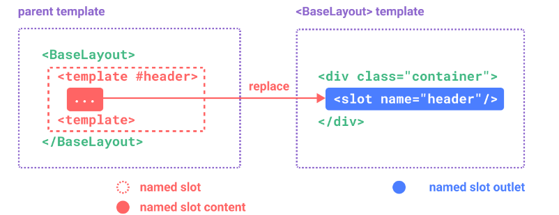
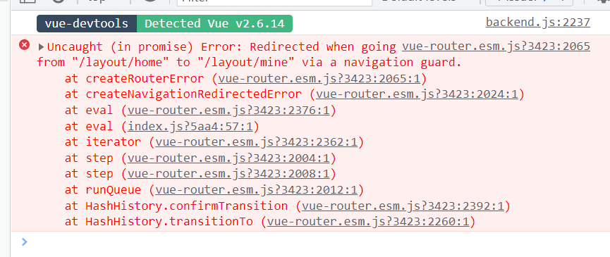

# Vue

# vue

## 基本概念

### 虚拟Dom与diff算法

​​

### vue的this

原生 `Js`​ 中，this 指向是谁绑定事件，`this`​ 就指向谁，Vue 实例中的 `this`​ 指向的是当前这个 `Vue`​ 的实例化对象

Vue 实例中的 `data`​ 数据，`methods`​ 方法都要可以通过 `this.xxx`​ 来进行调用，因为 vue 实例对象在实例化的某个阶段将 `data`​ 和 `methods`​ 里面的数据和方法全部挂载到了实例化对象的最外面。

### 语法糖

语法糖（Syntactic sugar），也译为糖衣语法，指计算机语言中添加的某种语法，这种语法对语言的功能并没有影响，但是更方便程序员使用。通常来说使用语法糖能够增加程序的可读性，从而减少程序代码出错的机会。

简单来说，就是不改变语法的原功能的情况下，通过改变代码的写法，让代码更具有可读性，方便程序员的使用，可以说是代码里面的成语。

### 事件修饰符

事件对象在 `vue`​ 中相对来说用的少。在vue中可以使用修饰符来阻止事件默认行为、阻止冒泡等

* 基本语法

  ```html
  <标签 @事件名.修饰符="方法名"></标签>
  //修饰符可以添加多个
  <标签 @事件名.修饰符1.修饰符2="方法名"></标签>
  ```
* 常见修饰符

  ```js
  .lazy //改变输入框的值时value不会改变，当光标离开输入框时，v-model绑定的值value才会改变
  .trim  //把v-model绑定的值的首尾空格给过滤掉
  .number  //将值转成数字，先输入字符后数值，本次输入无效，先数值后字母，会截取前面数值部分
  .stop  //阻止冒泡
  .capture  //开始事件捕捉
  .self  //只有点击事件绑定的本身才会触发事件
  .once  //事件只执行一次
  .prevent  //阻止默认事件（例如a标签的跳转）
  .native  //加在自定义组件的事件上，可以是自定义组件使用原生click事件等，不用到自定义组件中再去设置
  .left .right .middle  //鼠标的左中右按键触发的事件
  .passive  //给onscroll事件整了一个.lazy修饰符，优化移动端的性能
  .sync  //语法糖，子组件传值方便
  .keyCode(.enter .tab .esc)  //修饰keyup等事件，确定那个键
  ```
* ​`.sync修饰符`​：要想修饰符生效，子组件内部做子传父时，发起数据请求时应该这样写：`this.$emit('updata:数值'，所需数据）`​

  ```html
  //传统父子双向传递时，在子组件标签中的写法
  <子组件 :show="editShow" @update:show="editShow = $event"/>

  //使用.sync修饰符,就相当是上面的写法了，替你写了 @update:show="editShow = $event"
  <子组件 :show.sync="editShow" />


  :show.sync="editShow"   ===   @update:show="editShow = $event"
  ```

### 插值语法

插值语法（胡子语法）：`{{ 数值 }}`​插值语法可以写任意**表达式**，但是不能写代码语句。

表达式像那种三元运算，加减乘除。语句的话像什么定义函数，for 循环那种。

```html
<!-- 只要是被vue管理了，那么{{}}都代表插值语法用来输出某个数据 -->
<div id="app">
  <!-- 你好 -->
  <p>{{ msg }}</p>
  <!-- 10 -->
  <p>{{ 10 }}</p>
  <!-- 显示 msg -->
  <p>{{ 'msg' }}</p>
  <!-- 显示 40 -->
  <p>{{ 10 + 30 }}</p>
  <!-- 你好，周彦祖 -->
  <p>{{ msg + '，周彦祖' }}</p>
  <!-- 成年 -->
  <p>{{ age >= 18 ? '成年' : '未成年' }}</p>
</div>
```

### key的作用

```js
1.key 这个特殊的 attribute 主要作为 Vue 的虚拟 DOM 算法提示，在比较新旧节点列表时用于识别 vnode。
2.在没有 key 的情况下，Vue 将使用一种最小化元素移动的算法，并尽可能地就地更新/复用相同类型的元素。
3.如果传了 key，则将根据 key 的变化顺序来重新排列元素，并且将始终移除/销毁 key 已经不存在的元素。

4.当 text 变化时，<span> 总是会被替换而不是更新，因此 transition 将会被触发。
<transition>
  <span :key="text">{{ text }}</span>
</transition>
```

### VNode

* 概念：VNode是一个类，通过属性来描述dom结构的对象
* 节点概念

  ```js
  元素节点:div
  属性节点:class属性
  文本节点:标签内的文字
  注释节点:html中的注释
  ```
* 基本结构

  ```js
  export default class VNode {
    tag: string | void;
    data: VNodeData | void;
    children: ?Array<VNode>;
    text: string | void;
    elm: Node | void;
    ns: string | void;
    context: Component | void; // rendered in this component's scope
    functionalContext: Component | void; // only for functional component root nodes
    key: string | number | void;
    componentOptions: VNodeComponentOptions | void;
    componentInstance: Component | void; // component instance
    parent: VNode | void; // component placeholder node
    raw: boolean; // contains raw HTML? (server only)
    isStatic: boolean; // hoisted static node
    isRootInsert: boolean; // necessary for enter transition check
    isComment: boolean; // empty comment placeholder?
    isCloned: boolean; // is a cloned node?
    isOnce: boolean; // is a v-once node?

    constructor (
      tag?: string,
      data?: VNodeData,
      children?: ?Array<VNode>,
      text?: string,
      elm?: Node,
      context?: Component,
      componentOptions?: VNodeComponentOptions
    ) {
      /*当前节点的标签名*/
      this.tag = tag
      /*当前节点对应的对象，包含了具体的一些数据信息，是一个VNodeData类型，可以参考VNodeData类型中的数据信息*/
      this.data = data
      /*当前节点的子节点，是一个数组*/
      this.children = children
      /*当前节点的文本*/
      this.text = text
      /*当前虚拟节点对应的真实dom节点*/
      this.elm = elm
      /*当前节点的名字空间*/
      this.ns = undefined
      /*编译作用域*/
      this.context = context
      /*函数化组件作用域*/
      this.functionalContext = undefined
      /*节点的key属性，被当作节点的标志，用以优化*/
      this.key = data && data.key
      /*组件的option选项*/
      this.componentOptions = componentOptions
      /*当前节点对应的组件的实例*/
      this.componentInstance = undefined
      /*当前节点的父节点*/
      this.parent = undefined
      /*简而言之就是是否为原生HTML或只是普通文本，innerHTML的时候为true，textContent的时候为false*/
      this.raw = false
      /*静态节点标志*/
      this.isStatic = false
      /*是否作为跟节点插入*/
      this.isRootInsert = true
      /*是否为注释节点*/
      this.isComment = false
      /*是否为克隆节点*/
      this.isCloned = false
      /*是否有v-once指令*/
      this.isOnce = false
    }

    // DEPRECATED: alias for componentInstance for backwards compat.
    /* istanbul ignore next https://github.com/answershuto/learnVue*/
    get child (): Component | void {
      return this.componentInstance
    }
  }
  ```
* 重要的属性

  ```js
  TextVNode 文本节点。
  ElementVNode 普通元素节点。
  ComponentVNode 组件节点。
  EmptyVNode 没有内容的注释节点。
  CloneVNode 克隆节点，可以是以上任意类型的节点，唯一的区别在于isCloned属性为true
  ```

### 动态样式

* 直接设置行内style样式

  ```html
  <标签 v-bind:style="{ 样式名: 数据 }"></标签>
  <标签 :style="{ 样式名: 数据 }"></标签>
  <div :style="{width: w, height: h, backgroundColor: color}"></div>
  ```
* 通过类名设置

  ```html
  <标签 v-bind:class="{类名:布尔值,类名2:布尔值}"></标签>
  <!-- 简写 -->
  <标签 :class="{类名:布尔值,类名2:布尔值}"></标签>
  <标签 :class="[变量1,变量2....]"></标签>//较少
  ```

### scoped

* 属性选择器：`[属性名] { 样式 }`​
* 设置scoped

  ```css
  <style lang="less" scoped>
    ...
  </style>
  ```
* Scoped和属性选择器的关系

  * 如果某个组件加了`scoped`​，那么它会帮这个组件内所有的标签都加一个行内属性：`data-v-自己的hash`​，并且把这个组件里加了`scoped`​ 的`style`​里的样式，变成 `属性选择器[data-v-自己的hash]`​，通过这个操作，就意味着让这些样式只能给自己用了，因为只有自己才有`[data-v-自己的hash]`​的行内属性
  * 也就是说，在设置了`scoped`​中写的样式，这个样式只会作用到该标签上面，如果这个标签里面也有标签，那里面的标签是无法接受到该样式的`scoped`​
* 深度作用选择器：组件加了 `scoped`​，它的样式只能给自己用，子组件的内部标签，**甚至该标签里面的内部标签**，也用不了（相当于你写谁谁才可以用，它的子标签是无法继承它的样式属性）。如果希望某个样式能作用的更深（也就是作用到子组件内部），就要用 **深度作用选择器**，有些不专业的叫法也叫 `样式穿透`​

  ```css
  >>>       less不支持 
  /deep/    less 支持，但是vscode报错
  ::v-deep  推荐，不会报错，less 和 scss 都支持

  <style scoped>
  //加了scoped，会让当前组件里写过的标签用上样式
  //当前组件里没写的标签肯定用不上，所以意味着组件里的子组件内部的标签用不上
  ::v-deep p {
    color: red;//现在p标签作用的更深：能影响到子组件里的标签
  }
  </style>
  ```
* 深度作用选择器原理：就是把这个选择器的 `data-v-hash`​ 的属性选择器提升到前面，变成后代选择器，既然是后代选择器，所有当前组件里的后代就能匹配的上了

  ```css
  p[data-v-hash]{} //交集选择器
  变成了
  [data-v-hash] p{} //后代选择器
  ```

### 事件对象

* 原生：事件对象
* vue：要自己传参又要事件对象，则传入`$event`​

  ```js
  <!-- 如果没加小括号，函数默认就有个参数，参数就是事件对象 -->
  <button @click="fn">点我啊</button>
  fn(e) {
    console.log("fn被调用", e); // 事件对象
  },

  <!-- 如果加了小括号，就代表我要自己手动给这个函数传参，你传什么他就是什么，如果都没传，那么参数就是undefined -->
  <button @click="fn2()">点我啊2</button>
  fn2(e) {
    console.log("fn2被调用", e); // undefined
  },

  <!-- 如果传10，参数就是10 -->
  <button @click="fn3(10)">点我啊3</button>
  fn3(e) {
    console.log("fn3被调用", e); // 10
  },

  <!-- 我既想自己传参，又想拿到事件对象，要手动传递事件对象，就要传一个$event -->
  <button @click="fn4(999, $event)">点我啊4</button>
  <button @click="fn5($event)">点我啊5</button>  
  fn4(num1, e) {
    console.log("fn4被调用", num1, e); // 999 事件对象
  },

  fn5(num1, e) {
    console.log("fn5被调用", num1, e); // 事件对象 undefined
  }
  ```

### 组件概念

组件就是组成网页的一个部分，把网页中的部分都分成一个一个的组件，把组件堆积在一起，就构成了一个网页。

使用组件的好处：**高内聚**。也就是，能够让代码变得更加清晰。

​​

### 单向数据流

* 父的数据能流入（传递）到子，并且父的数据如果变了，子的也会自动跟着改变，但是反过来不行，这就叫单向数据流（也就是说子里不允许修改 props 传递过来的数据）

* 所以在子里面不要去修改 `props`​ 的数据（也就是问父要来的数据），否则会报错，因为这会违反单向数据流的规则

​​

* 单向数据流的本质**是不允许修改栈上的数据**
* 所以也就是说，如果父传子时传递的是复杂类型，那么在子里改堆上的数据不报错，而且父也会跟着变

## 指令

概念：`Vue ​`​提供的具有某种功能的特殊的 html 行内属性。

同常以`v-指令名`​开头，如：`v-text`​、`v-html`​、`v-on`​。可以设置自定义指令，来达到我们需要的目的，指令的本质还是一个函数。

### v-text

```html
<span v-text="msg"></span>
<!-- 等同于 -->
<span>{{msg}}</span>
```

### v-html

```html
在单文件组件中，scoped样式是不会作用到v-html里面的内容
动态渲染任意的 HTML 是非常危险的，因为它很容易导致 XSS 攻击。
<div v-html="html"></div>
```

### v-show

```js
1.通过改变dom的display:none，来实现dom的显示和隐藏。
2.检查还是能看到dom结构,只是不会再进行渲染了。
3.v-show不支持在<template></template>中使用，也不能搭配v-else使用(template只是用来包裹标签，并不是实质的标签盒子)

<h1 v-show="ok">Hello!</h1>
```

### v-if

```js
1.和v-show一样，也是绑定的boolean值，不过v-if是实际的dom创造和销毁，条件改变会触发过渡效果
2.v-if和v-else插入的dom在dom结构上应该是平级的
3.vue3中v-if的优先级比v-for更高

<div v-if="type === 'A'">A</div>
<div v-else-if="type === 'B'">B</div>
<div v-else>Not A/B</div>
```

### v-for

```js
1.基于原始数据多次渲染元素或模板块。
2.v-for是就地更新元素，最好绑定key值，方便用来虚拟dom的更新
<div v-for="(item, index) in items" :key='index'></div>
<div v-for="(value, key) in object" :key='key'></div>
<div v-for="(value, name, index) in object" :key='index'></div>
```

### v-on

```js
1.用来给元素绑定事件侦听器，v-on的缩写就是@
2.用于普通元素，只能监听原生dom事件
3.用于自定义元素组件，则监听子组件触发的自定义事件
3.不传参数，绑定的事件处理函数有默认的fn(e)  e是事件对象
4.需要自己传参数则fn(value,$event)
5.使用对象语法时，不能使用修饰符
6.修饰符
.stop ——调用 event.stopPropagation()。
.prevent ——调用 event.preventDefault()。
.capture ——在捕获模式添加事件监听器。
.self ——只有事件从元素本身发出才触发处理函数。
.{keyAlias} ——只在某些按键下触发处理函数。如 .enter  .tab
.once ——最多触发一次处理函数。
.left ——只在鼠标左键事件触发处理函数。
.right ——只在鼠标右键事件触发处理函数。
.middle ——只在鼠标中键事件触发处理函数。
.passive ——通过 { passive: true } 附加一个 DOM 事件

<!-- 方法处理函数 -->
<button v-on:click="doThis"></button>
<!-- 动态事件 -->
<button v-on:[event]="doThis"></button>
<!-- 内联声明 -->
<button v-on:click="doThat('hello', $event)"></button>
<!-- 缩写 -->
<button @click="doThis"></button>
<!-- 使用缩写的动态事件 -->
<button @[event]="doThis"></button>
<!-- 不带表达式地阻止默认事件 -->
<form @submit.prevent></form>
<!-- 对象语法 -->
<button v-on="{ mousedown: doThis, mouseup: doThat }"></button>//绑定多个事件
```

### v-bind

```js
1.动态绑定attribute（特性），也可以是组件的prop（属性---所传入组件所需要的组件属性）
2.vue会优先对传入的值对prop进行匹配，然后才是attr，需要强制匹配prop或者attr可以使用修饰符
3.缩写 v-bind:src=''   ===   :src=''
修饰符：
.camel ——将短横线命名的 attribute 转变为驼峰式命名。
.prop ——强制绑定为 DOM property。3.2+
.attr ——强制绑定为 DOM attribute。3.2+

<!-- 绑定 attribute -->

<!-- 动态 attribute 名 -->
<button v-bind:[key]="value"></button>
<!-- 缩写 -->

<!-- 缩写形式的动态 attribute 名 -->
<button :[key]="value"></button>
<!-- 内联字符串拼接 -->
+

<!-- prop 绑定。“prop” 必须在子组件中已声明。 -->
<MyComponent :prop="someThing" />
<!-- 传递子父组件共有的 prop -->
<MyComponent v-bind="$props" />
<!-- XLink -->
<svg><a :xlink:special="foo"></a></svg>


<!-- class 绑定 -->
<div :class="{ red: isRed }"></div>
<div :class="[classA, classB]"></div>
<div :class="[classA, { classB: isB, classC: isC }]"></div>

<!-- style 绑定 -->
<div :style="{ fontSize: size + 'px' }"></div>
<div :style="[styleObjectA, styleObjectB]"></div>
<!-- 绑定对象形式的 attribute -->
<div v-bind="{ id: someProp, 'other-attr': otherProp }"></div>

<!-- 一般 style写法 即style内联写法 -->
<div style="color:red"></div>
```

### v-slot

* 概念：`<slot>`​ 元素是一个**插槽出口** (slot outlet)，标示了父元素提供的**插槽内容** (slot content) 将在哪里被渲染  
  ​​
* 渲染作用域：插槽内容**无法访问**子组件的数据，即父组件模板中的表达式只能访问父组件的作用域；子组件模板中的表达式只能访问子组件的作用域
* 默认内容

  ```js
  //父组件在使用该组件时候，没有传入数据，那么slot内部显示的是默认内容
  <button type="submit">
    <slot>
      Submit <!-- 默认内容 -->
    </slot>
  </button>
  ```
* 具名插槽：这类带 `name`​ 的插槽被称为具名插槽 (named slots)。没有提供 `name`​ 的 `<slot>`​ 出口会隐式地命名为“default”

  ​​

  ```js
  //设置具名插槽
  <div class="container">
    <header>
      <slot name="header"></slot>
    </header>
    <main>
      <slot></slot>
    </main>
    <footer>
      <slot name="footer"></slot>
    </footer>
  </div>
  //使用
  <BaseLayout>
    <template v-slot:header>
      <!-- header 插槽的内容放这里 -->
    </template>
   <template #footer>
      <!-- footer插槽的内容放这里 -->
    </template>
  </BaseLayout>
  ```
* 作用域插槽

  ```js
  <div class="container">
    <header>
      <slot name="header" :title='title'></slot>
    </header>
  </div>

  <son>
    <template #header="obj">
      {{obj.title}}
    </template>
  </son>

  <son>
    <template #header="{title}">
      {{title}}
    </template>
  </son>
  ```

### v-pre

```js
跳过该元素及其所有子元素的编译。
元素内具有 v-pre，所有 Vue 模板语法都会被保留并按原样渲染。最常见的用例就是显示原始双大括号标签及内容
<span v-pre>{{ this will not be compiled }}</span>
```

### v-once

```js
仅渲染元素和组件一次，并跳过之后的更新。
在随后的重新渲染，元素/组件及其所有子项将被当作静态内容并跳过渲染。这可以用来优化更新时的性能
<!-- 单个元素 -->
<span v-once>This will never change: {{msg}}</span>
<!-- 带有子元素的元素 -->
<div v-once>
  <h1>comment</h1>
  <p>{{msg}}</p>
</div>
<!-- 组件 -->
<MyComponent v-once :comment="msg" />
<!-- `v-for` 指令 -->
<ul>
  <li v-for="i in list" v-once>{{i}}</li>
</ul>
```

### v-memo

```js
缓存一个模板的子树。在元素和组件上都可以使用。为了实现缓存，该指令需要传入一个固定长度的依赖值数组进行比较。
如果数组里的每个值都与最后一次的渲染相同，那么整个子树的更新将被跳过。
v-memo=any[]
<div v-memo="[valueA, valueB]">
  ...
</div>
当组件重新渲染，如果 valueA 和 valueB 都保持不变，这个 <div> 及其子项的所有更新都将被跳过。
实际上，甚至虚拟 DOM 的 vnode 创建也将被跳过，因为缓存的子树副本可以被重新使用。
v-memo 传入空依赖数组 (v-memo="[]") 将与 v-once 效果相同。

```

### v-cloak

```js
用于隐藏尚未完成编译的 DOM 模板。
当使用直接在 DOM 中书写的模板时，可能会出现一种叫做“未编译模板闪现”的情况：用户可能先看到的是还没编译完成的双大括号标签，直到挂载的组件将它们替换为实际渲染的内容
v-cloak 会保留在所绑定的元素上，直到相关组件实例被挂载后才移除。
配合像 [v-cloak] { display: none } 这样的 CSS 规则，它可以在组件编译完毕前隐藏原始模板。


<div v-cloak>
  {{ message }}
</div>
[v-cloak] {
  display: none;
}
```

## 内置组件

### KeepAlive

* 概念：可以用来缓存组件，保持组件不用时不被销毁
* 基本使用

  ```js
  <!-- 非活跃的组件将会被缓存！ -->
  <KeepAlive>
    <component :is="activeComponent" />
  </KeepAlive>
  ```
* 其他属性

  ```js
  include:包含那些可以缓存
  exclude:排除那些可以缓存
  include\exclude，会根据组件的name选项来进行匹配，需要缓存的话，就需要显式的声明一个name选项
  在 3.2.34 或以上的版本中，使用 <script setup> 的单文件组件会自动根据文件名生成对应的 name 选项，无需再手动声明。
  mix:最大缓存组件数量
  新增生命周期

  <script setup>
  import { onActivated, onDeactivated } from 'vue'
  //onActivated 在组件挂载时也会调用，并且 onDeactivated 在组件卸载时也会调用
  onActivated(() => {})
  onDeactivated(() => {})
  </script>

  <!-- 以英文逗号分隔的字符串 -->
  <KeepAlive include="a,b">
    <component :is="view" />
  </KeepAlive>

  <!-- 正则表达式 (需使用 `v-bind`) -->
  <KeepAlive :include="/a|b/">
    <component :is="view" />
  </KeepAlive>

  <!-- 数组 (需使用 `v-bind`) -->
  <KeepAlive :include="['a', 'b']">
    <component :is="view" />
  </KeepAlive>

  <KeepAlive :max="10">
    <component :is="activeComponent" />
  </KeepAlive>
  ```

### Teleport

* 概念：它可以将一个组件内部的一部分模板“传送”到该组件的 DOM 结构外层的位置去。
* 基本使用：把你这个单文件的某一部分dom`传送`​到别去dom之中

  ```js
  <Teleport> 接收一个 to prop 来指定传送的目标。
  to 的值可以是一个 CSS 选择器字符串，也可以是一个 DOM 元素对象。
  这段代码的作用就是告诉 Vue“把以下模板片段传送到 body 标签下”

  <button @click="open = true">Open Modal</button>
  <Teleport to="body">
    <div v-if="open" class="modal">
      <p>Hello from the modal!</p>
      <button @click="open = false">Close</button>
    </div>
  </Teleport>
  ```

### Suspense

* 概念：可以等待组件的异步操作，都成功之后再统一显示
* 基本使用

  ```js
  //Dashboard异步组件未成功获取，就先显示下面的 #fallback 插槽的内容。
  //异步成功之后， #fallback 状态结束，显示正常组件
  <Suspense>
    <!-- 具有深层异步依赖的组件 -->
    <Dashboard />

    <!-- 在 #fallback 插槽中显示 “正在加载中” -->
    <template #fallback>
      Loading...
    </template>
  </Suspense>
  ```
* 异步组件

  ```js
  1.在setup顶层中使用await
  <script setup>
  const res = await fetch(...)
  const posts = await res.json()
  </script>
  <template>
    {{ posts }}
  </template>

  2.使用defineAsyncComponent获取的组件
  import { defineAsyncComponent } from 'vue'
  const AsyncComp = defineAsyncComponent(() => {
    return new Promise((resolve, reject) => {
      // ...从服务器获取组件
      resolve(/* 获取到的组件 */)
    })
  })
  // ... 像使用其他一般组件一样使用 `AsyncComp`
  ```

‍

‍

# vue2

## 基本属性

### props

* 简略写法

  ```js
  export default {
    props: ['foo']
  }

  //对象写法
  export default {
    props: {
      title: String,//设置传递过来的数据的数据类型
      likes: Number
    }
  }
  ```
* 完整写法

  ```js
  props: {
    数据名1: {
      type: Boolean,// 设置数据类型，这里设置为了布尔型
      default: true,// 设置默认值，默认为false
      required: true,// 设置是否必须传递
    },
  }
  ```

### mixins

概念：混入相当于在组件中混合加入没有`html`​和`css`​的**组件**，有的只是`js`​。使用方式一般有两种：全局混入、局部混入。

注意：**组合起来的组件，混入的生命周期钩子会比组件的钩子先执行，有同名函数、数据，混入会被组件的覆盖。**

混入和((20220926111147-vttccs8 "vuex"))``​的区别：

* Vuex：公共状态管理，如果在一个组件中更改了Vuex中的某个数据，那么其它所有引用了Vuex中该数据的组件也会跟着变化。
* Mixin：数据和方法都是独立的，组件之间使用后是互相不影响的。

1. 创建文件：`src/mixins/index`。内容和一般的`.vue`文件中的js部分一样。

    ```js
    // src/mixin/index.js
    export default {
      data() {
        return {};
      },
      computed: {},
      created() {},
      mounted() {},
      methods: {},
    };
    ```
2. 局部混入设置：在需用使用混入的组件中导入。像正常使用该组件的方法和属性一样，使用混入的方法和属性

    ```js
    import mixins from '@/mixins/index.js'
    export default {
      mixins: [mixins],
      created(){
       ...
      },
    }
    ```
3. 全局混入设置：在`main.js`中引入。使用和局部混入一样。在组件中就想使用自己的属性和方法一样使用混入。

    ```js
    import mixins from '@/mixins/index.jx'
    ...
    Vue.mixins(mixins)
    ...
    ```

### filters

* 概念：过滤器`filters`本质就是一个函数，用来进行字符转换。
* 特点

  * 过滤器放在 `{{ }}` 和 `v-bind` 中，其他地方不能放
  * `filters` 在 `Vue2` 中有，在 `Vue3` 中被移除掉了
  * 过滤器中的 `this` 是指向 `window` 的，不是指向 `vue` 实例，在严格模式下，`this`是`undefined`
  * 所以 `filters` **无法直接**访问当前 `vue` 实例内的数据，要用的话，把`this`写在`return`里面
* 局部过滤器

  * 定义：和data平级

    ```js
    filters: {
      sing(val) {// 这里的formatTime就是过滤器名字,这里的val就是原数据
        return "我会sing唱歌"
      }
    }
    ```
  * 使用

    ```html
    <h2>{{ msg | sing }}</h2>  //   |是管道符，前面msg的值会变成过滤器传入的val参数
    <标签>{{ 原数据 | 过滤器1 | 过滤器2 }}</标签>  //可以同时使用多个过滤器,前面的返回值会变成后面的原val数据
    ```
* 全局过滤器：`main.js` 中注册，可以在项目全局组件中使用该过滤器，使用和data一样

  ```js
  Vue.filter('过滤器名', (val) => {
      // val就是原数据
      // return就是返回的处理后的结果
      return 处理
  })
  ```

### computed

* 概念：本质也是函数，一般在需要进行数据计算时候使用，**最重要是有缓存，依赖项改变时才会再调用**，不然它的值是从缓存里面拿出来用的
* 定义：和`data`​平级

  ```js
  computed: {
    计算属性名 () {
      ...
      return 结果
    }
  }
  ```
* 使用：和普通data数据一样使用，不用过滤器那样需要原数据

  ```html
  //用在插值语法里面
  <span>{{ 计算属性名 }}</span>
  ```
* 完整写法：计算属性写成obj，计算属性被赋值的时候，会调用一个set方法

  ```js
  computed: {
    //计算属性有两个回调函数，默认是使用get回调函数的
    计算属性名: {
        // 对计算属性取值，一定要有return，计算属性的返回值就是这里来的
        // get回调函数会在 初次读取计算属性名时(即第一次使用) 和 依赖项发生改变时 触发
        get() {
          console.log("我取值了");
          return this.msg + "，xxx";
        },
        // 对计算属性赋值，即对计算属性进行赋值修改时，会触发set回调函数
        // val就是你传进来的值
        set(val) {
          console.log("对计算属性赋值", val);
        },
    }
  }

  this.计算属性名 = "xxx" //调用set函数，xxx=val
  ```

### watch

* 概念：侦听 `vue` 里某个数据变化，一旦发生变化，就会调用写好的回调函数
* 定义：和data同级

  ```js
  watch: {
    "被侦听的数据"(nweValue,oldValue) {
      ...
    }
  }
  ```
* 深度侦听：侦听其实是侦听栈里面的数据，深度侦听它的堆的变化

  ```js
  watch:{
    // 可以侦听属性改变，但是只能侦听到某一个
    "对象.属性" (newVal, oldVal) {
      ...
    },
    
    // 如果想侦听到对象里任意属性的改变就用深度侦听
    "对象": {
      deep: true,// 开启深度侦听
      immediate: true,//是否页面一打开时就调用一次，默认是false
      handler (newVal, oldVal) {// 当对象里任意属性发生改变调用的回调函数，函数名不能改，改了报错
        ...
      }
    }
  }
  ```
* 注意：vue中，数组的push、pop、shift、unshift、sort、reverse、splice方法被重新包装，通过这几种方法修改数组，数组的数据是响应式的，不需要再开启深度侦听了

### 生命周期

* 概念：vue的生命周期就是指 Vue 实例从创建到销毁的一系列过程
* 生命周期钩子:是指在 vue 实例的生命周期某些阶段里会自动调用的回调函数

  ```js
  创建阶段
  beforeCreate(){}  //是最早的钩子，但是数据还没初始化，无法访问数据
  created(){}  //是最早可以访问到数据和方法的钩子

  渲染阶段
  beforeMount(){}  //渲染前，无法访问真实 dom 和子组件
  mounted(){}  //渲染后，最早可以访问真实 dom 和子组件的钩子

  更新阶段
  beforeUpdate(){}  //数据发生改变，但是界面还没更新调用的钩子
  updated(){}  //数据发生改变，界面也更新调用的钩子

  销毁阶段
  beforeDestroy(){}  //销毁前，这里还可以访问子组件
  destroyed(){}  //销毁后，这里无法访问子组件，但是还可以访问自己的数据，
  ```
* 常用生命周期钩子

  ```js
  created(){}
  因为是最早能访问到数据的钩子，所以可以在这个钩子里做一些数据初始化的准备
  例如，我打开一个页面要不要请求服务器数据？要，而且要越早请求越好，照理说最早是 beforeCreate，但是它里面无法访问 data，那拿到数据也不好操作，所以最早能拿到数据的钩子就是 created，所以以后我们发请求一般都写在 created 里

  mounted(){}
  最早能访问到 dom 或子组件的钩子
  因为有些东西需要访问 dom 才能实现，例如 echarts
  echarts 在实例化时必须传入一个 dom 元素，所以它只能写到 mounted 里才能访问到

  beforeDestroy(){} 
  或者
  destroyed(){}
  这个钩子调用代表组件要销毁了，销毁就应该做一些回收的工作
  例如回收定时器
  ```

---

​​

### $set

**这是 Vue2 的缺陷，Vue3 没有这个缺陷**

缺陷：不能给对象动态添加属性，如果你动态添加它就不是响应式（不是响应式的意思：数据变了，界面不会更新）

```js
this.$set(要修改的对象, 属性名, 属性值)  
// 例 this.$set(this.obj, 'height', 175) 
// 给obj动态添加height属性，属性值是175，这样添加的属性就是响应式的
this.$set(要修改的数组, 下标, 值) 
```

### $ref

​`ref`​就是 vue 里面专门用来找到 dom 元素和子组件的方法，以后在 vue 里推荐如果要找 dom 元素，不要再用 `document.querySelector`​ 而是推荐用 `ref`​ 和 `$refs`​ 配合的形式找到 dom 元素

1. 给需要找到子组件或元素加 `ref="名字"`​

    ```html
    //子组件被引入注册后，ref=‘xx’给组件取名字
    <子组件标签 ref="名字"></标签>  
    <标签 ref="名字"></标签>
    //例
    <son ref="son" />
    ```
2. 调用函数就可以找到该子组件或者标签 `this.$refs.名字`​

    ```js
    //调用函数找到该子组件或元素
    this.$refs.名字
    //例
    methods: {
    //找到该组件，并设置它的样式
      fn(){
        this.$refs.son.style.width = 200px
      }
    }
    ```
3. 可以用来父传子

    ```js
    this.$refs.son.数据 = 传递的数据
    <button @click="$refs.son.name ='rose' ">父传子</button>
    ```

### $nextTick

​`$nextTick`​和`nextTick`​都是`Vue`​提供的全局API。 本质上是使用 `promise`​ 封装的，和 `axios`​ 一样可以，使用 `async-wait`​

​`$nextTick`​：在下次 DOM 更新循环结束之后执行延迟回调。用在修改数据之后立即使用这个方法，获取更新后的 DOM。

​`nextTick`​：当数据发生变化，更新后执行回调。

​**`Vue`**​**​ 的 ​**​**`dom`**​**​ 渲染都是异步渲染**，所以改变数据后，没有立即渲染 `dom`​，如果此时要操作 `dom`​可能会操作不到最新的 `dom`​，也就是操作完`dom`​后，数据后面才渲染上来。

### Vue.use

在`mian.js`​中调用`Vue.use`​就是获得这个`install(Vue)`​方法里面需要的实参`Vue`​。

这类插件本身就是基本`vue`​的使用，插件本身不集成`Vue`​，不然就显得插件占用空间很大

```js
在xxx.js文件中设置
export default {
  install(Vue,options){
  ....原型挂载，全局组件注册，过滤器注册...
  }
}
或
export default function(Vue,options){
  ....原型挂载，全局组件注册，过滤器注册...
}

在mian.js中安装。

对象形式安装
import xxx from ...
Vue.use({xxx,options实参})//其实调用了传入对象内部的install方法。这个方法进行了操作
函数形式安装
Vue.use(function(Vue,options)={
  ...
  }
)
```

## 进阶用法

### v-model

* 概念：双向绑定，可以用来控制表单元素上的值，可以达到页面数值和`vue`​实例中的数据实时同步的效果。

  ```html
  //v-model常用在表单元素上，使表单元素内的value和我们data中的值同步
  表单元素：就是放在 form 标签中的元素，比如：<input /> 、<textarea /> 、<select/> 等
   <input type="text" v-model="msg" >
  ```
* 本质：`v-model`​的本质就是一个语法糖。

  ```js
  <子组件标签  :value='appValue'   @input='appValue=$event.target.value'  />
  <子组件标签  v-model='appValue'  />
  上面两种其实是一样的，v-model帮你省略了后面的部分。$event就是事件对象

  子组件中设置：和父子传值没太大区别。可以通过model的设置，可以设置v-model的value和input方法。
  props:['value'],
  model:{
    prop:'value',
    event:'input'
  }
  this.$emit('input',实参)
  ```
* v-model的绑定值：`v-model`​ 会绑定 `vue`​ 里面的数据来进行表单标签的值进行同步，会先判断绑定的是不是数组

  ```js
  v-model 与 checkbox 绑定的数据是数组的，那么拿到的是 checkbox 的 value 值
  v-model 与 checkbox 绑定的数据是非数组的，那么拿到的是 checkbox 的选择状态（true  或 false）
  ```
* ​`v-model`​ 的修饰符：`v-model`​用来收集表单数据的，它的修饰符是用来修饰所收集到的表单数据

  ```html
  <表单元素 v-model.修饰符="数据"></表单元素>
  <input type="text" v-model.number="num1">
  <input type="text" v-model.trim.lazy="msg">//修饰符可以连用
  v-model常见修饰符:
  .number  //把输入的内容转换为数值类型
  .trim  //去除首尾空格
  .lazy  //默认情况下是一边输入一边就会改变数据的值,加了lazy后，会输入完(按回车或者失去焦点)才会改变数据的值
  ```

### 自定义指令基本使用

* 自定义指令生命周期

  ```js
  //指令的生命周期：绑定-插入-更新-更新结束-销毁
  bind:绑定时，类似于beforeMount,指令绑定于相应dom时执行，这时还没有完成渲染。
  inserted:指令所在dom添加到父节点时执行（类似于mounted,渲染时）。
  update:更新时，指令所在组件有更新时执行，并不保证指令所在dom更新完成。
  componentUpdated:更新完成时，指令所在组件包含子组件都更新时执行，类似于updated。
  unbind:销毁前，类似于destroyed,指令所在dom解决绑定时执行（v-if=false,或者指令所在组件销毁时执行，指令所在dom销毁时也会执行）

  //生命周期回调函数的参数
  bind(dom,obj,vnode){
    在bind即指令绑定到dom时触发该回调函数
    dom:指令所在dom
    obj:指令包含的属性，修饰符，指令名，值，其中value很重要，就是拿到绑定指令时传递的数据
    vnode:节点信息，指令所在组件的实例对象，其中context:指令所在组件的实例对象（指令所在组件的this）
  }

  //回调函数的简写：如果当inserted里的代码和update里的代码一样时，可以简写
  指令名 (el, binding)=>{}
  ```
* 设置自定义指令:`v-指令名:属性.修饰符=“值”`​

  ```js
  在组件中，设置局部指令
  export default {
    directives: {
       //如果当inserted里的代码和update里的代码一样时，可以简写，不管是插入到dom时还是数据改变它都会这个方法
       color (dom, boj) {
         console.log('调用了')
         dom.style.color = boj.value//获取绑定的属性的值
       }
    }
  }

  在main.js设置全局指令
  Vue.directive('指令名', {
    inserted(dom, obj) {
      dom.style.color=obj.value
    }
  })

  全局自定义简写
  Vue.directive('指令名', {(dom, obj)=>{
    ...
    }
  })
  ```
* 使用指令

  ```js
  <template>
    <div>
      <button @click="color = 'red'">修改成红色</button>
      //如果color属性本身有定义，那么obj.value==color的值
      <p v-color="color">你好</p> //当color数值发生改变是，会调用指令update()方法
    </div>
  </template>
  ```

### 自定义指令全局注册

* 在`main.js`​注册

  * 创建自定义指令文件 `/src/direcztives/index.js`​

    ```js
    //创建指令集
    export defaultconst const directives = {
      指令名1: {
        ...
      },
      指令名2: {
        ...
      },
    }
    ```
  * ​`main.js`​中注册：使用`obj`​方法重复声明全局自定义指令

    ```js
    import directives from '@/components/directives/index'

    Object.keys(directives).forEach(item=>{
       Vue.directive(item,directives[item])
    })
    ```
* 使用`Vue.use`​注册

  * 创建自定义指令文件 `/src/direcztives/index.js`​

    ```js
    //声明指令和其方法
    const directives = {
      指令名1: {
        ...
      },
      指令名2: {
        ...
      },
    }

    //暴露安装方法，然后在main.js中导入并Vue.use(directives)
    export default {
      install(Vue) {
        Object.keys(dirObj).forEach((key) => {
          Vue.directive(key, dirObj[key])
        })
      }
    }
    ```
  * ​`main.js`​中安装

    ```js
    import directives from '@/directives'
    Vue.use(directives)//执行Vue.use时就会调用内部的install方法
    ```

### 组件注册

* 局部组件：哪里导入哪里使用

  ```js
  import 组件名 from './组件路径'  
  export default {
    components: {
      组件：组件名 
    }
  }
  ```

* 全局组件注册1：使用`main.js`​进行全局注册

  * 常规写法：在`main.js`​中直接导入注册

    ```js
    import 组件 from '组件路径'
    Vue.component('组件名', 组件)//自己设置组件名
    ```
  * 升级写法：在组件中添加`name`​属性，来设置组件名。方便搜索组件名，也方便使用`keep-align`​

    1. 在组件中添加name属性，来设置组件名

        ```js
        export default {
          name: '组件名',
          ...
        }
        ```
    2. 在`main.js`​中导入组件并全局注册。利用`.`​方法获取组件名

        ```js
        import 组件 from '组件路径'
        Vue.component(组件.name, 组件)//通过.name来设置组件名
        ```

* 全局组件注册2：利用`Vue.use`​，把组件都封装到单独的`js`​文件中，然后统一全局注册。目前使用最多的方法

  1. 创建单独`js`​文件：`src/components/index.js`​。

      ```js
      //导入需要注册的组件
      import UploadExcel from '@/components/lib/uploadExcel'
      ...其他组件
      //把组件都暴露出去
      export default {
        install(Vue,option) {
          Vue.component(UploadExcel.name, UploadExcel)//.name   导入的组件要有name属性，不然报错
          ...
        }
      }
      ```
  2. 在`main.js`​中导入再安装

      ```js
      import componentJs from '@/components/index.js' //把之前写的文件导入进来
      Vue.use(componentJs)//统一安装全局组件
      ```

* 全局组件注册3：利用`require.context()`​来获取文件路径，来自动安装全局组件

  **注意：使用这个方法，组件一定要有**​**`name`**​**属性**。

  1. 在放全局组件的文件里面创建`index.js`​文件：`src/components/index.js`​，剩下操作和上面的在`main`​中的是一样的。

      ```js
      //const 返回值 require.context('要读取的文件夹','是否读取子文件夹',匹配文件) 
      //require.context()该方法可以获得目标文件夹下符合条件的所有文件的路径
      //返回值是一个function,传入读取文件的路径能类似import导入组件的操作（重点）
      export default {
        install(Vue,option) {
          // 1:读取某文件夹下的文件，拿到所有文件
          const req = require.context('./', true, /\.vue$/)  //搜索当前文件夹下包含子文件夹的是.vue结尾的文件
          // 2:拿到所有读取文件的路径 req.key()
          req.keys().forEach((item) => {   
          // 3:实现文件导入
          // com想当于就是导入的组件
            const com = req(item).default
            Vue.component(com.name, com)
          })
          //console.log(req.keys())
        }
      }

      主要逻辑：
      1.获取文件夹中的所有.vue文件
      2.获取所有.vue文件的路径，再进行遍历
      3.利用req(路径)来获得组件并.default暴露出去获得组件。 (context返回值是方法，输入路径可以得到文件)
      4.利用com.name获得组件名，com获得组件，自动循环操作设置全局组件
      5.再在main.js中获得导入安装vue.ues
      ```

### 动态组件

在某个区域不写死，可以动态的切换不同的组件来显示，如登录时切换`二维码登录`​ 和 `账号登录`​

* v-if指令

  ```html
  <template v-if="判断条件"></template>
  <template v-else></template>
  ```
* component标签

  ```html
  <component :is="组件名" />
  <component :is="comName" />
  通过动态修改conName的值，来达到显示动态组件的效果，本质和v-if、v-else是一样的，隐藏就销毁
  ```
* 组件缓存：动态组件在组件切换的时候会进行销毁，如果切换频繁，为了性能，对组件进行缓存操作

  ```html
  //缓存组件
  <keep-alive>
    <组件 />
  </keep-alive>

  <keep-alive></keep-alive> 中props的值
  include:字符串或数组,正则表达式，名字匹配的才会被缓存
  exclude:字符串或正则表达式，名字匹配的不会被缓存
  max:数字,最多可缓存几个组件

  //指定组件缓存
  <keep-alive include="组件名1,组件名2">
    <component :is="组件名" />//显示该组件
  </keep-alive>

  //除了这几个组件之外，都会缓存
  <keep-alive exclude="组件名1,组件名2">
    <component :is="组件名" />//显示该组件
  </keep-alive>
  ```
* 组件缓存钩子

  ```js
  destroyed(){},//组件被销毁时调用
  activated(){},//组件被显示时调用，被keep-alive包裹时候才有
  deactivated(){},//组件要隐藏时调用，被keep-alive包裹时候才有
  ```

### 父子组件传值

* 父传子

  * 子组件子组件里声明要拿的数据

    ```js
    //语法
    props: ['数据名1', '数据名2',.....]
    ----------------------------
    //例子
    <script>
    export default {
      props: ['sonMsg', 'sonAge', 'sonObj'],
    }
    </script>
    ```
  * 父里面把子组件要的数据传递过来

    ```html
    //把父里的msg给子要的sonMsg
    //把父里的age给子要的age
    <son :sonMsg="fatherMsg" :sonAge="fatherAge" :sonObj="fatherObj" />
    ```
* 子传父：因为单向数据流规则的存在，所以子里不能直接改父流入的数据（栈上）

  * 子组件通知

    ```html
    //子组件中
    <div class="son1">
      <button @click="send">通知父来改</button>
      <p>我是son1 --- {{ sonMsg }} -- {{ age }}</p>
    </div>

    <script>
    export default {
      props: ["sonMsg"],
      methods: {
        send () {
          this.$emit('changeMsg','抠你鸡蛙')
        }
      }
    }
    </script>
    ```
  * 父组件接收

    ```html
    //父组件中
    <son1 @changeMsg="fn" :sonMsg="msg" />

    <script>
    import son1 from './components/son1'
    export default {
      methods: {
        fn (data) {
          this.msg = data
        }
      },
      // 注册组件
      components: {
        son1
      },
      data() {
        return {
          msg: '马杀鸡',
        }
      },
    }
    </script>
    ```

### eventBus

eventBus：专业术语事件总线

* 常规用法

  1. 创建文件夹：`src/eventBus/index.js`

      ```js
      //index.js中固定写法
      import Vue from 'vue'
      // 导出一个Vue实例对象
      export default new Vue()//这样设置好就可以了，相当于把数据放这个实例了
      ```
  2. 接收数值组件

      ```js
      import bus from ’@/eventBus‘
      //越早接收越好，所以放在created中等待接受数值传递
      export default{
        created(){
          bus.$on('自定义事件', data => {//自定义事件相当于关注的公众号
            console.log(data)
          })
        }
      }
      ```
  3. 发送数据

      ```js
      import bus from ’@/eventBus‘
      //向平台传递数值
      fn(){
        bus.$emit('自定义事件名', 数据)
      }
      ```
* 原型对象挂载：在vue的原型对象上挂载一个$bus用来传递数据

  1. 原型挂载：`main.js`​中设置

      ```js
      import Vue from 'vue'
      import App from './App.vue'
      Vue.config.productionTip = false

      // 把bus对象挂载到Vue的原型对象上
      // 命名规范：建议放到Vue原型上的东西名字前面都加$
      // 好方便区分这个数据是实例自己的还是原型对象上的
      Vue.prototype.$bus = new Vue()

      new Vue({
        render: h => h(App),
      }).$mount('#app')
      ```
  2. 接收数据

      ```js
      export default{
        created(){
          this.$bus.$on('自定义事件', data => {//自定义事件相当于关注的公众号
            console.log(data)
          })
        }
      ```
  3. 发送数据

      ```js
      fn(){
        this.$bus.$emit('自定义事件名', 数据)
      }
      ```

### 默认插槽

概念：在组件中设置插槽，在使用这个组件的时候，把组件写成双标签，在双标签内添加的内容，默认显示在组件的 `<slot></slot> ​`​的位置上，`<slot></slot>`​就是组件的插槽

**默认插槽**：插槽有默认值，没被使用就显示默认值，被使用，页面在子组件中写什么就在这个位置显示什么

* 设置插槽：在组件中设置

  ```html
  //组件中设置插槽，该组件在被使用的时候，在该标签中写的html结构会显示在插槽位置
  <div class="son">
    <!-- 默认插槽，没传就是hr -->
    <slot><hr></slot>
  </div>
  ```
* 使用插槽：使用该组件，把组件写成双标签样式，然后在该标签内部添加 `html`​ 结构及数据，这添加的部分在结构上是显示在该组件的插槽位置

  ```html
  <son>//组件写成双标签样式
    <h3>无题</h3>//显示在组件的插槽位置
  </son>
  ```
* 默认插槽的插槽名：默认插槽其实也有名字，只不过名字叫 `default`​

### 具名插槽

**具名插槽**：个组件内部可能需要多个地方不写死，那么就要多个插槽，要多个插槽就需要通过名字区分他们（默认插槽的 `name`​ 属性的值是 `default）`​

* 设置具名插槽：在 `slot`​ 中设置 `name='插槽名称'`​

  ```html
  <div class="son">
   <slot name="body"></slot>//该组件的这个位置的插槽叫body。
  </div>
  ```
* 使用具名插槽：`template`​ 标签中写 `v-slot:插槽名`​ 里面包裹要插入的内容，简写形式是 `#插槽名`​

  ```html
  <template>
    <div>
      <!-- 具名插槽的传递 -->
      <son>
        <template v-slot:body>
          <h3>无题</h3>
          ...
        </template>
      </son>

      <!-- 简写形式 -->
      <son>
        <template #body>
          <h3>无题</h3>
          ...
        </template>
      </son>
  </div>
  </template>
  ```

### 作用域插槽

**作用域插槽**：把**组件内部**的数据传递给外部的插槽结构，即谁用我的插槽，我就把我的数据传递给谁使用

* 设置作用域插槽：在组件内部，写 `slot`​ 的位置，把要传递的数据进行动态绑定，谁用这这个插槽，数据就给谁

  ```html
  <div class="son">
    <slot :数据名1="数据1" :数据名2="数据2" name="插槽名字"></slot>
    <slot :msg="msg" name="title"></slot>//名字为title的插槽，把该组件的msg数据给这个插槽
  </div>
  ```
* 使用作用域插槽的数据：给插槽内的数据取对象名，利用点语法使用数据

  ```html
  <template #title="rr">//插槽传递过来的数据是对象形式，利用点语法使用
    <h3>无题 -- {{ rr.msg }} -- {{ rr.count }}</h3>
  </template>
  ```

* 推荐插槽写法

  ```html
  <template v-slot:名字="obj">
      <!-- 名字就是插槽名字，obj就是组件内暴露的数据，是一个对象 -->
  </template>

  <template #名字="obj">
      <!-- 名字就是插槽名字，obj就是组件内暴露的数据，是一个对象 -->
  </template>
  ```
* vue2.6版本以前插槽写法

  ```html
  <template slot="插槽名字" slot-scope="obj">
  </template>
  ```

‍

# vue3

## 组合式API

### hook

* 概念：可以说是代替了vue2中的mixins。和react中的hook（钩子）一样。
* 官方解释：“组合式函数”(Composables) 是一个利用 Vue 的组合式 API 来封装和复用**有状态逻辑**的函数
* 混入的缺点

  ```js
  1.不清晰的数据来源：使用多个mixin时候，数据的来源就会不清晰。混入是导入注册就可以直接当属性或方法使用，一旦mixins多了，就不容易搞清楚那个属性是那个文件里面的
  2.命名空间会产生冲突：因为混入的时候不可以改名，一旦混入进来的文件多了，里面中的属性或方法名重复，那么就会发生命名冲突
  3.隐式的跨 mixin 交流：多个 mixin 需要依赖共享的属性名来进行相互作用，这使得它们隐性地耦合在一起
  ```
* 基本使用

  ```js
  1.创建相应的js文件
  2.里面写方法，也就是.vue文件中，js部分的内容，可以正常地导入vue中的生命周期等内容
  3.再暴露出去使用
  4.每个调用函数的组件实例都会创建独有的状态属性（即vue2中的mixin的使用，组件的使用不会影响到别的组件使用相同的mixin）
  5.组合式函数约定用驼峰命名法命名，并以“use”作为开头。
  ```

### 生命周期

```js
//这些带on的都需要按需导入
import { ...on生命周期钩子函数 } from "vue"
setup()  //开始创建组件之前，在beforeCreate和created之前执行。创建的是data和method
组件挂载
onBeforeMount()  //组件挂载到节点上之前执行的函数。
onMounted()  //组件挂载完成后执行的函数。
组件数据更新
onBeforeUpdate()  //组件更新之前执行的函数。
onUpdated()  //组件更新完成之后执行的函数。
//组件销毁
onBeforeUnmount()  //组件卸载之前执行的函数。 //销毁的和vue2中差距较大
onUnmounted()  //组件卸载完成后执行的函数
//组件显示和隐藏
onActivated()  //被包含在中的组件，会多出两个生命周期钩子函数。被激活时执行。
onDeactivated()  //比如从 A 组件，切换到 B 组件，A 组件消失时执行。
onErrorCaptured()  //当捕获一个来自子孙组件的异常时激活钩子函数

//使用
onMounted(()=>{})
```

### ref

接受一个内部值，返回一个响应式的、**可更改的 ref 对象**，此对象只有一个指向其内部值的属性 `.value`​

可以创建对任意值得引用，并且不失去响应式

* 基本使用

  ```js
  import { ref }  from 'vue'
  //可以是简单数据类型、也可以是复杂数据类型，如果将一个对象赋值给 ref，那么这个对象将通过 reactive() 转为具有深层次响应式的对象
  let 变量名 =  ref(xxx)
  let count =  ref(0)
  let obj =  ref({count: 0})
  //使用必须.value。复杂数据、简单数据都要.value

  在模板中会自动解包，不在需要.value
  <template>
    <div>{{ obj.count }}</div>
  </template>
  ```
* ts中使用

  ```js
  type TObj = {
    name: string
    age: number
    gender: '男' | '女'
  }
  // 配合 ts 使用（复杂数据类型） - 对象
  const obj = ref<TObj>({} as TObj)
  // 配合 ts 使用（复杂数据类型）- 数组
  const list = ref<TObj[]>([])

  ```

### reactive

**返回一个对象的响应式代理，返回的代理和原始对象是不相等的**。

* 基本使用

  ```js
  import { reactive }  from 'vue'
  //创建响应式对象，不能创建简单数据类型，简单数据类型需要用ref来创建,不需要.value
  //不能随意解构，会失去响应式
  const obj = reactive({ count: 0 })
  obj.count++
  ```
* ts中使用

  ```js
  const obj2 = reactive<{
    height: number
    weigth: number
  }>({
    height: 180,
    weigth: 180
  })

  //reactive 可以根据赋值的内容隐式推断出类型
  const obj3 = reactive({
    height: 180,
    weigth: 180
  })
  ```

### computed

接受一个`getter函数`​，返回一个只读的响应式**`ref对象`**​，该`ref对象`​通过 `.value`​暴露`getter`​函数的返回值。它也可以接受一个带有`get`​和`set`​函数的对象来创建一个可写的 `ref对象`​。

**计算属性值会基于其响应式依赖被缓存，就是说使用计算属性的时候，里面的数字要是响应式数据，不然计算属性是没法生效的**

* 基本使用

  ```js
  import { computed } from "vue"
  //只读
  const count = ref(1)
  const plusOne = computed(() => count.value + 1)
  console.log(plusOne.value) // 2
  plusOne.value++ // 错误
  //可写
  const count = ref(1)
  const plusOne = computed({
    get: () => count.value + 1,//get这个地方return出去的
    set: (val) => {
      count.value = val - 1
    }
  })
  plusOne.value = 1 //返回的是ref对象，所以要点.value
  console.log(count.value) // 0
  ```
* ts中使用

  ```js
  const leftCount = computed<number>(() => {
    return list.value.filter((item) => item.done).length
  })
  console.log(leftCount.value)

  ```

### watch

侦听一个或多个响应式数据源，并在数据源变化时调用所给的回调函数。`watch()`​ 默认是懒侦听的，即仅在侦听源发生变化时才执行回调函数

计算属性computed函数是声明式地计算衍生值，在状态改变的时候，需要执行一些动作，如dom等，就可是使用watch侦听器。

```js
import { watch,ref,reacitve } from "vue"
watch(参数1，参数2，参数3)
参数1:一个函数，一个返回值(get函数)，ref对象，响应式对象，或他们组合的数组
参数2:回调函数(newValue,oldValue)=>{}
参数3:对象，是否开启深度侦听等
{deep:true,//深度侦听
immediate:true}//立即执行回调函数一次

注意：不能直接侦听响应式对象的属性值
// 错误，因为 watch() 得到的参数是一个 number
watch(obj.count, (count) => {console.log(`count is: ${count}`)})


let num = ref(0)
let obj = reactive({count:0})

getter函数侦听
watch(()=>obj.count,(newV,oldV)=>{})
注意，侦听getter函数时，不会自动开启深度侦听，侦听reactive对象时，会自动开启深度侦听
watch(obj,(newV,oldV)=>{})

ref对象侦听
watch(num,(newV,oldV)=>{})

侦听多个
watch([num1,num2],(newA,oldA)=>{})
```

### nextTick

当你更改响应式状态后，DOM 会自动更新。注意 DOM 的更新并不是同步的。相反，Vue 将缓冲它们直到更新周期的 “下个时机” 以确保无论你进行了多少次状态更改，每个组件都只需要更新一次

```js
import { nextTick } from 'vue'
function increment() {
  state.count++
  nextTick(() => {
    // 访问更新后的 DOM
  })
}
```

### defineProps

* 定义：只能在`<script setup>`​ 中使用的**编译器宏**

  ```js
  除了使用字符串数组来声明 prop 外，还可以使用对象的形式：
  let props = defineProps(['propA','propB'])

  let props = defineProps({
    // 基础类型检查
    // （给出 `null` 和 `undefined` 值则会跳过任何类型检查）
    propA: Number,
    // 多种可能的类型
    propB: [String, Number],
    // 必传，且为 String 类型
    propC: {
      type: String,
      required: true
    },
    // Number 类型的默认值
    propD: {
      type: Number,
      default: 100
    }
  })
  ```
* 父组件传值

  ```html
  //单个传值
  <son :propA="xxx"></son>

  //传递对象
  const post = {name:'zhangsan',age:20}
  <son v-bind="post" />
  <name :name="post.name" :age="post.age" />
  ```
* 注意：**props对象如果解构了，那就失去了响应式**，需要使用里面的值需要props.xxx

  ```js
  let props = defineProps(['propA','propB'])
  props.propA

  <template>
    <div>{{props.propA}}</div>
  </template>
  ```
* prop校验：可以声明对props的校验，当传入值不符合时，会在控制台抛出警告

  ```js
  defineProps({
    // 基础类型检查
    // （给出 `null` 和 `undefined` 值则会跳过任何类型检查）
    propA: Number,
    // 多种可能的类型
    propB: [String, Number],
    // 必传，且为 String 类型
    propC: {
      type: String,
      required: true
    },
    // Number 类型的默认值
    propD: {
      type: Number,
      default: 100
    },
    // 对象类型的默认值
    propE: {
      type: Object,
      // 对象或数组的默认值
      // 必须从一个工厂函数返回。
      // 该函数接收组件所接收到的原始 prop 作为参数。
      default(rawProps) {
        return { message: 'hello' }
      }
    },
    // 自定义类型校验函数
    propF: {
      validator(value) {
        // The value must match one of these strings
        return ['success', 'warning', 'danger'].includes(value)
      }
    },
    // 函数类型的默认值
    propG: {
      type: Function,
      // 不像对象或数组的默认，这不是一个工厂函数。这会是一个用来作为默认值的函数
      default() {
        return 'Default function'
      }
    }
  })

  ```
* 使用`ts语法`​在模板中使用默认值：需要进行[配置](https://vuejs.org/guide/extras/reactivity-transform.html#explicit-opt-in)

  ```js
  ts语法
  const { msg, moeny = 1111111 } = defineProps<{
    msg: String
    moeny?: Number
  }>()

  //配置
  // vite.config.js
  import { defineConfig } from 'vite'
  import vue from '@vitejs/plugin-vue'

  // https://vitejs.dev/config/
  export default defineConfig({
    plugins: [
      vue({
        reactivityTransform: true
      })
    ]
  })
  ```

### defineEmits

* 定义：只能在`<script setup>`​ 中使用的**编译器宏**。组件要触发的事件可以显式地通过 `defineEmits()宏`​来声明

  ```js
  <script setup>
  defineEmits()不能在子函数中使用。必须直接放置在<script setup>的顶级作用域下。
  const emit = defineEmits(['inFocus', 'submit'])
  function buttonClick() {
    emit('submit',value)//可以在该时间传入默认参数
  }
  </script>

  //另外一种方式
  <template>
    <div class="blog-post">
      <h4>{{ title }}</h4>
      <button @click="$emit('change')">Enlarge text</button>
      <button @click="$emit('enlarge-text',value)">Enlarge text</button>
    </div>
  </template>
  ```
* 使用：在父组件中触发该函数

  ```html
  <son @submit='fn'></son>

  fn(value){
    console.log(value)//value就是子组件传入的值
  }
  ```
* emits的ts写法

  ```js
  <script setup lang="ts">
  const emit = defineEmits<{
    (e: 'change', id: number): void
    (e: 'update', value: string): void
  }>()
  </script>
  ```
* emits事件校验：件可以被赋值为一个函数，接受的参数就是抛出事件时传入 `emit`​ 的内容，返回一个布尔值来表明事件是否合法

  ```js
  <script setup>
  const emit = defineEmits({
    // 没有校验
    click: null,

    // 校验 submit 事件
    submit: ({ email, password }) => {
      if (email && password) {
        return true
      } else {
        console.warn('Invalid submit event payload!')
        return false
      }
    }
  })

  function submitForm(email, password) {
    emit('submit', { email, password })
  }
  </script>

  ```

### provide

* **provide()：提供**一个值，可以被后代组件注入。组件可以多次调用`provide()`​，为后代组件提供不同的数据。

  ```js
  <script setup>
    import { ref, provide } from 'vue'
    //参数一：注入名，一个字符串或者symbol
    //参数二：需要注入的值，any类型，也可以是响应式数据ref甚至是一个函数
    provide('key',value)

    // 提供静态值
    provide('foo', 'bar')

    // 提供响应式的值
    const count = ref(0)
    provide('count', count)
  </script>
  ```
* **inject()**：**注入**一个由祖先组件或整个应用提供的值，注入到自己的组件中。

  ```js
  inject(参数1，参数2，参数3)
  参数1:
  是祖先组件注入的key。Vue 会遍历父组件链，通过匹配 key 来确定所提供的值。
  如果父组件链上多个组件对同一个key提供了值，那么离得更近的组件将会“覆盖”链上更远的组件所提供的值。
  如果没有能通过 key 匹配到值，inject() 将返回 undefined，除非提供了一个默认值
  参数2:
  可选参数，即没有匹配到key使用的默认值。
  允许传入工厂函数来返回复杂的值，然后本身返回的是一个函数，那么第三个值应该为false
  参数3:
  默认返回值是函数的话，该参数为false

  <script setup>
  import { inject } from 'vue'
  // 注入值的默认方式
  const foo = inject('foo')
  // 注入响应式的值
  const count = inject('count')
  // 注入一个值，若为空则使用提供的默认值
  const value = inject('message', '这是默认值')
  // 注入一个值，若为空则使用提供的工厂函数来创建默认值，避免进行额外计算
  const value = inject('key', () => new ExpensiveClass())
  </script>
  ```
* 注意：接收方可以修改值，但是建议值的修改还是提供方来提供方法

  ```js
  1.建议注入的值由供给方来修改，即谁提供值，谁来提供修改的方法，可以把值和修改的方法一起提供，接收方获得方法来修改值
  <!-- 在供给方组件内 -->
  <script setup>
  import { provide, ref } from 'vue'
  //提供响应式的值
  const location = ref('North Pole')
  //提供值的修改方法
  function updateLocation() {
    location.value = 'South Pole'
  }
  provide('location', {//把值和修改方法一起提供出去
    location,
    updateLocation
  })
  </script>

  <!-- 在注入方组件 -->
  <script setup>
  import { inject } from 'vue'
  const { location, updateLocation } = inject('location')//把供方的值和修改方法一起解构
  </script>

  <template>
    <button @click="updateLocation">{{ location }}</button>
  </template>
  ```
* 依赖注入的只读设置

  ```js
  <script setup>
  import { ref, provide, readonly } from 'vue'
  const count = ref(0)
  provide('read-only-count', readonly(count))//使用readonly来包裹数据，设置数据为只读属性，避免后代使用时被修改
  </script>

  ```

### defineExpose

```js
//把方法和属性暴露出去，外界获得了这个组件dom，就可以使用这个组件里面的方法或属性
//不能像vue2中那样使用ref直接操作子组件的属性和方法了，因为你设置了setup，不设置的话，你是可以和以前一样使用的
<script setup>
let data = ref({data:data})
let fn = ()=>{}
defineExpose({
  data,
  fn
})
</script>
```

## 进阶用法

### 实例化

```js
main.js中设置
// 导入创建 vue 实例的方法
import { createApp } from 'vue'
// 导入根组件
import App from './App.vue'
// 创建 vue 实例（挂载了根组件），将实例渲染到 id 名为 app 的容器中
createApp(App).mount('#app')
```

### v-model

* 概念

  ```html
  1.在 表单输入元素 或 组件上 创建双向绑定。
  2.input、select、textarea、components
  3.修饰符
  .number  输入的字符转为数字类型（整数形式）。如果该值无法被 parseFloat() 处理，那么将返回原始值
  .lazy  侦听change事件而不是input事件
  .trim  移除输入内容两端空格
  .capitalize  输入的字符第一个大写

  v-model 会忽略任何表单元素上初始的 value、checked 或 selected attribute。
  它将始终将当前绑定的 JavaScript 状态视为数据的正确来源
  <input type="checkbox" id="jack" value="Jack" v-model="checkedNames">
  <label for="jack">Jack</label>
  <input type="checkbox" id="john" value="John" v-model="checkedNames">
  <label for="john">John</label>
  <input type="checkbox" id="mike" value="Mike" v-model="checkedNames">
  <label for="mike">Mike</label>
  ```
* v-model绑定的值

  ```js
  v-model会根据绑定的不同标签使用对应的dom属性和事件组合
  1.文本类型的 <input> 和 <textarea> 元素会绑定 value property 并侦听 input 事件
  2.<input type="checkbox"> 和 <input type="radio"> 会绑定 checked property 并侦听 change 事件；
  3.<select> 会绑定 value property 并侦听 change 事件
  ```
* 本质：和vue2中的((20220926111147-qh7g2yx 'v-model'))基本一样，`:modelValue`​，`updata:modelValue`​

  ```html
  //在表单元素中使用的时候
  <input :value="text"  @input="event => text = event.target.value">
  <input v-model="text">

  //在components中使用的时候
  <CustomInput v-model='searchText' />
  <CustomInput :modelValue="searchText"  @update:modelValue="newValue => searchText = newValue"/>
  <!-- CustomInput.vue -->
  <script setup>
  defineProps(['modelValue'])
  defineEmits(['update:modelValue'])
  </script>
  <template>
    <input :value="modelValue" @input="$emit('update:modelValue', $event.target.value)" />
  </template>
  将内部原生 input 元素的 value attribute 绑定到 modelValue prop
  输入新的值时在 input 元素上触发 update:modelValue 事件
  ```
* v-model的参数

  ```html
  默认情况下，v-model 在组件上都是使用 modelValue 作为 prop，并以 update:modelValue 作为对应的事件。
  可以通过给 v-model 指定一个参数来更改这些名字
  modelValue => xx  updata:madelValue => updata:xx
  <MyComponent v-model:title="bookTitle" />
  <!-- MyComponent.vue -->
  <script setup>
  defineProps(['title'])
  defineEmits(['update:title'])
  </script>

  <template>
    <input  type="text" :value="title"  @input="$emit('update:title', $event.target.value)"  />
  </template>
  ```
* 特殊attribute

  ```html
  1.true-value \ false-value 只能搭配v-model使用，是vue特有的attribute
  2.true-value和false-value是不会影响到表单本身的value特性，所以使用的时候确定表单时单选框 type='checkbox'
  <input
    type="checkbox"
    v-model="toggle"
    true-value="yes"
    false-value="no" />
  ```

### Attributes

* 概念：“透传 attribute”指的是传递给一个组件，却没有被该组件声明为`​ props`​ 或 `emits ​`​的`​ attribute ​`​或者 `v-on`​ 事件监听器。

  最常见的例子就是 `class`​、`style`​ 和 `id`​

  ```js
  attributes  标签的自带的特性
  props  标签传入的属性
  也就是说，在组件没有props 或者 emits 的情况下，父组件在使用该组件的时候，传入了 属性 或 事件，如下：
  <son class='red' @click="fn"></son>
  click通过v-bind绑定到了<son/>的根元素上，点击会触发父组件的fn，如果<son/>的click也绑定了事件，那么会一起被触发。
  ```
* 深层组件继承

  ```js
  组件的根节点使用另一个组件，该组件接收的透传attribute会直接继续传给在根节点组件
  如:在<son/>组件中使用另一个组件
  <template>
    <GrandSon/>  //<Son>组件接收的透传attributes给传给<GrandSon>,除非在<Son>中props和emits消耗了传来的attributes
  </template>
  ```
* 关闭透传：透传是自动开启的（关闭属性继承）

  ```js
  <script>
  // 使用普通的 <script> 来声明选项
  export default {
    inheritAttrs: false//关闭透传
  }
  </script>

  <script setup>
  // ...setup 部分逻辑
  </script>
  ```
* 传送门：依赖注入，利用`inheritAttrs:false`​，使用`$attrs`​来获得传入的attrs和事件

  ```js
  1.关闭attrs继承
  <script>
  export default {
    inheritAttrs: false//关闭透传
  }
  </script>

  2.控制获得的透传来的attributes
  这些透传进来的 attribute 可以在模板的表达式中直接用 $attrs 访问到。
  <span>{{ $attrs }}</span>
  props:  $attrs['foo-bar']  //会保留传入时候的大小写的
  如@click这样的一个 v-on 事件监听器将在此对象下被暴露为一个函数 $attrs.onClick
  ```
* 注意：`$attrs`​没有显示绑定的话，会抛出警告

  ```js
  //只有一个根节点是没问题的
  <button></button>

  //有很多根节点模板里面，要绑定$attrs在那个节点上，不如vue会抛出警告
  //没有参数的 v-bind 会将一个对象的所有属性都作为 attribute 应用到目标元素上
  //即关闭了透传，我自己设置把透传绑定在内部的某个节点里面
  <header>...</header>
  <main v-bind="$attrs">...</main>
  <footer>...</footer>
  ```
* 在js中使用透传来的`attrs`​

  ```js
  1.这里的 attrs 对象总是反映为最新的透传 attribute，但它并不是响应式的 (考虑到性能因素)。
  2.不能通过侦听器去监听它的变化。
  3.如果你需要响应性，可以使用 prop。或者你可以使用 onUpdated() 使得在每次更新时结合最新的 attrs 执行副作用
  <script setup>
  import { useAttrs } from 'vue'
  const attrs = useAttrs()
  </script>
  ```

### setup

```js
setup函数没有this，在生命周期中，代替了vue2中的beforeCreated、create
//推荐使用
<script setup>
</script>
//当函数使用
<script>
  setup(){//在里面定义的方法或属性，在模板使用时候，需要return
    ...
    return{...}
  }
</script>
```

### 模板引用

* 概念：`ref`​ 用于注册元素或子组件的引用

  ```js
  1.如果用于普通 DOM 元素，引用将是元素本身；如果用于子组件，引用将是子组件的实例
  2.因为 ref 本身是作为渲染函数的结果来创建的，必须等待组件挂载后才能对它进行访问  
  ```
* 设置

  ```js
  <script setup>
  import { ref } from 'vue'
  const p = ref()
  </script>

  <template>
    <p ref="p">hello</p>
  </template>
  <ChildComponent :ref="(el) => child = el" />
  ```
* 获得数据

  ```js
  <script setup>
  import { ref, onMounted } from 'vue'
  // 声明一个 ref 来存放该元素的引用
  // 必须和模板里的 ref 同名
  const input = ref(null)
  const son= ref(null)
  const listRef = ref([])//同时使用v-for的情况下，里面包含的是整个dom的数组

  //对dom操作要在实例化完成之后才行，不然会无法完成
  onMounted(() => {
    input.value.focus()
  })
  </script>
  <template>
    <input ref="input" />
    <son ref="son"></son>
    <div v-for="item in 999" :key="index" ref="listRef"></div>
  </template>
  ```
* 模板引用标注类型：模板引用需要通过一个显式指定的泛型参数和一个初始值 `null`​ 来创建

  ```html
  <script setup lang="ts">
  import { ref, onMounted } from 'vue'
  const el = ref<HTMLInputElement | null>(null)
  onMounted(() => {
    el.value?.focus()//可选链
  })
  </script>

  <template>
    <input ref="el" />
  </template>

  //方法二
  <!-- App.vue -->
  <script setup lang="ts">
  import MyModal from './MyModal.vue'

  const modal = ref<InstanceType<typeof MyModal> | null>(null)

  const openModal = () => {
    modal.value?.open()
  }
  </script>

  ```

### 异步组件

* 基本使用

  ```js
  提供一个回调，回调的返回值是一个promise对象，其中resolve的结果是一个组件
  import { defineAsyncComponent } from 'vue'

  const AsyncComp = defineAsyncComponent(() => {
    return new Promise((resolve, reject) => {
      // ...从服务器获取组件
      resolve(/* 获取到的组件 */)
    })
  })
  // ... 像使用其他一般组件一样使用 `AsyncComp`
  ```
* ES6动态导入：和以前使用动态导入组件是一样的。`()=>import('src')`​

  ```js
  会得到一个被包装后的组件，仅在页面需要它渲染时才会调用加载内部实际组件的函数。
  <script setup>
  import { defineAsyncComponent } from 'vue'
  const AdminPage = defineAsyncComponent(() =>import('./components/AdminPageComponent.vue'))
  </script>

  <template>
    <AdminPage></AdminPage>
  </template>
  ```
* 组件加载错误情况

  ```js
  在组件加载的时候，提供了一个加载完成前的过渡组件，默认事件200ms，避免组件切换过快导致效果不佳
  还能在组件加载失败后，提供一个加载失败后的组件
  const AsyncComp = defineAsyncComponent({
    // 加载函数
    loader: () => import('./Foo.vue'),

    // 加载异步组件时使用的组件
    loadingComponent: LoadingComponent,
    // 展示加载组件前的延迟时间，默认为 200ms
    delay: 200,

    // 加载失败后展示的组件
    errorComponent: ErrorComponent,
    // 如果提供了一个 timeout 时间限制，并超时了
    // 也会显示这里配置的报错组件，默认值是：Infinity
    timeout: 3000
  })

  ```

### 全局组件

```js
app.component('MyComponent', defineAsyncComponent(() =>
  import('./components/MyComponent.vue')
))
```

### 自定义指令

* 创建vue3自定义指令：在 `<script setup>`​​ 中，任何以`v`​​开头的驼峰式命名的变量都可以被用作一个自定义指令。

  ```js
  <script setup>
  // 对象式写法，全局可以写成函数形式，这个我不知道行不行写成函数
  // 全局的函数式写法，是mounted和updated生命周期一起的。
  const vFocus = {
    mounted: (el) => el.focus()
  }
  </script>

  <template>
    <input v-focus />
  </template>

  ```

* 自定义指令的钩子

  ```js
  const myDirective = {
    // 在绑定元素的 attribute 前或事件监听器应用前调用
    created(el, binding, vnode, prevVnode) {},
    // 在元素被插入到 DOM 前调用
    beforeMount(el, binding, vnode, prevVnode) {},
    // 在绑定元素的父组件及他自己的所有子节点都挂载完成后调用
    mounted(el, binding, vnode, prevVnode) {},
    // 绑定元素的父组件更新前调用
    beforeUpdate(el, binding, vnode, prevVnode) {},
    // 在绑定元素的父组件及他自己的所有子节点都更新后调用
    updated(el, binding, vnode, prevVnode) {},
    // 绑定元素的父组件卸载前调用
    beforeUnmount(el, binding, vnode, prevVnode) {},
    // 绑定元素的父组件卸载后调用
    unmounted(el, binding, vnode, prevVnode) {}
  }
  ```
* 参数：除了**`el`**​外，其他属性都是只读的

  ```js
  el：指令绑定到的元素。这可以用于直接操作 DOM。

  binding：一个对象，包含以下属性。
  value：传递给指令的值。例如在 v-my-directive="1 + 1" 中，值是 2。
  oldValue：之前的值，仅在 beforeUpdate 和 updated 中可用。无论值是否更改，它都可用。
  arg：传递给指令的参数 (如果有的话)。例如在 v-my-directive:foo 中，参数是 "foo"。
  modifiers：一个包含修饰符的对象 (如果有的话)。如 v-my-directive.foo.bar 中，修饰符对象是 { foo: true, bar: true }。
  instance：使用该指令的组件实例。
  dir：指令的定义对象。

  vnode：代表绑定元素的底层 VNode。
  prevNode：之前的渲染中代表指令所绑定元素的 VNode。仅在 beforeUpdate 和 updated 钩子中可用。


  <div v-example:foo.bar="baz">
  binding 参数会是一个这样的对象：
  {
    arg: 'foo',
    modifiers: { bar: true },
    value: /* `baz` 的值 */,
    oldValue: /* 上一次更新时 `baz` 的值 */
  }
  ```
* 注意：不建议在组件上直接使用自定义指令，和透传Attributes一样会作用在组件的根节点的  
  ​`vue3`​的`template`​下可以有多个根节点，`vue2`​只能有一个，不过还是建议`vue3`​就写一个根节点

  ```js
  1.自定义指令作用到根节点的时候，会抛出警告。
  2.和 attribute 不同，指令不能通过 v-bind="$attrs" 来传递给一个不同的元素
  ```

### v-slot

* 概念：`<slot>`​​ 元素是一个**插槽出口** (slot outlet)，标示了父元素提供的**插槽内容** (slot content) 将在哪里被渲染  
  ​​
* 渲染作用域：插槽内容**无法访问**子组件的数据，即父组件模板中的表达式只能访问父组件的作用域；子组件模板中的表达式只能访问子组件的作用域
* 默认内容

  ```js
  //父组件在使用该组件时候，没有传入数据，那么slot内部显示的是默认内容
  <button type="submit">
    <slot>
      Submit <!-- 默认内容 -->
    </slot>
  </button>
  ```
* 具名插槽：这类带 `name`​​ 的插槽被称为具名插槽 (named slots)。没有提供 `name`​​ 的 `<slot>`​​ 出口会隐式地命名为“default”

  ​​

  ```js
  //设置具名插槽
  <div class="container">
    <header>
      <slot name="header"></slot>
    </header>
    <main>
      <slot></slot>
    </main>
    <footer>
      <slot name="footer"></slot>
    </footer>
  </div>
  //使用
  <BaseLayout>
    <template v-slot:header>
      <!-- header 插槽的内容放这里 -->
    </template>
   <template #footer>
      <!-- footer插槽的内容放这里 -->
    </template>
  </BaseLayout>
  ```
* 作用域插槽

  ```js
  <div class="container">
    <header>
      <slot name="header" :title='title'></slot>
    </header>
  </div>

  <son>
    <template #header="obj">
      {{obj.title}}
    </template>
  </son>

  <son>
    <template #header="{title}">
      {{title}}
    </template>
  </son>
  ```

# vue插件

## router-v3

### 安装路由

1. 下载路由
   ```js
   npm i vue-router//注意：这是下载最新版的vue-router,而最新的vue-router目前是给vue3使用的
   npm i vue-router@3.x//如果给vue2用应该用这个命令
   ```

2. 配置路由：`main.js` 文件中设置
   ```js
   // 导入路由
   import VueRouter from 'vue-router'
   // 安装路由
   Vue.use(VueRouter)
   // 导入组件
   import 组件名 from '组件路径'
   // 设置路由规则： 就是什么路径对应哪个组件
   const routes = [
       { name: '路由名字', path:'/a', component: 组件1 },
       { name: '路由名字', path:'/b', component: 组件2 },
   ]
   // 实例化路由对象
   const router = new VueRouter({
       routes
   })
   // 把路由对象挂载到vue实例
   new Vue({
       router
   }).$mount('#app')

   ```

3. 设置路由出口：来到 `App.vue` 里写一个 `路由出口`（就是你要告诉路由，把页面显示到哪个位置）

    ```html
    <router-view>路由出口</router-view>
    ```
4. 免配置安装路由：设置好 v-cli 后，可以用 `npm` 命令直接安装好 v-router，免了后续的配置过程。

    ```bash
    vue add router
    ```

### 路由模式

* 三种路由模式

  * `hash`：默认值，网址上有`#`。使用 URL hash 值来作路由。支持所有浏览器，包括不支持 HTML5 History Api 的浏览器。
  * `history`：网址上没有`#`，会有一个请求过程，而且正式上线要服务器支持。
  * `abstract`：支持所有 JavaScript 运行环境，如 Node.js 服务器端。如果发现没有浏览器的API，路由会自动强制进入这个模式。
  * 注意：如果要用 `history` 模式，正式上线，一定需要服务器提供配置支持，否则做跳转时会报 404 找不到页面。开发阶段，因为 `vue-cli` 已经默认提供了配置，所以开发阶段可以使用。一般默认用 `hash`，因为用 `hash` 服务器不用做额外的配置
* `hash`模式

  ```js
  vue-router默认使用Hash模式.
  使用url的hash来模拟一个完整的url.此时url变化时,浏览器是不会重新加载的.
  Hash(即#)是url的锚点,代表的是网页中的一个位置,仅仅改变#后面部分,浏览器只会滚动对应的位置,而不会重新加载页面.
  #仅仅只是对浏览器进行指导,而对服务端是完全没有作用的!它不会被包括在http请求中,故也不会重新加载页面.
  同时hash发生变化时,url都会被浏览器记录下来,这样你就可以使用浏览器的后退了.
  总而言之:Hash模式就是通过改变#后面的值,实现浏览器渲染指定的组件.

  const router = new VueRouter({
      mode: 'hash',
      routes,
  })
  ```
* `history`模式

  ```html
  这种模式利用了HTML5 History新增的pushState()和replaceState()方法. 
  除了之前的back,forward,go方法,这两个新方法可以应用在浏览器历史记录的增加替换功能上.
  使用History模式,通过历史记录修改url,但它不会立即向后端发送请求.
  注意点: 虽然History模式可以丢掉不美观的#,也可以正常的前进后退,但是刷新f5后,此时浏览器就会访问服务器,在没有后台支持的情况下,此时就会得到一个404!
  官方文档给出的描述是:"不过这种模式要玩好,还需要后台配置支持.因为我们的应用是单个客户端应用,如果后台没有正确的配置,当用户直接访问时,就会返回404.所以呢,你要在服务端增加一个覆盖所有情况的的候选资源;如果url匹配不到任何静态资源,则应该返回同一个index.html页面."
  总而言之:History模式就是通过pushState()方法来对浏览器的浏览记录进行修改,来达到不用请求后端来渲染的效果.不过建议,实际项目还是使用history模式.

  <a href="#/路由地址"></a>  //没有#会报错的
  <router-link to='/路由地址'></router-link> //本质也是a标签，但是会对mode进行判断,可以不用加#

  const router = new VueRouter({
      mode: 'history',
      routes,
  })
  ```

### routes配置

```js
{
   path:'/',  //路由地址
   redirect:'/home',  //是否重定向
   name:'home',  //路由名称
   alias:'/xxx' // 路由别名
   component:组件  //该路由跳转的组件
   components:{  //可以跳转多个路由，可以
      default:组件，
      xxx:xxx组件 // <router-view name="default"  />  <router-view name="xxx"  />  
   },
   children:[],  //子路由，配置内容是一样的
   meta:{  //路由元信息，可以跳转路由时获得该信息，然后用于判断
     title:'...'
   }
}
```

### 路由对象属性

```js
$route.path
类型: string
字符串，对应当前路由的路径，总是解析为绝对路径，如 "/foo/bar"。

$route.params
类型: Object
一个 key/value 对象，包含了动态片段和全匹配片段，如果没有路由参数，就是一个空对象。

$route.query
类型: Object
一个 key/value 对象，表示URL查询参数。例如，对于路径/foo?user=1，则有$route.query.user==1，如果没有查询参数，则是个空对象。

$route.name
当前路由的名称，如果有的话。这里建议最好给每个路由对象命名,方便以后编程式导航.不过记住name必须唯一!

$route.hash
类型: string
当前路由的 hash 值 (带 #) ，如果没有 hash 值，则为空字符串。

$route.fullPath
类型: string
完成解析后的 URL，包含查询参数和 hash 的完整路径。

$route.matched
类型: Array<RouteRecord>
一个数组，包含当前路由的所有嵌套路径片段的路由记录 。路由记录就是 routes 配置数组中的对象副本 (还有在 children 数组)。

$route.redirectedFrom
如果存在重定向，即为重定向来源的路由的名字。
```

### 路由导航方式

* `a标签`跳转：`history`模式下需要在路由跳转地址前面加 `#` 号。

  ```html
  //就是路由模式变了，路径要手动改（#）
  //不能实现自动高亮
  <a href="#/路径">文字</a>
  <!-- 如果是history就不要# -->
  <a href="/路径">文字</a>
  ```
* 声明式导航：`router-link` 的本质还是 `a 标签`，专业术语叫 `声明式导航`

  ```html
  //如果是hash模式会自动给路径前面加#，如果是history模式就不会在前面加#
  <router-link to="路径">文字</router-link>

  //声明式导航高亮效果:
  声明式导航会给被点击的标签添加两个类:router-link-exact-active 和 router-link-active
  router-link-active这个类只要 路径 包含了 to 属性(路径不一定和to一样，下面的子路由也会高亮)，就有效果(比较推荐)
  在样式中，给这类加样式，就可达到点击高亮效果
  ```
* 编程式导航：用 `JS代码`进行跳转，要代码执行了才跳，不执行不跳。常用在满足条件才需要做跳转的地方

  ```js
  $router.push('路径')//如果这个代码是写在js里要加this
  <button @click="$router.push('/discover')">跳转到发现</button>
  <button @click="fn1">跳转到我的</button>
  ```

### 路径别名

```js
const router = new VueRouter({
//这时,路径'/fxxksky'和'/two-dogs' 都会跳转到A
  routes: [
    { path: '/fxxksky', component: A, alias: '/two-dogs' }
	//当有多个别名时,alias也可以写成数组形式.  alias: ['/two-dogs', 'three-dogs','four-dogs','five-dogs'] 
  ]
})
```

### 路由传参

1. query 方式：通过 url 网址形式传递参数（路径拼接），优势是使用比较方便，无需修改路由规则，只要在路径上拼接，不传参数也能访问

    ```js
    方法一：
    1.传参
    this.$router.push('/path?key1=value1?key2=value2')
    <router-link to="/my?name=jack&age=16">我的音乐</router-link>

    2.获得参数
    this.$route.query.参数名  
    <h3>{{ $route.query.name }} --- {{ $route.query.age }}</h3>//目标页面上

    方法二：
    1.传参
    this.$router.push({
      path:'/path',
      query:{
        key1:value1,
        key2:value2,
      }
    })
    2.获得参数
    this.$route.query.key1
    ```
2. params方式（动态路由匹配传参）：需要修改路由配置，可以要求必须参数必传。

    配置路由：在`/src/router/index.js`​中配置路由参数

    ```js
    //router中配置路由信息。
    { path: '/路径/:参数名1?/:参数名2?', component:组件 }//加?代表不是必传，不加?的代表必须传递参数，不然无法跳转

    { name: 'follow', path: '/follow/:id/:name', component: follow },
    // 这里的:id不代表路径叫:id，而是代表这个位置要传递一个数据，参数名是叫id
    // 所以此时要访问这个路由要 /follow/12/jack 来访问，12就是id的值，jack就是name的值，也就是传过去的参数
    ```

    设置传递参数：在路径后面拼接

    ```js
    this.$router.push('/path/123/abc')//123，abc是所要传递的参数
    ```

    获得参数：目标页面获取

    ```js
    this.$route.params.参数名
    ```
3. params方式（`name`​匹配路由传参）：参数不会显示在路径中，**参数保存在内存中，刷新会数据丢失**，要注意这点。  
    配置路由：同上，用`name`​传参，无需在路径后面拼接`/:参数名1/:参数名2`​

    ```js
    export const constantRoutes = [
    {name:'value1',path:'/path',component:组件名，}
    ]
    ```

    传递参数：把参数放到`$router.push()`​中，

    ```js
    this.router.push({
      name:'value1',   //跳转到这个名字的路由页面
      params:{
      参数名:参数值
      }
    })
    ```

    获取参数：目标页面中

    ```js
    this.$route.params.参数名
    ```

### 路由重定向

* 重定向：从路径 a 能自动转到路径 b

  ```js
  //在router文件夹中的inde中设置
  // 如果路径写了a，那么会自动重定向到b
  { path: '/a', redirect: '/b' }//输入路径a，自动跳转到b
  ```
* 设置默认页面

  ```js
  //在router文件夹中的index中设置
  { path: '', redirect: '/home' }//前面什么都不写，或者只写一个 / ，就是设置路由默认跳转到/home
  ```
* 设置动态重定向

  ```js
  const router = new VueRouter({
    routes: [
      { path: '/a', redirect: to => {
        // 方法接收 目标路由 作为参数
        // return 重定向的 字符串路径/路径对象
  	  const { hash, params, query } = to
  	  //这里使用了ES6的解构写法,分别对应了to的hash模式,params,query参数.这里解构就不具体说明了.
          if (query.to === 'foo') {
            return { path: '/foo', query: null }
          }
          if (hash === '#baz') {
            return { name: 'baz', hash: '' }
          }
          if (params.id) {
            return '/with-params/:id'
          } else {
            return '/bar'
          }
      }}
    ]
  })

  ```
* 设置404：设置非路由路径自动跳转到404

  ```js
  先设置好404组件页面
  import NotFound from '../views/NotFound'

  const routes = [
    ...
    // *就代表所有路径，除了上面的路径以外的路径,一般是写在路由规则的最后
    { name: 'notFound', path: '*', component: NotFound },
  ]
  ```

### 嵌套路由

* 嵌套路由：路由套路由，像文件夹一样，按照级别划分，默认的路由叫 1 级路由，在 1 级里放的子路由叫 2 级路由，以此类推。
* 设置子路由：

  ```js
  { 
    name: 'discover', 
    path: '/discover', 
    component: discover,
    // 设置discover的子路由，是数组，里面的配置和外面配置的路由一样
    children: [
      { name: 'tuijian', path: 'tuijian', component: tuijian },
      { name: 'bangdan', path: 'bangdan', component: bangdan },
      { name: 'gedan', path: 'gedan', component: gedan },
    ]
  },
  ```
* 设置子路由出口：找到父路由里要放子路由的位置，写一个 `<router-view />`
* 注意：子路由加`/`和不加`/`是有区别的

  ```js
  { 
    name: 'discover', 
    path: '/discover', 
    component: discover,
    // 设置discover的子路由
    children: [
      // 加了/代表路径上直接访问，例如： localhost:8080/#/tuijian
      // 不加/代表要拼接父路由的路径，例如： localhost:8080/#/discover/tuijian
      { name: 'tuijian', path: 'tuijian', component: tuijian },
      { name: 'bangdan', path: 'bangdan', component: bangdan },
      { name: 'gedan', path: 'gedan', component: gedan },
    ]
  },

  ```

### 路由元信息

* 概念：在某个路由的规则里加 `meta` 属性，把信息存到路由中，相当于给路由打了路由标记
* 设置：路由配置中设置meta属性，然后以对象形式添加信息

  ```js
  {
    name: '路由名字',
    path: '路径',
    component: 组件,
    // 写标记信息的地方
    meta: {
        title:'首页'
    }
  }
  ```
* 使用：利用$route来获取路由信息

  ```js
  $route.meta.title
  ```

### 路由跳转

```js
$router.push('需要跳转的路径')//添加路由记录，使用浏览器的退后，可以返回之前页面

$router.replace('需要跳转的路径')//替换路由记录，使用浏览器的退后，返回不到之前页面

$router.back()//返回上一级路由地址

$router.go(n)//n是整数，意思是在history记录中前进或后退多少步.
$router.go(-1)//和$router.back()一样的效果，但是不要轻易使用
$router.go(0)//页面刷新
```

### 路由懒加载

**路由懒加载**：为了首屏加载快些，不能把所有路由打包在一起（用户需要什么组件，就申请那个组件）

```js
//在router中修改组件的导入方式
const 组件名 = () => import('路径') //在页面中注册组件的时候也可以这样写
```

### 导航守卫

​

### **全局守卫**

```js
1.全局前置守卫 
router.beforeEach((to, from, next) => {})
2.全局解析守卫(2.5.0+) 在beforeRouteEnter调用之后调用
router.beforeResolve((to, from, next) => {})
3.全局后置钩子,不支持next(),已经进去了，不需要next()
router.afterEach((to, from) => {})

to:即将进入的路由对象
from:当前导航正在离开的路由对象
netx:回调函数，决定是否放行

router.beforeEach((to, from, next) => {
  next()//允许放行
  next(false)//中断当前导航
  next('/home')//跳转到指定页面
  next(error)//(2.4.0+) 如果传入next的参数是一个Error实例，则导航会被终止且该错误会被传递给router.onError()注册过的回调。
  next({path:'/home'})//跳转到指定页面

  next({path:'/shotcat',name:'shotCat',replace:true,query:{logoin:true}...})  
  这种对象的写法,可以往里面添加 router-link 的 to prop 和 router.push 中的选项
  全都是可以添加进去的,再说明下,replace:true表示替换当前路由地址,常用于权限判断后的路由修改 

})

router.onError(callback => { 
  console.log('出错了!', callback);
});
```

### **路由独享守卫**

```js
beforeEnter:路由只独享这一个钩子,在rutes里配置

const router = new VueRouter({
  routes: [
    {
      path: '/foo',
      component: Foo,
      beforeEnter: (to, from, next) => {
        // 使用方法和上面的beforeEach一毛一样
      }
    }
  ]
})
```

### **组件守卫**

```js
//这类路由钩子是写在组件内部的
beforeRouteEnter((to, from, next) => {}) //进入路由前,此时实例还没创建,无法获取到this
beforeRouteUpdate((to, from, next) => {}) //(2.2) 在当前路由改变，但是该组件被复用时调用，比如参数改变时触发
beforeRouteLeave((to, from, next) => {}) //离开当前路由,此时可以用来保存数据,或数据初始化,或关闭定时器等等
```

### vue-router 3.1后增加的报错

* [总结](https://github.com/vuejs/vue-router/issues/2881#issuecomment-520554378)​**：这个报错不是代码报错，对于我们项目没有任何影响，它只是vue-router 3.1版本开始新增的一个警告，这个警告会在任何取消导航的行为**里出现（比如**next放行到其他页面**），可以不管它  
  ​​
* 解决方案：把以下代码复制到`router` 里即可

  ```js
  // 解决3.1版本后在控制台出现的警告
  const originalPush = VueRouter.prototype.push
  VueRouter.prototype.push = function push(location, onResolve, onReject) {
    if (onResolve || onReject) return originalPush.call(this, location, onResolve, onReject)
    return originalPush.call(this, location).catch(err => err)
  }

  ```

## router-v4

### 配置路由

* 安装路由

  ```js
  npm i vue-router
  ```
* 创建路由：`src/router/index.js`​

  ```js
  // 创建路由文件,导入创建路由对象的函数
  import { createRouter, createWebHashHistory } from 'vue-router'
  // vue3 中创建路由时，一定要指定路由使用的模式
  // history 模式：createWebHistory
  // hash 模块：createWebHashHistory
  // 创建路由对象
  const router = createRouter({
    // 设置路由对象的模式：
    history: createWebHashHistory(),
    // 配置路由规则
    routes: [
      { path: '/home', component: () => import('../views/Home.vue') },
      { path: '/login', component: () => import('../views/Login.vue') }
    ]
  })
  // 暴露路由对象
  export default router
  ```
* 导入vue实例：`main.js`​

  ```js
  import { createApp } from 'vue'
  import App from './App.vue'
  // 导入路由文件
  import router from './router'

  createApp(App).use(router).mount('#app')
  ```

### useRouter

```js
<script setup>
import { useRouter } from 'vue-router'
//所创建的router就是vue2中的this.$router
let router = useRouter()
function toHome () {
  router.push('/home?name=xjj&age=18')
}
function toHome () {
  router.push({
    name:'home',
    query:{
      name:'回首页'
    }
  })
}


</script>
<template>
  <h3>我是 Login</h3>
  <button @click="toHome">点我跳转到 home</button>
</template>
```

### useRoute

```js
<script setup>
import { useRoute } from 'vue-router'
//所创建的router就是vue2中的this.$route
let route = useRoute()
// 接收参数
console.log(route.query.name)
console.log(route.query.age)
</script>
<template>
  <h3>我是 home</h3>
</template>
```

## pinia

### 安装下载

* 下载

  ```js
  npm i pinia
  ```
* 挂载：创建实例并挂载

  ```js
  import { createApp } from 'vue'
  import App from './App.vue'
  // 导入 createPinia函数： 创建 pinia 对象
  import { createPinia } from 'pinia'
  // 创建一个 pinia 对象
  const pinia = createPinia()
  createApp(App).use(pinia).mount('#app')
  ```
* 创建文件：`src/store/couter.js`​

  ```js
  // 导入 defineStore 函数：创建 pinia 的实例
  import { defineStore } from 'pinia'
  // 创建一个 store 函数
  // defineStore('store 实例的名称', { // store 实例的属性})
  const useCouterStore = defineStore('couter', {
    state: () => {
      return {
        // 定义一个状态：
        count: 110,
        name: '张三'
      }
    },
    getters: {},
    actions: {}
  })
  // 暴露 
  export default useCouterStore
  ```

### 模块化

核心思路就是在`store/index.js`​中导入其他的`store`​文件，然后暴露返回他们的实例化函数

* 暴露实例化函数

  ```js
  import useCountStore from "src/store/info.js"
  import useInfoStore from "src/store/info.js"
  export default function(){
    return {
      info:useInfoStore()
      count:useCountStore()
    }
  }
  ```
* 使用

  ```js
  import useStore from './store/index'
  let { info } = useStore()  // let info = useInfoStroe()
  ```

### store

* 定义：`src/stroe/counter.js`​

  ```js
  1.defineStore("storeName",{})//创建store实例的时候，必须传入storeName,storeName是唯一的

  import { defineStore } from 'pinia'
  export default const useCounterStore = defineStore('main', {
    state:()=>({}),
    actions:{},
    getters:{}
  })
  ```
* 使用：页面中创建`store`​实例

  ```js
  import { useCounterStore } from '@/stores/counter'
  const counter = useCounterStore()//获得了这个store实例，利用点方法，使用里面的方法和属性

  //store是一个用reactive包裹的对象，不需要进行.value
  counter.name//属性
  counter.double//计算属性
  counter.fn()//方法
  ```
* 解构：像`setup`​ 中的`props`​ 一样， **我们不能对其进行解构 （直接解构不是响应式）**

  ```js
  //storeToRefs(store实例)
  //可以解构属性和计算属性，不会解构actions和其他非响应式数据。直接解构会失去响应式
  import { useCounterStore } from '@/stores/counter'
  import { storeToRefs } from 'pinia'//它将为任何响应式属性创建 refs
  const counter = useCounterStore()
  const {name,double} = storeToRefs(counter)//解构
  ```

### state

* 定义

  ```js
  import { defineStore } from 'pinia'
  const useStore = defineStore('storeId', {
    // 推荐使用 完整类型推断的箭头函数
    state: () => {
      return {
        // 所有这些属性都将自动推断其类型
        counter: 0,
        name: 'Eduardo',
        isAdmin: true,
      }
    },

    //或者
    state: () => ({
      // 所有这些属性都将自动推断其类型
      counter: 0,
      name: 'Eduardo',
      isAdmin: true,
    })
  })
  ```
* 使用

  ```js
  import useCounterStore from "@/store/counter.js"
  const counter = useCounterStore()
  counter.xxx
  //部分修改
  counter.xxx++//可以直接修改

  //多部分修改
  counter.$path({
    xxx:counter.xxx+1
    name:'zhansan'
  })
  ```

### getter

* 概念：pinia中的计算属性
* 定义：和state一样

  ```js
  import { defineStore } from 'pinia'
  const useStore = defineStore('storeId', {
    getter: {
      doubleCount:(state)=>{
        return state.counter * 2
      },
      //不传参，在ts中，使用this获得store内的值，需要明确返回值的类型
      doubleCount():number{
        return this.counter * 2//可以通过this访问
      }
    }
  })
  ```
* 使用：创建store实例，然后点出去

  ```js
  import useCounterStore from "@/store/counter.js"
  const counter = useCounterStore()
  <template>
    <div>{{counter.doubleCount}}</div>
  </template>
  ```

### actions

* 概念：可以异步和同步，用来操作pinia内的state数据
* 定义：和`methods`​一样，可以自定义传参

  ```js
  import { defineStore } from 'pinia'
  const useStore = defineStore('storeId', {
    state:()=>({
      number:10
    })
    actions:{
      async getUserInfo(login, password) {
       this.number...
      },
    }
  })
  ```
* 使用：创建store实例，然后点出去，也可以解构使用

  ```js
  import useCounterStore from "@/store/counter.js"
  const counter = useCounterStore()
  fn(){
    counter.getUserInfo()
  }
  //解构写法
  let {getUserInfo} = counter
  ```
* API

  ```js
  订阅actons及其结果，执行顺序在action之前执行
  store.$onActions(({
       name, // action 的名字
       store, // store 实例
       args, // 调用这个 action 的参数
       after, // 在这个 action 执行完毕之后，执行这个函数
       onError, // 在这个 action 抛出异常的时候，执行这个函数
    })=>{
      after((result)=>{}),
      onError((error)=>{})
  })
  ```

### API

```js
1.重置状态到初始值
const store = useStore()
store.$reset()

2.修改状态(即修改state)
const store = useStore()
2.1直接修改，不推荐，state里面的方法最好使用actions里面的函数修改
store.age++

2.2$patch()
store.$petch({name:'李四',age:20})
store.$petch((state)=>{
  state.list.push()
  ...
})

3.替换
store.$state = { counter: 666, name: 'Paimon' }//替换该实例的state
pinia.state.value = {}//替换应用程序的整个状态

4.订阅状态
就是store的侦听器，在状态(state,getters)有改变后触发，一般用于数据保存
//组件销毁后，该组件上的sotroe.$subscribe(()=>{})也会销毁
store.$subscribe(callback, { detached: true })//第二个参数，代表组件销毁，这个订阅还在

5.解构响应式
如果直接从pinia中解构数据，会丢失响应式，storeToRefs可以保证解构出来的数据也是响应式的
只能解构属性，不能解构方法
import useCountStore from './store/count'
import { storeToRefs } from 'pinia'
const count = useCountStore()
const {name,age} = storeToRefs(count)//这样解构的数据，才能保持响应式
```

## vuex

### 下载安装

* 下载安装：创建项目后，，通过`node`安装

  ```bash
  # 目前这是给vue3使用
  npm i vuex

  # 这是给vue2使用
  npm i vuex@3.x
  ```
* 导入vuex：在项目中的`main.js`文件中配置`Vuex`

  ```js
  //导入Vuex
  import Vuex from 'vuex'
  // 安装vuex
  Vue.use(Vuex)
  // 实例化一个store对象（vuex对象）
  const store = new Vuex.Store()

  // 挂载到vue实例上
  new Vue({
      store
  }).$mount('#app')
  ```
* 优化：抽取到独立的js文件，把vuex的代码放到`src/store/index.js`里，然后再在`main.js`中进行导入使用

  ```js
  //创建  src/store/index.js  文件。进行如下配置，再导入到main.js中
  import Vue from 'vue'
  import Vuex from 'vuex'

  Vue.use(Vuex)

  export default new Vuex.Store({
    state: {},
    getters: {},
    mutations: {},
    actions: {},
    modules: {}
  })
  ```
* 快速配置：创建好vue项目后，在终端输入以下命令

  ```js
  vue add vuex
  ```

### state

* 概念：state就是vuex里保存数据的地方，要想某个数据在所有组件都可以访问，就放到`state`里。**用点语法**
* 初始化数据

  ```js
  // 初始化vuex对象
  const store = new Vuex.Store({
    state: {
      // 管理数据
      count: 0
    }
  })

  ```
* 访问数据

  ```js
  //没有modules
  $store.state.数据名
  $store.state.count

  //有modules并开启了命名空间
  $store.state.模块名.数据名
  $store.state.userInfo.name
  ```
* 注意：数据的修改要用mutations中的方法，直接修改，如果开了严格模式会报错，其次调试工具无法正确的实时追踪到改变，不利于调试

  ```js
  严格来说不能这样该，开启严格模式会报错
  $store.state.count = newValue
  ```

### getters

* 概念：`getters`是`vuex`中的computed，依赖一个或者多个值(state)产生一个新的值，有缓存。**用点语法**
* 设置方法

  ```js
  getters: {
    getNum (state) {//可以访问state
      return newValue
    }
  }

  //拓展使用
  getters:{
    方法名(state,getters,rootState,rootGetters){
      state:当前模块的state
      getters:当前模块的getters
      rootState:根模块的state,它可以获取所有模块的state
           rootState===this.$store.state
      rootGetters:根模块的getters,它可以获取所有模块的getters
           rootGetters==this.$store.getters
    return  //这边就可以使用别的模块的数据
    },
  }

  ```
* 使用方法

  ```js
  //没有modules
  $store.getters.方法名
  //有modules并开启了命名空间
  $store.getters.模块名.方法名
  ```

### mutations

* 概念：state数据的修改**只能**通过mutations，并且mutations必须是同步更新，目的是形成**数据快照。**有一个命名规定：**名字全大写。**
* 设置方法：和state平级

  ```js
  state: {
    ...
  },
  mutations: {
    // 参数1:固定参数叫state,获取的就是当前store对象里的state
    // 参数2:调用方法时,方法传进来的参数，只能传入一个，所以多个参数使用对象或数组传入，否则多余参数变nudefined
    方法名(state,newValue) {
      state.count=newValue
      ...
    }
  }
  ```
* 方法调用

  ```js
  //没有modules
  $store.commit('方法名',newValue)//只能传入一个，多个数值使用对象或数组
  //有modules并开启了命名空间
  $store.commit('模块名/方法名',newValue)
  ```

### actions

* 概念：使用异步时候调用actions里面的方法，通过调用`mutations`里面的方法来实现间接修改数据，不能直接修改方法
* 设置方法

  ```js
  actions: {
    // 参数1:context或者简写ctx，它是当前的整个store对象,里面就有state、commit、dispatch等
    // 参数2:和mutations中的是一样的
    方法名 (ctx, 额外的参数) {
      ctx.commit('方法名',xxx)
      ...
    }
  }

  //ctx里面有什么
  actions:{
      方法名(ctx,value){
        ctx:{
          state:当前模块的state,
          getters:当前模块的getters,
          rootState:根模块的state,
          rootGetters:根模块的getters,
          commit:调用mutations方法,
                调用当前模块mutations方法：  commit('方法名'，实参)
                调用其它模块的mutations方法：commit('模块名/方法名',实参,{root:true})
          dispatch:调用actions方法
                调用当前模块actions方法：  dispatch('方法名'，实参)
                调用其它模块的actions方法：dispatch('模块名/方法名',实参,{root:true})  
        }
      }
  }

  ```
* 调用方法

  ```js
  //没有modules
  $store.dispatch('方法名', 额外参数)
  //有modules并开启了命名空间
  $store.dispatch('模块名/方法名',newValue)
  ```

### [modules](https://juejin.cn/post/7126591741829840932)​

* 概念：由于使用单一状态树，应用的所有状态会集中到一个比较大的对象。当应用变得非常复杂时，store 对象就有可能变得相当臃肿。也就是说如果把所有的状态都放在state中，当项目变得越来越大的时候，Vuex会变得越来越难以维护。所以Vuex有他的模块化
* 封装模块：在`store`文件夹中新建一个`modules`文件夹，新建`xxx文件夹/index.js`​，用来保存模块化数据

  ```js
  export default {
    namespaced: true,//命名空间,不开启命名空间，里面的数据、方法还是可以通过全局调用的,不开启命名空间，命名重复调用会报错
    state: {}，
    mutations:{},
    actions:{},
    getter:{}
  }
  ```
* 导入模块：导入到`store/index.js`

  ```js
  import user from './modules/user'//导入模块化的store,存储专门的数据
  import xxx from './modules/xxx'//导入模块化的store,存储专门的数据
  //使用模块
  export default new Vuex.Store({
    modules: {
      user,
      xxx,
      todos
    }
  })
  ```
* 调用模块方法或数据

  ```js
  namespaced: true, // 默认是false,不开启则是全局调用
  state访问：this.$store.state.模块名.属性名
  getters访问：this.$store.getters['模块名/方法名']//计算属性不能再用点语法
  mutations访问：this.$store.commit('模块名/方法名',实参)
  actions访问:this.$store.dispatch('模块名/方法名',实参)
  ```

### map辅助函数

* 概念：方便调用modules里面的数据和方法
* 正常使用vuex模块化方法或数值

  ```js
  state:  
  this.$store.state.模块名.属性名

  getters:
  this.$store.getters['模块名/方法名']

  mutations:
  this.$store.commit('模块名/方法名',实参)

  actions:
  this.$store.dispatch('模块名/方法名',实参)

  ```
* 使用辅助函数

  * 导入辅助函数：在需要使用的页面导入

    ```js
    import {mapState,mapMutations,mapActions,mapGetters} from 'vuex'
    ```
  * 使用辅助函数：计算属性和数据使用在`computed`中，方法使用在`methods`​中

    ```js
    computed:{
      ...mapState('模块名',['属性名']),
      ...mapGetters('模块名',['方法名'])
    },
    methods:{
      ...mapMutations('模块名',['方法名']),
      ...mapActions('模块名',['方法名'])
    }

    //修改属性或方法名
    (模块名，[方法名] => (模块名，{新方法名：原方法名})
    改map的方法或者属性名
    ['属性名/方法名'] => {新的名字:'属性名/方法名'}
    ```
  * 使用模块化方法或数据

    ```js
    state:  
    this.属性名

    getters:
    this.方法名

    mutations:
    this.方法名(实参)

    actions:
    this.方法(实参)
    ```
  * 使用案例

    ```js
    import { mapState, mapMutations, mapActions, mapGetters } from 'vuex'
    export default {
      computed: {
        // ...{
        //   userName () {
        //     return this.$store.state.user.userName
        //   },
        //   age () {
        //     return this.$store.state.user.age
        //   }
        // }
        ...mapState('user', ['userName', 'age']),
        ...mapGetters('user', ['getUserName'])
      },
      methods: {
        ...mapMutations('user', ['SETUSERNAME']),
        // ...mapActions('user', ['setUserNameAsync']),
        ...mapActions('user', { setName: 'setUserNameAsync' }),//改名字
        setUserNameAsync () {},
        btnClick () {
          // this.$store.commit('user/SETUSERNAME', '李四同学')
          this.SETUSERNAME('李四同学')

          // console.log(mapState('user', ['userName', 'age']))
        },
        btnClick2 () {
          // this.$store.dispatch('user/setUserNameAsync', '李四同学')
          this.setName('李四同学')
        }
      }
    }
    </script>
    ```

## vite

### 创建项目

```bash
//会自动下载vite的，不需要npm i xxx
npm create vite
# or
yarn create vite

//快速创建项目
npm create vite vite-demo --template vue//创建普通vue项目
npm create vite vite-demo-ts --template vue-ts//创建基于ts模板的项目
```

### 配置代理

```js
// 配置代理
server: {
  proxy: {
    "/api": {
      target: "http://jsonplaceholder.typicode.com",
      changeOrigin: true,
      rewrite: (path) => path.replace(/^\/api/, ""),
    },
  },
},
```

### 环境变量

* 注意

  ```js
  在根目录新建:
  .env.development  //开发环境设置文件
  .env.production  //生产环境设置文件
  .env.test  //测试环境设置文件

  环境变量名必须以 VITE_APP 开头
  ```
* 开发环境

  ```js
  # 开发环境：.env.development
  NODE_ENV=development
  VITE_APP_ENV=development

  # 服务器地址
  VITE_APP_HOST=开发环境服务器地址

  # 基础路径
  VITE_APP_BASE=""

  # appID相关
  VITE_APP_APPID_WEIXIN=微信appID
  VITE_APP_APPID_ALIPAY=支付宝appID
  ```
* 生产环境

  ```js
  # 生产环境：.env.production 
  NODE_ENV=production
  VITE_APP_ENV=production

  # 服务器地址
  VITE_APP_HOST=生产环境服务器地址

  # 基础路径
  VITE_APP_BASE=""

  # appID相关
  VITE_APP_APPID_WEIXIN=微信appID
  VITE_APP_APPID_ALIPAY=支付宝appID
  ```

‍

‍
