# vue2

# vue2

## 基本概念

### 虚拟Dom与diff算法图解

　　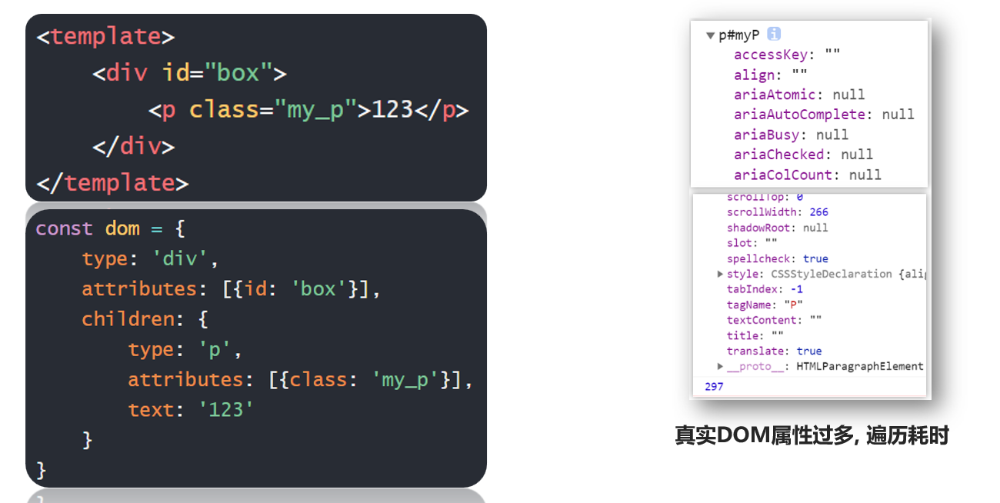​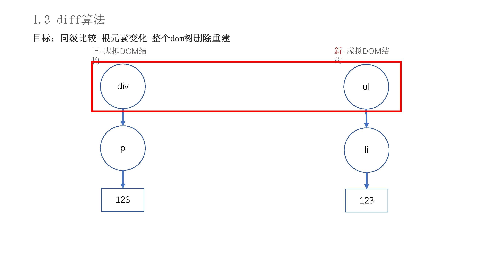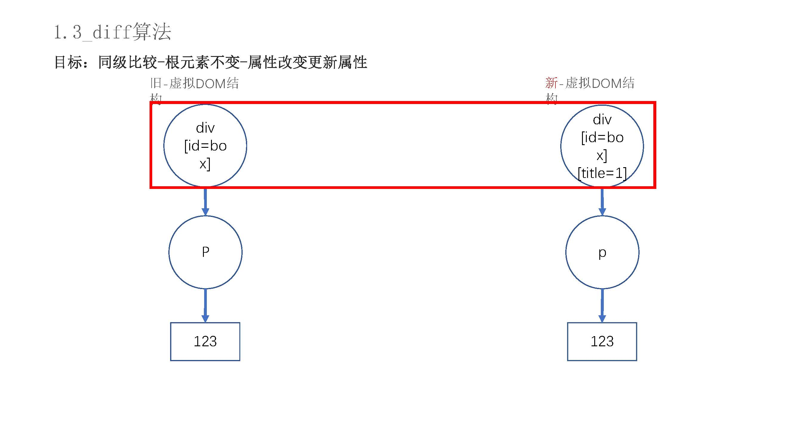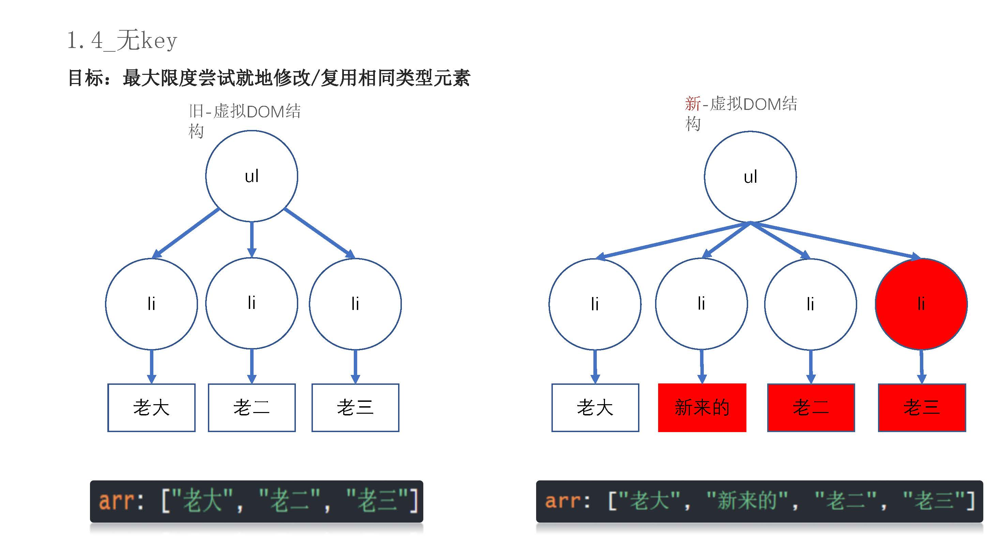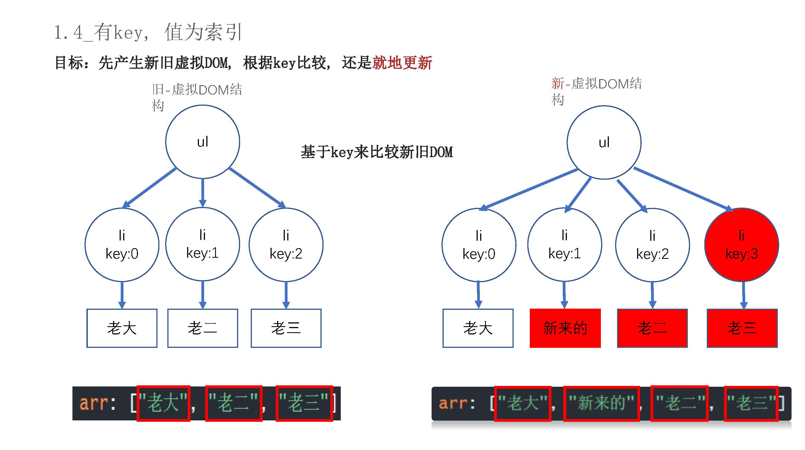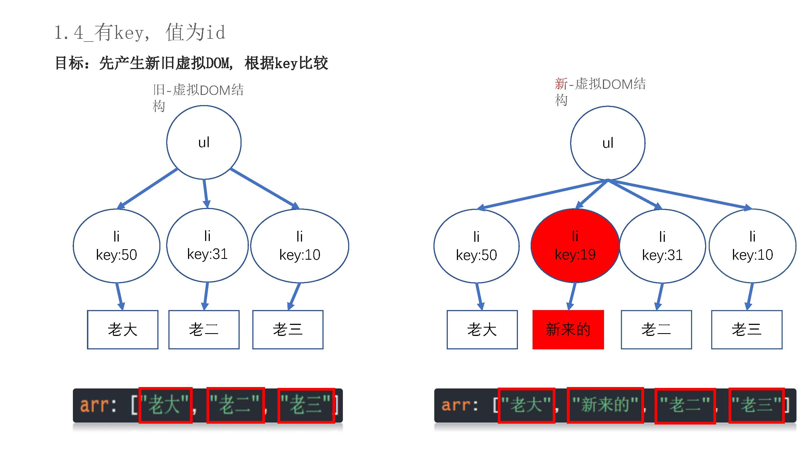​

### key的作用

　　标准语法推荐 `v-for` 必须要加 `key`，推荐有 id 用 id，没 id 用下标

　　原因：

* Vue 更新尽可能不会删掉元素再重建，而是尽可能的在当前元素上进行修改
* 所以记住一个原则：**vue 会尽量就地复用元素，实在没法复用才创建新的**
* 所以如果没加 key 的时候，vue 内部就是尝试就地复用（如果是同种类型就直接复用）
* 如果加了 `key`，那么 vue 就根据 `key` 来找复用的，原本你的 key 叫 10，后面复用时只会找 key 为 10 的元素来复用，它不会就地复用

  * 根据这个现象，key 如果给下标，其实没用，它相当于也是按顺序就地复用，修改不同的属性而已
  * key 如果给唯一值，那么就能精确的复用
  * 所以你猜，为什么 vue 要把加 key 作为推荐语法：key 如果加的好，性能更好，效率更高
* key 的值只能给字符串或数字，给别的类型会报错

### vue相关插件

* 浏览器插件：

  * vue_devtools：检查当前浏览器是否是基于 Vue 开发的，帮助我们调试 Vue 项目中的数据

* vscode 插件：

  * vetur：编码必备插件，默认情况下 vscode 无法识别 `.vue` 文件和 vue 语法的
  * vue 3 snippets：提供更多代码段，包括 vue2 和 vue3

### MVVM设计模式

　　设计模式：就是很多程序员总结下来的一套行之有效的编程思路、编程方法，这就叫设计模式

　　MVVM 设计模式：

* M:

  * Model 层，也就是数据数据层（数据）
* V：

  * View 层：也就是视图层（界面）
* VM：

  * ViewModel：视图模型层（Vue 提供的核心）
  * 它内部会自动绑定数据到界面，所以数据一旦改变界面就跟着变
  * 它内部会自动监听界面的变化，然后把界面的值赋值给数据

### 绑定控制页面

```js
1.导入vue.js
<script src="./vue.js"></script>
<!-- <script src="https://cn.vuejs.org/js/vue.min.js"></script> -->

<script>
2.实例化一个Vue对象，实例化时传入一些配置参数
new Vue({
  // 实列化的vue会把里面的属性和方法自动声明，我们可以直接使用
  // 找到某个盒子，把这个盒子交给vue管理
  // 如果选择器能找到多个，它也只会找到第一个
  // 建议用id选择器
  el: '#app',  //el是标签选择器的作用，后面写要操作的标签，可以操作大标签下的子标签
  data: {},
  methods: {},
})
</script>
```

### vue的this

　　原生 `Js` 中，`this` 指向是谁绑定事件，`this` 就指向谁，Vue 实例中的 `this` 指向的是当前这个 `Vue` 的实例化对象

　　Vue 实例中的 `data` 数据，`methods` 方法都要可以通过 `this.xxx` 来进行调用，因为 vue 实例对象在实例化的某个阶段将 `data` 和 `methods` 里面的数据和方法全部挂载到了实例化对象的最外面。

### vue生命周期

* 概念：vue的生命周期就是指 Vue 实例从创建到销毁的一系列过程
* 生命周期钩子:是指在 vue 实例的生命周期某些阶段里会自动调用的回调函数

  ```js
  创建阶段
  beforeCreate(){}  //是最早的钩子，但是数据还没初始化，无法访问数据
  created(){}  //是最早可以访问到数据和方法的钩子

  渲染阶段
  beforeMount(){}  //渲染前，无法访问真实 dom 和子组件
  mounted(){}  //渲染后，最早可以访问真实 dom 和子组件的钩子

  更新阶段
  beforeUpdate(){}  //数据发生改变，但是界面还没更新调用的钩子
  updated(){}  //数据发生改变，界面也更新调用的钩子

  销毁阶段
  beforeDestroy(){}  //销毁前，这里还可以访问子组件
  destroyed(){}  //销毁后，这里无法访问子组件，但是还可以访问自己的数据，
  ```
* 常用生命周期钩子

  ```js
  created(){}
  因为是最早能访问到数据的钩子，所以可以在这个钩子里做一些数据初始化的准备
  例如，我打开一个页面要不要请求服务器数据？要，而且要越早请求越好，照理说最早是 beforeCreate，但是它里面无法访问 data，那拿到数据也不好操作，所以最早能拿到数据的钩子就是 created，所以以后我们发请求一般都写在 created 里

  mounted(){}
  最早能访问到 dom 或子组件的钩子
  因为有些东西需要访问 dom 才能实现，例如 echarts
  echarts 在实例化时必须传入一个 dom 元素，所以它只能写到 mounted 里才能访问到

  beforeDestroy(){} 
  或者
  destroyed(){}
  这个钩子调用代表组件要销毁了，销毁就应该做一些回收的工作
  例如回收定时器
  ```

　　‍

　　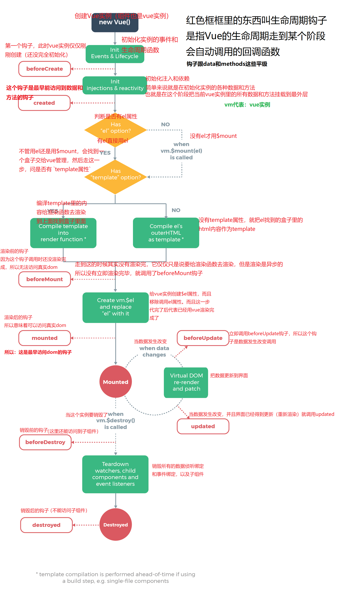​

### 语法糖

　　语法糖（Syntactic sugar），也译为糖衣语法，指计算机语言中添加的某种语法，这种语法对语言的功能并没有影响，但是更方便程序员使用。通常来说使用语法糖能够增加程序的可读性，从而减少程序代码出错的机会。

　　简单来说，就是不改变语法的原功能的情况下，通过改变代码的写法，让代码更具有可读性，方便程序员的使用，可以说是代码里面的成语。

### 事件修饰符

　　事件对象在 `vue` 中相对来说用的少。在vue中可以使用修饰符来阻止事件默认行为、阻止冒泡等

* 基本语法

  ```html
  <标签 @事件名.修饰符="方法名"></标签>
  //修饰符可以添加多个
  <标签 @事件名.修饰符1.修饰符2="方法名"></标签>
  ```
* 常见修饰符

  ```js
  .lazy //改变输入框的值时value不会改变，当光标离开输入框时，v-model绑定的值value才会改变
  .trim  //把v-model绑定的值的首尾空格给过滤掉
  .number  //将值转成数字，先输入字符后数值，本次输入无效，先数值后字母，会截取前面数值部分
  .stop  //阻止冒泡
  .capture  //开始事件捕捉
  .self  //只有点击事件绑定的本身才会触发事件
  .once  //事件只执行一次
  .prevent  //阻止默认事件（例如a标签的跳转）
  .native  //加在自定义组件的事件上，可以是自定义组件使用原生click事件等，不用到自定义组件中再去设置
  .left .right .middle  //鼠标的左中右按键触发的事件
  .passive  //给onscroll事件整了一个.lazy修饰符，优化移动端的性能
  .sync  //语法糖，子组件传值方便
  .keyCode(.enter .tab .esc)  //修饰keyup等事件，确定那个键
  ```
* `.sync修饰符`：要想修饰符生效，子组件内部做子传父时，发起数据请求时应该这样写：`this.$emit('updata:数值'，所需数据）`

  ```html
  //传统父子双向传递时，在子组件标签中的写法
  <子组件 :show="editShow" @update:show="editShow = $event"/>

  //使用.sync修饰符,就相当是上面的写法了，替你写了 @update:show="editShow = $event"
  <子组件 :show.sync="editShow" />


  :show.sync="editShow"   ===   @update:show="editShow = $event"
  ```

## 基本指令

### 指令概念

　　Vue提供的具备某种功能的特殊的html行内属性，一般以`v-`开头，常见为`v-指令名`

### 插值语法

　　插值语法（胡子语法）：`{{ 数值 }}`插值语法可以写任意**表达式**，但是不能写代码语句。

　　表达式像那种三元运算，加减乘除。语句的话想什么定义函数，for 循环那种

```html
<!-- 只要是被vue管理了，那么{{}}都代表插值语法用来输出某个数据 -->
<div id="app">
  <!-- 你好 -->
  <p>{{ msg }}</p>
  <!-- 10 -->
  <p>{{ 10 }}</p>
  <!-- 显示 msg -->
  <p>{{ 'msg' }}</p>
  <!-- 显示 40 -->
  <p>{{ 10 + 30 }}</p>
  <!-- 你好，周彦祖 -->
  <p>{{ msg + '，周彦祖' }}</p>
  <!-- 成年 -->
  <p>{{ age >= 18 ? '成年' : '未成年' }}</p>
</div>
```

### v-html和v-text

* v-html：`v-html`相当于 `innerHtml`，可以解析内部的标签名，会覆盖原本内容

  ```html
  //msg: '<h3>你好</h3>'
  <!-- 会把h3解析成dom元素 -->
  <div v-html="msg">我是原本的内容</div>
  ```
* v-test：`v-text` 相当于`innerText`，无法解析其内部标签，会覆盖原本内容

  ```html
  //msg: '<h3>你好</h3>'
  <!-- 会把h3当纯文本来展示 -->
  <div v-text="msg">我是原本的内容</div>
  ```

### v-on

```html
<div v-on:事件名="方法名"></div >

<div @事件名="方法名"></div >

<div @事件名="count++"></div >  //可以不调用方法，直接把函数写在行内
```

### v-bind

　　让标签内部的某些属性不写死，可以说是让标签内部的属性数据可以受到 vue 实例对象的数据控制

```html
<div v-bind:属性名="数据"></div >

<div :属性名="数据"></div >
```

### v-model

* 概念：双向绑定，可以用来控制表单元素上的值，可以达到页面数值和`vue`实例中的数据实时同步的效果。

  ```html
  //v-model常用在表单元素上，使表单元素内的value和我们data中的值同步
  表单元素：就是放在 form 标签中的元素，比如：<input /> 、<textarea /> 、<select/> 等
   <input type="text" v-model="msg" >
  ```
* 本质：`v-model`的本质就是一个语法糖。

  ```js
  <子组件标签  :value='appValue'   @input='appValue=$event.target.value'  />
  <子组件标签  v-model='appValue'  />
  上面两种其实是一样的，v-model帮你省略了后面的部分。$event就是事件对象
  子组件中设置：和父子传值没太大区别。可以通过model的设置，可以设置v-model的value和input方法。
  props:['value'],
  model:{
    prop:'value',
    event:'input'
  }
  this.$emit('input',实参)
  ```
* v-model的绑定值：`v-model` 会绑定 `vue` 里面的数据来进行表单标签的值进行同步，会先判断绑定的是不是数组

  ```js
  v-model 与 checkbox 绑定的数据是数组的，那么拿到的是 checkbox 的 value 值
  v-model 与 checkbox 绑定的数据是非数组的，那么拿到的是 checkbox 的选择状态（true  或 false）
  ```
* `v-model` 的修饰符：`v-model`用来收集表单数据的，它的修饰符是用来修饰所收集到的表单数据

  ```html
  <表单元素 v-model.修饰符="数据"></表单元素>
  <input type="text" v-model.number="num1">
  <input type="text" v-model.trim.lazy="msg">//修饰符可以连用
  v-model常见修饰符:
  .number  //把输入的内容转换为数值类型
  .trim  //去除首尾空格
  .lazy  //默认情况下是一边输入一边就会改变数据的值,加了lazy后，会输入完(按回车或者失去焦点)才会改变数据的值
  ```

### v-for 循环

```html
最好加:key,不然会报错
<!-- 遍历数组，数组有多少个元素就生成多少个标签，item是每一项，index是下标 -->
<标签 v-for="(item,index) in 数组" :key="index"></标签>

<!-- 遍历对象，对象有多少个属性就生成多少个标签，value是每个属性值，key是每个属性名 -->
<标签 v-for="(value,key) in 对象" :key="index"></标签>

<!-- 遍历数字,数字是几就产生几个标签，item是从1开始到这个数字 -->
<标签 v-for="item in 数字" :key="index"></标签>
```

### v-show、v-if

* 概念：都可以控制控制标签的隐藏和显示
* `v-show` 是控制标签的 `display:none` 来控制标签的隐藏

  ```html
  <标签 v-show="布尔值"></标签>

  ```
* `v-if` 是控制标签的 `DOM` 树来控制标签的隐藏，显示就是加到 dom 树里，隐藏就是把标签将 dom 树中移除。比较消耗性能

  ```html
  <标签 v-if="布尔值"></标签>

  //配合v-if、v-else使用来达到双分支、多分支的效果
  //标签要同级
  <标签 v-if="布尔值"></标签>
  <标签 v-else></标签>
  ```

### v-cloak

　　`v-cloak`的作用就是用来解决浏览器在加载页面时因存在事件差而产生的闪动问题

　　比如可以用来解决`{{胡子语法}}`显示的闪烁问题，她的原理是先隐藏文件挂载位置，处理渲染好后在显示最终结果。这个指令需要与css规则一起使用才可以。

　　`{{}}`会有闪烁问题，`v-text`不会，但是`v-text`会覆盖内容

```html
<div v-cloak>{{ name }}</div>

style{
  [v-cloak]{
    display: none;//有时候优先级不够要加 !important
  }
}
```

### v-pre

　　`v-pre`跳过其所在节点的编译过程，可以利用它跳过没有使用指令语法、插值语法的节点，加快编译

```js
<div v-pre> {{name}} </div> //会直接显示  {{name}}  跳过了插值语法的编译过程，我们写什么，网页就显示什么
```

## 基本属性

### mixin混入

　　概念：混入相当于在组件中混合加入没有`html`和`css`的**组件**，有的只是`js`。使用方式一般有两种：全局混入、局部混入。‘

　　注意：**组合起来的组件，混入的生命周期钩子会比组件的钩子先执行，有同名函数、数据，混入会被组件的覆盖。**

　　混入和`vuex`的区别：

* Vuex公共状态管理，如果在一个组件中更改了Vuex中的某个数据，那么其它所有引用了Vuex中该数据的组件也会跟着变化。
* Mixin中的数据和方法都是独立的，组件之间使用后是互相不影响的。

1. 创建文件：`src/mixins/index`。内容和一般的`.vue`文件中的js部分一样。

    ```js
    // src/mixin/index.js
    export default {
      data() {
        return {};
      },
      computed: {},
      created() {},
      mounted() {},
      methods: {},
    };
    ```
2. 局部混入设置：在需用使用混入的组件中导入。像正常使用该组件的方法和属性一样，使用混入的方法和属性

    ```js
    import mixins from '@/mixins/index.js'
    export default {
      mixins: [mixins],
      created(){
       ...
      },
    }
    ```
3. 全局混入设置：在`main.js`中引入。使用和局部混入一样。在组件中就想使用自己的属性和方法一样使用混入。

    ```js
    import mixins from '@/mixins/index.jx'
    ...
    Vue.mixins(mixins)
    ...
    ```

### 过滤器

* 概念：过滤器`filters`本质就是一个函数，用来进行字符转换。
* 特点

  * 过滤器放在 `{{ }}` 和 `v-bind` 中，其他地方不能放
  * `filters` 在 `Vue2` 中有，在 `Vue3` 中被移除掉了
  * 过滤器中的 `this` 是指向 `window` 的，不是指向 `vue` 实例，在严格模式下，`this`是`undefined`
  * 所以 `filters` **无法直接**访问当前 `vue` 实例内的数据，要用的话，把`this`写在`return`里面
* 局部过滤器

  * 定义：和data平级

    ```js
    filters: {
      sing(val) {// 这里的formatTime就是过滤器名字,这里的val就是原数据
        return "我会sing唱歌"
      }
    }
    ```
  * 使用

    ```html
    <h2>{{ msg | sing }}</h2>  //   |是管道符，前面msg的值会变成过滤器传入的val参数
    <标签>{{ 原数据 | 过滤器1 | 过滤器2 }}</标签>  //可以同时使用多个过滤器,前面的返回值会变成后面的原val数据
    ```
* 全局过滤器：`main.js` 中注册，可以在项目全局组件中使用该过滤器，使用和data一样

  ```js
  Vue.filter('过滤器名', (val) => {
      // val就是原数据
      // return就是返回的处理后的结果
      return 处理
  })
  ```

### 计算属性

* 概念：本质也是函数，一般在需要进行数据计算时候使用，**最重要是有缓存，依赖项改变时才会再调用**，不然它的值是从缓存里面拿出来用的
* 定义：和`data`​平级

  ```js
  computed: {
    计算属性名 () {
      ...
    return 结果
    }
  }
  ```
* 使用：和普通data数据一样使用，不用过滤器那样需要原数据

  ```html
  //用在插值语法里面
  <span>{{ 计算属性名 }}</span>
  ```
* 完整写法：计算属性写成obj，计算属性被赋值的时候，会调用一个set方法

  ```js
  computed: {
    //计算属性有两个回调函数，默认是使用get回调函数的
    计算属性名: {
        // 对计算属性取值，一定要有return，计算属性的返回值就是这里来的
        // get回调函数会在 初次读取计算属性名时(即第一次使用) 和 依赖项发生改变时 触发
        get() {
          console.log("我取值了");
          return this.msg + "，xxx";
        },
        // 对计算属性赋值，即对计算属性进行赋值修改时，会触发set回调函数
        // val就是你传进来的值
        set(val) {
          console.log("对计算属性赋值", val);
        },
    }
  }

  this.计算属性名 = "xxx" //调用set函数，xxx=val
  ```

### 侦听器

* 概念：侦听 `vue` 里某个数据变化，一旦发生变化，就会调用写好的回调函数
* 定义：和data同级

  ```js
  watch: {
    "被侦听的数据"(nweValue,oldValue) {
      ...
    }
  }
  ```
* 深度侦听：侦听其实是侦听栈里面的数据，深度侦听它的堆的变化

  ```js
  watch:{
    // 可以侦听属性改变，但是只能侦听到某一个
    "对象.属性" (newVal, oldVal) {
      ...
    },
    
    // 如果想侦听到对象里任意属性的改变就用深度侦听
    "对象": {
      deep: true,// 开启深度侦听
      immediate: true,//是否页面一打开时就调用一次，默认是false
      handler (newVal, oldVal) {// 当对象里任意属性发生改变调用的回调函数，函数名不能改，改了报错
        ...
      }
    }
  }
  ```
* 注意：vue中，数组的push、pop、shift、unshift、sort、reverse、splice方法被重新包装，通过这几种方法修改数组，数组的数据是响应式的，不需要再开启深度侦听了

### 自定义指令

　　指令：`Vue ​`提供的具有某种功能的特殊的 html 行内属性。

　　同常以`v-指令名`开头，如：`v-text`、`v-html`、`v-on`。可以设置自定义指令，来达到我们需要的目的，指令的本质还是一个函数。

#### 自定义指令基本使用

* 自定义指令生命周期

  ```js
  //指令的生命周期：绑定-插入-更新-更新结束-销毁
  bind:绑定时，类似于beforeMount,指令绑定于相应dom时执行，这时还没有完成渲染。
  inserted:指令所在dom添加到父节点时执行（类似于mounted,渲染时）。
  update:更新时，指令所在组件有更新时执行，并不保证指令所在dom更新完成。
  componentUpdated:更新完成时，指令所在组件包含子组件都更新时执行，类似于updated。
  unbind:销毁前，类似于destroyed,指令所在dom解决绑定时执行（v-if=false,或者指令所在组件销毁时执行，指令所在dom销毁时也会执行）

  //生命周期回调函数的参数
  bind(dom,obj,vnode){
  在bind即指令绑定到dom时触发该回调函数
  dom:指令所在dom
  obj:指令包含的属性，修饰符，指令名，值，其中value很重要，就是拿到绑定指令时传递的数据
  vnode:节点信息，指令所在组件的实例对象，其中context:指令所在组件的实例对象（指令所在组件的this）
  }

  //回调函数的简写：如果当inserted里的代码和update里的代码一样时，可以简写
  指令名 (el, binding)=>{}
  ```
* 设置自定义指令:`v-指令名:属性.修饰符=“值”`

  ```js
  在组件中，设置局部指令
  export default {
    directives: {
       //如果当inserted里的代码和update里的代码一样时，可以简写，不管是插入到dom时还是数据改变它都会这个方法
       color (dom, boj) {
         console.log('调用了')
         dom.style.color = boj.value//获取绑定的属性的值
       }
    }
  }

  在main.js设置全局指令
  Vue.directive('指令名', {
    inserted(dom, obj) {
      dom.style.color=obj.value
    }
  })
  全局自定义简写
  Vue.directive('指令名', {(dom, obj)=>{
    ...
    }
  })
  ```
* 使用指令

  ```js
  <template>
    <div>
      <button @click="color = 'red'">修改成红色</button>
      //如果color属性本身有定义，那么obj.value==color的值
      <p v-color="color">你好</p> //当color数值发生改变是，会调用指令update()方法
    </div>
  </template>
  ```

#### 自定义指令全局注册

* 在`main.js`注册

  * 创建自定义指令文件 `/src/direcztives/index.js`

    ```js
    //创建指令集
    export defaultconst const directives = {
      指令名1: {
        ...
      },
      指令名2: {
        ...
      },
    }
    ```
  * `main.js`中注册：使用`obj`方法重复声明全局自定义指令

    ```js
    import directives from '@/components/directives/index'

    Object.keys(directives).forEach(item=>{
       Vue.directive(item,directives[item])
    })
    ```
* 使用`Vue.use`注册

  * 创建自定义指令文件 `/src/direcztives/index.js`

    ```js
    //声明指令和其方法
    const directives = {
      指令名1: {
        ...
      },
      指令名2: {
        ...
      },
    }

    //暴露安装方法，然后在main.js中导入并Vue.use(directives)
    export default {
      install(Vue) {
        Object.keys(dirObj).forEach((key) => {
          Vue.directive(key, dirObj[key])
        })
      }
    }
    ```
  * `main.js`中安装

    ```js
    import directives from '@/directives'
    Vue.use(directives)//执行Vue.use时就会调用内部的install方法
    ```

## 基本使用

### 事件对象

* 原生：事件对象
* vue：要自己传参又要事件对象，则传入`$event`

  ```js
  <!-- 如果没加小括号，函数默认就有个参数，参数就是事件对象 -->
  <button @click="fn">点我啊</button>
  fn(e) {
    console.log("fn被调用", e); // 事件对象
  },

  <!-- 如果加了小括号，就代表我要自己手动给这个函数传参，你传什么他就是什么，如果都没传，那么参数就是undefined -->
  <button @click="fn2()">点我啊2</button>
  fn2(e) {
    console.log("fn2被调用", e); // undefined
  },

  <!-- 如果传10，参数就是10 -->
  <button @click="fn3(10)">点我啊3</button>
  fn3(e) {
    console.log("fn3被调用", e); // 10
  },

  <!-- 我既想自己传参，又想拿到事件对象，要手动传递事件对象，就要传一个$event -->
  <button @click="fn4(999, $event)">点我啊4</button>
  <button @click="fn5($event)">点我啊5</button>  
  fn4(num1, e) {
    console.log("fn4被调用", num1, e); // 999 事件对象
  },

  fn5(num1, e) {
    console.log("fn5被调用", num1, e); // 事件对象 undefined
  }
  ```

### 动态样式

* 直接设置行内style样式

  ```html
  <标签 v-bind:style="{ 样式名: 数据 }"></标签>
  <标签 :style="{ 样式名: 数据 }"></标签>
  <div :style="{width: w, height: h, backgroundColor: color}"></div>
  ```
* 通过类名设置

  ```html
  <标签 v-bind:class="{类名:布尔值,类名2:布尔值}"></标签>
  <!-- 简写 -->
  <标签 :class="{类名:布尔值,类名2:布尔值}"></标签>
  <标签 :class="[变量1,变量2....]"></标签>//较少
  ```

### Vue.use

　　在`mian.js`中调用`Vue.use`就是获得这个`install(Vue)`方法里面需要的实参`Vue`。

　　这类插件本身就是基本`vue`的使用，插件本身不集成`Vue`，不然就显得插件占用空间很大

```js
在xxx.js文件中设置
export default {
  install(Vue,options){
  ....原型挂载，全局组件注册，过滤器注册...
  }
}
或
export default function(Vue,options){
  ....原型挂载，全局组件注册，过滤器注册...
}

在mian.js中安装。

对象形式安装
import xxx from ...
Vue.use({xxx,options实参})//其实调用了传入对象内部的install方法。这个方法进行了操作
函数形式安装
Vue.use(function(Vue,options)={
  ...
  }
)
```

### 关于@和src

　　使用 VueCli搭建的项目，`@` 是指项目文件中的 `src` 文件夹，使用 `@`可以方便我们找文件导入。

```js
脚手架4，在css中不能直接用@，会解析失败
脚手架4里要用 ~@ 才能代表src
原因：@在less中特殊符号，代表声明变量，所以要做转义
但是在脚手架5里，他会判断你的@在哪里写的，例如在路径里写的他就是代表src
所以脚手架里可以直接用@
在css里可以统一用@，因为虽然脚手架5已经支持直接写@了，但是它也兼容以前的~@写法
```

### $ref

　　`ref`​就是 vue 里面专门用来找到 dom 元素和子组件的方法，以后在 vue 里推荐如果要找 dom 元素，不要再用 `document.querySelector` 而是推荐用 `ref` 和 `$refs` 配合的形式找到 dom 元素

1. 给需要找到子组件或元素加 `ref="名字"`

    ```html
    //子组件被引入注册后，ref=‘xx’给组件取名字
    <子组件标签 ref="名字"></标签>  
    <标签 ref="名字"></标签>
    //例
    <son ref="son" />
    ```
2. 调用函数就可以找到该子组件或者标签 `this.$refs.名字`

    ```js
    //调用函数找到该子组件或元素
    this.$refs.名字
    //例
    methods: {
    //找到该组件，并设置它的样式
      fn(){
        this.$refs.son.style.width = 200px
      }
    }
    ```
3. 可以用来父传子

    ```js
    this.$refs.son.数据 = 传递的数据
    <button @click="$refs.son.name ='rose' ">父传子</button>
    ```

### $nextTick

　　`$nextTick`和`nextTick`都是`Vue`提供的全局API。 本质上是使用 `promise` 封装的，和 `axios` 一样可以，使用 `async-wait`

　　`$nextTick`：在下次 DOM 更新循环结束之后执行延迟回调。用在修改数据之后立即使用这个方法，获取更新后的 DOM。

　　`nextTick`：当数据发生变化，更新后执行回调。

　　**`Vue`**​**​ 的 ​**​**`dom`**​**​ 渲染都是异步渲染**，所以改变数据后，没有立即渲染 `dom`，如果此时要操作 `dom`可能会操作不到最新的 `dom`，也就是操作完`dom`后，数据后面才渲染上来。

```js
template>
  <div>
    <button v-if="show" @click="fn1">登录</button>
    <input v-else ref="txt" type="text" placeholder="请输入账号" />
    <button @click="show = true">返回登录</button>
  </div>
</template>

<script>
export default {
  data() {
    return {
      show: true,
    };
  },
  methods: {
    fn1 () {
       隐藏按钮，显示出输入框,渲染出来了
       Vue里的渲染界面，都是异步渲染
       异步：一定要等同步执行完了才执行异步

      这句代码是同步代码，这里仅仅只是对数据发生了改变，但是界面还没重新渲染
      this.show = false

      这句代码也是同步代码
      console.log(this.$refs.txt)

      把这个代码改成异步，那么就按异步队列来执行了
      this.$refs.txt.focus()
  
      // 用setTimeout可以，但是时间不好写
      // setTimeout(() => {
      //   this.$refs.txt.focus()
      // }, 100);

      Vue提供了一个回调函数叫 $nextTick
      他的触发时机是，等本次dom更新完毕会自动调用
      本质相当于是setTimeout，但是延迟时间不用你自己写
      vue内部会自己分配时间（分配成dom更新完的时间）
      this.$nextTick( () => {
        当本次dom更新后触发
        this.$refs.txt.focus()
      })
    }
  
    async fn1() {
      隐藏了按钮，显示出输入框
      this.show = false;
      让本次dom渲染完，让输入框获得焦点
      //  this.$nextTick( () => {
      //     this.$refs.txt.focus()
      //  })
      // 其实$nextTick是用promise封装的，所以可以用.then
      // 可以用 async + await
      await this.$nextTick()//等待渲染完成后，再执行下面代码

      this.$refs.txt.focus();
    },
  },

-----------------------------------------------------------
不建议用 updated 钩子:
因为这个钩子是任意界面上的数据发生改变且 dom 更新后调用可能会造成性能问题与冲突
  // 虽然他能实现，但是不推荐用这个钩子
  // 其他数据改变，他也会调用
  // 总而言之：所有在界面上渲染的数据改变都会调用这个钩子
  // 这样就容易报错，其次是浪费性能
  // updated () {
  //   this.$refs.txt.focus()
  // }
  
};
</script>

<style>
</style>
```

　　‍

### $set

　　**这是 Vue2 的缺陷，Vue3 没有这个缺陷**

　　缺陷：不能给对象动态添加属性，如果你动态添加它就不是响应式（不是响应式的意思：数据变了，界面不会更新）

```js
this.$set(要修改的对象, 属性名, 属性值)  
// 例 this.$set(this.obj, 'height', 175) 
// 给obj动态添加height属性，属性值是175，这样添加的属性就是响应式的
this.$set(要修改的数组, 下标, 值) 
```

### scoped

* 属性选择器：`[属性名] { 样式 }`
* 设置scoped

  ```css
  <style lang="less" scoped>
    ...
  </style>
  ```
* Scoped和属性选择器的关系

  * 如果某个组件加了`scoped`，那么它会帮这个组件内所有的标签都加一个行内属性：`data-v-自己的hash`，并且把这个组件里加了`scoped` 的`style`里的样式，变成 `属性选择器[data-v-自己的hash]`，通过这个操作，就意味着让这些样式只能给自己用了，因为只有自己才有`[data-v-自己的hash]`​的行内属性
  * 也就是说，在设置了`scoped`​中写的样式，这个样式只会作用到该标签上面，如果这个标签里面也有标签，那里面的标签是无法接受到该样式的`scoped`
* 深度作用选择器：组件加了 `scoped`，它的样式只能给自己用，子组件的内部标签，**甚至该标签里面的内部标签**，也用不了（相当于你写谁谁才可以用，它的子标签是无法继承它的样式属性）。如果希望某个样式能作用的更深（也就是作用到子组件内部），就要用 **深度作用选择器**，有些不专业的叫法也叫 `样式穿透`

  ```css
  >>>       less不支持 
  /deep/    less 支持，但是vscode报错
  ::v-deep  推荐，不会报错，less 和 scss 都支持

  <style scoped>
  //加了scoped，会让当前组件里写过的标签用上样式
  //当前组件里没写的标签肯定用不上，所以意味着组件里的子组件内部的标签用不上
  ::v-deep p {
    color: red;//现在p标签作用的更深：能影响到子组件里的标签
  }
  </style>
  ```
* 深度作用选择器原理：就是把这个选择器的 `data-v-hash` 的属性选择器提升到前面，变成后代选择器，既然是后代选择器，所有当前组件里的后代就能匹配的上了

  ```css
  p[data-v-hash]{} //交集选择器
  变成了
  [data-v-hash] p{} //后代选择器
  ```

## 组件

### 组件概念

　　组件就是组成网页的一个部分，把网页中的部分都分成一个一个的组件，把组件堆积在一起，就构成了一个网页。

　　使用组件的好处：**高内聚**。也就是，能够让代码变得更加清晰。

　　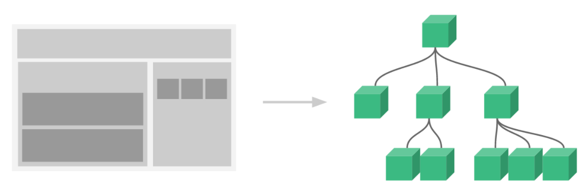​

### 单向数据流

* 父的数据能流入（传递）到子，并且父的数据如果变了，子的也会自动跟着改变，但是反过来不行，这就叫单向数据流（也就是说子里不允许修改 props 传递过来的数据）

* 所以在子里面不要去修改 `props` 的数据（也就是问父要来的数据），否则会报错，因为这会违反单向数据流的规则

　　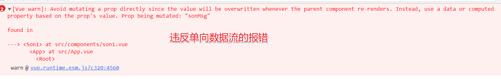​

* 单向数据流的本质**是不允许修改栈上的数据**
* 所以也就是说，如果父传子时传递的是复杂类型，那么在子里改堆上的数据不报错，而且父也会跟着变

### 父子组件传值

* 父传子

  * 子组件子组件里声明要拿的数据

    ```js
    //语法
    props: ['数据名1', '数据名2',.....]
    ----------------------------
    //例子
    <script>
    export default {
      props: ['sonMsg', 'sonAge', 'sonObj'],
    }
    </script>
    ```
  * 父里面把子组件要的数据传递过来

    ```html
    //把父里的msg给子要的sonMsg
    //把父里的age给子要的age
    <son :sonMsg="fatherMsg" :sonAge="fatherAge" :sonObj="fatherObj" />
    ```
* 子传父：因为单向数据流规则的存在，所以子里不能直接改父流入的数据（栈上）

  * 子组件通知

    ```html
    //子组件中
    <div class="son1">
      <button @click="send">通知父来改</button>
      <p>我是son1 --- {{ sonMsg }} -- {{ age }}</p>
    </div>

    <script>
    export default {
      props: ["sonMsg"],
      methods: {
        send () {
          this.$emit('changeMsg','抠你鸡蛙')
        }
      }
    }
    </script>
    ```
  * 父组件接收

    ```html
    //父组件中
    <son1 @changeMsg="fn" :sonMsg="msg" />

    <script>
    import son1 from './components/son1'
    export default {
      methods: {
        fn (data) {
          this.msg = data
        }
      },
      // 注册组件
      components: {
        son1
      },
      data() {
        return {
          msg: '马杀鸡',
        }
      },
    }
    </script>
    ```

### 兄弟组件传值

* eventBus：专业术语事件总线

  * 常规用法

    1. 创建文件夹：`src/eventBus/index.js`

        ```js
        //index.js中固定写法

        import Vue from 'vue'
        // 导出一个Vue实例对象
        export default new Vue()//这样设置好就可以了，相当于把数据放这个实例了
        ```
    2. 接收数值组件

        ```js
        import bus from ’@/eventBus‘
        //越早接收越好，所以放在created中等待接受数值传递
        export default{
          created(){
            bus.$on('自定义事件', data => {//自定义事件相当于关注的公众号
              console.log(data)
            })
          }
        }
        ```
    3. 发送数据

        ```js
        import bus from ’@/eventBus‘
        //向平台传递数值
        fn(){
          bus.$emit('自定义事件名', 数据)
        }
        ```
  * 原型对象挂载：在vue的原型对象上挂载一个$bus用来传递数据

    1. 原型挂载：`main.js`​中设置

        ```js
        import Vue from 'vue'
        import App from './App.vue'
        Vue.config.productionTip = false

        // 把bus对象挂载到Vue的原型对象上
        // 命名规范：建议放到Vue原型上的东西名字前面都加$
        // 好方便区分这个数据是实例自己的还是原型对象上的
        Vue.prototype.$bus = new Vue()

        new Vue({
          render: h => h(App),
        }).$mount('#app')
        ```
    2. 接收数据

        ```js
        export default{
          created(){
            this.$bus.$on('自定义事件', data => {//自定义事件相当于关注的公众号
              console.log(data)
            })
          }
        ```
    3. 发送数据

        ```js
        fn(){
          this.$bus.$emit('自定义事件名', 数据)
        }
        ```

### props写法

* 简略写法

  ```js
  export default {
    props: ['foo']
  }

  //对象写法
  export default {
    props: {
      title: String,//设置传递过来的数据的数据类型
      likes: Number
    }
  }
  ```
* 完整写法

  ```js
  props: {
    数据名1: {
      type: Boolean,// 设置数据类型，这里设置为了布尔型
      default: true,// 设置默认值，默认为false
      required: true,// 设置是否必须传递
    },
  }
  ```

### 插槽

* 概念：在组件中设置插槽，在使用这个组件的时候，把组件写成双标签，在双标签内添加的内容，默认显示在组件的 `<slot></slot> ​`的位置上，`<slot></slot>`就是组件的插槽
* **默认插槽**：插槽有默认值，没被使用就显示默认值，被使用，页面在子组件中写什么就在这个位置显示什么

  * 设置插槽：在组件中设置

    ```html
    //组件中设置插槽，该组件在被使用的时候，在该标签中写的html结构会显示在插槽位置
    <div class="son">
      <!-- 默认插槽，没传就是hr -->
      <slot><hr></slot>
    </div>
    ```
  * 使用插值：使用该组件，把组件写成双标签样式，然后在该标签内部添加 `html` 结构及数据，这添加的部分在结构上是显示在该组件的插槽位置

    ```html
    <son>//组件写成双标签样式
      <h3>无题</h3>//显示在组件的插槽位置
    </son>
    ```
  * 默认插槽的插槽名：默认插槽其实也有名字，只不过名字叫 `default`
* **具名插槽**：个组件内部可能需要多个地方不写死，那么就要多个插槽，要多个插槽就需要通过名字区分他们（默认插槽的 `name` 属性的值是 `default）`

  * 设置具名插槽：在 `slot` 中设置 `name='插槽名称'`

    ```html
    <div class="son">
     <slot name="body"></slot>//该组件的这个位置的插槽叫body。
    </div>
    ```
  * 使用具名插槽：`template` 标签中写 `v-slot:插槽名` 里面包裹要插入的内容，简写形式是 `#插槽名`

    ```html
    <template>
      <div>
        <!-- 具名插槽的传递 -->
        <son>
          <template v-slot:body>
            <h3>无题</h3>
            ...
          </template>
        </son>

        <!-- 简写形式 -->
        <son>
          <template #body>
            <h3>无题</h3>
            ...
          </template>
        </son>
    </div>
    </template>
    ```
* **作用域插槽**：把**组件内部**的数据传递给外部的插槽结构，即谁用我的插槽，我就把我的数据传递给谁使用

  * 设置作用域插槽：在组件内部，写 `slot` 的位置，把要传递的数据进行动态绑定，谁用这这个插槽，数据就给谁

    ```html
    <div class="son">
      <slot :数据名1="数据1" :数据名2="数据2" name="插槽名字"></slot>
      <slot :msg="msg" name="title"></slot>//名字为title的插槽，把该组件的msg数据给这个插槽
    </div>
    ```
  * 使用作用域插槽的数据：给插槽内的数据取对象名，利用点语法使用数据

    ```html
    <template #title="rr">//插槽传递过来的数据是对象形式，利用点语法使用
      <h3>无题 -- {{ rr.msg }} -- {{ rr.count }}</h3>
    </template>
    ```
* 推荐插槽写法

  ```html
  <template v-slot:名字="obj">
      <!-- 名字就是插槽名字，obj就是组件内暴露的数据，是一个对象 -->
  </template>

  <template #名字="obj">
      <!-- 名字就是插槽名字，obj就是组件内暴露的数据，是一个对象 -->
  </template>
  ```
* vue2.6版本以前插槽写法

  ```html
  <template slot="插槽名字" slot-scope="obj">
  </template>
  ```

### 组件注册方法

* 局部组件：哪里导入哪里使用

  ```js
  import 组件名 from './组件路径'  
  export default {
    components: {
      组件：组件名 
    }
  }
  ```

* 全局组件注册1：使用`main.js`进行全局注册

  * 常规写法：在`main.js`中直接导入注册

    ```js
    import 组件 from '组件路径'
    Vue.component('组件名', 组件)//自己设置组件名
    ```
  * 升级写法：在组件中添加`name`属性，来设置组件名。方便搜索组件名，也方便使用`keep-align`

    1. 在组件中添加name属性，来设置组件名

        ```js
        export default {
          name: '组件名',
          ...
        }
        ```
    2. 在`main.js`中导入组件并全局注册。利用`.`方法获取组件名 

        ```js
        import 组件 from '组件路径'
        Vue.component(组件.name, 组件)//通过.name来设置组件名
        ```

* 全局组件注册2：利用`Vue.use`，把组件都封装到单独的`js`文件中，然后统一全局注册。目前使用最多的方法

  1. 创建单独`js`文件：`src/components/index.js`。

      ```js
      //导入需要注册的组件
      import UploadExcel from '@/components/lib/uploadExcel'
      ...其他组件
      //把组件都暴露出去
      export default {
        install(Vue,option) {
          Vue.component(UploadExcel.name, UploadExcel)//.name   导入的组件要有name属性，不然报错
          ...
        }
      }
      ```
  2. 在`main.js`中导入再安装

      ```js
      import componentJs from '@/components/index.js' //把之前写的文件导入进来
      Vue.use(componentJs)//统一安装全局组件
      ```

* 全局组件注册3：利用`require.context()`来获取文件路径，来自动安装全局组件

  注意：使用这个方法，组件一定要有`name`属性。

  1. 在放全局组件的文件里面创建`index.js`文件：`src/components/index.js`，剩下操作和上面的在`main`中的是一样的。

      ```js
      //const 返回值 require.context('要读取的文件夹','是否读取子文件夹',匹配文件) 
      //require.context()该方法可以获得目标文件夹下符合条件的所有文件的路径
      //返回值是一个function,传入读取文件的路径能类似import导入组件的操作（重点）
      export default {
        install(Vue,option) {
          // 1:读取某文件夹下的文件，拿到所有文件
          const req = require.context('./', true, /\.vue$/)  //搜索当前文件夹下包含子文件夹的是.vue结尾的文件
          // 2:拿到所有读取文件的路径 req.key()
          req.keys().forEach((item) => {   
          // 3:实现文件导入
          // com想当于就是导入的组件
            const com = req(item).default
            Vue.component(com.name, com)
          })
          //console.log(req.keys())
        }
      }

      主要逻辑：
      1.获取文件夹中的所有.vue文件
      2.获取所有.vue文件的路径，再进行遍历
      3.利用req(路径)来获得组件并.default暴露出去获得组件。 (context返回值是方法，输入路径可以得到文件)
      4.利用com.name获得组件名，com获得组件，自动循环操作设置全局组件
      5.再在main.js中获得导入安装vue.ues
      ```

### 动态组件

* 在某个区域不写死，可以动态的切换不同的组件来显示，如登录时切换`二维码登录` 和 `账号登录`
* v-if指令

  ```html
  <template v-if="判断条件"></template>
  <template v-else></template>
  ```
* component标签

  ```html
  <component :is="组件名" />
  <component :is="comName" />
  通过动态修改conName的值，来达到显示动态组件的效果，本质和v-if、v-else是一样的，隐藏就销毁
  ```
* 组件缓存：动态组件在组件切换的时候会进行销毁，如果切换频繁，为了性能，对组件进行缓存操作

  ```html
  //缓存组件
  <keep-alive>
    <组件 />
  </keep-alive>

  <keep-alive></keep-alive> 中props的值
  include:字符串或数组,正则表达式，名字匹配的才会被缓存
  exclude:字符串或正则表达式，名字匹配的不会被缓存
  max:数字,最多可缓存几个组件

  //指定组件缓存
  <keep-alive include="组件名1,组件名2">
    <component :is="组件名" />//显示该组件
  </keep-alive>

  //除了这几个组件之外，都会缓存
  <keep-alive exclude="组件名1,组件名2">
    <component :is="组件名" />//显示该组件
  </keep-alive>
  ```
* 组件缓存钩子

  ```js
  destroyed(){},//组件被销毁时调用
  activated(){},//组件被显示时调用，被keep-alive包裹时候才有
  deactivated(){},//组件要隐藏时调用，被keep-alive包裹时候才有
  ```

# [VueRouter](https://router.vuejs.org/zh/)

## 基本使用

### 安装路由

1. 下载路由
   ```js
   # 注意：这是下载最新版的vue-router,而最新的vue-router目前是给vue3使用的
   npm i vue-router
   # 如果给vue2用应该用如下命令
   npm i vue-router@3.x
   ```

2. 配置路由：`main.js` 文件中设置
   ```js
   // 导入路由
   import VueRouter from 'vue-router'
   // 安装路由
   Vue.use(VueRouter)
   // 导入组件
   import 组件名 from '组件路径'
   // 设置路由规则： 就是什么路径对应哪个组件
   const routes = [
       { name: '路由名字', path:'/a', component: 组件1 },
       { name: '路由名字', path:'/b', component: 组件2 },
   ]
   // 实例化路由对象
   const router = new VueRouter({
       routes
   })
   // 把路由对象挂载到vue实例
   new Vue({
       router
   }).$mount('#app')

   ```

3. 设置路由出口：来到 `App.vue` 里写一个 `路由出口`（就是你要告诉路由，把页面显示到哪个位置）

    ```html
    <router-view>路由出口</router-view>
    ```
4. 免配置安装路由：设置好 v-cli 后，可以用 `npm` 命令直接安装好 v-router，免了后续的配置过程。

    ```bash
    vue add router
    ```

### 路由模式

* 三种路由模式

  * `hash`：默认值，网址上有`#`。使用 URL hash 值来作路由。支持所有浏览器，包括不支持 HTML5 History Api 的浏览器。
  * `history`：网址上没有`#`，会有一个请求过程，而且正式上线要服务器支持。
  * `abstract`：支持所有 JavaScript 运行环境，如 Node.js 服务器端。如果发现没有浏览器的API，路由会自动强制进入这个模式。
  * 注意：如果要用 `history` 模式，正式上线，一定需要服务器提供配置支持，否则做跳转时会报 404 找不到页面。开发阶段，因为 `vue-cli` 已经默认提供了配置，所以开发阶段可以使用。一般默认用 `hash`，因为用 `hash` 服务器不用做额外的配置
* `hash`模式

  ```js
  vue-router默认使用Hash模式.
  使用url的hash来模拟一个完整的url.此时url变化时,浏览器是不会重新加载的.
  Hash(即#)是url的锚点,代表的是网页中的一个位置,仅仅改变#后面部分,浏览器只会滚动对应的位置,而不会重新加载页面.
  #仅仅只是对浏览器进行指导,而对服务端是完全没有作用的!它不会被包括在http请求中,故也不会重新加载页面.
  同时hash发生变化时,url都会被浏览器记录下来,这样你就可以使用浏览器的后退了.
  总而言之:Hash模式就是通过改变#后面的值,实现浏览器渲染指定的组件.

  const router = new VueRouter({
      mode: 'hash',
      routes,
  })
  ```
* `history`模式

  ```html
  这种模式利用了HTML5 History新增的pushState()和replaceState()方法. 
  除了之前的back,forward,go方法,这两个新方法可以应用在浏览器历史记录的增加替换功能上.
  使用History模式,通过历史记录修改url,但它不会立即向后端发送请求.
  注意点: 虽然History模式可以丢掉不美观的#,也可以正常的前进后退,但是刷新f5后,此时浏览器就会访问服务器,在没有后台支持的情况下,此时就会得到一个404!
  官方文档给出的描述是:"不过这种模式要玩好,还需要后台配置支持.因为我们的应用是单个客户端应用,如果后台没有正确的配置,当用户直接访问时,就会返回404.所以呢,你要在服务端增加一个覆盖所有情况的的候选资源;如果url匹配不到任何静态资源,则应该返回同一个index.html页面."
  总而言之:History模式就是通过pushState()方法来对浏览器的浏览记录进行修改,来达到不用请求后端来渲染的效果.不过建议,实际项目还是使用history模式.

  <a href="#/路由地址"></a>  //没有#会报错的
  <router-link to='/路由地址'></router-link> //本质也是a标签，但是会对mode进行判断,可以不用加#

  const router = new VueRouter({
      mode: 'history',
      routes,
  })
  ```

### routes配置

```js
{
   path:'/',  //路由地址
   redirect:'/home',  //是否重定向
   name:'home',  //路由名称
   alias:'/xxx' // 路由别名
   component:组件  //该路由跳转的组件
   components:{  //可以跳转多个路由，可以
      default:组件，
      xxx:xxx组件 // <router-view name="default"  />  <router-view name="xxx"  />  
   },
   children:[],  //子路由，配置内容是一样的
   meta:{  //路由元信息，可以跳转路由时获得该信息，然后用于判断
     title:'...'
   }
}
```

### 路由对象属性

```js
$route.path
类型: string
字符串，对应当前路由的路径，总是解析为绝对路径，如 "/foo/bar"。

$route.params
类型: Object
一个 key/value 对象，包含了动态片段和全匹配片段，如果没有路由参数，就是一个空对象。

$route.query
类型: Object
一个 key/value 对象，表示URL查询参数。例如，对于路径/foo?user=1，则有$route.query.user==1，如果没有查询参数，则是个空对象。

$route.name
当前路由的名称，如果有的话。这里建议最好给每个路由对象命名,方便以后编程式导航.不过记住name必须唯一!

$route.hash
类型: string
当前路由的 hash 值 (带 #) ，如果没有 hash 值，则为空字符串。

$route.fullPath
类型: string
完成解析后的 URL，包含查询参数和 hash 的完整路径。

$route.matched
类型: Array<RouteRecord>
一个数组，包含当前路由的所有嵌套路径片段的路由记录 。路由记录就是 routes 配置数组中的对象副本 (还有在 children 数组)。

$route.redirectedFrom
如果存在重定向，即为重定向来源的路由的名字。
```

### 路由导航方式

* `a标签`跳转：`history`模式下需要在路由跳转地址前面加 `#` 号。

  ```html
  //就是路由模式变了，路径要手动改（#）
  //不能实现自动高亮
  <a href="#/路径">文字</a>
  <!-- 如果是history就不要# -->
  <a href="/路径">文字</a>
  ```
* 声明式导航：`router-link` 的本质还是 `a 标签`，专业术语叫 `声明式导航`

  ```html
  //如果是hash模式会自动给路径前面加#，如果是history模式就不会在前面加#
  <router-link to="路径">文字</router-link>

  //声明式导航高亮效果:
  声明式导航会给被点击的标签添加两个类:router-link-exact-active 和 router-link-active
  router-link-active这个类只要 路径 包含了 to 属性(路径不一定和to一样，下面的子路由也会高亮)，就有效果(比较推荐)
  在样式中，给这类加样式，就可达到点击高亮效果
  ```
* 编程式导航：用 `JS代码`进行跳转，要代码执行了才跳，不执行不跳。常用在满足条件才需要做跳转的地方

  ```js
  $router.push('路径')//如果这个代码是写在js里要加this
  <button @click="$router.push('/discover')">跳转到发现</button>
  <button @click="fn1">跳转到我的</button>
  ```

### 路径别名

```js
const router = new VueRouter({
//这时,路径'/fxxksky'和'/two-dogs' 都会跳转到A
  routes: [
    { path: '/fxxksky', component: A, alias: '/two-dogs' }
	//当有多个别名时,alias也可以写成数组形式.  alias: ['/two-dogs', 'three-dogs','four-dogs','five-dogs'] 
  ]
})
```

### 路由传参

1. query 方式：通过 url 网址形式传递参数（路径拼接），优势是使用比较方便，无需修改路由规则，只要在路径上拼接，不传参数也能访问

    ```js
    传递参数：
    this.$router.push('/path?key1=value1&key2=value2')
    <router-link to="/my?name=jack&age=16">我的音乐</router-link>

    获得参数：
    this.$route.query.参数名  
    <h3>{{ $route.query.name }} --- {{ $route.query.age }}</h3>//目标页面上
    ```
2. `path`+`query`结合：参数不拼接路径（结果还是在路径上显示），使用`query`对象方式传参

    ```js
    1.传参
    this.$router.push({
      path:'/path',
      query:{
        key1:value1,
        key2:value2,
      }
    })
    2.获得参数
    this.$route.query.key1
    ```
3. params方式（动态路由匹配传参）：需要修改路由配置，可以要求必须参数必传。

    配置路由：在`/src/router/index.js`中配置路由参数

    ```js
    //router中配置路由信息。
    { path: '/路径/:参数名1?/:参数名2?', component:组件 }//加?代表不是必传，不加?的代表必须传递参数，不然无法跳转

    { name: 'follow', path: '/follow/:id/:name', component: follow },
    // 这里的:id不代表路径叫:id，而是代表这个位置要传递一个数据，参数名是叫id
    // 所以此时要访问这个路由要 /follow/12/jack 来访问，12就是id的值，jack就是name的值，也就是传过去的参数
    ```

    设置传递参数：在路径后面拼接

    ```js
    this.$router.push('/path/123/abc')//123，abc是所要传递的参数
    ```

    获得参数：目标页面获取

    ```js
    this.$route.params.参数名
    ```
4. params方式（`name`匹配路由传参）：参数不会显示在路径中，**参数保存在内存中，刷新会数据丢失**，要注意这点。  
    配置路由：同上，用`name`传参，无需在路径后面拼接`/:参数名1/:参数名2`

    ```js
    export const constantRoutes = [
    {name:'value1',path:'/path',component:组件名，}
    ]
    ```

    传递参数：把参数放到`$router.push()`中，

    ```js
    this.router.push({
      name:'value1',   //跳转到这个名字的路由页面
      params:{
      参数名:参数值
      }
    })
    ```

    获取参数：目标页面中

    ```js
    this.$route.params.参数名
    ```

### 路由重定向

* 重定向：从路径 a 能自动转到路径 b

  ```js
  //在router文件夹中的inde中设置
  // 如果路径写了a，那么会自动重定向到b
  { path: '/a', redirect: '/b' }//输入路径a，自动跳转到b
  ```
* 设置默认页面

  ```js
  //在router文件夹中的index中设置
  { path: '', redirect: '/home' }//前面什么都不写，或者只写一个 / ，就是设置路由默认跳转到/home
  ```
* 设置动态重定向

  ```js
  const router = new VueRouter({
    routes: [
      { path: '/a', redirect: to => {
        // 方法接收 目标路由 作为参数
        // return 重定向的 字符串路径/路径对象
  	  const { hash, params, query } = to
  	  //这里使用了ES6的解构写法,分别对应了to的hash模式,params,query参数.这里解构就不具体说明了.
          if (query.to === 'foo') {
            return { path: '/foo', query: null }
          }
          if (hash === '#baz') {
            return { name: 'baz', hash: '' }
          }
          if (params.id) {
            return '/with-params/:id'
          } else {
            return '/bar'
          }
      }}
    ]
  })

  ```
* 设置404：设置非路由路径自动跳转到404

  ```js
  先设置好404组件页面
  import NotFound from '../views/NotFound'

  const routes = [
    ...
    // *就代表所有路径，除了上面的路径以外的路径,一般是写在路由规则的最后
    { name: 'notFound', path: '*', component: NotFound },
  ]
  ```

### 嵌套路由

* 嵌套路由：路由套路由，像文件夹一样，按照级别划分，默认的路由叫 1 级路由，在 1 级里放的子路由叫 2 级路由，以此类推。
* 设置子路由：

  ```js
  { 
    name: 'discover', 
    path: '/discover', 
    component: discover,
    // 设置discover的子路由，是数组，里面的配置和外面配置的路由一样
    children: [
      { name: 'tuijian', path: 'tuijian', component: tuijian },
      { name: 'bangdan', path: 'bangdan', component: bangdan },
      { name: 'gedan', path: 'gedan', component: gedan },
    ]
  },
  ```
* 设置子路由出口：找到父路由里要放子路由的位置，写一个 `<router-view />`
* 注意：子路由加`/`和不加`/`是有区别的

  ```js
  { 
    name: 'discover', 
    path: '/discover', 
    component: discover,
    // 设置discover的子路由
    children: [
      // 加了/代表路径上直接访问，例如： localhost:8080/#/tuijian
      // 不加/代表要拼接父路由的路径，例如： localhost:8080/#/discover/tuijian
      { name: 'tuijian', path: 'tuijian', component: tuijian },
      { name: 'bangdan', path: 'bangdan', component: bangdan },
      { name: 'gedan', path: 'gedan', component: gedan },
    ]
  },

  ```

### 路由元信息

* 概念：在某个路由的规则里加 `meta` 属性，把信息存到路由中，相当于给路由打了路由标记
* 设置：路由配置中设置meta属性，然后以对象形式添加信息

  ```js
  {
    name: '路由名字',
    path: '路径',
    component: 组件,
    // 写标记信息的地方
    meta: {
        title:'首页'
    }
  }
  ```
* 使用：利用$route来获取路由信息

  ```js
  $route.meta.title
  ```

### 路由跳转方法

```js
$router.push('需要跳转的路径')//添加路由记录，使用浏览器的退后，可以返回之前页面

$router.replace('需要跳转的路径')//替换路由记录，使用浏览器的退后，返回不到之前页面

$router.back()//返回上一级路由地址

$router.go(n)//n是整数，意思是在history记录中前进或后退多少步.
$router.go(-1)//和$router.back()一样的效果，但是不要轻易使用
$router.go(0)//页面刷新
```

### 路由懒加载

* 项目打包后，所有的路由打包后都会打包到一个js文件里。
* 好处：

  * 减少了对服务器的请求，有效减轻服务器的负担
  * 切换路由时非常丝滑，移动端适合
* 缺点:

  * 第一次打开页面时会慢（**首屏加载**时间比较长）

　　**路由懒加载**：为了首屏加载快些，不能把所有路由打包在一起（用户需要什么组件，就申请那个组件）

```js
//在router中修改组件的导入方式
const 组件名 = () => import('路径') //在页面中注册组件的时候也可以这样写
```

## 导航守卫

　　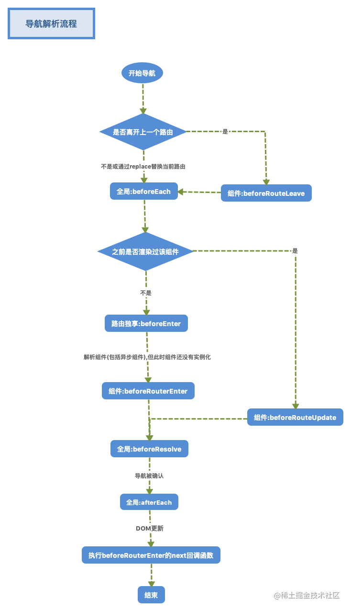​

### **全局守卫**

```js
1.全局前置守卫 
router.beforeEach((to, from, next) => {})
2.全局解析守卫(2.5.0+) 在beforeRouteEnter调用之后调用
router.beforeResolve((to, from, next) => {})
3.全局后置钩子,不支持next(),已经进去了，不需要next()
router.afterEach((to, from) => {})

to:即将进入的路由对象
from:当前导航正在离开的路由对象
netx:回调函数，决定是否放行

router.beforeEach((to, from, next) => {
  next()//允许放行
  next(false)//中断当前导航
  next('/home')//跳转到指定页面
  next(error)//(2.4.0+) 如果传入next的参数是一个Error实例，则导航会被终止且该错误会被传递给router.onError()注册过的回调。
  next({path:'/home'})//跳转到指定页面

  next({path:'/shotcat',name:'shotCat',replace:true,query:{logoin:true}...})  
  这种对象的写法,可以往里面添加 router-link 的 to prop 和 router.push 中的选项
  全都是可以添加进去的,再说明下,replace:true表示替换当前路由地址,常用于权限判断后的路由修改 

})

router.onError(callback => { 
  console.log('出错了!', callback);
});
```

### **路由独享守卫**

```js
beforeEnter:路由只独享这一个钩子,在rutes里配置

const router = new VueRouter({
  routes: [
    {
      path: '/foo',
      component: Foo,
      beforeEnter: (to, from, next) => {
        // 使用方法和上面的beforeEach一毛一样
      }
    }
  ]
})
```

### **组件守卫**

```js
//这类路由钩子是写在组件内部的
beforeRouteEnter((to, from, next) => {}) //进入路由前,此时实例还没创建,无法获取到this
beforeRouteUpdate((to, from, next) => {}) //(2.2) 在当前路由改变，但是该组件被复用时调用，比如参数改变时触发
beforeRouteLeave((to, from, next) => {}) //离开当前路由,此时可以用来保存数据,或数据初始化,或关闭定时器等等
```

### vue-router 3.1后增加的报错

* [总结](https://github.com/vuejs/vue-router/issues/2881#issuecomment-520554378)​**：这个报错不是代码报错，对于我们项目没有任何影响，它只是vue-router 3.1版本开始新增的一个警告，这个警告会在任何取消导航的行为**里出现（比如**next放行到其他页面**），可以不管它  
  ​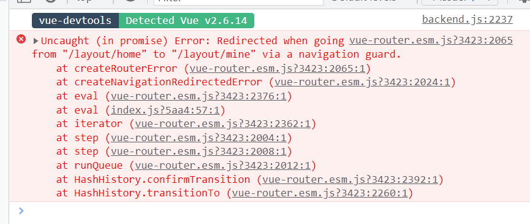​
* 解决方案：把以下代码复制到`router` 里即可

  ```js
  // 解决3.1版本后在控制台出现的警告
  const originalPush = VueRouter.prototype.push
  VueRouter.prototype.push = function push(location, onResolve, onReject) {
    if (onResolve || onReject) return originalPush.call(this, location, onResolve, onReject)
    return originalPush.call(this, location).catch(err => err)
  }

  ```

## API

### router.addRoutes

```js
router.addRoutes([route])
现在这个已经被废弃了，现在只有addRoute了
用来实现权限管理的动态路由添加
但是添加后还是没有实时刷新路由，即你去访问新的路由地址，会跳转到404
原因是，只是把动态路由的参数都给了router的构造函数，并没有生成新的router实例（数据给了没有审批）

下面这个方法就是把router的里面的路由表进行替换
router.matcher =createRouter().matcher
```

# Vuex

## 基本使用

### vuex概念

　　Vuex 是一个专为 Vue.js 应用程序开发的 **状态管理模式+库** 。它采用**集中式**存储管理应用的所有组件的状态，并以相应的规则保证状态以一种可预测的方式发生变化。**它的数据是响应式的，刷新数据就不在了**。​

### vuex安装

* 下载安装：创建项目后，，通过`node`安装

  ```bash
  # 目前这是给vue3使用
  npm i vuex

  # 这是给vue2使用
  npm i vuex@3.x
  ```
* 导入vuex：在项目中的`main.js`文件中配置`Vuex`

  ```js
  //导入Vuex
  import Vuex from 'vuex'
  // 安装vuex
  Vue.use(Vuex)
  // 实例化一个store对象（vuex对象）
  const store = new Vuex.Store()

  // 挂载到vue实例上
  new Vue({
      store
  }).$mount('#app')
  ```
* 优化：抽取到独立的js文件，把vuex的代码放到`src/store/index.js`里，然后再在`main.js`中进行导入使用

  ```js
  //创建  src/store/index.js  文件。进行如下配置，再导入到main.js中
  import Vue from 'vue'
  import Vuex from 'vuex'

  Vue.use(Vuex)

  export default new Vuex.Store({
    state: {},
    getters: {},
    mutations: {},
    actions: {},
    modules: {}
  })
  ```
* 快速配置：创建好vue项目后，在终端输入以下命令

  ```js
  vue add vuex
  ```

## 基本属性

### state

* 概念：state就是vuex里保存数据的地方，要想某个数据在所有组件都可以访问，就放到`state`里。**用点语法**
* 初始化数据

  ```js
  // 初始化vuex对象
  const store = new Vuex.Store({
    state: {
      // 管理数据
      count: 0
    }
  })

  ```
* 访问数据

  ```js
  //没有modules
  $store.state.数据名
  $store.state.count

  //有modules并开启了命名空间
  $store.state.模块名.数据名
  $store.state.userInfo.name
  ```
* 注意：数据的修改要用mutations中的方法，直接修改，如果开了严格模式会报错，其次调试工具无法正确的实时追踪到改变，不利于调试

  ```js
  严格来说不能这样该，开启严格模式会报错
  $store.state.count = newValue
  ```

### getters

* 概念：`getters`是`vuex`中的计算属性computed，依赖一个或者多个值(state)产生一个新的值，有缓存。**用点语法**
* 设置方法

  ```js
  getters: {
    getNum (state) {//可以访问state
      return newValue
    }
  }

  //拓展使用
  getters:{
    方法名(state,getters,rootState,rootGetters){
      state:当前模块的state
      getters:当前模块的getters
      rootState:根模块的state,它可以获取所有模块的state
           rootState===this.$store.state
      rootGetters:根模块的getters,它可以获取所有模块的getters
           rootGetters==this.$store.getters
    return  //这边就可以使用别的模块的数据
    },
  }

  ```
* 使用方法

  ```js
  //没有modules
  $store.getters.方法名
  //有modules并开启了命名空间
  $store.getters.模块名.方法名
  ```

### mutations

* 概念：state数据的修改**只能**通过mutations，并且mutations必须是同步更新，目的是形成**数据快照。**有一个命名规定：**名字全大写。**
* 设置方法：和state平级

  ```js
  state: {
    ...
  },
  mutations: {
    // 参数1:固定参数叫state,获取的就是当前store对象里的state
    // 参数2:调用方法时,方法传进来的参数，只能传入一个，所以多个参数使用对象或数组传入，否则多余参数变nudefined
    方法名(state,newValue) {
      state.count=newValue
      ...
    }
  }
  ```
* 方法调用

  ```js
  //没有modules
  $store.commit('方法名',newValue)//只能传入一个，多个数值使用对象或数组
  //有modules并开启了命名空间
  $store.commit('模块名/方法名',newValue)
  ```

### actions

* 概念：使用异步时候调用actions里面的方法，通过调用`mutations`里面的方法来实现间接修改数据，不能直接修改方法
* 设置方法

  ```js
  actions: {
    // 参数1:context或者简写ctx，它是当前的整个store对象,里面就有state、commit、dispatch等
    // 参数2:和mutations中的是一样的
    方法名 (ctx, 额外的参数) {
      ctx.commit('方法名',xxx)
      ...
    }
  }

  //ctx里面有什么
  actions:{
      方法名(ctx,value){
        ctx:{
          state:当前模块的state,
          getters:当前模块的getters,
          rootState:根模块的state,
          rootGetters:根模块的getters,
          commit:调用mutations方法,
                调用当前模块mutations方法：  commit('方法名'，实参)
                调用其它模块的mutations方法：commit('模块名/方法名',实参,{root:true})
          dispatch:调用actions方法
                调用当前模块actions方法：  dispatch('方法名'，实参)
                调用其它模块的actions方法：dispatch('模块名/方法名',实参,{root:true})  
        }
      }
  }

  ```
* 调用方法

  ```js
  //没有modules
  $store.dispatch('方法名', 额外参数)
  //有modules并开启了命名空间
  $store.dispatch('模块名/方法名',newValue)
  ```

### [modules](https://juejin.cn/post/7126591741829840932)​

* 概念：由于使用单一状态树，应用的所有状态会集中到一个比较大的对象。当应用变得非常复杂时，store 对象就有可能变得相当臃肿。也就是说如果把所有的状态都放在state中，当项目变得越来越大的时候，Vuex会变得越来越难以维护。所以Vuex有他的模块化
* 封装模块：在`store`文件夹中新建一个`modules`文件夹，新建`xxx文件夹/index.js`​，用来保存模块化数据

  ```js
  export default {
    namespaced: true,//命名空间,不开启命名空间，里面的数据、方法还是可以通过全局调用的,不开启命名空间，命名重复调用会报错
    state: {}，
    mutations:{},
    actions:{},
    getter:{}
  }
  ```
* 导入模块：导入到`store/index.js`

  ```js
  import user from './modules/user'//导入模块化的store,存储专门的数据
  import xxx from './modules/xxx'//导入模块化的store,存储专门的数据
  //使用模块
  export default new Vuex.Store({
    modules: {
      user,
      xxx,
      todos
    }
  })
  ```
* 调用模块方法或数据

  ```js
  namespaced: true, // 默认是false,不开启则是全局调用
  state访问：this.$store.state.模块名.属性名
  getters访问：this.$store.getters['模块名/方法名']//计算属性不能再用点语法
  mutations访问：this.$store.commit('模块名/方法名',实参)
  actions访问:this.$store.dispatch('模块名/方法名',实参)
  ```

### map辅助函数

* 概念：方便调用modules里面的数据和方法
* 正常使用vuex模块化方法或数值

  ```js
  state:  
  this.$store.state.模块名.属性名

  getters:
  this.$store.getters['模块名/方法名']

  mutations:
  this.$store.commit('模块名/方法名',实参)

  actions:
  this.$store.dispatch('模块名/方法名',实参)

  ```
* 使用辅助函数

  * 导入辅助函数：在需要使用的页面导入

    ```js
    import {mapState,mapMutations,mapActions,mapGetters} from 'vuex'
    ```
  * 使用辅助函数：计算属性和数据使用在`computed`中，方法使用在`methods`​中

    ```js
    computed:{
      ...mapState('模块名',['属性名']),
      ...mapGetters('模块名',['方法名'])
    },
    methods:{
      ...mapMutations('模块名',['方法名']),
      ...mapActions('模块名',['方法名'])
    }

    //修改属性或方法名
    (模块名，[方法名] => (模块名，{新方法名：原方法名})
    改map的方法或者属性名
    ['属性名/方法名'] => {新的名字:'属性名/方法名'}
    ```
  * 使用模块化方法或数据

    ```js
    state:  
    this.属性名

    getters:
    this.方法名

    mutations:
    this.方法名(实参)

    actions:
    this.方法(实参)
    ```
  * 使用案例

    ```js
    import { mapState, mapMutations, mapActions, mapGetters } from 'vuex'
    export default {
      computed: {
        // ...{
        //   userName () {
        //     return this.$store.state.user.userName
        //   },
        //   age () {
        //     return this.$store.state.user.age
        //   }
        // }
        ...mapState('user', ['userName', 'age']),
        ...mapGetters('user', ['getUserName'])
      },
      methods: {
        ...mapMutations('user', ['SETUSERNAME']),
        // ...mapActions('user', ['setUserNameAsync']),
        ...mapActions('user', { setName: 'setUserNameAsync' }),//改名字
        setUserNameAsync () {},
        btnClick () {
          // this.$store.commit('user/SETUSERNAME', '李四同学')
          this.SETUSERNAME('李四同学')

          // console.log(mapState('user', ['userName', 'age']))
        },
        btnClick2 () {
          // this.$store.dispatch('user/setUserNameAsync', '李四同学')
          this.setName('李四同学')
        }
      }
    }
    </script>
    ```

# [VueCli](https://cli.vuejs.org/zh/)

## 基本使用

### VueCli简介

　　使用`vue`框架，所创建的页面文件都是 `.vue` 文件，而浏览器不认识这种文件。

　　所以需要用 `webpack` 对这种文件进行打包解析转成对应的 `.html`、`.css`、`.js` 才能让浏览器识别。但是 `webpack` 用起来比较麻烦，需要进行各种各样的配置，才能跑起来。

　　`VueCli`几乎不用配置，就能能实现 `webpack` 的功能。中文名加脚手架

### vuecli安装

* [安装](https://cli.vuejs.org/zh/guide/installation.html)：本质其实是一个 node 的第三方包

  ```bash
  //全局安装
  npm i @vue/cli -g
  //更新命令
  npm update @vue/cli -g
  ```
* 创建项目：在需要项目的文件存放的文件夹中

  ```bash
  //注意:项目名不能包含中文，大写英文、其他包名(axios...)和其他特殊符号等
  vue create 项目名称
  ```
* 运行项目

  ```bash
  npm run serve
  ```
* 项目基本文件信息：vue_cli4 使用默认配置创建出来的项目，可能少一些文件，例如没有 jsconfig.json 和 vue.config.js 没有任何影响  
  ​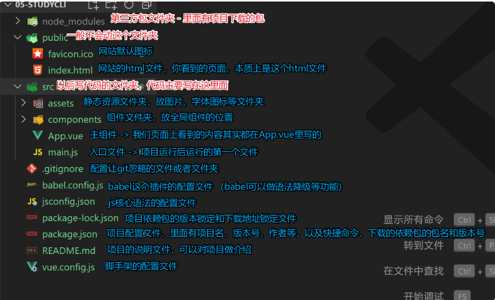​

### 关闭语法检查

```js
//vue.config.js中添加一条规则,脚手架4、5初始内容不一样
const { defineConfig } = require('@vue/cli-service')
module.exports = defineConfig({
  transpileDependencies: true,
  lintOnSave:false//加这个，其他不要动
}),
```

### 导入注册组件

* 规范：创建的组件要用大驼峰命名法，至少两个单词，首字母都要大写。
* 导入

  ```js
  import 组件名 from '组件的路径'
  // 例
  import son from './components/son.vue'
  // 如果导入的是.vue文件，那么在脚手架里，可以省略不写.vue
  import son from './components/son'
  ```
* 注册：和data平级

  ```js
  components: {
    组件名,//es6简写
    组件名:导入的名称
  }
  ```
* 使用：在需要用组件的地方写这个组件名的标签（目前而言写单标签和双标签效果一样）

  ```js
  <组件名 />
  <!-- 例 -->
  <son />
  ```

### 项目打包

* 打包命令：不一定是build，要看package.json里的scripts设置是怎么写的，如果写的是build:prod那就应该npm run build

  ```bash
  npm run build
  ```
* 配置相对路径：来到`vue.config.js`添加如下命令。`vue.config.js`是`vue`的系统设置文件。

  避免文件路径导致代码无法正常运行，最好把打包的`绝对路径`配置成`相对路径`

  ```js
  publicPath: './'
  默认情况下，脚手架打包时导入文件用的都是绝对路径里的'/'，也就代表根目录。那么不一定能找到我们使用到的文件，除非把代码就是放到根目录上才能运行。
  ```

### 打包成APP

　　打包app需要用到[HBuilderX](https://www.dcloud.io/hbuilderx.html) ，打开这个软件后如下图操作：

　　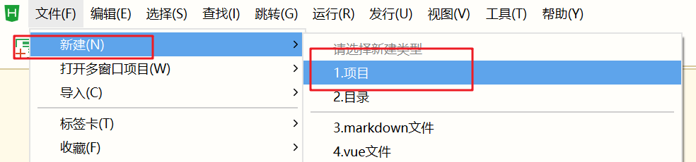​

　　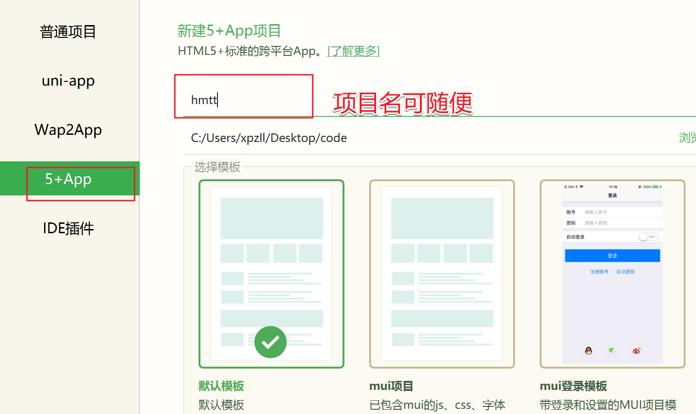​

　　项目创建完了后，把我们打包后的文件全部覆盖到新建的项目这里

　　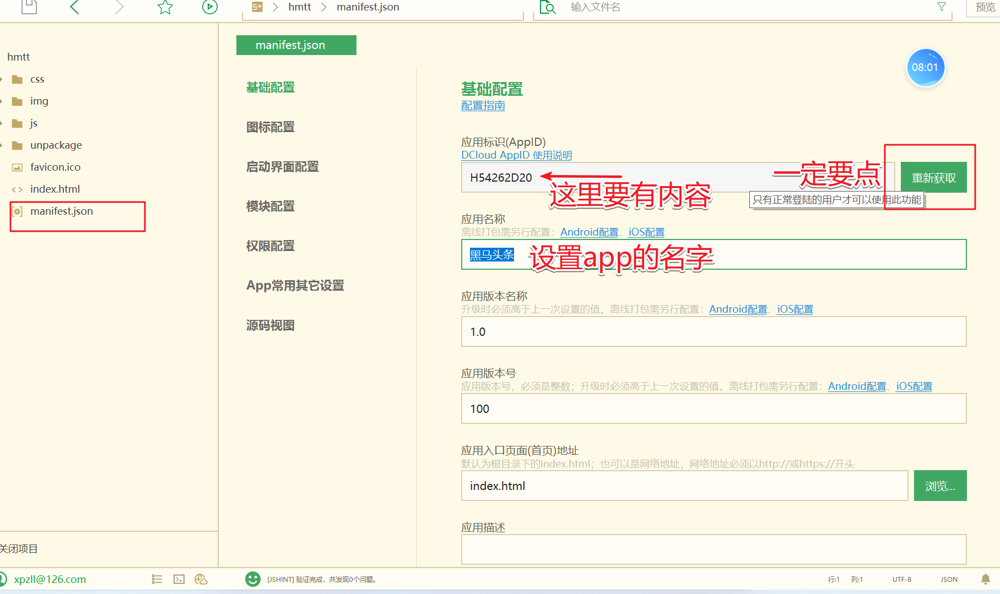​

　　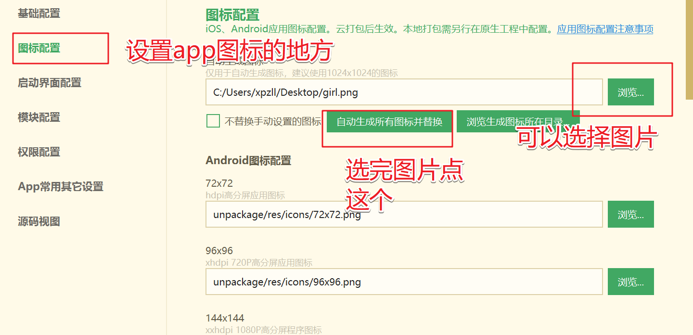​

　　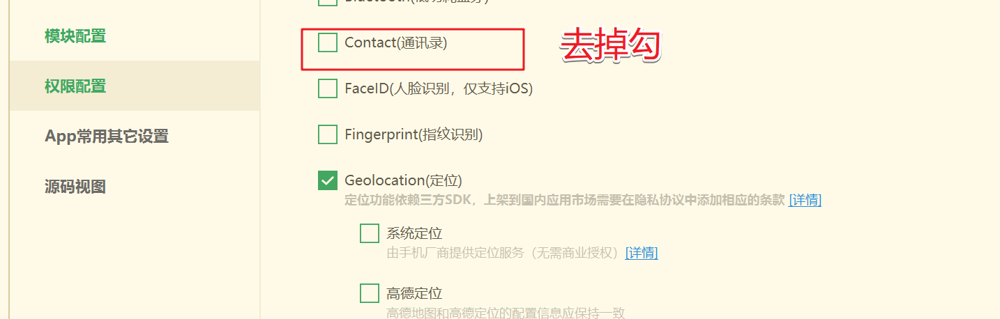​

　　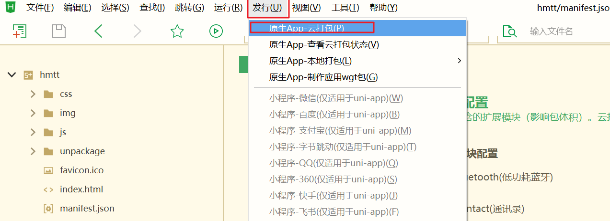​

　　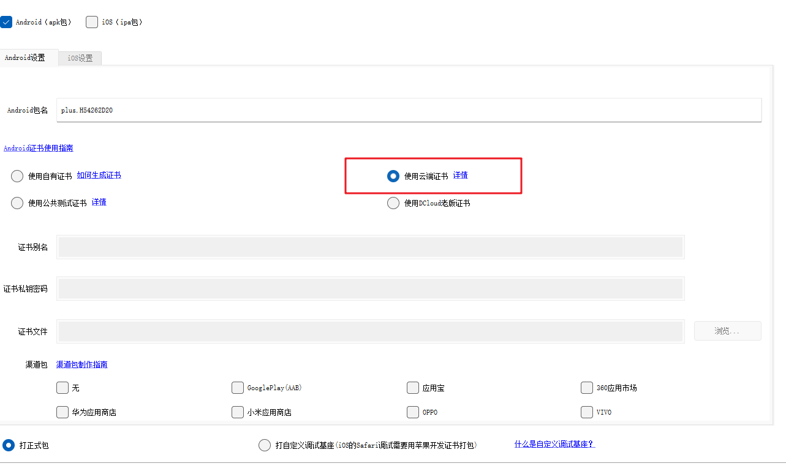​

　　‍
