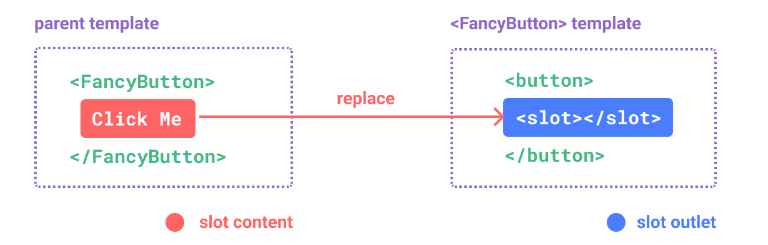
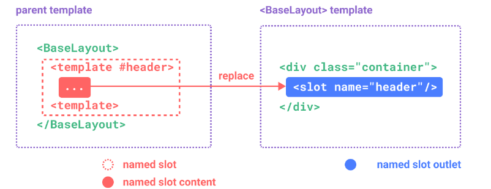

# vue3

# vue3

## 基本概念

### VNode

* 概念：VNode是一个类，通过属性来描述dom结构的对象
* ((20220804230831-aqm56so '节点概念'))

  ```js
  元素节点:div
  属性节点:class属性
  文本节点:标签内的文字
  注释节点:html中的注释
  ```
* 基本结构

  ```js
  export default class VNode {
    tag: string | void;
    data: VNodeData | void;
    children: ?Array<VNode>;
    text: string | void;
    elm: Node | void;
    ns: string | void;
    context: Component | void; // rendered in this component's scope
    functionalContext: Component | void; // only for functional component root nodes
    key: string | number | void;
    componentOptions: VNodeComponentOptions | void;
    componentInstance: Component | void; // component instance
    parent: VNode | void; // component placeholder node
    raw: boolean; // contains raw HTML? (server only)
    isStatic: boolean; // hoisted static node
    isRootInsert: boolean; // necessary for enter transition check
    isComment: boolean; // empty comment placeholder?
    isCloned: boolean; // is a cloned node?
    isOnce: boolean; // is a v-once node?

    constructor (
      tag?: string,
      data?: VNodeData,
      children?: ?Array<VNode>,
      text?: string,
      elm?: Node,
      context?: Component,
      componentOptions?: VNodeComponentOptions
    ) {
      /*当前节点的标签名*/
      this.tag = tag
      /*当前节点对应的对象，包含了具体的一些数据信息，是一个VNodeData类型，可以参考VNodeData类型中的数据信息*/
      this.data = data
      /*当前节点的子节点，是一个数组*/
      this.children = children
      /*当前节点的文本*/
      this.text = text
      /*当前虚拟节点对应的真实dom节点*/
      this.elm = elm
      /*当前节点的名字空间*/
      this.ns = undefined
      /*编译作用域*/
      this.context = context
      /*函数化组件作用域*/
      this.functionalContext = undefined
      /*节点的key属性，被当作节点的标志，用以优化*/
      this.key = data && data.key
      /*组件的option选项*/
      this.componentOptions = componentOptions
      /*当前节点对应的组件的实例*/
      this.componentInstance = undefined
      /*当前节点的父节点*/
      this.parent = undefined
      /*简而言之就是是否为原生HTML或只是普通文本，innerHTML的时候为true，textContent的时候为false*/
      this.raw = false
      /*静态节点标志*/
      this.isStatic = false
      /*是否作为跟节点插入*/
      this.isRootInsert = true
      /*是否为注释节点*/
      this.isComment = false
      /*是否为克隆节点*/
      this.isCloned = false
      /*是否有v-once指令*/
      this.isOnce = false
    }

    // DEPRECATED: alias for componentInstance for backwards compat.
    /* istanbul ignore next https://github.com/answershuto/learnVue*/
    get child (): Component | void {
      return this.componentInstance
    }
  }
  ```
* 重要的属性：((20220804230831-aqm56so '节点概念'))

  ```js
  TextVNode 文本节点。
  ElementVNode 普通元素节点。
  ComponentVNode 组件节点。
  EmptyVNode 没有内容的注释节点。
  CloneVNode 克隆节点，可以是以上任意类型的节点，唯一的区别在于isCloned属性为true
  ```

### 实例化

```js
main.js中设置
// 导入创建 vue 实例的方法
import { createApp } from 'vue'
// 导入根组件
import App from './App.vue'
// 创建 vue 实例（挂载了根组件），将实例渲染到 id 名为 app 的容器中
createApp(App).mount('#app')
```

### key的作用

```js
1.key 这个特殊的 attribute 主要作为 Vue 的虚拟 DOM 算法提示，在比较新旧节点列表时用于识别 vnode。
2.在没有 key 的情况下，Vue 将使用一种最小化元素移动的算法，并尽可能地就地更新/复用相同类型的元素。
3.如果传了 key，则将根据 key 的变化顺序来重新排列元素，并且将始终移除/销毁 key 已经不存在的元素。

4.当 text 变化时，<span> 总是会被替换而不是更新，因此 transition 将会被触发。
<transition>
  <span :key="text">{{ text }}</span>
</transition>
```

### 透传Attributes

* 概念：“透传 attribute”指的是传递给一个组件，却没有被该组件声明为`​ props`​​​ 或 `emits ​`​​​的`​ attribute ​`​​​或者 `v-on`​​​ 事件监听器。

  最常见的例子就是 `class`​​​、`style`​​​ 和 `id`​​​

  ```js
  attributes  标签的自带的特性
  props  标签传入的属性
  也就是说，在组件没有props 或者 emits 的情况下，父组件在使用该组件的时候，传入了 属性 或 事件，如下：
  <son class='red' @click="fn"></son>
  click通过v-bind绑定到了<son/>的根元素上，点击会触发父组件的fn，如果<son/>的click也绑定了事件，那么会一起被触发。
  ```
* 深层组件继承

  ```js
  组件的根节点使用另一个组件，该组件接收的透传attribute会直接继续传给在根节点组件
  如:在<son/>组件中使用另一个组件
  <template>
    <GrandSon/>  //<Son>组件接收的透传attributes给传给<GrandSon>,除非在<Son>中props和emits消耗了传来的attributes
  </template>
  ```
* 关闭透传：透传是自动开启的（关闭属性继承）

  ```js
  <script>
  // 使用普通的 <script> 来声明选项
  export default {
    inheritAttrs: false//关闭透传
  }
  </script>

  <script setup>
  // ...setup 部分逻辑
  </script>
  ```
* 传送门：依赖注入，利用`inheritAttrs:false`​​，使用`$attrs`​​来获得传入的attrs和事件

  ```js
  1.关闭attrs继承
  <script>
  export default {
    inheritAttrs: false//关闭透传
  }
  </script>

  2.控制获得的透传来的attributes
  这些透传进来的 attribute 可以在模板的表达式中直接用 $attrs 访问到。
  <span>{{ $attrs }}</span>
  props:  $attrs['foo-bar']  //会保留传入时候的大小写的
  如@click这样的一个 v-on 事件监听器将在此对象下被暴露为一个函数 $attrs.onClick
  ```
* 注意：`$attrs`​​没有显示绑定的话，会抛出警告

  ```js
  //只有一个根节点是没问题的
  <button></button>

  //有很多根节点模板里面，要绑定$attrs在那个节点上，不如vue会抛出警告
  //没有参数的 v-bind 会将一个对象的所有属性都作为 attribute 应用到目标元素上
  //即关闭了透传，我自己设置把透传绑定在内部的某个节点里面
  <header>...</header>
  <main v-bind="$attrs">...</main>
  <footer>...</footer>
  ```
* 在js中使用透传来的`attrs`​

  ```js
  1.这里的 attrs 对象总是反映为最新的透传 attribute，但它并不是响应式的 (考虑到性能因素)。
  2.不能通过侦听器去监听它的变化。
  3.如果你需要响应性，可以使用 prop。或者你可以使用 onUpdated() 使得在每次更新时结合最新的 attrs 执行副作用
  <script setup>
  import { useAttrs } from 'vue'
  const attrs = useAttrs()
  </script>
  ```

## 组合式API

### 组合式函数hook

* 概念：可以说是代替了vue2中的mixin混入。和react中的hook（钩子）一样。
* 官方解释：“组合式函数”(Composables) 是一个利用 Vue 的组合式 API 来封装和复用**有状态逻辑**的函数
* 混入的缺点

  ```js
  1.不清晰的数据来源：使用多个mixin时候，数据的来源就会不清晰。混入是导入注册就可以直接当属性或方法使用，一旦mixins多了，就不容易搞清楚那个属性是那个文件里面的
  2.命名空间会产生冲突：因为混入的时候不可以改名，一旦混入进来的文件多了，里面中的属性或方法名重复，那么就会发生命名冲突
  3.隐式的跨 mixin 交流：多个 mixin 需要依赖共享的属性名来进行相互作用，这使得它们隐性地耦合在一起
  ```
* 基本使用

  ```js
  1.创建相应的js文件
  2.里面写方法，也就是.vue文件中，js部分的内容，可以正常地导入vue中的生命周期等内容
  3.再暴露出去使用
  4.每个调用函数的组件实例都会创建独有的状态属性（即vue2中的mixin的使用，组件的使用不会影响到别的组件使用相同的mixin）
  5.组合式函数约定用驼峰命名法命名，并以“use”作为开头。
  ```

### 生命周期钩子

```js
//这些带on的都需要按需导入
import { ...on生命周期钩子函数 } from "vue"
setup()  //开始创建组件之前，在beforeCreate和created之前执行。创建的是data和method
组件挂载
onBeforeMount()  //组件挂载到节点上之前执行的函数。
onMounted()  //组件挂载完成后执行的函数。
组件数据更新
onBeforeUpdate()  //组件更新之前执行的函数。
onUpdated()  //组件更新完成之后执行的函数。
//组件销毁
onBeforeUnmount()  //组件卸载之前执行的函数。 //销毁的和vue2中差距较大
onUnmounted()  //组件卸载完成后执行的函数
//组件显示和隐藏
onActivated()  //被包含在中的组件，会多出两个生命周期钩子函数。被激活时执行。
onDeactivated()  //比如从 A 组件，切换到 B 组件，A 组件消失时执行。
onErrorCaptured()  //当捕获一个来自子孙组件的异常时激活钩子函数

//使用
onMounted(()=>{})
```

### setup函数

```js
setup函数没有this，在生命周期中，代替了vue2中的beforeCreated、create
//推荐使用
<script setup>
</script>
//当函数使用
<script>
  setup(){//在里面定义的方法或属性，在模板使用时候，需要return
    ...
    return{...}
  }
</script>
```

### ref函数

　　接受一个内部值，返回一个响应式的、**可更改的 ref 对象**，此对象只有一个指向其内部值的属性 `.value`​

　　可以创建对任意值得引用，并且不失去响应式

```js
import { ref }  from 'vue'
//可以是简单数据类型、也可以是复杂数据类型，如果将一个对象赋值给 ref，那么这个对象将通过 reactive() 转为具有深层次响应式的对象
let 变量名 =  ref(xxx)
let count =  ref(0)
let obj =  ref({count: 0})
//使用必须.value。复杂数据、简单数据都要.value

在模板中会自动解包，不在需要.value
<template>
  <div>{{ obj.count }}</div>
</template>
```

### reactive函数

　　**返回一个对象的响应式代理，返回的代理和原始对象是不相等的**。

```js
import { reactive }  from 'vue'
//创建响应式对象，不能创建简单数据类型，简单数据类型需要用ref来创建,不需要.value
//不能随意解构，会失去响应式
const obj = reactive({ count: 0 })
obj.count++
```

### computed函数

　　接受一个`getter函数`​，返回一个只读的响应式**`ref对象`**​，该`ref对象`​通过 `.value`​暴露`getter`​函数的返回值。它也可以接受一个带有`get`​和`set`​函数的对象来创建一个可写的 `ref对象`​。

　　**计算属性值会基于其响应式依赖被缓存，就是说使用计算属性的时候，里面的数字要是响应式数据，不然计算属性是没法生效的**

```js
import { computed } from "vue"
//只读
const count = ref(1)
const plusOne = computed(() => count.value + 1)
console.log(plusOne.value) // 2
plusOne.value++ // 错误
//可写
const count = ref(1)
const plusOne = computed({
  get: () => count.value + 1,//get这个地方return出去的
  set: (val) => {
    count.value = val - 1
  }
})
plusOne.value = 1 //返回的是ref对象，所以要点.value
console.log(count.value) // 0
```

### watch函数

　　侦听一个或多个响应式数据源，并在数据源变化时调用所给的回调函数。`watch()`​ 默认是懒侦听的，即仅在侦听源发生变化时才执行回调函数

　　计算属性computed函数是声明式地计算衍生值，在状态改变的时候，需要执行一些动作，如dom等，就可是使用watch侦听器。

```js
import { watch,ref,reacitve } from "vue"
watch(参数1，参数2，参数3)
参数1:一个函数，一个返回值(get函数)，ref对象，响应式对象，或他们组合的数组
参数2:回调函数(newValue,oldValue)=>{}
参数3:对象，是否开启深度侦听等
{deep:true,//深度侦听
immediate:true}//立即执行回调函数一次

注意：不能直接侦听响应式对象的属性值
// 错误，因为 watch() 得到的参数是一个 number
watch(obj.count, (count) => {console.log(`count is: ${count}`)})


let num = ref(0)
let obj = reactive({count:0})

getter函数侦听
watch(()=>obj.count,(newV,oldV)=>{})
注意，侦听getter函数时，不会自动开启深度侦听，侦听reactive对象时，会自动开启深度侦听
watch(obj,(newV,oldV)=>{})

ref对象侦听
watch(num,(newV,oldV)=>{})

侦听多个
watch([num1,num2],(newA,oldA)=>{})
```

　　‍

### nextTick

　　当你更改响应式状态后，DOM 会自动更新。注意 DOM 的更新并不是同步的。相反，Vue 将缓冲它们直到更新周期的 “下个时机” 以确保无论你进行了多少次状态更改，每个组件都只需要更新一次

```js
import { nextTick } from 'vue'
function increment() {
  state.count++
  nextTick(() => {
    // 访问更新后的 DOM
  })
}

```

## 组件

### 插槽

* 传送门：v-slot
* 设置插槽：`<son/>`​

  ```js
  <template>
    <slot>默认插槽--默认内容</slot>  //默认插槽，插槽名字默认是default。不使用该插槽的话，会显示默认内容
    <slot name='header'></slot>  //具名插槽
    <slot name='footer' :name='name' :age='age'></slot> //作用域插槽
  </template>
  ```
* 使用：引入组件，双标签使用，设置标签内内容

  ```js
  <template>
    <son>
      <template>我是内容，插入在默认插槽中</template>

      <template #header></template>//使用具名插槽，这里面的内容会显示在son组件中，具名插槽的位置
      <template v-slot:header></template>//使用具名插槽的简写方式

      <template #footer='obj'>{{obj.name}}</template>//作用域插槽，同时获得具名插槽传来的数据，可以进行解构
    </son>
  </template>
  ```

### 动态样式

* 行内样式写法

  ```html
  <div style='color:red'></div>
  <div class =" active classA "></div>
  ```
* 动态类名

  ```html
  <div :class="[calssA,classB]"></div>
  <div :class='{ classA:isShow , classB:show }'></div>
  ```
* 动态样式

  ```html
  <div :style='{ color:activeRed,fontSize:fonstSize + 'px' }'></div>
  ```

### 模板引用

* 概念：`ref`​​ 用于注册元素或子组件的引用

  ```js
  1.如果用于普通 DOM 元素，引用将是元素本身；如果用于子组件，引用将是子组件的实例
  2.因为 ref 本身是作为渲染函数的结果来创建的，必须等待组件挂载后才能对它进行访问  
  ```
* 设置

  ```js
  <script setup>
  import { ref } from 'vue'
  const p = ref()
  </script>

  <template>
    <p ref="p">hello</p>
  </template>
  <ChildComponent :ref="(el) => child = el" />
  ```
* 获得数据

  ```js
  <script setup>
  import { ref, onMounted } from 'vue'
  // 声明一个 ref 来存放该元素的引用
  // 必须和模板里的 ref 同名
  const input = ref(null)
  const son= ref(null)
  const listRef = ref([])//同时使用v-for的情况下，里面包含的是整个dom的数组

  //对dom操作要在实例化完成之后才行，不然会无法完成
  onMounted(() => {
    input.value.focus()
  })
  </script>
  <template>
    <input ref="input" />
    <son ref="son"></son>
    <div v-for="item in 999" :key="index" ref="listRef"></div>
  </template>
  ```
* 模板引用标注类型：模板引用需要通过一个显式指定的泛型参数和一个初始值 `null`​ 来创建

  ```html
  <script setup lang="ts">
  import { ref, onMounted } from 'vue'
  const el = ref<HTMLInputElement | null>(null)
  onMounted(() => {
    el.value?.focus()//可选链
  })
  </script>

  <template>
    <input ref="el" />
  </template>

  //方法二
  <!-- App.vue -->
  <script setup lang="ts">
  import MyModal from './MyModal.vue'

  const modal = ref<InstanceType<typeof MyModal> | null>(null)

  const openModal = () => {
    modal.value?.open()
  }
  </script>

  ```

### 动态组件

```js
is绑定的值 被注册的组件名、导入的组件
组件的切换会

<!-- currentTab 改变时组件也改变 -->
<component :is="tabs[currentTab]"></component>
```

### 异步组件

* 基本使用

  ```js
  提供一个回调，回调的返回值是一个promise对象，其中resolve的结果是一个组件
  import { defineAsyncComponent } from 'vue'

  const AsyncComp = defineAsyncComponent(() => {
    return new Promise((resolve, reject) => {
      // ...从服务器获取组件
      resolve(/* 获取到的组件 */)
    })
  })
  // ... 像使用其他一般组件一样使用 `AsyncComp`
  ```
* ES6动态导入：和以前使用动态导入组件是一样的。`()=>import('src')`​​

  ```js
  会得到一个被包装后的组件，仅在页面需要它渲染时才会调用加载内部实际组件的函数。
  <script setup>
  import { defineAsyncComponent } from 'vue'
  const AdminPage = defineAsyncComponent(() =>import('./components/AdminPageComponent.vue'))
  </script>

  <template>
    <AdminPage></AdminPage>
  </template>
  ```
* 组件加载错误情况

  ```js
  在组件加载的时候，提供了一个加载完成前的过渡组件，默认事件200ms，避免组件切换过快导致效果不佳
  还能在组件加载失败后，提供一个加载失败后的组件
  const AsyncComp = defineAsyncComponent({
    // 加载函数
    loader: () => import('./Foo.vue'),

    // 加载异步组件时使用的组件
    loadingComponent: LoadingComponent,
    // 展示加载组件前的延迟时间，默认为 200ms
    delay: 200,

    // 加载失败后展示的组件
    errorComponent: ErrorComponent,
    // 如果提供了一个 timeout 时间限制，并超时了
    // 也会显示这里配置的报错组件，默认值是：Infinity
    timeout: 3000
  })

  ```

### 全局组件注册

```js
app.component('MyComponent', defineAsyncComponent(() =>
  import('./components/MyComponent.vue')
))
```

### 组件传值

#### defineProps()

* 定义：只能在`<script setup>`​ 中使用的**编译器宏**

  ```js
  除了使用字符串数组来声明 prop 外，还可以使用对象的形式：
  let props = defineProps(['propA','propB'])

  let props = defineProps({
    // 基础类型检查
    // （给出 `null` 和 `undefined` 值则会跳过任何类型检查）
    propA: Number,
    // 多种可能的类型
    propB: [String, Number],
    // 必传，且为 String 类型
    propC: {
      type: String,
      required: true
    },
    // Number 类型的默认值
    propD: {
      type: Number,
      default: 100
    }
  })
  ```
* 父组件传值

  ```html
  //单个传值
  <son :propA="xxx"></son>

  //传递对象
  const post = {name:'zhangsan',age:20}
  <son v-bind="post" />
  <name :name="post.name" :age="post.age" />
  ```
* 注意：**props对象如果解构了，那就失去了响应式**，需要使用里面的值需要props.xxx

  ```js
  let props = defineProps(['propA','propB'])
  props.propA

  <template>
    <div>{{props.propA}}</div>
  </template>
  ```
* prop校验：可以声明对props的校验，当传入值不符合时，会在控制台抛出警告

  ```js
  defineProps({
    // 基础类型检查
    // （给出 `null` 和 `undefined` 值则会跳过任何类型检查）
    propA: Number,
    // 多种可能的类型
    propB: [String, Number],
    // 必传，且为 String 类型
    propC: {
      type: String,
      required: true
    },
    // Number 类型的默认值
    propD: {
      type: Number,
      default: 100
    },
    // 对象类型的默认值
    propE: {
      type: Object,
      // 对象或数组的默认值
      // 必须从一个工厂函数返回。
      // 该函数接收组件所接收到的原始 prop 作为参数。
      default(rawProps) {
        return { message: 'hello' }
      }
    },
    // 自定义类型校验函数
    propF: {
      validator(value) {
        // The value must match one of these strings
        return ['success', 'warning', 'danger'].includes(value)
      }
    },
    // 函数类型的默认值
    propG: {
      type: Function,
      // 不像对象或数组的默认，这不是一个工厂函数。这会是一个用来作为默认值的函数
      default() {
        return 'Default function'
      }
    }
  })

  ```
* 使用`ts语法`​在模板中使用默认值：需要进行[配置](https://vuejs.org/guide/extras/reactivity-transform.html#explicit-opt-in)

  ```js
  ts语法
  const { msg, moeny = 1111111 } = defineProps<{
    msg: String
    moeny?: Number
  }>()

  //配置
  // vite.config.js
  import { defineConfig } from 'vite'
  import vue from '@vitejs/plugin-vue'

  // https://vitejs.dev/config/
  export default defineConfig({
    plugins: [
      vue({
        reactivityTransform: true
      })
    ]
  })
  ```

#### defineEmits()

* 定义：只能在`<script setup>`​ 中使用的**编译器宏**。组件要触发的事件可以显式地通过 `defineEmits()宏`​来声明

  ```js
  <script setup>
  defineEmits()不能在子函数中使用。必须直接放置在<script setup>的顶级作用域下。
  const emit = defineEmits(['inFocus', 'submit'])
  function buttonClick() {
    emit('submit',value)//可以在该时间传入默认参数
  }
  </script>

  //另外一种方式
  <template>
    <div class="blog-post">
      <h4>{{ title }}</h4>
      <button @click="$emit('change')">Enlarge text</button>
      <button @click="$emit('enlarge-text',value)">Enlarge text</button>
    </div>
  </template>
  ```
* 使用：在父组件中触发该函数

  ```html
  <son @submit='fn'></son>

  fn(value){
    console.log(value)//value就是子组件传入的值
  }
  ```
* emits的ts写法

  ```js
  <script setup lang="ts">
  const emit = defineEmits<{
    (e: 'change', id: number): void
    (e: 'update', value: string): void
  }>()
  </script>
  ```
* emits事件校验：件可以被赋值为一个函数，接受的参数就是抛出事件时传入 `emit`​ 的内容，返回一个布尔值来表明事件是否合法

  ```js
  <script setup>
  const emit = defineEmits({
    // 没有校验
    click: null,

    // 校验 submit 事件
    submit: ({ email, password }) => {
      if (email && password) {
        return true
      } else {
        console.warn('Invalid submit event payload!')
        return false
      }
    }
  })

  function submitForm(email, password) {
    emit('submit', { email, password })
  }
  </script>

  ```

#### 依赖注入

* **provide()：提供**一个值，可以被后代组件注入。组件可以多次调用`provide()`​，为后代组件提供不同的数据。

  ```js
  <script setup>
    import { ref, provide } from 'vue'
    //参数一：注入名，一个字符串或者symbol
    //参数二：需要注入的值，any类型，也可以是响应式数据ref甚至是一个函数
    provide('key',value)
    
    // 提供静态值
    provide('foo', 'bar')
    
    // 提供响应式的值
    const count = ref(0)
    provide('count', count)
  </script>
  ```
* **inject()**：**注入**一个由祖先组件或整个应用提供的值，注入到自己的组件中。

  ```js
  inject(参数1，参数2，参数3)
  参数1:
  是祖先组件注入的key。Vue 会遍历父组件链，通过匹配 key 来确定所提供的值。
  如果父组件链上多个组件对同一个key提供了值，那么离得更近的组件将会“覆盖”链上更远的组件所提供的值。
  如果没有能通过 key 匹配到值，inject() 将返回 undefined，除非提供了一个默认值
  参数2:
  可选参数，即没有匹配到key使用的默认值。
  允许传入工厂函数来返回复杂的值，然后本身返回的是一个函数，那么第三个值应该为false
  参数3:
  默认返回值是函数的话，该参数为false

  <script setup>
  import { inject } from 'vue'
  // 注入值的默认方式
  const foo = inject('foo')
  // 注入响应式的值
  const count = inject('count')
  // 注入一个值，若为空则使用提供的默认值
  const value = inject('message', '这是默认值')
  // 注入一个值，若为空则使用提供的工厂函数来创建默认值，避免进行额外计算
  const value = inject('key', () => new ExpensiveClass())
  </script>
  ```
* 注意：接收方可以修改值，但是建议值的修改还是提供方来提供方法

  ```js
  1.建议注入的值由供给方来修改，即谁提供值，谁来提供修改的方法，可以把值和修改的方法一起提供，接收方获得方法来修改值
  <!-- 在供给方组件内 -->
  <script setup>
  import { provide, ref } from 'vue'
  //提供响应式的值
  const location = ref('North Pole')
  //提供值的修改方法
  function updateLocation() {
    location.value = 'South Pole'
  }
  provide('location', {//把值和修改方法一起提供出去
    location,
    updateLocation
  })
  </script>

  <!-- 在注入方组件 -->
  <script setup>
  import { inject } from 'vue'
  const { location, updateLocation } = inject('location')//把供方的值和修改方法一起解构
  </script>

  <template>
    <button @click="updateLocation">{{ location }}</button>
  </template>
  ```
* 依赖注入的只读设置

  ```js
  <script setup>
  import { ref, provide, readonly } from 'vue'
  const count = ref(0)
  provide('read-only-count', readonly(count))//使用readonly来包裹数据，设置数据为只读属性，避免后代使用时被修改
  </script>

  ```

#### defineExpose  

```js
//把方法和属性暴露出去，外界获得了这个组件dom，就可以使用这个组件里面的方法或属性
//不能像vue2中那样使用ref直接操作子组件的属性和方法了，因为你设置了setup，不设置的话，你是可以和以前一样使用的
<script setup>
let data = ref({data:data})
let fn = ()=>{}
defineExpose({
  data,
  fn
})
</script>
```

## 指令

### 自定义指令

* 传送门：vue2中的自定义指令

  ```js
  //指令的生命周期：绑定-插入-更新-更新结束-销毁
  bind:绑定时，类似于beforeMount,指令绑定于相应dom时执行，这时还没有完成渲染。
  inserted:指令所在dom添加到父节点时执行（类似于mounted,渲染时）。
  update:更新时，指令所在组件有更新时执行，并不保证指令所在dom更新完成。
  componentUpdated:更新完成时，指令所在组件包含子组件都更新时执行，类似于updated。
  unbind:销毁前，类似于destroyed,指令所在dom解决绑定时执行（v-if=false,或者指令所在组件销毁时执行，指令所在dom销毁时也会执行）

  //生命周期回调函数的参数
  bind(dom,obj,vnode){
  在bind即指令绑定到dom时触发该回调函数
  dom:指令所在dom
  obj:指令包含的属性，修饰符，指令名，值，其中value很重要，就是拿到绑定指令时传递的数据
  vnode:节点信息，指令所在组件的实例对象，其中context:指令所在组件的实例对象（指令所在组件的this）
  }
  ```
* 创建vue3自定义指令：在 `<script setup>`​ 中，任何以`v`​开头的驼峰式命名的变量都可以被用作一个自定义指令。

  ```js
  <script setup>
  // 对象式写法，全局可以写成函数形式，这个我不知道行不行写成函数
  // 全局的函数式写法，是mounted和updated生命周期一起的。
  const vFocus = {
    mounted: (el) => el.focus()
  }
  </script>

  <template>
    <input v-focus />
  </template>

  ```

* 自定义指令的钩子

  ```js
  const myDirective = {
    // 在绑定元素的 attribute 前或事件监听器应用前调用
    created(el, binding, vnode, prevVnode) {},
    // 在元素被插入到 DOM 前调用
    beforeMount(el, binding, vnode, prevVnode) {},
    // 在绑定元素的父组件及他自己的所有子节点都挂载完成后调用
    mounted(el, binding, vnode, prevVnode) {},
    // 绑定元素的父组件更新前调用
    beforeUpdate(el, binding, vnode, prevVnode) {},
    // 在绑定元素的父组件及他自己的所有子节点都更新后调用
    updated(el, binding, vnode, prevVnode) {},
    // 绑定元素的父组件卸载前调用
    beforeUnmount(el, binding, vnode, prevVnode) {},
    // 绑定元素的父组件卸载后调用
    unmounted(el, binding, vnode, prevVnode) {}
  }
  ```
* 参数：除了**`el`**​外，其他属性都是只读的

  ```js
  el：指令绑定到的元素。这可以用于直接操作 DOM。

  binding：一个对象，包含以下属性。
  value：传递给指令的值。例如在 v-my-directive="1 + 1" 中，值是 2。
  oldValue：之前的值，仅在 beforeUpdate 和 updated 中可用。无论值是否更改，它都可用。
  arg：传递给指令的参数 (如果有的话)。例如在 v-my-directive:foo 中，参数是 "foo"。
  modifiers：一个包含修饰符的对象 (如果有的话)。如 v-my-directive.foo.bar 中，修饰符对象是 { foo: true, bar: true }。
  instance：使用该指令的组件实例。
  dir：指令的定义对象。

  vnode：代表绑定元素的底层 VNode。
  prevNode：之前的渲染中代表指令所绑定元素的 VNode。仅在 beforeUpdate 和 updated 钩子中可用。


  <div v-example:foo.bar="baz">
  binding 参数会是一个这样的对象：
  {
    arg: 'foo',
    modifiers: { bar: true },
    value: /* `baz` 的值 */,
    oldValue: /* 上一次更新时 `baz` 的值 */
  }
  ```
* 注意：不建议在组件上直接使用自定义指令，和透传Attributes一样会作用在组件的根节点的  
  `vue3`​的`template`​下可以有多个根节点，`vue2`​只能有一个，不过还是建议`vue3`​就写一个根节点

  ```js
  1.自定义指令作用到根节点的时候，会抛出警告。
  2.和 attribute 不同，指令不能通过 v-bind="$attrs" 来传递给一个不同的元素
  ```

### v-text

```html
<span v-text="msg"></span>
<!-- 等同于 -->
<span>{{msg}}</span>
```

### v-html

```html
在单文件组件中，scoped样式是不会作用到v-html里面的内容
动态渲染任意的 HTML 是非常危险的，因为它很容易导致 XSS 攻击。
<div v-html="html"></div>
```

### v-show

```js
1.通过改变dom的display:none，来实现dom的显示和隐藏。
2.检查还是能看到dom结构,只是不会再进行渲染了。
3.v-show不支持在<template></template>中使用，也不能搭配v-else使用(template只是用来包裹标签，并不是实质的标签盒子)

<h1 v-show="ok">Hello!</h1>
```

### v-if

```js
1.和v-show一样，也是绑定的boolean值，不过v-if是实际的dom创造和销毁，条件改变会触发过渡效果
2.v-if和v-else插入的dom在dom结构上应该是平级的
3.vue3中v-if的优先级比v-for更高

<div v-if="type === 'A'">A</div>
<div v-else-if="type === 'B'">B</div>
<div v-else>Not A/B</div>
```

### v-for

```js
1.基于原始数据多次渲染元素或模板块。
2.v-for是就地更新元素，最好绑定key值，方便用来虚拟dom的更新
<div v-for="(item, index) in items" :key='index'></div>
<div v-for="(value, key) in object" :key='key'></div>
<div v-for="(value, name, index) in object" :key='index'></div>
```

### v-on

```js
1.用来给元素绑定事件侦听器，v-on的缩写就是@
2.用于普通元素，只能监听原生dom事件
3.用于自定义元素组件，则监听子组件触发的自定义事件
3.不传参数，绑定的事件处理函数有默认的fn(e)  e是事件对象
4.需要自己传参数则fn(value,$event)
5.使用对象语法时，不能使用修饰符
6.修饰符
.stop ——调用 event.stopPropagation()。
.prevent ——调用 event.preventDefault()。
.capture ——在捕获模式添加事件监听器。
.self ——只有事件从元素本身发出才触发处理函数。
.{keyAlias} ——只在某些按键下触发处理函数。如 .enter  .tab
.once ——最多触发一次处理函数。
.left ——只在鼠标左键事件触发处理函数。
.right ——只在鼠标右键事件触发处理函数。
.middle ——只在鼠标中键事件触发处理函数。
.passive ——通过 { passive: true } 附加一个 DOM 事件

<!-- 方法处理函数 -->
<button v-on:click="doThis"></button>
<!-- 动态事件 -->
<button v-on:[event]="doThis"></button>
<!-- 内联声明 -->
<button v-on:click="doThat('hello', $event)"></button>
<!-- 缩写 -->
<button @click="doThis"></button>
<!-- 使用缩写的动态事件 -->
<button @[event]="doThis"></button>
<!-- 不带表达式地阻止默认事件 -->
<form @submit.prevent></form>
<!-- 对象语法 -->
<button v-on="{ mousedown: doThis, mouseup: doThat }"></button>//绑定多个事件
```

### v-bind

```js
1.动态绑定attribute（特性），也可以是组件的prop（属性---所传入组件所需要的组件属性）
2.vue会优先对传入的值对prop进行匹配，然后才是attr，需要强制匹配prop或者attr可以使用修饰符
3.缩写 v-bind:src=''   ===   :src=''
修饰符：
.camel ——将短横线命名的 attribute 转变为驼峰式命名。
.prop ——强制绑定为 DOM property。3.2+
.attr ——强制绑定为 DOM attribute。3.2+

<!-- 绑定 attribute -->

<!-- 动态 attribute 名 -->
<button v-bind:[key]="value"></button>
<!-- 缩写 -->

<!-- 缩写形式的动态 attribute 名 -->
<button :[key]="value"></button>
<!-- 内联字符串拼接 -->
+

<!-- prop 绑定。“prop” 必须在子组件中已声明。 -->
<MyComponent :prop="someThing" />
<!-- 传递子父组件共有的 prop -->
<MyComponent v-bind="$props" />
<!-- XLink -->
<svg><a :xlink:special="foo"></a></svg>


<!-- class 绑定 -->
<div :class="{ red: isRed }"></div>
<div :class="[classA, classB]"></div>
<div :class="[classA, { classB: isB, classC: isC }]"></div>

<!-- style 绑定 -->
<div :style="{ fontSize: size + 'px' }"></div>
<div :style="[styleObjectA, styleObjectB]"></div>
<!-- 绑定对象形式的 attribute -->
<div v-bind="{ id: someProp, 'other-attr': otherProp }"></div>

<!-- 一般 style写法 即style内联写法 -->
<div style="color:red"></div>
```

### v-model

* 概念

  ```html
  1.在 表单输入元素 或 组件上 创建双向绑定。
  2.input、select、textarea、components
  3.修饰符
  .number  输入的字符转为数字类型（整数形式）。如果该值无法被 parseFloat() 处理，那么将返回原始值
  .lazy  侦听change事件而不是input事件
  .trim  移除输入内容两端空格
  .capitalize  输入的字符第一个大写

  v-model 会忽略任何表单元素上初始的 value、checked 或 selected attribute。
  它将始终将当前绑定的 JavaScript 状态视为数据的正确来源
  <input type="checkbox" id="jack" value="Jack" v-model="checkedNames">
  <label for="jack">Jack</label>
  <input type="checkbox" id="john" value="John" v-model="checkedNames">
  <label for="john">John</label>
  <input type="checkbox" id="mike" value="Mike" v-model="checkedNames">
  <label for="mike">Mike</label>
  ```
* v-model绑定的值

  ```js
  v-model会根据绑定的不同标签使用对应的dom属性和事件组合
  1.文本类型的 <input> 和 <textarea> 元素会绑定 value property 并侦听 input 事件
  2.<input type="checkbox"> 和 <input type="radio"> 会绑定 checked property 并侦听 change 事件；
  3.<select> 会绑定 value property 并侦听 change 事件
  ```
* 本质：和vue2中的v-model基本一样，`:modelValue`​​​​，`updata:modelValue`​​​​

  ```html
  //在表单元素中使用的时候
  <input :value="text"  @input="event => text = event.target.value">
  <input v-model="text">

  //在components中使用的时候
  <CustomInput v-model='searchText' />
  <CustomInput :modelValue="searchText"  @update:modelValue="newValue => searchText = newValue"/>
  <!-- CustomInput.vue -->
  <script setup>
  defineProps(['modelValue'])
  defineEmits(['update:modelValue'])
  </script>
  <template>
    <input :value="modelValue" @input="$emit('update:modelValue', $event.target.value)" />
  </template>
  将内部原生 input 元素的 value attribute 绑定到 modelValue prop
  输入新的值时在 input 元素上触发 update:modelValue 事件
  ```
* v-model的参数

  ```html
  默认情况下，v-model 在组件上都是使用 modelValue 作为 prop，并以 update:modelValue 作为对应的事件。
  可以通过给 v-model 指定一个参数来更改这些名字
  modelValue => xx  updata:madelValue => updata:xx
  <MyComponent v-model:title="bookTitle" />
  <!-- MyComponent.vue -->
  <script setup>
  defineProps(['title'])
  defineEmits(['update:title'])
  </script>

  <template>
    <input  type="text" :value="title"  @input="$emit('update:title', $event.target.value)"  />
  </template>
  ```
* 特殊attribute

  ```html
  1.true-value \ false-value 只能搭配v-model使用，是vue特有的attribute
  2.true-value和false-value是不会影响到表单本身的value特性，所以使用的时候确定表单时单选框 type='checkbox'
  <input
    type="checkbox"
    v-model="toggle"
    true-value="yes"
    false-value="no" />
  ```

### v-slot

* 概念：`<slot>`​​​ 元素是一个**插槽出口** (slot outlet)，标示了父元素提供的**插槽内容** (slot content) 将在哪里被渲染  
  ​​
* 渲染作用域：插槽内容**无法访问**子组件的数据，即父组件模板中的表达式只能访问父组件的作用域；子组件模板中的表达式只能访问子组件的作用域
* 默认内容

  ```js
  //父组件在使用该组件时候，没有传入数据，那么slot内部显示的是默认内容
  <button type="submit">
    <slot>
      Submit <!-- 默认内容 -->
    </slot>
  </button>
  ```
* 具名插槽：这类带 `name`​​​ 的插槽被称为具名插槽 (named slots)。没有提供 `name`​​​ 的 `<slot>`​​​ 出口会隐式地命名为“default”

  ​

  ```js
  //设置具名插槽
  <div class="container">
    <header>
      <slot name="header"></slot>
    </header>
    <main>
      <slot></slot>
    </main>
    <footer>
      <slot name="footer"></slot>
    </footer>
  </div>
  //使用
  <BaseLayout>
    <template v-slot:header>
      <!-- header 插槽的内容放这里 -->
    </template>
   <template #footer>
      <!-- footer插槽的内容放这里 -->
    </template>
  </BaseLayout>
  ```
* 作用域插槽

  ```js
  <div class="container">
    <header>
      <slot name="header" :title='title'></slot>
    </header>
  </div>

  <son>
    <template #header="obj">
      {{obj.title}}
    </template>
  </son>

  <son>
    <template #header="{title}">
      {{title}}
    </template>
  </son>
  ```

### v-pre

```js
跳过该元素及其所有子元素的编译。
元素内具有 v-pre，所有 Vue 模板语法都会被保留并按原样渲染。最常见的用例就是显示原始双大括号标签及内容
<span v-pre>{{ this will not be compiled }}</span>
```

### v-once

```js
仅渲染元素和组件一次，并跳过之后的更新。
在随后的重新渲染，元素/组件及其所有子项将被当作静态内容并跳过渲染。这可以用来优化更新时的性能
<!-- 单个元素 -->
<span v-once>This will never change: {{msg}}</span>
<!-- 带有子元素的元素 -->
<div v-once>
  <h1>comment</h1>
  <p>{{msg}}</p>
</div>
<!-- 组件 -->
<MyComponent v-once :comment="msg" />
<!-- `v-for` 指令 -->
<ul>
  <li v-for="i in list" v-once>{{i}}</li>
</ul>
```

### v-memo

```js
缓存一个模板的子树。在元素和组件上都可以使用。为了实现缓存，该指令需要传入一个固定长度的依赖值数组进行比较。
如果数组里的每个值都与最后一次的渲染相同，那么整个子树的更新将被跳过。
v-memo=any[]
<div v-memo="[valueA, valueB]">
  ...
</div>
当组件重新渲染，如果 valueA 和 valueB 都保持不变，这个 <div> 及其子项的所有更新都将被跳过。
实际上，甚至虚拟 DOM 的 vnode 创建也将被跳过，因为缓存的子树副本可以被重新使用。
v-memo 传入空依赖数组 (v-memo="[]") 将与 v-once 效果相同。

```

### v-cloak

```js
用于隐藏尚未完成编译的 DOM 模板。
当使用直接在 DOM 中书写的模板时，可能会出现一种叫做“未编译模板闪现”的情况：用户可能先看到的是还没编译完成的双大括号标签，直到挂载的组件将它们替换为实际渲染的内容
v-cloak 会保留在所绑定的元素上，直到相关组件实例被挂载后才移除。
配合像 [v-cloak] { display: none } 这样的 CSS 规则，它可以在组件编译完毕前隐藏原始模板。


<div v-cloak>
  {{ message }}
</div>
[v-cloak] {
  display: none;
}
```

## 内置组件

### KeepAlive

* 概念：可以用来缓存组件，保持组件不用时不被销毁
* 基本使用

  ```js
  <!-- 非活跃的组件将会被缓存！ -->
  <KeepAlive>
    <component :is="activeComponent" />
  </KeepAlive>
  ```
* 其他属性

  ```js
  include:包含那些可以缓存
  exclude:排除那些可以缓存
  include\exclude，会根据组件的name选项来进行匹配，需要缓存的话，就需要显式的声明一个name选项
  在 3.2.34 或以上的版本中，使用 <script setup> 的单文件组件会自动根据文件名生成对应的 name 选项，无需再手动声明。
  mix:最大缓存组件数量
  新增生命周期

  <script setup>
  import { onActivated, onDeactivated } from 'vue'
  //onActivated 在组件挂载时也会调用，并且 onDeactivated 在组件卸载时也会调用
  onActivated(() => {})
  onDeactivated(() => {})
  </script>

  <!-- 以英文逗号分隔的字符串 -->
  <KeepAlive include="a,b">
    <component :is="view" />
  </KeepAlive>

  <!-- 正则表达式 (需使用 `v-bind`) -->
  <KeepAlive :include="/a|b/">
    <component :is="view" />
  </KeepAlive>

  <!-- 数组 (需使用 `v-bind`) -->
  <KeepAlive :include="['a', 'b']">
    <component :is="view" />
  </KeepAlive>

  <KeepAlive :max="10">
    <component :is="activeComponent" />
  </KeepAlive>
  ```

### Teleport

* 概念：它可以将一个组件内部的一部分模板“传送”到该组件的 DOM 结构外层的位置去。
* 基本使用：把你这个单文件的某一部分dom`传送`​到别去dom之中

  ```js
  <Teleport> 接收一个 to prop 来指定传送的目标。
  to 的值可以是一个 CSS 选择器字符串，也可以是一个 DOM 元素对象。
  这段代码的作用就是告诉 Vue“把以下模板片段传送到 body 标签下”

  <button @click="open = true">Open Modal</button>
  <Teleport to="body">
    <div v-if="open" class="modal">
      <p>Hello from the modal!</p>
      <button @click="open = false">Close</button>
    </div>
  </Teleport>
  ```

### Suspense

* 概念：可以等待组件的异步操作，都成功之后再统一显示
* 基本使用

  ```js
  //Dashboard异步组件未成功获取，就先显示下面的 #fallback 插槽的内容。
  //异步成功之后， #fallback 状态结束，显示正常组件
  <Suspense>
    <!-- 具有深层异步依赖的组件 -->
    <Dashboard />

    <!-- 在 #fallback 插槽中显示 “正在加载中” -->
    <template #fallback>
      Loading...
    </template>
  </Suspense>
  ```
* 异步组件

  ```js
  1.在setup顶层中使用await
  <script setup>
  const res = await fetch(...)
  const posts = await res.json()
  </script>
  <template>
    {{ posts }}
  </template>

  2.使用defineAsyncComponent获取的组件
  import { defineAsyncComponent } from 'vue'
  const AsyncComp = defineAsyncComponent(() => {
    return new Promise((resolve, reject) => {
      // ...从服务器获取组件
      resolve(/* 获取到的组件 */)
    })
  })
  // ... 像使用其他一般组件一样使用 `AsyncComp`
  ```

# pinia

## 安装下载

* 下载

  ```js
  npm i pinia
  ```
* 挂载：创建实例并挂载

  ```js
  import { createApp } from 'vue'
  import App from './App.vue'
  // 导入 createPinia函数： 创建 pinia 对象
  import { createPinia } from 'pinia'
  // 创建一个 pinia 对象
  const pinia = createPinia()
  createApp(App).use(pinia).mount('#app')
  ```
* 创建文件：`src/store/couter.js`

  ```js
  // 导入 defineStore 函数：创建 pinia 的实例
  import { defineStore } from 'pinia'
  // 创建一个 store 函数
  // defineStore('store 实例的名称', { // store 实例的属性})
  const useCouterStore = defineStore('couter', {
    state: () => {
      return {
        // 定义一个状态：
        count: 110,
        name: '张三'
      }
    },
    getters: {},
    actions: {}
  })
  // 暴露 
  export default useCouterStore
  ```

## 模块化

　　核心思路就是在`store/index.js`​中导入其他的`store`​文件，然后暴露返回他们的实例化函数

* 暴露实例化函数

  ```js
  import useCountStore from "src/store/info.js"
  import useInfoStore from "src/store/info.js"
  export default function(){
    return {
      info:useInfoStore()
      count:useCountStore()
    }
  }
  ```
* 使用

  ```js
  import useStore from './store/index'
  let { info } = useStore()  // let info = useInfoStroe()
  ```

## 核心概念

　　‍

　　‍

### store

* 定义：`src/stroe/counter.js`

  ```js
  1.defineStore("storeName",{})//创建store实例的时候，必须传入storeName,storeName是唯一的

  import { defineStore } from 'pinia'
  export default const useCounterStore = defineStore('main', {
    state:()=>({}),
    actions:{},
    getters:{}
  })
  ```
* 使用：页面中创建`store`实例

  ```js
  import { useCounterStore } from '@/stores/counter'
  const counter = useCounterStore()//获得了这个store实例，利用点方法，使用里面的方法和属性

  //store是一个用reactive包裹的对象，不需要进行.value
  counter.name//属性
  counter.double//计算属性
  counter.fn()//方法
  ```
* 解构：像`setup` 中的`props` 一样， **我们不能对其进行解构 （直接解构不是响应式）**

  ```js
  //storeToRefs(store实例)
  //可以解构属性和计算属性，不会解构actions和其他非响应式数据。直接解构会失去响应式
  import { useCounterStore } from '@/stores/counter'
  import { storeToRefs } from 'pinia'//它将为任何响应式属性创建 refs
  const counter = useCounterStore()
  const {name,double} = storeToRefs(counter)//解构
  ```

### state

* 定义

  ```js
  import { defineStore } from 'pinia'
  const useStore = defineStore('storeId', {
    // 推荐使用 完整类型推断的箭头函数
    state: () => {
      return {
        // 所有这些属性都将自动推断其类型
        counter: 0,
        name: 'Eduardo',
        isAdmin: true,
      }
    },

    //或者
    state: () => ({
      // 所有这些属性都将自动推断其类型
      counter: 0,
      name: 'Eduardo',
      isAdmin: true,
    })
  })
  ```
* 使用

  ```js
  import useCounterStore from "@/store/counter.js"
  const counter = useCounterStore()
  counter.xxx
  //部分修改
  counter.xxx++//可以直接修改

  //多部分修改
  counter.$path({
    xxx:counter.xxx+1
    name:'zhansan'
  })
  ```

### getter

* 概念：pinia中的计算属性
* 定义：和state一样

  ```js
  import { defineStore } from 'pinia'
  const useStore = defineStore('storeId', {
    getter: {
      doubleCount:(state)=>{
        return state.counter * 2
      },
      //不传参，在ts中，使用this获得store内的值，需要明确返回值的类型
      doubleCount():number{
        return this.counter * 2//可以通过this访问
      }
    }
  })
  ```
* 使用：创建store实例，然后点出去

  ```js
  import useCounterStore from "@/store/counter.js"
  const counter = useCounterStore()
  <template>
    <div>{{counter.doubleCount}}</div>
  </template>
  ```

### actions

* 概念：可以异步和同步，用来操作pinia内的state数据
* 定义：和`methods`一样，可以自定义传参

  ```js
  import { defineStore } from 'pinia'
  const useStore = defineStore('storeId', {
    state:()=>({
      number:10
    })
    actions:{
      async getUserInfo(login, password) {
       this.number...
      },
    }
  })
  ```
* 使用：创建store实例，然后点出去，也可以解构使用

  ```js
  import useCounterStore from "@/store/counter.js"
  const counter = useCounterStore()
  fn(){
    counter.getUserInfo()
  }
  //解构写法
  let {getUserInfo} = counter
  ```
* API

  ```js
  订阅actons及其结果，执行顺序在action之前执行
  store.$onActions(({
       name, // action 的名字
       store, // store 实例
       args, // 调用这个 action 的参数
       after, // 在这个 action 执行完毕之后，执行这个函数
       onError, // 在这个 action 抛出异常的时候，执行这个函数
    })=>{
      after((result)=>{}),
      onError((error)=>{})
  })
  ```

### API

```js
1.重置状态到初始值
const store = useStore()
store.$reset()

2.修改状态(即修改state)
const store = useStore()
2.1直接修改，不推荐，state里面的方法最好使用actions里面的函数修改
store.age++

2.2$patch()
store.$petch({name:'李四',age:20})
store.$petch((state)=>{
  state.list.push()
  ...
})

3.替换
store.$state = { counter: 666, name: 'Paimon' }//替换该实例的state
pinia.state.value = {}//替换应用程序的整个状态

4.订阅状态
就是store的侦听器，在状态(state,getters)有改变后触发，一般用于数据保存
//组件销毁后，该组件上的sotroe.$subscribe(()=>{})也会销毁
store.$subscribe(callback, { detached: true })//第二个参数，代表组件销毁，这个订阅还在

5.解构响应式
如果直接从pinia中解构数据，会丢失响应式，storeToRefs可以保证解构出来的数据也是响应式的
只能解构属性，不能解构方法
import useCountStore from './store/count'
import { storeToRefs } from 'pinia'
const count = useCountStore()
const {name,age} = storeToRefs(count)//这样解构的数据，才能保持响应式
```

# router4

## 基本操作

### 配置路由

* 安装路由

  ```js
  npm i vue-router
  ```
* 创建路由：`src/router/index.js`

  ```js
  // 创建路由文件,导入创建路由对象的函数
  import { createRouter, createWebHashHistory } from 'vue-router'
  // vue3 中创建路由时，一定要指定路由使用的模式
  // history 模式：createWebHistory
  // hash 模块：createWebHashHistory
  // 创建路由对象
  const router = createRouter({
    // 设置路由对象的模式：
    history: createWebHashHistory(),
    // 配置路由规则
    routes: [
      { path: '/home', component: () => import('../views/Home.vue') },
      { path: '/login', component: () => import('../views/Login.vue') }
    ]
  })
  // 暴露路由对象
  export default router
  ```
* 导入vue实例：`main.js`

  ```js
  import { createApp } from 'vue'
  import App from './App.vue'
  // 导入路由文件
  import router from './router'

  createApp(App).use(router).mount('#app')
  ```

## 高端操作

### useRouter

```js
<script setup>
import { useRouter } from 'vue-router'
//所创建的router就是vue2中的this.$router
let router = useRouter()
function toHome () {
  router.push('/home?name=xjj&age=18')
}
function toHome () {
  router.push({
    name:'home',
    query:{
      name:'回首页'
    }
  })
}


</script>
<template>
  <h3>我是 Login</h3>
  <button @click="toHome">点我跳转到 home</button>
</template>
```

### useRoute

```js
<script setup>
import { useRoute } from 'vue-router'
//所创建的router就是vue2中的this.$route
let route = useRoute()
// 接收参数
console.log(route.query.name)
console.log(route.query.age)
</script>
<template>
  <h3>我是 home</h3>
</template>
```

# vite

### 创建项目

```bash
//会自动下载vite的，不需要npm i xxx
npm create vite
# or
yarn create vite

//快速创建项目
npm create vite vite-demo --template vue//创建普通vue项目
npm create vite vite-demo-ts --template vue-ts//创建基于ts模板的项目
```

### 配置代理

```js
// 配置代理
server: {
  proxy: {
    "/api": {
      target: "http://jsonplaceholder.typicode.com",
      changeOrigin: true,
      rewrite: (path) => path.replace(/^\/api/, ""),
    },
  },
},
```

### 环境变量

* 注意

  ```js
  在根目录新建:
  .env.development  //开发环境设置文件
  .env.production  //生产环境设置文件
  .env.test  //测试环境设置文件

  环境变量名必须以 VITE_APP 开头
  ```
* 开发环境

  ```js
  # 开发环境：.env.development
  NODE_ENV=development
  VITE_APP_ENV=development

  # 服务器地址
  VITE_APP_HOST=开发环境服务器地址

  # 基础路径
  VITE_APP_BASE=""

  # appID相关
  VITE_APP_APPID_WEIXIN=微信appID
  VITE_APP_APPID_ALIPAY=支付宝appID
  ```
* 生产环境

  ```js
  # 生产环境：.env.production 
  NODE_ENV=production
  VITE_APP_ENV=production

  # 服务器地址
  VITE_APP_HOST=生产环境服务器地址

  # 基础路径
  VITE_APP_BASE=""

  # appID相关
  VITE_APP_APPID_WEIXIN=微信appID
  VITE_APP_APPID_ALIPAY=支付宝appID
  ```

　　‍

　　‍
